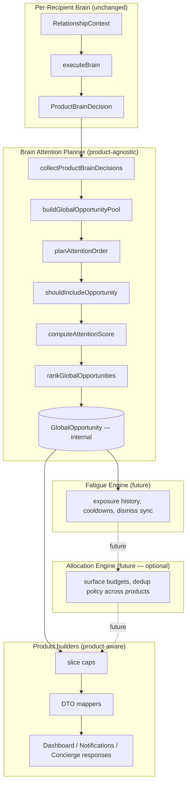

# 123 BRAIN ATTENTION PLANNER

## Document Status

Status: Official architecture reference

Phase: Integration Sprint 4 complete (4b–4f)

Depends on:

- 121 Brain Execution Pipeline
- 122 Brain Integration Plan
- `artifacts/api-server/src/brain/attention/`

---

# 1. Purpose

The **Brain Attention Planner** answers one product-agnostic question:

```text
Out of everything the Brain knows across all relationships,
what deserves the user's attention, and in what order?
```

It does **not** decide:

- Which product surface shows an opportunity
- How many items each surface receives
- How opportunities are labeled or linked in the UI
- Whether the user has seen an opportunity before (fatigue — future layer)

The planner is the **single source of truth for global attention ordering** among relationship Brain decisions.

---

# 2. Responsibilities

| Layer | Owns | Does not own |
|-------|------|--------------|
| **Per-relationship pipeline** (`executeBrain`) | Signals, rules, action plan, one decision per recipient | Cross-recipient ordering |
| **`ProductBrainDecision`** | Per-recipient public contract (v1) | Global rank across recipients |
| **Brain Attention Planner** | Collect decisions, build internal pool, filter inclusion, score, rank | Product caps, DTO mapping, surface names |
| **Product builders** | Cap, map ranked internal opportunities to product DTOs | Re-ranking or inclusion rules |
| **Routes** | Auth, HTTP contracts | Business logic |

---

# 3. Pipeline

## Per recipient (unchanged)

```text
RelationshipContext
  → Signal Extraction
  → NormalizedRelationshipState
  → DecisionContext
  → Rule Engine
  → Action Planner
  → ProductBrainDecision
```

## Cross-recipient (Sprint 4)

```text
collectProductBrainDecisions(userId, recipients)
  → ProductBrainDecision[]          (unfiltered, recipient order)

buildGlobalOpportunityPool(decisions, recipients)
  → GlobalOpportunity[]             (unranked internal pool)

planAttentionOrder(...)
  → shouldIncludeOpportunity()      (inside rankGlobalOpportunities)
  → computeAttentionScore()
  → rankGlobalOpportunities()
  → GlobalOpportunity[]             (ranked, included only)

Product builder
  → slice(product cap)              (outside planner)
  → map to Dashboard / Notifications / Concierge DTO

Route
  → JSON response

Frontend
  → ViewModel → UI
```

## Architecture diagram



---

# 4. Module layout

```text
artifacts/api-server/src/brain/attention/
├── collectProductBrainDecisions.ts   # batch executeBrain → ProductBrainDecision[]
├── shouldIncludeOpportunity.ts       # shared inclusion rules
├── buildGlobalOpportunityPool.ts     # wrap decisions as GlobalOpportunity
├── globalOpportunityTypes.ts         # internal GlobalOpportunity type
├── computeAttentionScore.ts          # parity scoring (rule priority + action priority)
├── rankGlobalOpportunities.ts        # filter, score, sort, assign globalRank
├── planAttentionOrder.ts             # public internal entry point
├── index.ts                          # module exports (server-internal)
└── README.md                         # contributor guidelines
```

**Naming note:** `brain/orchestrator.ts` runs the **per-relationship pipeline** (`executeBrain`). The **Brain Attention Planner** is `planAttentionOrder()` in `brain/attention/`. These are different layers.

---

# 5. Internal models

## GlobalOpportunity

Internal only — **never** serialized in public HTTP responses.

| Field | Owner | Sprint 4 state |
|-------|-------|----------------|
| `opportunityKey` | Pool builder (`recipientId:sourceRuleId`) | Set |
| `recipientId`, `recipientName` | Pool builder | Set |
| `decision` | References `ProductBrainDecision` (not mutated) | Set |
| `attentionScore` | Planner | Set after ranking |
| `globalRank` | Planner | 1..n among included items |
| `suppressionReason` | Planner / future fatigue | `null` in Sprint 4 |
| `metadata` | Future layers | Empty `{}` in Sprint 4 |

## Why GlobalOpportunity is internal

1. **Product surfaces consume different DTO shapes** — Dashboard exposes `sourceRuleId` and `outcome`; Notifications do not.
2. **Planner metadata is not user-facing** — scores and ranks are implementation details until a product explicitly maps them.
3. **Stable public contracts** — `DashboardBrainOpportunities`, `NotificationsResponse`, and `ConciergeWorkspaceResponse` remain versioned independently.
4. **Future fatigue** — exposure history attaches to internal opportunities without leaking persistence details to clients.

---

# 6. Public boundaries

## Exported to HTTP (product DTOs)

| Route | Contract | Ranking source |
|-------|----------|----------------|
| `GET /api/v2/dashboard/brain-opportunities` | `DashboardBrainOpportunities` | `planAttentionOrder` → cap 10 → map |
| `GET /api/v2/notifications` | `NotificationsResponse` | `planAttentionOrder` → cap 20 → map |
| `GET /api/v2/concierge` | `ConciergeWorkspaceResponse` | `planAttentionOrder` → cap 6 / 4 → map |
| `GET /api/v2/recipients/:id/brain` | `ProductBrainDecision` | Per-recipient only (not planner) |

## Not exported publicly

- `GlobalOpportunity`, `attentionScore`, `globalRank`, `suppressionReason`
- `brain/attention/*` is **not** re-exported from `brain/index.ts`
- Legacy rank utilities (`rankRelationshipOpportunities`, etc.) remain for tests and parity comparison only — **not** used by product builders in production

## Frontend

Product `*-brain` modules consume v2 DTOs only. No client access to `GlobalOpportunity` or planner internals.

---

# 7. Why products own caps

Caps are **presentation and surface policy**, not intrinsic attention worthiness.

| Surface | Cap constant | Location |
|---------|--------------|----------|
| Dashboard | 10 (`DASHBOARD_BRAIN_OPPORTUNITIES_MAX`) | Product builder |
| Notifications | 20 (`NOTIFICATIONS_MAX`) | Product builder |
| Concierge recommendations | 6 | Product builder |
| Concierge insights | 4 | Product builder |

The planner returns **all included opportunities in global rank order**. Each product builder applies its own `slice(0, MAX)` before mapping.

This keeps the planner product-agnostic and allows surfaces to diverge (e.g. notifications may eventually show a different subset than dashboard) without changing core ranking logic.

---

# 8. Why the planner remains product-agnostic

The planner must not import or reference:

- Dashboard, Notifications, Concierge, or any UI surface name
- Product cap constants (`DASHBOARD_*`, `NOTIFICATIONS_*`, `CONCIERGE_*`)
- DTO mappers or route handlers
- Frontend modules

**Benefits:**

- One ranked list — products consume the same attention order (before caps)
- Testable in isolation — parity tests compare against legacy rankers without product noise
- Future fatigue and allocation layers slot in without polluting product code
- Clear ownership — “what deserves attention” vs “how a surface displays it”

---

# 9. Production path (Sprint 4e+)

All three relationship product builders share:

```typescript
const decisions = await collectProductBrainDecisions({ userId, recipients, runBrain });
const ranked = planAttentionOrder({ decisions, recipients });
// product cap + DTO map
```

Inclusion and ordering happen **only** inside `planAttentionOrder`.

---

# 10. Future: Fatigue Engine

**Insert between planner and product mappers.**

```text
planAttentionOrder()
  → ranked GlobalOpportunity[]
  → Fatigue Engine (future)
  → filtered / re-scored opportunities
  → product mappers
```

**Responsibilities (future):**

- Exposure history (`surfacedBefore`, `lastShown`)
- Cooldowns and dismiss propagation across surfaces
- Suppression reasons tied to user behavior, not rule eligibility

**Not in planner because:** fatigue requires persistence and cross-request state; the planner stays a pure function in Sprint 4.

---

# 11. Future: Allocation Engine (optional)

**May sit after Fatigue Engine or replace ad-hoc cross-surface dedup.**

**Responsibilities (future):**

- Policy for which surfaces receive which opportunities from the ranked pool
- Intentional differentiation (e.g. urgent-only notifications vs full concierge list)
- Global daily attention budgets

**Not in planner because:** allocation is product/surface policy, not intrinsic attention ranking. Products currently all consume the same ranked prefix with different caps.

---

# 12. Parity mode (Sprint 4d)

`computeAttentionScore` reproduces ordering from legacy `rankRelationshipOpportunities`:

- `RULE_PRIORITY_BY_ID`
- Action plan priority (high > medium > low)
- `recipientId` lexicographic tie-break at sort time

No new scoring signals until explicitly designed and tested.

---

# 13. Architecture guard tests

`artifacts/api-server/src/__tests__/brain-attention-architecture.test.ts` prevents regression:

- Product builders must call `planAttentionOrder`
- Product builders must not import legacy rankers
- Planner source must not contain product names or caps
- `brain/index.ts` must not export attention internals

---

# 14. Related documents

- **122** — Brain Integration Plan (product migration sprints)
- **115** — Implementation Tracker (Sprint 4 status)
- **121** — Brain Execution Pipeline (per-relationship)
- **114–117** — Rules and decision framework

---

# 15. Definition of done (Sprint 4)

- [x] 4b — Extract `collectProductBrainDecisions`, `shouldIncludeOpportunity`
- [x] 4c — `GlobalOpportunity` pool
- [x] 4d — `planAttentionOrder` parity ranking
- [x] 4e — Product builders wired to planner
- [x] 4f — Documentation and architecture guards (this document)

**Next integration targets:** Fatigue Engine design, Concierge Conversation migration, legacy engine retirement (see 122).
