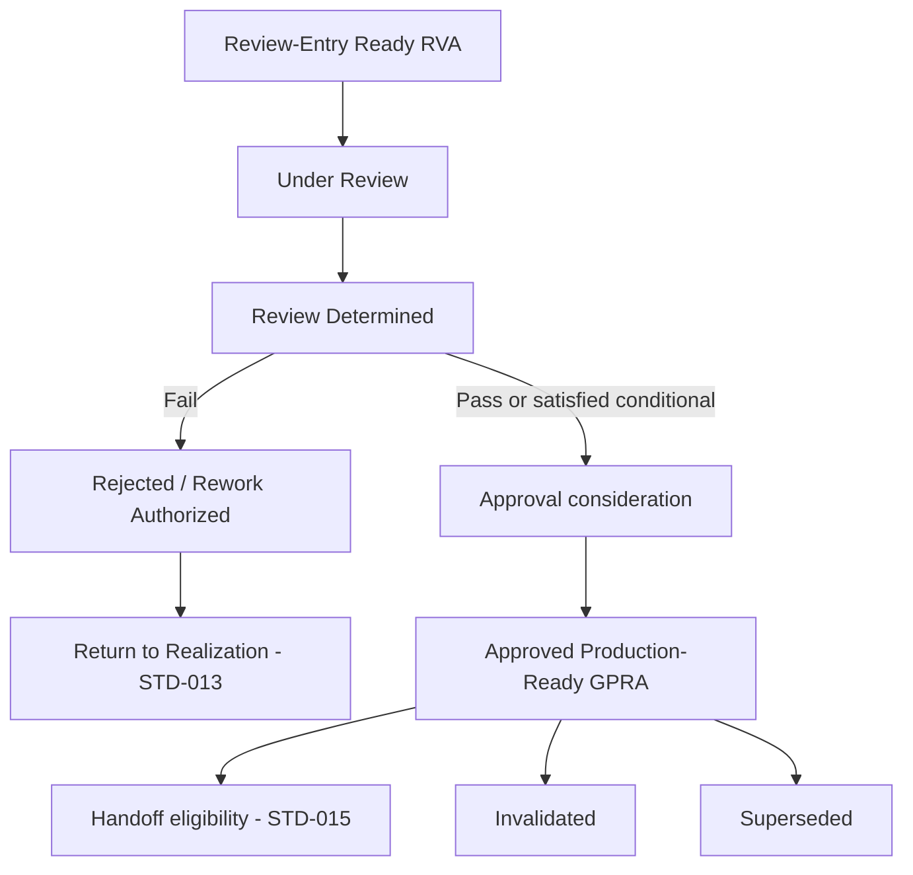

# F.I. Forgot Design Library — Volume 06

# Production Readiness Review and Approval Standard

## Document Control

| Field | Value |
|-------|-------|
| **Standard ID** | `FI-DSN-STD-014` |
| **Disposition** | Design Standard (`STD`) |
| **Primary Classification** | `CLS-CPR` — Creative Production Realization |
| **Secondary Classification** | `CLS-MFI` — Manufacturing Feasibility Integration (Design-Time Feasibility dimension only; subordinate to `CLS-CPR`) |
| **Primary Volume** | 06 — Creative Production |
| **Architectural domain** | Domain 3 — Review and Approval Authority (Layer B CP-03; Governed Handoff deferred to `FI-DSN-STD-015`) |
| **Document** | `04-production-readiness-review-and-approval-standard.md` |
| **Status** | Architecture Draft |
| **Version** | 0.1 Draft |
| **Date** | July 29, 2026 |
| **Freeze date** | — |
| **Branch** | `frontend-rebuild` |
| **Owner** | F.I. Forgot |
| **Approval status** | Not approved |
| **Binding status** | Not binding |
| **Register posture** | `Architecture Draft` (`FI-DSN-REG-001`) |
| **Queue posture** | EO 20 — **In progress** per Sprint V06-D5.4 requirement plan adoption (`FI-DSN-QUE-001`) |
| **Sprint** | V06-D14.1 |
| **Governing authority** | `FI-DSN-GOV-001` — Design Standards Governance (Frozen Governance Standard, Version 1.0, July 22, 2026) |
| **Parent architecture** | `playbook/design/volume-06-creative-production/01-creative-production-architecture.md` — Creative Production Architecture (Frozen Volume Governance, Version 1.0, July 29, 2026) |
| **Volume roadmap** | `FI-DSN-VOL-001` — Design Volume Roadmap (Frozen Design Volume Roadmap, Version 1.0, July 23, 2026) |
| **Classification reference** | `FI-DSN-CLS-001` — Design Classification Strategy (Version 1.1 Frozen, July 29, 2026) |
| **Classification expansion reference** | `FI-DSN-CLS-002` — Classification Expansion Decision (Version 1.0 Frozen) |
| **Metadata reference** | `FI-DSN-GOV-002` — Design Library Metadata Standard (Frozen Governance Standard, Version 1.0, July 22, 2026) |
| **Template reference** | `FI-DSN-TPL-001` — Design Standard Template (Frozen Governance Template, Version 1.0, July 22, 2026) |
| **Identifier reference** | `FI-DSN-ID-001` — Design Identifier System (Frozen Identifier System, Version 1.0, July 22, 2026) |
| **Register reference** | `FI-DSN-REG-001` — Design Planning Register (Frozen Planning Register, Version 1.0, July 22, 2026) |
| **Queue reference** | `FI-DSN-QUE-001` — Design Drafting Queue (Frozen Design Drafting Queue, Version 1.0, July 23, 2026) |
| **Epistemic reference** | `FI-DSN-GOV-003` — Evidence vs Company Judgment Governance (Frozen Governance Standard, Version 1.0, July 23, 2026) |
| **Brain authority reference** | `FI-DSN-GOV-004` — Brain Authority Boundary (Frozen Governance Standard, Version 1.0, July 23, 2026) |
| **Upstream Volume 06 standards** | `FI-DSN-STD-012` — Production Intent and Program Governance Standard (Frozen, Version 1.0, July 29, 2026); `FI-DSN-STD-013` — Artifact Realization Governance Standard (Frozen, Version 1.0, July 29, 2026) |
| **Upstream philosophy** | `FI-DSN-PRN-001` — Visual Philosophy Standard (Frozen Design Principle, Version 1.0, July 24, 2026) |
| **Upstream Volume 02 standards** | `FI-DSN-STD-001` — Brand Expression Standard; `FI-DSN-STD-002` — Typography Standard; `FI-DSN-STD-003` — Composition Standard (Frozen, Version 1.0) |
| **Upstream Volume 03 standards** | `FI-DSN-STD-004` — Card Architecture Standard; `FI-DSN-STD-005` — Surface Spatial Allocation Standard; `FI-DSN-STD-006` — Envelope and Exterior Presentation Standard (Frozen, Version 1.0) |
| **Upstream Volume 04 standards** | `FI-DSN-STD-007` — Brain Visual Selection Standard; `FI-DSN-STD-008` — Occasion and Emotional Context Standard; `FI-DSN-STD-009` — Personalization Policy Standard (Frozen, Version 1.0) |
| **Manufacturing reference** | Applicable frozen `FI-MFG-*` standards per Volume 01 — Design-Time Feasibility Compliance Boundary inputs only |
| **Downstream Volume 06 standard (deferred)** | `FI-DSN-STD-015` — Governed Handoff Standard (`Reserved, Not Drafted`) |
| **Supporting facts** | None — company judgment standard |
| **Vendor questions** | None |

**Standard statement:** F.I. Forgot maintains **one authoritative Production Readiness Review and Approval** standard that governs Decision-stage production-readiness Review, Review Determination, and Approval for Review-Entry Ready Realized Visual Artifacts — including design-time production-readiness feasibility evaluation, approved production-ready posture grant and retention, rejection, rework authorization at the Review layer, and post-approval Invalidated and Superseded posture — without governing artifact Realization, Governed Handoff, permanent collection membership, or operational manufacturing execution.

**Source basis:** Company judgment per `FI-DSN-GOV-003`. Applicable frozen `FI-MFG-*` obligations are consumed as Design-Time Feasibility Compliance Boundary inputs only. This architecture draft is not derived from product implementation, vendor facts, Brain runtime behavior, or engineering workflow design.

**Architecture posture:** Version 0.1 Architecture Draft. Independent architecture review **completed** (Sprint V06-D4.4; conditional findings corrected in Sprint V06-D4.4A). Architecture accepted for committed draft posture (Sprint V06-D4.5). Requirement planning **accepted** (Sprint V06-D5.1; Section 20; independent planning review **passed** after Sprint V06-D5.3 corrective). Requirement plan adopted for committed planning posture (Sprint V06-D5.4). `PD-STD-014-006` **resolved** (Sprint V06-D6.1; Section 20.12). Tranche 1 partial normative draft **committed** — G1 requirements `FI-DSN-STD-014-R01`–`R07` (Sprint V06-D7.1); G2 requirements `FI-DSN-STD-014-R08`–`R13` (Sprint V06-D8.1); G3 requirements `FI-DSN-STD-014-R14`–`R20` (Sprint V06-D9.1); G4 requirements `FI-DSN-STD-014-R21`–`R26` (Sprint V06-D10.1). `PD-STD-014-001` **resolved** (Sprint V06-D11.1; Section 20.15). G5 normative requirements **committed** — `FI-DSN-STD-014-R27`–`R33` (Sprint V06-D12.1; Section 21.5). `PD-STD-014-002`, `PD-STD-014-003`, and baseline `PD-STD-014-005` **resolved** (Sprint V06-D13.1; Sections 20.16–20.18). MAGAC establishment versus activation and Approval–GPRA baseline **clarified** (Sprint V06-D13.1A; Sections 20.16.3 and 20.18.4); `OQ-STD-014-004` **closed**; `OQ-STD-014-007` opened for G9. G6 normative requirements **drafted** — `FI-DSN-STD-014-R34`–`R43` (Sprint V06-D14.1; Section 21.6). G1 through G6 normative requirements drafted (`FI-DSN-STD-014-R01`–`R43`). G7–G11 normative requirement drafting remains **unauthorized** and **undrafted**. This document does not claim approval, freeze, binding authority, or effective status.

---

## 1. Constitutional Purpose

This standard exists to answer one constitutional problem at Volume 06 Layer B CP-03:

**How production-readiness is determined and authorized at design time for a Review-Entry Ready Realized Visual Artifact — and how that authorized posture may later be retained, lost, or succeeded — without absorbing pre-realization intent governance, artifact Realization, Governed Handoff, permanent collection membership, or operational manufacturing execution.**

Volume 06 architecture assigns Review, Approval, and GPRA definition to Domain 3. Layer B planning splits Domain 3 into two standards: this standard owns **Review and Approval** through approved production-ready posture; `FI-DSN-STD-015` owns **Governed Handoff** and Handoff Posture.

This architecture draft translates the accepted governing question into constitutional structure for later normative drafting. It does not replace frozen Volume 06 Creative Production Architecture, frozen `FI-DSN-STD-012`, frozen `FI-DSN-STD-013`, frozen upstream Volumes 01–04 standards, frozen `FI-DSN-GOV-004`, or deferred `FI-DSN-STD-015`.

---

## 2. Accepted Governing Question

The governing question was accepted through independent constitutional review in Sprint V06-D4.2. It is **locked** for subsequent STD-014 drafting unless a separately authorized amendment sprint changes it.

> What governance determines whether a Review-Entry Ready Realized Visual Artifact may receive and retain an approved production-ready posture at design time, while preserving separate authority over artifact Realization, Governed Handoff, permanent collection membership, and operational manufacturing execution?

**Governing-question lock:** Subsequent architecture refinement and normative drafting must remain reconcilable with this question.

---

## 3. Scope and Positive Authority

### 3.1 Principal subject

This standard governs **Production Readiness Review and Approval** — the constitutional Decision-stage structure for:

- **Production-readiness Review** — governed evaluation of a Review-Entry Ready RVA against mandatory Review dimensions
- **Review Determination** — the constitutional outcome of Review (pass, fail, or conditional determination where retained)
- **Approval** — the distinct Decision-stage act that may grant approved production-ready posture
- **Approved production-ready posture** — the constitutional state represented by a **Governed Production-Ready Artifact (GPRA)** at the Volume 06 layer
- **Design-Time Feasibility** — evaluation of production-readiness feasibility at design time as a Review dimension consuming `FI-MFG-*` Compliance Boundaries
- **Rejection** — Review-layer determination that an RVA is not eligible for Approval on documented grounds
- **Rework authorization** — Review-layer authorization for return to Realization without governing realization methods
- **Post-approval posture loss** — Invalidated and Superseded posture governing continued authority of a previously approved GPRA

### 3.2 Positive authority summary

| Authority domain | Architectural ownership |
|------------------|-------------------------|
| Review dimension architecture | Mandatory evaluation categories before Approval |
| Review evidence and evaluation posture | What Review evaluates; not how tools score |
| Review Determination | Pass, fail, and conditional determination posture |
| Approval authority | Decision-stage grant of production-ready posture |
| GPRA definition and instance binding | Specific RVA version bound under frozen policy |
| Rejection and rework at Review layer | Return triggers to Domain 2 without realizing artifacts |
| Invalidated and Superseded posture | Post-approval authority continuation or termination |
| GPRA succession | Authoritative GPRA per obligation and handoff context (consumption boundary for STD-015 only) |
| Design-Time Feasibility dimension | Design-time producibility evaluation; not manufacture |

### 3.3 Architectural principles (provisional)

| ID | Principle | Rule |
|----|-----------|-------------|
| **PRR-P1** | **Review is not Realization** | Review evaluates existing RVAs; it does not create or alter governed realization posture |
| **PRR-P2** | **Determination is not Approval** | A favorable Review Determination is necessary input to Approval; it is not itself production-ready posture |
| **PRR-P3** | **Approval is not membership** | GPRA status does not grant permanent collection membership (Volume 06 AX-2, P3) |
| **PRR-P4** | **Approval is not Handoff** | GPRA does not declare Handoff Posture or intake procedures (`FI-DSN-STD-015`) |
| **PRR-P5** | **Design-time readiness is not operational manufacture** | Satisfied Design-Time Feasibility at Approval is not Manufacturing Validation or Fulfillment Execution |
| **PRR-P6** | **Quality is multidimensional** | Review evaluates identity compliance, surface fit, contextual obligations, and Design-Time Feasibility — not aesthetic preference alone (Volume 06 P10) |
| **PRR-P7** | **Existence is not approval** | RVA existence and Review-Entry Readiness do not imply GPRA (Volume 06 AX-1, P2) |
| **PRR-P8** | **Decision policy is not runtime selection** | Volume 06 Approval is distinct from `CLS-BVS` / Brain Visual Selection Decision (`FI-DSN-GOV-004`) |
| **PRR-P9** | **Historical approval is preserved** | Invalidated and Superseded preserve historical fact of prior approval when constitutionally valid at grant time |
| **PRR-P10** | **Upstream law is consumed, not rewritten** | Review dimensions consume Volumes 01–04 and Domain 1–2 outputs as Compliance Boundaries |

---

## 4. Explicit Exclusions

This standard does **not** own:

| Subject | Authoritative owner |
|---------|---------------------|
| Declared Production Intent, Production Program, Production Obligation establishment | `FI-DSN-STD-012` |
| Exploration-Entry Authorization, waivers, and Domain 1 posture | `FI-DSN-STD-012` |
| Exploration Posture operation, Realization commitment, RVA existence | `FI-DSN-STD-013` |
| RVA version lineage, iteration, method-neutral realization paths | `FI-DSN-STD-013` |
| Realization Traceability Package creation | `FI-DSN-STD-013` |
| Review-Entry Readiness creation | `FI-DSN-STD-013` |
| Governed Handoff, Handoff Posture, intake consumer classes | `FI-DSN-STD-015` |
| Permanent collection membership and collection lifecycle | `FI-DSN-STD-010`, `FI-DSN-STD-011` / Volume 05 |
| Contextual selection and authorized alternatives | `FI-DSN-STD-007` |
| Occasion and emotional context semantics | `FI-DSN-STD-008` |
| Personalization policy | `FI-DSN-STD-009` |
| Visual permission and identity eligibility | Volume 02 |
| Surface structure and spatial allocation | Volume 03 |
| Metadata field semantics and provenance schema | `FI-DSN-GOV-002` |
| Manufacturing Validation mechanics and Fulfillment Execution | Volume 01 operational layer / engineering |
| Brain runtime recommendation, ranking, and customer Selection | `FI-DSN-GOV-004` / product implementation |
| Product UI, DAM workflows, APIs, databases, prompts, models | Engineering specifications |

---

## 5. Constitutional Entry Boundary

STD-014 authority begins only when upstream Domain 2 outputs satisfy the **Review-Entry Ready** entry posture per frozen `FI-DSN-STD-013`.

### 5.1 Minimum upstream inputs

| Input | Source | Consumption |
|-------|--------|-------------|
| **Review-Entry Ready RVA** | `FI-DSN-STD-013` | Hard entry gate — Review does not commence on non-ready artifacts |
| **Realization Traceability Package** | `FI-DSN-STD-013` | Review evidence — consumed, not recreated |
| **RVA Version Lineage** | `FI-DSN-STD-013` | Attribution and succession context |
| **Production Obligation attribution** | `FI-DSN-STD-012` / `FI-DSN-STD-013` | Scope binding for Review and Approval |
| **Current Program and bound Compliance Boundaries** | `FI-DSN-STD-012` | Review constraint inputs |
| **Applicable upstream Compliance Boundaries** | Volumes 01–04 via Domain 1–2 binding | Review dimension inputs |

### 5.2 Entry boundary rules (architectural)

- Review-Entry Readiness is a **Domain 2 output**, not a Review Determination. STD-014 consumes it; STD-014 does not grant it.
- Missing or incomplete traceability material relevant to Review may block Review commencement or yield fail/conditional determination — without re-opening Domain 2 authority except through governed rework return.
- STD-014 does not invent operational intake procedures, queue mechanics, or system workflows for Review entry.

### 5.3 Upstream context without absorption

Production Intent and Production Program context inform Review scope and Compliance Boundary evaluation. STD-014 consumes Domain 1 posture; it does not govern Intent Change, Program Amendment, or Obligation establishment.

---

## 6. Review Architecture

### 6.1 Review as a governed evaluation stage

**Review** is the constitutional stage in which a Review-Entry Ready **Realized Visual Artifact (RVA)** is evaluated against mandatory **Review dimensions** under frozen Decision-stage policy. Review produces evidence and a **Review Determination**; it does not grant production-ready posture.

Review is distinct from:

- **Realization** — which brings an artifact into governed existence as an RVA
- **Approval** — which may grant GPRA status after eligible Review Determination
- **Brain Visual Selection** — runtime selection within Preference Surfaces
- **Manufacturing Validation** — operational pre-fulfillment checks

### 6.2 Review dimensions (architectural categories)

Volume 06 architecture requires multidimensional Review (P10). Provisional dimension categories for normative drafting:

| Dimension category | Principal concern | Typical upstream source |
|--------------------|-------------------|-------------------------|
| **Identity and character compliance** | Whether the artifact complies with visual permission and identity rules in final form | Volume 02 |
| **Surface and spatial fit** | Whether the artifact respects structural, spatial, and exterior presentation obligations | Volume 03 |
| **Contextual and personalization obligations** | Whether required contextual metadata and personalization constraints are satisfied | Volume 04 |
| **Design-Time Feasibility** | Whether the artifact appears compatible with known manufacturing constraints at design time | `FI-MFG-*` Compliance Boundaries (`CLS-MFI`) |

This architecture identifies categories only. It does not prescribe scoring systems, checklists, UI workflows, or tool configuration.

### 6.3 Review evidence

Review evaluates the RVA instance and its inherited **Realization Traceability Package** without reinterpreting Domain 2 realization decisions. Review evidence is constitutional record sufficient to support a Review Determination — not an implementation schema.

### 6.4 Relationship to Review Determination

Review concludes in a **Review Determination** — a recorded constitutional outcome distinct from the Review activity itself. No GPRA exists until a separate Approval act succeeds under governing rules.

---

## 7. Review Determination Architecture

### 7.1 Constitutional role

**Review Determination** records the outcome of Review for a specific RVA version under a defined Production Obligation scope. It is the mandatory gate before Approval may be considered.

### 7.2 Outcome families (Volume 06 aligned)

| Outcome | Architectural meaning | Forward posture |
|---------|----------------------|-----------------|
| **Pass** | RVA eligible for Approval consideration | Approval may proceed if other governing rules satisfied |
| **Fail** | **Failed Review Determination** — RVA not eligible for Approval on documented grounds | Rework return path to Realization; no GPRA |
| **Conditional determination** | Approval permitted only after documented conditions satisfied; conditions must not narrow upstream Compliance Boundaries | If conditions remain unsatisfied, rework return path; no GPRA until conditions satisfied and Review passes |

Volume 06 architecture §12.1 permits conditional pass constitutionally. Layer B standards may narrow or retain conditional determination at normative freeze.

### 7.3 Conditional determination resolution (`OQ-V06-006`)

| ID | Question | Architecture posture |
|----|----------|---------------------|
| `OQ-V06-006` | Should conditional Review Determination be retained or collapsed to pass/fail only at Layer B standard freeze? | **Closed** (Sprint V06-D11.1) — Conditional retained as a completed Determination outcome family per frozen Volume 06 §12.1; resolved via planning decision `PD-STD-014-001` (Section 20.15) |

### 7.4 Distinction from Approval

A pass or satisfied conditional pass is **necessary** input to Approval but does not **constitute** Approval. STD-014 architecture preserves the two-step constitutional sequence: Review Determination → Approval → GPRA.

---

## 8. Approval Architecture

### 8.1 Approval as distinct Decision-stage act

**Approval** is the constitutional act that may grant **approved production-ready posture** by binding a specific RVA version as a **Governed Production-Ready Artifact (GPRA)** under frozen Decision-stage policy.

Approval is distinct from:

- **Review Determination** — evaluative outcome, not authorization
- **Brain recommendation** — runtime input only
- **Customer Selection** — contextual application, not production-readiness grant
- **Workflow advancement** — operational state is not constitutional policy (Volume 06 AX-5)

### 8.2 Approval authority (conceptual)

Volume 06 architecture assigns **Approval authority** to Domain 3 Decision-stage policy. This architecture anticipates **constitutionally authorized Decision-stage authority classes** with explicit scope boundaries per planning decision `PD-STD-014-002` (Section 20.16) — distinct from Brain Runtime, engineering role assignment, operational workflow permission, Reviewer participation, or Review Determination recording.

The specific authority class architecture is **resolved at planning layer** (`PD-STD-014-002`). Normative drafting will freeze governed authority classes and scope boundaries without prescribing organizational roles, product UI, or implementation permission systems.

### 8.3 Approval withholding

Architecture anticipates that Approval may be withheld despite a **Pass** **Review Determination** when separate governing rules require withholding on documented constitutional grounds per planning decision `PD-STD-014-003` (Section 20.17). Withholding does **not** reopen, revise, or substitute for the recorded **Review Determination**; a different outcome requires a subsequent governed **Review** under G5.

### 8.4 Instance binding

Each Approval act binds a **specific RVA version** as a GPRA for a defined Production Obligation scope under frozen policy. Approval is instance-level authorization for downstream Handoff eligibility — not a new Preference Surface and not Brain Visual Selection authority (Volume 06 §16.5).

---

## 9. Approved Production-Ready Posture

### 9.1 GPRA terminology

At the Volume 06 constitutional layer, **approved production-ready posture** is represented by a **Governed Production-Ready Artifact (GPRA)** — the sole canonical output of the Approval stage per Volume 06 architecture §5 and §12.

Bare "production-ready" without constitutional qualification is prohibited at the Volume 06 layer.

### 9.2 What GPRA signifies

A GPRA signifies that:

- The bound RVA version passed all mandatory Review dimensions including Design-Time Feasibility at Approval time
- Decision-stage production-readiness policy authorizes the artifact for **downstream Handoff eligibility** consideration
- The artifact is **not** automatically a permanent collection member, Fulfillment-Ready, or operationally manufactured

### 9.3 What GPRA does not signify

A GPRA does **not** signify:

- Permanent collection membership (Volume 05 / `FI-DSN-STD-010`)
- Handoff Posture declaration (`FI-DSN-STD-015`)
- Successful physical manufacture or shipment
- Manufacturing Validation pass
- Brain or customer selection authorization

### 9.4 Version, obligation, and lineage scope

GPRA posture is **artifact-specific** and **version-specific**:

- Approval binds a particular RVA version under a Production Obligation scope
- Historical GPRAs may exist for successive RVA versions over time
- For a given Production Obligation and Handoff consumer context, Volume 06 architecture anticipates **one authoritative GPRA at a time** unless future Layer B law permits otherwise (§5.11)

Lineage and succession rules connect GPRA posture to prior RVA versions without re-opening Domain 2 existence criteria.

### 9.5 Relationship to downstream Handoff

GPRA is a **necessary** upstream condition for Governed Handoff eligibility. STD-014 produces GPRA and validity posture; STD-015 declares Handoff Posture toward Volume 05 and production-catalog consumers.

---

## 10. Retention, Loss, Invalidation, and Supersession

### 10.1 Retention

**Retention** is the continued forward authority of an approved GPRA that still satisfies governing law and applicable Compliance Boundaries at evaluation time. Retention is the default post-approval posture until Invalidated or Superseded applies.

### 10.2 Invalidated posture

**Invalidated** means the GPRA no longer satisfies governing law or required Compliance Boundaries. Architectural characteristics per Volume 06 §5.9:

- Historical fact of approval is **preserved** — prior approval was valid when granted
- Forward Handoff and new intake on Invalidated authority is **not** permitted
- Existing downstream use is **not automatically revoked** — governed separately by Volume 05, engineering, and operational policy
- New Review and Approval is required before a replacement GPRA

Triggers include material upstream Compliance Boundary change and other governing-law failures — detailed triggers deferred to normative drafting.

### 10.3 Superseded posture

**Superseded** means a newer authoritative GPRA has replaced this GPRA for a defined Production Obligation or Handoff context. Architectural characteristics:

- Historical fact of prior approval is **preserved**
- Prior Handoff authority **ceases for forward use** in the superseded context
- The replacing GPRA governs forward intake when otherwise eligible

Supersession does not assert that the earlier approval was invalid when granted.

### 10.4 Terminology note (`OQ-STD-014-003`)

Architecture uses **Invalidated** and **Superseded** as the peer-separated post-approval GPRA postures per frozen Volume 06 §5.9. **Invalidation** and **supersession** name those constitutional loss mechanisms at this layer. **Withdrawal** and **revocation** are not separately defined postures in this architecture draft — whether Layer B treats them as distinct acts, umbrella terms, or operational labels for Invalidated or Superseded posture remains intentionally deferred to normative drafting (`OQ-STD-014-003`).

### 10.5 Changed upstream context

Material changes to Production Intent, Program structure, Compliance Boundaries, or manufacturing feasibility posture may affect GPRA retention. STD-014 governs the **production-readiness response**; Domain 1 amendments remain `FI-DSN-STD-012` authority; realization rework remains `FI-DSN-STD-013` authority when Review-layer rework is authorized.

---

## 11. Rejection and Rework Boundary

### 11.1 Review-layer rejection

**Rejection** is a Review Determination outcome (fail) or explicit rejection posture that documents why an RVA is not eligible for Approval. Rejection does not delete the RVA; it terminates forward Review-to-Approval progression for that determination cycle.

### 11.2 Rework authorization

**Rework** is not a separate forward lifecycle stage. It is a governed **return path** from Review to Realization:

- Failed Review Determination → Realization (same or successor Production Obligation)
- Unsatisfied conditional determination → Realization until conditions can be satisfied

STD-014 **authorizes** rework at the Review layer as an external trigger consumed by `FI-DSN-STD-013` (per `FI-DSN-STD-013-R32`). STD-014 does not govern realization methods, successor RVA creation mechanics, or iteration discipline — those remain Domain 2.

### 11.3 Authority split

| Layer | Owns |
|-------|------|
| **STD-014** | Review Determination, rejection, rework **authorization** at Review |
| **STD-013** | Rework **consumption**, successor RVA production, iteration within obligation bounds |

---

## 12. Design-Time Feasibility Boundary

### 12.1 Four-concept separation (Volume 06 §13)

| Concept | Owner | Meaning |
|---------|-------|---------|
| **Design-Time Feasibility** | Volume 06 — Review dimension | Artifact appears compatible with known manufacturing constraints at design time |
| **Governed Production-Ready (GPRA)** | Volume 06 — Approval output | RVA passed Review including Design-Time Feasibility; authorized for Handoff eligibility |
| **Manufacturing Validation** | Engineering / operational | Pre-fulfillment checks that a specific instance can be produced |
| **Fulfillment Execution** | Volume 01 operational | Order execution and shipment |

### 12.2 Architectural rules

- GPRA **requires** satisfied Design-Time Feasibility at Approval time (Volume 06 §13)
- GPRA does **not** require successful physical manufacture
- Manufacturing Validation may block Fulfillment even when GPRA exists
- STD-014 evaluates Design-Time Feasibility as a Review dimension consuming `FI-MFG-*` Compliance Boundaries — it does not restate `FI-MFG-*` operational policy
- `CLS-MFI` secondary classification reflects material governance of this dimension; `CLS-CPR` remains primary

### 12.3 Compliance Boundary change

Manufacturing capability change follows Research Library and `FI-DSN-GOV-003` propagation before Design policy change. Affected GPRAs may move to Invalidated posture. The architectural trigger thresholds remain open (`OQ-STD-014-005`).

---

## 13. Downstream Handoff Boundary

### 13.1 What STD-015 may consume (conceptual outputs)

STD-014 is expected to produce constitutional outputs for `FI-DSN-STD-015` consumption without defining Handoff procedures:

| Output | Description |
|--------|-------------|
| **GPRA identity** | Which RVA version holds approved production-ready posture |
| **Approval evidence** | Documentary basis for the Approval act |
| **Current validity posture** | Whether GPRA is forward-active, Invalidated, or Superseded |
| **Production Obligation attribution** | Scope binding for Handoff context |
| **Lineage and traceability references** | Pointers to inherited Realization Traceability Package posture |
| **Authoritative GPRA posture** | Which GPRA is authoritative per obligation and consumer context |

### 13.2 Prohibited absorption

STD-014 does **not** define:

- Handoff Posture or consumer classes (library intake vs production catalog)
- Volume 05 intake procedures or membership admission
- Production catalog implementation or engineering handoff APIs
- Auditable transition rules at intake boundaries (`FI-DSN-STD-015` principal subjects)

---

## 14. Authority and Decision Separation

| Concern | Authoritative owner | STD-014 relationship |
|---------|---------------------|----------------------|
| Brain Visual Selection / runtime recommendation | `FI-DSN-STD-007`; `FI-DSN-GOV-004` | Review may consume selection constraints; does not approve GPRA |
| Contextual selection and authorized alternatives | `FI-DSN-STD-007` | Review dimension input only |
| Personalization policy | `FI-DSN-STD-009` | Review constraint input only |
| Review activity and Review Determination | **STD-014** | Owns when principal |
| Approval and GPRA grant | **STD-014** | Owns when principal |
| Permanent collection membership | Volume 05 / `FI-DSN-STD-010` | GPRA is intake prerequisite only |
| Handoff authorization | `FI-DSN-STD-015` | Consumes GPRA; does not grant it |
| Manufacturing execution | Volume 01 / engineering | Excluded |

**Permanent rule (Volume 06 §16.5):** Volume 06 standards legislate production-readiness Decision policy. Each Approval act applies that policy to one RVA instance. Neither act is Brain recommendation nor customer Selection.

---

## 15. Lifecycle and State Model

### 15.1 Provisional posture vocabulary

The following terms are **provisional architecture vocabulary** for normative refinement. They are not final constitutional states until requirement drafting and review.

| Posture (provisional) | Domain | Meaning |
|-----------------------|--------|---------|
| **Review-Entry Ready** | Domain 2 output | RVA and traceability sufficient for Review commencement (`FI-DSN-STD-013`) |
| **Under Review** | Domain 3 activity | Review in progress for a specific RVA version |
| **Review Determined** | Domain 3 outcome | Review Determination recorded (pass / fail / conditional) |
| **Approval Pending** | Domain 3 intermediate | Favorable Review Determination; Approval not yet granted |
| **Approved Production-Ready (GPRA)** | Domain 3 outcome | Approval granted; GPRA exists |
| **Rejected** | Domain 3 outcome | Failed Review Determination or explicit rejection |
| **Rework Authorized** | Domain 3 → Domain 2 bridge | Review layer authorizes return to Realization |
| **Invalidated** | Domain 3 post-approval | GPRA fails current governing law |
| **Superseded** | Domain 3 post-approval | Newer GPRA authoritative for same context |

### 15.2 Conceptual flow

Rework is a return path, not a parallel forward stage. Handoff is downstream of GPRA and outside STD-014 principal authority.

---

## 16. Requirement Group Plan

Provisional normative requirement groups for future drafting. **No requirement IDs or requirement text are drafted in this sprint.**

| Group | Constitutional subject | Expected authority | Key exclusions | Upstream dependencies | Downstream implications |
|-------|------------------------|-------------------|----------------|----------------------|-------------------------|
| **G1** | Constitutional inheritance and principal-subject placement | Placement test; permanent distinctions | Absorb STD-012/013/015 | Volume 06 architecture; GOV-004 | Frames all groups |
| **G2** | Review entry boundary and Review eligibility | When Review may commence; entry evidence | Review-Entry Readiness creation | `FI-DSN-STD-013` | Gates G3–G7 |
| **G3** | Review dimension architecture | Mandatory dimension categories | Scoring/UI/workflows | Volumes 01–04 Compliance Boundaries | Feeds G5 |
| **G4** | Design-Time Feasibility integration | `FI-MFG-*` consumption as Review dimension | Manufacturing operations | `FI-MFG-*`; CLS-MFI | Required for Approval |
| **G5** | Review Determination outcomes | Pass, fail, conditional posture | Approval grant | G3, G4 | Gates G6 |
| **G6** | Approval authority and GPRA grant | Instance binding; GPRA creation | Handoff, membership | G5; GOV-004 | Produces GPRA for G8–G10, STD-015 |
| **G7** | Rejection and rework authorization | Review-layer fail; rework trigger | Realization methods | G5 | Consumed by STD-013 |
| **G8** | Invalidated posture | Post-approval loss when law fails | Operational revocation mechanics | G6; upstream law changes | Affects STD-015 consumption |
| **G9** | Superseded posture and GPRA succession | Authoritative GPRA per context | Handoff procedures | G6; Volume 06 §5.11 | Affects STD-015 consumption |
| **G10** | Brain and Decision-stage interaction | Prohibition on Brain GPRA grant | BVS, runtime selection | GOV-004 | Cross-cutting |
| **G11** | Downstream consumption boundary | Outputs for STD-015 | Handoff Posture definition | G6–G9 | Enables STD-015 drafting |

---

## 17. Open Questions

| ID | Question | Status | Notes |
|----|----------|--------|-------|
| `OQ-V06-006` | Should conditional Review Determination be retained or collapsed to pass/fail only at Layer B freeze? | **Closed** (Sprint V06-D11.1) | Resolved via `PD-STD-014-001` — three-outcome model retained (Section 20.15) |
| `OQ-STD-014-001` | What constitutionally authorized Decision-stage authority class may perform Approval? | **Closed** (Sprint V06-D13.1) | Resolved via `PD-STD-014-002` — multiple governed authority classes with explicit scope boundaries (Section 20.16) |
| `OQ-STD-014-002` | May Approval be withheld despite favorable Review Determination, and on what governed grounds? | **Closed** (Sprint V06-D13.1) | Resolved via `PD-STD-014-003` — enumerated governed withholding ground families (Section 20.17) |
| `OQ-STD-014-003` | Is **revocation** a distinct post-approval term or umbrella for Invalidated/Superseded at Layer B? | **Open** | Volume 06 uses Invalidated/Superseded in §5.9 |
| `OQ-STD-014-004` | What is the precise GPRA binding scope baseline for G6 — Pass, Approval, and obligation-scoped instance binding? | **Closed** (Sprint V06-D13.1) | Resolved via baseline `PD-STD-014-005` — TOC-PA chain; RVA version under Production Obligation scope (Section 20.18) |
| `OQ-STD-014-007` | How shall authoritative GPRA succession, supersession, and handoff consumer class binding be governed at Layer B? | **Open** | G9 planning question; Volume 06 §5.11 succession baseline; distinct from closed G6 binding baseline (`OQ-STD-014-004`) |
| `OQ-STD-014-005` | What material Compliance Boundary changes trigger Invalidated posture versus requiring new Review only? | **Open** | GOV-003 propagation relationship |
| `OQ-STD-014-006` | What minimum Review dimension set is mandatory vs optionally extended at Layer B? | **Closed** (Sprint V06-D6.1) | Resolved via `PD-STD-014-006` — mandatory constitutional core plus governed extensibility (Section 20.12) |

Implementation decisions (APIs, UI, scoring, storage) are **not** architecture questions and are excluded from this table.

---

## 18. Deferrals

| Deferred subject | Authoritative home |
|------------------|-------------------|
| Governed Handoff and Handoff Posture | `FI-DSN-STD-015` |
| Library intake and production catalog consumer classes | `FI-DSN-STD-015` |
| Permanent collection membership | `FI-DSN-STD-010`, `FI-DSN-STD-011`; Volume 05 |
| Collection publication and retirement | Volume 05 |
| Contextual selection policy | `FI-DSN-STD-007` |
| Personalization policy | `FI-DSN-STD-009` |
| Manufacturing Validation and Fulfillment Execution | Volume 01 / engineering |
| `FI-MFG-*` operational policy restatement | Volume 01 |
| Metadata field schemas | `FI-DSN-GOV-002` |
| Brain algorithms and runtime behavior | `FI-DSN-GOV-004` / Brain Architecture |
| Product implementation | Engineering specifications |

---

## 19. Architecture Validation

Architecture Validation is governance-level validation before normative requirement drafting. It is not implementation testing.

| Check | Pass criterion |
|-------|----------------|
| Governing question | Accepted question embedded exactly; structural answer path identifiable |
| Constitutional purpose | Single Domain 3 Review/Approval problem identified |
| STD-012 boundary | Intent, Program, Obligation, exploration-entry not absorbed |
| STD-013 boundary | Realization, RVA existence, Review-Entry Readiness creation not absorbed |
| STD-015 boundary | Handoff Posture and intake procedures not absorbed |
| Review vs Approval | Distinct stages and postures documented |
| GPRA vs membership | AX-2 / P3 separation preserved |
| Design-Time Feasibility | Distinguished from Manufacturing Validation and Fulfillment |
| Brain / BVS separation | GOV-004 posture preserved |
| Post-approval states | Invalidated and Superseded aligned with Volume 06 §5.9 |
| Rework boundary | Review authorization vs Domain 2 consumption split documented |
| Implementation independence | No APIs, schemas, UI, workflows, vendors, or models prescribed |
| Normative requirements | **Partial** — G1 drafted (`FI-DSN-STD-014-R01`–`R07`); G2 drafted (`FI-DSN-STD-014-R08`–`R13`); G3 drafted (`FI-DSN-STD-014-R14`–`R20`); G4 drafted (`FI-DSN-STD-014-R21`–`R26`); G5 drafted (`FI-DSN-STD-014-R27`–`R33`); G6 drafted (`FI-DSN-STD-014-R34`–`R43`); G7–G11 not drafted |
| Independent review | **Passed** — Sprint V06-D4.4; minor corrective findings resolved in Sprint V06-D4.4A; architecture committed in Sprint V06-D4.5 |
| Requirement planning | **Accepted** — Sprint V06-D5.1; Section 20; independent planning review **passed** (V06-D5.2; V06-D5.3 corrective); plan adopted (V06-D5.4); `PD-STD-014-006` **resolved** (V06-D6.1); Tranche 1 committed (V06-D10.1); G5 committed (V06-D12.1); `PD-STD-014-001` **resolved** (V06-D11.1); `PD-STD-014-002`, `PD-STD-014-003`, baseline `PD-STD-014-005` **resolved** (V06-D13.1); MAGAC establishment versus activation and Approval–GPRA baseline **clarified** (V06-D13.1A); G6 drafting preparation **complete**; G6 normative drafting **unauthorized** until separately authorized sprint |

---

## 20. Requirement Planning

**Planning posture:** Sprint V06-D13.1A — constitutional clarifications to V06-D13.1 planning decisions without model change. `PD-STD-014-002` (MAGAC), `PD-STD-014-003` (EGWG), and baseline `PD-STD-014-005` (TOC-PA) **preserved**. MAGAC establishment versus activation clarified (Section 20.16.3); Approval and GPRA baseline clarified (Section 20.18.4); `OQ-STD-014-004` **closed**; `OQ-STD-014-007` opened for G9. G5 normative requirements committed (`FI-DSN-STD-014-R27`–`R33`; Section 21.5). G6 drafting preparation **complete** (Section 20.13). Section 16 records the architecture-era provisional group plan. **Section 20 is the authoritative requirement planning artifact** for future normative drafting. Independent requirement planning review **passed** (V06-D5.2; V06-D5.3 corrective completed; V06-D5.4 adoption). G6–G11 normative requirement drafting remains **unauthorized**.

### 20.1 Final requirement group plan

The accepted architecture groups G1–G11 are retained without merge, split, rename, or reordering. Repository evidence supports the architecture split at Layer B CP-03 (Review and Approval vs Handoff deferred to `FI-DSN-STD-015`).

#### G1 — Constitutional inheritance and principal-subject placement

| Field | Planning content |
|-------|------------------|
| **Constitutional subject** | Domain 3 placement; permanent distinctions PRR-P1–P10; principal-subject test; deferral to STD-012/013/015 |
| **Positive authority** | Placement test; inheritance of Volume 06 P1–P11 and PRR principles; governing-question lock preservation |
| **Explicit exclusions** | Absorbing STD-012 intent/program/obligation; STD-013 realization; STD-015 Handoff |
| **Inherited terms** | GPRA, RVA, Review Determination, Production Obligation, Compliance Boundary — consumed not redefined |
| **Upstream dependencies** | Volume 06 architecture; `FI-DSN-GOV-001`; `FI-DSN-GOV-004`; frozen STD-012; frozen STD-013 |
| **Downstream implications** | Frames all groups; gates every drafting tranche |
| **Open questions** | None directly — establishes disposition framework |
| **Likely requirement themes** | Inheritance; placement test; permanent distinctions; deferral matrix; governing-question reconciliation |
| **Collision risks** | Over-broad placement absorbing Domain 1–2 subjects |
| **Drafting prerequisites** | Architecture committed (complete) |
| **Review gate** | Independent constitutional review of G1 before Tranche 1 commit |

#### G2 — Review entry boundary and Review eligibility

| Field | Planning content |
|-------|------------------|
| **Constitutional subject** | When Review may commence; Review-Entry Ready consumption; entry evidence |
| **Positive authority** | Review eligibility gate; traceability consumption at entry |
| **Explicit exclusions** | Review-Entry Readiness creation; realization methods; operational intake procedures |
| **Inherited terms** | Review-Entry Ready; Realization Traceability Package; RVA Version Lineage |
| **Upstream dependencies** | `FI-DSN-STD-013` (`R49`, `R50`); G1 |
| **Downstream implications** | Gates G3–G7 |
| **Open questions** | None — entry posture defined architecturally |
| **Likely requirement themes** | Entry eligibility; hard gate; evidence consumption; missing traceability posture |
| **Collision risks** | Re-creating Domain 2 readiness criteria |
| **Drafting prerequisites** | G1 placement rules drafted or planned |
| **Review gate** | Boundary review against STD-013 before Tranche 1 commit |

#### G3 — Review dimension architecture

| Field | Planning content |
|-------|------------------|
| **Constitutional subject** | Mandatory Review dimension categories; multidimensional evaluation (P10) |
| **Positive authority** | Dimension category architecture; Review scope binding |
| **Explicit exclusions** | Scoring systems; checklists; UI; tool configuration; BVS authority |
| **Inherited terms** | Identity compliance; surface fit; contextual obligations — from Volumes 02–04 |
| **Upstream dependencies** | Volumes 02–04 Compliance Boundaries; G1; G2; `PD-STD-014-006` (resolved) |
| **Downstream implications** | Feeds G5; constrains G4 integration |
| **Open questions** | None — `OQ-STD-014-006` closed via `PD-STD-014-006` (Section 20.12) |
| **Likely requirement themes** | Dimension categories; mandatory core; governed extensibility; upstream consumption; evidence categories |
| **Collision risks** | Restating Volume 02–04 normative law; absorbing selection policy; ad hoc dimension invention |
| **Drafting prerequisites** | G2 entry boundary drafted or planned; `PD-STD-014-006` **resolved** (Sprint V06-D6.1) |
| **Review gate** | Cross-volume boundary review before Tranche 1 commit |

#### G4 — Design-Time Feasibility integration

| Field | Planning content |
|-------|------------------|
| **Constitutional subject** | `FI-MFG-*` consumption as Review dimension under `CLS-MFI` |
| **Positive authority** | Design-Time Feasibility evaluation dimension; Compliance Boundary consumption |
| **Explicit exclusions** | Manufacturing Validation; Fulfillment Execution; `FI-MFG-*` operational restatement |
| **Inherited terms** | Design-Time Feasibility; Manufacturing Validation; Fulfillment Execution — four-concept separation |
| **Upstream dependencies** | Frozen `FI-MFG-*`; Volume 06 §13; G3; G1 |
| **Downstream implications** | Required input to G5 and G6 Approval eligibility |
| **Open questions** | None at architecture layer — trigger detail in G8 (`OQ-STD-014-005`) |
| **Likely requirement themes** | Feasibility dimension; boundary consumption; separation from manufacture; CLS-MFI subordination |
| **Collision risks** | Absorbing Volume 01 operational policy |
| **Drafting prerequisites** | G3 mandatory core and dimension architecture drafted or planned (Section 20.12); G1 placement rules drafted or planned |
| **Review gate** | Manufacturing boundary review before Tranche 1 commit |

#### G5 — Review Determination outcomes

| Field | Planning content |
|-------|------------------|
| **Constitutional subject** | Pass, Conditional, and Fail Review Determination posture per `PD-STD-014-001` (Section 20.15) |
| **Positive authority** | Review Determination recording; three-outcome families; condition boundary rules; determination evidence; completed-vs-incomplete Review distinction |
| **Explicit exclusions** | Approval grant; GPRA creation; deficiency taxonomy; rework authorization mechanics; realization methods; resubmission procedures |
| **Inherited terms** | Failed Review Determination; conditional pass — Volume 06 §12.1 |
| **Upstream dependencies** | G3; G4; Tranche 1 committed (`FI-DSN-STD-014-R01`–`R26`) |
| **Downstream implications** | Gates G6; Fail or Conditional may make reviewed RVA eligible for later governed deficiency, rework, or resubmission disposition under G7 |
| **Open questions** | None blocking G5 preparation — `OQ-V06-006` **closed** (Sprint V06-D11.1) |
| **Likely requirement themes** | Outcome families; exactly-one Determination rule; condition boundary rules; determination evidence; incomplete Review prohibition |
| **Collision risks** | Collapsing Determination into Approval; treating incomplete Review as Conditional; implying Conditional converts to Pass or becomes Approval-eligible when conditions are reported satisfied |
| **Drafting prerequisites** | Tranche 1 committed; `PD-STD-014-001` **resolved** (Sprint V06-D11.1) |
| **Review gate** | Review vs Approval separation review before Tranche 2 commit |

#### G6 — Approval authority and GPRA grant

| Field | Planning content |
|-------|------------------|
| **Constitutional subject** | Approval act; GPRA instance binding; production-ready posture grant |
| **Positive authority** | Decision-stage Approval; GPRA creation; version and obligation binding |
| **Explicit exclusions** | Handoff Posture; membership; Brain GPRA grant; manufacturing authorization |
| **Inherited terms** | GPRA; approved production-ready posture; Handoff eligibility (necessary not sufficient) |
| **Upstream dependencies** | G5; `FI-DSN-GOV-004`; `OQ-STD-014-001`; `OQ-STD-014-002`; `OQ-STD-014-004` |
| **Downstream implications** | Produces GPRA for G8–G11; STD-015 consumption |
| **Open questions** | None blocking G6 preparation — `OQ-STD-014-001`, `OQ-STD-014-002`, and `OQ-STD-014-004` **closed** (Sprint V06-D13.1) |
| **Likely requirement themes** | Approval authority classes; scope boundaries; withholding ground families; favorable Pass insufficiency; GPRA grant; instance and obligation binding; GPRA scope baseline |
| **Collision risks** | Brain or workflow permission treated as Approval; membership implied by GPRA; reopening Review Determination during withholding |
| **Drafting prerequisites** | G5 committed; **`PD-STD-014-002`, `PD-STD-014-003`, and baseline `PD-STD-014-005` resolved** (Sprint V06-D13.1) |
| **Review gate** | GOV-004 and Volume 05 boundary review before Tranche 2 commit |

#### G7 — Rejection and rework authorization

| Field | Planning content |
|-------|------------------|
| **Constitutional subject** | Review-layer rejection; rework authorization as external trigger to STD-013 |
| **Positive authority** | Rejection posture; rework trigger at Review layer |
| **Explicit exclusions** | Realization methods; successor RVA mechanics; iteration discipline |
| **Inherited terms** | Rework return path — Volume 06 §11.1; `FI-DSN-STD-013-R32` |
| **Upstream dependencies** | G5; frozen STD-013 |
| **Downstream implications** | Consumed by STD-013; no GPRA |
| **Open questions** | None — boundary architecturally defined |
| **Likely requirement themes** | Rejection; fail-to-rework trigger; authorization vs consumption split |
| **Collision risks** | Governing realization iteration; duplicating `R32` |
| **Drafting prerequisites** | G5 outcome families planned |
| **Review gate** | STD-013 rework boundary review before Tranche 2 commit |

#### G8 — Invalidated posture

| Field | Planning content |
|-------|------------------|
| **Constitutional subject** | Post-approval loss when governing law or Compliance Boundaries fail; retention default |
| **Positive authority** | Invalidated posture; retention; forward authority termination; historical preservation |
| **Explicit exclusions** | Operational revocation mechanics; Volume 05 downstream use policy; Handoff procedures |
| **Inherited terms** | Invalidated — Volume 06 §5.9; invalidation vs supersession |
| **Upstream dependencies** | G6; upstream law changes; `OQ-STD-014-003`; `OQ-STD-014-005` |
| **Downstream implications** | STD-015 validity consumption; replacement GPRA path |
| **Open questions** | `OQ-STD-014-003` (**mandatory pre-G8**); `OQ-STD-014-005` |
| **Likely requirement themes** | Retention; invalidation triggers; historical preservation; forward Handoff prohibition |
| **Collision risks** | Confusing Invalidated with Superseded; operational revocation absorption |
| **Drafting prerequisites** | **`PD-STD-014-004` resolved (mandatory before G8 normative drafting)**; Tranche 2 accepted; `PD-STD-014-007` resolved |
| **Review gate** | Invalidated vs Superseded distinction review before Tranche 3 commit |

#### G9 — Superseded posture and GPRA succession

| Field | Planning content |
|-------|------------------|
| **Constitutional subject** | Superseded posture; authoritative GPRA per obligation and handoff context |
| **Positive authority** | Succession rules; one authoritative GPRA baseline; supersession without invalidation claim |
| **Explicit exclusions** | Handoff procedures; membership succession; Domain 2 RVA supersession |
| **Inherited terms** | Superseded; authoritative GPRA — Volume 06 §5.11 |
| **Upstream dependencies** | G6; G8; `OQ-STD-014-004` |
| **Downstream implications** | STD-015 authoritative GPRA consumption |
| **Open questions** | `OQ-STD-014-007` — authoritative GPRA succession and handoff consumer class binding |
| **Likely requirement themes** | Supersession; authoritative GPRA; historical preservation; context binding |
| **Collision risks** | Overlap with G8 triggers; absorbing STD-015 intake rules |
| **Drafting prerequisites** | G8 Invalidated framework planned; `PD-STD-014-004` at least partially resolved |
| **Review gate** | GPRA succession coherence review before Tranche 3 commit |

#### G10 — Brain and Decision-stage interaction (cross-cutting)

| Field | Planning content |
|-------|------------------|
| **Constitutional subject** | Prohibition on Brain/runtime GPRA grant; Decision-stage vs BVS separation |
| **Positive authority** | Cross-cutting Brain boundary reinforcement within Domain 3 scope |
| **Explicit exclusions** | BVS policy; runtime selection; Brain algorithms; expanding GOV-004 |
| **Inherited terms** | Brain Visual Selection Decision; Decision-stage policy — GOV-004 |
| **Upstream dependencies** | `FI-DSN-GOV-004`; G6 (reference only for Approval prohibition) |
| **Downstream implications** | Cross-cutting consistency across all Approval-adjacent groups |
| **Open questions** | None |
| **Likely requirement themes** | Brain prohibition; runtime vs Decision separation; advisory input limits |
| **Collision risks** | Duplicating G6 entirely; restating STD-007 |
| **Drafting prerequisites** | G6 Approval authority themes drafted; Tranche 2 accepted |
| **Review gate** | GOV-004 non-duplication review at Tranche 3 commit |

#### G11 — STD-015 consumption boundary

| Field | Planning content |
|-------|------------------|
| **Constitutional subject** | Constitutional outputs for STD-015 consumption without Handoff definition |
| **Positive authority** | Output contract: GPRA identity, approval evidence, validity posture, obligation attribution, lineage references, authoritative GPRA |
| **Explicit exclusions** | Handoff Posture; consumer classes; intake procedures; engineering handoff APIs |
| **Inherited terms** | Handoff eligibility — necessary upstream condition only |
| **Upstream dependencies** | G6–G9 |
| **Downstream implications** | Enables future STD-015 architecture and drafting |
| **Open questions** | None owned — `OQ-V06-007` remains STD-015 domain |
| **Likely requirement themes** | Consumption outputs; validity posture export; traceability references; no Handoff absorption |
| **Collision risks** | Defining Handoff procedures; Volume 05 intake rules |
| **Drafting prerequisites** | G6–G9 posture vocabulary stable |
| **Review gate** | STD-015 non-absorption review before Tranche 3 commit |

### 20.2 PRR-P mapping

| Principle | Requirement groups | Planning role |
|-----------|-------------------|---------------|
| **PRR-P1** Review is not Realization | G2, G3, G5, G7 | Entry and Review activity boundaries |
| **PRR-P2** Determination is not Approval | G5, G6 | Two-step sequence preservation |
| **PRR-P3** Approval is not membership | G1, G6, G11 | GPRA vs Volume 05 separation |
| **PRR-P4** Approval is not Handoff | G1, G6, G11 | GPRA vs STD-015 separation |
| **PRR-P5** Design-time readiness is not operational manufacture | G4, G6 | Four-concept separation |
| **PRR-P6** Quality is multidimensional | G3 | Dimension architecture |
| **PRR-P7** Existence is not approval | G1, G2, G6 | RVA/Review-Entry Ready vs GPRA |
| **PRR-P8** Decision policy is not runtime selection | G6, G10 | GOV-004 separation |
| **PRR-P9** Historical approval is preserved | G8, G9 | Invalidated/Superseded historical fact |
| **PRR-P10** Upstream law is consumed, not rewritten | G1, G3, G4 | Compliance Boundary consumption |

PRR-P1–P10 are constitutional distinctions for planning. They are **not** converted to normative requirement text in this sprint.

### 20.3 Open question resolution map

| Open question | Target group | Resolution gate | Latest permissible resolution | Required evidence |
|---------------|--------------|-----------------|------------------------------|-------------------|
| `OQ-V06-006` | G5 | **Resolved** (Sprint V06-D11.1) | G5 freeze review | Volume 06 §12.1; architecture §7.2–7.3; planning decision `PD-STD-014-001` (Section 20.15) |
| `OQ-STD-014-001` | G6 | **Resolved** (Sprint V06-D13.1) | G6 freeze review | Volume 06 §16.5; GOV-004; planning decision `PD-STD-014-002` (Section 20.16) |
| `OQ-STD-014-002` | G6 | **Resolved** (Sprint V06-D13.1) | G6 freeze review | Architecture §8.3; planning decision `PD-STD-014-003` (Section 20.17) |
| `OQ-STD-014-003` | G8 | **Mandatory pre-G8 normative drafting** | G8 drafting kickoff (Tranche 3) | Volume 06 §5.9; §13 item 6; STD-013 `R06` revocation deferral; planning decision `PD-STD-014-004` |
| `OQ-STD-014-004` | G6 | **Resolved** (Sprint V06-D13.1) | G6 freeze review | Volume 06 §5.11 baseline; architecture §9.4; planning decision `PD-STD-014-005` baseline (Section 20.18) |
| `OQ-STD-014-007` | G9 | **Pre-G9 normative drafting** | G9 freeze review | Volume 06 §5.11; architecture §9.4; authoritative GPRA succession and handoff consumer class binding |
| `OQ-STD-014-005` | G8 | **Pre-G8 normative drafting** | G8 freeze review | GOV-003 propagation; Volume 06 §13; architecture §12.3 |
| `OQ-STD-014-006` | G3 | **Resolved** (Sprint V06-D6.1) | G3 freeze review | Volume 06 P10; architecture §6.2; planning decision `PD-STD-014-006` (Section 20.12) |

**`OQ-STD-014-003` resolution gate (planned, not resolved):** Before G8 normative drafting begins, planning decision `PD-STD-014-004` must select one Layer B posture:

1. **Map revocation to Invalidated** — operational or documentary "revocation" language refers to Invalidated posture only.
2. **Map revocation to umbrella term** — revocation names the class of post-approval loss acts comprising Invalidated and Superseded without adding a third posture.
3. **Distinct Layer B revocation term** — only if normative drafting demonstrates constitutional necessity beyond Volume 06 §5.9 peer postures.
4. **Prohibit redundant revocation terminology** — Layer B uses Invalidated and Superseded only; STD-013 `R06` "revocation" deferral satisfied by those terms.

Repository evidence does not make one answer constitutionally unavoidable at planning stage. Volume 06 §13 references "revocation posture" in relation to Invalidated; architecture §10.4 defers terminology. The gate is mandatory; the answer is deferred to `PD-STD-014-004` at Tranche 3 preparation.

### 20.4 Planning decision register

| ID | Question | Governing source | Target group | Required resolution stage | Status | Consequence if unresolved |
|----|----------|----------------|--------------|-------------------------|--------|---------------------------|
| `PD-STD-014-001` | Retain or collapse conditional Review Determination? | `OQ-V06-006`; Volume 06 §12.1 | G5 | Pre-G5 normative drafting (Tranche 2 kickoff) | **Resolved** (Sprint V06-D11.1) | Three-outcome model retained — Section 20.15 |
| `PD-STD-014-002` | What Decision-stage authority class may perform Approval? | `OQ-STD-014-001`; Volume 06 §16.5 | G6 | Pre-G6 normative drafting | **Resolved** (Sprint V06-D13.1) | Multiple governed authority classes with explicit scope boundaries — Section 20.16 |
| `PD-STD-014-003` | On what grounds may Approval be withheld despite favorable Review? | `OQ-STD-014-002`; architecture §8.3 | G6 | Pre-G6 normative drafting | **Resolved** (Sprint V06-D13.1) | Enumerated governed withholding ground families — Section 20.17 |
| `PD-STD-014-004` | How shall revocation relate to Invalidated and Superseded? | `OQ-STD-014-003`; STD-013 `R06`; Volume 06 §5.9, §13 | G8 | **Mandatory pre-G8 normative drafting** | **Open** | G8 drafting blocked; STD-013 deferral unreconciled |
| `PD-STD-014-005` | What is the precise GPRA binding scope? | `OQ-STD-014-004`; Volume 06 §5.11 | G6; G9 | Pre-G6 (baseline); pre-G9 freeze | **Baseline resolved** (Sprint V06-D13.1) | Pass–Approval–GPRA chain and obligation-scoped instance binding baseline — Section 20.18; succession detail deferred to G9 |
| `PD-STD-014-006` | What Review dimension set is mandatory at Layer B? | `OQ-STD-014-006`; Volume 06 P10 | G3 | Pre-G3 normative drafting (Tranche 1) | **Resolved** (Sprint V06-D6.1) | Mandatory constitutional core plus governed extensibility — Section 20.12 |
| `PD-STD-014-007` | What material Compliance Boundary changes trigger Invalidated vs new Review only? | `OQ-STD-014-005`; GOV-003 | G8 | Pre-G8 normative drafting | **Open** | Invalidation triggers incomplete |

### 20.5 Drafting tranche plan

| Tranche | Groups | Purpose | Prerequisite decisions | Open questions to resolve | Expected output | Independent review gate | Correction gate | Commit gate | Advancement prohibition |
|---------|--------|---------|------------------------|---------------------------|-----------------|------------------------|-----------------|-------------|-------------------------|
| **1** | G1–G4 | Constitutional inheritance; entry boundary; Review dimensions; Design-Time Feasibility | Architecture adoption (complete); planning review passed; **`PD-STD-014-006` resolved** (Sprint V06-D6.1) | None blocking Tranche 1 drafting authorization | Partial Requirement Draft covering G1–G4 only | Independent constitutional review of Tranche 1 boundary separation | Corrective sprint if material boundary defects | Governed commit of Tranche 1 partial draft | Tranche 2 unauthorized until Tranche 1 review passed and committed |
| **2** | G5–G7 | Review Determination; Approval and GPRA grant; rejection and rework | Tranche 1 committed; **`PD-STD-014-001` resolved** (Sprint V06-D11.1); G5 committed (Sprint V06-D12.1); **`PD-STD-014-002`, `PD-STD-014-003`, and baseline `PD-STD-014-005` resolved** (Sprint V06-D13.1) | None blocking G6 | Partial Requirement Draft covering G5–G7 | Review vs Approval separation; STD-013 rework boundary | Corrective sprint if Determination/Approval collapsed | Governed commit of Tranche 2 partial draft | Tranche 3 unauthorized until Tranche 2 review passed and committed |
| **3** | G8–G11 | Invalidated; Superseded and succession; Brain interaction; STD-015 consumption | Tranche 2 accepted; **`PD-STD-014-004` mandatory**; `PD-STD-014-005` and `PD-STD-014-007` before G8 | `OQ-STD-014-003`; `OQ-STD-014-005`; `OQ-STD-014-007` | Partial or full Requirement Draft covering G8–G11 | Invalidated/Superseded distinction; G10 non-duplication; G11 Handoff non-absorption | Corrective sprint if STD-015 procedures appear | Governed commit; full body review before freeze readiness | Full-body freeze review unauthorized until all three tranches accepted |

**G10 handling:** G10 normative themes are drafted in Tranche 3 but must **reference** G6 Approval prohibitions without restating full G6 body. G6 carries instance-binding Approval rules; G10 carries cross-cutting Brain/runtime prohibition reinforcement per GOV-004.

**G11 handling:** Output-contract requirements only. No Handoff Posture, consumer class, or intake procedure themes.

### 20.6 Requirement count planning ranges (nonbinding)

Precedent: `FI-DSN-STD-012` — 42 requirements across 8 groups; `FI-DSN-STD-013` — 51 requirements across 11 groups. STD-014 Domain 3 scope is comparable in breadth with stronger cross-volume Review consumption.

| Group | Planning range | Rationale |
|-------|----------------|-----------|
| G1 | 5–7 | Comparable to STD-013 G1 (`R01`–`R06`) — inheritance and placement |
| G2 | 4–6 | Entry boundary; STD-013 G10 handoff subset complexity |
| G3 | 6–8 | Four dimension categories plus mandatory-set rule |
| G4 | 4–6 | Feasibility integration; four-concept separation |
| G5 | 5–7 | Three outcome families plus conditional rules |
| G6 | 8–11 | Approval authority, withholding, GPRA grant, scope — highest breadth |
| G7 | 4–6 | Rejection and rework authorization split |
| G8 | 5–8 | Retention, Invalidated, triggers, revocation terminology |
| G9 | 5–7 | Superseded and authoritative GPRA succession |
| G10 | 3–5 | Cross-cutting prohibitions — lean to avoid G6 duplication |
| G11 | 4–6 | Six output types without Handoff procedures |
| **Total** | **53–72** | Nonbinding; final count determined at drafting and review |

Counts are planning estimates only. They are not settled and do not assign requirement identifiers.

### 20.7 Requirement theme map

| Group | Planned normative themes (not requirement text) |
|-------|--------------------------------------------------|
| **G1** | Constitutional inheritance; principal-subject placement; permanent distinctions; deferral matrix; governing-question reconciliation |
| **G2** | Review entry eligibility; Review-Entry Ready consumption; traceability evidence consumption; entry blocking posture |
| **G3** | Review dimension categories; mandatory dimension set; upstream Compliance Boundary consumption; Review evidence categories |
| **G4** | Design-Time Feasibility dimension; `FI-MFG-*` consumption; manufacture separation; CLS-MFI subordination |
| **G5** | Pass determination; fail determination; conditional determination; condition boundary rules; determination evidence |
| **G6** | Approval authority class; Approval withholding; favorable Review insufficiency; GPRA grant; instance binding; GPRA scope baseline |
| **G7** | Review-layer rejection; rework authorization; STD-013 consumption trigger; no realization method governance |
| **G8** | Retention default; Invalidated posture; invalidation triggers; historical preservation; forward authority loss |
| **G9** | Superseded posture; authoritative GPRA; succession per obligation/context; non-invalidation of prior approval |
| **G10** | Brain GPRA prohibition; runtime vs Decision separation; advisory input limits; GOV-004 cross-reference |
| **G11** | GPRA identity output; approval evidence output; validity posture output; obligation attribution; lineage references; authoritative GPRA pointer |

### 20.8 Cross-group consistency plan

| Shared term | Owning group | Reference-only groups | Collision control |
|-------------|--------------|----------------------|-------------------|
| **Review-Entry Ready** | STD-013 (upstream); G2 consumes | G1, G3, G5 | G2 references only; no creation or redefinition |
| **Review** | G3 owns Review activity and dimension architecture | G2 (entry eligibility); G4 (Design-Time Feasibility dimension); G5 (Review Determination); G7 (rejection and rework outcomes) | G5 records Determination outcomes only; does not redefine Review activity |
| **Review evidence** | G3 owns evidence categories and evidence architecture; G5 owns evidence required to support Review Determination | G2 (inherited entry evidence); G4 (Design-Time Feasibility evidence); G6 (evidence consumption during Approval consideration) | G5 consumes evidence for Determination; does not duplicate G3 category architecture |
| **Review Determination** | G5 owns | G6, G7 | G6 may not record Determination outcomes |
| **Approval** | G6 owns | G5, G10, G11 | G5 explicitly precludes Approval grant |
| **GPRA** | G6 defines grant; G8/G9 own validity | G11 exports | G11 references posture; does not redefine GPRA |
| **Invalidated** | G8 owns | G9, G11 | G9 must not treat Superseded as Invalidated |
| **Superseded** | G9 owns | G8, G11 | G8 must not treat Invalidated as Superseded |
| **Rework authorization** | G7 owns trigger | STD-013 consumes | G7 does not govern iteration mechanics |
| **Design-Time Feasibility** | G3 owns mandatory core membership and Review dimension architecture reference; G4 owns Design-Time Feasibility evaluation integration and `FI-MFG-*` Compliance Boundary consumption | G5, G6 | G4 does not redefine mandatory core or Review activity; G3 does not govern `FI-MFG-*` operational consumption |
| **Brain / BVS** | G10 cross-cutting; GOV-004 upstream | G6 | G6 instance rules; G10 prohibition reinforcement only |
| **Handoff eligibility** | G11 exports; STD-015 owns Handoff | G6 | G6 states necessary condition; G11 output contract only |

**Duplication prevention:** Each tranche commit requires a cross-group consistency checklist confirming no duplicate placement tests, no duplicate Brain prohibitions beyond G6/G10 split, and no Handoff procedure text.

**Gap prevention:** Tranche 2 must explicitly bridge G5 outcomes to G6 eligibility and G7 fail paths. Tranche 3 must connect G6 GPRA to G8 retention default and G11 outputs.

### 20.9 Authority absorption controls

| Prohibited absorption | Control owner | Planning enforcement |
|-----------------------|---------------|----------------------|
| STD-012 intent/program/obligation | G1 deferral matrix | Placement test row rejects Domain 1 principal subjects |
| STD-013 realization methods | G7 exclusions; G2 entry only | Rework authorization without iteration mechanics |
| STD-015 Handoff procedures | G11 exclusions | Output contract only; no consumer classes |
| Volume 05 membership | G1 PRR-P3; G6 exclusions | GPRA ≠ membership in every Approval theme |
| Volume 04 selection | G3 consumption only | No BVS restatement |
| Volume 01 manufacturing operations | G4 exclusions | Design-Time Feasibility only |
| Engineering implementation | All groups | No APIs, UI, scoring, vendors, models, workflows in themes |

### 20.10 Evidence required before group freeze

| Group | Freeze-readiness evidence |
|-------|---------------------------|
| G1 | Placement test covers all STD-012/013/015 deferrals; PRR-P1–P10 referenced |
| G2 | STD-013 `R49`/`R50` consumption without redefinition |
| G3 | Volume 02–04 consumed as dimensions; `PD-STD-014-006` resolved; mandatory core and extensibility rules per Section 20.12 |
| G4 | Four-concept separation documented; no `FI-MFG-*` restatement |
| G5 | `PD-STD-014-001` resolved; Determination distinct from Approval |
| G6 | `PD-STD-014-002`–`003` resolved; GPRA grant and scope baseline |
| G7 | `R32` alignment; no realization method requirements |
| G8 | `PD-STD-014-004` resolved; Invalidated distinct from Superseded |
| G9 | Authoritative GPRA per §5.11; succession without Handoff rules |
| G10 | No G6 duplication; GOV-004 cited not expanded |
| G11 | Six outputs listed; zero Handoff Posture themes |

### 20.11 Normative drafting prohibition

Normative requirement drafting for `FI-DSN-STD-014` remains **partial**. Tranche 1 preparation is **complete** (Sprint V06-D6.1). `PD-STD-014-006` is **resolved**. G1 normative requirements **`FI-DSN-STD-014-R01`–`R07`** are drafted (Sprint V06-D7.1; Section 21.1). G2 normative requirements **`FI-DSN-STD-014-R08`–`R13`** are drafted (Sprint V06-D8.1; Section 21.2). G3 normative requirements **`FI-DSN-STD-014-R14`–`R20`** are drafted (Sprint V06-D9.1; Section 21.3). G4 normative requirements **`FI-DSN-STD-014-R21`–`R26`** are drafted (Sprint V06-D10.1; Section 21.4). Tranche 1 partial normative draft is **committed**. `PD-STD-014-001` is **resolved** (Sprint V06-D11.1; Section 20.15). G5 normative requirements **`FI-DSN-STD-014-R27`–`R33`** are committed (Sprint V06-D12.1; Section 21.5). `PD-STD-014-002`, `PD-STD-014-003`, and baseline `PD-STD-014-005` are **resolved** (Sprint V06-D13.1; Sections 20.16–20.18). Planning clarifications applied (Sprint V06-D13.1A; Sections 20.16.3 and 20.18.4; `OQ-STD-014-004` closed; `OQ-STD-014-007` opened). G6 drafting preparation is **complete** (Sprint V06-D13.1; Section 20.13). G6–G11 normative requirement drafting remains **unauthorized** until separately authorized drafting sprints. Independent requirement planning review **passed** (V06-D5.2; V06-D5.3 corrective completed; V06-D5.4 adoption). Tranche 1 preparation review **passed** (V06-D6.2).

### 20.12 PD-STD-014-006 resolution — Review dimension model

**Planning decision:** `PD-STD-014-006` — **Resolved** (Sprint V06-D6.1).

**Open question closure:** `OQ-STD-014-006` — **Closed** through this planning decision.

#### 20.12.1 Models evaluated

| Model | Constitutional structure | Strengths | Risks | Suitability |
|-------|-------------------------|-----------|-------|-------------|
| **A — Fixed mandatory set** | Closed four-category set applies to every Review; no additions or omissions | Completeness; comparability; aligns with Volume 06 P10 baseline | Rigidity if artifact class or program scope requires governed extensions; cannot absorb future frozen obligations without amendment | Partially suitable — under-specified for Production Program variance |
| **B — Mandatory core plus governed extensibility** (selected) | Fixed constitutional core always applies; additional dimensions permitted only when traceable to governing sources | Balances P10 multidimensionality with PRR-P10 consumption; supports Production Program and Compliance Boundary variance without ad hoc Review | Requires strong traceability and omission controls to prevent scope creep | **Selected** — best fit for frozen upstream law and STD-012 obligation scope |
| **C — Context-determined set only** | Applied dimension set derived entirely from inherited context per Review instance | Maximum flexibility | Non-comparable Reviews; core dimensions may be omitted; conflicts with Volume 06 P10 and closed `OQ-V06-005` mandatory-dimension posture | Rejected — constitutional sufficiency and comparability risk |
| **D — Core with optional Design-Time Feasibility** | Three visual dimensions mandatory; Design-Time Feasibility optional by artifact class | Reduces manufacturing evaluation burden for non-physical artifacts | Conflicts with Volume 06 P5, P10, and GPRA manufacturability requirement; breaks four-category architecture §6.2 | Rejected — incompatible with frozen Volume 06 architecture |

#### 20.12.2 Selected model — Mandatory constitutional core plus governed extensibility (Model B)

**Model designation:** MCCGE — Mandatory Constitutional Core plus Governed Extensibility.

| Decision element | Resolution |
|------------------|------------|
| **Mandatory core exists** | **Yes.** Every production-readiness Review MUST evaluate all four constitutional core dimension categories. |
| **Constitutional core categories** | (1) **Identity and character compliance** — Volume 02 Compliance Boundaries; (2) **Surface and spatial fit** — Volume 03 Compliance Boundaries; (3) **Contextual and personalization obligations** — Volume 04 Compliance Boundaries; (4) **Design-Time Feasibility** — applicable frozen `FI-MFG-*` Compliance Boundaries (`CLS-MFI`). Categories align with architecture §6.2 and Volume 06 P10. |
| **Design-Time Feasibility always mandatory** | **Yes** for every Review that may lead to GPRA grant. Volume 06 P5 and P10 require manufacturability-aware production-readiness evaluation. Design-Time Feasibility is a core dimension, not an optional extension. |
| **Additional dimensions permitted** | **Yes**, only when a governing source requires an evaluation category beyond the four core dimensions. |
| **Authority to add dimensions** | Applicable frozen Compliance Boundaries; Production Program and Production Obligation scope governed under `FI-DSN-STD-012`; Declared Production Intent binding; future frozen Layer B standards that cite Review consumption — **not** ad hoc reviewer discretion, tool configuration, or implementation workflow. |
| **Traceability requirement** | Each non-core dimension MUST cite its governing source identifier, obligation scope, and the Production Program or Review context that activates it. Unattributed dimensions are prohibited. |
| **Omission rules** | Core dimensions **cannot** be omitted. Non-core dimensions apply only when a governing source requires them; they **cannot** be omitted when required. No dimension may be omitted to bypass upstream Compliance Boundaries (PRR-P10). |
| **Context alteration of applied set** | Production Program, artifact class, applicable Compliance Boundaries, and Review scope MAY **add** required dimensions. They **cannot remove** any core dimension. They **cannot** substitute aesthetic preference for Compliance Boundary evaluation (PRR-P6). |
| **G3 ownership** | Review activity; dimension category architecture; mandatory core definition; governed extensibility rules; Review evidence category architecture; dimension-to-source traceability requirements. |
| **G4 ownership** | Design-Time Feasibility dimension integration; `FI-MFG-*` Compliance Boundary consumption; four-concept manufacture separation; `CLS-MFI` subordination to `CLS-CPR`. G4 **does not** redefine Review activity or the mandatory core. |
| **G5 consumption boundary** | G5 MAY consume dimension evaluation outcomes and evidence required to support Review Determination. G5 **does not** define, add, omit, or redefine Review dimensions. |
| **Implementation deferral** | Scoring systems, weights, thresholds, checklists, UI workflows, tool configuration, vendor assumptions, Brain algorithms, and engineering APIs remain **implementation deferred**. |

**Repository evidence:** Volume 06 architecture P10 requires identity compliance, surface fit, contextual obligations, and Design-Time Feasibility — not aesthetic preference alone. Architecture §6.2 identifies the same four categories. `OQ-V06-005` closed at constitutional layer: Review dimensions are mandatory. PRR-P6 and PRR-P10 require multidimensional Review consuming upstream law without rewriting it. `FI-DSN-STD-012` and Production Obligation scope may impose additional governed evaluation without dissolving the core. `FI-DSN-STD-013` `R50` permits STD-014 Review consumption without reinterpreting Domain 2. Model B satisfies P10 completeness while permitting governed extension where upstream law requires it.

### 20.13 Tranche 1 group drafting preparation

Tranche 1 covers G1–G4 only. The following tables define drafting posture for a future separately authorized normative drafting sprint. **No requirement text is drafted in this section.**

#### G1 — Constitutional inheritance and principal-subject placement

| Field | Tranche 1 drafting posture |
|-------|---------------------------|
| **Drafting objective** | Freeze Domain 3 placement, permanent PRR distinctions, and deferral matrix so downstream groups cannot absorb Domain 1–2 or STD-015 subjects |
| **Inherited terms** | GPRA, RVA, Review, Review Determination, Production Obligation, Compliance Boundary — consumed not redefined |
| **Positive authority** | Principal-subject placement test; PRR-P1–P10 inheritance; governing-question lock preservation; Volume 06 P1–P11 consumption |
| **Exclusions** | STD-012 intent/program/obligation principal subjects; STD-013 realization; STD-015 Handoff; membership; manufacturing execution |
| **Prerequisite decisions** | Architecture committed (complete); planning adopted (V06-D5.4) |
| **Terms owned** | Domain 3 placement rules; deferral matrix; PRR distinction references within STD-014 scope |
| **Terms referenced only** | All upstream frozen standard subjects deferred per matrix |
| **Required evidence** | Placement test row per principal subject; PRR-P1–P10 cross-reference map |
| **Boundary risks** | Over-broad placement absorbing Domain 1–2; Handoff language preemption |
| **Expected requirement themes** | Inheritance; placement test; permanent distinctions; deferral matrix; governing-question reconciliation |
| **Expected count range** | 5–7 (nonbinding) |
| **Independent review focus** | No Domain 1–2 or STD-015 absorption; governing question unchanged |

#### G2 — Review entry boundary and Review eligibility

| Field | Tranche 1 drafting posture |
|-------|---------------------------|
| **Drafting objective** | Freeze when Review may commence and what entry evidence must be consumed without creating Review-Entry Readiness |
| **Inherited terms** | Review-Entry Ready; Realization Traceability Package; RVA Version Lineage |
| **Positive authority** | Review eligibility gate; Review-Entry Ready consumption; traceability evidence consumption at entry |
| **Exclusions** | Review-Entry Readiness creation; realization methods; operational intake; Review dimension evaluation |
| **Prerequisite decisions** | G1 placement rules drafted or planned |
| **Terms owned** | Review entry eligibility; entry blocking posture |
| **Terms referenced only** | Review-Entry Ready (STD-013); traceability package (STD-013) |
| **Required evidence** | STD-013 `R49`/`R50` alignment; entry evidence categories without redefinition |
| **Boundary risks** | Re-creating Domain 2 readiness criteria; commencing Review without Review-Entry Ready |
| **Expected requirement themes** | Entry eligibility; hard gate; evidence consumption; missing traceability posture |
| **Expected count range** | 4–6 (nonbinding) |
| **Independent review focus** | STD-013 consumption without redefinition |

#### G3 — Review dimension architecture

| Field | Tranche 1 drafting posture |
|-------|---------------------------|
| **Drafting objective** | Freeze mandatory constitutional core, governed extensibility rules, dimension-to-source traceability, and Review evidence category architecture per Section 20.12 |
| **Inherited terms** | Identity compliance; surface fit; contextual obligations; Compliance Boundary — from Volumes 02–04 |
| **Positive authority** | Review activity scope; mandatory core (four categories); extensibility rules; evidence categories; PRR-P6 and PRR-P10 enforcement |
| **Exclusions** | Scoring; weights; thresholds; checklists; UI; tool configuration; BVS authority; Design-Time Feasibility `FI-MFG-*` operational detail (G4) |
| **Prerequisite decisions** | `PD-STD-014-006` **resolved**; G2 entry boundary drafted or planned |
| **Terms owned** | Review activity; dimension category architecture; mandatory core; extensibility rules; Review evidence categories |
| **Terms referenced only** | Design-Time Feasibility evaluation mechanics (G4); Review-Entry evidence (G2); Determination outcomes (G5 — unauthorized in Tranche 1) |
| **Required evidence** | Core category table; extensibility traceability rule; omission prohibition; Volume 02–04 consumption without restatement |
| **Boundary risks** | Restating Volume 02–04 law; ad hoc dimensions; absorbing Volume 04 selection policy |
| **Expected requirement themes** | Mandatory core; governed extensibility; upstream consumption; evidence categories; omission prohibition |
| **Expected count range** | 6–8 (nonbinding) |
| **Independent review focus** | Model B fidelity; no implementation prescription; G4 boundary preserved |

#### G4 — Design-Time Feasibility integration

| Field | Tranche 1 drafting posture |
|-------|---------------------------|
| **Drafting objective** | Freeze Design-Time Feasibility as a distinct core Review dimension consuming `FI-MFG-*` Compliance Boundaries without governing manufacturing operations |
| **Inherited terms** | Design-Time Feasibility; Manufacturing Validation; Fulfillment Execution; Governed Production-Ready — four-concept separation |
| **Positive authority** | Design-Time Feasibility dimension integration; `FI-MFG-*` Compliance Boundary consumption; `CLS-MFI` subordination |
| **Exclusions** | Manufacturing Validation; Fulfillment Execution; `FI-MFG-*` operational restatement; Volume 01 execution policy |
| **Prerequisite decisions** | G3 mandatory core and dimension architecture drafted or planned |
| **Terms owned** | Design-Time Feasibility dimension evaluation; feasibility evidence consumption |
| **Terms referenced only** | Review dimension architecture (G3); Review evidence architecture (G3); core dimension membership (G3) |
| **Required evidence** | Four-concept separation table; `FI-MFG-*` consumption without restatement; mandatory core inclusion of Design-Time Feasibility |
| **Boundary risks** | Absorbing Volume 01 operations; collapsing feasibility into aesthetic Review |
| **Expected requirement themes** | Feasibility dimension; boundary consumption; manufacture separation; CLS-MFI subordination |
| **Expected count range** | 4–6 (nonbinding) |
| **Independent review focus** | G3/G4 separation; P5 and P10 satisfied; no manufacture governance |

#### G5 — Review Determination outcomes

| Field | Tranche 2 drafting posture |
|-------|---------------------------|
| **Drafting objective** | Freeze three-outcome Review Determination model, exactly-one Determination rule, condition boundary rules, and determination evidence requirements per Section 20.15 without governing Approval, GPRA, rework mechanics, or deficiency taxonomy |
| **Inherited terms** | Review Determination; Pass; Conditional; Fail (Failed Review Determination); conditional pass — Volume 06 §12.1 |
| **Outcome set** | **Pass**; **Conditional**; **Fail** — per `PD-STD-014-001` (Section 20.15) |
| **Positive authority** | Review Determination recording; three-outcome families; condition boundary rules; Conditional lifecycle rules (Section 20.15.3); determination evidence; completed Review versus incomplete Review distinction |
| **Exclusions** | Approval grant; GPRA creation; deficiency classification taxonomy; rework authorization mechanics; resubmission procedures; realization methods; scoring; thresholds; UI; reviewer roles |
| **Prerequisite decisions** | Tranche 1 committed; **`PD-STD-014-001` resolved** (Sprint V06-D11.1) |
| **Terms owned** | Review Determination outcome families; exactly-one Determination rule; condition boundary rules; determination evidence requirements |
| **Terms referenced only** | Review evidence categories (G3); Design-Time Feasibility evidence (G4); Approval (G6); rework authorization (G7) |
| **Required evidence** | Outcome family table; Pass/Conditional/Fail constitutional meaning; incomplete Review distinction; Conditional lifecycle and subsequent-Review Pass route (Section 20.15.3); condition boundary rules; PRR-P2 separation preserved |
| **Boundary risks** | Collapsing Determination into Approval; treating incomplete Review as Conditional; indefinite middle state; deficiency evidence auto-mapping to outcomes; Conditional silently converting to Pass; G5 authorizing rework |
| **Expected requirement themes** | Outcome families; exactly-one Determination; condition boundaries; determination evidence; incomplete Review prohibition |
| **Expected count range** | 5–7 (nonbinding) |
| **Independent review focus** | Model B fidelity; PRR-P2 preserved; G6/G7 boundaries intact; no implementation prescription |

#### G6 — Approval authority and GPRA grant

| Field | Tranche 2 drafting posture |
|-------|---------------------------|
| **Drafting objective** | Freeze Decision-stage **Approval** authority classes, governed withholding ground families, Pass-to-Approval constitutional baseline, and GPRA grant posture per Sections 20.16–20.18 without governing rework mechanics, post-approval Invalidated or Superseded posture, Handoff, membership, or implementation systems |
| **Inherited terms** | Approval; GPRA; approved production-ready posture; Handoff eligibility (necessary not sufficient); Pass **Review Determination** — Volume 06 §8, §9, §12, §16.5; PRR-P2–P4, P7–P8 |
| **Approval authority model** | **MAGAC** — Multiple Authorized Governed Authority Classes with explicit constitutional scope boundaries per `PD-STD-014-002` (Section 20.16); establishment versus activation clarified (Section 20.16.3) |
| **Approval withholding model** | **EGWG** — Enumerated Governed Withholding Grounds with traceable constitutional sources per `PD-STD-014-003` (Section 20.17) |
| **Pass to Approval baseline** | **TOC-PA** — **Pass** → **Approval** consideration → **Approval**; Pass is necessary but not sufficient for Approval; Review Determination is not rewritten during Approval consideration (Section 20.18) |
| **Approval to GPRA relationship** | **Approval** → explicit governed **GPRA** grant; Approval is necessary but not sufficient for GPRA; GPRA does not arise automatically from Pass or Approval; GPRA binds specific **RVA** version under defined **Production Obligation** scope; Approval remains distinct from GPRA, membership, and Governed Handoff (Section 20.18.4) |
| **Positive authority** | Decision-stage **Approval** act; governed authority class boundaries; withholding ground families; instance and obligation binding; GPRA grant; GPRA scope baseline |
| **Exclusions** | Review Determination recording (G5); deficiency taxonomy and rework authorization (G7); Invalidated and Superseded posture (G8–G9); Handoff Posture (STD-015); membership; Brain GPRA grant; manufacturing authorization; reviewer staffing; workflow permissions; UI roles; APIs; databases; scoring; thresholds |
| **Prerequisite decisions** | G5 committed (`FI-DSN-STD-014-R27`–`R33`); **`PD-STD-014-002`, `PD-STD-014-003`, and baseline `PD-STD-014-005` resolved** (Sprint V06-D13.1) |
| **Terms owned** | Approval authority classes; scope boundaries; withholding ground families; Approval act; GPRA grant; GPRA binding scope baseline |
| **Terms referenced only** | Pass **Review Determination** (G5); Review evidence (G3); Production Program and Production Obligation attribution (STD-012); Brain boundary (GOV-004); authoritative GPRA succession detail (G9) |
| **Required evidence** | Authority class table with scope boundaries; withholding ground family table; Pass necessary-not-sufficient baseline; Approval versus GPRA separation; membership and Handoff exclusions; PRR-P2–P4 preserved |
| **Boundary risks** | Collapsing Approval into Pass or Review Determination; Brain or tool permission as Approval authority; arbitrary withholding; commercial preference as constitutional ground; reopening Determination during withholding; membership implied by GPRA |
| **Expected requirement themes** | Authority classes; scope boundaries; withholding grounds; Pass insufficiency; Approval act; GPRA grant; instance binding; obligation-scoped GPRA baseline |
| **Expected count range** | 8–11 (nonbinding) |
| **Independent review focus** | GOV-004 and Volume 05 boundary review; PRR-P2–P4 and P7–P8 preserved; G5/G7 boundaries intact; no implementation prescription |

### 20.14 Tranche 1 drafting sequence, gates, and controls

#### 20.14.1 Controlled drafting sequence

| Step | Group / gate | Dependency | Output |
|------|--------------|------------|--------|
| **1** | G1 normative drafting | Tranche 1 drafting sprint separately authorized | Placement and inheritance requirements |
| **2** | G2 normative drafting | G1 drafted or planned | Entry eligibility requirements |
| **3** | `PD-STD-014-006` gate | **Satisfied** (Sprint V06-D6.1) | G3 drafting authorized at planning layer |
| **4** | G3 normative drafting | G2 drafted or planned; `PD-STD-014-006` resolved | Dimension architecture requirements |
| **5** | G4 normative drafting | G3 dimension architecture drafted or planned | Design-Time Feasibility integration requirements |
| **6** | Tranche 1 boundary review | G1–G4 draft complete | Independent constitutional review |
| **7** | Tranche 1 governed commit | Boundary review passed | Partial Requirement Draft committed |
| **8** | `PD-STD-014-001` gate | **Satisfied** (Sprint V06-D11.1) | G5 normative drafting authorized at planning layer |
| **9** | G5 drafting preparation | Tranche 1 committed; `PD-STD-014-001` resolved | G5 preparation table complete (Section 20.13) |
| **10** | G5 normative drafting | G5 drafting preparation complete | G5 requirements drafted |
| **11** | G5 governed commit | G5 boundary review passed | G5 requirements committed (Sprint V06-D12.1) |
| **12** | `PD-STD-014-002`–`003` and baseline `PD-STD-014-005` gates | **Satisfied** (Sprint V06-D13.1) | G6 normative drafting authorized at planning layer |
| **13** | G6 drafting preparation | G5 committed; planning decisions resolved | G6 preparation table complete (Section 20.13) |
| **14** | Tranche 2 prohibition | G6 normative requirements not separately authorized | G6–G11 normative requirement text remains unauthorized |

G4 MAY draft in parallel with late G3 theming only after G3 mandatory core and extensibility rules are stable. G4 MUST NOT publish normative requirements that redefine Review activity or the mandatory core owned by G3.

#### 20.14.2 Mandatory drafting controls (future Tranche 1 sprint)

| Control | Enforcement |
|---------|-------------|
| G1 does not duplicate downstream requirements | Placement test rejects Domain 1–2 and STD-015 principal subjects |
| G2 consumes STD-013 Review-Entry Ready without redefining it | `R49`/`R50` reference only |
| G3 owns Review activity, dimension categories, and evidence categories | Section 20.12 model frozen in G3 body |
| G4 owns Design-Time Feasibility integration only | No Review activity redefinition; references G3 core |
| G5 remains unauthorized | No Review Determination requirement text |
| Approval and GPRA grant remain unauthorized | No G6 themes |
| No post-approval posture requirements | G8–G9 unauthorized |
| No Handoff Posture language | STD-015 deferral preserved |
| No membership authority absorbed | PRR-P3 preserved |
| No manufacturing operations governed | G4 Design-Time Feasibility only |
| No implementation details | No APIs, UI, scoring, weights, vendors, models, workflows |

### 20.15 PD-STD-014-001 resolution — Review Determination outcome model

**Planning decision:** `PD-STD-014-001` — **Resolved** (Sprint V06-D11.1).

**Open question closure:** `OQ-V06-006` — **Closed** through this planning decision.

#### 20.15.1 Models evaluated

| Model | Constitutional structure | Strengths | Risks | Suitability |
|-------|-------------------------|-----------|-------|-------------|
| **A — Pass and Fail only** | Two-outcome Determination; no Conditional family | Simpler outcome logic; no middle-state category | **Conflicts with frozen Volume 06 §12.1** and architecture §7.2; eliminates constitutionally permitted conditional pass; forecloses bounded remediation before Approval | **Rejected** — incompatible with frozen constitutional authority |
| **B — Pass, Conditional, and Fail** (selected) | Three-outcome Determination aligned with Volume 06 §12.1 | Preserves frozen architecture; supports PRR-P2 two-step sequence; bounded remediation before Approval; integrates with G7 rework paths | Requires strong condition boundary rules to prevent indefinite middle state | **Selected** — best fit for frozen Volume 06 §12.1 and STD-014 architecture §7.2 |
| **C — Alternative governed model** | e.g., pass-with-observations, deferred determination, tiered outcomes | Theoretical flexibility | No frozen constitutional support; risks conflating incomplete Review with outcomes; duplicates or subverts Pass/Conditional/Fail without tighter governance | **Rejected** — no alternative model tighter than Model B |

#### 20.15.2 Selected model — Three-outcome Review Determination (Model B)

**Model designation:** TOC-RD — Three-Outcome Constitutional Review Determination.

| Decision element | Resolution |
|------------------|------------|
| **Permitted outcome set** | **Pass**; **Conditional**; **Fail** (Failed Review Determination) |
| **Conditional permitted** | **Yes** — constitutionally necessary to consume frozen Volume 06 §12.1; Layer B SHALL retain Conditional as a completed Determination outcome family |
| **Exactly one Determination per completed Review** | **Yes** — every completed production-readiness Review for a specific RVA version under defined Production Obligation scope MUST record exactly one Review Determination |
| **Incomplete Review** | Review activity without a recorded Determination is **not** a Determination outcome; incomplete Review does not constitute Pass, Conditional, or Fail |
| **Pass — constitutional meaning** | RVA eligible for Approval **consideration** if other governing rules satisfied |
| **Pass — does not constitute** | Approval; GPRA; approved production-ready posture; Handoff eligibility; membership |
| **Fail — constitutional meaning** | **Failed Review Determination** — RVA not eligible for Approval on documented grounds |
| **Fail — does not constitute** | Approval; GPRA; rework authorization mechanics (G7); realization methods (`FI-DSN-STD-013`) |
| **Conditional — constitutional meaning** | **Completed** Determination recording bounded documented conditions for that Review instance; **not** Approval-eligible; does **not** mutate, convert, or gain Approval eligibility when conditions are later reported satisfied |
| **Conditional — does not constitute** | Incomplete Review; open-ended indeterminate posture; deficiency taxonomy; rework authorization (G7); Approval; GPRA; a fourth "Satisfied Conditional" outcome; a mutable Conditional substate |
| **Condition boundary rules** | Conditions MUST NOT narrow upstream Compliance Boundaries; MUST be documented at Determination recording |
| **Conditional lifecycle** | Condition resolution requires a **subsequent governed production-readiness Review** of the applicable RVA instance or successor version; that Review records exactly **one** new Determination |
| **Approval eligibility after Conditional** | Approval consideration arises **only** from a subsequent completed Review whose Determination is **Pass**; the original Conditional Determination never directly supports Approval |
| **Deficiency evidence relationship** | Review evidence may document dimension deficiencies; deficiency documentation supports but does not automatically define Determination outcome; incomplete evidence does **not** constitute Conditional |
| **Approval and GPRA separation** | **Pass** from a completed Review is necessary input to Approval; Conditional and Fail are **not** Approval-eligible Determinations; none constitutes Approval or GPRA (PRR-P2) |
| **G5 ownership** | Review Determination recording; outcome families; condition boundary rules; Conditional lifecycle rules; determination evidence requirements; completed-vs-incomplete distinction |
| **G6 consumption boundary** | G6 MAY consume **Pass** Determination posture for Approval consideration; G6 **does not** record Determination outcomes or redefine outcome families |
| **G7 consumption boundary** | G7 MAY consume Fail and Conditional Determinations as eligibility inputs for later governed deficiency, rework, or resubmission disposition; G7 owns rework authorization mechanics and return paths; G5 **does not** authorize rework |
| **Implementation deferral** | Scoring, weights, thresholds, checklists, UI workflows, reviewer role assignment, and tool configuration remain **implementation deferred** |

#### 20.15.3 Conditional lifecycle and Approval eligibility route

| Lifecycle element | Planning resolution |
|-------------------|---------------------|
| **Conditional as completed Determination** | A Conditional Determination is a **completed** Determination for its Review instance. It is fixed at recording and remains Conditional for that instance. |
| **No satisfaction mutation** | Reporting or addressing recorded conditions does **not** change the original Conditional Determination and does **not** make that Determination Approval-eligible. |
| **Subsequent Review requirement** | Resolving conditions requires a **subsequent governed production-readiness Review** of the applicable RVA instance or successor version under G2 entry rules. |
| **Subsequent Determination rule** | The subsequent completed Review MUST record exactly **one** new Determination — Pass, Conditional, or Fail. |
| **Approval eligibility route** | Approval consideration arises **only** when a subsequent completed Review records Determination **Pass**. **Pass is required** for Approval eligibility under Model B; Conditional and Fail do not support Approval. |
| **Prohibited constructs** | **No** fourth outcome ("Satisfied Conditional"); **no** mutable Conditional substate; **no** silent Conditional-to-Pass conversion; **no** treating incomplete Review as Conditional. |
| **G7 disposition boundary** | Fail or Conditional may make the reviewed RVA eligible for later governed deficiency, rework, or resubmission disposition under **G7**; G5 does not authorize rework, define rework mechanics, or prescribe return paths. |

**Repository evidence:** Volume 06 architecture §12.1 defines Pass, Fail, and Conditional pass as peer Determination outcomes and requires subsequent Review passage before Approval when Conditional applies. PRR-P2 requires Determination distinct from Approval. STD-014 Tranche 1 `FI-DSN-STD-014-R07`, `R13`, and `R20` preserve Review versus Determination separation. G5 `FI-DSN-STD-014-R27`–`R33` preserve Determination outcome architecture and Pass-only Approval eligibility posture. Collapsing to pass/fail only would contradict frozen Volume 06 constitutional authority without a separately authorized architecture amendment sprint.

### 20.16 PD-STD-014-002 resolution — Approval authority model

**Planning decision:** `PD-STD-014-002` — **Resolved** (Sprint V06-D13.1).

**Open question closure:** `OQ-STD-014-001` — **Closed** through this planning decision.

#### 20.16.1 Models evaluated

| Model | Constitutional structure | Strengths | Risks | Suitability |
|-------|-------------------------|-----------|-------|-------------|
| **A — Single authorized authority class** | One Decision-stage class may perform all Approval acts | Simple authority logic; single audit anchor | Too coarse for Production Program versus Production Obligation scope distinctions; risks conflating reviewer participation with Approval authority; insufficient for §16.5 instance binding under varying attribution scopes | **Rejected** — insufficient constitutional granularity |
| **B — Multiple governed authority classes with explicit scope boundaries** (selected) | Two or more constitutionally authorized Decision-stage authority classes, each with explicit scope boundaries traceable to frozen governance | Aligns with Volume 06 §16.5 Decision-stage policy versus instance binding; supports STD-012 Production Program and Production Obligation attribution; preserves separation from Review participation, Brain, tooling, and membership; constitutionally testable scope boundaries | Requires careful scope boundary rules to prevent authority sprawl or implementation role absorption | **Selected** — best fit for frozen Volume 06 Domain 3 architecture and GOV-004 posture |
| **C — Alternative governed model** | e.g., workflow permission as authority; reviewer quorum; Brain-delegated Approval | Theoretical operational convenience | No frozen constitutional support; violates GOV-004 and PRR-P8; collapses AX-5 runtime/workflow boundary; treats implementation roles as constitutional authority | **Rejected** — incompatible with frozen constitutional authority |

#### 20.16.2 Selected model — Multiple Authorized Governed Authority Classes (Model B)

**Model designation:** MAGAC — Multiple Authorized Governed Authority Classes.

| Decision element | Resolution |
|------------------|------------|
| **Permitted authority architecture** | **Multiple** constitutionally authorized Decision-stage **Approval** authority classes with explicit scope boundaries |
| **Authority class definition** | Each class MUST be defined by constitutional scope — for example Production Program scope, Production Obligation scope, or other scope expressly authorized by frozen governance — not by implementation role, UI permission, reviewer participation, or tool configuration |
| **Permitted authority** | Decision-stage **Approval** acts performed only by constitutionally authorized authority classes within their defined scope boundaries |
| **Prohibited authority** | Reviewer participation alone; Review Determination recording; Brain runtime recommendation or selection; customer Selection; workflow advancement permission; DAM or queue state; engineering role assignment; tool configuration; membership clerks; manufacturing operators |
| **Instance binding** | Each **Approval** act binds a specific **RVA** version under applicable scope per Volume 06 §16.5 — instance binding does not create a new authority class |
| **G6 ownership** | Approval authority class architecture; scope boundary rules; class-to-scope traceability |
| **G5 consumption boundary** | G5 records Pass eligibility only; G5 does not define Approval authority classes |
| **G10 consumption boundary** | G10 reinforces Brain prohibition; G10 does not redefine authority classes |
| **Implementation deferral** | Organizational titles, UI role names, permission matrices, and staffing models remain **implementation deferred** |

#### 20.16.3 MAGAC establishment and activation (Sprint V06-D13.1A)

| Planning element | Resolution |
|------------------|------------|
| **Establishment authority** | An **Approval** authority class MAY exist only when **established** by authoritative frozen constitutional governance — not by operating context, customary practice, or implementation posture |
| **Class traceability** | Each established class MUST be traceable to its governing source identifier and authorized constitutional scope |
| **Activation and scope context** | Applicable **Production Program**, **Production Obligation**, artifact class, or other Review or Approval context MAY **activate** or **scope** an already established authority class for a specific **Approval** act |
| **Non-establishment rule** | Operating context MUST NOT independently **create** an **Approval** authority class |
| **Prohibited establishment sources** | Customary business practice; reviewer participation; organizational title; implementation role; workflow state; tool permission; Brain behavior; customer Selection; membership administration |
| **Approval act attribution** | Every **Approval** act MUST be attributable to an authorized class acting within its governed scope |
| **Implementation deferral** | Personnel assignment, job titles, staffing models, quorum rules, and implementation permission systems remain **implementation deferred** |

### 20.17 PD-STD-014-003 resolution — Approval withholding grounds

**Planning decision:** `PD-STD-014-003` — **Resolved** (Sprint V06-D13.1).

**Open question closure:** `OQ-STD-014-002` — **Closed** through this planning decision.

#### 20.17.1 Models evaluated

| Model | Constitutional structure | Strengths | Risks | Suitability |
|-------|-------------------------|-----------|-------|-------------|
| **A — Closed enumeration only** | Withholding permitted only for exactly three fixed ground families with no extensibility | Maximum predictability; strong anti-arbitrariness | Too rigid for governing-law changes, succession conflicts, and explicit governance holds anticipated in architecture §8.3; may force improper Determination revision | **Rejected** — insufficient for frozen architectural anticipation |
| **B — Enumerated ground families plus governed extensibility** (selected) | Mandatory constitutional ground families plus additional grounds only when traceable to frozen governing authority | Preserves anti-arbitrariness; allows architecture §8.3 examples; mirrors MCCGE extensibility pattern; constitutionally testable traceability | Requires strong traceability rules to prevent discretion creep | **Selected** — best fit for frozen architecture and constitutional testability |
| **C — Unbounded withholding discretion** | Approval may be withheld for any documented reason | Operational flexibility | Arbitrary withholding; commercial preference as law; implementation limits as grounds; Determination reopening risk | **Rejected** — violates PRR-P2 and constitutional governance posture |

#### 20.17.2 Selected model — Enumerated Governed Withholding Grounds (Model B)

**Model designation:** EGWG — Enumerated Governed Withholding Grounds.

| Decision element | Resolution |
|------------------|------------|
| **Withholding permitted after Pass** | **Yes** — **Approval** MAY be withheld despite a **Pass** **Review Determination** only on documented constitutional grounds |
| **Mandatory ground families** | (1) **Bound governing prerequisites not satisfied** — required upstream posture, evidence, or governing inputs for Approval are absent or invalid; (2) **Authority or provenance defects** — the proposed **Approval** act lacks valid authority class scope, attribution, or provenance under frozen governance; (3) **Unresolved program or obligation conflicts** — applicable **Production Program**, **Production Obligation**, succession, or authoritative GPRA conflicts remain unresolved under frozen Volume 06 §5.11 baseline |
| **Governed extensibility** | Additional withholding grounds MAY apply only when traceable to authoritative frozen governance already constitutionally authorized to block or condition **Approval** — not to ad hoc reviewer preference |
| **Prohibited grounds** | Arbitrary human discretion; commercial preference presented as constitutional law; implementation or tooling limitations presented as **Approval** grounds; workflow state; Brain recommendation; reopening or revising **Review Determination** without a subsequent governed **Review** |
| **Determination preservation** | Withholding does **not** change, reopen, or substitute for the recorded **Pass** **Review Determination**; a different evaluative outcome requires a subsequent governed **Review** under G5 |
| **G6 ownership** | Withholding ground families; traceability rules; Pass-insufficiency during Approval consideration |
| **G5 consumption boundary** | G5 supplies Pass posture only; G5 does not define withholding grounds |
| **Implementation deferral** | Withholding documentation mechanics, UI presentation, and escalation workflows remain **implementation deferred** |

### 20.18 PD-STD-014-005 baseline resolution — Pass, Approval, and GPRA constitutional chain

**Planning decision:** `PD-STD-014-005` — **Baseline resolved** (Sprint V06-D13.1). Full GPRA succession and handoff consumer class refinement remains for G9 normative drafting.

**Open question closure:** `OQ-STD-014-004` — **Closed** through this baseline resolution (G6 binding scope only).

**G9 planning question:** `OQ-STD-014-007` — authoritative GPRA succession, supersession, and handoff consumer class binding remains **Open** for G9.

#### 20.18.1 Models evaluated — Pass to Approval to GPRA chain

| Model | Constitutional structure | Strengths | Risks | Suitability |
|-------|-------------------------|-----------|-------|-------------|
| **A — Automatic GPRA on Pass** | Pass Determination directly creates GPRA | Fewer steps | Collapses PRR-P2; contradicts G5 `FI-DSN-STD-014-R33`; eliminates distinct Approval act | **Rejected** — incompatible with committed G5 and frozen architecture |
| **B — Two-step constitutional chain** (selected) | Pass enables Approval consideration; separate Approval act precedes explicit governed GPRA grant | Preserves PRR-P2; aligns with Volume 06 §12 Stage Governance Matrix; supports withholding after Pass; constitutionally testable | Requires explicit baseline rules to prevent silent auto-Approval or auto-GPRA | **Selected** — best fit for frozen Volume 06 and committed G5 |
| **C — Approval as label only** | GPRA exists independently; Approval is documentary | Theoretical simplicity | Erases Decision-stage Approval authority; weakens Domain 3 placement | **Rejected** — contradicts governing question and architecture §8 |

#### 20.18.2 Models evaluated — GPRA binding scope baseline

| Model | Constitutional structure | Strengths | Risks | Suitability |
|-------|-------------------------|-----------|-------|-------------|
| **A — Per RVA version only** | GPRA binds artifact version without obligation scope | Simple binding | Insufficient for §5.11 authoritative GPRA per obligation; multi-obligation ambiguity | **Rejected** — insufficient for frozen §5.11 |
| **B — Per RVA version under Production Obligation scope** (selected) | GPRA binds specific **RVA** version under defined **Production Obligation** scope; handoff consumer class refinement deferred | Aligns with architecture §8.4, §9.4, and Volume 06 §5.11 baseline; supports one authoritative GPRA per obligation context; leaves G9 succession detail | Handoff consumer class binding requires G9 refinement | **Selected** — constitutional baseline for G6 drafting |
| **C — Per Production Program only** | GPRA binds at program level without instance specificity | Program-level simplicity | Violates §16.5 instance binding; obscures RVA version authority | **Rejected** — incompatible with instance binding |

#### 20.18.3 Selected baseline — Two-Step Constitutional Pass–Approval–GPRA chain with obligation-scoped instance binding

**Model designation:** TOC-PA — Two-Step Constitutional Pass–Approval–GPRA chain.

| Decision element | Resolution |
|------------------|------------|
| **Pass to Approval** | **Pass** is **necessary** but **not sufficient** for **Approval**; **Approval** does **not** arise automatically from **Pass** |
| **Approval act** | **Approval** is a distinct Decision-stage constitutional act that MAY grant approved production-ready posture |
| **Approval to GPRA** | **Approval** is **necessary** but **not sufficient** for **GPRA**; **GPRA** requires an explicit governed grant or posture assignment and does **not** arise automatically from **Pass** or **Approval** |
| **Pass prohibitions** | **Pass** does not constitute **Approval**, create **GPRA**, confer membership, or declare Governed Handoff |
| **Determination preservation** | **Review Determination** MUST NOT be rewritten, reopened, or substituted during **Approval** consideration; withholding or grant decisions are **Approval-layer** acts |
| **GPRA binding scope baseline** | Each **GPRA** binds a **specific RVA version** under a **defined Production Obligation** scope per Volume 06 §5.11 and §16.5 |
| **Deferred refinement** | Handoff consumer class binding, simultaneous authoritative variant rules, and full succession mechanics remain for G9 under `OQ-STD-014-007` |
| **G6 ownership** | Pass-to-Approval baseline; Approval act; GPRA grant; obligation-scoped instance binding baseline |
| **G9 consumption boundary** | G9 owns authoritative GPRA succession and supersession detail without redefining Approval grant |
| **G11 consumption boundary** | G11 exports GPRA identity and validity posture; does not redefine grant rules |

#### 20.18.4 Approval and GPRA baseline clarification (Sprint V06-D13.1A)

**Constitutional sequence:** **Pass** → **Approval** consideration → **Approval** → **GPRA**.

| Planning element | Resolution |
|------------------|------------|
| **Pass to Approval** | **Pass** is **necessary** but **not sufficient** for **Approval**; **Approval** is a separate constitutional act |
| **Approval to GPRA** | **Approval** is **necessary** but **not sufficient** for **GPRA**; **GPRA** does **not** arise automatically from **Pass** or **Approval** |
| **GPRA grant** | **GPRA** requires an explicit governed grant or posture assignment attributable to constitutionally authorized authority |
| **GPRA binding** | The **GPRA** grant MUST bind a **specific RVA version** under a **defined Production Obligation** scope |
| **Distinct postures** | **Approval** remains distinct from **GPRA**, membership, and Governed Handoff |
| **Determination preservation** | **Approval** consideration does **not** rewrite the recorded **Review Determination** |
| **Implementation deferral** | Mechanics for recording **Approval** or **GPRA** grant remain **implementation deferred** |

---

## 21. Normative Requirements — Partial Draft

**Drafting posture:** Sprint V06-D14.1 — normative requirements drafted for planning groups **G1**, **G2**, **G3**, **G4**, **G5**, and **G6**. Identifiers **`FI-DSN-STD-014-R01` through `FI-DSN-STD-014-R43`** are continuous. Groups **G7** through **G11** are **not drafted**. This partial draft does not claim approval, freeze, binding authority, or effective status beyond draft governance posture.

### 21.1 Constitutional Inheritance and Principal-Subject Placement (G1)

This section establishes the constitutional identity, purpose, and initiation posture of production-readiness Review at Domain 3. It does not define Review entry eligibility (G2), Review dimension architecture (G3), Design-Time Feasibility integration (G4), Review Determination outcomes (G5), Approval or GPRA grant (G6), or any later-group subject.

#### 21.1.1 Inherited authority

| Inherited source | What G1 consumes for Domain 3 placement |
|------------------|----------------------------------------|
| **Volume 06 Creative Production Architecture** | Domain 3 assignment; P1–P11; PRR-P1–P10; Stage Governance Matrix; Review and Approval stage separation |
| **Accepted governing question (Section 2)** | Locked constitutional problem for subsequent drafting |
| **`FI-DSN-STD-012`** | Production Obligation attribution; Current Program posture; bound Compliance Boundaries — consumed for Review scope without governing Intent, Program, or Obligation establishment |
| **`FI-DSN-STD-013`** | Review-Entry Ready posture; Realization Traceability Package; RVA Version Lineage — consumed without creating Review-Entry Readiness or reinterpreting Domain 2 |
| **`FI-DSN-GOV-004`** | Decision-stage versus runtime distinction; prohibition on Brain GPRA grant |
| **Volumes 02–04 and applicable frozen `FI-MFG-*`** | Compliance Boundary inputs to Review governance — consumed, not restated |

#### 21.1.2 Normative requirements — Constitutional Inheritance (G1)

| Req ID | Requirement | Source |
|--------|-------------|--------|
| `FI-DSN-STD-014-R01` | This standard SHALL NOT contradict frozen Volume 06 Creative Production Architecture P1–P11, the accepted governing question in Section 2, or the validated Production Readiness Review and Approval architecture for Domain 3 — including principal-subject placement, constitutional distinctions PRR-P1–P10, and authority boundaries expressed in this standard. | Company judgment |
| `FI-DSN-STD-014-R02` | Production Readiness Review and Approval SHALL remain reconcilable with frozen `FI-DSN-PRN-001`, `FI-DSN-STD-001` through `FI-DSN-STD-009`, `FI-DSN-STD-012`, and `FI-DSN-STD-013` without weakening, replacing, or silently overriding upstream visual permission, surface structure, contextual policy, personalization policy, Production Intent and Program governance, or artifact Realization governance. | Company judgment |
| `FI-DSN-STD-014-R03` | Production Readiness Review and Approval SHALL consume applicable frozen `FI-MFG-*` obligations only as Design-Time Feasibility Compliance Boundary inputs within Review governance. This standard SHALL NOT restate manufacturing operational policy, Manufacturing Validation, or Fulfillment Execution. | Company judgment |
| `FI-DSN-STD-014-R04` | This standard SHALL govern Decision-stage Domain 3 Review and Approval policy only. It SHALL NOT author or prescribe as normative requirements: metadata field schemas, DAM workflows, APIs, databases, queue jobs, prompt templates, ranking models, image-generation configuration, product UI behavior, Brain algorithms, scoring systems, checklists, tool configuration, vendor assumptions, or engineering implementation architectures. | Company judgment |
| `FI-DSN-STD-014-R05` | Production Readiness Review and Approval SHALL govern Decision-stage Domain 3 decisions whose principal subject is one of the following: production-readiness **Review**; **Review Determination**; **Approval**; **GPRA** grant or retention posture; Review-layer **rejection**; Review-layer **rework authorization**; or post-approval **Invalidated** or **Superseded** posture under `CLS-CPR`. This standard SHALL preserve the permanent constitutional distinctions: Review is not Realization; Review Determination is not Approval; Approval is not membership; Approval is not Governed Handoff; existence and Review-Entry Ready posture are not GPRA; Decision-stage policy is not Brain Visual Selection. | Company judgment |
| `FI-DSN-STD-014-R06` | Production Readiness Review and Approval SHALL defer authority for the following subjects to their authoritative owners when those subjects are principal: Declared Production Intent, Production Program structure, Production Obligation establishment, Compliance Boundary binding, exploration-entry authorization, and governed waiver posture (`FI-DSN-STD-012`); Exploration Posture operation, Realization commitment, RVA existence, RVA state and version discipline, iteration within realization, method-neutral realization paths, Review-Entry Readiness creation, and realization provenance handoff (`FI-DSN-STD-013`); Governed Handoff and Handoff Posture (`FI-DSN-STD-015`); contextual selection and authorized alternatives (`FI-DSN-STD-007`); occasion and emotional context semantics (`FI-DSN-STD-008`); personalization policy (`FI-DSN-STD-009`); collection admission and permanent membership (`FI-DSN-STD-010`, `FI-DSN-STD-011`); visual permission and identity eligibility (Volume 02); surface structure, spatial allocation, and exterior presentation (Volume 03); metadata field semantics and provenance schema ownership (`FI-DSN-GOV-002`); Brain approval and GPRA grant (`FI-DSN-GOV-004`); manufacturing operational policy (`FI-MFG-*`); and engineering implementation. | Company judgment |
| `FI-DSN-STD-014-R07` | **Production-readiness Review** SHALL be the Decision-stage constitutional evaluation of a Review-Entry Ready **RVA** instance under applicable Production Obligation scope and bound Compliance Boundaries toward a later **Review Determination**. Review activity SHALL NOT, by itself, constitute a Review Determination, grant **Approval**, create **GPRA**, or confer approved production-ready posture. | Company judgment |

#### 21.1.3 G1 drafting traceability

| Req ID | Planning group | Primary theme | Upstream authority |
|--------|----------------|---------------|-------------------|
| `FI-DSN-STD-014-R01` | G1 | Constitutional inheritance | Volume 06 architecture; accepted governing question; PRR-P1–P10 |
| `FI-DSN-STD-014-R02` | G1 | Upstream Compliance Boundary consumption | Volumes 02–04; `FI-DSN-STD-012`; `FI-DSN-STD-013` |
| `FI-DSN-STD-014-R03` | G1 | Manufacturing boundary at Review governance layer | Volume 06 P5; applicable `FI-MFG-*` |
| `FI-DSN-STD-014-R04` | G1 | Implementation independence | Architecture §4; PRR planning controls |
| `FI-DSN-STD-014-R05` | G1 | Principal-subject placement; permanent PRR distinctions | PRR-P1–P8; Volume 06 AX-1, AX-2 |
| `FI-DSN-STD-014-R06` | G1 | Deferral matrix | Volume 06 deferral matrix; STD-012; STD-013; STD-015 |
| `FI-DSN-STD-014-R07` | G1 | Review constitutional purpose; Review vs Determination separation | PRR-P1; PRR-P2; PRR-P7; architecture §6.1 |

#### 21.1.4 Constitutional purpose of production-readiness Review (G1 boundary statement)

**Production-readiness Review** is the Decision-stage constitutional activity whose principal subject is governed evaluation of a **Review-Entry Ready** **Realized Visual Artifact (RVA)** instance under applicable Production Obligation scope and bound Compliance Boundaries. Review produces evidence toward a later **Review Determination**; Review alone does not grant **GPRA** or approved production-ready posture. Review-Entry Ready posture is an upstream Domain 2 output consumed under `FI-DSN-STD-013`; this G1 boundary statement does not define Review entry eligibility, which is assigned to G2.

**Undrafted groups:** G7–G11 — **not drafted**.

---

### 21.2 Review Entry Boundary and Review Eligibility (G2)

This section establishes when production-readiness Review may commence and what upstream posture must be consumed at entry. It does not define Review-Entry Readiness creation (governed by `FI-DSN-STD-013`), Review activity or Review dimension architecture (G3), Design-Time Feasibility integration (G4), Review Determination outcomes (G5), Approval or GPRA grant (G6), or any later-group subject.

#### 21.2.1 Inherited authority

| Inherited source | What G2 consumes for Review entry |
|------------------|-----------------------------------|
| **Volume 06 Creative Production Architecture** | Constitutional entry boundary (§5); hard Review-Entry Ready gate; PRR-P1 and PRR-P7 |
| **`FI-DSN-STD-013`** | **Review-Entry Ready** posture; **Realization Traceability Package**; **RVA Version Lineage** — consumed at entry without creation or redefinition (`R49`/`R50` alignment) |
| **`FI-DSN-STD-012`** | Applicable **Production Program**; **Production Obligation**; **Declared Production Intent**; bound **Compliance Boundaries** — consumed for Review entry scope without governing establishment |
| **G1 requirements (`FI-DSN-STD-014-R01`–`R07`)** | Domain 3 placement; deferral of Review-Entry Readiness creation to STD-013; Review constitutional purpose |

#### 21.2.2 Normative requirements — Review Entry Boundary (G2)

| Req ID | Requirement | Source |
|--------|-------------|--------|
| `FI-DSN-STD-014-R08` | Production Readiness Review and Approval SHALL commence production-readiness Review only on a **Realized Visual Artifact (RVA)** instance that bears **Review-Entry Ready** posture governed by frozen `FI-DSN-STD-013`. | Company judgment |
| `FI-DSN-STD-014-R09` | Production Readiness Review and Approval SHALL distinguish acceptance of a **Review-Entry Ready** **RVA** instance into production-readiness Review from creation of **Review-Entry Ready** posture, which remains governed solely by `FI-DSN-STD-013`. | Company judgment |
| `FI-DSN-STD-014-R10` | Production Readiness Review and Approval SHALL consume the applicable **Realization Traceability Package** and **RVA Version Lineage** from frozen `FI-DSN-STD-013` as inherited entry evidence without recreating Domain 2 realization provenance. | Company judgment |
| `FI-DSN-STD-014-R11` | Production Readiness Review and Approval SHALL permit Review entry only when the subject **RVA** instance is attributable under applicable **Production Program**, **Production Obligation**, **Declared Production Intent**, and bound **Compliance Boundaries** per `FI-DSN-STD-012`. | Company judgment |
| `FI-DSN-STD-014-R12` | Production Readiness Review and Approval SHALL NOT commence production-readiness Review from **Exploration Posture**, incomplete **Realization**, or an artifact state lacking governing authorization under applicable frozen governance or bound **Compliance Boundaries**. | Company judgment |
| `FI-DSN-STD-014-R13` | Review entry eligibility under this standard SHALL NOT constitute a **Review Determination**, grant **Approval**, create **GPRA**, or prejudge subsequent Review findings. | Company judgment |

#### 21.2.3 G2 drafting traceability

| Req ID | Planning group | Primary theme | Upstream authority |
|--------|----------------|---------------|-------------------|
| `FI-DSN-STD-014-R08` | G2 | Hard Review-Entry Ready gate | `FI-DSN-STD-013`; architecture §5.1; PRR-P7 |
| `FI-DSN-STD-014-R09` | G2 | Creation versus acceptance into Review | `FI-DSN-STD-013`; architecture §5.2; G1 R06 deferral |
| `FI-DSN-STD-014-R10` | G2 | Traceability evidence consumption at entry | `FI-DSN-STD-013`; architecture §5.1 |
| `FI-DSN-STD-014-R11` | G2 | Production scope binding at entry | `FI-DSN-STD-012`; architecture §5.1; §5.3 |
| `FI-DSN-STD-014-R12` | G2 | Entry blocking from unauthorized upstream states | `FI-DSN-STD-013`; PRR-P1; architecture §5.1 |
| `FI-DSN-STD-014-R13` | G2 | Entry eligibility versus Determination and grant | PRR-P2; PRR-P7; G1 R07; architecture §5.2 |

#### 21.2.4 Constitutional Review entry boundary (G2 boundary statement)

**Review entry eligibility** is the Decision-stage constitutional gate that determines whether a **Review-Entry Ready** **RVA** instance may be accepted into production-readiness Review under applicable **Production Program**, **Production Obligation**, **Declared Production Intent**, and bound **Compliance Boundaries**. Review entry consumes upstream Domain 2 posture and traceability; it does not create **Review-Entry Ready** posture, commence Review from **Exploration Posture** or incomplete **Realization**, or grant **GPRA** or **Approval**. Review findings and **Review Determination** are assigned to later groups.

**Undrafted groups:** G7–G11 — **not drafted**.

---

### 21.3 Review Activity and Review Dimension Architecture (G3)

This section establishes the constitutional architecture of production-readiness **Review** activity, mandatory **Review dimensions**, governed extensibility, and **Review evidence** categories. It does not define Design-Time Feasibility evaluation integration (G4), Review Determination outcomes (G5), Approval or GPRA grant (G6), or any later-group subject.

#### 21.3.1 Inherited authority

| Inherited source | What G3 consumes for Review activity and dimension architecture |
|------------------|----------------------------------------------------------------|
| **Volume 06 Creative Production Architecture** | Review as governed evaluation stage (§6); multidimensional Review (P10); four architectural dimension categories (§6.2); PRR-P6 and PRR-P10 |
| **`PD-STD-014-006` resolution (Section 20.12)** | MCCGE — Mandatory Constitutional Core plus Governed Extensibility; mandatory core membership; extensibility and traceability rules |
| **Volumes 02–04** | **Compliance Boundaries** consumed as upstream inputs to core dimension categories — not restated |
| **`FI-DSN-STD-012`** | Applicable **Production Program**, **Production Obligation**, **Declared Production Intent**, and bound **Compliance Boundaries** as authority sources for governed extensibility and Review scope |
| **G1 requirements (`FI-DSN-STD-014-R01`–`R07`)** | Review constitutional purpose; Review versus Determination separation; implementation independence |
| **G2 requirements (`FI-DSN-STD-014-R08`–`R13`)** | Review entry eligibility; inherited entry evidence consumption |

#### 21.3.2 Normative requirements — Review Activity and Dimension Architecture (G3)

| Req ID | Requirement | Source |
|--------|-------------|--------|
| `FI-DSN-STD-014-R14` | Production-readiness **Review** activity SHALL evaluate a **Review-Entry Ready** **Realized Visual Artifact (RVA)** instance against applicable governing authority exclusively through constitutional **Review dimensions** and governed **Review evidence** categories under frozen Decision-stage policy. | Company judgment |
| `FI-DSN-STD-014-R15` | Every production-readiness Review SHALL evaluate the mandatory constitutional core comprising: (1) **Identity and character compliance** against applicable Volume 02 **Compliance Boundaries**; (2) **Surface and spatial fit** against applicable Volume 03 **Compliance Boundaries**; (3) **Contextual and personalization obligations** against applicable Volume 04 **Compliance Boundaries**; and (4) **Design-Time Feasibility** as a mandatory core **Review dimension** category. | Company judgment |
| `FI-DSN-STD-014-R16` | Production Readiness Review and Approval SHALL NOT omit any mandatory constitutional core **Review dimension** from a production-readiness Review. | Company judgment |
| `FI-DSN-STD-014-R17` | Production Readiness Review and Approval SHALL NOT treat any **Review dimension** beyond the mandatory constitutional core as governed unless it is established by authoritative frozen governance from applicable frozen **Compliance Boundaries**, a future frozen Layer B standard that expressly requires Review consumption, or another frozen governing source already constitutionally authorized to establish Review obligations. Applicable **Production Program**, **Production Obligation**, **Declared Production Intent**, artifact class, or Review context may activate or scope the applicability of an already governed additional dimension for a production-readiness Review and SHALL NOT independently establish an additional **Review dimension**. When a governed additional **Review dimension** is activated for a production-readiness Review, that Review SHALL apply the dimension and SHALL NOT omit it. | Company judgment |
| `FI-DSN-STD-014-R18` | Every non-core **Review dimension** applied in a production-readiness Review SHALL be traceable to its governing source identifier, applicable obligation scope, and the **Production Program** or Review context that activates it. | Company judgment |
| `FI-DSN-STD-014-R19` | Production Readiness Review and Approval SHALL NOT permit ad hoc reviewer discretion, tool configuration, implementation workflow, or engineering system to create, omit, or redefine **Review dimensions**. | Company judgment |
| `FI-DSN-STD-014-R20` | Production-readiness Review activity SHALL produce or organize **Review evidence** by constitutional **Review evidence** category sufficient to support a later **Review Determination** without itself constituting that **Review Determination**. | Company judgment |

#### 21.3.3 G3 drafting traceability

| Req ID | Planning group | Primary theme | Upstream authority |
|--------|----------------|---------------|-------------------|
| `FI-DSN-STD-014-R14` | G3 | Review activity constitutional scope | Architecture §6.1; G1 R07; G2 entry boundary |
| `FI-DSN-STD-014-R15` | G3 | Mandatory constitutional core (MCCGE) | Section 20.12; architecture §6.2; Volume 06 P10 |
| `FI-DSN-STD-014-R16` | G3 | Core dimension omission prohibition | Section 20.12; PRR-P10 |
| `FI-DSN-STD-014-R17` | G3 | Governed extensibility authority sources | Section 20.12; `FI-DSN-STD-012` |
| `FI-DSN-STD-014-R18` | G3 | Non-core dimension traceability | Section 20.12; PRR-P10 |
| `FI-DSN-STD-014-R19` | G3 | Prohibition on ad hoc dimensions | Section 20.12; architecture §6.2 |
| `FI-DSN-STD-014-R20` | G3 | Review evidence categories; evidence versus Determination | Architecture §6.3; G1 R07; PRR-P2 |

#### 21.3.4 Constitutional Review activity and dimension architecture (G3 boundary statement)

**Production-readiness Review** activity evaluates a **Review-Entry Ready** **RVA** instance through a mandatory constitutional core of four **Review dimension** categories under the MCCGE model, with governed extensibility only where upstream authority requires additional dimensions. **Design-Time Feasibility** is a mandatory core category; detailed Design-Time Feasibility evaluation integration is assigned to G4. **Review evidence** categories support a later **Review Determination**; Review activity alone does not record Determination outcomes, grant **Approval**, or create **GPRA**.

**Undrafted groups:** G7–G11 — **not drafted**.

---

### 21.4 Design-Time Feasibility Integration (G4)

This section establishes how **Design-Time Feasibility** is integrated within production-readiness **Review**. It does not redefine mandatory core **Review dimension** membership or Review dimension architecture (G3), record Review Determination outcomes (G5), grant **Approval** or **GPRA** (G6), govern manufacturing operations, or prescribe any later-group subject.

#### 21.4.1 Inherited authority

| Inherited source | What G4 consumes for Design-Time Feasibility integration |
|------------------|----------------------------------------------------------|
| **Volume 06 Creative Production Architecture** | Design-Time Feasibility boundary (§12); P5 design-time readiness versus operational manufacture; P10 mandatory core inclusion |
| **G3 requirements (`FI-DSN-STD-014-R14`–`R20`)** | Mandatory core **Design-Time Feasibility** category membership; Review evidence category architecture — consumed, not redefined |
| **Applicable frozen `FI-MFG-*` standards** | **Compliance Boundaries** consumed as governed feasibility inputs — not restated as operational policy |
| **`FI-DSN-STD-012`** | Applicable **Production Obligation** scope and bound **Compliance Boundaries** governing which `FI-MFG-*` inputs apply |
| **PRR-P5** | Design-time readiness is not operational manufacture |

#### 21.4.2 Normative requirements — Design-Time Feasibility Integration (G4)

| Req ID | Requirement | Source |
|--------|-------------|--------|
| `FI-DSN-STD-014-R21` | Production Readiness Review and Approval SHALL integrate **Design-Time Feasibility** within production-readiness Review by consuming applicable frozen `FI-MFG-*` **Compliance Boundaries** as governed feasibility inputs without redefining mandatory core **Review dimension** membership established by `FI-DSN-STD-014-R15` and `FI-DSN-STD-014-R16`. | Company judgment |
| `FI-DSN-STD-014-R22` | Production Readiness Review and Approval SHALL evaluate **Design-Time Feasibility** at the Decision stage without performing **Manufacturing Validation** or **Fulfillment Execution**. | Company judgment |
| `FI-DSN-STD-014-R23` | Production Readiness Review and Approval SHALL preserve the constitutional distinction among **Design-Time Feasibility**, **Manufacturing Validation**, and **Fulfillment Execution** and SHALL NOT treat evidence or posture in one concept as satisfying another. | Company judgment |
| `FI-DSN-STD-014-R24` | **Design-Time Feasibility** evaluation within production-readiness Review SHALL remain method-neutral and SHALL NOT prescribe manufacturing procedures, vendor workflows, or operational execution systems. | Company judgment |
| `FI-DSN-STD-014-R25` | Production-readiness Review activity SHALL produce or organize **Design-Time Feasibility** **Review evidence** traceable to applicable frozen `FI-MFG-*` **Compliance Boundaries** sufficient to support a later **Review Determination**. | Company judgment |
| `FI-DSN-STD-014-R26` | Production Readiness Review and Approval SHALL NOT treat absence of manufacturing execution as absence of mandatory **Design-Time Feasibility** evaluation in a production-readiness Review. | Company judgment |

#### 21.4.3 G4 drafting traceability

| Req ID | Planning group | Primary theme | Upstream authority |
|--------|----------------|---------------|-------------------|
| `FI-DSN-STD-014-R21` | G4 | `FI-MFG-*` Compliance Boundary consumption; G3 core consumption | Section 20.12; G3 R15–R16; architecture §12 |
| `FI-DSN-STD-014-R22` | G4 | Decision-stage feasibility without manufacture operations | Architecture §12; PRR-P5 |
| `FI-DSN-STD-014-R23` | G4 | Four-concept constitutional separation | Architecture §12; PRR-P5 |
| `FI-DSN-STD-014-R24` | G4 | Method-neutral feasibility evaluation | Architecture §12; G1 R04 |
| `FI-DSN-STD-014-R25` | G4 | Design-Time Feasibility Review evidence | G3 R20; architecture §12; `CLS-MFI` subordination |
| `FI-DSN-STD-014-R26` | G4 | Absence of execution does not waive feasibility evaluation | Architecture §12; Volume 06 P5 |

#### 21.4.4 Constitutional Design-Time Feasibility integration (G4 boundary statement)

**Design-Time Feasibility** integration evaluates applicable manufacturing feasibility constraints at the Decision stage as a mandatory core **Review dimension** under **Review dimension** membership established by `FI-DSN-STD-014-R15` and `FI-DSN-STD-014-R16`. It consumes applicable frozen `FI-MFG-*` **Compliance Boundaries** as governed inputs, produces **Design-Time Feasibility** **Review evidence** toward a later **Review Determination**, and preserves separation from **Manufacturing Validation** and **Fulfillment Execution**. It does not redefine Review dimension architecture, govern manufacturing operations, or grant **GPRA** or **Approval**.

**Undrafted groups:** G7–G11 — **not drafted**.

---

### 21.5 Review Determination Outcomes (G5)

This section establishes the constitutional architecture of **Review Determination** outcomes for completed production-readiness **Review**. It does not grant **Approval** or **GPRA** (G6), govern deficiency classification, rework authorization, resubmission mechanics, or return paths (G7), or prescribe any later-group subject.

#### 21.5.1 Inherited authority

| Inherited source | What G5 consumes for Review Determination outcome architecture |
|------------------|---------------------------------------------------------------|
| **Volume 06 Creative Production Architecture** | Three-outcome Review Determination model (§12.1); PRR-P2 Review Determination versus Approval separation; conditional pass constitutional posture |
| **`PD-STD-014-001` resolution (Section 20.15)** | Model B — Pass, Conditional, Fail (TOC-RD); Conditional lifecycle; Approval eligibility route; prohibited constructs |
| **G1 requirements (`FI-DSN-STD-014-R01`–`R07`)** | Review constitutional purpose; Review versus Determination separation; implementation independence |
| **G2 requirements (`FI-DSN-STD-014-R08`–`R13`)** | Review entry eligibility; subsequent Review entry under G2 rules |
| **G3 requirements (`FI-DSN-STD-014-R14`–`R20`)** | Review activity; **Review dimensions**; **Review evidence** categories; evidence versus Determination separation |
| **G4 requirements (`FI-DSN-STD-014-R21`–`R26`)** | Design-Time Feasibility **Review evidence** toward later **Review Determination** |

#### 21.5.2 Normative requirements — Review Determination Outcomes (G5)

| Req ID | Requirement | Source |
|--------|-------------|--------|
| `FI-DSN-STD-014-R27` | Every completed production-readiness **Review** for a specific **Realized Visual Artifact (RVA)** instance version under defined **Production Obligation** scope SHALL record exactly one **Review Determination**. Production-readiness **Review** activity without a recorded **Review Determination** SHALL constitute incomplete **Review** and SHALL NOT constitute **Pass**, **Conditional**, or **Fail**. | Company judgment |
| `FI-DSN-STD-014-R28` | The permitted **Review Determination** outcome set SHALL be exactly: **Pass**; **Conditional**; and **Fail** (Failed Review Determination). Production Readiness Review and Approval SHALL NOT recognize any fourth **Review Determination** outcome, alternate outcome family, "Satisfied Conditional" outcome, or mutable Conditional substate. | Company judgment |
| `FI-DSN-STD-014-R29` | **Pass** SHALL mean that the reviewed **RVA** instance is constitutionally eligible for later **Approval** consideration when other governing rules are satisfied. **Conditional** SHALL mean a **completed** **Review Determination** that records bounded documented conditions for that **Review** instance; it SHALL NOT be **Approval**-eligible. **Fail** SHALL mean a **Failed Review Determination** on documented grounds; on those grounds, the reviewed **RVA** instance SHALL NOT be eligible for **Approval**. None of **Pass**, **Conditional**, or **Fail** SHALL constitute **Approval**, create **GPRA**, or confer approved production-ready posture. | Company judgment |
| `FI-DSN-STD-014-R30` | Every recorded **Review Determination** SHALL be grounded in documented **Review evidence** produced under applicable constitutional **Review dimensions** for that production-readiness **Review**. **Review evidence** SHALL support but SHALL NOT automatically dictate the **Review Determination** outcome. Incomplete **Review evidence** SHALL NOT, by itself, constitute **Conditional**. | Company judgment |
| `FI-DSN-STD-014-R31` | A **Conditional** **Review Determination** SHALL be a **completed** and fixed Determination for its **Review** instance. Production Readiness Review and Approval SHALL NOT treat reporting or addressing recorded conditions as converting a **Conditional** Determination to **Pass**, creating a "Satisfied Conditional" outcome, or establishing a mutable Conditional substate. | Company judgment |
| `FI-DSN-STD-014-R32` | Resolution of conditions recorded in a **Conditional** **Review Determination** SHALL require a subsequent governed production-readiness **Review** of the applicable **RVA** instance or successor version under G2 entry rules. That subsequent completed **Review** SHALL record exactly one new **Review Determination** — **Pass**, **Conditional**, or **Fail**. | Company judgment |
| `FI-DSN-STD-014-R33` | A **Pass** **Review Determination** from a completed production-readiness **Review** is necessary for later **Approval** consideration under this standard and is not, by itself, sufficient for **Approval**; **Pass** does not constitute **Approval**. **Conditional** and **Fail** Determinations SHALL NOT support **Approval** consideration. Production Readiness Review and Approval under G5 SHALL record **Review Determination** outcome architecture only and SHALL NOT authorize deficiency classification, rework authorization, resubmission mechanics, or return path mechanics, which remain governed by later groups. | Company judgment |

#### 21.5.3 G5 drafting traceability

| Req ID | Planning group | Primary theme | Upstream authority |
|--------|----------------|---------------|-------------------|
| `FI-DSN-STD-014-R27` | G5 | Exactly-one Determination rule; completed versus incomplete Review | Section 20.15.2; architecture §12.1; G1 R07; G3 R20 |
| `FI-DSN-STD-014-R28` | G5 | Permitted three-outcome set; prohibited fourth outcomes | Section 20.15; `PD-STD-014-001`; Volume 06 §12.1 |
| `FI-DSN-STD-014-R29` | G5 | Constitutional meaning of Pass, Conditional, and Fail | Section 20.15.2–20.15.3; PRR-P2 |
| `FI-DSN-STD-014-R30` | G5 | Evidence-to-Determination relationship | G3 R20; G4 R25; Section 20.15.2 |
| `FI-DSN-STD-014-R31` | G5 | Conditional fixed lifecycle; prohibited mutation constructs | Section 20.15.3; `PD-STD-014-001` |
| `FI-DSN-STD-014-R32` | G5 | Subsequent governed Review; subsequent exactly-one Determination | Section 20.15.3; G2 entry boundary |
| `FI-DSN-STD-014-R33` | G5 | Pass-only Approval eligibility posture; G5 rework boundary | Section 20.15.2–20.15.3; PRR-P2; G7 deferral |

#### 21.5.4 Constitutional Review Determination outcome architecture (G5 boundary statement)

**Review Determination** is the Decision-stage constitutional outcome recorded when a production-readiness **Review** is completed. The permitted outcome set is **Pass**, **Conditional**, and **Fail** only. **Conditional** is a **completed** and fixed Determination for its **Review** instance; condition resolution requires a subsequent governed **Review** that records exactly one new Determination. Only **Pass** may support later **Approval** consideration; **Pass** does not constitute **Approval** or **GPRA**. G5 records outcome architecture and evidence grounding only; deficiency disposition, rework authorization, resubmission, and return paths are assigned to G7.

**Undrafted groups:** G7–G11 — **not drafted**.

---

### 21.6 Approval Authority and GPRA Grant (G6)

This section establishes the constitutional architecture of **Approval** consideration, **Approval** authority classes, governed **Approval** withholding grounds, and explicit **GPRA** grant posture. It does not govern Review activity or **Review Determination** outcomes (G1–G5), deficiency classification, rework authorization, resubmission mechanics, or return paths (G7), **Invalidated** or **Superseded** posture (G8–G9), Brain interaction detail (G10), Governed Handoff consumption (G11), or any implementation system.

#### 21.6.1 Inherited authority

| Inherited source | What G6 consumes for Approval and GPRA grant architecture |
|------------------|----------------------------------------------------------|
| **Volume 06 Creative Production Architecture** | Decision-stage **Approval** authority (§8); **GPRA** posture (§8.4, §9); Stage Governance Matrix (§12); instance binding (§16.5); PRR-P2–P4 and PRR-P7–P8 |
| **`PD-STD-014-002` resolution (Section 20.16)** | MAGAC — Multiple Authorized Governed Authority Classes; establishment versus activation (Section 20.16.3) |
| **`PD-STD-014-003` resolution (Section 20.17)** | EGWG — Enumerated Governed Withholding Grounds; mandatory ground families; governed extensibility |
| **`PD-STD-014-005` baseline resolution (Section 20.18)** | TOC-PA — Pass–Approval–GPRA chain; explicit **GPRA** grant; obligation-scoped instance binding (Section 20.18.4) |
| **`FI-DSN-GOV-004`** | Decision-stage versus runtime distinction; prohibition on Brain **GPRA** grant |
| **`FI-DSN-STD-012`** | **Production Program** and **Production Obligation** attribution for scope activation and **GPRA** binding |
| **G5 requirements (`FI-DSN-STD-014-R27`–`R33`)** | **Pass**-only **Approval** consideration eligibility; **Review Determination** outcome architecture — consumed, not redefined |
| **G1–G4 requirements** | Domain 3 placement; Review entry; Review activity; Design-Time Feasibility integration — referenced for boundary preservation only |

#### 21.6.2 Normative requirements — Approval Authority and GPRA Grant (G6)

| Req ID | Requirement | Source |
|--------|-------------|--------|
| `FI-DSN-STD-014-R34` | Production Readiness Review and Approval SHALL permit **Approval** consideration to commence only after a completed production-readiness **Review** has recorded a **Pass** **Review Determination** for the applicable **Realized Visual Artifact (RVA)** instance version under defined **Production Obligation** scope. **Approval** consideration SHALL be distinct from the **Approval** act and SHALL NOT, by itself, constitute **Approval**, create **GPRA**, or confer approved production-ready posture. | Company judgment |
| `FI-DSN-STD-014-R35` | Production Readiness Review and Approval SHALL treat **Pass** as necessary but not sufficient for **Approval** per `FI-DSN-STD-014-R33`. **Approval** consideration, withholding, or grant decisions SHALL NOT rewrite, reopen, substitute for, or revise the recorded **Review Determination**. A different **Review Determination** outcome SHALL require a subsequent governed production-readiness **Review** subject to applicable STD-014 Review requirements, including applicable G2 entry, G3 Review activity and **Review dimension**, and G4 **Design-Time Feasibility** requirements; the subsequent completed **Review** SHALL record the new **Review Determination** under G5. | Company judgment |
| `FI-DSN-STD-014-R36` | An **Approval** authority class SHALL exist only when established by authoritative frozen constitutional governance. Every established **Approval** authority class SHALL be traceable to its governing source identifier and authorized constitutional scope. | Company judgment |
| `FI-DSN-STD-014-R37` | Applicable **Production Program**, **Production Obligation**, artifact class, or other Review or **Approval** context MAY activate or scope an already established **Approval** authority class for a specific **Approval** act and SHALL NOT independently create an **Approval** authority class. Production Readiness Review and Approval SHALL NOT treat customary business practice, reviewer participation, organizational title, implementation role, workflow state, tool permission, Brain behavior, customer Selection, or membership administration as establishing **Approval** authority. | Company judgment |
| `FI-DSN-STD-014-R38` | Every completed **Approval** act SHALL be attributable to a constitutionally established **Approval** authority class acting within that class's governed scope. | Company judgment |
| `FI-DSN-STD-014-R39` | Production Readiness Review and Approval SHALL permit **Approval** to be withheld despite a **Pass** **Review Determination** only on documented constitutional withholding grounds. The mandatory withholding ground families SHALL be: (1) **bound governing prerequisites not satisfied**; (2) **authority or provenance defects**; and (3) **unresolved Production Program or Production Obligation conflicts** under applicable frozen governance. | Company judgment |
| `FI-DSN-STD-014-R40` | Additional **Approval** withholding grounds beyond the mandatory families SHALL apply only when established by authoritative frozen governance already constitutionally authorized to block or condition **Approval** and SHALL be documented and traceable to that governing source. Production Readiness Review and Approval SHALL NOT permit arbitrary human discretion, commercial preference presented as constitutional law, implementation or tooling limitations presented as withholding grounds, workflow state, Brain recommendation, or reopening or revising a **Review Determination** without a subsequent governed **Review** as withholding grounds. | Company judgment |
| `FI-DSN-STD-014-R41` | **Approval** SHALL be a distinct Decision-stage constitutional act separate from production-readiness **Review**, **Review Determination**, and **Approval** consideration. **Approval** SHALL be necessary but not sufficient for **GPRA**; **GPRA** SHALL NOT arise automatically from **Pass** or **Approval**. | Company judgment |
| `FI-DSN-STD-014-R42` | **GPRA** posture SHALL arise only through an explicit governed grant or posture assignment attributable to constitutionally authorized **Approval** authority acting within governed scope. **Pass** and **Approval** SHALL NOT, by themselves, create **GPRA** or substitute for that explicit governed grant. | Company judgment |
| `FI-DSN-STD-014-R43` | Each **GPRA** grant SHALL bind a **specific Realized Visual Artifact (RVA)** version under a **defined Production Obligation** scope. **GPRA** SHALL remain constitutionally distinct from permanent collection **membership** and Governed Handoff under `FI-DSN-STD-015`. | Company judgment |

#### 21.6.3 G6 drafting traceability

| Req ID | Planning group | Primary theme | Upstream authority |
|--------|----------------|---------------|-------------------|
| `FI-DSN-STD-014-R34` | G6 | Approval consideration eligibility; consideration versus Approval act | Section 20.18; G5 R33; PRR-P2 |
| `FI-DSN-STD-014-R35` | G6 | Pass insufficiency; Determination preservation during Approval consideration | Section 20.18.4; G5 R33; PRR-P2 |
| `FI-DSN-STD-014-R36` | G6 | MAGAC establishment and class traceability | Section 20.16.3; `PD-STD-014-002` |
| `FI-DSN-STD-014-R37` | G6 | MAGAC activation versus establishment; prohibited authority sources | Section 20.16.3; `PD-STD-014-002`; `FI-DSN-GOV-004` |
| `FI-DSN-STD-014-R38` | G6 | Approval act attribution to authorized class within scope | Section 20.16.3; Volume 06 §16.5 |
| `FI-DSN-STD-014-R39` | G6 | EGWG mandatory withholding ground families | Section 20.17.2; `PD-STD-014-003` |
| `FI-DSN-STD-014-R40` | G6 | EGWG extensibility, traceability, and prohibited grounds | Section 20.17.2; `PD-STD-014-003` |
| `FI-DSN-STD-014-R41` | G6 | Approval as separate act; Approval necessary but insufficient for GPRA | Section 20.18.3–20.18.4; TOC-PA; PRR-P2 |
| `FI-DSN-STD-014-R42` | G6 | Explicit governed GPRA grant; nonautomatic posture | Section 20.18.4; `PD-STD-014-005`; PRR-P2 |
| `FI-DSN-STD-014-R43` | G6 | Obligation-scoped RVA binding; membership and Handoff exclusion | Section 20.18.3; Volume 06 §5.11, §16.5; PRR-P3–P4 |

#### 21.6.4 Constitutional Approval and GPRA grant architecture (G6 boundary statement)

**Approval** consideration may commence only after a **Pass** **Review Determination** and remains distinct from the **Approval** act and from **GPRA** grant. **Approval** authority classes exist only when established by authoritative frozen constitutional governance; applicable **Production Program**, **Production Obligation**, artifact class, or Review or **Approval** context may activate or scope an established class but SHALL NOT create one. **Approval** may be withheld after **Pass** only on documented EGWG grounds. **Approval** is a separate constitutional act that is necessary but not sufficient for **GPRA**; **GPRA** requires an explicit governed grant binding a **specific RVA** version under **defined Production Obligation** scope. Deficiency disposition, rework authorization, **Invalidated** and **Superseded** posture, **GPRA** succession, and Governed Handoff are assigned to later groups.

**Undrafted groups:** G7–G11 — **not drafted**.

---

## 22. Revision History

| Version | Date | Author | Summary |
|---------|------|--------|---------|
| 0.1 Architecture Draft | July 30, 2026 | F.I. Forgot | Sprint V06-D14.1 — G6 normative requirements drafted (`FI-DSN-STD-014-R34`–`R43`); Approval consideration, MAGAC authority classes, EGWG withholding grounds, and TOC-PA GPRA grant architecture drafted (Section 21.6); G1 through G5 preserved (`FI-DSN-STD-014-R01`–`R33`); G7–G11 not drafted and unauthorized; architecture remains Version 0.1 Draft; status remains Architecture Draft; EO 20 remains **In progress**; not approved; not frozen; not binding; `FI-DSN-STD-015` not authorized; no Product Sprint 004 authorization |
| 0.1 Architecture Draft | July 30, 2026 | F.I. Forgot | Sprint V06-D13.1A — MAGAC establishment versus activation clarified (Section 20.16.3); Approval and GPRA baseline clarified (Section 20.18.4); `OQ-STD-014-004` closed; `OQ-STD-014-007` opened for G9 succession and handoff consumer class binding; MAGAC, EGWG, and TOC-PA models preserved; G6 preparation synchronized; architecture remains Version 0.1 Draft; status remains Architecture Draft; EO 20 remains **In progress**; not approved; not frozen; not binding; `FI-DSN-STD-015` not authorized; no Product Sprint 004 authorization |
| 0.1 Architecture Draft | July 30, 2026 | F.I. Forgot | Sprint V06-D13.1 — `PD-STD-014-002` resolved (MAGAC Approval authority model; Section 20.16); `PD-STD-014-003` resolved (EGWG withholding grounds; Section 20.17); baseline `PD-STD-014-005` resolved (TOC-PA Pass–Approval–GPRA chain; Section 20.18); `OQ-STD-014-001` and `OQ-STD-014-002` closed; `OQ-STD-014-004` closed at G6 baseline; G6 drafting preparation complete (Section 20.13); G5 committed (`FI-DSN-STD-014-R27`–`R33`); G1 through G5 preserved; G6–G11 normative requirement drafting unauthorized; architecture remains Version 0.1 Draft; status remains Architecture Draft; EO 20 remains **In progress**; not approved; not frozen; not binding; `FI-DSN-STD-015` not authorized; no Product Sprint 004 authorization |
| 0.1 Architecture Draft | July 30, 2026 | F.I. Forgot | Sprint V06-D12.1 — G5 normative requirements drafted (`FI-DSN-STD-014-R27`–`R33`); Review Determination outcome architecture drafted (Section 21.5); G1 through G4 preserved (`FI-DSN-STD-014-R01`–`R26`); G6–G11 not drafted and unauthorized; architecture remains Version 0.1 Draft; status remains Architecture Draft; EO 20 remains **In progress**; not approved; not frozen; not binding; `FI-DSN-STD-015` not authorized; no Product Sprint 004 authorization |
| 0.1 Architecture Draft | July 30, 2026 | F.I. Forgot | Sprint V06-D11.1A — Conditional Determination lifecycle clarified (Section 20.15.3); Conditional remains completed and non-mutating; subsequent governed Review with Pass Determination required for Approval eligibility; no Satisfied Conditional outcome; G7 rework boundary preserved; G5 preparation synchronized; `PD-STD-014-001` and Model B preserved; architecture remains Version 0.1 Draft; status remains Architecture Draft; EO 20 remains **In progress**; not approved; not frozen; not binding; `FI-DSN-STD-015` not authorized; no Product Sprint 004 authorization |
| 0.1 Architecture Draft | July 30, 2026 | F.I. Forgot | Sprint V06-D11.1 — `PD-STD-014-001` resolved (three-outcome Review Determination model: Pass, Conditional, Fail); `OQ-V06-006` closed; G5 drafting preparation complete (Section 20.13); Tranche 1 committed (`FI-DSN-STD-014-R01`–`R26`); G5–G11 normative requirement drafting unauthorized; architecture remains Version 0.1 Draft; status remains Architecture Draft; EO 20 remains **In progress**; not approved; not frozen; not binding; `FI-DSN-STD-015` not authorized; no Product Sprint 004 authorization |
| 0.1 Architecture Draft | July 30, 2026 | F.I. Forgot | Sprint V06-D10.1 — G4 normative requirements drafted (`FI-DSN-STD-014-R21`–`R26`); Design-Time Feasibility integration drafted; applicable `FI-MFG-*` Compliance Boundary consumption established; Design-Time Feasibility, Manufacturing Validation, and Fulfillment Execution separation preserved; G1 through G3 preserved (`FI-DSN-STD-014-R01`–`R20`); G5–G11 not drafted and unauthorized; Tranche 1 G1–G4 normative drafting complete pending boundary review and governed adoption; architecture remains Version 0.1 Draft; status remains Architecture Draft; EO 20 remains **In progress**; not approved; not frozen; not binding; `FI-DSN-STD-015` not authorized; no Product Sprint 004 authorization |
| 0.1 Architecture Draft | July 30, 2026 | F.I. Forgot | Sprint V06-D9.1 — G3 normative requirements drafted (`FI-DSN-STD-014-R14`–`R20`); MCCGE constitutional Review architecture drafted; G1 and G2 preserved (`FI-DSN-STD-014-R01`–`R13`); G4–G11 not drafted; Tranche 1 partial draft; architecture remains Version 0.1 Draft; status remains Architecture Draft; EO 20 remains **In progress**; not approved; not frozen; not binding; `FI-DSN-STD-015` not authorized; no Product Sprint 004 authorization |
| 0.1 Architecture Draft | July 30, 2026 | F.I. Forgot | Sprint V06-D8.1 — G2 normative requirements drafted (`FI-DSN-STD-014-R08`–`R13`); Review entry boundary established; G1 preserved (`FI-DSN-STD-014-R01`–`R07`); G3–G11 not drafted and unauthorized; Tranche 1 partial draft; architecture remains Version 0.1 Draft; status remains Architecture Draft; EO 20 remains **In progress**; not approved; not frozen; not binding; `FI-DSN-STD-015` not authorized; no Product Sprint 004 authorization |
| 0.1 Architecture Draft | July 30, 2026 | F.I. Forgot | Sprint V06-D7.1 — first normative requirements drafted for G1 only (`FI-DSN-STD-014-R01`–`R07`); constitutional inheritance, principal-subject placement, PRR distinctions, deferral matrix, Review constitutional purpose; G2–G11 not drafted; Tranche 1 partial draft; architecture remains Version 0.1 Draft; EO 20 remains **In progress**; not approved; not frozen; not binding; `FI-DSN-STD-015` not authorized; no Product Sprint 004 authorization |
| 0.1 Architecture Draft | July 29, 2026 | F.I. Forgot | Sprint V06-D6.1 — `PD-STD-014-006` resolved (mandatory constitutional core plus governed extensibility; Model B MCCGE); `OQ-STD-014-006` closed; Tranche 1 drafting preparation complete (Section 20.13–20.14); normative requirements not drafted; normative drafting unauthorized until separately authorized Tranche 1 drafting sprint; architecture remains Version 0.1 Draft; EO 20 remains **In progress**; not approved; not frozen; not binding; `FI-DSN-STD-015` not authorized; no Product Sprint 004 authorization |
| 0.1 Architecture Draft | July 29, 2026 | F.I. Forgot | Sprint V06-D5.4 — requirement plan adopted for committed planning posture; independent requirement planning review passed (V06-D5.2); V06-D5.3 corrective completed (G6/G8 PD prerequisites; Review and Review evidence term ownership); G1–G11 and tranche plan preserved; normative requirements not drafted; normative drafting unauthorized; Tranche 1 next separately authorized gate; architecture remains Version 0.1 Draft; EO 20 remains **In progress**; not approved; not frozen; not binding; `FI-DSN-STD-015` not authorized; no Product Sprint 004 authorization |
| 0.1 Architecture Draft | July 29, 2026 | F.I. Forgot | Sprint V06-D5.1 — requirement planning prepared; Section 20 authoritative plan (G1–G11, tranches, open-question resolution map, planning decision register `PD-STD-014-001`–`007`, PRR-P mapping, count ranges 53–72 nonbinding); independent requirement planning review pending; normative requirements not drafted; normative drafting unauthorized; architecture remains Version 0.1 Draft; EO 20 remains **In progress**; not approved; not frozen; not binding; no Product Sprint 004 authorization |
| 0.1 Architecture Draft | July 29, 2026 | F.I. Forgot | Sprint V06-D4.5 — architecture commit; independent architecture review completed (V06-D4.4); V06-D4.4A corrective findings applied; architecture accepted for committed Version 0.1 Draft posture; requirement planning not performed; normative requirements not drafted; normative drafting unauthorized; EO 20 remains **In progress**; open questions preserved; not approved; not frozen; not binding; no Product Sprint 004 authorization |
| 0.1 Architecture Draft | July 29, 2026 | F.I. Forgot | Sprint V06-D4.3 — initial architecture draft; accepted governing question embedded; Domain 3 Review and Approval scope; entry and Handoff boundaries; Review, Review Determination, Approval, and GPRA architecture; Design-Time Feasibility boundary; rejection and rework split; Invalidated and Superseded posture; provisional requirement groups G1–G11; open questions `OQ-V06-006`, `OQ-STD-014-001`–`006`; independent architecture review pending; normative requirements not drafted; not approved; not frozen; not binding; no Product Sprint 004 authorization |

---

**End of Document**
