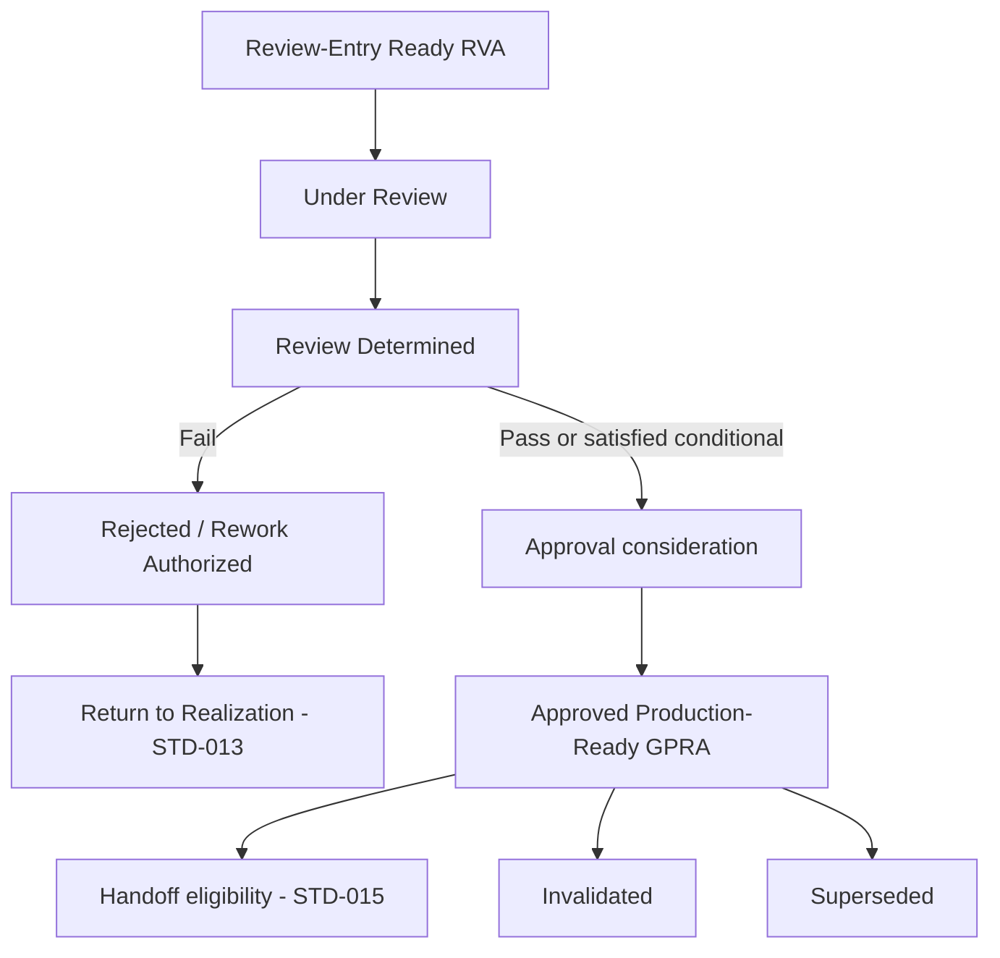

# F.I. Forgot Design Library — Volume 06

# Production Readiness Review and Approval Standard

## Document Control

| Field | Value |
|-------|-------|
| **Standard ID** | `FI-DSN-STD-014` |
| **Disposition** | Design Standard (`STD`) |
| **Primary Classification** | `CLS-CPR` — Creative Production Realization |
| **Secondary Classification** | `CLS-MFI` — Manufacturing Feasibility Integration (Design-Time Feasibility dimension only; subordinate to `CLS-CPR`) |
| **Primary Volume** | 06 — Creative Production |
| **Architectural domain** | Domain 3 — Review and Approval Authority (Layer B CP-03; Governed Handoff deferred to `FI-DSN-STD-015`) |
| **Document** | `04-production-readiness-review-and-approval-standard.md` |
| **Status** | Architecture Draft |
| **Version** | 0.1 Draft |
| **Date** | July 29, 2026 |
| **Freeze date** | — |
| **Branch** | `frontend-rebuild` |
| **Owner** | F.I. Forgot |
| **Approval status** | Not approved |
| **Binding status** | Not binding |
| **Register posture** | `Architecture Draft` (`FI-DSN-REG-001`) |
| **Queue posture** | EO 20 — **In progress** per Sprint V06-D4.5 architecture commit (`FI-DSN-QUE-001`) |
| **Sprint** | V06-D4.5 |
| **Governing authority** | `FI-DSN-GOV-001` — Design Standards Governance (Frozen Governance Standard, Version 1.0, July 22, 2026) |
| **Parent architecture** | `playbook/design/volume-06-creative-production/01-creative-production-architecture.md` — Creative Production Architecture (Frozen Volume Governance, Version 1.0, July 29, 2026) |
| **Volume roadmap** | `FI-DSN-VOL-001` — Design Volume Roadmap (Frozen Design Volume Roadmap, Version 1.0, July 23, 2026) |
| **Classification reference** | `FI-DSN-CLS-001` — Design Classification Strategy (Version 1.1 Frozen, July 29, 2026) |
| **Classification expansion reference** | `FI-DSN-CLS-002` — Classification Expansion Decision (Version 1.0 Frozen) |
| **Metadata reference** | `FI-DSN-GOV-002` — Design Library Metadata Standard (Frozen Governance Standard, Version 1.0, July 22, 2026) |
| **Template reference** | `FI-DSN-TPL-001` — Design Standard Template (Frozen Governance Template, Version 1.0, July 22, 2026) |
| **Identifier reference** | `FI-DSN-ID-001` — Design Identifier System (Frozen Identifier System, Version 1.0, July 22, 2026) |
| **Register reference** | `FI-DSN-REG-001` — Design Planning Register (Frozen Planning Register, Version 1.0, July 22, 2026) |
| **Queue reference** | `FI-DSN-QUE-001` — Design Drafting Queue (Frozen Design Drafting Queue, Version 1.0, July 23, 2026) |
| **Epistemic reference** | `FI-DSN-GOV-003` — Evidence vs Company Judgment Governance (Frozen Governance Standard, Version 1.0, July 23, 2026) |
| **Brain authority reference** | `FI-DSN-GOV-004` — Brain Authority Boundary (Frozen Governance Standard, Version 1.0, July 23, 2026) |
| **Upstream Volume 06 standards** | `FI-DSN-STD-012` — Production Intent and Program Governance Standard (Frozen, Version 1.0, July 29, 2026); `FI-DSN-STD-013` — Artifact Realization Governance Standard (Frozen, Version 1.0, July 29, 2026) |
| **Upstream philosophy** | `FI-DSN-PRN-001` — Visual Philosophy Standard (Frozen Design Principle, Version 1.0, July 24, 2026) |
| **Upstream Volume 02 standards** | `FI-DSN-STD-001` — Brand Expression Standard; `FI-DSN-STD-002` — Typography Standard; `FI-DSN-STD-003` — Composition Standard (Frozen, Version 1.0) |
| **Upstream Volume 03 standards** | `FI-DSN-STD-004` — Card Architecture Standard; `FI-DSN-STD-005` — Surface Spatial Allocation Standard; `FI-DSN-STD-006` — Envelope and Exterior Presentation Standard (Frozen, Version 1.0) |
| **Upstream Volume 04 standards** | `FI-DSN-STD-007` — Brain Visual Selection Standard; `FI-DSN-STD-008` — Occasion and Emotional Context Standard; `FI-DSN-STD-009` — Personalization Policy Standard (Frozen, Version 1.0) |
| **Manufacturing reference** | Applicable frozen `FI-MFG-*` standards per Volume 01 — Design-Time Feasibility Compliance Boundary inputs only |
| **Downstream Volume 06 standard (deferred)** | `FI-DSN-STD-015` — Governed Handoff Standard (`Reserved, Not Drafted`) |
| **Supporting facts** | None — company judgment standard |
| **Vendor questions** | None |

**Standard statement:** F.I. Forgot maintains **one authoritative Production Readiness Review and Approval** standard that governs Decision-stage production-readiness Review, Review Determination, and Approval for Review-Entry Ready Realized Visual Artifacts — including design-time production-readiness feasibility evaluation, approved production-ready posture grant and retention, rejection, rework authorization at the Review layer, and post-approval Invalidated and Superseded posture — without governing artifact Realization, Governed Handoff, permanent collection membership, or operational manufacturing execution.

**Source basis:** Company judgment per `FI-DSN-GOV-003`. Applicable frozen `FI-MFG-*` obligations are consumed as Design-Time Feasibility Compliance Boundary inputs only. This architecture draft is not derived from product implementation, vendor facts, Brain runtime behavior, or engineering workflow design.

**Architecture posture:** Version 0.1 Architecture Draft. Independent architecture review **completed** (Sprint V06-D4.4; conditional findings corrected in Sprint V06-D4.4A). Architecture accepted for committed draft posture. Requirement planning and normative requirements are **not drafted**. Normative requirement drafting remains **unauthorized** until separately invoked. This document does not claim approval, freeze, binding authority, or effective status.

---

## 1. Constitutional Purpose

This standard exists to answer one constitutional problem at Volume 06 Layer B CP-03:

**How production-readiness is determined and authorized at design time for a Review-Entry Ready Realized Visual Artifact — and how that authorized posture may later be retained, lost, or succeeded — without absorbing pre-realization intent governance, artifact Realization, Governed Handoff, permanent collection membership, or operational manufacturing execution.**

Volume 06 architecture assigns Review, Approval, and GPRA definition to Domain 3. Layer B planning splits Domain 3 into two standards: this standard owns **Review and Approval** through approved production-ready posture; `FI-DSN-STD-015` owns **Governed Handoff** and Handoff Posture.

This architecture draft translates the accepted governing question into constitutional structure for later normative drafting. It does not replace frozen Volume 06 Creative Production Architecture, frozen `FI-DSN-STD-012`, frozen `FI-DSN-STD-013`, frozen upstream Volumes 01–04 standards, frozen `FI-DSN-GOV-004`, or deferred `FI-DSN-STD-015`.

---

## 2. Accepted Governing Question

The governing question was accepted through independent constitutional review in Sprint V06-D4.2. It is **locked** for subsequent STD-014 drafting unless a separately authorized amendment sprint changes it.

> What governance determines whether a Review-Entry Ready Realized Visual Artifact may receive and retain an approved production-ready posture at design time, while preserving separate authority over artifact Realization, Governed Handoff, permanent collection membership, and operational manufacturing execution?

**Governing-question lock:** Subsequent architecture refinement and normative drafting must remain reconcilable with this question.

---

## 3. Scope and Positive Authority

### 3.1 Principal subject

This standard governs **Production Readiness Review and Approval** — the constitutional Decision-stage structure for:

- **Production-readiness Review** — governed evaluation of a Review-Entry Ready RVA against mandatory Review dimensions
- **Review Determination** — the constitutional outcome of Review (pass, fail, or conditional determination where retained)
- **Approval** — the distinct Decision-stage act that may grant approved production-ready posture
- **Approved production-ready posture** — the constitutional state represented by a **Governed Production-Ready Artifact (GPRA)** at the Volume 06 layer
- **Design-Time Feasibility** — evaluation of production-readiness feasibility at design time as a Review dimension consuming `FI-MFG-*` Compliance Boundaries
- **Rejection** — Review-layer determination that an RVA is not eligible for Approval on documented grounds
- **Rework authorization** — Review-layer authorization for return to Realization without governing realization methods
- **Post-approval posture loss** — Invalidated and Superseded posture governing continued authority of a previously approved GPRA

### 3.2 Positive authority summary

| Authority domain | Architectural ownership |
|------------------|-------------------------|
| Review dimension architecture | Mandatory evaluation categories before Approval |
| Review evidence and evaluation posture | What Review evaluates; not how tools score |
| Review Determination | Pass, fail, and conditional determination posture |
| Approval authority | Decision-stage grant of production-ready posture |
| GPRA definition and instance binding | Specific RVA version bound under frozen policy |
| Rejection and rework at Review layer | Return triggers to Domain 2 without realizing artifacts |
| Invalidated and Superseded posture | Post-approval authority continuation or termination |
| GPRA succession | Authoritative GPRA per obligation and handoff context (consumption boundary for STD-015 only) |
| Design-Time Feasibility dimension | Design-time producibility evaluation; not manufacture |

### 3.3 Architectural principles (provisional)

| ID | Principle | Rule |
|----|-----------|-------------|
| **PRR-P1** | **Review is not Realization** | Review evaluates existing RVAs; it does not create or alter governed realization posture |
| **PRR-P2** | **Determination is not Approval** | A favorable Review Determination is necessary input to Approval; it is not itself production-ready posture |
| **PRR-P3** | **Approval is not membership** | GPRA status does not grant permanent collection membership (Volume 06 AX-2, P3) |
| **PRR-P4** | **Approval is not Handoff** | GPRA does not declare Handoff Posture or intake procedures (`FI-DSN-STD-015`) |
| **PRR-P5** | **Design-time readiness is not operational manufacture** | Satisfied Design-Time Feasibility at Approval is not Manufacturing Validation or Fulfillment Execution |
| **PRR-P6** | **Quality is multidimensional** | Review evaluates identity compliance, surface fit, contextual obligations, and Design-Time Feasibility — not aesthetic preference alone (Volume 06 P10) |
| **PRR-P7** | **Existence is not approval** | RVA existence and Review-Entry Readiness do not imply GPRA (Volume 06 AX-1, P2) |
| **PRR-P8** | **Decision policy is not runtime selection** | Volume 06 Approval is distinct from `CLS-BVS` / Brain Visual Selection Decision (`FI-DSN-GOV-004`) |
| **PRR-P9** | **Historical approval is preserved** | Invalidated and Superseded preserve historical fact of prior approval when constitutionally valid at grant time |
| **PRR-P10** | **Upstream law is consumed, not rewritten** | Review dimensions consume Volumes 01–04 and Domain 1–2 outputs as Compliance Boundaries |

---

## 4. Explicit Exclusions

This standard does **not** own:

| Subject | Authoritative owner |
|---------|---------------------|
| Declared Production Intent, Production Program, Production Obligation establishment | `FI-DSN-STD-012` |
| Exploration-Entry Authorization, waivers, and Domain 1 posture | `FI-DSN-STD-012` |
| Exploration Posture operation, Realization commitment, RVA existence | `FI-DSN-STD-013` |
| RVA version lineage, iteration, method-neutral realization paths | `FI-DSN-STD-013` |
| Realization Traceability Package creation | `FI-DSN-STD-013` |
| Review-Entry Readiness creation | `FI-DSN-STD-013` |
| Governed Handoff, Handoff Posture, intake consumer classes | `FI-DSN-STD-015` |
| Permanent collection membership and collection lifecycle | `FI-DSN-STD-010`, `FI-DSN-STD-011` / Volume 05 |
| Contextual selection and authorized alternatives | `FI-DSN-STD-007` |
| Occasion and emotional context semantics | `FI-DSN-STD-008` |
| Personalization policy | `FI-DSN-STD-009` |
| Visual permission and identity eligibility | Volume 02 |
| Surface structure and spatial allocation | Volume 03 |
| Metadata field semantics and provenance schema | `FI-DSN-GOV-002` |
| Manufacturing Validation mechanics and Fulfillment Execution | Volume 01 operational layer / engineering |
| Brain runtime recommendation, ranking, and customer Selection | `FI-DSN-GOV-004` / product implementation |
| Product UI, DAM workflows, APIs, databases, prompts, models | Engineering specifications |

---

## 5. Constitutional Entry Boundary

STD-014 authority begins only when upstream Domain 2 outputs satisfy the **Review-Entry Ready** entry posture per frozen `FI-DSN-STD-013`.

### 5.1 Minimum upstream inputs

| Input | Source | Consumption |
|-------|--------|-------------|
| **Review-Entry Ready RVA** | `FI-DSN-STD-013` | Hard entry gate — Review does not commence on non-ready artifacts |
| **Realization Traceability Package** | `FI-DSN-STD-013` | Review evidence — consumed, not recreated |
| **RVA Version Lineage** | `FI-DSN-STD-013` | Attribution and succession context |
| **Production Obligation attribution** | `FI-DSN-STD-012` / `FI-DSN-STD-013` | Scope binding for Review and Approval |
| **Current Program and bound Compliance Boundaries** | `FI-DSN-STD-012` | Review constraint inputs |
| **Applicable upstream Compliance Boundaries** | Volumes 01–04 via Domain 1–2 binding | Review dimension inputs |

### 5.2 Entry boundary rules (architectural)

- Review-Entry Readiness is a **Domain 2 output**, not a Review Determination. STD-014 consumes it; STD-014 does not grant it.
- Missing or incomplete traceability material relevant to Review may block Review commencement or yield fail/conditional determination — without re-opening Domain 2 authority except through governed rework return.
- STD-014 does not invent operational intake procedures, queue mechanics, or system workflows for Review entry.

### 5.3 Upstream context without absorption

Production Intent and Production Program context inform Review scope and Compliance Boundary evaluation. STD-014 consumes Domain 1 posture; it does not govern Intent Change, Program Amendment, or Obligation establishment.

---

## 6. Review Architecture

### 6.1 Review as a governed evaluation stage

**Review** is the constitutional stage in which a Review-Entry Ready **Realized Visual Artifact (RVA)** is evaluated against mandatory **Review dimensions** under frozen Decision-stage policy. Review produces evidence and a **Review Determination**; it does not grant production-ready posture.

Review is distinct from:

- **Realization** — which brings an artifact into governed existence as an RVA
- **Approval** — which may grant GPRA status after eligible Review Determination
- **Brain Visual Selection** — runtime selection within Preference Surfaces
- **Manufacturing Validation** — operational pre-fulfillment checks

### 6.2 Review dimensions (architectural categories)

Volume 06 architecture requires multidimensional Review (P10). Provisional dimension categories for normative drafting:

| Dimension category | Principal concern | Typical upstream source |
|--------------------|-------------------|-------------------------|
| **Identity and character compliance** | Whether the artifact complies with visual permission and identity rules in final form | Volume 02 |
| **Surface and spatial fit** | Whether the artifact respects structural, spatial, and exterior presentation obligations | Volume 03 |
| **Contextual and personalization obligations** | Whether required contextual metadata and personalization constraints are satisfied | Volume 04 |
| **Design-Time Feasibility** | Whether the artifact appears compatible with known manufacturing constraints at design time | `FI-MFG-*` Compliance Boundaries (`CLS-MFI`) |

This architecture identifies categories only. It does not prescribe scoring systems, checklists, UI workflows, or tool configuration.

### 6.3 Review evidence

Review evaluates the RVA instance and its inherited **Realization Traceability Package** without reinterpreting Domain 2 realization decisions. Review evidence is constitutional record sufficient to support a Review Determination — not an implementation schema.

### 6.4 Relationship to Review Determination

Review concludes in a **Review Determination** — a recorded constitutional outcome distinct from the Review activity itself. No GPRA exists until a separate Approval act succeeds under governing rules.

---

## 7. Review Determination Architecture

### 7.1 Constitutional role

**Review Determination** records the outcome of Review for a specific RVA version under a defined Production Obligation scope. It is the mandatory gate before Approval may be considered.

### 7.2 Outcome families (Volume 06 aligned)

| Outcome | Architectural meaning | Forward posture |
|---------|----------------------|-----------------|
| **Pass** | RVA eligible for Approval consideration | Approval may proceed if other governing rules satisfied |
| **Fail** | **Failed Review Determination** — RVA not eligible for Approval on documented grounds | Rework return path to Realization; no GPRA |
| **Conditional determination** | Approval permitted only after documented conditions satisfied; conditions must not narrow upstream Compliance Boundaries | If conditions remain unsatisfied, rework return path; no GPRA until conditions satisfied and Review passes |

Volume 06 architecture §12.1 permits conditional pass constitutionally. Layer B standards may narrow or retain conditional determination at normative freeze.

### 7.3 Open question — conditional determination (`OQ-V06-006`)

| ID | Question | Architecture posture |
|----|----------|---------------------|
| `OQ-V06-006` | Should conditional Review Determination be retained or collapsed to pass/fail only at Layer B standard freeze? | **Open** — conditional pass permitted constitutionally; normative drafting may retain, refine, or collapse; not resolved in this architecture draft |

### 7.4 Distinction from Approval

A pass or satisfied conditional pass is **necessary** input to Approval but does not **constitute** Approval. STD-014 architecture preserves the two-step constitutional sequence: Review Determination → Approval → GPRA.

---

## 8. Approval Architecture

### 8.1 Approval as distinct Decision-stage act

**Approval** is the constitutional act that may grant **approved production-ready posture** by binding a specific RVA version as a **Governed Production-Ready Artifact (GPRA)** under frozen Decision-stage policy.

Approval is distinct from:

- **Review Determination** — evaluative outcome, not authorization
- **Brain recommendation** — runtime input only
- **Customer Selection** — contextual application, not production-readiness grant
- **Workflow advancement** — operational state is not constitutional policy (Volume 06 AX-5)

### 8.2 Approval authority (conceptual)

Volume 06 architecture assigns **Approval authority** to Domain 3 Decision-stage policy. This architecture anticipates a **constitutionally authorized Decision-stage authority class** for Approval acts — distinct from Brain Runtime, engineering role assignment, or operational workflow permission.

The specific authority class definition remains an architecture open question (`OQ-STD-014-001`). Normative drafting will freeze who or what governance entity may approve without prescribing organizational roles or product UI.

### 8.3 Approval withholding

Architecture anticipates that Approval may be withheld despite a favorable Review Determination when separate governing rules require — for example unresolved Approval prerequisites, succession conflicts, or explicit governance holds. The conditions for withholding are not finalized in this draft (`OQ-STD-014-002`).

### 8.4 Instance binding

Each Approval act binds a **specific RVA version** as a GPRA for a defined Production Obligation scope under frozen policy. Approval is instance-level authorization for downstream Handoff eligibility — not a new Preference Surface and not Brain Visual Selection authority (Volume 06 §16.5).

---

## 9. Approved Production-Ready Posture

### 9.1 GPRA terminology

At the Volume 06 constitutional layer, **approved production-ready posture** is represented by a **Governed Production-Ready Artifact (GPRA)** — the sole canonical output of the Approval stage per Volume 06 architecture §5 and §12.

Bare "production-ready" without constitutional qualification is prohibited at the Volume 06 layer.

### 9.2 What GPRA signifies

A GPRA signifies that:

- The bound RVA version passed all mandatory Review dimensions including Design-Time Feasibility at Approval time
- Decision-stage production-readiness policy authorizes the artifact for **downstream Handoff eligibility** consideration
- The artifact is **not** automatically a permanent collection member, Fulfillment-Ready, or operationally manufactured

### 9.3 What GPRA does not signify

A GPRA does **not** signify:

- Permanent collection membership (Volume 05 / `FI-DSN-STD-010`)
- Handoff Posture declaration (`FI-DSN-STD-015`)
- Successful physical manufacture or shipment
- Manufacturing Validation pass
- Brain or customer selection authorization

### 9.4 Version, obligation, and lineage scope

GPRA posture is **artifact-specific** and **version-specific**:

- Approval binds a particular RVA version under a Production Obligation scope
- Historical GPRAs may exist for successive RVA versions over time
- For a given Production Obligation and Handoff consumer context, Volume 06 architecture anticipates **one authoritative GPRA at a time** unless future Layer B law permits otherwise (§5.11)

Lineage and succession rules connect GPRA posture to prior RVA versions without re-opening Domain 2 existence criteria.

### 9.5 Relationship to downstream Handoff

GPRA is a **necessary** upstream condition for Governed Handoff eligibility. STD-014 produces GPRA and validity posture; STD-015 declares Handoff Posture toward Volume 05 and production-catalog consumers.

---

## 10. Retention, Loss, Invalidation, and Supersession

### 10.1 Retention

**Retention** is the continued forward authority of an approved GPRA that still satisfies governing law and applicable Compliance Boundaries at evaluation time. Retention is the default post-approval posture until Invalidated or Superseded applies.

### 10.2 Invalidated posture

**Invalidated** means the GPRA no longer satisfies governing law or required Compliance Boundaries. Architectural characteristics per Volume 06 §5.9:

- Historical fact of approval is **preserved** — prior approval was valid when granted
- Forward Handoff and new intake on Invalidated authority is **not** permitted
- Existing downstream use is **not automatically revoked** — governed separately by Volume 05, engineering, and operational policy
- New Review and Approval is required before a replacement GPRA

Triggers include material upstream Compliance Boundary change and other governing-law failures — detailed triggers deferred to normative drafting.

### 10.3 Superseded posture

**Superseded** means a newer authoritative GPRA has replaced this GPRA for a defined Production Obligation or Handoff context. Architectural characteristics:

- Historical fact of prior approval is **preserved**
- Prior Handoff authority **ceases for forward use** in the superseded context
- The replacing GPRA governs forward intake when otherwise eligible

Supersession does not assert that the earlier approval was invalid when granted.

### 10.4 Terminology note (`OQ-STD-014-003`)

Architecture uses **Invalidated** and **Superseded** as the peer-separated post-approval GPRA postures per frozen Volume 06 §5.9. **Invalidation** and **supersession** name those constitutional loss mechanisms at this layer. **Withdrawal** and **revocation** are not separately defined postures in this architecture draft — whether Layer B treats them as distinct acts, umbrella terms, or operational labels for Invalidated or Superseded posture remains intentionally deferred to normative drafting (`OQ-STD-014-003`).

### 10.5 Changed upstream context

Material changes to Production Intent, Program structure, Compliance Boundaries, or manufacturing feasibility posture may affect GPRA retention. STD-014 governs the **production-readiness response**; Domain 1 amendments remain `FI-DSN-STD-012` authority; realization rework remains `FI-DSN-STD-013` authority when Review-layer rework is authorized.

---

## 11. Rejection and Rework Boundary

### 11.1 Review-layer rejection

**Rejection** is a Review Determination outcome (fail) or explicit rejection posture that documents why an RVA is not eligible for Approval. Rejection does not delete the RVA; it terminates forward Review-to-Approval progression for that determination cycle.

### 11.2 Rework authorization

**Rework** is not a separate forward lifecycle stage. It is a governed **return path** from Review to Realization:

- Failed Review Determination → Realization (same or successor Production Obligation)
- Unsatisfied conditional determination → Realization until conditions can be satisfied

STD-014 **authorizes** rework at the Review layer as an external trigger consumed by `FI-DSN-STD-013` (per `FI-DSN-STD-013-R32`). STD-014 does not govern realization methods, successor RVA creation mechanics, or iteration discipline — those remain Domain 2.

### 11.3 Authority split

| Layer | Owns |
|-------|------|
| **STD-014** | Review Determination, rejection, rework **authorization** at Review |
| **STD-013** | Rework **consumption**, successor RVA production, iteration within obligation bounds |

---

## 12. Design-Time Feasibility Boundary

### 12.1 Four-concept separation (Volume 06 §13)

| Concept | Owner | Meaning |
|---------|-------|---------|
| **Design-Time Feasibility** | Volume 06 — Review dimension | Artifact appears compatible with known manufacturing constraints at design time |
| **Governed Production-Ready (GPRA)** | Volume 06 — Approval output | RVA passed Review including Design-Time Feasibility; authorized for Handoff eligibility |
| **Manufacturing Validation** | Engineering / operational | Pre-fulfillment checks that a specific instance can be produced |
| **Fulfillment Execution** | Volume 01 operational | Order execution and shipment |

### 12.2 Architectural rules

- GPRA **requires** satisfied Design-Time Feasibility at Approval time (Volume 06 §13)
- GPRA does **not** require successful physical manufacture
- Manufacturing Validation may block Fulfillment even when GPRA exists
- STD-014 evaluates Design-Time Feasibility as a Review dimension consuming `FI-MFG-*` Compliance Boundaries — it does not restate `FI-MFG-*` operational policy
- `CLS-MFI` secondary classification reflects material governance of this dimension; `CLS-CPR` remains primary

### 12.3 Compliance Boundary change

Manufacturing capability change follows Research Library and `FI-DSN-GOV-003` propagation before Design policy change. Affected GPRAs may move to Invalidated posture. The architectural trigger thresholds remain open (`OQ-STD-014-005`).

---

## 13. Downstream Handoff Boundary

### 13.1 What STD-015 may consume (conceptual outputs)

STD-014 is expected to produce constitutional outputs for `FI-DSN-STD-015` consumption without defining Handoff procedures:

| Output | Description |
|--------|-------------|
| **GPRA identity** | Which RVA version holds approved production-ready posture |
| **Approval evidence** | Documentary basis for the Approval act |
| **Current validity posture** | Whether GPRA is forward-active, Invalidated, or Superseded |
| **Production Obligation attribution** | Scope binding for Handoff context |
| **Lineage and traceability references** | Pointers to inherited Realization Traceability Package posture |
| **Authoritative GPRA posture** | Which GPRA is authoritative per obligation and consumer context |

### 13.2 Prohibited absorption

STD-014 does **not** define:

- Handoff Posture or consumer classes (library intake vs production catalog)
- Volume 05 intake procedures or membership admission
- Production catalog implementation or engineering handoff APIs
- Auditable transition rules at intake boundaries (`FI-DSN-STD-015` principal subjects)

---

## 14. Authority and Decision Separation

| Concern | Authoritative owner | STD-014 relationship |
|---------|---------------------|----------------------|
| Brain Visual Selection / runtime recommendation | `FI-DSN-STD-007`; `FI-DSN-GOV-004` | Review may consume selection constraints; does not approve GPRA |
| Contextual selection and authorized alternatives | `FI-DSN-STD-007` | Review dimension input only |
| Personalization policy | `FI-DSN-STD-009` | Review constraint input only |
| Review activity and Review Determination | **STD-014** | Owns when principal |
| Approval and GPRA grant | **STD-014** | Owns when principal |
| Permanent collection membership | Volume 05 / `FI-DSN-STD-010` | GPRA is intake prerequisite only |
| Handoff authorization | `FI-DSN-STD-015` | Consumes GPRA; does not grant it |
| Manufacturing execution | Volume 01 / engineering | Excluded |

**Permanent rule (Volume 06 §16.5):** Volume 06 standards legislate production-readiness Decision policy. Each Approval act applies that policy to one RVA instance. Neither act is Brain recommendation nor customer Selection.

---

## 15. Lifecycle and State Model

### 15.1 Provisional posture vocabulary

The following terms are **provisional architecture vocabulary** for normative refinement. They are not final constitutional states until requirement drafting and review.

| Posture (provisional) | Domain | Meaning |
|-----------------------|--------|---------|
| **Review-Entry Ready** | Domain 2 output | RVA and traceability sufficient for Review commencement (`FI-DSN-STD-013`) |
| **Under Review** | Domain 3 activity | Review in progress for a specific RVA version |
| **Review Determined** | Domain 3 outcome | Review Determination recorded (pass / fail / conditional) |
| **Approval Pending** | Domain 3 intermediate | Favorable Review Determination; Approval not yet granted |
| **Approved Production-Ready (GPRA)** | Domain 3 outcome | Approval granted; GPRA exists |
| **Rejected** | Domain 3 outcome | Failed Review Determination or explicit rejection |
| **Rework Authorized** | Domain 3 → Domain 2 bridge | Review layer authorizes return to Realization |
| **Invalidated** | Domain 3 post-approval | GPRA fails current governing law |
| **Superseded** | Domain 3 post-approval | Newer GPRA authoritative for same context |

### 15.2 Conceptual flow

Rework is a return path, not a parallel forward stage. Handoff is downstream of GPRA and outside STD-014 principal authority.

---

## 16. Requirement Group Plan

Provisional normative requirement groups for future drafting. **No requirement IDs or requirement text are drafted in this sprint.**

| Group | Constitutional subject | Expected authority | Key exclusions | Upstream dependencies | Downstream implications |
|-------|------------------------|-------------------|----------------|----------------------|-------------------------|
| **G1** | Constitutional inheritance and principal-subject placement | Placement test; permanent distinctions | Absorb STD-012/013/015 | Volume 06 architecture; GOV-004 | Frames all groups |
| **G2** | Review entry boundary and Review eligibility | When Review may commence; entry evidence | Review-Entry Readiness creation | `FI-DSN-STD-013` | Gates G3–G7 |
| **G3** | Review dimension architecture | Mandatory dimension categories | Scoring/UI/workflows | Volumes 01–04 Compliance Boundaries | Feeds G5 |
| **G4** | Design-Time Feasibility integration | `FI-MFG-*` consumption as Review dimension | Manufacturing operations | `FI-MFG-*`; CLS-MFI | Required for Approval |
| **G5** | Review Determination outcomes | Pass, fail, conditional posture | Approval grant | G3, G4 | Gates G6 |
| **G6** | Approval authority and GPRA grant | Instance binding; GPRA creation | Handoff, membership | G5; GOV-004 | Produces GPRA for G8–G10, STD-015 |
| **G7** | Rejection and rework authorization | Review-layer fail; rework trigger | Realization methods | G5 | Consumed by STD-013 |
| **G8** | Invalidated posture | Post-approval loss when law fails | Operational revocation mechanics | G6; upstream law changes | Affects STD-015 consumption |
| **G9** | Superseded posture and GPRA succession | Authoritative GPRA per context | Handoff procedures | G6; Volume 06 §5.11 | Affects STD-015 consumption |
| **G10** | Brain and Decision-stage interaction | Prohibition on Brain GPRA grant | BVS, runtime selection | GOV-004 | Cross-cutting |
| **G11** | Downstream consumption boundary | Outputs for STD-015 | Handoff Posture definition | G6–G9 | Enables STD-015 drafting |

---

## 17. Open Questions

| ID | Question | Status | Notes |
|----|----------|--------|-------|
| `OQ-V06-006` | Should conditional Review Determination be retained or collapsed to pass/fail only at Layer B freeze? | **Open** (inherited) | Constitutionally permitted; normative choice deferred |
| `OQ-STD-014-001` | What constitutionally authorized Decision-stage authority class may perform Approval? | **Open** | Architecture anticipates class without prescribing roles |
| `OQ-STD-014-002` | May Approval be withheld despite favorable Review Determination, and on what governed grounds? | **Open** | Distinct from Review fail |
| `OQ-STD-014-003` | Is **revocation** a distinct post-approval term or umbrella for Invalidated/Superseded at Layer B? | **Open** | Volume 06 uses Invalidated/Superseded in §5.9 |
| `OQ-STD-014-004` | What is the precise binding scope of GPRA — per RVA version, per obligation, per handoff consumer class, or combined? | **Open** | Volume 06 §5.11 provides architectural baseline |
| `OQ-STD-014-005` | What material Compliance Boundary changes trigger Invalidated posture versus requiring new Review only? | **Open** | GOV-003 propagation relationship |
| `OQ-STD-014-006` | What minimum Review dimension set is mandatory vs optionally extended at Layer B? | **Open** | P10 requires multidimensional Review |

Implementation decisions (APIs, UI, scoring, storage) are **not** architecture questions and are excluded from this table.

---

## 18. Deferrals

| Deferred subject | Authoritative home |
|------------------|-------------------|
| Governed Handoff and Handoff Posture | `FI-DSN-STD-015` |
| Library intake and production catalog consumer classes | `FI-DSN-STD-015` |
| Permanent collection membership | `FI-DSN-STD-010`, `FI-DSN-STD-011`; Volume 05 |
| Collection publication and retirement | Volume 05 |
| Contextual selection policy | `FI-DSN-STD-007` |
| Personalization policy | `FI-DSN-STD-009` |
| Manufacturing Validation and Fulfillment Execution | Volume 01 / engineering |
| `FI-MFG-*` operational policy restatement | Volume 01 |
| Metadata field schemas | `FI-DSN-GOV-002` |
| Brain algorithms and runtime behavior | `FI-DSN-GOV-004` / Brain Architecture |
| Product implementation | Engineering specifications |

---

## 19. Architecture Validation

Architecture Validation is governance-level validation before normative requirement drafting. It is not implementation testing.

| Check | Pass criterion |
|-------|----------------|
| Governing question | Accepted question embedded exactly; structural answer path identifiable |
| Constitutional purpose | Single Domain 3 Review/Approval problem identified |
| STD-012 boundary | Intent, Program, Obligation, exploration-entry not absorbed |
| STD-013 boundary | Realization, RVA existence, Review-Entry Readiness creation not absorbed |
| STD-015 boundary | Handoff Posture and intake procedures not absorbed |
| Review vs Approval | Distinct stages and postures documented |
| GPRA vs membership | AX-2 / P3 separation preserved |
| Design-Time Feasibility | Distinguished from Manufacturing Validation and Fulfillment |
| Brain / BVS separation | GOV-004 posture preserved |
| Post-approval states | Invalidated and Superseded aligned with Volume 06 §5.9 |
| Rework boundary | Review authorization vs Domain 2 consumption split documented |
| Implementation independence | No APIs, schemas, UI, workflows, vendors, or models prescribed |
| Normative requirements | **None drafted** — no `FI-DSN-STD-014-R##` identifiers |
| Independent review | **Passed** — Sprint V06-D4.4; minor corrective findings resolved in Sprint V06-D4.4A; architecture committed in Sprint V06-D4.5 |

---

## 20. Revision History

| Version | Date | Author | Summary |
|---------|------|--------|---------|
| 0.1 Architecture Draft | July 29, 2026 | F.I. Forgot | Sprint V06-D4.5 — architecture commit; independent architecture review completed (V06-D4.4); V06-D4.4A corrective findings applied; architecture accepted for committed Version 0.1 Draft posture; requirement planning not performed; normative requirements not drafted; normative drafting unauthorized; EO 20 remains **In progress**; open questions preserved; not approved; not frozen; not binding; no Product Sprint 004 authorization |
| 0.1 Architecture Draft | July 29, 2026 | F.I. Forgot | Sprint V06-D4.3 — initial architecture draft; accepted governing question embedded; Domain 3 Review and Approval scope; entry and Handoff boundaries; Review, Review Determination, Approval, and GPRA architecture; Design-Time Feasibility boundary; rejection and rework split; Invalidated and Superseded posture; provisional requirement groups G1–G11; open questions `OQ-V06-006`, `OQ-STD-014-001`–`006`; independent architecture review pending; normative requirements not drafted; not approved; not frozen; not binding; no Product Sprint 004 authorization |

---

**End of Document**
