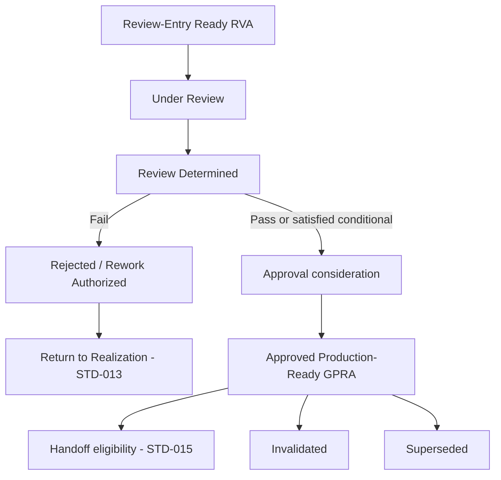
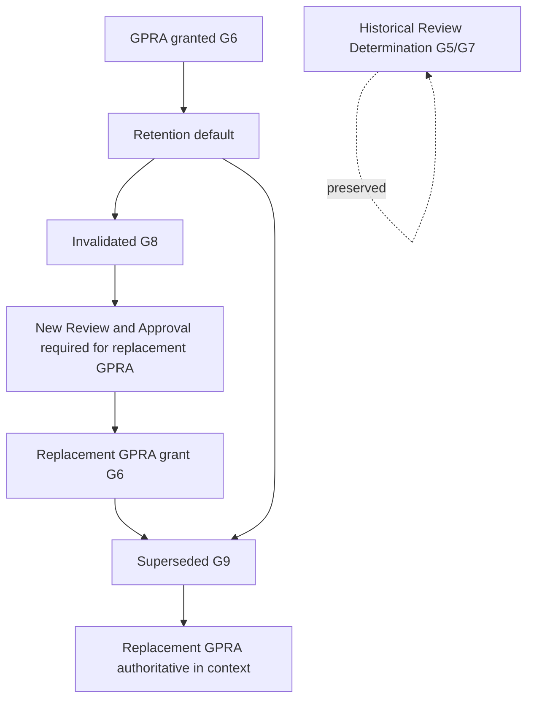

# F.I. Forgot Design Library — Volume 06

# Production Readiness Review and Approval Standard

## Document Control

| Field | Value |
|-------|-------|
| **Standard ID** | `FI-DSN-STD-014` |
| **Disposition** | Design Standard (`STD`) |
| **Primary Classification** | `CLS-CPR` — Creative Production Realization |
| **Secondary Classification** | `CLS-MFI` — Manufacturing Feasibility Integration (Design-Time Feasibility dimension only; subordinate to `CLS-CPR`) |
| **Primary Volume** | 06 — Creative Production |
| **Architectural domain** | Domain 3 — Review and Approval Authority (Layer B CP-03; Governed Handoff deferred to `FI-DSN-STD-015`) |
| **Document** | `04-production-readiness-review-and-approval-standard.md` |
| **Status** | Architecture Draft |
| **Version** | 0.1 Draft |
| **Date** | July 29, 2026 |
| **Freeze date** | — |
| **Branch** | `frontend-rebuild` |
| **Owner** | F.I. Forgot |
| **Approval status** | Not approved |
| **Binding status** | Not binding |
| **Register posture** | `Architecture Draft` (`FI-DSN-REG-001`) |
| **Queue posture** | EO 20 — **In progress** per Sprint V06-D5.4 requirement plan adoption (`FI-DSN-QUE-001`) |
| **Sprint** | V06-D53.8 |
| **Governing authority** | `FI-DSN-GOV-001` — Design Standards Governance (Frozen Governance Standard, Version 1.0, July 22, 2026) |
| **Parent architecture** | `playbook/design/volume-06-creative-production/01-creative-production-architecture.md` — Creative Production Architecture (Frozen Volume Governance, Version 1.0, July 29, 2026) |
| **Volume roadmap** | `FI-DSN-VOL-001` — Design Volume Roadmap (Frozen Design Volume Roadmap, Version 1.0, July 23, 2026) |
| **Classification reference** | `FI-DSN-CLS-001` — Design Classification Strategy (Version 1.1 Frozen, July 29, 2026) |
| **Classification expansion reference** | `FI-DSN-CLS-002` — Classification Expansion Decision (Version 1.0 Frozen) |
| **Metadata reference** | `FI-DSN-GOV-002` — Design Library Metadata Standard (Frozen Governance Standard, Version 1.0, July 22, 2026) |
| **Template reference** | `FI-DSN-TPL-001` — Design Standard Template (Frozen Governance Template, Version 1.0, July 22, 2026) |
| **Identifier reference** | `FI-DSN-ID-001` — Design Identifier System (Frozen Identifier System, Version 1.0, July 22, 2026) |
| **Register reference** | `FI-DSN-REG-001` — Design Planning Register (Frozen Planning Register, Version 1.0, July 22, 2026) |
| **Queue reference** | `FI-DSN-QUE-001` — Design Drafting Queue (Frozen Design Drafting Queue, Version 1.0, July 23, 2026) |
| **Epistemic reference** | `FI-DSN-GOV-003` — Evidence vs Company Judgment Governance (Frozen Governance Standard, Version 1.0, July 23, 2026) |
| **Brain authority reference** | `FI-DSN-GOV-004` — Brain Authority Boundary (Frozen Governance Standard, Version 1.0, July 23, 2026) |
| **Upstream Volume 06 standards** | `FI-DSN-STD-012` — Production Intent and Program Governance Standard (Frozen, Version 1.0, July 29, 2026); `FI-DSN-STD-013` — Artifact Realization Governance Standard (Frozen, Version 1.0, July 29, 2026) |
| **Upstream philosophy** | `FI-DSN-PRN-001` — Visual Philosophy Standard (Frozen Design Principle, Version 1.0, July 24, 2026) |
| **Upstream Volume 02 standards** | `FI-DSN-STD-001` — Brand Expression Standard; `FI-DSN-STD-002` — Typography Standard; `FI-DSN-STD-003` — Composition Standard (Frozen, Version 1.0) |
| **Upstream Volume 03 standards** | `FI-DSN-STD-004` — Card Architecture Standard; `FI-DSN-STD-005` — Surface Spatial Allocation Standard; `FI-DSN-STD-006` — Envelope and Exterior Presentation Standard (Frozen, Version 1.0) |
| **Upstream Volume 04 standards** | `FI-DSN-STD-007` — Brain Visual Selection Standard; `FI-DSN-STD-008` — Occasion and Emotional Context Standard; `FI-DSN-STD-009` — Personalization Policy Standard (Frozen, Version 1.0) |
| **Manufacturing reference** | Applicable frozen `FI-MFG-*` standards per Volume 01 — Design-Time Feasibility Compliance Boundary inputs only |
| **Downstream Volume 06 standard** | `FI-DSN-STD-015` — Governed Handoff Standard (Version 1.0 **Frozen**, **Approved**, **Binding**) |
| **Supporting facts** | None — company judgment standard |
| **Vendor questions** | None |

**Standard statement:** F.I. Forgot maintains **one authoritative Production Readiness Review and Approval** standard that governs Decision-stage production-readiness Review, Review Determination, and Approval for Review-Entry Ready Realized Visual Artifacts — including design-time production-readiness feasibility evaluation, approved production-ready posture grant and retention, rejection, rework authorization at the Review layer, and post-approval Invalidated and Superseded posture — without governing artifact Realization, Governed Handoff, permanent collection membership, or operational manufacturing execution.

**Source basis:** Company judgment per `FI-DSN-GOV-003`. Applicable frozen `FI-MFG-*` obligations are consumed as Design-Time Feasibility Compliance Boundary inputs only. This architecture draft is not derived from product implementation, vendor facts, Brain runtime behavior, or engineering workflow design.

**Architecture posture:** Version 0.1 Architecture Draft. Independent architecture review **completed** (Sprint V06-D4.4; conditional findings corrected in Sprint V06-D4.4A). Architecture accepted for committed draft posture (Sprint V06-D4.5). Requirement planning **accepted** (Sprint V06-D5.1; Section 20; independent planning review **passed** after Sprint V06-D5.3 corrective). Requirement plan adopted for committed planning posture (Sprint V06-D5.4). `PD-STD-014-006` **resolved** (Sprint V06-D6.1; Section 20.12). Tranche 1 partial normative draft **committed** — G1 requirements `FI-DSN-STD-014-R01`–`R07` (Sprint V06-D7.1); G2 requirements `FI-DSN-STD-014-R08`–`R13` (Sprint V06-D8.1); G3 requirements `FI-DSN-STD-014-R14`–`R20` (Sprint V06-D9.1); G4 requirements `FI-DSN-STD-014-R21`–`R26` (Sprint V06-D10.1). `PD-STD-014-001` **resolved** (Sprint V06-D11.1; Section 20.15). G5 normative requirements **committed** — `FI-DSN-STD-014-R27`–`R33` (Sprint V06-D12.1; Section 21.5). `PD-STD-014-002`, `PD-STD-014-003`, and baseline `PD-STD-014-005` **resolved** (Sprint V06-D13.1; Sections 20.16–20.18). MAGAC establishment versus activation and Approval–GPRA baseline **clarified** (Sprint V06-D13.1A; Sections 20.16.3 and 20.18.4); `OQ-STD-014-004` **closed**; `OQ-STD-014-007` opened for G9. G6 normative requirements **committed** — `FI-DSN-STD-014-R34`–`R43` (Sprint V06-D14.1; commit `c8eeb2913ddf0170703518757ba36b3c72ea30ac`; Section 21.6). G7 planning decisions **`PD-STD-014-008` through `PD-STD-014-012` resolved** and **adopted** (Sprints V06-D16.1 and V06-D16.1A; commit `cebf454`; Section 20.19). G7 normative requirements **drafted** — `FI-DSN-STD-014-R44`–`R51` (Sprint V06-D17.1; Section 21.7). G8 pre-planning gates **`PD-STD-014-004` and `PD-STD-014-007` resolved**; **`OQ-STD-014-003` closed** (Sprint V06-D18.1; Section 20.20). G8 normative requirements **drafted and independently accepted** — `FI-DSN-STD-014-R52`–`R63` (Sprints V06-D19.1, V06-D19.3, V06-D19.5; independent acceptance V06-D19.6; Section 21.8). G9 planning architecture **established** (Sprint V06-D20.1; Section 20.21) and **independently accepted** (Sprint V06-D20.2). G9 Tranche 1 normative requirements **accepted** — `FI-DSN-STD-014-R64`–`R67` (Sprint V06-D21.2; acceptance V06-D21.3). G9 Tranche 2 normative requirements **accepted** — `FI-DSN-STD-014-R68`–`R71` (Sprint V06-D22.1; acceptance V06-D22.2). G9 normative requirements **complete** — `FI-DSN-STD-014-R64`–`R72` (Sprint V06-D23.1; Section 21.9). G9 normative requirement drafting **authorized** (Sprint V06-D21.1). G10 planning architecture **established** (Sprint V06-D24.1; Section 20.22) and **independently accepted** (Sprint V06-D24.2). G10 normative requirement drafting **authorized** (Sprint V06-D24.3). G10 Tranche 1 normative requirements **drafted** — `FI-DSN-STD-014-R73`–`R76` (Sprint V06-D25.1; Section 21.10). G10 Tranche 2 normative requirements **drafted** — `FI-DSN-STD-014-R77`–`R81` (Sprint V06-D25.3; Section 21.10.5; commit V06-D25.4). G10 Tranche 1 **accepted** (V06-D25.2). G10 Tranche 2 **accepted** (V06-D25.5). G10 completion boundary **drafted** — `FI-DSN-STD-014-R82` (Sprint V06-D25.6; Section 21.10.6). G10 normative requirements **complete** — `FI-DSN-STD-014-R73`–`R82` (Section 21.10; commit V06-D25.8). G11 planning architecture **established** (Sprint V06-D26.1; Section 20.23), **independently accepted** (Sprint V06-D26.2), **committed** (Sprint V06-D26.4; commit `82e4d39`), and **post-commit verified** (Sprint V06-D26.5). G11 normative requirement drafting **authorized** (Sprint V06-D26.6) and **begun** (Sprint V06-D27.1). G11 Tranche 1 normative requirements **`FI-DSN-STD-014-R83`–`R87`** are **drafted** (Sprint V06-D27.1; Section 21.11), **independently accepted** (Sprint V06-D27.2), and **committed** (Sprint V06-D27.4; commit `50137c4`). Section 21.11 **complete**. G11 **complete**, governance **complete**, and **constitutionally closed**; G11 Tranche 2 normative drafting **authorized** within HVEM–HRWM scope (Sprint V06-D28.1; Section 20.23.17); G11 Tranche 2 **`FI-DSN-STD-014-R88`–`R91`** are **drafted** (V06-D28.5; Section 21.11.5), **accepted** (V06-D28.7; R91 corrected V06-D28.6), **committed** (V06-D28.8; commit `9b5deb0`), **post-commit verified** (V06-D28.9). G11 Tranche 3 normative drafting **authorized** within HBIM–HMEX–HPAM–G11 completion scope (Sprint V06-D30.1; Section 20.23.18); G11 Tranche 3 **`FI-DSN-STD-014-R92`–`R95`** are **drafted** (V06-D30.3; Section 21.11.7), **constitutionally corrected** (V06-D30.4), **accepted** (V06-D30.5), **committed** (V06-D30.6; commit `66c8563`), and **post-commit verified** (V06-D30.7); G11 normative drafting **complete** at `FI-DSN-STD-014-R95`; G11 **complete**, governance **complete**, and **constitutionally closed**; `FI-DSN-STD-014` normative drafting **complete** at `FI-DSN-STD-014-R95`; `FI-DSN-STD-014` governance **complete** and **constitutionally complete**; full-body freeze review **authorized** (Sprint V06-D53.2; §22.1), **completed** (Sprint V06-D53.3), **Disposition B recorded** (Sprint V06-D53.4; §22.2), bounded correction package **authorized** (Sprint V06-D53.5; §22.3), and **performed** (Sprint V06-D53.6; §22.4); `OQ-STD-014-008`, `OQ-STD-014-009`, and `OQ-STD-014-010` **closed** at STD-015 principal; `FI-DSN-STD-015` Version 1.0 **Frozen**, **Approved**, **Binding**; `FI-DSN-STD-014-R96` **absent**; post-correction independent verification **completed** (Sprint V06-D53.7; **PASS WITH RESIDUAL BOUNDED DEFECT**); residual bounded correction package F-19 through F-27 **authorized for future performance only** (Sprint V06-D53.8; §22.5); residual corrections **not performed**; STD-014 **not fully freeze-ready** pending residual correction performance and re-verification; freeze disposition **not authorized**. This document does not claim approval, freeze, binding authority, or effective status.

---

## 1. Constitutional Purpose

This standard exists to answer one constitutional problem at Volume 06 Layer B CP-03:

**How production-readiness is determined and authorized at design time for a Review-Entry Ready Realized Visual Artifact — and how that authorized posture may later be retained, lost, or succeeded — without absorbing pre-realization intent governance, artifact Realization, Governed Handoff, permanent collection membership, or operational manufacturing execution.**

Volume 06 architecture assigns Review, Approval, and GPRA definition to Domain 3. Layer B planning splits Domain 3 into two standards: this standard owns **Review and Approval** through approved production-ready posture; `FI-DSN-STD-015` owns **Governed Handoff** and Handoff Posture.

This architecture draft translates the accepted governing question into constitutional structure for later normative drafting. It does not replace frozen Volume 06 Creative Production Architecture, frozen `FI-DSN-STD-012`, frozen `FI-DSN-STD-013`, frozen upstream Volumes 01–04 standards, frozen `FI-DSN-GOV-004`, or deferred `FI-DSN-STD-015`.

---

## 2. Accepted Governing Question

The governing question was accepted through independent constitutional review in Sprint V06-D4.2. It is **locked** for subsequent STD-014 drafting unless a separately authorized amendment sprint changes it.

> What governance determines whether a Review-Entry Ready Realized Visual Artifact may receive and retain an approved production-ready posture at design time, while preserving separate authority over artifact Realization, Governed Handoff, permanent collection membership, and operational manufacturing execution?

**Governing-question lock:** Subsequent architecture refinement and normative drafting must remain reconcilable with this question.

---

## 3. Scope and Positive Authority

### 3.1 Principal subject

This standard governs **Production Readiness Review and Approval** — the constitutional Decision-stage structure for:

- **Production-readiness Review** — governed evaluation of a Review-Entry Ready RVA against mandatory Review dimensions
- **Review Determination** — the constitutional outcome of Review (pass, fail, or conditional determination where retained)
- **Approval** — the distinct Decision-stage act that may grant approved production-ready posture
- **Approved production-ready posture** — the constitutional state represented by a **Governed Production-Ready Artifact (GPRA)** at the Volume 06 layer
- **Design-Time Feasibility** — evaluation of production-readiness feasibility at design time as a Review dimension consuming `FI-MFG-*` Compliance Boundaries
- **Rejection** — Review-layer determination that an RVA is not eligible for Approval on documented grounds
- **Rework authorization** — Review-layer authorization for return to Realization without governing realization methods
- **Post-approval posture loss** — Invalidated and Superseded posture governing continued authority of a previously approved GPRA

### 3.2 Positive authority summary

| Authority domain | Architectural ownership |
|------------------|-------------------------|
| Review dimension architecture | Mandatory evaluation categories before Approval |
| Review evidence and evaluation posture | What Review evaluates; not how tools score |
| Review Determination | Pass, fail, and conditional determination posture |
| Approval authority | Decision-stage grant of production-ready posture |
| GPRA definition and instance binding | Specific RVA version bound under frozen policy |
| Rejection and rework at Review layer | Return triggers to Domain 2 without realizing artifacts |
| Invalidated and Superseded posture | Post-approval authority continuation or termination |
| GPRA succession | Authoritative GPRA per obligation and handoff context (consumption boundary for STD-015 only) |
| Design-Time Feasibility dimension | Design-time producibility evaluation; not manufacture |

### 3.3 Architectural principles (provisional)

| ID | Principle | Rule |
|----|-----------|-------------|
| **PRR-P1** | **Review is not Realization** | Review evaluates existing RVAs; it does not create or alter governed realization posture |
| **PRR-P2** | **Determination is not Approval** | A favorable Review Determination is necessary input to Approval; it is not itself production-ready posture |
| **PRR-P3** | **Approval is not membership** | GPRA status does not grant permanent collection membership (Volume 06 AX-2, P3) |
| **PRR-P4** | **Approval is not Handoff** | GPRA does not declare Handoff Posture or intake procedures (`FI-DSN-STD-015`) |
| **PRR-P5** | **Design-time readiness is not operational manufacture** | Satisfied Design-Time Feasibility at Approval is not Manufacturing Validation or Fulfillment Execution |
| **PRR-P6** | **Quality is multidimensional** | Review evaluates identity compliance, surface fit, contextual obligations, and Design-Time Feasibility — not aesthetic preference alone (Volume 06 P10) |
| **PRR-P7** | **Existence is not approval** | RVA existence and Review-Entry Readiness do not imply GPRA (Volume 06 AX-1, P2) |
| **PRR-P8** | **Decision policy is not runtime selection** | Volume 06 Approval is distinct from `CLS-BVS` / Brain Visual Selection Decision (`FI-DSN-GOV-004`) |
| **PRR-P9** | **Historical approval is preserved** | Invalidated and Superseded preserve historical fact of prior approval when constitutionally valid at grant time |
| **PRR-P10** | **Upstream law is consumed, not rewritten** | Review dimensions consume Volumes 01–04 and Domain 1–2 outputs as Compliance Boundaries |

---

## 4. Explicit Exclusions

This standard does **not** own:

| Subject | Authoritative owner |
|---------|---------------------|
| Declared Production Intent, Production Program, Production Obligation establishment | `FI-DSN-STD-012` |
| Exploration-Entry Authorization, waivers, and Domain 1 posture | `FI-DSN-STD-012` |
| Exploration Posture operation, Realization commitment, RVA existence | `FI-DSN-STD-013` |
| RVA version lineage, iteration, method-neutral realization paths | `FI-DSN-STD-013` |
| Realization Traceability Package creation | `FI-DSN-STD-013` |
| Review-Entry Readiness creation | `FI-DSN-STD-013` |
| Governed Handoff, Handoff Posture, intake consumer classes | `FI-DSN-STD-015` |
| Permanent collection membership and collection lifecycle | `FI-DSN-STD-010`, `FI-DSN-STD-011` / Volume 05 |
| Contextual selection and authorized alternatives | `FI-DSN-STD-007` |
| Occasion and emotional context semantics | `FI-DSN-STD-008` |
| Personalization policy | `FI-DSN-STD-009` |
| Visual permission and identity eligibility | Volume 02 |
| Surface structure and spatial allocation | Volume 03 |
| Metadata field semantics and provenance schema | `FI-DSN-GOV-002` |
| Manufacturing Validation mechanics and Fulfillment Execution | Volume 01 operational layer / engineering |
| Brain runtime recommendation, ranking, and customer Selection | `FI-DSN-GOV-004` / product implementation |
| Product UI, DAM workflows, APIs, databases, prompts, models | Engineering specifications |

---

## 5. Constitutional Entry Boundary

STD-014 authority begins only when upstream Domain 2 outputs satisfy the **Review-Entry Ready** entry posture per frozen `FI-DSN-STD-013`.

### 5.1 Minimum upstream inputs

| Input | Source | Consumption |
|-------|--------|-------------|
| **Review-Entry Ready RVA** | `FI-DSN-STD-013` | Hard entry gate — Review does not commence on non-ready artifacts |
| **Realization Traceability Package** | `FI-DSN-STD-013` | Review evidence — consumed, not recreated |
| **RVA Version Lineage** | `FI-DSN-STD-013` | Attribution and succession context |
| **Production Obligation attribution** | `FI-DSN-STD-012` / `FI-DSN-STD-013` | Scope binding for Review and Approval |
| **Current Program and bound Compliance Boundaries** | `FI-DSN-STD-012` | Review constraint inputs |
| **Applicable upstream Compliance Boundaries** | Volumes 01–04 via Domain 1–2 binding | Review dimension inputs |

### 5.2 Entry boundary rules (architectural)

- Review-Entry Readiness is a **Domain 2 output**, not a Review Determination. STD-014 consumes it; STD-014 does not grant it.
- Missing or incomplete traceability material relevant to Review may block Review commencement or yield fail/conditional determination — without re-opening Domain 2 authority except through governed rework return.
- STD-014 does not invent operational intake procedures, queue mechanics, or system workflows for Review entry.

### 5.3 Upstream context without absorption

Production Intent and Production Program context inform Review scope and Compliance Boundary evaluation. STD-014 consumes Domain 1 posture; it does not govern Intent Change, Program Amendment, or Obligation establishment.

---

## 6. Review Architecture

### 6.1 Review as a governed evaluation stage

**Review** is the constitutional stage in which a Review-Entry Ready **Realized Visual Artifact (RVA)** is evaluated against mandatory **Review dimensions** under frozen Decision-stage policy. Review produces evidence and a **Review Determination**; it does not grant production-ready posture.

Review is distinct from:

- **Realization** — which brings an artifact into governed existence as an RVA
- **Approval** — which may grant GPRA status after eligible Review Determination
- **Brain Visual Selection** — runtime selection within Preference Surfaces
- **Manufacturing Validation** — operational pre-fulfillment checks

### 6.2 Review dimensions (architectural categories)

Volume 06 architecture requires multidimensional Review (P10). Provisional dimension categories for normative drafting:

| Dimension category | Principal concern | Typical upstream source |
|--------------------|-------------------|-------------------------|
| **Identity and character compliance** | Whether the artifact complies with visual permission and identity rules in final form | Volume 02 |
| **Surface and spatial fit** | Whether the artifact respects structural, spatial, and exterior presentation obligations | Volume 03 |
| **Contextual and personalization obligations** | Whether required contextual metadata and personalization constraints are satisfied | Volume 04 |
| **Design-Time Feasibility** | Whether the artifact appears compatible with known manufacturing constraints at design time | `FI-MFG-*` Compliance Boundaries (`CLS-MFI`) |

This architecture identifies categories only. It does not prescribe scoring systems, checklists, UI workflows, or tool configuration.

### 6.3 Review evidence

Review evaluates the RVA instance and its inherited **Realization Traceability Package** without reinterpreting Domain 2 realization decisions. Review evidence is constitutional record sufficient to support a Review Determination — not an implementation schema.

### 6.4 Relationship to Review Determination

Review concludes in a **Review Determination** — a recorded constitutional outcome distinct from the Review activity itself. No GPRA exists until a separate Approval act succeeds under governing rules.

---

## 7. Review Determination Architecture

### 7.1 Constitutional role

**Review Determination** records the outcome of Review for a specific RVA version under a defined Production Obligation scope. It is the mandatory gate before Approval may be considered.

### 7.2 Outcome families (Volume 06 aligned)

| Outcome | Architectural meaning | Forward posture |
|---------|----------------------|-----------------|
| **Pass** | RVA eligible for Approval consideration | Approval may proceed if other governing rules satisfied |
| **Fail** | **Failed Review Determination** — RVA not eligible for Approval on documented grounds | Rework return path to Realization; no GPRA |
| **Conditional determination** | Approval permitted only after documented conditions satisfied; conditions must not narrow upstream Compliance Boundaries | If conditions remain unsatisfied, rework return path; no GPRA until conditions satisfied and Review passes |

Volume 06 architecture §12.1 permits conditional pass constitutionally. Layer B standards may narrow or retain conditional determination at normative freeze.

### 7.3 Conditional determination resolution (`OQ-V06-006`)

| ID | Question | Architecture posture |
|----|----------|---------------------|
| `OQ-V06-006` | Should conditional Review Determination be retained or collapsed to pass/fail only at Layer B standard freeze? | **Closed** (Sprint V06-D11.1) — Conditional retained as a completed Determination outcome family per frozen Volume 06 §12.1; resolved via planning decision `PD-STD-014-001` (Section 20.15) |

### 7.4 Distinction from Approval

A pass or satisfied conditional pass is **necessary** input to Approval but does not **constitute** Approval. STD-014 architecture preserves the two-step constitutional sequence: Review Determination → Approval → GPRA.

---

## 8. Approval Architecture

### 8.1 Approval as distinct Decision-stage act

**Approval** is the constitutional act that may grant **approved production-ready posture** by binding a specific RVA version as a **Governed Production-Ready Artifact (GPRA)** under frozen Decision-stage policy.

Approval is distinct from:

- **Review Determination** — evaluative outcome, not authorization
- **Brain recommendation** — runtime input only
- **Customer Selection** — contextual application, not production-readiness grant
- **Workflow advancement** — operational state is not constitutional policy (Volume 06 AX-5)

### 8.2 Approval authority (conceptual)

Volume 06 architecture assigns **Approval authority** to Domain 3 Decision-stage policy. This architecture anticipates **constitutionally authorized Decision-stage authority classes** with explicit scope boundaries per planning decision `PD-STD-014-002` (Section 20.16) — distinct from Brain Runtime, engineering role assignment, operational workflow permission, Reviewer participation, or Review Determination recording.

The specific authority class architecture is **resolved at planning layer** (`PD-STD-014-002`). Normative drafting will freeze governed authority classes and scope boundaries without prescribing organizational roles, product UI, or implementation permission systems.

### 8.3 Approval withholding

Architecture anticipates that Approval may be withheld despite a **Pass** **Review Determination** when separate governing rules require withholding on documented constitutional grounds per planning decision `PD-STD-014-003` (Section 20.17). Withholding does **not** reopen, revise, or substitute for the recorded **Review Determination**; a different outcome requires a subsequent governed **Review** under G5.

### 8.4 Instance binding

Each Approval act binds a **specific RVA version** as a GPRA for a defined Production Obligation scope under frozen policy. Approval is instance-level authorization for downstream Handoff eligibility — not a new Preference Surface and not Brain Visual Selection authority (Volume 06 §16.5).

---

## 9. Approved Production-Ready Posture

### 9.1 GPRA terminology

At the Volume 06 constitutional layer, **approved production-ready posture** is represented by a **Governed Production-Ready Artifact (GPRA)** — the sole canonical output of the Approval stage per Volume 06 architecture §5 and §12.

Bare "production-ready" without constitutional qualification is prohibited at the Volume 06 layer.

### 9.2 What GPRA signifies

A GPRA signifies that:

- The bound RVA version passed all mandatory Review dimensions including Design-Time Feasibility at Approval time
- Decision-stage production-readiness policy authorizes the artifact for **downstream Handoff eligibility** consideration
- The artifact is **not** automatically a permanent collection member, Fulfillment-Ready, or operationally manufactured

### 9.3 What GPRA does not signify

A GPRA does **not** signify:

- Permanent collection membership (Volume 05 / `FI-DSN-STD-010`)
- Handoff Posture declaration (`FI-DSN-STD-015`)
- Successful physical manufacture or shipment
- Manufacturing Validation pass
- Brain or customer selection authorization

### 9.4 Version, obligation, and lineage scope

GPRA posture is **artifact-specific** and **version-specific**:

- Approval binds a particular RVA version under a Production Obligation scope
- Historical GPRAs may exist for successive RVA versions over time
- For a given Production Obligation and Handoff consumer context, Volume 06 architecture anticipates **one authoritative GPRA at a time** unless future Layer B law permits otherwise (§5.11)

Lineage and succession rules connect GPRA posture to prior RVA versions without re-opening Domain 2 existence criteria.

### 9.5 Relationship to downstream Handoff

GPRA is a **necessary** upstream condition for Governed Handoff eligibility. STD-014 produces GPRA and validity posture; STD-015 declares Handoff Posture toward Volume 05 and production-catalog consumers.

---

## 10. Retention, Loss, Invalidation, and Supersession

### 10.1 Retention

**Retention** is the continued forward authority of an approved GPRA that still satisfies governing law and applicable Compliance Boundaries at evaluation time. Retention is the default post-approval posture until Invalidated or Superseded applies.

### 10.2 Invalidated posture

**Invalidated** means the GPRA no longer satisfies governing law or required Compliance Boundaries. Architectural characteristics per Volume 06 §5.9:

- Historical fact of approval is **preserved** — prior approval was valid when granted
- Forward Handoff and new intake on Invalidated authority is **not** permitted
- Existing downstream use is **not automatically revoked** — governed separately by Volume 05, engineering, and operational policy
- New Review and Approval is required before a replacement GPRA

Triggers include material upstream Compliance Boundary change and other governing-law failures — detailed triggers deferred to normative drafting.

### 10.3 Superseded posture

**Superseded** means a newer authoritative GPRA has replaced this GPRA for a defined Production Obligation or Handoff context. Architectural characteristics:

- Historical fact of prior approval is **preserved**
- Prior Handoff authority **ceases for forward use** in the superseded context
- The replacing GPRA governs forward intake when otherwise eligible

Supersession does not assert that the earlier approval was invalid when granted.

### 10.4 Terminology note (`OQ-STD-014-003`)

Architecture uses **Invalidated** and **Superseded** as the peer-separated post-approval GPRA postures per frozen Volume 06 §5.9. **Invalidation** and **supersession** name those constitutional loss mechanisms at this layer. **`OQ-STD-014-003` is closed** (Sprint V06-D18.1; Section 20.20.2): Layer B recognizes exactly two constitutional peer post-approval GPRA postures — **Invalidated** and **Superseded**. **Revocation** is not a third Layer B posture; it names the operational class of post-approval forward-authority loss only when umbrella language is required, and every such act resolves constitutionally to **Invalidated** or **Superseded**. **Withdrawal** is not a Layer B posture. STD-013 `R06` revocation deferral is satisfied by this vocabulary.

### 10.5 Changed upstream context

Material changes to Production Intent, Program structure, Compliance Boundaries, or manufacturing feasibility posture may affect GPRA retention. STD-014 governs the **production-readiness response**; Domain 1 amendments remain `FI-DSN-STD-012` authority; realization rework remains `FI-DSN-STD-013` authority when Review-layer rework is authorized.

---

## 11. Rejection and Rework Boundary

### 11.1 Review-layer rejection

**Rejection** is a Review Determination outcome (fail) or explicit rejection posture that documents why an RVA is not eligible for Approval. Rejection does not delete the RVA; it terminates forward Review-to-Approval progression for that determination cycle.

### 11.2 Rework authorization

**Rework** is not a separate forward lifecycle stage. It is a governed **return path** from Review to Realization:

- Failed Review Determination → Realization (same or successor Production Obligation)
- Unsatisfied conditional determination → Realization until conditions can be satisfied

STD-014 **authorizes** rework at the Review layer as an external trigger consumed by `FI-DSN-STD-013` (per `FI-DSN-STD-013-R32`). STD-014 does not govern realization methods, successor RVA creation mechanics, or iteration discipline — those remain Domain 2.

### 11.3 Authority split

| Layer | Owns |
|-------|------|
| **STD-014** | Review Determination, rejection, rework **authorization** at Review |
| **STD-013** | Rework **consumption**, successor RVA production, iteration within obligation bounds |

---

## 12. Design-Time Feasibility Boundary

### 12.1 Four-concept separation (Volume 06 §13)

| Concept | Owner | Meaning |
|---------|-------|---------|
| **Design-Time Feasibility** | Volume 06 — Review dimension | Artifact appears compatible with known manufacturing constraints at design time |
| **Governed Production-Ready (GPRA)** | Volume 06 — Approval output | RVA passed Review including Design-Time Feasibility; authorized for Handoff eligibility |
| **Manufacturing Validation** | Engineering / operational | Pre-fulfillment checks that a specific instance can be produced |
| **Fulfillment Execution** | Volume 01 operational | Order execution and shipment |

### 12.2 Architectural rules

- GPRA **requires** satisfied Design-Time Feasibility at Approval time (Volume 06 §13)
- GPRA does **not** require successful physical manufacture
- Manufacturing Validation may block Fulfillment even when GPRA exists
- STD-014 evaluates Design-Time Feasibility as a Review dimension consuming `FI-MFG-*` Compliance Boundaries — it does not restate `FI-MFG-*` operational policy
- `CLS-MFI` secondary classification reflects material governance of this dimension; `CLS-CPR` remains primary

### 12.3 Compliance Boundary change

Manufacturing capability change follows Research Library and `FI-DSN-GOV-003` propagation before Design policy change. Affected GPRAs may move to **Invalidated** posture when governing-law failure is established under the invalidation trigger architecture (`PD-STD-014-007`; Section 20.20.3; `FI-DSN-STD-014-R56`–`R58`).

---

## 13. Downstream Handoff Boundary

### 13.1 What STD-015 may consume (conceptual outputs)

STD-014 is expected to produce constitutional outputs for `FI-DSN-STD-015` consumption without defining Handoff procedures:

| Output | Description |
|--------|-------------|
| **GPRA identity** | Which RVA version holds approved production-ready posture |
| **Approval evidence** | Documentary basis for the Approval act |
| **Current validity posture** | Whether GPRA is forward-active, Invalidated, or Superseded |
| **Production Obligation attribution** | Scope binding for Handoff context |
| **Lineage and traceability references** | Pointers to inherited Realization Traceability Package posture |
| **Authoritative GPRA posture** | Which GPRA is authoritative per obligation and consumer context |

### 13.2 Prohibited absorption

STD-014 does **not** define:

- Handoff Posture or consumer classes (library intake vs production catalog)
- Volume 05 intake procedures or membership admission
- Production catalog implementation or engineering handoff APIs
- Auditable transition rules at intake boundaries (`FI-DSN-STD-015` principal subjects)

---

## 14. Authority and Decision Separation

| Concern | Authoritative owner | STD-014 relationship |
|---------|---------------------|----------------------|
| Brain Visual Selection / runtime recommendation | `FI-DSN-STD-007`; `FI-DSN-GOV-004` | Review may consume selection constraints; does not approve GPRA |
| Contextual selection and authorized alternatives | `FI-DSN-STD-007` | Review dimension input only |
| Personalization policy | `FI-DSN-STD-009` | Review constraint input only |
| Review activity and Review Determination | **STD-014** | Owns when principal |
| Approval and GPRA grant | **STD-014** | Owns when principal |
| Permanent collection membership | Volume 05 / `FI-DSN-STD-010` | GPRA is intake prerequisite only |
| Handoff authorization | `FI-DSN-STD-015` | Consumes GPRA; does not grant it |
| Manufacturing execution | Volume 01 / engineering | Excluded |

**Permanent rule (Volume 06 §16.5):** Volume 06 standards legislate production-readiness Decision policy. Each Approval act applies that policy to one RVA instance. Neither act is Brain recommendation nor customer Selection.

---

## 15. Lifecycle and State Model

### 15.1 Provisional posture vocabulary

The following terms are **provisional architecture vocabulary** for normative refinement. They are not final constitutional states until requirement drafting and review.

| Posture (provisional) | Domain | Meaning |
|-----------------------|--------|---------|
| **Review-Entry Ready** | Domain 2 output | RVA and traceability sufficient for Review commencement (`FI-DSN-STD-013`) |
| **Under Review** | Domain 3 activity | Review in progress for a specific RVA version |
| **Review Determined** | Domain 3 outcome | Review Determination recorded (pass / fail / conditional) |
| **Approval Pending** | Domain 3 intermediate | Favorable Review Determination; Approval not yet granted |
| **Approved Production-Ready (GPRA)** | Domain 3 outcome | Approval granted; GPRA exists |
| **Rejected** | Domain 3 outcome | Failed Review Determination or explicit rejection |
| **Rework Authorized** | Domain 3 → Domain 2 bridge | Review layer authorizes return to Realization |
| **Invalidated** | Domain 3 post-approval | GPRA fails current governing law |
| **Superseded** | Domain 3 post-approval | Newer GPRA authoritative for same context |

### 15.2 Conceptual flow

Rework is a return path, not a parallel forward stage. Handoff is downstream of GPRA and outside STD-014 principal authority.

---

## 16. Requirement Group Plan

Provisional normative requirement groups for future drafting. **No requirement IDs or requirement text are drafted in this sprint.**

| Group | Constitutional subject | Expected authority | Key exclusions | Upstream dependencies | Downstream implications |
|-------|------------------------|-------------------|----------------|----------------------|-------------------------|
| **G1** | Constitutional inheritance and principal-subject placement | Placement test; permanent distinctions | Absorb STD-012/013/015 | Volume 06 architecture; GOV-004 | Frames all groups |
| **G2** | Review entry boundary and Review eligibility | When Review may commence; entry evidence | Review-Entry Readiness creation | `FI-DSN-STD-013` | Gates G3–G7 |
| **G3** | Review dimension architecture | Mandatory dimension categories | Scoring/UI/workflows | Volumes 01–04 Compliance Boundaries | Feeds G5 |
| **G4** | Design-Time Feasibility integration | `FI-MFG-*` consumption as Review dimension | Manufacturing operations | `FI-MFG-*`; CLS-MFI | Required for Approval |
| **G5** | Review Determination outcomes | Pass, fail, conditional posture | Approval grant | G3, G4 | Gates G6 |
| **G6** | Approval authority and GPRA grant | Instance binding; GPRA creation | Handoff, membership | G5; GOV-004 | Produces GPRA for G8–G10, STD-015 |
| **G7** | Rejection and rework authorization | Review-layer fail; rework trigger | Realization methods | G5 | Consumed by STD-013 |
| **G8** | Invalidated posture | Post-approval loss when law fails | Operational revocation mechanics | G6; upstream law changes | Affects STD-015 consumption |
| **G9** | Superseded posture and GPRA succession | Authoritative GPRA per context | Handoff procedures | G6; Volume 06 §5.11 | Affects STD-015 consumption |
| **G10** | Brain and Decision-stage interaction | Prohibition on Brain GPRA grant | BVS, runtime selection | GOV-004 | Cross-cutting |
| **G11** | Downstream consumption boundary | Outputs for STD-015 | Handoff Posture definition | G6–G9 | Enables STD-015 drafting |

---

## 17. Open Questions

| ID | Question | Status | Notes |
|----|----------|--------|-------|
| `OQ-V06-006` | Should conditional Review Determination be retained or collapsed to pass/fail only at Layer B freeze? | **Closed** (Sprint V06-D11.1) | Resolved via `PD-STD-014-001` — three-outcome model retained (Section 20.15) |
| `OQ-STD-014-001` | What constitutionally authorized Decision-stage authority class may perform Approval? | **Closed** (Sprint V06-D13.1) | Resolved via `PD-STD-014-002` — multiple governed authority classes with explicit scope boundaries (Section 20.16) |
| `OQ-STD-014-002` | May Approval be withheld despite favorable Review Determination, and on what governed grounds? | **Closed** (Sprint V06-D13.1) | Resolved via `PD-STD-014-003` — enumerated governed withholding ground families (Section 20.17) |
| `OQ-STD-014-003` | Is **revocation** a distinct post-approval term or umbrella for Invalidated/Superseded at Layer B? | **Closed** (Sprint V06-D18.1) | Resolved via `PD-STD-014-004` — RIVP peer-posture model (Section 20.20.1) |
| `OQ-STD-014-004` | What is the precise GPRA binding scope baseline for G6 — Pass, Approval, and obligation-scoped instance binding? | **Closed** (Sprint V06-D13.1) | Resolved via baseline `PD-STD-014-005` — TOC-PA chain; RVA version under Production Obligation scope (Section 20.18) |
| `OQ-STD-014-007` | How shall authoritative GPRA succession, supersession, and handoff consumer class binding be governed at Layer B? | **Closed** (Sprint V06-D20.1) | Resolved via G9 planning architecture — `PD-STD-014-013` through `PD-STD-014-016` (Section 20.21); Handoff consumer class catalog deferred G11 |
| `OQ-STD-014-005` | What material Compliance Boundary changes trigger Invalidated posture versus requiring new Review only? | **Closed** (Sprint V06-D19.3) | Materiality thresholds normatively resolved in `FI-DSN-STD-014-R58`; trigger-family split via `PD-STD-014-007` — PVTA (Section 20.20.3) |
| `OQ-STD-014-006` | What minimum Review dimension set is mandatory vs optionally extended at Layer B? | **Closed** (Sprint V06-D6.1) | Resolved via `PD-STD-014-006` — mandatory constitutional core plus governed extensibility (Section 20.12) |
| `OQ-STD-014-008` | What constitutionally authorized authority class may perform Governed Handoff authorization acts? | **Closed** (Sprint V06-D38.2; STD-015 principal) | Resolved via `PD-STD-015-001` — HGA authority catalog (STD-015 Section 20.5.3) |
| `OQ-STD-014-009` | How are downstream consumer classes constitutionally cataloged and bound to Handoff context? | **Closed** (Sprint V06-D38.3; STD-015 principal) | Resolved via `PD-STD-015-002` — HCCM catalog and binding (STD-015 Section 20.5.4) |
| `OQ-STD-014-010` | When GPRA posture becomes **Invalidated** or **Superseded**, is forward Handoff recall automatic, separately authorized, or notification-only? | **Closed** (Sprint V06-D38.9A; STD-015 principal) | Resolved via `PD-STD-015-004` — HRTCM separately authorized HGA recall act (STD-015 Section 20.5.6) |

Implementation decisions (APIs, UI, scoring, storage) are **not** architecture questions and are excluded from this table.

---

## 18. Deferrals

| Deferred subject | Authoritative home |
|------------------|-------------------|
| Governed Handoff and Handoff Posture | `FI-DSN-STD-015` |
| Library intake and production catalog consumer classes | `FI-DSN-STD-015` |
| Permanent collection membership | `FI-DSN-STD-010`, `FI-DSN-STD-011`; Volume 05 |
| Collection publication and retirement | Volume 05 |
| Contextual selection policy | `FI-DSN-STD-007` |
| Personalization policy | `FI-DSN-STD-009` |
| Manufacturing Validation and Fulfillment Execution | Volume 01 / engineering |
| `FI-MFG-*` operational policy restatement | Volume 01 |
| Metadata field schemas | `FI-DSN-GOV-002` |
| Brain algorithms and runtime behavior | `FI-DSN-GOV-004` / Brain Architecture |
| Product implementation | Engineering specifications |

---

## 19. Architecture Validation

Architecture Validation is governance-level validation before normative requirement drafting. It is not implementation testing.

| Check | Pass criterion |
|-------|----------------|
| Governing question | Accepted question embedded exactly; structural answer path identifiable |
| Constitutional purpose | Single Domain 3 Review/Approval problem identified |
| STD-012 boundary | Intent, Program, Obligation, exploration-entry not absorbed |
| STD-013 boundary | Realization, RVA existence, Review-Entry Readiness creation not absorbed |
| STD-015 boundary | Handoff Posture and intake procedures not absorbed |
| Review vs Approval | Distinct stages and postures documented |
| GPRA vs membership | AX-2 / P3 separation preserved |
| Design-Time Feasibility | Distinguished from Manufacturing Validation and Fulfillment |
| Brain / BVS separation | GOV-004 posture preserved |
| Post-approval states | Invalidated and Superseded aligned with Volume 06 §5.9 |
| Rework boundary | Review authorization vs Domain 2 consumption split documented |
| Implementation independence | No APIs, schemas, UI, workflows, vendors, or models prescribed |
| Normative requirements | **Complete** — G1 committed (`FI-DSN-STD-014-R01`–`R07`); G2 committed (`FI-DSN-STD-014-R08`–`R13`); G3 committed (`FI-DSN-STD-014-R14`–`R20`); G4 committed (`FI-DSN-STD-014-R21`–`R26`); G5 committed (`FI-DSN-STD-014-R27`–`R33`); G6 committed (`FI-DSN-STD-014-R34`–`R43`; commit `c8eeb2913ddf0170703518757ba36b3c72ea30ac`); G7 **complete** (`FI-DSN-STD-014-R44`–`R51`; Sprint V06-D17.1); G8 **complete** (`FI-DSN-STD-014-R52`–`R63`; acceptance V06-D19.6); G9 **complete** (`FI-DSN-STD-014-R64`–`R72`; Tranches 1–2 accepted V06-D21.3/V06-D22.2; completion V06-D23.1); G10 **complete** (`FI-DSN-STD-014-R73`–`R82`; commit V06-D25.8; Section 21.10); G10 planning **accepted** (V06-D24.2; Section 20.22); G11 planning **accepted** (V06-D26.2; Section 20.23); G11 normative drafting **authorized** (V06-D26.6), **begun** (V06-D27.1); G11 Tranche 1 **drafted** (V06-D27.1), **accepted** (V06-D27.2), and **committed** (V06-D27.4; commit `50137c4`; `FI-DSN-STD-014-R83`–`R87`; Section 21.11); G11 **complete**, governance **complete**, and **constitutionally closed**; G11 Tranche 2 **drafted** (V06-D28.5), **accepted** (V06-D28.7; `FI-DSN-STD-014-R88`–`R91`; R91 corrected V06-D28.6), **committed** (V06-D28.8; commit `9b5deb0`; Section 21.11.5), **post-commit verified** (V06-D28.9); G11 Tranche 3 **drafted** (V06-D30.3), **constitutionally corrected** (V06-D30.4), **accepted** (V06-D30.5; `FI-DSN-STD-014-R92`–`R95`; Section 21.11.7), **committed** (V06-D30.6; commit `66c8563`), **post-commit verified** (V06-D30.7); G11 normative drafting **complete** at `R95`; G11 **complete**, governance **complete**, and **constitutionally closed**; `FI-DSN-STD-014` normative drafting **complete** at `R95`; `FI-DSN-STD-014` governance **complete** and **constitutionally complete** |
| Independent review | **Passed** — Sprint V06-D4.4; minor corrective findings resolved in Sprint V06-D4.4A; architecture committed in Sprint V06-D4.5 |
| Requirement planning | **Accepted** — Sprint V06-D5.1; Section 20; independent planning review **passed** (V06-D5.2; V06-D5.3 corrective); plan adopted (V06-D5.4); `PD-STD-014-006` **resolved** (V06-D6.1); Tranche 1 committed (V06-D10.1); G5 committed (V06-D12.1); `PD-STD-014-001` **resolved** (V06-D11.1); `PD-STD-014-002`, `PD-STD-014-003`, baseline `PD-STD-014-005` **resolved** (V06-D13.1); MAGAC establishment versus activation and Approval–GPRA baseline **clarified** (V06-D13.1A); G6 committed (V06-D14.1); G7 planning **adopted** (V06-D16.1, V06-D16.1A; commit `cebf454`); G7 normative requirements **drafted** (V06-D17.1); **`PD-STD-014-004` and `PD-STD-014-007` resolved** (V06-D18.1); **`OQ-STD-014-003` closed** (V06-D18.1); **`OQ-STD-014-005` closed** (V06-D19.3); G8 normative requirements **drafted and accepted** (V06-D19.1, V06-D19.3, V06-D19.5; acceptance V06-D19.6); G9 planning **accepted** (V06-D20.2); **`OQ-STD-014-007` closed** (V06-D20.1); G9 normative drafting **authorized** (V06-D21.1); G10 planning **accepted** (V06-D24.2); G10 normative drafting **authorized** (V06-D24.3); G11 planning **accepted** (V06-D26.2; Section 20.23); G11 normative drafting **authorized** (V06-D26.6), **begun** (V06-D27.1); G11 Tranche 1 **drafted** (V06-D27.1), **accepted** (V06-D27.2), and **committed** (V06-D27.4; commit `50137c4`; `FI-DSN-STD-014-R83`–`R87`; Section 21.11); G11 **complete**, governance **complete**, and **constitutionally closed**; G11 Tranche 2 **drafted** (V06-D28.5), **accepted** (V06-D28.7; `FI-DSN-STD-014-R88`–`R91`; R91 corrected V06-D28.6), **committed** (V06-D28.8; commit `9b5deb0`; Section 21.11.5), **post-commit verified** (V06-D28.9); G11 Tranche 3 **drafted** (V06-D30.3), **constitutionally corrected** (V06-D30.4), **accepted** (V06-D30.5; `FI-DSN-STD-014-R92`–`R95`; Section 21.11.7), **committed** (V06-D30.6; commit `66c8563`), **post-commit verified** (V06-D30.7); G11 normative drafting **complete** at `R95`; G11 **complete**, governance **complete**, and **constitutionally closed**; `FI-DSN-STD-014` normative drafting **complete** at `R95`; `FI-DSN-STD-014` governance **complete** and **constitutionally complete** |

---

## 20. Requirement Planning

**Planning posture:** Sprint V06-D30.8 — G11 planning architecture **complete**, **accepted** (Sprint V06-D26.2; Section 20.23; `PD-STD-014-024` through `PD-STD-014-035`), **committed** (Sprint V06-D26.4), and **post-commit verified** (Sprint V06-D26.5). G11 planning architecture **established** (Sprint V06-D26.1). G11 normative requirement drafting **authorized** (Sprint V06-D26.6) and **begun** (Sprint V06-D27.1). G11 Tranche 1 normative requirements **`FI-DSN-STD-014-R83`–`R87`** are **drafted** (Sprint V06-D27.1; Section 21.11), **independently accepted** (Sprint V06-D27.2), and **committed** (Sprint V06-D27.4; commit `50137c4`). Section 21.11 **complete**. G11 Tranche 2 normative requirements **`FI-DSN-STD-014-R88`–`R91`** are **drafted** (Sprint V06-D28.5; Section 21.11.5), **accepted** (Sprint V06-D28.7; R91 corrected V06-D28.6), **committed** (Sprint V06-D28.8; commit `9b5deb0`), **post-commit verified** (Sprint V06-D28.9) within HVEM–HRWM scope (authorization V06-D28.1; Section 20.23.17). G11 Tranche 3 normative requirements **`FI-DSN-STD-014-R92`–`R95`** are **drafted** (Sprint V06-D30.3; Section 21.11.7), **constitutionally corrected** (Sprint V06-D30.4), **accepted** (Sprint V06-D30.5), **committed** (Sprint V06-D30.6; commit `66c8563`), and **post-commit verified** (Sprint V06-D30.7). G11 normative drafting is **complete** at `FI-DSN-STD-014-R95`; G11 **complete**, governance **complete**, and **constitutionally closed**; `FI-DSN-STD-014` normative drafting **complete** at `FI-DSN-STD-014-R95`; `FI-DSN-STD-014` governance **complete** and **constitutionally complete**. G10 normative requirements **complete and committed** (`FI-DSN-STD-014-R73`–`R82`; Section 21.10; commit V06-D25.8). G10 planning architecture **accepted** (Sprint V06-D24.2; Section 20.22). G9 normative requirements **complete** (`FI-DSN-STD-014-R64`–`R72`; Section 21.9). G8 normative requirements **drafted and independently accepted** (`FI-DSN-STD-014-R52`–`R63`; Section 21.8; Sprint V06-D19.6). G1 through G7 drafted (`FI-DSN-STD-014-R01`–`R51` continuous). `FI-DSN-STD-015` remains separately governed and reserved.

### 20.1 Final requirement group plan

The accepted architecture groups G1–G11 are retained without merge, split, rename, or reordering. Repository evidence supports the architecture split at Layer B CP-03 (Review and Approval vs Handoff deferred to `FI-DSN-STD-015`).

#### G1 — Constitutional inheritance and principal-subject placement

| Field | Planning content |
|-------|------------------|
| **Constitutional subject** | Domain 3 placement; permanent distinctions PRR-P1–P10; principal-subject test; deferral to STD-012/013/015 |
| **Positive authority** | Placement test; inheritance of Volume 06 P1–P11 and PRR principles; governing-question lock preservation |
| **Explicit exclusions** | Absorbing STD-012 intent/program/obligation; STD-013 realization; STD-015 Handoff |
| **Inherited terms** | GPRA, RVA, Review Determination, Production Obligation, Compliance Boundary — consumed not redefined |
| **Upstream dependencies** | Volume 06 architecture; `FI-DSN-GOV-001`; `FI-DSN-GOV-004`; frozen STD-012; frozen STD-013 |
| **Downstream implications** | Frames all groups; gates every drafting tranche |
| **Open questions** | None directly — establishes disposition framework |
| **Likely requirement themes** | Inheritance; placement test; permanent distinctions; deferral matrix; governing-question reconciliation |
| **Collision risks** | Over-broad placement absorbing Domain 1–2 subjects |
| **Drafting prerequisites** | Architecture committed (complete) |
| **Review gate** | Independent constitutional review of G1 before Tranche 1 commit |

#### G2 — Review entry boundary and Review eligibility

| Field | Planning content |
|-------|------------------|
| **Constitutional subject** | When Review may commence; Review-Entry Ready consumption; entry evidence |
| **Positive authority** | Review eligibility gate; traceability consumption at entry |
| **Explicit exclusions** | Review-Entry Readiness creation; realization methods; operational intake procedures |
| **Inherited terms** | Review-Entry Ready; Realization Traceability Package; RVA Version Lineage |
| **Upstream dependencies** | `FI-DSN-STD-013` (`R49`, `R50`); G1 |
| **Downstream implications** | Gates G3–G7 |
| **Open questions** | None — entry posture defined architecturally |
| **Likely requirement themes** | Entry eligibility; hard gate; evidence consumption; missing traceability posture |
| **Collision risks** | Re-creating Domain 2 readiness criteria |
| **Drafting prerequisites** | G1 placement rules drafted or planned |
| **Review gate** | Boundary review against STD-013 before Tranche 1 commit |

#### G3 — Review dimension architecture

| Field | Planning content |
|-------|------------------|
| **Constitutional subject** | Mandatory Review dimension categories; multidimensional evaluation (P10) |
| **Positive authority** | Dimension category architecture; Review scope binding |
| **Explicit exclusions** | Scoring systems; checklists; UI; tool configuration; BVS authority |
| **Inherited terms** | Identity compliance; surface fit; contextual obligations — from Volumes 02–04 |
| **Upstream dependencies** | Volumes 02–04 Compliance Boundaries; G1; G2; `PD-STD-014-006` (resolved) |
| **Downstream implications** | Feeds G5; constrains G4 integration |
| **Open questions** | None — `OQ-STD-014-006` closed via `PD-STD-014-006` (Section 20.12) |
| **Likely requirement themes** | Dimension categories; mandatory core; governed extensibility; upstream consumption; evidence categories |
| **Collision risks** | Restating Volume 02–04 normative law; absorbing selection policy; ad hoc dimension invention |
| **Drafting prerequisites** | G2 entry boundary drafted or planned; `PD-STD-014-006` **resolved** (Sprint V06-D6.1) |
| **Review gate** | Cross-volume boundary review before Tranche 1 commit |

#### G4 — Design-Time Feasibility integration

| Field | Planning content |
|-------|------------------|
| **Constitutional subject** | `FI-MFG-*` consumption as Review dimension under `CLS-MFI` |
| **Positive authority** | Design-Time Feasibility evaluation dimension; Compliance Boundary consumption |
| **Explicit exclusions** | Manufacturing Validation; Fulfillment Execution; `FI-MFG-*` operational restatement |
| **Inherited terms** | Design-Time Feasibility; Manufacturing Validation; Fulfillment Execution — four-concept separation |
| **Upstream dependencies** | Frozen `FI-MFG-*`; Volume 06 §13; G3; G1 |
| **Downstream implications** | Required input to G5 and G6 Approval eligibility |
| **Open questions** | None at architecture layer — trigger detail in G8 (`OQ-STD-014-005`) |
| **Likely requirement themes** | Feasibility dimension; boundary consumption; separation from manufacture; CLS-MFI subordination |
| **Collision risks** | Absorbing Volume 01 operational policy |
| **Drafting prerequisites** | G3 mandatory core and dimension architecture drafted or planned (Section 20.12); G1 placement rules drafted or planned |
| **Review gate** | Manufacturing boundary review before Tranche 1 commit |

#### G5 — Review Determination outcomes

| Field | Planning content |
|-------|------------------|
| **Constitutional subject** | Pass, Conditional, and Fail Review Determination posture per `PD-STD-014-001` (Section 20.15) |
| **Positive authority** | Review Determination recording; three-outcome families; condition boundary rules; determination evidence; completed-vs-incomplete Review distinction |
| **Explicit exclusions** | Approval grant; GPRA creation; deficiency taxonomy; rework authorization mechanics; realization methods; resubmission procedures |
| **Inherited terms** | Failed Review Determination; conditional pass — Volume 06 §12.1 |
| **Upstream dependencies** | G3; G4; Tranche 1 committed (`FI-DSN-STD-014-R01`–`R26`) |
| **Downstream implications** | Gates G6; Fail or Conditional may make reviewed RVA eligible for later governed deficiency, rework, or resubmission disposition under G7 |
| **Open questions** | None blocking G5 preparation — `OQ-V06-006` **closed** (Sprint V06-D11.1) |
| **Likely requirement themes** | Outcome families; exactly-one Determination rule; condition boundary rules; determination evidence; incomplete Review prohibition |
| **Collision risks** | Collapsing Determination into Approval; treating incomplete Review as Conditional; implying Conditional converts to Pass or becomes Approval-eligible when conditions are reported satisfied |
| **Drafting prerequisites** | Tranche 1 committed; `PD-STD-014-001` **resolved** (Sprint V06-D11.1) |
| **Review gate** | Review vs Approval separation review before Tranche 2 commit |

#### G6 — Approval authority and GPRA grant

| Field | Planning content |
|-------|------------------|
| **Constitutional subject** | Approval act; GPRA instance binding; production-ready posture grant |
| **Positive authority** | Decision-stage Approval; GPRA creation; version and obligation binding |
| **Explicit exclusions** | Handoff Posture; membership; Brain GPRA grant; manufacturing authorization |
| **Inherited terms** | GPRA; approved production-ready posture; Handoff eligibility (necessary not sufficient) |
| **Upstream dependencies** | G5; `FI-DSN-GOV-004`; `OQ-STD-014-001`; `OQ-STD-014-002`; `OQ-STD-014-004` |
| **Downstream implications** | Produces GPRA for G8–G11; STD-015 consumption |
| **Open questions** | None blocking G6 preparation — `OQ-STD-014-001`, `OQ-STD-014-002`, and `OQ-STD-014-004` **closed** (Sprint V06-D13.1) |
| **Likely requirement themes** | Approval authority classes; scope boundaries; withholding ground families; favorable Pass insufficiency; GPRA grant; instance and obligation binding; GPRA scope baseline |
| **Collision risks** | Brain or workflow permission treated as Approval; membership implied by GPRA; reopening Review Determination during withholding |
| **Drafting prerequisites** | G5 committed; **`PD-STD-014-002`, `PD-STD-014-003`, and baseline `PD-STD-014-005` resolved** (Sprint V06-D13.1) |
| **Commit status** | **Committed** — Sprint V06-D14.1; commit `c8eeb2913ddf0170703518757ba36b3c72ea30ac`; `FI-DSN-STD-014-R34`–`R43` (Section 21.6) |
| **Review gate** | GOV-004 and Volume 05 boundary review before Tranche 2 commit |

#### G7 — Rejection, deficiency disposition, rework authorization, and return posture

| Field | Planning content |
|-------|------------------|
| **Constitutional subject** | Downstream disposition following **Conditional** or **Fail** **Review Determination** or withheld **Approval**; constitutionally governed deficiency records; rework authorization; return posture; resubmission or re-entry eligibility; requirement for subsequent governed **Review**; preservation of prior **Review Determination** records |
| **Positive authority** | Downstream disposition after Conditional or Fail; deficiency record or deficiency-family architecture; rework authorization or withholding; return posture; resubmission or re-entry eligibility; subsequent governed **Review** requirement; relationship between **Approval** withholding and return posture where constitutionally supported |
| **Explicit exclusions** | Changing an existing **Review Determination**; Pass, Conditional, or Fail definitions (G5); **Review** activity or dimensions (G3); **Approval** authority classes (G6); **Approval** withholding ground families (G6); GPRA grant (G6); GPRA expiration, revocation, succession, or supersession (G8–G9); Handoff consumer class binding (G9); Brain interaction detail (G10); Governed Handoff (G11); membership; manufacturing operations; implementation assignments; workflow state machines; UI, API, database, tooling, scoring, thresholds, or queues; realization methods (`FI-DSN-STD-013`) |
| **Inherited terms** | **Review Determination**; Pass; Conditional; Fail; Failed Review Determination; rework return path — Volume 06 §11.1; `FI-DSN-STD-013-R32`; Conditional lifecycle — Section 20.15.3; Pass necessary-not-sufficient and Determination preservation — G6 (`FI-DSN-STD-014-R35`) |
| **Inherited architectural constraints** | **Conditional** is a **completed** fixed **Review Determination**; there is no "Satisfied Conditional"; condition resolution requires a **subsequent governed Review** recording a **new** Determination; **Approval** eligibility arises only from a later **Pass**; deficiency records are **not** Determinations; rework authorization is distinct from deficiency identification and from operational work assignment; workflow or tooling state does not create constitutional authority; **Approval** withholding is not silently converted into **Fail** or **Conditional** |
| **Upstream dependencies** | G5 committed (`FI-DSN-STD-014-R27`–`R33`); G6 committed (`FI-DSN-STD-014-R34`–`R43`); frozen `FI-DSN-STD-013`; Volume 06 §11.1 |
| **Downstream implications** | Consumed by STD-013 rework consumption boundary; no GPRA; gates Tranche 2 completion |
| **Open questions** | None blocking G7 normative drafting authorization at planning layer — `PD-STD-014-008` through `PD-STD-014-012` **resolved** (Sprint V06-D16.1; constitutional corrections V06-D16.1A; Section 20.19); `PD-STD-014-011` **baseline resolved** (Section 20.19.4); termination authority **excluded and deferred** — does not block planning adoption |
| **Likely requirement themes** | Determination-to-disposition separation; DDAC authority classes; EGDF deficiency records; DSRA rework authorization; TRPM return posture; resubmission eligibility; subsequent Review routing; Determination preservation; Approval-withholding boundary |
| **Collision risks** | Reopening or editing prior Determination; Satisfied Conditional; deficiency-as-Determination; automatic rework from Conditional or Fail; workflow permission as constitutional authority; collapsing Approval withholding into Fail; absorbing STD-013 realization mechanics; GPRA succession leakage |
| **Drafting prerequisites** | G6 committed; **`PD-STD-014-008` through `PD-STD-014-012` resolved**; **`PD-STD-014-011` baseline resolved**; governed G7 planning adoption commit before G7 normative drafting authorization |
| **Review gate** | STD-013 rework boundary review; G5/G6 boundary preservation review before Tranche 2 commit |

#### G8 — Invalidated posture

| Field | Planning content |
|-------|------------------|
| **Constitutional subject** | Post-approval loss when governing law or Compliance Boundaries fail; retention default |
| **Positive authority** | Invalidated posture; retention; forward authority termination; historical preservation |
| **Explicit exclusions** | Operational revocation mechanics; Volume 05 downstream use policy; Handoff procedures |
| **Inherited terms** | Invalidated — Volume 06 §5.9; invalidation vs supersession |
| **Upstream dependencies** | G6; upstream law changes; `PD-STD-014-007` (resolved; Section 20.20.3) |
| **Downstream implications** | STD-015 validity consumption; replacement GPRA path |
| **Open questions** | None — `OQ-STD-014-005` **closed** (Sprint V06-D19.3; `FI-DSN-STD-014-R58`) |
| **Likely requirement themes** | Retention; invalidation triggers; historical preservation; forward Handoff prohibition |
| **Collision risks** | Confusing Invalidated with Superseded; operational revocation absorption |
| **Drafting prerequisites** | **`PD-STD-014-004` resolved** (Sprint V06-D18.1); **`PD-STD-014-007` resolved** (Sprint V06-D18.1); Tranche 2 accepted; governed G8 planning acceptance review before G8 normative drafting authorization |
| **Review gate** | Invalidated vs Superseded distinction review before Tranche 3 commit |

#### G9 — Superseded posture and GPRA succession

| Field | Planning content |
|-------|------------------|
| **Constitutional subject** | Superseded posture; authoritative GPRA per obligation and handoff context |
| **Positive authority** | Succession rules; one authoritative GPRA baseline; supersession without invalidation claim |
| **Explicit exclusions** | Handoff procedures; membership succession; Domain 2 RVA supersession |
| **Inherited terms** | Superseded; authoritative GPRA — Volume 06 §5.11 |
| **Upstream dependencies** | G6; G8; `OQ-STD-014-004` |
| **Downstream implications** | STD-015 authoritative GPRA consumption |
| **Open questions** | None — `OQ-STD-014-007` **closed** (Sprint V06-D20.1; Section 20.21) |
| **Likely requirement themes** | Supersession; authoritative GPRA; ST families; historical preservation; context binding; posture interaction |
| **Collision risks** | Overlap with G8 triggers; absorbing STD-015 intake rules |
| **Drafting prerequisites** | G8 normative requirements **accepted** (`FI-DSN-STD-014-R52`–`R63`; Sprint V06-D19.6); G9 planning architecture **accepted** (Section 20.21; Sprint V06-D20.2) |
| **Review gate** | G9 Tranche 1 normative drafting and independent constitutional review |

#### G10 — Brain and Decision-stage interaction (cross-cutting)

| Field | Planning content |
|-------|------------------|
| **Constitutional subject** | Brain as governed consumer and advisory participant only; prohibition on Brain GPRA grant and constitutional act substitution; Decision-stage versus BVS separation |
| **Positive authority** | Cross-cutting Brain boundary reinforcement within Domain 3 scope per `FI-DSN-GOV-004`; BIIM input consumption; BOCM output classification; DSIB stage boundaries; BRPAM persistence; BDOM disagreement model; BRRM reevaluation requests |
| **Explicit exclusions** | BVS policy; runtime selection mechanics; Brain algorithms; expanding GOV-004; constitutional act creation; Handoff execution; manufacturing execution |
| **Inherited terms** | Brain Runtime; Brain Visual Selection Decision; Recommendation → Selection → Decision → Enforcement chain — GOV-004 |
| **Upstream dependencies** | `FI-DSN-GOV-004`; frozen `FI-DSN-STD-013` Brain Interaction (`R51`); G5–G9 constitutional boundaries; PRR-P8; PRR-P9 |
| **Downstream implications** | Cross-cutting consistency across all Approval-adjacent groups; G11 validity posture export references Brain non-authority only |
| **Open questions** | None blocking G10 planning — implicit Brain interaction deferral resolved at planning layer (Section 20.22) |
| **Likely requirement themes** | Brain GPRA prohibition; runtime versus Decision separation; advisory input and output limits; GOV-004 cross-reference; persistence and mediation |
| **Collision risks** | Duplicating G6 entirely; restating STD-007; treating Brain output as constitutional authority |
| **Drafting prerequisites** | G6 committed; G8–G9 complete; G10 planning architecture **complete** (Section 20.22; Sprint V06-D24.1) |
| **Review gate** | GOV-004 non-duplication review at G10 Tranche 1 commit; independent constitutional review before G10 freeze readiness |

#### G11 — STD-015 consumption boundary

| Field | Planning content |
|-------|------------------|
| **Constitutional subject** | Governed Handoff preparation boundary and constitutional outputs for `FI-DSN-STD-015` consumption without Handoff execution definition |
| **Positive authority** | Output contract planning: GPRA identity; approval evidence; validity posture export; obligation attribution; lineage references; authoritative GPRA pointer; eligibility facts; evidence package identity; consumer context keys; preservation requirements |
| **Explicit exclusions** | Handoff Posture declaration; Handoff authorization acts; consumer intake procedures; engineering handoff APIs; manufacturing execution; production execution |
| **Inherited terms** | Handoff eligibility — necessary upstream condition only; Governed Handoff — principal subject of `FI-DSN-STD-015` |
| **Upstream dependencies** | G6–G10; Section 13; Section 14; PRR-P4 |
| **Downstream implications** | Enables future `FI-DSN-STD-015` architecture and drafting; does not authorize STD-015 |
| **Open questions** | `OQ-STD-014-008` (Handoff authority classes — STD-015 principal); `OQ-STD-014-009` (consumer class catalog); `OQ-STD-014-010` (recall versus posture transition) — Section 20.23.16 |
| **Likely requirement themes** | HCPM purpose; HEIM eligibility; HEPM evidence package; HVEM validity export; HCBM consumer boundaries; HPAM preservation; G11 completion boundary |
| **Collision risks** | Defining Handoff procedures; absorbing STD-015 authority; Volume 05 intake rules |
| **Drafting prerequisites** | G10 **complete** (`FI-DSN-STD-014-R82`; V06-D25.8); G11 planning architecture **accepted** (V06-D26.2; Section 20.23) |
| **Review gate** | STD-015 non-absorption review and G10 boundary preservation review **passed** (V06-D26.5); G11 normative drafting **authorized** (V06-D26.6) |
| **Preparation status** | **Complete** (Sprint V06-D26.1; Section 20.23); G11 planning **accepted** (V06-D26.2), **committed** (V06-D26.4), and **post-commit verified** (V06-D26.5); G11 normative drafting **authorized** (V06-D26.6) and **begun** (V06-D27.1); G11 Tranche 1 **drafted** (V06-D27.1), **accepted** (V06-D27.2), and **committed** (V06-D27.4; commit `50137c4`; `FI-DSN-STD-014-R83`–`R87`; Section 21.11); G11 **complete**, governance **complete**, and **constitutionally closed**; G11 Tranche 2 **drafted** (V06-D28.5), **accepted** (V06-D28.7; `FI-DSN-STD-014-R88`–`R91`; R91 corrected V06-D28.6), **committed** (V06-D28.8; commit `9b5deb0`; Section 21.11.5), **post-commit verified** (V06-D28.9); G11 Tranche 3 **drafted** (V06-D30.3), **constitutionally corrected** (V06-D30.4), **accepted** (V06-D30.5; `FI-DSN-STD-014-R92`–`R95`; Section 21.11.7), **committed** (V06-D30.6; commit `66c8563`), **post-commit verified** (V06-D30.7) |

### 20.2 PRR-P mapping

| Principle | Requirement groups | Planning role |
|-----------|-------------------|---------------|
| **PRR-P1** Review is not Realization | G2, G3, G5, G7 | Entry and Review activity boundaries |
| **PRR-P2** Determination is not Approval | G5, G6 | Two-step sequence preservation |
| **PRR-P3** Approval is not membership | G1, G6, G11 | GPRA vs Volume 05 separation |
| **PRR-P4** Approval is not Handoff | G1, G6, G11 | GPRA vs STD-015 separation |
| **PRR-P5** Design-time readiness is not operational manufacture | G4, G6 | Four-concept separation |
| **PRR-P6** Quality is multidimensional | G3 | Dimension architecture |
| **PRR-P7** Existence is not approval | G1, G2, G6 | RVA/Review-Entry Ready vs GPRA |
| **PRR-P8** Decision policy is not runtime selection | G6, G10 | GOV-004 separation |
| **PRR-P9** Historical approval is preserved | G8, G9 | Invalidated/Superseded historical fact |
| **PRR-P10** Upstream law is consumed, not rewritten | G1, G3, G4 | Compliance Boundary consumption |

PRR-P1–P10 are constitutional distinctions for planning. They are **not** converted to normative requirement text in this sprint.

### 20.3 Open question resolution map

| Open question | Target group | Resolution gate | Latest permissible resolution | Required evidence |
|---------------|--------------|-----------------|------------------------------|-------------------|
| `OQ-V06-006` | G5 | **Resolved** (Sprint V06-D11.1) | G5 freeze review | Volume 06 §12.1; architecture §7.2–7.3; planning decision `PD-STD-014-001` (Section 20.15) |
| `OQ-STD-014-001` | G6 | **Resolved** (Sprint V06-D13.1) | G6 freeze review | Volume 06 §16.5; GOV-004; planning decision `PD-STD-014-002` (Section 20.16) |
| `OQ-STD-014-002` | G6 | **Resolved** (Sprint V06-D13.1) | G6 freeze review | Architecture §8.3; planning decision `PD-STD-014-003` (Section 20.17) |
| `OQ-STD-014-003` | G8 | **Resolved** (Sprint V06-D18.1) | G8 planning acceptance review | Volume 06 §5.9; §13 item 6; STD-013 `R06` revocation deferral; planning decision `PD-STD-014-004` (Section 20.20.1) |
| `OQ-STD-014-004` | G6 | **Resolved** (Sprint V06-D13.1) | G6 freeze review | Volume 06 §5.11 baseline; architecture §9.4; planning decision `PD-STD-014-005` baseline (Section 20.18) |
| `OQ-STD-014-007` | G9 | **Closed** (Sprint V06-D20.1) | G9 normative drafting (Tranche 1) | Volume 06 §5.11; architecture §9.4; `PD-STD-014-013`–`PD-STD-014-016` (Section 20.21) |
| `OQ-STD-014-005` | G8 | **Closed** (Sprint V06-D19.3) | G8 acceptance review | GOV-003 propagation; architecture §12.3; `FI-DSN-STD-014-R58`; planning decision `PD-STD-014-007` (Section 20.20.3) |
| `OQ-STD-014-006` | G3 | **Resolved** (Sprint V06-D6.1) | G3 freeze review | Volume 06 P10; architecture §6.2; planning decision `PD-STD-014-006` (Section 20.12) |
| `OQ-STD-014-008` | G11; STD-015 | **Closed** (Sprint V06-D38.2; STD-015 principal) | STD-015 architecture | Section 14 Handoff authorization owner; HAAM (Section 20.23.2); `PD-STD-015-001` | What constitutionally authorized authority class may perform Governed Handoff authorization acts? |
| `OQ-STD-014-009` | G11; STD-015 | **Closed** (Sprint V06-D38.3; STD-015 principal) | STD-015 architecture | `OQ-STD-014-007` scope closure; HCBM (Section 20.23.6); `PD-STD-015-002` | How are downstream consumer classes constitutionally cataloged and bound to Handoff context? |
| `OQ-STD-014-010` | G11; STD-015 | **Closed** (Sprint V06-D38.9A; STD-015 principal) | STD-015 architecture | HRWM (Section 20.23.8); G8 `R60`; G9 `R71`; `PD-STD-015-004` | When GPRA posture becomes **Invalidated** or **Superseded**, is forward Handoff recall automatic, separately authorized, or notification-only? |

**`OQ-STD-014-003` resolution (closed Sprint V06-D18.1):** Planning decision `PD-STD-014-004` selected the **RIVP** peer-posture model (Section 20.20.1). Layer B recognizes exactly **Invalidated** and **Superseded** as constitutional peer post-approval GPRA postures. **Revocation** is not a third posture; it names the operational class of post-approval forward-authority loss when umbrella language is required, and every constitutional act resolves to **Invalidated** or **Superseded**. STD-013 `R06` deferral is satisfied.

### 20.4 Planning decision register

| ID | Question | Governing source | Target group | Required resolution stage | Status | Consequence if unresolved |
|----|----------|----------------|--------------|-------------------------|--------|---------------------------|
| `PD-STD-014-001` | Retain or collapse conditional Review Determination? | `OQ-V06-006`; Volume 06 §12.1 | G5 | Pre-G5 normative drafting (Tranche 2 kickoff) | **Resolved** (Sprint V06-D11.1) | Three-outcome model retained — Section 20.15 |
| `PD-STD-014-002` | What Decision-stage authority class may perform Approval? | `OQ-STD-014-001`; Volume 06 §16.5 | G6 | Pre-G6 normative drafting | **Resolved** (Sprint V06-D13.1) | Multiple governed authority classes with explicit scope boundaries — Section 20.16 |
| `PD-STD-014-003` | On what grounds may Approval be withheld despite favorable Review? | `OQ-STD-014-002`; architecture §8.3 | G6 | Pre-G6 normative drafting | **Resolved** (Sprint V06-D13.1) | Enumerated governed withholding ground families — Section 20.17 |
| `PD-STD-014-004` | How shall revocation relate to Invalidated and Superseded? | `OQ-STD-014-003`; STD-013 `R06`; Volume 06 §5.9, §13 | G8 | Pre-G8 planning (mandatory before G8 normative drafting) | **Resolved** (Sprint V06-D18.1) | RIVP peer-posture model — Section 20.20.1 |
| `PD-STD-014-005` | What is the precise GPRA binding scope? | `OQ-STD-014-004`; Volume 06 §5.11 | G6; G9 | Pre-G6 (baseline); pre-G9 freeze | **Baseline resolved** (Sprint V06-D13.1) | Pass–Approval–GPRA chain and obligation-scoped instance binding baseline — Section 20.18; succession detail deferred to G9 |
| `PD-STD-014-006` | What Review dimension set is mandatory at Layer B? | `OQ-STD-014-006`; Volume 06 P10 | G3 | Pre-G3 normative drafting (Tranche 1) | **Resolved** (Sprint V06-D6.1) | Mandatory constitutional core plus governed extensibility — Section 20.12 |
| `PD-STD-014-007` | What material Compliance Boundary changes trigger Invalidated vs new Review only? | `OQ-STD-014-005`; GOV-003 | G8 | Pre-G8 planning (mandatory before G8 normative drafting) | **Resolved** (Sprint V06-D18.1) | PVTA trigger architecture — Section 20.20.3; materiality thresholds normatively resolved in `FI-DSN-STD-014-R58` (Sprint V06-D19.3) |
| `PD-STD-014-008` | What deficiency classification model governs downstream disposition records? | Volume 06 §11.1; G5 deficiency-evidence boundary; `FI-DSN-STD-013-R32`; G3 Review dimensions | G7 | Pre-G7 normative drafting | **Resolved** (Sprint V06-D16.1) | EGDF — enumerated governed deficiency families — Section 20.19.1 |
| `PD-STD-014-009` | What rework authorization model follows Conditional or Fail Determination? | Volume 06 §11.1; `FI-DSN-STD-013-R32`; G5 rework boundary | G7 | Pre-G7 normative drafting | **Resolved** (Sprint V06-D16.1) | DSRA — Determination-sensitive separate rework-authorization act — Section 20.19.2 |
| `PD-STD-014-010` | What return posture model applies after Conditional, Fail, or withheld Approval? | G6 withholding baseline; Volume 06 §11.1; architecture rework split | G7 | Pre-G7 normative drafting | **Resolved** (Sprint V06-D16.1) | TRPM — three-route return posture model — Section 20.19.3 |
| `PD-STD-014-011` | What subsequent Review entry model applies after Conditional or Fail? | G5 `FI-DSN-STD-014-R32`; G6 `FI-DSN-STD-014-R35`; Section 20.15.3 | G7 | Pre-G7 normative drafting | **Baseline resolved** (Sprint V06-D15.1) | New governed Review instance; prior Determination preserved; G2–G4 and G5 apply — Section 20.19.4 |
| `PD-STD-014-012` | What constitutional authority classes may record deficiencies, authorize rework, define return posture, and authorize resubmission? | Volume 06 §11.1; G6 MAGAC boundary; `FI-DSN-STD-013-R06`; architecture Domain 3 ownership | G7 | Pre-G7 normative drafting | **Resolved** (Sprint V06-D16.1) | DDAC — Decision-stage Downstream Disposition Authority Classes — Section 20.19.5 |
| `PD-STD-014-013` | What is the constitutional definition of **Superseded** posture at Layer B? | `OQ-STD-014-007`; Volume 06 §5.9; RIVP (Section 20.20.1) | G9 | Pre-G9 planning (mandatory before G9 normative drafting) | **Resolved** (Sprint V06-D20.1) | Superseded posture definition — Section 20.21.1 |
| `PD-STD-014-014` | What constitutional authority classes may establish **Superseded** posture? | `OQ-STD-014-007`; PVTA ST families; G6 GPRA grant boundary | G9 | Pre-G9 planning | **Resolved** (Sprint V06-D20.1) | SSAC — Supersession Authority Classes — Section 20.21.3 |
| `PD-STD-014-015` | What predecessor–successor identity and lineage rules govern authoritative GPRA succession? | `OQ-STD-014-007`; Volume 06 §5.11; baseline `PD-STD-014-005` | G9 | Pre-G9 planning | **Resolved** (Sprint V06-D20.1) | PSIM — Predecessor–Successor Identity Model — Section 20.21.4 |
| `PD-STD-014-016` | How do **Superseded** and **Invalidated** postures interact constitutionally? | RIVP; G8 `FI-DSN-STD-014-R62`; Section 20.20.4 | G9 | Pre-G9 planning | **Resolved** (Sprint V06-D20.1) | PIIM — Posture Interaction and Immutability Model — Section 20.21.6 |
| `PD-STD-014-017` | What is the constitutional Brain role at Domain 3 Decision-stage? | `FI-DSN-GOV-004`; PRR-P8; G6 `R37`–`R40`; STD-013 `R51` | G10 | Pre-G10 planning (mandatory before G10 normative drafting) | **Resolved** (Sprint V06-D24.1) | BRDM — Brain Role Definition Model — Section 20.22.1 |
| `PD-STD-014-018` | What constitutional inputs may Brain consume versus exercise? | GOV-004 §8; G3 evidence; G5 Determination; G6 GPRA; G8–G9 posture | G10 | Pre-G10 planning | **Resolved** (Sprint V06-D24.1) | BIIM — Brain Input Interaction Model — Section 20.22.2 |
| `PD-STD-014-019` | What planning classes of Brain output are permitted at Domain 3? | GOV-004 Recommendation chain; G6 prohibited grounds | G10 | Pre-G10 planning | **Resolved** (Sprint V06-D24.1) | BOCM — Brain Output Classification Model — Section 20.22.3 |
| `PD-STD-014-020` | What Brain interaction is permitted at each Decision-stage phase? | Volume 06 Stage Governance Matrix; G5–G9 stage boundaries | G10 | Pre-G10 planning | **Resolved** (Sprint V06-D24.1) | DSIB — Decision-Stage Interaction Boundary — Section 20.22.5 |
| `PD-STD-014-021` | How must Brain outputs be persisted and distinguished from constitutional acts? | PRR-P9; GOV-004 §11 operational outputs | G10 | Pre-G10 planning | **Resolved** (Sprint V06-D24.1) | BRPAM — Brain Recommendation Persistence and Attribution Model — Section 20.22.6 |
| `PD-STD-014-022` | What controls when Brain output conflicts with governance or human decisions? | GOV-004 §14 Authority Escalation; G5 `R35`; G6 `R35` | G10 | Pre-G10 planning | **Resolved** (Sprint V06-D24.1) | BDOM — Brain Disagreement and Override Model — Section 20.22.7 |
| `PD-STD-014-023` | May Brain request reevaluation, and how is that distinguished from authorization? | G7 TRPM; G5 subsequent Review; G8–G9 invalidation and supersession boundaries | G10 | Pre-G10 planning | **Resolved** (Sprint V06-D24.1) | BRRM — Brain Reevaluation Request Model — Section 20.22.8 |
| `PD-STD-014-024` | What is the constitutional purpose of Governed Handoff preparation at the Domain 3 boundary? | PRR-P4; Section 13; Section 14; Volume 06 CP-03 split | G11 | Pre-G11 planning (mandatory before G11 normative drafting) | **Resolved** (Sprint V06-D26.1) | HCPM — Handoff Constitutional Purpose Model — Section 20.23.1 |
| `PD-STD-014-025` | How does Handoff authority relate to MAGAC, DDAC, DSRA, G8, G9, and G10 at the planning layer? | Section 14; G6–G10 boundaries; `FI-DSN-STD-015` deferral | G11; STD-015 | Pre-G11 planning | **Resolved** (Sprint V06-D26.1) | HAAM — Handoff Authority Architecture Model — Section 20.23.2; Handoff act authority deferred `OQ-STD-014-008` |
| `PD-STD-014-026` | What minimum constitutional conditions must exist before Handoff may be considered? | G5 `R35`; G6 `R41`–`R43`; G7 TRPM; G8–G9 posture; Section 13 | G11 | Pre-G11 planning | **Resolved** (Sprint V06-D26.1) | HEIM — Handoff Eligibility Interaction Model — Section 20.23.3 |
| `PD-STD-014-027` | What governed evidence package must be available for Handoff consideration? | Section 13; G3 evidence; G6 Approval; G8–G9 lineage; G10 BRPAM | G11 | Pre-G11 planning | **Resolved** (Sprint V06-D26.1) | HEPM — Handoff Evidence Package Model — Section 20.23.4 |
| `PD-STD-014-028` | How is constitutional validity represented to downstream consumers without rewriting history? | G8 `R60`; G9 `R71`; PRR-P9; Section 13 outputs | G11 | Pre-G11 planning | **Resolved** (Sprint V06-D26.1) | HVEM — Handoff Validity Export Model — Section 20.23.5 |
| `PD-STD-014-029` | What downstream consumer categories exist at the constitutional boundary? | Volume 06 deferral matrix; `OQ-STD-014-007` scope closure; Volume 05 separation | G11; STD-015 | Pre-G11 planning | **Resolved** (Sprint V06-D26.1) | HCBM — Handoff Consumer Boundary Model — Section 20.23.6; catalog detail deferred `OQ-STD-014-009` |
| `PD-STD-014-030` | What Handoff-related states or events are required at the G11 versus STD-015 boundary? | HEIM; HRWM; architecture lifecycle split | G11; STD-015 | Pre-G11 planning | **Resolved** (Sprint V06-D26.1) | HSLM — Handoff State and Lifecycle Model — Section 20.23.7 |
| `PD-STD-014-031` | How do invalidation, supersession, or withdrawal affect completed Handoff at the planning layer? | G8 `R60`; G9 `R71`; RIVP; Volume 06 §5.9 | G11; STD-015 | Pre-G11 planning | **Resolved** (Sprint V06-D26.1) | HRWM — Handoff Recall and Withdrawal Model — Section 20.23.8; recall mechanics deferred `OQ-STD-014-010` |
| `PD-STD-014-032` | How may Brain interact with Handoff eligibility without Handoff authority? | G10 `R73`–`R82`; DSIB Handoff preparation row; BRRM | G11 | Pre-G11 planning | **Resolved** (Sprint V06-D26.1) | HBIM — Handoff Brain Interaction Model — Section 20.23.9 |
| `PD-STD-014-033` | What manufacturing and production execution authority must G11 exclude? | PRR-P5; G4; Section 14; Volume 01 deferral | G11 | Pre-G11 planning | **Resolved** (Sprint V06-D26.1) | HMEX — Handoff Manufacturing Exclusion Model — Section 20.23.10 |
| `PD-STD-014-034` | What Handoff-related records must be preserved as additive historical fact? | PRR-P9; G10 `R81`; G8 `R55`; G9 `R67` | G11 | Pre-G11 planning | **Resolved** (Sprint V06-D26.1) | HPAM — Handoff Preservation and Auditability Model — Section 20.23.11 |
| `PD-STD-014-035` | What themes must G11 normatively cover and what remains outside G11? | Full G11 planning theme coverage; STD-015 boundary | G11 | Pre-G11 planning completion | **Resolved and accepted** (V06-D26.1; acceptance V06-D26.2) | G11 planning completion and exclusion boundary — Section 20.23.14 |

**G11 planning decision acceptance posture:** Planning decisions **`PD-STD-014-024` through `PD-STD-014-035`** were resolved at Sprint V06-D26.1 and **independently accepted** at Sprint V06-D26.2. Acceptance confirms planning-layer architecture only; it does **not** by itself authorize G11 normative drafting. G11 normative requirement drafting separately **authorized** at Sprint V06-D26.6.

### 20.5 Drafting tranche plan

| Tranche | Groups | Purpose | Prerequisite decisions | Open questions to resolve | Expected output | Independent review gate | Correction gate | Commit gate | Advancement prohibition |
|---------|--------|---------|------------------------|---------------------------|-----------------|------------------------|-----------------|-------------|-------------------------|
| **1** | G1–G4 | Constitutional inheritance; entry boundary; Review dimensions; Design-Time Feasibility | Architecture adoption (complete); planning review passed; **`PD-STD-014-006` resolved** (Sprint V06-D6.1) | None blocking Tranche 1 drafting authorization | Partial Requirement Draft covering G1–G4 only | Independent constitutional review of Tranche 1 boundary separation | Corrective sprint if material boundary defects | Governed commit of Tranche 1 partial draft | Tranche 2 unauthorized until Tranche 1 review passed and committed |
| **2** | G5–G7 | Review Determination; Approval and GPRA grant; rejection and rework | Tranche 1 committed; **`PD-STD-014-001` resolved** (Sprint V06-D11.1); G5 committed (Sprint V06-D12.1); **`PD-STD-014-002`, `PD-STD-014-003`, and baseline `PD-STD-014-005` resolved** (Sprint V06-D13.1); G6 committed (Sprint V06-D14.1); G7 drafting preparation complete (Sprint V06-D15.1); **`PD-STD-014-008` through `PD-STD-014-012` resolved** (Sprint V06-D16.1); **`PD-STD-014-011` baseline resolved** | None blocking G7 planning adoption at planning layer | Partial Requirement Draft covering G5–G7 | Review vs Approval separation; STD-013 rework boundary; Determination immutability; DDAC/EGDF/DSRA/TRPM fidelity | Corrective sprint if Determination/Approval collapsed or Satisfied Conditional introduced | Governed commit of Tranche 2 partial draft | Tranche 3 unauthorized until Tranche 2 review passed and committed |
| **3** | G8–G11 | Invalidated; Superseded and succession; Brain interaction; STD-015 consumption | Tranche 2 accepted; G8 normative requirements **accepted** (V06-D19.6); G9 planning **accepted** (V06-D20.2); G9 normative drafting **authorized** (V06-D21.1) | None blocking G9 Tranche 1 drafting at planning layer | Partial or full Requirement Draft covering G8–G11 | Invalidated/Superseded distinction; G10 non-duplication; G11 Handoff non-absorption | Corrective sprint if STD-015 procedures appear | Governed commit; full body review before freeze readiness | Full-body freeze review unauthorized until all three tranches accepted |

**G10 handling:** G10 normative themes are drafted in Tranche 3 but must **reference** G6 Approval prohibitions without restating full G6 body. G6 carries instance-binding Approval rules; G10 carries cross-cutting Brain/runtime prohibition reinforcement per GOV-004.

**G11 handling:** Output-contract requirements only. No Handoff Posture, consumer class, or intake procedure themes.

### 20.6 Requirement count planning ranges (nonbinding)

Precedent: `FI-DSN-STD-012` — 42 requirements across 8 groups; `FI-DSN-STD-013` — 51 requirements across 11 groups. STD-014 Domain 3 scope is comparable in breadth with stronger cross-volume Review consumption.

| Group | Planning range | Rationale |
|-------|----------------|-----------|
| G1 | 5–7 | Comparable to STD-013 G1 (`R01`–`R06`) — inheritance and placement |
| G2 | 4–6 | Entry boundary; STD-013 G10 handoff subset complexity |
| G3 | 6–8 | Four dimension categories plus mandatory-set rule |
| G4 | 4–6 | Feasibility integration; four-concept separation |
| G5 | 5–7 | Three outcome families plus conditional rules |
| G6 | 8–11 | Approval authority, withholding, GPRA grant, scope — highest breadth |
| G7 | 4–6 | Rejection and rework authorization split |
| G8 | 5–8 | Retention, Invalidated, triggers, revocation terminology |
| G9 | 5–7 | Superseded and authoritative GPRA succession |
| G10 | 3–5 | Cross-cutting prohibitions — lean to avoid G6 duplication |
| G11 | 4–6 | Six output types without Handoff procedures |
| **Total** | **53–72** | Nonbinding; final count determined at drafting and review |

Counts are planning estimates only. They are not settled and do not assign requirement identifiers.

### 20.7 Requirement theme map

| Group | Planned normative themes (not requirement text) |
|-------|--------------------------------------------------|
| **G1** | Constitutional inheritance; principal-subject placement; permanent distinctions; deferral matrix; governing-question reconciliation |
| **G2** | Review entry eligibility; Review-Entry Ready consumption; traceability evidence consumption; entry blocking posture |
| **G3** | Review dimension categories; mandatory dimension set; upstream Compliance Boundary consumption; Review evidence categories |
| **G4** | Design-Time Feasibility dimension; `FI-MFG-*` consumption; manufacture separation; CLS-MFI subordination |
| **G5** | Pass determination; fail determination; conditional determination; condition boundary rules; determination evidence |
| **G6** | Approval authority class; Approval withholding; favorable Review insufficiency; GPRA grant; instance binding; GPRA scope baseline |
| **G7** | Review-layer rejection; rework authorization; STD-013 consumption trigger; no realization method governance |
| **G8** | Retention default; Invalidated posture; invalidation triggers; historical preservation; forward authority loss |
| **G9** | Superseded posture; authoritative GPRA; succession per obligation/context; non-invalidation of prior approval |
| **G10** | Brain GPRA prohibition; runtime vs Decision separation; advisory input limits; GOV-004 cross-reference |
| **G11** | GPRA identity output; approval evidence output; validity posture output; obligation attribution; lineage references; authoritative GPRA pointer |

### 20.8 Cross-group consistency plan

| Shared term | Owning group | Reference-only groups | Collision control |
|-------------|--------------|----------------------|-------------------|
| **Review-Entry Ready** | STD-013 (upstream); G2 consumes | G1, G3, G5 | G2 references only; no creation or redefinition |
| **Review** | G3 owns Review activity and dimension architecture | G2 (entry eligibility); G4 (Design-Time Feasibility dimension); G5 (Review Determination); G7 (rejection and rework outcomes) | G5 records Determination outcomes only; does not redefine Review activity |
| **Review evidence** | G3 owns evidence categories and evidence architecture; G5 owns evidence required to support Review Determination | G2 (inherited entry evidence); G4 (Design-Time Feasibility evidence); G6 (evidence consumption during Approval consideration) | G5 consumes evidence for Determination; does not duplicate G3 category architecture |
| **Review Determination** | G5 owns | G6, G7 | G6 may not record Determination outcomes |
| **Approval** | G6 owns | G5, G10, G11 | G5 explicitly precludes Approval grant |
| **GPRA** | G6 defines grant; G8/G9 own validity | G11 exports | G11 references posture; does not redefine GPRA |
| **Invalidated** | G8 owns | G9, G11 | G9 must not treat Superseded as Invalidated |
| **Superseded** | G9 owns | G8, G11 | G8 must not treat Invalidated as Superseded |
| **Rework authorization** | G7 owns trigger | STD-013 consumes | G7 does not govern iteration mechanics |
| **Design-Time Feasibility** | G3 owns mandatory core membership and Review dimension architecture reference; G4 owns Design-Time Feasibility evaluation integration and `FI-MFG-*` Compliance Boundary consumption | G5, G6 | G4 does not redefine mandatory core or Review activity; G3 does not govern `FI-MFG-*` operational consumption |
| **Brain / BVS** | G10 cross-cutting; GOV-004 upstream | G6 | G6 instance rules; G10 prohibition reinforcement only |
| **Handoff eligibility** | G11 exports; STD-015 owns Handoff | G6 | G6 states necessary condition; G11 output contract only |

**Duplication prevention:** Each tranche commit requires a cross-group consistency checklist confirming no duplicate placement tests, no duplicate Brain prohibitions beyond G6/G10 split, and no Handoff procedure text.

**Gap prevention:** Tranche 2 must explicitly bridge G5 outcomes to G6 eligibility and G7 fail paths. Tranche 3 must connect G6 GPRA to G8 retention default and G11 outputs.

### 20.9 Authority absorption controls

| Prohibited absorption | Control owner | Planning enforcement |
|-----------------------|---------------|----------------------|
| STD-012 intent/program/obligation | G1 deferral matrix | Placement test row rejects Domain 1 principal subjects |
| STD-013 realization methods | G7 exclusions; G2 entry only | Rework authorization without iteration mechanics |
| STD-015 Handoff procedures | G11 exclusions | Output contract only; no consumer classes |
| Volume 05 membership | G1 PRR-P3; G6 exclusions | GPRA ≠ membership in every Approval theme |
| Volume 04 selection | G3 consumption only | No BVS restatement |
| Volume 01 manufacturing operations | G4 exclusions | Design-Time Feasibility only |
| Engineering implementation | All groups | No APIs, UI, scoring, vendors, models, workflows in themes |

### 20.10 Evidence required before group freeze

| Group | Freeze-readiness evidence |
|-------|---------------------------|
| G1 | Placement test covers all STD-012/013/015 deferrals; PRR-P1–P10 referenced |
| G2 | STD-013 `R49`/`R50` consumption without redefinition |
| G3 | Volume 02–04 consumed as dimensions; `PD-STD-014-006` resolved; mandatory core and extensibility rules per Section 20.12 |
| G4 | Four-concept separation documented; no `FI-MFG-*` restatement |
| G5 | `PD-STD-014-001` resolved; Determination distinct from Approval |
| G6 | `PD-STD-014-002`–`003` resolved; GPRA grant and scope baseline |
| G7 | `R32` alignment; no realization method requirements |
| G8 | `PD-STD-014-004` resolved; `PD-STD-014-007` resolved; Invalidated distinct from Superseded |
| G9 | Authoritative GPRA per §5.11; succession without Handoff rules |
| G10 | BIIM/BOCM/DSIB complete; GOV-004 cited not expanded; no G6 duplication |
| G11 | Six outputs listed; zero Handoff Posture themes |

### 20.11 Normative drafting prohibition

Normative requirement drafting for `FI-DSN-STD-014` is **complete** at `FI-DSN-STD-014-R95`. `FI-DSN-STD-014` governance is **complete** and **constitutionally complete**. G8 normative requirements **`FI-DSN-STD-014-R52`–`R63`** are **drafted and independently accepted** (Sprints V06-D19.1, V06-D19.3, V06-D19.5; acceptance V06-D19.6; Section 21.8). G9 planning architecture is **accepted** (Sprint V06-D20.2; Section 20.21). G9 normative requirement drafting is **authorized** (Sprint V06-D21.1). G9 Tranche 1 normative requirements **`FI-DSN-STD-014-R64`–`R67`** are **accepted** (V06-D21.3; Section 21.9.2). G9 Tranche 2 normative requirements **`FI-DSN-STD-014-R68`–`R71`** are **accepted** (V06-D22.2; Section 21.9.5). G9 normative requirements **`FI-DSN-STD-014-R64`–`R72`** are **complete** (Sprint V06-D23.1; Section 21.9). G10 planning architecture is **accepted** (Sprint V06-D24.2; Section 20.22). G10 normative requirement drafting is **authorized** (Sprint V06-D24.3). G10 Tranche 1 normative requirements **`FI-DSN-STD-014-R73`–`R76`** are **drafted** (Sprint V06-D25.1; Section 21.10.2; **accepted** V06-D25.2). G10 Tranche 2 normative requirements **`FI-DSN-STD-014-R77`–`R81`** are **drafted** (Sprint V06-D25.3; Section 21.10.5; **accepted** V06-D25.5). G10 normative requirements **`FI-DSN-STD-014-R73`–`R82`** are **complete and committed** (Sprint V06-D25.6; Section 21.10; commit V06-D25.8). G11 planning architecture is **established** (Sprint V06-D26.1; Section 20.23; `PD-STD-014-024` through `PD-STD-014-035`), **independently accepted** (Sprint V06-D26.2), **committed** (Sprint V06-D26.4), and **post-commit verified** (Sprint V06-D26.5). G11 normative requirement drafting is **authorized** (Sprint V06-D26.6) and **begun** (Sprint V06-D27.1). G11 Tranche 1 normative requirements **`FI-DSN-STD-014-R83`–`R87`** are **drafted** (Sprint V06-D27.1; Section 21.11), **independently accepted** (Sprint V06-D27.2), and **committed** (Sprint V06-D27.4; commit `50137c4`). Section 21.11 **complete**. G11 **complete**, governance **complete**, and **constitutionally closed**; G11 Tranche 2 normative requirements **`FI-DSN-STD-014-R88`–`R91`** are **drafted** (Sprint V06-D28.5; Section 21.11.5), **accepted** (Sprint V06-D28.7; R91 corrected V06-D28.6), **committed** (Sprint V06-D28.8; commit `9b5deb0`), **post-commit verified** (Sprint V06-D28.9). G11 Tranche 3 normative requirements **`FI-DSN-STD-014-R92`–`R95`** are **drafted** (Sprint V06-D30.3; Section 21.11.7), **constitutionally corrected** (Sprint V06-D30.4), **accepted** (Sprint V06-D30.5), **committed** (Sprint V06-D30.6; commit `66c8563`), and **post-commit verified** (Sprint V06-D30.7); G11 normative drafting **complete** at `FI-DSN-STD-014-R95`; G11 **complete**, governance **complete**, and **constitutionally closed**. G1 through G7 status preserved per prior sprints. Independent requirement planning review **passed** (V06-D5.2; V06-D5.3 corrective completed; V06-D5.4 adoption). Tranche 1 preparation review **passed** (V06-D6.2).

### 20.12 PD-STD-014-006 resolution — Review dimension model

**Planning decision:** `PD-STD-014-006` — **Resolved** (Sprint V06-D6.1).

**Open question closure:** `OQ-STD-014-006` — **Closed** through this planning decision.

#### 20.12.1 Models evaluated

| Model | Constitutional structure | Strengths | Risks | Suitability |
|-------|-------------------------|-----------|-------|-------------|
| **A — Fixed mandatory set** | Closed four-category set applies to every Review; no additions or omissions | Completeness; comparability; aligns with Volume 06 P10 baseline | Rigidity if artifact class or program scope requires governed extensions; cannot absorb future frozen obligations without amendment | Partially suitable — under-specified for Production Program variance |
| **B — Mandatory core plus governed extensibility** (selected) | Fixed constitutional core always applies; additional dimensions permitted only when traceable to governing sources | Balances P10 multidimensionality with PRR-P10 consumption; supports Production Program and Compliance Boundary variance without ad hoc Review | Requires strong traceability and omission controls to prevent scope creep | **Selected** — best fit for frozen upstream law and STD-012 obligation scope |
| **C — Context-determined set only** | Applied dimension set derived entirely from inherited context per Review instance | Maximum flexibility | Non-comparable Reviews; core dimensions may be omitted; conflicts with Volume 06 P10 and closed `OQ-V06-005` mandatory-dimension posture | Rejected — constitutional sufficiency and comparability risk |
| **D — Core with optional Design-Time Feasibility** | Three visual dimensions mandatory; Design-Time Feasibility optional by artifact class | Reduces manufacturing evaluation burden for non-physical artifacts | Conflicts with Volume 06 P5, P10, and GPRA manufacturability requirement; breaks four-category architecture §6.2 | Rejected — incompatible with frozen Volume 06 architecture |

#### 20.12.2 Selected model — Mandatory constitutional core plus governed extensibility (Model B)

**Model designation:** MCCGE — Mandatory Constitutional Core plus Governed Extensibility.

| Decision element | Resolution |
|------------------|------------|
| **Mandatory core exists** | **Yes.** Every production-readiness Review MUST evaluate all four constitutional core dimension categories. |
| **Constitutional core categories** | (1) **Identity and character compliance** — Volume 02 Compliance Boundaries; (2) **Surface and spatial fit** — Volume 03 Compliance Boundaries; (3) **Contextual and personalization obligations** — Volume 04 Compliance Boundaries; (4) **Design-Time Feasibility** — applicable frozen `FI-MFG-*` Compliance Boundaries (`CLS-MFI`). Categories align with architecture §6.2 and Volume 06 P10. |
| **Design-Time Feasibility always mandatory** | **Yes** for every Review that may lead to GPRA grant. Volume 06 P5 and P10 require manufacturability-aware production-readiness evaluation. Design-Time Feasibility is a core dimension, not an optional extension. |
| **Additional dimensions permitted** | **Yes**, only when a governing source requires an evaluation category beyond the four core dimensions. |
| **Authority to add dimensions** | Applicable frozen Compliance Boundaries; Production Program and Production Obligation scope governed under `FI-DSN-STD-012`; Declared Production Intent binding; future frozen Layer B standards that cite Review consumption — **not** ad hoc reviewer discretion, tool configuration, or implementation workflow. |
| **Traceability requirement** | Each non-core dimension MUST cite its governing source identifier, obligation scope, and the Production Program or Review context that activates it. Unattributed dimensions are prohibited. |
| **Omission rules** | Core dimensions **cannot** be omitted. Non-core dimensions apply only when a governing source requires them; they **cannot** be omitted when required. No dimension may be omitted to bypass upstream Compliance Boundaries (PRR-P10). |
| **Context alteration of applied set** | Production Program, artifact class, applicable Compliance Boundaries, and Review scope MAY **add** required dimensions. They **cannot remove** any core dimension. They **cannot** substitute aesthetic preference for Compliance Boundary evaluation (PRR-P6). |
| **G3 ownership** | Review activity; dimension category architecture; mandatory core definition; governed extensibility rules; Review evidence category architecture; dimension-to-source traceability requirements. |
| **G4 ownership** | Design-Time Feasibility dimension integration; `FI-MFG-*` Compliance Boundary consumption; four-concept manufacture separation; `CLS-MFI` subordination to `CLS-CPR`. G4 **does not** redefine Review activity or the mandatory core. |
| **G5 consumption boundary** | G5 MAY consume dimension evaluation outcomes and evidence required to support Review Determination. G5 **does not** define, add, omit, or redefine Review dimensions. |
| **Implementation deferral** | Scoring systems, weights, thresholds, checklists, UI workflows, tool configuration, vendor assumptions, Brain algorithms, and engineering APIs remain **implementation deferred**. |

**Repository evidence:** Volume 06 architecture P10 requires identity compliance, surface fit, contextual obligations, and Design-Time Feasibility — not aesthetic preference alone. Architecture §6.2 identifies the same four categories. `OQ-V06-005` closed at constitutional layer: Review dimensions are mandatory. PRR-P6 and PRR-P10 require multidimensional Review consuming upstream law without rewriting it. `FI-DSN-STD-012` and Production Obligation scope may impose additional governed evaluation without dissolving the core. `FI-DSN-STD-013` `R50` permits STD-014 Review consumption without reinterpreting Domain 2. Model B satisfies P10 completeness while permitting governed extension where upstream law requires it.

### 20.13 Tranche 1 group drafting preparation

Tranche 1 covers G1–G4 only. The following tables define drafting posture for a future separately authorized normative drafting sprint. **No requirement text is drafted in this section.**

#### G1 — Constitutional inheritance and principal-subject placement

| Field | Tranche 1 drafting posture |
|-------|---------------------------|
| **Drafting objective** | Freeze Domain 3 placement, permanent PRR distinctions, and deferral matrix so downstream groups cannot absorb Domain 1–2 or STD-015 subjects |
| **Inherited terms** | GPRA, RVA, Review, Review Determination, Production Obligation, Compliance Boundary — consumed not redefined |
| **Positive authority** | Principal-subject placement test; PRR-P1–P10 inheritance; governing-question lock preservation; Volume 06 P1–P11 consumption |
| **Exclusions** | STD-012 intent/program/obligation principal subjects; STD-013 realization; STD-015 Handoff; membership; manufacturing execution |
| **Prerequisite decisions** | Architecture committed (complete); planning adopted (V06-D5.4) |
| **Terms owned** | Domain 3 placement rules; deferral matrix; PRR distinction references within STD-014 scope |
| **Terms referenced only** | All upstream frozen standard subjects deferred per matrix |
| **Required evidence** | Placement test row per principal subject; PRR-P1–P10 cross-reference map |
| **Boundary risks** | Over-broad placement absorbing Domain 1–2; Handoff language preemption |
| **Expected requirement themes** | Inheritance; placement test; permanent distinctions; deferral matrix; governing-question reconciliation |
| **Expected count range** | 5–7 (nonbinding) |
| **Independent review focus** | No Domain 1–2 or STD-015 absorption; governing question unchanged |

#### G2 — Review entry boundary and Review eligibility

| Field | Tranche 1 drafting posture |
|-------|---------------------------|
| **Drafting objective** | Freeze when Review may commence and what entry evidence must be consumed without creating Review-Entry Readiness |
| **Inherited terms** | Review-Entry Ready; Realization Traceability Package; RVA Version Lineage |
| **Positive authority** | Review eligibility gate; Review-Entry Ready consumption; traceability evidence consumption at entry |
| **Exclusions** | Review-Entry Readiness creation; realization methods; operational intake; Review dimension evaluation |
| **Prerequisite decisions** | G1 placement rules drafted or planned |
| **Terms owned** | Review entry eligibility; entry blocking posture |
| **Terms referenced only** | Review-Entry Ready (STD-013); traceability package (STD-013) |
| **Required evidence** | STD-013 `R49`/`R50` alignment; entry evidence categories without redefinition |
| **Boundary risks** | Re-creating Domain 2 readiness criteria; commencing Review without Review-Entry Ready |
| **Expected requirement themes** | Entry eligibility; hard gate; evidence consumption; missing traceability posture |
| **Expected count range** | 4–6 (nonbinding) |
| **Independent review focus** | STD-013 consumption without redefinition |

#### G3 — Review dimension architecture

| Field | Tranche 1 drafting posture |
|-------|---------------------------|
| **Drafting objective** | Freeze mandatory constitutional core, governed extensibility rules, dimension-to-source traceability, and Review evidence category architecture per Section 20.12 |
| **Inherited terms** | Identity compliance; surface fit; contextual obligations; Compliance Boundary — from Volumes 02–04 |
| **Positive authority** | Review activity scope; mandatory core (four categories); extensibility rules; evidence categories; PRR-P6 and PRR-P10 enforcement |
| **Exclusions** | Scoring; weights; thresholds; checklists; UI; tool configuration; BVS authority; Design-Time Feasibility `FI-MFG-*` operational detail (G4) |
| **Prerequisite decisions** | `PD-STD-014-006` **resolved**; G2 entry boundary drafted or planned |
| **Terms owned** | Review activity; dimension category architecture; mandatory core; extensibility rules; Review evidence categories |
| **Terms referenced only** | Design-Time Feasibility evaluation mechanics (G4); Review-Entry evidence (G2); Determination outcomes (G5 — unauthorized in Tranche 1) |
| **Required evidence** | Core category table; extensibility traceability rule; omission prohibition; Volume 02–04 consumption without restatement |
| **Boundary risks** | Restating Volume 02–04 law; ad hoc dimensions; absorbing Volume 04 selection policy |
| **Expected requirement themes** | Mandatory core; governed extensibility; upstream consumption; evidence categories; omission prohibition |
| **Expected count range** | 6–8 (nonbinding) |
| **Independent review focus** | Model B fidelity; no implementation prescription; G4 boundary preserved |

#### G4 — Design-Time Feasibility integration

| Field | Tranche 1 drafting posture |
|-------|---------------------------|
| **Drafting objective** | Freeze Design-Time Feasibility as a distinct core Review dimension consuming `FI-MFG-*` Compliance Boundaries without governing manufacturing operations |
| **Inherited terms** | Design-Time Feasibility; Manufacturing Validation; Fulfillment Execution; Governed Production-Ready — four-concept separation |
| **Positive authority** | Design-Time Feasibility dimension integration; `FI-MFG-*` Compliance Boundary consumption; `CLS-MFI` subordination |
| **Exclusions** | Manufacturing Validation; Fulfillment Execution; `FI-MFG-*` operational restatement; Volume 01 execution policy |
| **Prerequisite decisions** | G3 mandatory core and dimension architecture drafted or planned |
| **Terms owned** | Design-Time Feasibility dimension evaluation; feasibility evidence consumption |
| **Terms referenced only** | Review dimension architecture (G3); Review evidence architecture (G3); core dimension membership (G3) |
| **Required evidence** | Four-concept separation table; `FI-MFG-*` consumption without restatement; mandatory core inclusion of Design-Time Feasibility |
| **Boundary risks** | Absorbing Volume 01 operations; collapsing feasibility into aesthetic Review |
| **Expected requirement themes** | Feasibility dimension; boundary consumption; manufacture separation; CLS-MFI subordination |
| **Expected count range** | 4–6 (nonbinding) |
| **Independent review focus** | G3/G4 separation; P5 and P10 satisfied; no manufacture governance |

#### G5 — Review Determination outcomes

| Field | Tranche 2 drafting posture |
|-------|---------------------------|
| **Drafting objective** | Freeze three-outcome Review Determination model, exactly-one Determination rule, condition boundary rules, and determination evidence requirements per Section 20.15 without governing Approval, GPRA, rework mechanics, or deficiency taxonomy |
| **Inherited terms** | Review Determination; Pass; Conditional; Fail (Failed Review Determination); conditional pass — Volume 06 §12.1 |
| **Outcome set** | **Pass**; **Conditional**; **Fail** — per `PD-STD-014-001` (Section 20.15) |
| **Positive authority** | Review Determination recording; three-outcome families; condition boundary rules; Conditional lifecycle rules (Section 20.15.3); determination evidence; completed Review versus incomplete Review distinction |
| **Exclusions** | Approval grant; GPRA creation; deficiency classification taxonomy; rework authorization mechanics; resubmission procedures; realization methods; scoring; thresholds; UI; reviewer roles |
| **Prerequisite decisions** | Tranche 1 committed; **`PD-STD-014-001` resolved** (Sprint V06-D11.1) |
| **Terms owned** | Review Determination outcome families; exactly-one Determination rule; condition boundary rules; determination evidence requirements |
| **Terms referenced only** | Review evidence categories (G3); Design-Time Feasibility evidence (G4); Approval (G6); rework authorization (G7) |
| **Required evidence** | Outcome family table; Pass/Conditional/Fail constitutional meaning; incomplete Review distinction; Conditional lifecycle and subsequent-Review Pass route (Section 20.15.3); condition boundary rules; PRR-P2 separation preserved |
| **Boundary risks** | Collapsing Determination into Approval; treating incomplete Review as Conditional; indefinite middle state; deficiency evidence auto-mapping to outcomes; Conditional silently converting to Pass; G5 authorizing rework |
| **Expected requirement themes** | Outcome families; exactly-one Determination; condition boundaries; determination evidence; incomplete Review prohibition |
| **Expected count range** | 5–7 (nonbinding) |
| **Independent review focus** | Model B fidelity; PRR-P2 preserved; G6/G7 boundaries intact; no implementation prescription |

#### G6 — Approval authority and GPRA grant

| Field | Tranche 2 drafting posture |
|-------|---------------------------|
| **Drafting objective** | Freeze Decision-stage **Approval** authority classes, governed withholding ground families, Pass-to-Approval constitutional baseline, and GPRA grant posture per Sections 20.16–20.18 without governing rework mechanics, post-approval Invalidated or Superseded posture, Handoff, membership, or implementation systems |
| **Inherited terms** | Approval; GPRA; approved production-ready posture; Handoff eligibility (necessary not sufficient); Pass **Review Determination** — Volume 06 §8, §9, §12, §16.5; PRR-P2–P4, P7–P8 |
| **Approval authority model** | **MAGAC** — Multiple Authorized Governed Authority Classes with explicit constitutional scope boundaries per `PD-STD-014-002` (Section 20.16); establishment versus activation clarified (Section 20.16.3) |
| **Approval withholding model** | **EGWG** — Enumerated Governed Withholding Grounds with traceable constitutional sources per `PD-STD-014-003` (Section 20.17) |
| **Pass to Approval baseline** | **TOC-PA** — **Pass** → **Approval** consideration → **Approval**; Pass is necessary but not sufficient for Approval; Review Determination is not rewritten during Approval consideration (Section 20.18) |
| **Approval to GPRA relationship** | **Approval** → explicit governed **GPRA** grant; Approval is necessary but not sufficient for GPRA; GPRA does not arise automatically from Pass or Approval; GPRA binds specific **RVA** version under defined **Production Obligation** scope; Approval remains distinct from GPRA, membership, and Governed Handoff (Section 20.18.4) |
| **Positive authority** | Decision-stage **Approval** act; governed authority class boundaries; withholding ground families; instance and obligation binding; GPRA grant; GPRA scope baseline |
| **Exclusions** | Review Determination recording (G5); deficiency taxonomy and rework authorization (G7); Invalidated and Superseded posture (G8–G9); Handoff Posture (STD-015); membership; Brain GPRA grant; manufacturing authorization; reviewer staffing; workflow permissions; UI roles; APIs; databases; scoring; thresholds |
| **Prerequisite decisions** | G5 committed (`FI-DSN-STD-014-R27`–`R33`); **`PD-STD-014-002`, `PD-STD-014-003`, and baseline `PD-STD-014-005` resolved** (Sprint V06-D13.1) |
| **Terms owned** | Approval authority classes; scope boundaries; withholding ground families; Approval act; GPRA grant; GPRA binding scope baseline |
| **Terms referenced only** | Pass **Review Determination** (G5); Review evidence (G3); Production Program and Production Obligation attribution (STD-012); Brain boundary (GOV-004); authoritative GPRA succession detail (G9) |
| **Required evidence** | Authority class table with scope boundaries; withholding ground family table; Pass necessary-not-sufficient baseline; Approval versus GPRA separation; membership and Handoff exclusions; PRR-P2–P4 preserved |
| **Boundary risks** | Collapsing Approval into Pass or Review Determination; Brain or tool permission as Approval authority; arbitrary withholding; commercial preference as constitutional ground; reopening Determination during withholding; membership implied by GPRA |
| **Expected requirement themes** | Authority classes; scope boundaries; withholding grounds; Pass insufficiency; Approval act; GPRA grant; instance binding; obligation-scoped GPRA baseline |
| **Expected count range** | 8–11 (nonbinding) |
| **Independent review focus** | GOV-004 and Volume 05 boundary review; PRR-P2–P4 and P7–P8 preserved; G5/G7 boundaries intact; no implementation prescription |
| **Commit status** | **Committed** — Sprint V06-D14.1; commit `c8eeb2913ddf0170703518757ba36b3c72ea30ac`; `FI-DSN-STD-014-R34`–`R43` (Section 21.6) |

#### G7 — Rejection, deficiency disposition, rework authorization, and return posture

| Field | Tranche 2 drafting posture |
|-------|---------------------------|
| **Drafting objective** | Freeze downstream disposition following **Conditional** or **Fail** **Review Determination** or withheld **Approval**; constitutionally governed deficiency records; rework authorization; return posture; resubmission or re-entry eligibility; and subsequent governed **Review** routing per Section 20.19 without redefining Pass, Conditional, or Fail; without governing GPRA succession, Handoff, membership, manufacturing, or implementation systems |
| **Inherited terms** | **Review Determination**; Pass; Conditional; Fail; Failed Review Determination; rework return path — Volume 06 §11.1; `FI-DSN-STD-013-R32`; Conditional lifecycle — Section 20.15.3; Determination preservation — `FI-DSN-STD-014-R35` |
| **Inherited architectural constraints** | **Conditional** is completed and immutable; no "Satisfied Conditional"; subsequent governed **Review** records new Determination; **Approval** eligibility only from later **Pass**; deficiency records are not Determinations; rework authorization ≠ deficiency identification ≠ operational assignment; workflow or tooling state ≠ constitutional authority; **Approval** withholding ≠ **Fail** or **Conditional** |
| **Planning distinctions (minimum)** | (1) Review Determination outcome vs downstream disposition; (2) Conditional vs Fail disposition paths; (3) Determination vs deficiency record; (4) deficiency identification vs rework authorization; (5) rework authorization vs implementation or manufacturing work; (6) return posture vs Approval withholding; (7) subsequent submission vs subsequent Review; (8) subsequent Review vs reopening prior Determination; (9) constitutional permission to rework vs operational assignment; (10) G7 routing authority vs workflow or tooling state |
| **Deficiency classification model** | **Resolved** — `PD-STD-014-008` **EGDF** (Section 20.19.1): exactly four mandatory core families (identity compliance, surface fit, contextual obligations, Design-Time Feasibility); separate governed extensibility rule; families classify downstream records — not scores, severity, rankings, or Determination outcomes |
| **Rework authorization model** | **Resolved** — `PD-STD-014-009` **DSRA** (Section 20.19.2): Determination-sensitive separate rework-authorization act; withholding only on frozen-governance-traceable grounds; Model A rejected |
| **Return posture model** | **Resolved** — `PD-STD-014-010` **TRPM** (Section 20.19.3): three-route posture for Conditional, Fail, and withheld Approval; termination authority excluded and deferred |
| **Subsequent Review entry model** | **Baseline resolved** — `PD-STD-014-011` (Section 20.19.4): always a **new** governed production-readiness **Review** instance; prior Determination preserved; G2 entry, G3, G4, and G5 apply |
| **G7 constitutional authority model** | **Resolved** — `PD-STD-014-012` **DDAC** (Section 20.19.5): Decision-stage Downstream Disposition Authority Classes; Review evidence under G3; DDAC owns downstream disposition acts only; no termination power; personnel titles, staffing roles, workflow permissions, and tools are **not** constitutional authority |
| **Review evidence versus deficiency** | **Resolved** — Section 20.19.0: Review evidence may document observed deficiencies; EGDF downstream record is separate DDAC-attributed act; evidence does not automatically dictate Determination or create EGDF record |
| **Positive authority** | Downstream disposition; deficiency records or deficiency families; rework authorization or withholding; return posture; resubmission or re-entry eligibility; subsequent governed **Review** requirement; prior Determination preservation; Approval-withholding versus return posture relationship where supported |
| **Exclusions** | Changing existing Determination; Pass/Conditional/Fail definitions (G5); Review activity or dimensions (G3); Approval authority classes and withholding grounds (G6); GPRA grant, expiration, revocation, succession, or supersession (G6, G8–G9); Handoff consumer class binding (G9); Brain interaction (G10); Governed Handoff (G11); membership; manufacturing; implementation assignments; workflow state machines; UI, API, database, tooling, scoring, thresholds, queues; realization methods |
| **Prerequisite decisions** | G6 committed (`FI-DSN-STD-014-R34`–`R43`); **`PD-STD-014-008` through `PD-STD-014-012` resolved** (Sprint V06-D16.1; constitutional corrections V06-D16.1A); **`PD-STD-014-011` baseline resolved**; governed G7 planning adoption commit before G7 normative drafting authorization |
| **Terms owned** | Downstream disposition; deficiency records or families; rework authorization; return posture; resubmission or re-entry eligibility; subsequent Review routing requirement |
| **Terms referenced only** | Pass, Conditional, Fail (G5); Approval withholding (G6); Review entry (G2); Review evidence (G3); Design-Time Feasibility (G4); STD-013 rework consumption (`R32`) |
| **Required evidence** | Determination-to-disposition separation table; deficiency-vs-Determination boundary; rework authorization boundary; return posture decision matrix draft; subsequent Review entry baseline; STD-013 consumption alignment; PRR-P1 and PRR-P2 preserved |
| **Boundary risks** | Satisfied Conditional; Determination reopening; deficiency-as-Determination; automatic rework; workflow-as-authority; Approval withholding collapsed into Fail; GPRA or Handoff leakage; STD-013 realization duplication |
| **Expected requirement themes** | Disposition routing; deficiency record architecture; rework authorization act; return posture; resubmission eligibility; subsequent Review requirement; Determination preservation; Approval-withholding boundary |
| **Expected count range** | 6–10 (nonbinding) |
| **Independent review focus** | G5/G6 boundary preservation; STD-013 rework consumption split; no Satisfied Conditional; no workflow-as-authority; no GPRA or Handoff absorption |
| **G7 vs G8** | G7 governs pre-approval disposition and rework routing; G8 governs post-approval **Invalidated** posture — no overlap |
| **G7 vs G9** | G7 does not govern GPRA succession, expiration, revocation, or supersession; G9 owns authoritative GPRA succession |
| **G7 vs G10** | G7 does not govern Brain interaction; G10 reinforces GOV-004 cross-cutting prohibitions only |
| **G7 vs G11** | G7 does not govern Governed Handoff; G11 owns STD-015 output contract only |
| **Preparation status** | **Complete** (Sprint V06-D16.1; constitutional corrections V06-D16.1A); planning decisions resolved and **adopted** (commit `cebf454`); G7 normative requirements **drafted** (Sprint V06-D17.1; Section 21.7); G8–G11 normative drafting **unauthorized** |

#### G8 — Invalidated posture and retention

| Field | Tranche 3 drafting posture |
|-------|---------------------------|
| **Drafting objective** | Freeze post-approval **Retention** default, **Invalidated** posture, invalidation trigger families, historical preservation, and forward authority loss per Sections 20.20.1 and 20.20.3 without governing **Superseded** succession detail (G9), Handoff, membership, or implementation systems |
| **Inherited terms** | **Invalidated**; **Retention**; governing-law failure — Volume 06 §5.9; PRR-P9 |
| **Post-approval validity model** | **RIVP** — peer **Invalidated** and **Superseded** postures; controlled **revocation** umbrella vocabulary per `PD-STD-014-004` (Section 20.20.1) |
| **Invalidation trigger model** | **PVTA IT families** — governing-law failure, material Compliance Boundary change, post-grant discovered non-compliance per `PD-STD-014-007` (Section 20.20.3.1) |
| **New Review only path** | **PVTA NR families** — subsequent **Review** without GPRA posture loss distinguished from invalidation (Section 20.20.3.2) |
| **Positive authority** | Retention default; **Invalidated** posture; invalidation trigger families; historical preservation; forward Handoff prohibition on **Invalidated** authority |
| **Exclusions** | **Superseded** succession (G9); operational revocation mechanics; Volume 05 downstream use policy; Handoff procedures (G11); G7 downstream disposition; reopening **Review Determination** |
| **Prerequisite decisions** | G7 drafted (`FI-DSN-STD-014-R44`–`R51`); **`PD-STD-014-004` resolved** (V06-D18.1); **`PD-STD-014-007` resolved** (V06-D18.1); G8 planning acceptance (V06-D19.2); G8 normative acceptance (V06-D19.6) |
| **Terms owned** | Retention; **Invalidated** posture; invalidation acts and trigger families; historical preservation for invalidation path |
| **Terms referenced only** | **GPRA** grant (G6); **Review Determination** immutability (G5; G7); **Superseded** (G9); validity posture export (G11) |
| **Required evidence** | RIVP vocabulary table; PVTA IT vs NR distinction; Invalidated vs Superseded boundary; PRR-P9 preserved; G7/G9 boundary preserved |
| **Boundary risks** | Collapsing **Invalidated** with **Superseded**; treating **Review** as GPRA invalidation; operational revocation absorption; confusing G7 termination exclusion with G8 validity loss |
| **Expected requirement themes** | Retention default; **Invalidated** posture; invalidation triggers; historical preservation; forward authority loss; invalidation act traceability |
| **Expected count range** | 5–8 (nonbinding) |
| **Independent review focus** | RIVP fidelity; PVTA IT/NR split; G7/G9 boundary; no Handoff absorption |
| **G8 vs G7** | G8 governs post-approval GPRA validity loss; G7 governs pre-approval disposition — no overlap |
| **G8 vs G9** | G8 owns **Invalidated**; G9 owns **Superseded** — peer postures not interchangeable |
| **Preparation status** | **Complete** (Sprint V06-D19.5); G8 normative requirements drafted and **accepted** (`FI-DSN-STD-014-R52`–`R63`; Sprint V06-D19.6; Section 21.8); G9–G11 normative drafting **unauthorized** |

#### G9 — Superseded posture and GPRA succession

| Field | Tranche 3 drafting posture |
|-------|---------------------------|
| **Drafting objective** | Freeze **Superseded** posture, PVTA ST supersession trigger families, supersession authority classes, predecessor–successor identity, forward authority transition, and posture interaction with **Invalidated** per Section 20.21 without governing Handoff procedures, Brain authority, or manufacturing execution |
| **Inherited terms** | **Superseded**; authoritative **GPRA** — Volume 06 §5.9, §5.11; RIVP peer-posture vocabulary |
| **Post-approval validity model** | **RIVP** — peer **Invalidated** (G8) and **Superseded** (G9); controlled **revocation** umbrella vocabulary per `PD-STD-014-004` |
| **Supersession trigger model** | **PVTA ST families** — replacement **GPRA** grant (**ST-1**), authoritative succession rule (**ST-2**), context rebinding (**ST-3**) per Section 20.21.2 |
| **Supersession authority model** | **SSAC** — Supersession Authority Classes per `PD-STD-014-014` (Section 20.21.3) |
| **Identity and lineage model** | **PSIM** — Predecessor–Successor Identity Model per `PD-STD-014-015` (Section 20.21.4) |
| **Posture interaction model** | **PIIM** — Posture Interaction and Immutability Model per `PD-STD-014-016` (Section 20.21.6) |
| **Positive authority** | **Superseded** posture; ST trigger families; supersession acts; authoritative **GPRA** per obligation and Handoff consumer context; historical preservation; forward authority transition |
| **Exclusions** | **Invalidated** posture and IT families (G8); Handoff procedures and consumer class catalog (G11); Brain authority (G10); G7 downstream disposition; manufacturing execution; operational withdrawal or recall |
| **Prerequisite decisions** | G8 normative requirements **accepted** (`FI-DSN-STD-014-R52`–`R63`; V06-D19.6); G9 planning architecture **accepted** (V06-D20.2; Section 20.21); G9 normative drafting **authorized** (V06-D21.1) |
| **Terms owned** | **Superseded** posture; ST families; supersession acts; SSAC; PSIM lineage; forward authority loss in superseded context |
| **Terms referenced only** | **GPRA** grant (G6); **Retention** and **Invalidated** (G8); Handoff consumer context scope keys (G11 catalog reference); validity posture export (G11) |
| **Required evidence** | RIVP fidelity; ST vs IT/NR distinction; SSAC implicit-authority prohibition; PSIM non-overwrite; PIIM interaction rules; PRR-P9 preserved; G7/G8/G11 boundaries preserved |
| **Boundary risks** | Collapsing **Superseded** with **Invalidated**; absorbing STD-015 intake rules; treating supersession as Determination reopening; operational catalog mechanics absorption |
| **Expected requirement themes** | **Superseded** posture; ST families; supersession authority; lineage traceability; forward authority transition; posture interaction; G9 completion boundary |
| **Expected count range** | 5–7 (nonbinding) |
| **Independent review focus** | RIVP/PVTA fidelity; G8 boundary; G11 non-absorption; Determination immutability |
| **G9 vs G8** | G9 owns **Superseded**; G8 owns **Invalidated** — peer postures not interchangeable |
| **G9 vs G11** | G9 owns constitutional binding scope keys; G11 owns Handoff procedures and consumer class catalog |
| **Preparation status** | **Complete** (Sprint V06-D20.1); G9 planning **accepted** (Sprint V06-D20.2); G9 normative drafting **authorized** (Sprint V06-D21.1); G9 Tranche 1 **accepted** (`FI-DSN-STD-014-R64`–`R67`; V06-D21.3); G9 Tranche 2 **accepted** (`FI-DSN-STD-014-R68`–`R71`; V06-D22.2); G9 normative requirements **complete** (`FI-DSN-STD-014-R64`–`R72`; Sprint V06-D23.1); G10–G11 normative drafting **unauthorized** |

#### G10 — Brain and Decision-stage interaction (cross-cutting)

| Field | Tranche 3 drafting posture |
|-------|---------------------------|
| **Drafting objective** | Freeze Brain role, input consumption, output classification, governed-actor mediation, Decision-stage interaction boundaries, persistence, disagreement, and reevaluation request architecture per Section 20.22 without restating G6 Approval body, BVS policy, Brain algorithms, or Handoff execution |
| **Inherited terms** | Brain Runtime; Recommendation; Selection; Decision; Enforcement — GOV-004 §8 |
| **Brain role model** | **BRDM** — Brain Role Definition Model per `PD-STD-014-017` (Section 20.22.1) |
| **Input model** | **BIIM** — Brain Input Interaction Model per `PD-STD-014-018` (Section 20.22.2) |
| **Output model** | **BOCM** — Brain Output Classification Model per `PD-STD-014-019` (Section 20.22.3) |
| **Stage boundary model** | **DSIB** — Decision-Stage Interaction Boundary per `PD-STD-014-020` (Section 20.22.5) |
| **Persistence model** | **BRPAM** — Brain Recommendation Persistence and Attribution Model per `PD-STD-014-021` (Section 20.22.6) |
| **Disagreement model** | **BDOM** — Brain Disagreement and Override Model per `PD-STD-014-022` (Section 20.22.7) |
| **Reevaluation model** | **BRRM** — Brain Reevaluation Request Model per `PD-STD-014-023` (Section 20.22.8) |
| **Positive authority** | Cross-cutting prohibition reinforcement; advisory Brain participation boundaries; nonbinding output classification; governed-actor mediation requirements |
| **Exclusions** | MAGAC Approval authority classes (G6); DDAC/DSRA disposition (G7); invalidation authority (G8); SSAC supersession (G9); Handoff procedures (G11); BVS algorithms; Brain runtime specification |
| **Prerequisite decisions** | G9 normative requirements **complete** (`FI-DSN-STD-014-R64`–`R72`; V06-D23.1); G10 planning architecture **complete** (V06-D24.1; Section 20.22) |
| **Terms owned** | Domain 3 Brain interaction boundaries; BOCM output classes; DSIB stage permissions |
| **Terms referenced only** | **Approval** (G6); **Review Determination** (G5); **GPRA** posture (G6, G8, G9); BVS (STD-007; GOV-004) |
| **Required evidence** | GOV-004 non-expansion; G6 non-duplication; no hidden constitutional authority class; PRR-P8 preserved; constitutional act prohibition table complete |
| **Boundary risks** | Brain output treated as Approval; Brain as invalidation or supersession authority; Brain bypassing DDAC or MAGAC; duplicating STD-013 `R51` Domain 2 scope |
| **Expected requirement themes** | Brain GPRA prohibition; Decision versus runtime separation; input read-only consumption; output class boundaries; persistence and attribution; reevaluation request versus authorization |
| **Expected count range** | 3–5 (nonbinding) |
| **Independent review focus** | GOV-004 fidelity; G6/G7/G8/G9 boundary preservation; no Handoff or manufacturing absorption |
| **G10 vs G6** | G6 owns Approval and GPRA grant prohibitions at instance level; G10 owns cross-cutting Brain interaction architecture |
| **G10 vs STD-013** | STD-013 `R51` owns Domain 2 Brain boundary; G10 owns Domain 3 Brain interaction without redefining realization authority |
| **Preparation status** | **Complete** (Sprint V06-D24.1; Section 20.22); G10 planning **accepted** (V06-D24.2); G10 normative drafting **authorized** (V06-D24.3); G10 Tranche 1 **drafted** (`FI-DSN-STD-014-R73`–`R76`; V06-D25.1; **accepted** V06-D25.2); G10 Tranche 2 **drafted** (`FI-DSN-STD-014-R77`–`R81`; V06-D25.3; **accepted** V06-D25.5); G10 normative requirements **complete** (`FI-DSN-STD-014-R73`–`R82`; V06-D25.6); G11 normative drafting **authorized** (V06-D26.6), **begun** (V06-D27.1); G11 Tranche 1 **drafted** (V06-D27.1), **accepted** (V06-D27.2), and **committed** (V06-D27.4; commit `50137c4`; `FI-DSN-STD-014-R83`–`R87`; Section 21.11); G11 **complete**, governance **complete**, and **constitutionally closed**; G11 Tranche 2 **drafted** (V06-D28.5), **accepted** (V06-D28.7; `FI-DSN-STD-014-R88`–`R91`; R91 corrected V06-D28.6), **committed** (V06-D28.8; commit `9b5deb0`; Section 21.11.5), **post-commit verified** (V06-D28.9); G11 Tranche 3 **drafted** (V06-D30.3), **constitutionally corrected** (V06-D30.4), **accepted** (V06-D30.5; `FI-DSN-STD-014-R92`–`R95`; Section 21.11.7), **committed** (V06-D30.6; commit `66c8563`), **post-commit verified** (V06-D30.7) |

#### G11 — STD-015 consumption boundary

| Field | Tranche 3 drafting posture |
|-------|---------------------------|
| **Drafting objective** | Freeze Handoff preparation constitutional purpose, authority prohibitions, eligibility export, evidence package reference classes, validity export, consumer boundary keys, eligibility-layer states, recall and withdrawal constitutional effects, Brain interaction boundary, manufacturing exclusion, preservation, and G11 completion boundary per Section 20.23 without defining Handoff authorization acts, Handoff execution procedures, STD-015 act states as operative G11 states, or downstream consumer implementation |
| **Inherited terms** | Handoff eligibility; Governed Handoff — principal subject of `FI-DSN-STD-015`; GPRA validity posture export |
| **Purpose model** | **HCPM** — Handoff Constitutional Purpose Model per `PD-STD-014-024` (Section 20.23.1) |
| **Authority model** | **HAAM** — Handoff Authority Architecture Model per `PD-STD-014-025` (Section 20.23.2) |
| **Eligibility model** | **HEIM** — Handoff Eligibility Interaction Model per `PD-STD-014-026` (Section 20.23.3) |
| **Evidence model** | **HEPM** — Handoff Evidence Package Model per `PD-STD-014-027` (Section 20.23.4) |
| **Validity export model** | **HVEM** — Handoff Validity Export Model per `PD-STD-014-028` (Section 20.23.5) |
| **Consumer boundary model** | **HCBM** — Handoff Consumer Boundary Model per `PD-STD-014-029` (Section 20.23.6) |
| **Lifecycle model** | **HSLM** — Handoff State and Lifecycle Model per `PD-STD-014-030` (Section 20.23.7) |
| **Recall and withdrawal model** | **HRWM** — Handoff Recall and Withdrawal Model per `PD-STD-014-031` (Section 20.23.8) |
| **Brain interaction model** | **HBIM** — Handoff Brain Interaction Model per `PD-STD-014-032` (Section 20.23.9) |
| **Manufacturing exclusion model** | **HMEX** — Handoff Manufacturing Exclusion Model per `PD-STD-014-033` (Section 20.23.10) |
| **Preservation model** | **HPAM** — Handoff Preservation and Auditability Model per `PD-STD-014-034` (Section 20.23.11) |
| **Positive authority** | Handoff preparation output contract; eligibility export; evidence package reference classes; validity export; consumer category keys; eligibility-layer states; constitutional effect boundaries; Brain advisory boundary; additive preservation |
| **Exclusions** | Handoff authorization class invention; Handoff execution procedures; STD-015 Handoff act states as operative G11 states; manufacturing and production execution; downstream consumer implementation; MAGAC, DDAC, DSRA, G8, G9, and Brain Handoff authority |
| **Prerequisite decisions** | G10 normative requirements **complete and committed** (`FI-DSN-STD-014-R82`; V06-D25.8); G11 planning architecture **accepted** (V06-D26.2; Section 20.23); G11 planning **committed** (V06-D26.4); post-commit verification **passed** (V06-D26.5); G11 normative drafting **authorized** (V06-D26.6) |
| **Terms owned** | Handoff preparation boundary; eligibility export; evidence package reference classes; validity export posture; consumer category keys; eligibility-layer lifecycle vocabulary |
| **Terms referenced only** | **GPRA** grant (G6); **Invalidated** and **Superseded** posture (G8–G9); Brain advisory boundary (G10); Handoff authorization and act states (`FI-DSN-STD-015`) |
| **Required evidence** | HAAM STD-015 deferral preserved; HEIM eligibility distinct from authorization; HSLM two-layer split; HBIM G10 preservation; HMEX manufacturing exclusion; open questions `OQ-STD-014-008`–`OQ-STD-014-010` preserved |
| **Boundary risks** | Absorbing STD-015 Handoff procedures; inventing Handoff authorization class; resolving open questions without authority; treating planning vocabulary as operative state machine; modifying G1–G10 |
| **Expected requirement themes** | HCPM purpose and exclusions; HAAM prohibitions; HEIM eligibility; HEPM reference classes; HVEM export; HCBM consumer keys; HSLM eligibility states; HRWM effects; HBIM Brain boundary; HMEX exclusions; HPAM preservation; G11 completion boundary |
| **Expected count range** | 8–12 (nonbinding) |
| **Independent review focus** | STD-015 non-absorption; G10 boundary preservation; open-question deferral; no Handoff execution or manufacturing absorption |
| **G11 vs G6–G10** | G11 exports upstream constitutional facts only; G6–G10 authority classes and Brain boundary preserved |
| **G11 vs STD-015** | G11 enables STD-015 drafting; STD-015 remains principal owner of Handoff authorization acts |
| **Preparation status** | **Complete** (Sprint V06-D26.1; Section 20.23); G11 planning **accepted** (V06-D26.2), **committed** (V06-D26.4), and **post-commit verified** (V06-D26.5); G11 normative drafting **authorized** (V06-D26.6) and **begun** (V06-D27.1); G11 Tranche 1 **drafted** (V06-D27.1), **accepted** (V06-D27.2), and **committed** (V06-D27.4; commit `50137c4`; `FI-DSN-STD-014-R83`–`R87`; Section 21.11); Section 21.11 **complete**; G11 **complete**, governance **complete**, and **constitutionally closed**; G11 Tranche 2 **drafted** (V06-D28.5), **accepted** (V06-D28.7; `FI-DSN-STD-014-R88`–`R91`; R91 corrected V06-D28.6), **committed** (V06-D28.8; commit `9b5deb0`; Section 21.11.5), **post-commit verified** (V06-D28.9); G11 Tranche 3 **drafted** (V06-D30.3), **constitutionally corrected** (V06-D30.4), **accepted** (V06-D30.5; `FI-DSN-STD-014-R92`–`R95`; Section 21.11.7), **committed** (V06-D30.6; commit `66c8563`), **post-commit verified** (V06-D30.7) |

### 20.14 Tranche 1 drafting sequence, gates, and controls

#### 20.14.1 Controlled drafting sequence

| Step | Group / gate | Dependency | Output |
|------|--------------|------------|--------|
| **1** | G1 normative drafting | Tranche 1 drafting sprint separately authorized | Placement and inheritance requirements |
| **2** | G2 normative drafting | G1 drafted or planned | Entry eligibility requirements |
| **3** | `PD-STD-014-006` gate | **Satisfied** (Sprint V06-D6.1) | G3 drafting authorized at planning layer |
| **4** | G3 normative drafting | G2 drafted or planned; `PD-STD-014-006` resolved | Dimension architecture requirements |
| **5** | G4 normative drafting | G3 dimension architecture drafted or planned | Design-Time Feasibility integration requirements |
| **6** | Tranche 1 boundary review | G1–G4 draft complete | Independent constitutional review |
| **7** | Tranche 1 governed commit | Boundary review passed | Partial Requirement Draft committed |
| **8** | `PD-STD-014-001` gate | **Satisfied** (Sprint V06-D11.1) | G5 normative drafting authorized at planning layer |
| **9** | G5 drafting preparation | Tranche 1 committed; `PD-STD-014-001` resolved | G5 preparation table complete (Section 20.13) |
| **10** | G5 normative drafting | G5 drafting preparation complete | G5 requirements drafted |
| **11** | G5 governed commit | G5 boundary review passed | G5 requirements committed (Sprint V06-D12.1) |
| **12** | `PD-STD-014-002`–`003` and baseline `PD-STD-014-005` gates | **Satisfied** (Sprint V06-D13.1) | G6 normative drafting authorized at planning layer |
| **13** | G6 drafting preparation | G5 committed; planning decisions resolved | G6 preparation table complete (Section 20.13) |
| **14** | G6 normative drafting | G6 drafting preparation complete; separately authorized | G6 requirements drafted (Sprint V06-D14.1) |
| **15** | G6 governed commit | G6 boundary review passed | G6 requirements committed (Sprint V06-D14.1; commit `c8eeb2913ddf0170703518757ba36b3c72ea30ac`; `FI-DSN-STD-014-R34`–`R43`) |
| **16** | G7 drafting preparation | G6 committed | G7 preparation table complete (Section 20.13); `PD-STD-014-008`–`012` registered (Section 20.19); `PD-STD-014-011` baseline resolved |
| **17** | G7 planning decision resolution | G7 drafting preparation complete | `PD-STD-014-008` through `PD-STD-014-012` resolved (Sprint V06-D16.1; Section 20.19) |
| **18** | G7 planning adoption commit | G7 planning decisions resolved | Governed commit of G7 planning architecture (next separately authorized gate) |
| **19** | Tranche 2 prohibition | G7 normative requirements not separately authorized | G7–G11 normative requirement text remains unauthorized |
| **20** | G8 drafting preparation | G7 drafted; Tranche 2 accepted at planning layer | G8 preparation table complete (Section 20.13); `PD-STD-014-004` and `PD-STD-014-007` resolved (Section 20.20) |
| **21** | G8 planning acceptance review | G8 drafting preparation complete | Governed G8 planning acceptance review (next separately authorized gate) |
| **22** | Tranche 3 prohibition | G8 normative requirements not separately authorized | G8–G11 normative requirement text remains unauthorized |
| **23** | G8 normative drafting and acceptance | G8 planning acceptance passed (V06-D19.2); G8 normative drafting authorized and complete (V06-D19.1, V06-D19.3, V06-D19.5); independent G8 acceptance (V06-D19.6) | G8 requirements `FI-DSN-STD-014-R52`–`R63` accepted |
| **24** | G9 planning architecture | G8 accepted; G9 planning sprint separately authorized | G9 planning architecture complete (Section 20.21) |
| **25** | G9 planning acceptance review | G9 planning architecture complete | Governed G9 planning acceptance review **passed** (Sprint V06-D20.2) |
| **26** | G9 normative drafting authorization | G9 planning acceptance passed | G9 normative requirement drafting **authorized** at planning layer (Sprint V06-D21.1) |
| **27** | Tranche 3 prohibition (G10–G11) | G10–G11 normative requirements not separately authorized | G10–G11 normative requirement text remains unauthorized |
| **28** | G9 Tranche 1 normative drafting | G9 normative drafting authorized | G9 normative requirements drafting (next separately authorized gate) |
| **29** | G10 planning architecture | G9 normative requirements complete (V06-D23.1); G10 planning sprint separately authorized | G10 planning architecture complete (Section 20.22) |
| **30** | G10 planning acceptance review | G10 planning architecture complete | Governed G10 planning acceptance review **passed** (Sprint V06-D24.2) |
| **31** | G10 normative drafting authorization | G10 planning acceptance passed | G10 normative requirement drafting **authorized** at planning layer (Sprint V06-D24.3) |
| **32** | Tranche 3 prohibition (G11 normative) | G11 normative requirements not separately authorized | G11 normative requirement text remains unauthorized |
| **33** | G10 Tranche 1 normative drafting | G10 normative drafting authorized | G10 Tranche 1 requirements `FI-DSN-STD-014-R73`–`R76` drafted (Sprint V06-D25.1; Section 21.10) |
| **34** | G10 Tranche 1 acceptance review | G10 Tranche 1 drafted (`FI-DSN-STD-014-R73`–`R76`) | Governed G10 Tranche 1 acceptance review **passed** (V06-D25.2) |
| **35** | G10 Tranche 2 normative drafting | G10 Tranche 1 drafted; Tranche 2 separately authorized | G10 Tranche 2 requirements `FI-DSN-STD-014-R77`–`R81` drafted (Sprint V06-D25.3; Section 21.10.5) |
| **36** | G10 Tranche 2 acceptance review | G10 Tranche 2 drafted (`FI-DSN-STD-014-R77`–`R81`) | Governed G10 Tranche 2 acceptance review **passed** (V06-D25.5) |
| **37** | G10 completion boundary drafting | G10 Tranches 1–2 drafted and accepted | G10 completion requirement `FI-DSN-STD-014-R82` drafted (Sprint V06-D25.6; Section 21.10.6; **committed** V06-D25.8) |
| **38** | G11 planning architecture | G10 normative requirements complete (V06-D25.8) | G11 planning architecture established (Sprint V06-D26.1; Section 20.23) |
| **39** | G11 planning acceptance review | G11 planning architecture complete (V06-D26.1) | Governed G11 planning acceptance review **passed** (Sprint V06-D26.2) |
| **40** | G11 normative drafting authorization | G11 planning acceptance passed (V06-D26.2); G11 planning committed (V06-D26.4); post-commit verification passed (V06-D26.5) | G11 normative requirement drafting **authorized** at planning layer (Sprint V06-D26.6) |
| **41** | G11 Tranche 1 normative drafting | G11 normative drafting authorized (V06-D26.6) | G11 Tranche 1 normative requirements **`FI-DSN-STD-014-R83`–`R87`** **drafted** (Sprint V06-D27.1; Section 21.11); G11 **partial** |
| **42** | G11 Tranche 1 acceptance review | G11 Tranche 1 drafted (`FI-DSN-STD-014-R83`–`R87`) | Governed G11 Tranche 1 acceptance review **passed** (V06-D27.2) |
| **43** | G11 Tranche 1 governed commit | G11 Tranche 1 acceptance review passed (V06-D27.2) | G11 Tranche 1 requirements **`FI-DSN-STD-014-R83`–`R87`** **committed** (Sprint V06-D27.4; commit `50137c4`; Section 21.11); G11 **partial** |
| **44** | G11 Tranche 1 post-commit verification | G11 Tranche 1 committed (V06-D27.4) | Independent G11 Tranche 1 post-commit verification **passed** (V06-D27.5) |
| **45** | G11 Tranche 2 normative drafting authorization | G11 Tranche 1 committed (V06-D27.4); post-commit verification passed (V06-D27.5); residual metadata corrected (V06-D27.8); post-commit verification passed (V06-D27.9) | G11 Tranche 2 normative requirement drafting **authorized** within HVEM–HRWM scope only (Sprint V06-D28.1; Section 20.23.17); `FI-DSN-STD-014-R88` **not drafted** |
| **46** | G11 Tranche 2 normative drafting | G11 Tranche 2 drafting **authorized** (V06-D28.1); post-commit verification passed (V06-D28.2); heading correction committed (V06-D28.3); post-commit verification passed (V06-D28.4) | G11 Tranche 2 normative requirements **`FI-DSN-STD-014-R88`–`R91`** **drafted** (Sprint V06-D28.5; Section 21.11.5); G11 **partial**; G11 Tranche 2 **not accepted**, **not committed** |
| **47** | G11 Tranche 2 acceptance review | G11 Tranche 2 drafted (`FI-DSN-STD-014-R88`–`R91`; V06-D28.5); R91 corrected (V06-D28.6) | Governed G11 Tranche 2 acceptance review **passed** (V06-D28.7); **`FI-DSN-STD-014-R88`–`R91`** **accepted** at draft posture; G11 **partial**; G11 Tranche 2 **not committed**, **not post-commit verified** |
| **48** | G11 Tranche 2 governed commit | G11 Tranche 2 acceptance review passed (V06-D28.7) | G11 Tranche 2 requirements **`FI-DSN-STD-014-R88`–`R91`** **committed** (Sprint V06-D28.8; commit `9b5deb0`; Section 21.11.5); G11 **partial** |
| **49** | G11 Tranche 2 post-commit verification | G11 Tranche 2 committed (V06-D28.8) | Independent G11 Tranche 2 post-commit verification **passed** (V06-D28.9); posture metadata synchronized (V06-D29.1); G11 **partial**; Tranche 3 **not authorized** |
| **50** | G11 Tranche 3 normative drafting authorization | G11 Tranche 2 committed (V06-D28.8); post-commit verification passed (V06-D28.9); posture metadata synchronized (V06-D29.1) | G11 Tranche 3 normative requirement drafting **authorized** within HBIM–HMEX–HPAM–G11 completion scope (Sprint V06-D30.1; Section 20.23.18); `FI-DSN-STD-014-R92` **not drafted** |
| **51** | G11 Tranche 3 normative drafting | G11 Tranche 3 drafting **authorized** (V06-D30.1); post-commit verification passed (V06-D30.2) | G11 Tranche 3 normative requirements **`FI-DSN-STD-014-R92`–`R95`** **drafted** (Sprint V06-D30.3; Section 21.11.7); G11 **partial**; G11 Tranche 3 **not accepted**, **not committed**, **not post-commit verified** |
| **52** | G11 Tranche 3 acceptance review | G11 Tranche 3 drafted (`FI-DSN-STD-014-R92`–`R95`; V06-D30.3); constitutionally corrected (V06-D30.4) | Governed G11 Tranche 3 acceptance review **passed** (V06-D30.5); `FI-DSN-STD-014-R92`–`R95` **accepted** at draft posture; G11 normative drafting **complete**; G11 **partial**; G11 governance **not** complete; G11 Tranche 3 **not committed**, **not post-commit verified** |
| **53** | G11 Tranche 3 governed commit | G11 Tranche 3 acceptance review passed (V06-D30.5) | G11 Tranche 3 requirements **`FI-DSN-STD-014-R92`–`R95`** **committed** (Sprint V06-D30.6; commit `66c8563`; Section 21.11.7); G11 normative drafting **complete**; G11 Tranche 3 **not post-commit verified** |
| **54** | G11 Tranche 3 post-commit verification | G11 Tranche 3 committed (V06-D30.6; commit `66c8563`) | Independent G11 Tranche 3 post-commit verification **passed** (V06-D30.7); G11 Tranche 3 **complete**; G11 governance **not** synchronized |
| **55** | G11 and STD-014 governance posture finalization | G11 Tranche 3 post-commit verification passed (V06-D30.7) | G11 governance **complete** and **constitutionally closed**; `FI-DSN-STD-014` normative drafting **complete** at `FI-DSN-STD-014-R95`; `FI-DSN-STD-014` governance **complete** and **constitutionally complete**; posture metadata synchronized (V06-D30.8); `FI-DSN-STD-014-R96` **absent**; `FI-DSN-STD-015` Version 1.0 **Frozen**, **Approved**, **Binding**; `OQ-STD-014-008`–`OQ-STD-014-010` **closed** at STD-015 principal |

G4 MAY draft in parallel with late G3 theming only after G3 mandatory core and extensibility rules are stable. G4 MUST NOT publish normative requirements that redefine Review activity or the mandatory core owned by G3.

#### 20.14.2 Mandatory drafting controls (future Tranche 1 sprint)

| Control | Enforcement |
|---------|-------------|
| G1 does not duplicate downstream requirements | Placement test rejects Domain 1–2 and STD-015 principal subjects |
| G2 consumes STD-013 Review-Entry Ready without redefining it | `R49`/`R50` reference only |
| G3 owns Review activity, dimension categories, and evidence categories | Section 20.12 model frozen in G3 body |
| G4 owns Design-Time Feasibility integration only | No Review activity redefinition; references G3 core |
| G5 remains unauthorized | No Review Determination requirement text |
| Approval and GPRA grant remain unauthorized | No G6 themes |
| No post-approval posture requirements | G8–G9 unauthorized |
| No Handoff Posture language | STD-015 deferral preserved |
| No membership authority absorbed | PRR-P3 preserved |
| No manufacturing operations governed | G4 Design-Time Feasibility only |
| No implementation details | No APIs, UI, scoring, weights, vendors, models, workflows |

### 20.15 PD-STD-014-001 resolution — Review Determination outcome model

**Planning decision:** `PD-STD-014-001` — **Resolved** (Sprint V06-D11.1).

**Open question closure:** `OQ-V06-006` — **Closed** through this planning decision.

#### 20.15.1 Models evaluated

| Model | Constitutional structure | Strengths | Risks | Suitability |
|-------|-------------------------|-----------|-------|-------------|
| **A — Pass and Fail only** | Two-outcome Determination; no Conditional family | Simpler outcome logic; no middle-state category | **Conflicts with frozen Volume 06 §12.1** and architecture §7.2; eliminates constitutionally permitted conditional pass; forecloses bounded remediation before Approval | **Rejected** — incompatible with frozen constitutional authority |
| **B — Pass, Conditional, and Fail** (selected) | Three-outcome Determination aligned with Volume 06 §12.1 | Preserves frozen architecture; supports PRR-P2 two-step sequence; bounded remediation before Approval; integrates with G7 rework paths | Requires strong condition boundary rules to prevent indefinite middle state | **Selected** — best fit for frozen Volume 06 §12.1 and STD-014 architecture §7.2 |
| **C — Alternative governed model** | e.g., pass-with-observations, deferred determination, tiered outcomes | Theoretical flexibility | No frozen constitutional support; risks conflating incomplete Review with outcomes; duplicates or subverts Pass/Conditional/Fail without tighter governance | **Rejected** — no alternative model tighter than Model B |

#### 20.15.2 Selected model — Three-outcome Review Determination (Model B)

**Model designation:** TOC-RD — Three-Outcome Constitutional Review Determination.

| Decision element | Resolution |
|------------------|------------|
| **Permitted outcome set** | **Pass**; **Conditional**; **Fail** (Failed Review Determination) |
| **Conditional permitted** | **Yes** — constitutionally necessary to consume frozen Volume 06 §12.1; Layer B SHALL retain Conditional as a completed Determination outcome family |
| **Exactly one Determination per completed Review** | **Yes** — every completed production-readiness Review for a specific RVA version under defined Production Obligation scope MUST record exactly one Review Determination |
| **Incomplete Review** | Review activity without a recorded Determination is **not** a Determination outcome; incomplete Review does not constitute Pass, Conditional, or Fail |
| **Pass — constitutional meaning** | RVA eligible for Approval **consideration** if other governing rules satisfied |
| **Pass — does not constitute** | Approval; GPRA; approved production-ready posture; Handoff eligibility; membership |
| **Fail — constitutional meaning** | **Failed Review Determination** — RVA not eligible for Approval on documented grounds |
| **Fail — does not constitute** | Approval; GPRA; rework authorization mechanics (G7); realization methods (`FI-DSN-STD-013`) |
| **Conditional — constitutional meaning** | **Completed** Determination recording bounded documented conditions for that Review instance; **not** Approval-eligible; does **not** mutate, convert, or gain Approval eligibility when conditions are later reported satisfied |
| **Conditional — does not constitute** | Incomplete Review; open-ended indeterminate posture; deficiency taxonomy; rework authorization (G7); Approval; GPRA; a fourth "Satisfied Conditional" outcome; a mutable Conditional substate |
| **Condition boundary rules** | Conditions MUST NOT narrow upstream Compliance Boundaries; MUST be documented at Determination recording |
| **Conditional lifecycle** | Condition resolution requires a **subsequent governed production-readiness Review** of the applicable RVA instance or successor version; that Review records exactly **one** new Determination |
| **Approval eligibility after Conditional** | Approval consideration arises **only** from a subsequent completed Review whose Determination is **Pass**; the original Conditional Determination never directly supports Approval |
| **Deficiency evidence relationship** | Review evidence may document dimension deficiencies; deficiency documentation supports but does not automatically define Determination outcome; incomplete evidence does **not** constitute Conditional |
| **Approval and GPRA separation** | **Pass** from a completed Review is necessary input to Approval; Conditional and Fail are **not** Approval-eligible Determinations; none constitutes Approval or GPRA (PRR-P2) |
| **G5 ownership** | Review Determination recording; outcome families; condition boundary rules; Conditional lifecycle rules; determination evidence requirements; completed-vs-incomplete distinction |
| **G6 consumption boundary** | G6 MAY consume **Pass** Determination posture for Approval consideration; G6 **does not** record Determination outcomes or redefine outcome families |
| **G7 consumption boundary** | G7 MAY consume Fail and Conditional Determinations as eligibility inputs for later governed deficiency, rework, or resubmission disposition; G7 owns rework authorization mechanics and return paths; G5 **does not** authorize rework |
| **Implementation deferral** | Scoring, weights, thresholds, checklists, UI workflows, reviewer role assignment, and tool configuration remain **implementation deferred** |

#### 20.15.3 Conditional lifecycle and Approval eligibility route

| Lifecycle element | Planning resolution |
|-------------------|---------------------|
| **Conditional as completed Determination** | A Conditional Determination is a **completed** Determination for its Review instance. It is fixed at recording and remains Conditional for that instance. |
| **No satisfaction mutation** | Reporting or addressing recorded conditions does **not** change the original Conditional Determination and does **not** make that Determination Approval-eligible. |
| **Subsequent Review requirement** | Resolving conditions requires a **subsequent governed production-readiness Review** of the applicable RVA instance or successor version under G2 entry rules. |
| **Subsequent Determination rule** | The subsequent completed Review MUST record exactly **one** new Determination — Pass, Conditional, or Fail. |
| **Approval eligibility route** | Approval consideration arises **only** when a subsequent completed Review records Determination **Pass**. **Pass is required** for Approval eligibility under Model B; Conditional and Fail do not support Approval. |
| **Prohibited constructs** | **No** fourth outcome ("Satisfied Conditional"); **no** mutable Conditional substate; **no** silent Conditional-to-Pass conversion; **no** treating incomplete Review as Conditional. |
| **G7 disposition boundary** | Fail or Conditional may make the reviewed RVA eligible for later governed deficiency, rework, or resubmission disposition under **G7**; G5 does not authorize rework, define rework mechanics, or prescribe return paths. |

**Repository evidence:** Volume 06 architecture §12.1 defines Pass, Fail, and Conditional pass as peer Determination outcomes and requires subsequent Review passage before Approval when Conditional applies. PRR-P2 requires Determination distinct from Approval. STD-014 Tranche 1 `FI-DSN-STD-014-R07`, `R13`, and `R20` preserve Review versus Determination separation. G5 `FI-DSN-STD-014-R27`–`R33` preserve Determination outcome architecture and Pass-only Approval eligibility posture. Collapsing to pass/fail only would contradict frozen Volume 06 constitutional authority without a separately authorized architecture amendment sprint.

### 20.16 PD-STD-014-002 resolution — Approval authority model

**Planning decision:** `PD-STD-014-002` — **Resolved** (Sprint V06-D13.1).

**Open question closure:** `OQ-STD-014-001` — **Closed** through this planning decision.

#### 20.16.1 Models evaluated

| Model | Constitutional structure | Strengths | Risks | Suitability |
|-------|-------------------------|-----------|-------|-------------|
| **A — Single authorized authority class** | One Decision-stage class may perform all Approval acts | Simple authority logic; single audit anchor | Too coarse for Production Program versus Production Obligation scope distinctions; risks conflating reviewer participation with Approval authority; insufficient for §16.5 instance binding under varying attribution scopes | **Rejected** — insufficient constitutional granularity |
| **B — Multiple governed authority classes with explicit scope boundaries** (selected) | Two or more constitutionally authorized Decision-stage authority classes, each with explicit scope boundaries traceable to frozen governance | Aligns with Volume 06 §16.5 Decision-stage policy versus instance binding; supports STD-012 Production Program and Production Obligation attribution; preserves separation from Review participation, Brain, tooling, and membership; constitutionally testable scope boundaries | Requires careful scope boundary rules to prevent authority sprawl or implementation role absorption | **Selected** — best fit for frozen Volume 06 Domain 3 architecture and GOV-004 posture |
| **C — Alternative governed model** | e.g., workflow permission as authority; reviewer quorum; Brain-delegated Approval | Theoretical operational convenience | No frozen constitutional support; violates GOV-004 and PRR-P8; collapses AX-5 runtime/workflow boundary; treats implementation roles as constitutional authority | **Rejected** — incompatible with frozen constitutional authority |

#### 20.16.2 Selected model — Multiple Authorized Governed Authority Classes (Model B)

**Model designation:** MAGAC — Multiple Authorized Governed Authority Classes.

| Decision element | Resolution |
|------------------|------------|
| **Permitted authority architecture** | **Multiple** constitutionally authorized Decision-stage **Approval** authority classes with explicit scope boundaries |
| **Authority class definition** | Each class MUST be defined by constitutional scope — for example Production Program scope, Production Obligation scope, or other scope expressly authorized by frozen governance — not by implementation role, UI permission, reviewer participation, or tool configuration |
| **Permitted authority** | Decision-stage **Approval** acts performed only by constitutionally authorized authority classes within their defined scope boundaries |
| **Prohibited authority** | Reviewer participation alone; Review Determination recording; Brain runtime recommendation or selection; customer Selection; workflow advancement permission; DAM or queue state; engineering role assignment; tool configuration; membership clerks; manufacturing operators |
| **Instance binding** | Each **Approval** act binds a specific **RVA** version under applicable scope per Volume 06 §16.5 — instance binding does not create a new authority class |
| **G6 ownership** | Approval authority class architecture; scope boundary rules; class-to-scope traceability |
| **G5 consumption boundary** | G5 records Pass eligibility only; G5 does not define Approval authority classes |
| **G10 consumption boundary** | G10 reinforces Brain prohibition; G10 does not redefine authority classes |
| **Implementation deferral** | Organizational titles, UI role names, permission matrices, and staffing models remain **implementation deferred** |

#### 20.16.3 MAGAC establishment and activation (Sprint V06-D13.1A)

| Planning element | Resolution |
|------------------|------------|
| **Establishment authority** | An **Approval** authority class MAY exist only when **established** by authoritative frozen constitutional governance — not by operating context, customary practice, or implementation posture |
| **Class traceability** | Each established class MUST be traceable to its governing source identifier and authorized constitutional scope |
| **Activation and scope context** | Applicable **Production Program**, **Production Obligation**, artifact class, or other Review or Approval context MAY **activate** or **scope** an already established authority class for a specific **Approval** act |
| **Non-establishment rule** | Operating context MUST NOT independently **create** an **Approval** authority class |
| **Prohibited establishment sources** | Customary business practice; reviewer participation; organizational title; implementation role; workflow state; tool permission; Brain behavior; customer Selection; membership administration |
| **Approval act attribution** | Every **Approval** act MUST be attributable to an authorized class acting within its governed scope |
| **Implementation deferral** | Personnel assignment, job titles, staffing models, quorum rules, and implementation permission systems remain **implementation deferred** |

### 20.17 PD-STD-014-003 resolution — Approval withholding grounds

**Planning decision:** `PD-STD-014-003` — **Resolved** (Sprint V06-D13.1).

**Open question closure:** `OQ-STD-014-002` — **Closed** through this planning decision.

#### 20.17.1 Models evaluated

| Model | Constitutional structure | Strengths | Risks | Suitability |
|-------|-------------------------|-----------|-------|-------------|
| **A — Closed enumeration only** | Withholding permitted only for exactly three fixed ground families with no extensibility | Maximum predictability; strong anti-arbitrariness | Too rigid for governing-law changes, succession conflicts, and explicit governance holds anticipated in architecture §8.3; may force improper Determination revision | **Rejected** — insufficient for frozen architectural anticipation |
| **B — Enumerated ground families plus governed extensibility** (selected) | Mandatory constitutional ground families plus additional grounds only when traceable to frozen governing authority | Preserves anti-arbitrariness; allows architecture §8.3 examples; mirrors MCCGE extensibility pattern; constitutionally testable traceability | Requires strong traceability rules to prevent discretion creep | **Selected** — best fit for frozen architecture and constitutional testability |
| **C — Unbounded withholding discretion** | Approval may be withheld for any documented reason | Operational flexibility | Arbitrary withholding; commercial preference as law; implementation limits as grounds; Determination reopening risk | **Rejected** — violates PRR-P2 and constitutional governance posture |

#### 20.17.2 Selected model — Enumerated Governed Withholding Grounds (Model B)

**Model designation:** EGWG — Enumerated Governed Withholding Grounds.

| Decision element | Resolution |
|------------------|------------|
| **Withholding permitted after Pass** | **Yes** — **Approval** MAY be withheld despite a **Pass** **Review Determination** only on documented constitutional grounds |
| **Mandatory ground families** | (1) **Bound governing prerequisites not satisfied** — required upstream posture, evidence, or governing inputs for Approval are absent or invalid; (2) **Authority or provenance defects** — the proposed **Approval** act lacks valid authority class scope, attribution, or provenance under frozen governance; (3) **Unresolved program or obligation conflicts** — applicable **Production Program**, **Production Obligation**, succession, or authoritative GPRA conflicts remain unresolved under frozen Volume 06 §5.11 baseline |
| **Governed extensibility** | Additional withholding grounds MAY apply only when traceable to authoritative frozen governance already constitutionally authorized to block or condition **Approval** — not to ad hoc reviewer preference |
| **Prohibited grounds** | Arbitrary human discretion; commercial preference presented as constitutional law; implementation or tooling limitations presented as **Approval** grounds; workflow state; Brain recommendation; reopening or revising **Review Determination** without a subsequent governed **Review** |
| **Determination preservation** | Withholding does **not** change, reopen, or substitute for the recorded **Pass** **Review Determination**; a different evaluative outcome requires a subsequent governed **Review** under G5 |
| **G6 ownership** | Withholding ground families; traceability rules; Pass-insufficiency during Approval consideration |
| **G5 consumption boundary** | G5 supplies Pass posture only; G5 does not define withholding grounds |
| **Implementation deferral** | Withholding documentation mechanics, UI presentation, and escalation workflows remain **implementation deferred** |

### 20.18 PD-STD-014-005 baseline resolution — Pass, Approval, and GPRA constitutional chain

**Planning decision:** `PD-STD-014-005` — **Baseline resolved** (Sprint V06-D13.1). Full GPRA succession and handoff consumer class refinement remains for G9 normative drafting.

**Open question closure:** `OQ-STD-014-004` — **Closed** through this baseline resolution (G6 binding scope only).

**G9 planning question:** `OQ-STD-014-007` — authoritative GPRA succession, supersession, and Handoff consumer context binding — **Closed** (Sprint V06-D20.1; Section 20.21). Handoff consumer class catalog detail remains G11.

#### 20.18.1 Models evaluated — Pass to Approval to GPRA chain

| Model | Constitutional structure | Strengths | Risks | Suitability |
|-------|-------------------------|-----------|-------|-------------|
| **A — Automatic GPRA on Pass** | Pass Determination directly creates GPRA | Fewer steps | Collapses PRR-P2; contradicts G5 `FI-DSN-STD-014-R33`; eliminates distinct Approval act | **Rejected** — incompatible with committed G5 and frozen architecture |
| **B — Two-step constitutional chain** (selected) | Pass enables Approval consideration; separate Approval act precedes explicit governed GPRA grant | Preserves PRR-P2; aligns with Volume 06 §12 Stage Governance Matrix; supports withholding after Pass; constitutionally testable | Requires explicit baseline rules to prevent silent auto-Approval or auto-GPRA | **Selected** — best fit for frozen Volume 06 and committed G5 |
| **C — Approval as label only** | GPRA exists independently; Approval is documentary | Theoretical simplicity | Erases Decision-stage Approval authority; weakens Domain 3 placement | **Rejected** — contradicts governing question and architecture §8 |

#### 20.18.2 Models evaluated — GPRA binding scope baseline

| Model | Constitutional structure | Strengths | Risks | Suitability |
|-------|-------------------------|-----------|-------|-------------|
| **A — Per RVA version only** | GPRA binds artifact version without obligation scope | Simple binding | Insufficient for §5.11 authoritative GPRA per obligation; multi-obligation ambiguity | **Rejected** — insufficient for frozen §5.11 |
| **B — Per RVA version under Production Obligation scope** (selected) | GPRA binds specific **RVA** version under defined **Production Obligation** scope; handoff consumer class refinement deferred | Aligns with architecture §8.4, §9.4, and Volume 06 §5.11 baseline; supports one authoritative GPRA per obligation context; leaves G9 succession detail | Handoff consumer class binding requires G9 refinement | **Selected** — constitutional baseline for G6 drafting |
| **C — Per Production Program only** | GPRA binds at program level without instance specificity | Program-level simplicity | Violates §16.5 instance binding; obscures RVA version authority | **Rejected** — incompatible with instance binding |

#### 20.18.3 Selected baseline — Two-Step Constitutional Pass–Approval–GPRA chain with obligation-scoped instance binding

**Model designation:** TOC-PA — Two-Step Constitutional Pass–Approval–GPRA chain.

| Decision element | Resolution |
|------------------|------------|
| **Pass to Approval** | **Pass** is **necessary** but **not sufficient** for **Approval**; **Approval** does **not** arise automatically from **Pass** |
| **Approval act** | **Approval** is a distinct Decision-stage constitutional act that MAY grant approved production-ready posture |
| **Approval to GPRA** | **Approval** is **necessary** but **not sufficient** for **GPRA**; **GPRA** requires an explicit governed grant or posture assignment and does **not** arise automatically from **Pass** or **Approval** |
| **Pass prohibitions** | **Pass** does not constitute **Approval**, create **GPRA**, confer membership, or declare Governed Handoff |
| **Determination preservation** | **Review Determination** MUST NOT be rewritten, reopened, or substituted during **Approval** consideration; withholding or grant decisions are **Approval-layer** acts |
| **GPRA binding scope baseline** | Each **GPRA** binds a **specific RVA version** under a **defined Production Obligation** scope per Volume 06 §5.11 and §16.5 |
| **Deferred refinement** | Simultaneous authoritative variant rules (Volume 06 §5.11 non-default path) and Handoff consumer class catalog detail remain for G11; constitutional Handoff consumer context binding scope resolved G9 (Section 20.21.4) |
| **G6 ownership** | Pass-to-Approval baseline; Approval act; GPRA grant; obligation-scoped instance binding baseline |
| **G9 consumption boundary** | G9 owns authoritative GPRA succession and supersession detail without redefining Approval grant |
| **G11 consumption boundary** | G11 exports GPRA identity and validity posture; does not redefine grant rules |

#### 20.18.4 Approval and GPRA baseline clarification (Sprint V06-D13.1A)

**Constitutional sequence:** **Pass** → **Approval** consideration → **Approval** → **GPRA**.

| Planning element | Resolution |
|------------------|------------|
| **Pass to Approval** | **Pass** is **necessary** but **not sufficient** for **Approval**; **Approval** is a separate constitutional act |
| **Approval to GPRA** | **Approval** is **necessary** but **not sufficient** for **GPRA**; **GPRA** does **not** arise automatically from **Pass** or **Approval** |
| **GPRA grant** | **GPRA** requires an explicit governed grant or posture assignment attributable to constitutionally authorized authority |
| **GPRA binding** | The **GPRA** grant MUST bind a **specific RVA version** under a **defined Production Obligation** scope |
| **Distinct postures** | **Approval** remains distinct from **GPRA**, membership, and Governed Handoff |
| **Determination preservation** | **Approval** consideration does **not** rewrite the recorded **Review Determination** |
| **Implementation deferral** | Mechanics for recording **Approval** or **GPRA** grant remain **implementation deferred** |

### 20.19 G7 planning decisions — deficiency, rework, return, and subsequent Review

G7 planning decisions `PD-STD-014-008` through `PD-STD-014-012` govern constitutional architecture for downstream disposition following **Conditional** or **Fail** **Review Determination** or withheld **Approval**. None of these decisions redefine Pass, Conditional, or Fail (G5). **`PD-STD-014-011` baseline resolved** posture is preserved (Section 20.19.4). **`PD-STD-014-008` through `PD-STD-014-012` are resolved** (Sprint V06-D16.1; constitutional corrections Sprint V06-D16.1A). Cross-decision constitutional model: logical dependency architecture among **DDAC** (§20.19.5), **EGDF** (§20.19.1), **DSRA** (§20.19.2), **TRPM** (§20.19.3), and subsequent **Review** entry per **`PD-STD-014-011`** (§20.19.4) — summary Section 20.19.6.

**Frozen-authority scope note:** Frozen governance supports governed downstream disposition authority within STD-014 — including Volume 06 Domain 3 ownership of rejection and rework posture and §11.1 governed return paths — but does **not** expressly name **DDAC** or expressly enumerate every downstream disposition function. Planning model names (**DDAC**, **EGDF**, **DSRA**, **TRPM**) are Layer B architectural designations traceable to frozen authority and committed G5/G6 boundaries.

#### 20.19.0 Review evidence versus downstream deficiency disposition

| Layer | Constitutional subject | Owning group | Authority posture |
|-------|------------------------|--------------|-------------------|
| **Review evidence** | Documented observation of possible or actual dimension deficiencies during production-readiness **Review** | G3 (**Review** activity and **Review** evidence categories) | **Directly supported** — G3 and G5 `FI-DSN-STD-014-R30` |
| **Review Determination** | Pass, Conditional, or Fail outcome for a completed **Review** | G5 | **Directly supported** — committed G5 requirements |
| **EGDF downstream deficiency record** | Governed downstream disposition artifact classifying deficiency under EGDF families | G7 planning (**DDAC** attribution within authorized scope) | **Necessary architectural inference** — downstream record distinct from Review evidence and Determination |
| **Downstream disposition acts** | Rework authorization, return posture, resubmission or re-entry eligibility | G7 planning (**DDAC**, **DSRA**, **TRPM**) | Mixed — see §20.19.5.2 authority posture table |

| Distinction rule | Resolution |
|----------------|------------|
| **Review evidence** | **Review** authority **MAY** record evidence of observed or possible deficiencies under G3 **Review** dimensions |
| **Not automatic EGDF record** | Such evidence is **not** automatically an EGDF downstream deficiency record |
| **Not automatic Determination** | Such evidence does **not** automatically dictate Pass, Conditional, or Fail (`FI-DSN-STD-014-R30`) |
| **Separate EGDF record** | An EGDF downstream deficiency record **MUST** be separately governed and attributable to **DDAC** within authorized scope |
| **No Determination substitution** | An EGDF record **CANNOT** replace, reopen, or revise the recorded **Review Determination** (`FI-DSN-STD-014-R35`) |
| **DDAC boundary** | **DDAC** does **not** own deficiency **observation** during **Review**; **DDAC** **MAY** own creation, adoption, or classification of a downstream EGDF deficiency disposition record |
| **G7 non-ownership** | G7 does **not** own **Review** activity, **Review** dimensions, or **Review** evidence categories (G3) |

#### 20.19.1 PD-STD-014-008 — Deficiency classification model

**Planning decision:** `PD-STD-014-008` — **Resolved** (Sprint V06-D16.1).

**Open question closure:** None — no new open question required.

#### 20.19.1.1 Models evaluated

| Model | Constitutional structure | G5 compatibility | EGWG compatibility | Prevents deficiency-as-Determination | Supports testable disposition | Scoring/severity risk | Suitability |
|-------|-------------------------|------------------|--------------------|--------------------------------------|------------------------------|----------------------|-------------|
| **A — Closed constitutional deficiency families** | Fixed enumerated families only | Compatible if families trace to Review dimensions | Orthogonal — EGWG governs Approval withholding after Pass | Yes — families are disposition records, not outcomes | Yes — fixed routing | Low — no severity ladder required | **Rejected** — insufficient flexibility for governing-law evolution without amendment sprint |
| **B — Enumerated governed deficiency families with extensibility** (selected) | Mandatory core families plus governed extension traceable to frozen authority | Yes — preserves G5 `FI-DSN-STD-014-R30` evidence-to-Determination separation | Yes — withholding grounds remain Approval-layer only | Yes — deficiency records are explicitly not Determinations | Yes — families support downstream DSRA and TRPM routing | Low — families are constitutional grounds, not scores or severities | **Selected** — mirrors `PD-STD-014-006` MCCGE and `PD-STD-014-003` EGWG extensibility pattern |
| **C — No formal deficiency classes; traceable grounds only** | Individual deficiency records cite grounds without family taxonomy | Compatible | Compatible | Yes if boundary enforced | Weaker — disposition routing less testable without family architecture | Low | **Rejected** — insufficient constitutional structure for governed downstream disposition at Layer B |

#### 20.19.1.2 Selected model — Enumerated Governed Deficiency Families (Model B)

**Model designation:** EGDF — Enumerated Governed Deficiency Families.

| Decision element | Resolution |
|------------------|------------|
| **Deficiency record status** | A deficiency record is a **downstream disposition artifact** — **not** a **Review Determination**, **not** Approval, and **not** GPRA |
| **Mandatory core families (exactly four)** | (1) **identity compliance**; (2) **surface fit**; (3) **contextual obligations**; (4) **Design-Time Feasibility** — corresponding to the established G3 mandatory core **Review** dimensions under MCCGE |
| **Governed extensibility (separate rule)** | Additional deficiency families **MAY** exist only when traceable to authoritative frozen governance already constitutionally authorized to constrain **Review** or downstream disposition — ad hoc reviewer preference **CANNOT** create a family |
| **Family purpose** | EGDF families **classify downstream deficiency records**; they do **not** duplicate **Review** dimensions as **Review** activity; they are **not** scores, severity levels, rankings, or **Determination** outcomes; they do **not** automatically map to Pass, Conditional, or Fail |
| **Evidence relationship** | **Review evidence** under G3 **MAY** document observed or possible dimension deficiencies; an EGDF downstream deficiency record **MAY** consume that evidence but **SHALL NOT** substitute for or revise the recorded **Review Determination** (`FI-DSN-STD-014-R30`, `FI-DSN-STD-014-R35`) |
| **Prohibited constructs** | Deficiency severity scores; weighted deficiency ladders; deficiency auto-mapping to Pass, Conditional, or Fail; unofficial fourth Determination posture |
| **G7 ownership** | Deficiency family architecture; deficiency record requirements; traceability rules |
| **G5 consumption boundary** | G5 records Determination outcomes only; G5 does not define deficiency families |
| **G6 consumption boundary** | EGWG withholding grounds govern **Approval** after **Pass** only; deficiency families do not redefine withholding grounds |
| **Implementation deferral** | Checklists, UI taxonomies, scoring widgets, and tooling labels remain **implementation deferred** |

**Repository evidence:** Volume 06 architecture P10 and §12.1 require multidimensional Review. G5 `FI-DSN-STD-014-R30` separates evidence from Determination. `PD-STD-014-006` MCCGE precedent establishes mandatory core plus governed extensibility as the constitutional pattern for Layer B enumerations in this standard.

#### 20.19.2 PD-STD-014-009 — Rework authorization model

**Planning decision:** `PD-STD-014-009` — **Resolved** (Sprint V06-D16.1).

#### 20.19.2.1 Models evaluated

| Model | Constitutional structure | Conditional eligibility vs authorization | Fail authorization posture | Authority attribution | Operational separation | Suitability |
|-------|-------------------------|------------------------------------------|---------------------------|----------------------|------------------------|-------------|
| **A — Automatic authorization from Conditional or Fail** | Determination outcome itself authorizes rework | Collapsed — Determination becomes authorization | Collapsed | None — workflow risk | None | **Rejected** — conflicts with G5 `FI-DSN-STD-014-R33` and Volume 06 §11.1 governed return path |
| **B — Separate governed rework-authorization act** | Distinct constitutional act after eligible disposition | Eligibility separable | Eligibility separable | Requires DDAC | Preserved | **Selected as baseline component** — necessary but insufficient alone |
| **C — Determination-sensitive authorization architecture** (selected) | Separate act with eligibility rules that differ by Conditional, Fail, or other governed downstream disposition; authorization remains a distinct act | **Yes** — Conditional creates disposition eligibility, not authorization | **Yes** — Fail creates return-path eligibility per §11.1; authorization separate and may be withheld | DDAC attribution required | Preserved — STD-013 consumes external trigger only (`R32`) | **Selected** — best fit for Volume 06 §11.1 and §12.1 differential paths |

#### 20.19.2.2 Selected model — Determination-Sensitive Rework Authorization (Model C)

**Model designation:** DSRA — Determination-Sensitive Rework Authorization.

| Decision element | Resolution |
|------------------|------------|
| **Separate authorization act** | Rework authorization **SHALL** be a **separate governed constitutional act** distinct from **Review Determination** recording, deficiency identification, return posture establishment, and operational realization assignment |
| **Conditional posture** | A **Conditional** **Review Determination** creates downstream **disposition eligibility** and correction-return **eligibility** per Volume 06 §11.1 and §12.1; it does **not**, by itself, authorize rework |
| **Fail posture** | A **Fail** **Review Determination** creates **Failed Review Determination** disposition eligibility and rework return-path **eligibility** per Volume 06 §11.1; it does **not**, by itself, authorize rework; authorization **MAY** be withheld only on documented grounds **traceable to authoritative frozen governance** |
| **Authorization authority** | Rework authorization **SHALL** be attributable only to an established **DDAC** authority class acting within governed scope (Section 20.19.5) |
| **Withholding permitted** | Rework authorization **MAY** be withheld despite eligible Determination posture only when documented grounds are **traceable to authoritative frozen governance**; **DDAC** **MAY NOT** invent withholding grounds ad hoc; withholding does **not** revise the prior Determination; eligibility does **not** automatically compel authorization |
| **Prohibited withholding grounds** | Commercial preference; operational convenience; staffing limits; workflow state; tool limits; implementation constraints; reviewer preference; Brain recommendation |
| **Operational assignment boundary** | Constitutional rework authorization **SHALL NOT** constitute operational realization assignment, manufacturing execution, workflow task assignment, or STD-013 iteration mechanics — STD-013 **consumes** the external trigger only (`FI-DSN-STD-013-R32`) |
| **Prohibited constructs** | Automatic rework from Conditional or Fail; workflow advancement as authorization; reviewer participation as authorization |
| **G7 ownership** | Rework authorization act architecture; Determination-sensitive eligibility rules; withholding boundary at authorization layer |
| **G5 consumption boundary** | G5 does not authorize rework (`FI-DSN-STD-014-R33`) |
| **Implementation deferral** | Task queues, staffing assignment, and tooling workflows remain **implementation deferred** |

**Repository evidence:** Volume 06 §11.1 defines rework as a **governed** return path — not an automatic Determination effect. G5 `FI-DSN-STD-014-R33` assigns rework authorization to later groups. STD-013 `FI-DSN-STD-013-R32` requires STD-014 as the sole external rework trigger issuer.

#### 20.19.3 PD-STD-014-010 — Return posture model

**Planning decision:** `PD-STD-014-010` — **Resolved** (Sprint V06-D16.1).

#### 20.19.3.1 Models evaluated — three constitutional routes

| Route | Frozen authority | Return eligibility | Termination | Re-entry / new Review | Prior Determination | Suitability |
|-------|------------------|-------------------|-------------|----------------------|---------------------|-------------|
| **A — Conditional** | Vol 06 §11.1; §12.1; G5 `R31`–`R32` | Correction-return eligibility to Realization (same or successor **Production Obligation**) when separately authorized | Not automatic | Subsequent governed **Review** required for new Determination (`PD-STD-014-011`) | **Conditional** preserved | **Selected** |
| **B — Fail** | Vol 06 §11.1; §12.1 Failed Review Determination | Rework return-path eligibility to Realization per §11.1 when separately authorized | **Not** automatic — no frozen authority mandates termination on **Fail** | Re-entry for subsequent **Review** requires separate resubmission eligibility authorization | **Fail** preserved | **Selected** |
| **C — Approval withheld after Pass** | G6 EGWG; `FI-DSN-STD-014-R35` | **Not** automatic — withholding alone blocks **Approval** only | Not automatic | Does **not** substitute for subsequent **Review**; new Determination requires governed **Review** under G5 if evaluative outcome must change | **Pass** preserved | **Selected** |

#### 20.19.3.2 Selected model — Three-Route Posture Model (TRPM)

**Model designation:** TRPM — Three-Route Posture Model.

| Route | Constitutional resolution |
|-------|---------------------------|
| **Route A — Conditional** | A **Conditional** Determination creates correction-return **eligibility** to Realization for the same or successor **Production Obligation** per Volume 06 §11.1; return posture **SHALL** be established only through a separate **DDAC** disposition act; return does **not** authorize rework without **DSRA**; subsequent governed **Review** is required for a new Determination (`PD-STD-014-011`); the original **Conditional** Determination remains fixed |
| **Route B — Fail** | A **Fail** Determination creates rework return-path **eligibility** per Volume 06 §11.1; return posture **SHALL** be established only through a separate **DDAC** disposition act; **Fail** does **not** automatically terminate the **RVA**, **Production Obligation**, or program; where return or re-entry is not authorized, the current posture is **no authorized return or re-entry under G7** — this is **not** a new **Review Determination** and **not** a termination posture; constitutional termination authority is **not established** by current frozen authority and **MUST NOT** be inferred from **Fail**; re-entry for subsequent **Review** requires separate resubmission eligibility authorization; the **Fail** Determination remains fixed |
| **Route C — Approval withheld after Pass** | **Approval** withholding under EGWG blocks **Approval** and **GPRA** only; withholding does **not** create **Conditional** or **Fail**; withholding does **not**, by itself, establish return posture; withheld **Approval** **MAY** remain block-without-return and **need not** invoke **EGDF** or **DSRA**; return posture **MAY** be separately authorized by **DDAC** only when a traceable constitutional ground supports return — baseline posture: withholding alone means block without return; the **Pass** Determination remains fixed |
| **Termination posture** | **No DDAC termination power is currently established.** Constitutional termination of an **RVA**, **Production Obligation**, or program remains **unresolved pending explicit frozen constitutional authority** |
| **Cross-route prohibitions** | No collapsing withheld **Approval** into **Conditional** or **Fail**; no collapsing **Conditional** into automatic rework; no collapsing **Fail** into automatic termination; no inferring termination from **Fail**; no Determination revision during disposition; lack of authorized return or re-entry is **not** itself a **Determination** or termination posture |
| **G7 ownership** | Return posture architecture; route-specific eligibility and authorization separation |
| **G6 consumption boundary** | EGWG governs withholding grounds only; G6 does not define return posture |
| **Implementation deferral** | Routing UI, queue states, and operational logistics remain **implementation deferred** |

**Repository evidence:** Volume 06 §11.1 explicitly routes both **Failed Review Determination** and unsatisfied **Conditional pass** to Realization return paths. G6 `FI-DSN-STD-014-R35` and EGWG preserve **Pass** during withholding. No frozen authority mandates automatic termination on **Fail**.

#### 20.19.4 PD-STD-014-011 — Subsequent Review entry model

**Planning decision:** `PD-STD-014-011` — **Baseline resolved** (Sprint V06-D15.1). **Preserved** — unchanged by Sprint V06-D16.1.

| Decision element | Resolution |
|------------------|------------|
| **Review instance** | Subsequent disposition requires a **new** governed production-readiness **Review** instance — not reuse of the prior Review record as if the prior Determination were open |
| **Prior Determination preservation** | The prior **Review Determination** remains preserved and is **not** reopened, edited, or superseded by disposition activity |
| **Entry evidence** | The subsequent **Review** is subject to applicable STD-014 **Review** requirements, including applicable G2 entry, G3 **Review** activity and **Review** dimension, and G4 Design-Time Feasibility requirements |
| **New Determination** | The subsequent completed **Review** **SHALL** record exactly one new **Review Determination** under G5 |
| **Not permitted** | Reopening or editing the prior Determination; "Satisfied Conditional"; treating disposition or deficiency resolution as a Determination substitute |
| **Governing source** | `FI-DSN-STD-014-R32`; `FI-DSN-STD-014-R35`; Section 20.15.3 |
| **G7 normative deferral** | Resubmission eligibility mechanics, re-entry evidence supplements, and routing gates beyond this baseline remain for G7 normative drafting |

#### 20.19.5 PD-STD-014-012 — G7 constitutional authority attribution model

**Planning decision:** `PD-STD-014-012` — **Resolved** (Sprint V06-D16.1).

#### 20.19.5.1 Models evaluated

| Model | Constitutional structure | Review authority overlap | MAGAC overlap | Workflow/tool risk | Suitability |
|-------|-------------------------|--------------------------|---------------|-------------------|-------------|
| **A — Review participation as authority** | Reviewers performing disposition acts | Collapses Review and disposition | N/A | High | **Rejected** — violates G5 boundary and GOV-004 posture |
| **B — MAGAC Approval classes perform disposition** | Approval authority classes absorb downstream disposition | N/A | Collapses Approval and disposition | Medium | **Rejected** — no frozen authority grants MAGAC scope over deficiency, rework, or return posture |
| **C — Decision-stage Downstream Disposition Authority Classes** (selected) | Separate constitutionally established authority classes for downstream disposition acts | None — Review records Determination only | None — distinct from MAGAC | Low when scope-bound | **Selected** — traceable to Volume 06 §11.1 governed return path and Domain 3 ownership of rejection and rework posture |

#### 20.19.5.2 Selected model — Decision-stage Downstream Disposition Authority Classes (Model C)

**Model designation:** DDAC — Decision-stage Downstream Disposition Authority Classes.

Frozen governance supports governed downstream disposition authority within STD-014 but does **not** expressly name **DDAC** or expressly enumerate every downstream disposition function. **DDAC** is the proposed Decision-stage downstream disposition authority-class architecture established only through authoritative frozen governance.

| Authority function | Constitutional attribution | Authority posture | Part of Review authority? | MAGAC permitted? | Governing source |
|--------------------|---------------------------|-------------------|---------------------------|------------------|------------------|
| **Observe or document deficiency during Review** | G3 **Review** evidence categories — **not DDAC** | **Directly supported** — G3 and G5 `FI-DSN-STD-014-R30` | **Yes** — Review activity | **No** | G3; `FI-DSN-STD-014-R30` |
| **Create, adopt, or classify downstream EGDF deficiency disposition record** | **DDAC** downstream disposition authority within governed scope | **Necessary architectural inference** — downstream record distinct from Review evidence and Determination | **No** — G5 records Determination only | **No** | Volume 06 §11.1; EGDF (§20.19.1); §20.19.0 |
| **Authorize rework** | **DDAC** separate **DSRA** act | **Necessary architectural inference** — `FI-DSN-STD-013-R32` requires external STD-014 trigger; G5 excludes authorization | **No** — G5 explicitly excludes rework authorization | **No** | Volume 06 §11.1; `FI-DSN-STD-013-R32`; DSRA (§20.19.2) |
| **Establish return posture** | **DDAC** disposition act under TRPM | **Necessary architectural inference** — governed return-path architecture | **No** — return posture is downstream disposition, not Determination | **No** — EGWG withholding is block-only baseline | Volume 06 §11.1, §12.1; TRPM (§20.19.3) |
| **Authorize resubmission or re-entry** | **DDAC** eligibility act for subsequent **Review** entry under G2 | **Necessary architectural inference** — **not** express frozen authority | **No** — distinct from subsequent **Review** itself (`PD-STD-014-011`) | **No** | `PD-STD-014-011`; G2 entry boundary |
| **Terminate RVA, Production Obligation, or program** | **Not established** | **Unresolved pending additional frozen authority** — **no DDAC termination power is currently established** | **No** | **No** | None — termination **MUST NOT** be inferred from **Fail** |

| Decision element | Resolution |
|------------------|------------|
| **Establishment authority** | A **DDAC** authority class MAY exist only when **established** by authoritative frozen constitutional governance traceable to Volume 06 Domain 3 ownership of rejection and rework posture and §11.1 governed return paths — not by operating context alone |
| **Class traceability** | Each established class MUST be traceable to its governing source identifier and authorized constitutional scope |
| **Activation versus establishment** | Applicable **Production Program**, **Production Obligation**, artifact class, or other disposition context MAY **activate** or **scope** an already established **DDAC** class for a specific disposition act — activation does **not** establish authority |
| **Non-establishment rule** | Operating context MUST NOT independently **create** a **DDAC** authority class |
| **Prohibited authority sources** | Reviewer participation; organizational title; implementation role; workflow state; queue state; tool permission; Brain behavior; customer Selection; customary business practice; membership administration; MAGAC **Approval** acts unless future frozen governance explicitly grants disposition scope |
| **G7 ownership** | **DDAC** architecture; scope boundaries; function-to-class traceability — **not** Review observation or dimension ownership |
| **G5/G6 consumption boundaries** | G5 records Determinations; MAGAC performs **Approval** only; neither substitutes for **DDAC** |
| **Implementation deferral** | Personnel assignment, job titles, permission matrices, and workflow engines remain **implementation deferred** |

**Repository evidence:** Volume 06 architecture assigns Domain 3 ownership of "rejection, rework, and revocation posture." STD-013 `FI-DSN-STD-013-R06` defers "rework authorization at Review" to STD-014. MAGAC (`PD-STD-014-002`) governs **Approval** only. G5 `FI-DSN-STD-014-R33` excludes rework authorization from G5.

#### 20.19.6 Cross-decision constitutional model — G7 planning synthesis

This is a **logical constitutional dependency architecture** — **not** a mandatory workflow, implementation sequence, or requirement that every case traverse every layer. No workflow, queue, UI, or system sequence is prescribed.

| Layer | Model | Role | Applies when |
|-------|-------|------|--------------|
| **Authority** | **DDAC** | Defines authority attribution for downstream disposition acts | A downstream disposition act within authorized scope is performed or required |
| **Deficiency** | **EGDF** | Governs deficiency record families without creating Determinations | A downstream governed deficiency record is created or required |
| **Rework** | **DSRA** | Separate Determination-sensitive rework authorization after eligibility | Rework authorization is considered |
| **Return** | **TRPM** | Route-specific return posture for Conditional, Fail, and withheld Approval | Return posture is established or evaluated |
| **Subsequent Review** | **`PD-STD-014-011`** | New governed Review instance; prior Determination preserved | A new **Review Determination** is sought |

| Architectural rule | Resolution |
|---------------------|------------|
| **Not mandatory traversal** | A case **need not** invoke every layer; withheld **Approval** **MAY** remain block-without-return and **need not** invoke **EGDF** or **DSRA** |
| **Logical dependency** | **DDAC** attribution precedes governed downstream acts; **EGDF** classifies deficiency records when created; **DSRA** governs rework authorization when considered; **TRPM** governs route posture; subsequent **Review** applies when a new Determination is sought |
| **No workflow prescription** | No workflow, queue, UI, tooling sequence, or implementation order is prescribed by this architecture |

**G7 drafting-readiness determination:** **A — Resolved.** All G7 planning decisions remain resolved at the planning layer. Termination authority is explicitly excluded and deferred and does **not** block G7 planning adoption. G7 drafting preparation is complete. Next gate: **governed G7 planning adoption commit**. G7 normative drafting remains **unauthorized** until separately authorized after adoption.

### 20.20 G8 Pre-Planning — Post-Approval Validity Architecture (G8–G9 planning gate)

This section resolves mandatory pre-G8 planning decisions **`PD-STD-014-004`** and **`PD-STD-014-007`** and closes **`OQ-STD-014-003`**. It establishes the constitutional planning architecture for post-approval GPRA validity loss, successor Review relationships, and trigger families without authoring G8–G11 normative requirements.

**Planning scope boundary:** This section governs post-approval **GPRA** retention, **Invalidated** posture, and **Superseded** posture planning only. It does not redefine pre-approval **Review Determination** outcomes (G5), downstream disposition (G7), **Approval** or **GPRA** grant (G6), or G7 termination exclusion. Historical **Review Determination** records remain immutable per G5 and G7; Layer B **invalidation** at this planning layer refers to **GPRA Invalidated** posture, not reopening or editing prior Determinations.

#### 20.20.0 Constitutional vocabulary — Review records versus GPRA posture

| Layer | Subject | Preservation rule | Relationship to successor activity |
|-------|---------|-------------------|-----------------------------------|
| **Review record** | Completed **Review Determination** for a governed **Review** instance | Immutable; preserved as historical fact (G5; G7 `PD-STD-014-011`) | Subsequent governed **Review** is a **new** instance recording a **new** Determination; prior Determination is not reopened |
| **GPRA posture — Retention** | Forward-active approved production-ready authority | Default after grant until **Invalidated** or **Superseded** | Successor **Review** on a different **RVA** version does not by itself alter retained GPRA on the prior approved instance |
| **GPRA posture — Invalidated** | Governing-law or Compliance Boundary failure for an existing GPRA | Historical approval fact preserved (PRR-P9; Volume 06 §5.9) | New **Review** and **Approval** required before a replacement GPRA; prior Determination and Approval history preserved |
| **GPRA posture — Superseded** | Newer authoritative GPRA replaces prior GPRA for defined obligation or Handoff context | Historical approval fact preserved; prior approval not asserted invalid when granted | Replacement GPRA grant triggers supersession; does not reopen prior Determination |

#### 20.20.1 PD-STD-014-004 resolution — RIVP peer-posture model

**Planning decision:** `PD-STD-014-004` — **Resolved** (Sprint V06-D18.1).

**Open question closure:** `OQ-STD-014-003` — **Closed** through this planning decision.

##### 20.20.1.1 Models evaluated

| Model | Constitutional structure | Review / Determination overlap | GPRA posture set | STD-013 `R06` alignment | Suitability |
|-------|-------------------------|-------------------------------|------------------|-------------------------|-------------|
| **A — Map revocation to Invalidated only** | "Revocation" language maps only to **Invalidated** | Low | Two postures; supersession unnamed in revocation vocabulary | Partial — ignores supersession path | **Rejected** — incomplete for Volume 06 §5.9 peer postures |
| **B — Revocation as umbrella for both postures** (selected) | **Invalidated** and **Superseded** remain the only constitutional peer postures; **revocation** names the operational class of post-approval forward-authority loss when umbrella language is required | None — Review Determination immutability preserved | Exactly two peer postures per §5.9 | **Yes** — deferral satisfied without third posture | **Selected** — reconciles §13 "revocation posture" language with §5.9 peer separation |
| **C — Distinct Layer B revocation posture** | Third constitutional posture alongside Invalidated and Superseded | Medium — risks collapsing validity loss into informal acts | Three postures | Unclear | **Rejected** — no frozen authority for third posture |
| **D — Prohibit all revocation terminology** | Layer B uses only Invalidated and Superseded; no umbrella term | Low | Two postures | **Yes** | **Rejected as sole model** — insufficient for operational and upstream §13 vocabulary; incorporated as constitutional rule within Model B |

##### 20.20.1.2 Selected model — RIVP (Revocation, Invalidation, Validity Peer postures)

**Model designation:** RIVP — Revocation, Invalidation, and Validity Peer postures.

| Decision element | Resolution |
|------------------|------------|
| **Constitutional peer postures** | Layer B recognizes exactly **Invalidated** and **Superseded** as peer post-approval GPRA postures per frozen Volume 06 §5.9 and PRR-P9 |
| **Invalidation meaning** | **Invalidated** means the GPRA no longer satisfies governing law or required Compliance Boundaries at evaluation time; historical approval when granted remains preserved |
| **Supersession meaning** | **Superseded** means a newer authoritative GPRA has replaced this GPRA for a defined **Production Obligation** or Handoff context; prior approval is not asserted invalid when granted |
| **Revocation vocabulary** | **Revocation** is **not** a third Layer B posture. When umbrella operational or documentary language is required, **revocation** names the class of post-approval forward-authority loss acts that resolve constitutionally to exactly one of **Invalidated** or **Superseded** |
| **Withdrawal vocabulary** | **Withdrawal** is not a Layer B posture; any operational withdrawal label defers to implementation or upstream policy and does not create constitutional validity posture at Layer B |
| **Review invalidation boundary** | "Invalidation" of a **Review Determination** is not a Layer B posture. Prior Determinations are preserved; evaluative change requires a subsequent governed **Review** under `PD-STD-014-011` |
| **Historical preservation** | Both **Invalidated** and **Superseded** preserve the historical fact that **Approval** and **GPRA** grant were constitutionally valid when granted |
| **Successor Review — pre-approval path** | Governed by G7 and `PD-STD-014-011`: subsequent **Review** is a new instance; prior Determination preserved |
| **Successor Review — post-approval Invalidated path** | When GPRA is **Invalidated**, a replacement GPRA requires a new governed production-readiness **Review** and **Approval** chain; the **Invalidated** GPRA remains historically preserved |
| **Successor Review — post-approval Superseded path** | Supersession is triggered by explicit grant of a newer GPRA for the same obligation or Handoff context; it does not require reopening the prior Determination and does not assert the prior approval was invalid when granted |
| **STD-013 `R06` deferral** | STD-013 revocation deferral to STD-014 is satisfied by **Invalidated**, **Superseded**, and controlled use of umbrella **revocation** vocabulary per this model |
| **G8 / G9 ownership split** | G8 owns **Invalidated** posture and invalidation trigger architecture; G9 owns **Superseded** posture and succession trigger architecture; G6 owns **GPRA** grant including replacement GPRA that may trigger supersession |

**Repository evidence:** Frozen Volume 06 §5.9 peer-separates **Invalidated** and **Superseded** with distinct downstream consequences. Architecture §10.2–10.3 and PRR-P9 preserve historical approval. G7 `R50` excludes G7 termination authority; post-approval validity loss is assigned to G8–G9. Section 20.19.6 logical dependency architecture applies to post-approval validity layers without prescribing workflow sequence.

#### 20.20.2 OQ-STD-014-003 constitutional position

**Open question:** `OQ-STD-014-003` — **Closed** (Sprint V06-D18.1).

**Single constitutional planning position:** Layer B post-approval GPRA forward-authority loss is expressed through exactly two peer constitutional postures — **Invalidated** and **Superseded** — per RIVP (Section 20.20.1). **Revocation** is permitted only as operational umbrella vocabulary naming the class of such loss acts when context requires generic language; every constitutional act resolves to **Invalidated** or **Superseded**. Historical **Review** and **Review Determination** records remain preserved and are not "invalidated" as Layer B postures. Downstream production-readiness lifecycle interaction: **Invalidated** blocks forward Handoff on affected authority; **Superseded** ceases forward authority in the superseded context while the replacement GPRA governs forward intake when eligible; existing downstream use of a prior approved artifact is not automatically revoked and remains governed separately by Volume 05 and operational policy per Volume 06 §5.9.

#### 20.20.3 PD-STD-014-007 resolution — PVTA trigger architecture

**Planning decision:** `PD-STD-014-007` — **Resolved** (Sprint V06-D18.1).

**Open question baseline:** `OQ-STD-014-005` — **Closed** (Sprint V06-D19.3; `FI-DSN-STD-014-R58`).

##### 20.20.3.1 Invalidation trigger architecture (G8)

| Trigger family | Principal subject | Constitutional effect | Distinguished from |
|----------------|-------------------|----------------------|-------------------|
| **IT-1 — Governing-law failure** | Bound Compliance Boundary or upstream frozen governance no longer satisfied by the GPRA-bound **RVA** at evaluation time | Establishes **Invalidated** posture for the affected GPRA | Supersession (no governing-law failure required); mere existence of successor **RVA** without invalidation act |
| **IT-2 — Material Compliance Boundary change** | Propagated upstream change per `FI-DSN-GOV-003` rendering current GPRA non-compliant | Candidate **Invalidated** posture when materiality threshold met | Voluntary re-evaluation without governing-law failure finding |
| **IT-3 — Post-grant discovered non-compliance** | Evidence that GPRA-bound artifact fails governing law that applied at grant evaluation | Candidate **Invalidated** posture when established through governed invalidation act | New **Review only** path where no GPRA posture loss is established |

**Invalidation act requirements (planning):** An invalidation act is a separate post-approval constitutional disposition distinct from **Review Determination** recording, G7 downstream disposition, and **GPRA** grant. It is traceable to the affected GPRA identity, triggering governing source identifier, and authorized constitutional scope. It does not reopen, edit, or supersede the prior **Review Determination**.

##### 20.20.3.2 New Review only path (no Invalidated posture)

| Path family | Principal subject | Constitutional effect | Distinguished from |
|-------------|-------------------|----------------------|-------------------|
| **NR-1 — Subsequent governed Review without posture loss** | New governed production-readiness **Review** sought under G7 resubmission eligibility or voluntary re-evaluation | New **Review Determination** on a new **Review** instance per `PD-STD-014-011`; existing GPRA may remain in **Retention** until separately **Invalidated** or **Superseded** | **Invalidated** posture on existing GPRA |
| **NR-2 — Successor RVA evaluation** | **Review** of a successor **RVA** version before a replacement GPRA is granted | Evaluative activity only until **Approval** and **GPRA** grant; prior GPRA remains forward-active until **Superseded** or **Invalidated** by separate act | Automatic invalidation caused by successor **Review** alone |
| **NR-3 — Exploratory or parallel Review** | **Review** activity that does not establish governing-law failure for an existing GPRA | No post-approval posture change by **Review** activity alone | Collapsing **Review** outcome into GPRA posture without governed invalidation or supersession act |

##### 20.20.3.3 Supersession trigger architecture (G9)

| Trigger family | Principal subject | Constitutional effect | Distinguished from |
|----------------|-------------------|----------------------|-------------------|
| **ST-1 — Replacement GPRA grant** | Explicit governed **GPRA** grant for the same **Production Obligation** (and applicable Handoff or consumer context per G9 detail) | Prior GPRA becomes **Superseded** for that context; replacement GPRA is authoritative for forward intake when otherwise eligible | **Invalidated** (no assertion that prior approval was invalid when granted) |
| **ST-2 — Authoritative succession rule** | Governed succession per Volume 06 §5.11 and G9 planning | One authoritative GPRA per defined obligation and context | Operational catalog replacement mechanics (deferred) |
| **ST-3 — Context rebinding** | Change in obligation or Handoff consumer context that binds a different authoritative GPRA | **Superseded** in prior context only; does not delete historical approval fact | **Invalidated** governing-law failure |

**Supersession act requirements (planning):** A supersession act is traceable to the superseded GPRA identity, replacing GPRA identity, **Production Obligation** scope, and governing succession source. It does not reopen the prior **Review Determination** and does not assert the prior **Approval** was invalid when granted.

##### 20.20.3.4 Authority ownership and traceability

| Function | Planning owner | Traceability requirement |
|----------|----------------|-------------------------|
| **Retention default** | G8 (declared; G6 grant establishes initial retained GPRA) | GPRA identity; obligation scope; grant lineage |
| **Invalidation act** | G8 | Affected GPRA; triggering governing source; invalidation authority class (normative detail deferred) |
| **Supersession act** | G9 | Superseded GPRA; replacing GPRA; obligation and context binding |
| **Replacement GPRA grant** | G6 | Instance binding per baseline `PD-STD-014-005`; may trigger G9 supersession |
| **Validity posture export** | G11 | References G8/G9 posture; does not define triggers |
| **Existing downstream use** | Volume 05; engineering; operational policy | Not automatically revoked by **Invalidated** per Volume 06 §5.9 |

##### 20.20.3.5 Downstream lifecycle relationship

| Lifecycle rule | Planning resolution |
|----------------|---------------------|
| **Default posture** | GPRA remains forward-active under **Retention** until **Invalidated** or **Superseded** |
| **Invalidated downstream** | Forward Handoff and new intake on **Invalidated** authority not permitted; replacement requires new **Review** and **Approval** |
| **Superseded downstream** | Forward authority in superseded context ceases; replacement GPRA governs forward intake when eligible |
| **G7 boundary** | Pre-approval disposition and rework routing remain G7; post-approval validity loss remains G8–G9 |
| **STD-015 boundary** | G11 exports validity posture; STD-015 owns Handoff procedures |

#### 20.20.4 Cross-decision constitutional model — G8–G9 planning synthesis

This is a **logical constitutional dependency architecture** — not a mandatory workflow, implementation sequence, or requirement that every case traverse every layer.

| Layer | Model | Role | Applies when |
|-------|-------|------|--------------|
| **Vocabulary** | **RIVP** | Peer postures and controlled revocation vocabulary | Post-approval validity language is defined or interpreted |
| **Retention** | **Default** | Forward-active GPRA until loss posture applies | GPRA granted and no loss posture yet established |
| **Invalidation** | **PVTA IT families** | Governing-law failure triggers **Invalidated** | Invalidation act within G8 scope is established or required |
| **Supersession** | **PVTA ST families** | Replacement GPRA triggers **Superseded** | Newer authoritative GPRA succeeds prior GPRA in context |
| **Successor Review** | **`PD-STD-014-011`** | New governed **Review** instance; prior Determination preserved | New **Review Determination** sought or replacement GPRA path requires **Review** |

| Architectural rule | Resolution |
|---------------------|------------|
| **Peer posture exclusivity** | A GPRA at a given evaluation point is in exactly one of: **Retention**, **Invalidated**, or **Superseded** for a defined context |
| **Non-collapse** | **Invalidated** and **Superseded** are not interchangeable; neither is a **Review Determination** outcome |
| **No G7 termination** | G7 exclusion of termination authority preserved; post-approval loss is not lifecycle termination |
| **No workflow prescription** | No workflow, queue, UI, tooling sequence, or implementation order is prescribed |

#### 20.20.5 G8 planning-readiness determination

**G8 planning-readiness determination:** **A — Resolved at planning layer.** `PD-STD-014-004` (RIVP), `PD-STD-014-007` (PVTA invalidation architecture), and `OQ-STD-014-003` are resolved. G8 drafting preparation is **complete** (Section 20.13). G8 normative requirements **drafted and independently accepted** (`FI-DSN-STD-014-R52`–`R63`; Sprint V06-D19.6). Next gate for G9: **governed G9 planning acceptance review** (Section 20.21.10). G9 normative requirement drafting remains **unauthorized** until separately authorized after G9 planning acceptance.

### 20.21 G9 Planning — Superseded Posture and Authoritative GPRA Succession

This section establishes the constitutional planning architecture for **Superseded** post-approval GPRA posture, authoritative GPRA succession, and Handoff consumer context binding scope. It consumes **RIVP** (Section 20.20.1), **PVTA** ST families (Section 20.20.3.3), G6 GPRA grant baseline (Section 20.18), G8 **Retention** and **Invalidated** requirements (`FI-DSN-STD-014-R52`–`R63`), and frozen Volume 06 §5.9 and §5.11 without authoring G9 normative requirements.

**Planning scope boundary:** This section governs post-approval **Superseded** posture, supersession trigger families, supersession authority classes, predecessor–successor identity, forward authority transition, and posture interaction with **Invalidated** only. It does not redefine pre-approval **Review Determination** outcomes (G5), downstream disposition (G7), **GPRA** grant mechanics (G6), **Invalidated** posture (G8), Brain authority (G10), Governed Handoff procedures (G11), manufacturing execution, lifecycle termination, or operational withdrawal or recall.

#### 20.21.0 Constitutional vocabulary — Retention, Invalidated, and Superseded

| Posture | Constitutional meaning | Forward authority | Historical validity | Distinguished from |
|---------|------------------------|-------------------|---------------------|-------------------|
| **Retention** | Default forward-active approved GPRA after G6 grant | **Yes** — until **Invalidated** or **Superseded** | Approval and grant valid when granted | Not a loss posture |
| **Invalidated** (G8) | GPRA no longer satisfies governing law or required **Compliance Boundaries** | **No** — new Handoff and intake on affected authority prohibited | Historical approval preserved when granted (PRR-P9) | **Superseded**; termination; erasure; historical invalidity claim |
| **Superseded** (G9) | Newer authoritative GPRA has replaced this GPRA for a defined **Production Obligation** and Handoff consumer context | **No** in superseded context; replacement GPRA governs forward intake when eligible | Historical approval preserved; prior approval **not** asserted invalid when granted (PRR-P9) | **Invalidated**; termination; withdrawal; third revocation posture; erasure |

**RIVP planning rule:** Layer B recognizes exactly **Invalidated** and **Superseded** as peer post-approval GPRA loss postures. **Superseded** is **not** a form of **Invalidated**, **not** lifecycle termination, **not** operational withdrawal or recall, **not** retroactive erasure, and **not** a claim that the predecessor approval was historically invalid when granted.

#### 20.21.1 PD-STD-014-013 resolution — Superseded posture definition

**Planning decision:** `PD-STD-014-013` — **Resolved** (Sprint V06-D20.1).

**Open question closure:** `OQ-STD-014-007` — **Closed** at planning baseline through Sections 20.21.1–20.21.6 and `PD-STD-014-013`–`PD-STD-014-016` (Handoff consumer class catalog detail remains G11).

| Decision element | Resolution |
|------------------|------------|
| **Superseded meaning** | **Superseded** means a newer authoritative **GPRA** has replaced this **GPRA** for a defined **Production Obligation** scope and Handoff consumer context per Volume 06 §5.9 and §5.11 |
| **Peer posture** | **Superseded** remains a peer post-approval GPRA posture under **RIVP** alongside **Invalidated**; neither is a third revocation posture |
| **Historical preservation** | Historical **Approval** and **GPRA** grant remain preserved; predecessor approval is **not** asserted invalid when granted |
| **Forward authority** | Predecessor **GPRA** ceases forward authority in the superseded context; successor **GPRA** governs forward intake when otherwise eligible |
| **Determination boundary** | Supersession does **not** reopen, edit, or substitute any recorded **Review Determination** |
| **G8 boundary** | **Invalidated** posture and invalidation trigger architecture remain G8-owned; G9 does **not** treat **Superseded** as **Invalidated** |
| **G6 boundary** | Replacement **GPRA** grant remains G6-owned; G9 owns supersession posture consequence and succession traceability |

#### 20.21.2 PVTA ST families — supersession trigger architecture (G9)

**Planning consumption:** PVTA ST families introduced in Section 20.20.3.3 are expanded here for G9 planning. No normative **SHALL** language is introduced in this section.

| ST family | Trigger source | Predecessor–successor relationship | Affected GPRA | Successor GPRA or authority | Traceability obligation | Distinguished from **Invalidated** | Distinguished from NR paths |
|-----------|----------------|-----------------------------------|---------------|----------------------------|-------------------------|-----------------------------------|----------------------------|
| **ST-1 — Replacement GPRA grant** | Explicit governed **GPRA** grant under G6 (`FI-DSN-STD-014-R42`) for the same **Production Obligation** scope and applicable Handoff consumer context | Predecessor **GPRA** in **Retention** for that context becomes **Superseded** when successor **GPRA** is granted for the same scope and context | Predecessor **GPRA** identity in the superseded context | Successor **GPRA** identity from the replacement grant act | Superseded **GPRA**; replacing **GPRA**; obligation scope; Handoff consumer context; governing grant source; supersession authority attribution | No governing-law failure required; does **not** assert predecessor approval was invalid when granted | Subsequent **Review**, exploratory **Review**, or successor **RVA** evaluation without replacement **GPRA** grant does **not** establish **Superseded** |
| **ST-2 — Authoritative succession rule** | Frozen constitutional governance per Volume 06 §5.11 and applicable Layer B succession rules | When frozen law requires one authoritative **GPRA** per obligation and context, governed succession act assigns successor authority per that rule | Predecessor **GPRA** bound to the superseded context | Successor **GPRA** identified by the governing succession rule | Governing succession source identifier; predecessor and successor **GPRA** identities; obligation and context scope | Constitutional succession without governing-law failure finding | Operational catalog replacement mechanics alone (deferred) |
| **ST-3 — Context rebinding** | Governed change in **Production Obligation** or Handoff consumer context binding that assigns a different authoritative **GPRA** for the new or redefined context | Predecessor **GPRA** becomes **Superseded** **in the prior context only**; a different existing or newly granted **GPRA** becomes authoritative for the rebound context | Predecessor **GPRA** for the prior context binding | **GPRA** bound to the rebound context per governed linkage | Prior context binding; new context binding; predecessor and successor **GPRA** identities; governing rebinding source | Context change without governing-law failure; does **not** delete historical approval fact | **Review** activity or NR paths alone without governed context-rebinding act |

**Supersession act requirements (planning):** A supersession act is a separate post-approval constitutional disposition distinct from **Review Determination** recording, G7 downstream disposition, G8 invalidation acts, and mere **GPRA** grant recording — though **ST-1** may be constitutionally coupled to a replacement **GPRA** grant act under G6. Every supersession act is traceable to superseded **GPRA** identity, replacing **GPRA** identity (when applicable), **Production Obligation** scope, Handoff consumer context, ST family designation, and governing source identifier. It does **not** reopen the prior **Review Determination**.

**ST family attribution (planning):** Establishing **Superseded** posture requires attribution to exactly one ST family per supersession act.

#### 20.21.3 PD-STD-014-014 resolution — Supersession authority architecture (SSAC)

**Planning decision:** `PD-STD-014-014` — **Resolved** (Sprint V06-D20.1).

**Model designation:** SSAC — Supersession Authority Classes.

| Decision element | Resolution |
|------------------|------------|
| **Establishment rule** | A supersession authority class exists only when **established** by authoritative frozen constitutional governance |
| **Activation and scope** | Applicable **Production Program**, **Production Obligation**, artifact class, Handoff consumer context, or **GPRA** context MAY **activate** or **scope** an already established supersession authority class for a specific supersession act and SHALL NOT independently **create** a supersession authority class |
| **ST-1 authority** | Replacement **GPRA** grant authority under G6 (MAGAC or other constitutionally established grant authority) MAY trigger **ST-1** supersession when granting a successor **GPRA** for the same obligation scope and Handoff consumer context |
| **ST-2 authority** | Supersession under frozen Volume 06 §5.11 succession rules and other frozen Layer B succession law only |
| **ST-3 authority** | Context-rebinding authority established only by frozen governance governing **Production Obligation** linkage, program structure, or Handoff consumer context assignment — not by **Review**, **Approval**, or disposition participation alone |
| **Prohibited implicit authority** | Production-readiness **Review** participation; **Review Determination** recording; **Approval** participation; MAGAC activation alone without grant act; DDAC downstream disposition; G8 invalidation authority; Brain output; workflow state; tool permission; operational preference; customer Selection; membership administration |
| **Attribution requirement** | Every supersession act has attributable constitutional authority class and governed scope |
| **G6/G9 split** | G6 owns replacement **GPRA** grant; G9 owns **Superseded** posture consequence, ST family attribution, and succession traceability |

#### 20.21.4 PD-STD-014-015 resolution — Predecessor and successor identity model (PSIM)

**Planning decision:** `PD-STD-014-015` — **Resolved** (Sprint V06-D20.1).

**Model designation:** PSIM — Predecessor–Successor Identity Model.

| Relationship | Planning rule |
|--------------|---------------|
| **Predecessor GPRA ↔ successor GPRA** | Each supersession act links exactly one predecessor **GPRA** identity to exactly one successor **GPRA** identity (or to a governed authoritative succession assignment under **ST-2**) for a defined obligation scope and Handoff consumer context |
| **Predecessor Approval ↔ successor Approval** | Predecessor and successor **Approval** acts remain distinct historical records; successor **Approval** does **not** overwrite predecessor **Approval** |
| **Predecessor Review ↔ successor Review** | Predecessor and successor **Review** instances and **Review Determinations** remain distinct and immutable; successor **Review** is a separate governed instance per `PD-STD-014-011` when required |
| **Predecessor RVA ↔ successor RVA** | Predecessor and successor **RVA** versions remain distinct lineage objects; successor **GPRA** binds its own **RVA** version per G6 baseline |
| **Authoritative GPRA rule** | For a given **Production Obligation** and Handoff consumer context, exactly one **GPRA** is authoritative at a time per Volume 06 §5.11 unless future Layer B law explicitly permits multiple simultaneously authoritative variants for distinct governed purposes |
| **Historical multiplicity** | Multiple historical **GPRAs** MAY exist for successive **RVA** versions over time; historical identities are preserved |
| **Non-overwrite rule** | A successor object SHALL NOT overwrite, delete, or substitute the predecessor record; supersession adds posture and lineage linkage only |
| **Handoff consumer context binding (baseline)** | Authoritative **GPRA** succession and **Superseded** scope are keyed by **Production Obligation** scope **and** Handoff consumer context identifier; G9 owns constitutional binding scope keys; Handoff consumer class catalog definition and intake binding procedures remain G11 (`FI-DSN-STD-015`) |

**`OQ-STD-014-007` closure posture:** Authoritative GPRA succession, supersession trigger architecture, and Handoff consumer context binding **scope** are resolved at the G9 planning layer through PSIM and ST families. Handoff consumer class **catalog** and intake procedure detail remain deferred to G11 without blocking G9 planning completeness.

#### 20.21.5 Forward authority transition

| Transition element | Planning consequence |
|--------------------|---------------------|
| **Predecessor forward reliance** | New constitutional production-ready reliance, new Governed Handoff eligibility, and new intake authority based on the **Superseded** predecessor **GPRA** are **not** permitted in the superseded context |
| **Successor forward authority** | The successor **GPRA** governs forward intake and new reliance in the applicable context when otherwise eligible under governing law |
| **Historical predecessor records** | Historical **Approval**, **GPRA** grant, **Review**, Governed Handoff, and production records associated with the predecessor **GPRA** remain preserved (PRR-P9) |
| **Historical downstream records** | Historical downstream reliance and operational records remain preserved; existing downstream use is **not** automatically revoked per Volume 06 §5.9 |
| **Retroactive erasure** | **Superseded** posture does **not** retroactively erase, delete, or rewrite historical records |
| **Automatic invalidation** | **Superseded** posture does **not**, by itself, establish **Invalidated** posture on the predecessor or successor **GPRA** |
| **G11 boundary** | G9 does **not** define Governed Handoff procedures, consumer intake mechanics, or manufacturing execution |

#### 20.21.6 PD-STD-014-016 resolution — Supersession and invalidation interaction (PIIM)

**Planning decision:** `PD-STD-014-016` — **Resolved** (Sprint V06-D20.1).

**Model designation:** PIIM — Posture Interaction and Immutability Model.

| Interaction question | Planning resolution | Governing basis |
|---------------------|---------------------|-----------------|
| **May an Invalidated GPRA later become Superseded?** | **No** for the same **GPRA** identity. An **Invalidated** **GPRA** remains **Invalidated** and constitutionally distinguished from any replacement **GPRA**. Replacement authority is restored only through a new G6 **GPRA** grant path (`FI-DSN-STD-014-R62`); the replacement **GPRA** is a separate object | G8 `FI-DSN-STD-014-R62`; RIVP peer separation |
| **May a Superseded GPRA later become Invalidated?** | **Yes** as a separate governed invalidation act under G8 when governing-law failure is established for that historical **GPRA** identity. **Superseded** does **not** immunize a **GPRA** from later **Invalidated** posture; historical approval when granted remains preserved | Volume 06 §5.9; G8 IT families; PRR-P9 |
| **One current posture per context?** | **Yes** — at a given evaluation point for a defined **Production Obligation** and Handoff consumer context, a **GPRA** is in exactly one of **Retention**, **Invalidated**, or **Superseded** | Section 20.20.4 |
| **Posture history preservation?** | **Yes** — every posture transition is recorded; posture history is preserved as constitutional fact | PRR-P9; G8 `FI-DSN-STD-014-R55`, `R59` |
| **May later posture changes overwrite earlier historical posture records?** | **No** — later transitions add new posture state; they do **not** overwrite, delete, or rewrite earlier posture or **Review Determination** records | G5 `FI-DSN-STD-014-R35`; G7 `FI-DSN-STD-014-R51`; G8 `FI-DSN-STD-014-R59` |
| **ST-1 from Retention only?** | **ST-1** supersession by replacement **GPRA** grant applies when the predecessor **GPRA** is in **Retention** for the superseded context; an already **Invalidated** predecessor is **not** superseded — the replacement **GPRA** is a distinct successor object | G8/G9 boundary; RIVP |

#### 20.21.7 Historical preservation and Review Determination immutability

| Preservation subject | Planning rule |
|---------------------|---------------|
| **Review Determination** | Immutable; supersession does **not** reopen, edit, or substitute prior **Review Determinations** |
| **Historical Approval validity** | Preserved per PRR-P9 for both predecessor and successor chains |
| **Historical GPRA grant validity** | Preserved; **Superseded** does **not** assert predecessor grant was invalid when granted |
| **Predecessor and successor lineage** | Recorded under PSIM; neither lineage overwrites the other |
| **PRR-P9** | **Invalidated** and **Superseded** both preserve historical approval fact when constitutionally valid at grant time |

#### 20.21.8 G9 boundary verification

| Boundary | G9 relationship |
|----------|-----------------|
| **G7 downstream disposition** | G9 does **not** govern pre-approval disposition, deficiency records, rework authorization, or return posture |
| **G8 invalidation** | G9 does **not** define **Invalidated** posture, IT families, or invalidation authority; **Superseded** is not **Invalidated** |
| **G10 Brain authority** | Brain output does **not** establish supersession authority or **Superseded** posture |
| **G11 Handoff execution** | G9 does **not** define Handoff procedures, consumer intake, or validity posture export mechanics |
| **Manufacturing execution** | G9 does **not** establish manufacturing, fulfillment, recall, or operational execution rules |
| **Lifecycle termination** | **Superseded** is **not** program, obligation, or lifecycle termination (G7 `R50` exclusion preserved) |
| **Operational withdrawal or recall** | **Withdrawal** is not a Layer B posture; G9 does **not** define operational withdrawal or recall |

#### 20.21.9 G9 drafting preparation table

| Planning theme | Source authority | Proposed normative ownership | Dependencies | Unresolved question | Readiness status |
|----------------|------------------|------------------------------|--------------|---------------------|------------------|
| **Superseded posture definition** | Volume 06 §5.9; RIVP; `PD-STD-014-013` | G9 — posture definition requirement | G8 complete; RIVP | None | **Ready** |
| **ST-1 replacement GPRA grant supersession** | PVTA §20.20.3.3; G6 `R42`; Volume 06 §5.11 | G9 — ST-1 trigger and traceability | G6 grant; PSIM | None | **Ready** |
| **ST-2 authoritative succession rule** | Volume 06 §5.11; frozen succession law | G9 — ST-2 trigger and traceability | PSIM | Simultaneous authoritative variant rules (non-default; §5.11 deferral) | **Ready** — variant rules deferred, not blocking |
| **ST-3 context rebinding** | Volume 06 §5.11; §5.12 obligation linkage | G9 — ST-3 trigger and traceability | PSIM; STD-012 linkage | None at planning layer | **Ready** |
| **Supersession authority classes (SSAC)** | `PD-STD-014-014`; G6 MAGAC boundary | G9 — authority establishment and attribution | G6; G8 R57 boundary | None | **Ready** |
| **Predecessor–successor identity (PSIM)** | `PD-STD-014-015`; G6 baseline `PD-STD-014-005` | G9 — lineage and non-overwrite requirements | G5/G7 Determination immutability | None | **Ready** |
| **Handoff consumer context binding scope** | Volume 06 §5.11; `OQ-STD-014-007` closure | G9 — constitutional scope keys | G11 consumer catalog (reference only) | Consumer class catalog detail (G11) | **Ready** — scope resolved; catalog deferred G11 |
| **Forward authority transition** | Volume 06 §5.9; §20.21.5 | G9 — predecessor loss and successor authority | G8 R60/R61 parallel boundary | None | **Ready** |
| **Invalidated interaction (PIIM)** | `PD-STD-014-016`; G8 `R62` | G9 — posture interaction rules | G8 complete | None | **Ready** |
| **Historical preservation** | PRR-P9; G8 `R55` | G9 — supersession path preservation | G8 | None | **Ready** |
| **Determination immutability** | G5 `R35`; G7 `R51`; G8 `R59` | G9 — supersession non-reopening rule | G5/G7/G8 | None | **Ready** |
| **G9 completion boundary** | RIVP; G8 `R63` | G9 — completion and exclusion requirement | Full G9 theme coverage | None — count range nonbinding | **Ready** |

#### 20.21.10 G9 planning-readiness determination

**G9 planning-readiness determination:** **A — Resolved at planning layer.** `PD-STD-014-013` (Superseded posture definition), `PD-STD-014-014` (SSAC), `PD-STD-014-015` (PSIM), `PD-STD-014-016` (PIIM), and **`OQ-STD-014-007`** (succession, supersession, and Handoff consumer context binding scope) are resolved. G9 drafting preparation is **complete** (Sections 20.13 and 20.21.9). Next gate at planning record: **governed G9 planning acceptance review** (satisfied Sprint V06-D20.2). G9 normative requirement drafting **authorized** (Sprint V06-D21.1); G9 normative requirements **complete** (`FI-DSN-STD-014-R64`–`R72`; Sprint V06-D23.1).

**Nonblocking deferrals preserved:** Simultaneous authoritative variant rules per Volume 06 §5.11 non-default path; Handoff consumer class catalog and intake procedure detail (G11); operational catalog replacement mechanics (**ST-2** implementation layer).

### 20.22 G10 Planning — Brain and Decision-Stage Interaction Architecture

This section establishes the constitutional planning architecture for Brain interaction with production-readiness **Review**, **Review Determination**, **Approval**, **GPRA** grant and posture, downstream disposition, and Handoff preparation eligibility context. It consumes `FI-DSN-GOV-004`, frozen `FI-DSN-STD-013` Brain Interaction (`FI-DSN-STD-013-R51`), G5–G9 normative boundaries, **RIVP**, **PVTA**, and PRR-P8–P9 without authoring G10 normative requirements.

**Planning scope boundary:** This section governs Brain role definition, authority prohibition, constitutional input consumption, output classification, governed-actor mediation, Decision-stage interaction boundaries, recommendation persistence, disagreement handling, reevaluation requests, and historical treatment at Domain 3 only. It does not redefine BVS policy (`FI-DSN-STD-007`), Brain algorithms, runtime selection mechanics, Domain 2 realization authority (`FI-DSN-STD-013`), **Review Determination** outcomes (G5), **Approval** or **GPRA** grant (G6), downstream disposition (G7), **Retention** or **Invalidated** posture (G8), **Superseded** posture (G9), Governed Handoff execution (G11), manufacturing execution, lifecycle termination, or operational withdrawal or recall.

#### 20.22.0 Constitutional vocabulary — Brain at Domain 3

| Term | Planning meaning at Domain 3 | Authority posture | Distinguished from |
|------|------------------------------|-------------------|-------------------|
| **Brain** | Collective intelligence layer governed by `FI-DSN-GOV-004` — message-side and runtime recommendation within Preference Surfaces | Runtime and advisory dimension only within frozen bounds | Constitutional Decision-stage authority; reviewer; approver; DDAC; invalidation authority; SSAC |
| **Brain Runtime** | Live subsystem producing recommendations, rankings, and selection proposals | Advisory Recommendation stage per GOV-004 §8 | **Review Determination** recording; **Approval**; **GPRA** grant |
| **Decision-stage policy** | Frozen Layer B constitutional acts: **Review**, **Review Determination**, **Approval**, **GPRA** grant and posture, G7 disposition, G8 invalidation, G9 supersession | Governed human or constitutionally established authority classes only | Brain recommendation; customer Selection; workflow permission |
| **Brain output** | Any operational artifact produced by Brain Runtime or Writing Engine within Domain 3 interaction scope | Nonbinding unless and until consumed and acted upon by a responsible governed actor within that actor's authority | Design Requirements; constitutional records; verified evidence |
| **Constitutional act** | A recorded Decision-stage disposition with governing authority attribution | Human or constitutionally established authority class only | Brain output; Review evidence alone; workflow state |

**PRR-P8 planning rule:** Volume 06 **Approval** and **GPRA** policy is Decision-stage governance. Brain Visual Selection and runtime recommendation remain within GOV-004 runtime authority. Brain does **not** become a hidden constitutional authority class.

#### 20.22.1 PD-STD-014-017 resolution — Brain role definition (BRDM)

**Planning decision:** `PD-STD-014-017` — **Resolved** (Sprint V06-D24.1).

**Model designation:** BRDM — Brain Role Definition Model.

| Capability question | Planning resolution | Governing basis |
|--------------------|---------------------|-----------------|
| **May Brain receive Review evidence?** | **Yes** — as read-only constitutional input for advisory evaluation, inconsistency detection, and routing suggestions. Brain does **not** record, adopt, or substitute for **Review evidence** categories owned by G3 | G3 evidence architecture; BIIM (Section 20.22.2) |
| **May Brain receive a completed Review Determination?** | **Yes** — as read-only completed constitutional fact. Brain does **not** record, revise, reopen, or substitute for the **Review Determination** | G5 `FI-DSN-STD-014-R30`, `R35`; G7 `R51` |
| **May Brain receive Approval or GPRA posture?** | **Yes** — as read-only constitutional fact including **Retention**, **Invalidated**, and **Superseded** posture. Brain does **not** grant **Approval**, create **GPRA**, or assign posture | G6 `R41`–`R43`; G8–G9 posture ownership |
| **May Brain produce recommendations?** | **Yes** — as nonbinding advisory output per GOV-004 Recommendation stage | GOV-004 §8.1; BOCM (Section 20.22.3) |
| **May Brain request reevaluation?** | **Yes** — as a nonbinding reevaluation request eligible only to initiate a separately governed act when accepted by the responsible authority class. A request is **not** authorization | BRRM (Section 20.22.8) |
| **May Brain identify apparent inconsistencies?** | **Yes** — as inconsistency signals (advisory). Signals do **not** establish governing-law failure, deficiency records, or constitutional defects | BOCM; BDOM (Section 20.22.7) |
| **May Brain initiate a governed request?** | **Conditional** — Brain may emit a governed **request** or **suggestion** routed to a responsible actor. Brain does **not** initiate, perform, or complete any constitutional act | BRRM; governed-actor mediation (Section 20.22.4) |
| **What Brain may never establish directly** | **Review Determination**; **Approval**; **GPRA** grant; **Retention**; **Invalidated**; **Superseded**; DDAC disposition; DSRA rework authorization; invalidation authority acts; supersession authority acts; Handoff authority; manufacturing authority; lifecycle termination; membership; exploration-entry or realization authority | G5–G9; STD-013 `R51`; GOV-004 §6.2 never-delegated domains |

**BRDM role summary:** At Domain 3, Brain is a **governed consumer**, **evaluator**, **recommender**, and **routing participant** only to the extent supported by frozen governance. Brain is **not** a constitutional authority class and **not** a substitute reviewer, approver, disposition authority, invalidation authority, supersession authority, or Handoff authority.

#### 20.22.2 PD-STD-014-018 resolution — Brain input interaction model (BIIM)

**Planning decision:** `PD-STD-014-018` — **Resolved** (Sprint V06-D24.1).

**Model designation:** BIIM — Brain Input Interaction Model.

| Constitutional input | Permitted Brain posture | Read evidence | Exercise authority | Prohibited Brain use |
|---------------------|-------------------------|---------------|-------------------|---------------------|
| **Review evidence** | Consume for advisory analysis only | **Yes** — G3 evidence categories as read-only inputs | **No** — Brain does not create Review evidence, record Determination, or perform Review activity | Substituting for Reviewer participation; auto-Determination |
| **Review Determination** | Consume completed outcome as fact | **Yes** — Pass, Conditional, or Fail as recorded | **No** — Brain does not record, revise, or reopen Determination | Reopening or editing Determination; treating recommendation as Determination |
| **Approval record** | Consume completed Approval act as fact | **Yes** — historical and current Approval attribution | **No** — Brain does not perform Approval or withhold Approval | Brain as MAGAC; Brain recommendation as withholding ground (G6 `R40`) |
| **GPRA identity** | Consume identity and lineage as fact | **Yes** — obligation-scoped binding per G6 baseline | **No** — Brain does not grant or bind GPRA | Brain GPRA grant (G6; GOV-004) |
| **GPRA posture** | Consume Retention, Invalidated, or Superseded as fact | **Yes** — current and historical posture per PRR-P9 | **No** — Brain does not assign or transition posture | Invalidation acts (G8); supersession acts (G9) |
| **Invalidation evidence** | Consume traceability inputs as read-only | **Yes** — IT-family traceability references where available | **No** — Brain does not establish **Invalidated** posture | G8 invalidation authority substitution |
| **Supersession evidence** | Consume traceability inputs as read-only | **Yes** — ST-family and PSIM lineage references where available | **No** — Brain does not establish **Superseded** posture | G9 SSAC substitution (G9 `R68`) |
| **Historical records** | Consume for lineage and inconsistency analysis | **Yes** — Review, Approval, GPRA, posture history preserved (PRR-P9) | **No** — Brain does not rewrite historical constitutional records | Retroactive erasure or overwrite of constitutional fact |
| **Compliance Boundary information** | Consume frozen governing limits | **Yes** — applicable `FI-DSN-*`, `FI-MFG-*`, and upstream law as Compliance Boundary inputs | **No** — Brain does not legislate or amend Compliance Boundaries | Policy creation; Preference Surface widening (GOV-004 §7) |
| **Downstream disposition records** | Consume EGDF, DSRA, and TRPM records as fact | **Yes** — DDAC-attributed disposition records where available | **No** — Brain does not record deficiencies, authorize rework, or define return posture | DDAC or DSRA substitution (G7) |

**BIIM planning rule:** For every input, Brain interaction is **reading evidence** or **consuming constitutional fact** — never **exercising authority**. Authority exercise remains with the owning group and constitutionally established authority class.

#### 20.22.3 PD-STD-014-019 resolution — Brain output classification model (BOCM)

**Planning decision:** `PD-STD-014-019` — **Resolved** (Sprint V06-D24.1).

**Model designation:** BOCM — Brain Output Classification Model.

| Output class | Planning description | Binding posture | Eligible to initiate separately governed act | Prohibited as |
|--------------|---------------------|-----------------|-------------------------------------------|---------------|
| **Informational observation** | Neutral description of consumed evidence or posture without evaluative recommendation | Nonbinding; evidence-adjacent only | **No** — informational only | Determination; Approval; constitutional defect finding |
| **Recommendation** | Advisory proposed treatment, priority, or evaluative judgment for human consideration | Advisory; nonbinding | **No** — requires governed actor acceptance | **Approval** ground; **GPRA** grant; withholding ground (G6 `R40`) |
| **Inconsistency signal** | Identification of apparent conflict among evidence, Determination, Approval, posture, or Compliance Boundary consumption | Advisory; nonbinding | **No** — may inform a governed actor's decision to initiate review | Automatic invalidation; automatic Determination change; governing-law finding |
| **Reevaluation request** | Formal request that a responsible authority consider initiating a new governed evaluative or disposition act | Nonbinding request | **Yes** — only when accepted and executed by responsible governed actor per BRRM | Authorization; automatic subsequent **Review**; automatic disposition |
| **Routing suggestion** | Proposal to direct attention, queue, or workflow toward a governed actor or stage | Advisory; nonbinding | **No** — routing suggestion alone does not advance constitutional state | Workflow permission; constitutional stage completion |
| **Escalation suggestion** | Proposal to elevate a matter to a higher-precedence authority per GOV-004 §14 | Advisory; nonbinding | **No** — escalation requires governed actor action | Authority Escalation resolution by Brain alone |
| **Constitutional act emulation** | Any output that purports to record Determination, Approval, GPRA, posture, disposition, invalidation, supersession, or Handoff | **Prohibited** | **Prohibited** | Hidden constitutional authority |

**BOCM planning rule:** Brain outputs remain in the Recommendation or operational-artifact layer per GOV-004 §8 and §11. No Brain output class may substitute for a completed constitutional act.

#### 20.22.4 Governed actor mediation

Brain output must be consumed and acted upon only by the responsible governed actor. Brain output does **not** bypass the responsible actor.

| Brain output class | Primary mediation actor | Secondary or escalation actor | Brain bypass prohibited |
|-------------------|------------------------|------------------------------|------------------------|
| **Informational observation** | Reviewer; any governed participant | DDAC; MAGAC approver as context requires | Automatic state change |
| **Recommendation** | Reviewer during **Review**; MAGAC participant during **Approval** consideration | DDAC for disposition context | Auto-Approval; auto-Determination |
| **Inconsistency signal** | Reviewer; MAGAC participant; DDAC participant | G8 invalidation authority; G9 supersession authority when posture inconsistency is alleged | Brain-established defect or posture |
| **Reevaluation request** | Reviewer or Review authority path for new **Review**; DDAC for disposition correction; MAGAC for **Approval** reconsideration; G8 invalidation authority for invalidation review; SSAC path for supersession review | Governance escalation per GOV-004 §14 when jurisdictional conflict | Brain-authorized subsequent act |
| **Routing suggestion** | Workflow participant only — non-constitutional | Responsible authority class for target stage | Workflow state as constitutional authority |
| **Escalation suggestion** | Actor owning current stage; then authority per GOV-004 §14 precedence | Frozen governance when Compliance Boundary conflict | Brain as escalation resolver |

**Mediation planning rule:** Product Implementation may surface Brain output to participants but enforcement of constitutional acts remains with governed authority classes and human or constitutionally attributed decision recording — not with Brain Runtime.

#### 20.22.5 PD-STD-014-020 resolution — Decision-stage interaction boundary (DSIB)

**Planning decision:** `PD-STD-014-020` — **Resolved** (Sprint V06-D24.1).

**Model designation:** DSIB — Decision-Stage Interaction Boundary.

| Decision stage | Permitted Brain role | Excluded Brain authority |
|----------------|---------------------|--------------------------|
| **Pre-Review** (Review-Entry Ready RVA; entry eligibility context) | Consume entry eligibility and traceability facts; advisory routing suggestions toward governed **Review** entry | **Review** activity; entry eligibility determination; Review-Entry Ready creation (STD-013) |
| **Active Review** | Consume **Review evidence** as it becomes available; recommendations and inconsistency signals to reviewers; reevaluation suggestions **within** the active Review instance only as advisory input | **Review Determination** recording; dimension scoring as constitutional fact; Review completion |
| **Completed Review** (Determination recorded) | Consume completed Pass, Conditional, or Fail as immutable fact; advisory recommendations for downstream routing (Approval consideration, G7 disposition) | Reopen, revise, or substitute Determination; convert Conditional to Pass |
| **Approval consideration** | Consume Pass Determination and Review evidence; advisory recommendations to MAGAC participants | **Approval** act; withholding act; **GPRA** grant; MAGAC authority |
| **GPRA grant** (G6 explicit grant act) | Consume grant record after completed governed act as fact | **GPRA** creation; obligation binding; grant attribution |
| **Retention** (post-grant default) | Consume forward-active posture as fact; monitor inconsistency signals | **Retention** assignment — arises from G6 grant, not Brain |
| **Invalidated** | Consume invalidation act and posture history as fact; request invalidation **review** only | **Invalidated** posture; invalidation authority acts (G8) |
| **Superseded** | Consume supersession act and PSIM lineage as fact; request supersession **review** only | **Superseded** posture; SSAC supersession acts (G9) |
| **Downstream disposition** (Conditional, Fail, withheld Approval) | Consume EGDF, DSRA, TRPM records; advisory recommendations to DDAC participants | DDAC disposition acts; DSRA authorization; deficiency record creation |
| **Handoff preparation** (eligibility context only) | Consume GPRA validity posture and lineage for advisory export readiness signals | Handoff authority; Handoff act; consumer intake (G11; STD-015) |

#### 20.22.6 PD-STD-014-021 resolution — Brain recommendation persistence (BRPAM)

**Planning decision:** `PD-STD-014-021` — **Resolved** (Sprint V06-D24.1).

**Model designation:** BRPAM — Brain Recommendation Persistence and Attribution Model.

| Persistence element | Planning requirement | Implementation boundary |
|--------------------|---------------------|-------------------------|
| **Recorded** | Material Brain outputs that inform or are presented during Domain 3 constitutional workflows should be recorded as operational fact | Storage schema, media, and retention duration — **implementation deferred** |
| **Attributable** | Each recorded Brain output identifies Brain Runtime (or Writing Engine where applicable) as source — not a human reviewer, approver, or authority class | Attribution mechanics — **implementation deferred** |
| **Versioned** | Brain outputs reference applicable Brain Runtime version or model generation where material to reproducibility | Versioning mechanics — **implementation deferred** |
| **Time stamped** | Brain outputs carry event time distinct from constitutional act time | Timestamp mechanics — **implementation deferred** |
| **Linked to source evidence** | Brain outputs reference consumed constitutional inputs (Review evidence identifiers, Determination reference, GPRA identity, posture state) where material | Linkage schema — **implementation deferred** |
| **Preserved historically** | Brain outputs remain available as historical operational fact alongside preserved constitutional records (PRR-P9) | Archive mechanics — **implementation deferred** |
| **Marked nonbinding** | Brain outputs are distinguishably marked as advisory or nonbinding relative to constitutional acts | UI and record labeling — **implementation deferred** |
| **Distinguishable from constitutional acts** | No Brain output record may present as, or be stored interchangeably with, **Review Determination**, **Approval**, **GPRA** grant, posture transition, DDAC disposition, DSRA, invalidation act, or supersession act | Record-type separation — **implementation deferred** |

**BRPAM planning rule:** Persistence obligations are constitutional at the planning layer; implementation storage schemas are explicitly out of scope per G1 `R04` and architecture implementation deferral.

#### 20.22.7 PD-STD-014-022 resolution — Brain disagreement and override model (BDOM)

**Planning decision:** `PD-STD-014-022` — **Resolved** (Sprint V06-D24.1).

**Model designation:** BDOM — Brain Disagreement and Override Model.

| Conflict source | Controlling authority | Brain override permitted | Disagreement recording |
|----------------|----------------------|--------------------------|---------------------|
| **Brain output vs Review evidence** | **Review evidence** and reviewer judgment under G3; Brain remains advisory | **No** | When reviewer proceeds contrary to Brain recommendation, the completed **Review Determination** and evidence record control; Brain disagreement preserved in BRPAM history |
| **Brain output vs Review Determination** | **Review Determination** as completed constitutional fact (G5 `R35`) | **No** | Brain signals do not revise Determination; subsequent **Review** requires separate governed instance |
| **Brain output vs Approval** | **Approval** act and MAGAC attribution (G6) | **No** | Withholding or grant on human constitutional grounds controls; Brain recommendation excluded as ground (`R40`) |
| **Brain output vs GPRA posture** | Current **Retention**, **Invalidated**, or **Superseded** posture per G8–G9 | **No** | Posture transitions require G8 or G9 governed acts only |
| **Brain output vs governing law** | Frozen governance and Compliance Boundaries (GOV-004 §14 precedence 1) | **No** | Brain must not recommend or signal treatment outside Compliance Boundary |
| **Brain output vs human decision** | Human governed actor within authorized scope | **No** — human decision controls for constitutional acts | BRPAM preserves Brain output; constitutional act record preserves human attribution |
| **Brain output vs another Brain output** | Later contextual Brain ranking within Preference Surface only (GOV-004 §14.2) | Contextual ranking only — neither output creates policy | Both outputs preserved; neither overwrites constitutional records |

**BDOM planning rule:** Brain may **not** override frozen governance, completed constitutional acts, or human decisions within governed authority. Disagreement is preserved by retaining both Brain operational history (BRPAM) and constitutional records without merge or overwrite.

#### 20.22.8 PD-STD-014-023 resolution — Brain reevaluation model (BRRM)

**Planning decision:** `PD-STD-014-023` — **Resolved** (Sprint V06-D24.1).

**Model designation:** BRRM — Brain Reevaluation Request Model.

| Request type | Brain may request or recommend | Brain may authorize | Governed actor that decides whether act begins |
|--------------|-------------------------------|--------------------|---------------------------------------------|
| **New Review** | **Yes** — advisory reevaluation request when pre-Review facts appear stale or inconsistent | **No** | Reviewer or constitutionally authorized Review initiation path under G2–G5 |
| **Re-Review** (subsequent governed Review instance) | **Yes** — per `PD-STD-014-011` baseline when new evaluative outcome may be required | **No** | Reviewer or authorized Review path; new Determination recorded only under G5 |
| **Downstream correction** | **Yes** — suggest DDAC reconsider EGDF, return posture, or resubmission routing | **No** | DDAC disposition authority class under G7 |
| **Rework authorization review** | **Yes** — suggest DSRA reconsideration context only | **No** | DSRA authority under G7 `PD-STD-014-009` |
| **Invalidation review** | **Yes** — suggest governing-law review when IT-family conditions may apply | **No** | G8 invalidation authority class only — Brain does **not** establish **Invalidated** posture |
| **Supersession review** | **Yes** — suggest succession review when ST-family conditions may apply | **No** | G9 SSAC path only — Brain does **not** establish **Superseded** posture |
| **Approval reconsideration** | **Yes** — suggest MAGAC revisit during consideration window | **No** | MAGAC **Approval** authority; Determination remains preserved (`R35`) |
| **Handoff eligibility review** | **Yes** — advisory signal only in Handoff preparation context | **No** | G11 Handoff authority (STD-015) — not defined here |

**Request versus authorization:** A Brain **reevaluation request** is a nonbinding operational artifact. It may alert a responsible actor. It does **not** open, schedule, or complete any constitutional act. Authorization always remains with the governing authority class for that act.

#### 20.22.9 Historical preservation and constitutional immutability

| Preservation subject | Planning rule |
|---------------------|---------------|
| **Historical Review records** | Immutable per G5 `R35` and G7 `R51`; Brain outputs do **not** rewrite Review or Determination history |
| **Historical Brain outputs** | Preserved as operational fact per BRPAM; later Brain outputs add new records without overwriting earlier Brain or constitutional records |
| **Historical Approval and GPRA records** | Preserved per PRR-P9; Brain does **not** assert historical invalidity of granted Approval |
| **Posture history** | **Retention**, **Invalidated**, and **Superseded** transitions preserved per G8 `R59` and G9 `R70`; Brain consumes posture history read-only |
| **Predecessor and successor lineage** | PSIM lineage preserved per G9; Brain may reference lineage without altering it |
| **Non-overwrite rule** | A later Brain output must **not** rewrite an earlier constitutional record, posture record, or attributed human act |

#### 20.22.10 G10 boundary verification

| Boundary | G10 relationship |
|----------|-----------------|
| **G5 Review Determination** | G10 does **not** record, revise, or substitute Determination outcomes |
| **G6 Approval and GPRA** | G10 reinforces GOV-004 and G6 prohibitions; G10 does **not** redefine MAGAC or GPRA grant |
| **G7 disposition and rework** | G10 does **not** perform DDAC, DSRA, EGDF, or TRPM acts |
| **G8 invalidation** | G10 does **not** establish **Invalidated** posture or invalidation authority |
| **G9 supersession** | G10 does **not** establish **Superseded** posture or SSAC authority (G9 `R68`) |
| **G11 Handoff execution** | G10 does **not** define Handoff procedures, consumer intake, or validity export mechanics |
| **STD-013 Domain 2** | G10 consumes `R51` boundary without redefining realization Brain authority |
| **Manufacturing execution** | G10 does **not** authorize manufacture, fulfillment, recall, or operational execution |
| **Lifecycle termination** | G10 does **not** terminate programs, obligations, or Review authority |
| **GOV-004** | G10 cites and reinforces GOV-004; G10 does **not** expand Brain authority beyond frozen governance |

#### 20.22.11 G10 drafting preparation table

| Planning theme | Source authority | Proposed normative ownership | Dependencies | Unresolved question | Readiness status |
|----------------|------------------|------------------------------|--------------|---------------------|------------------|
| **Brain role definition (BRDM)** | GOV-004 §6–§8; PRR-P8; `PD-STD-014-017` | G10 — role and prohibition requirements | G6 committed | None | **Ready** |
| **Brain authority prohibition** | G6 `R37`–`R40`; G8 `R57`; G9 `R68`; STD-013 `R51` | G10 — cross-cutting prohibition reinforcement | G6; GOV-004 | None | **Ready** |
| **Input consumption (BIIM)** | `PD-STD-014-018`; G3 evidence; G5–G9 records | G10 — read-only input boundary requirements | G3–G9 drafted | None | **Ready** |
| **Output classification (BOCM)** | `PD-STD-014-019`; GOV-004 §8 | G10 — output class and prohibition requirements | BRDM | None | **Ready** |
| **Governed actor mediation** | Section 20.22.4; G6 MAGAC; G7 DDAC; G8–G9 authority | G10 — mediation routing requirements | G6–G9 | None | **Ready** |
| **Decision-stage boundaries (DSIB)** | `PD-STD-014-020`; Volume 06 stage matrix | G10 — per-stage permission requirements | G5–G9 | None | **Ready** |
| **Persistence and attribution (BRPAM)** | `PD-STD-014-021`; PRR-P9 | G10 — persistence and distinguishability requirements | BOCM | Implementation storage schema (nonblocking) | **Ready** |
| **Disagreement and override (BDOM)** | `PD-STD-014-022`; GOV-004 §14 | G10 — precedence and non-override requirements | G5 `R35`; G6 `R35` | None | **Ready** |
| **Reevaluation requests (BRRM)** | `PD-STD-014-023`; G7 TRPM; `PD-STD-014-011` | G10 — request versus authorization requirements | G7; G5 | None | **Ready** |
| **Historical preservation** | PRR-P9; G8 `R55`, `R59`; G9 `R67`, `R70` | G10 — non-overwrite requirements | BRPAM | None | **Ready** |
| **G10 completion boundary** | BRDM through BRRM coverage | G10 — completion and exclusion requirement | Full G10 theme coverage | None — count range nonbinding | **Ready** |

#### 20.22.12 G10 planning-readiness determination

**G10 planning-readiness determination:** **A — Resolved at planning layer.** `PD-STD-014-017` (BRDM), `PD-STD-014-018` (BIIM), `PD-STD-014-019` (BOCM), `PD-STD-014-020` (DSIB), `PD-STD-014-021` (BRPAM), `PD-STD-014-022` (BDOM), and `PD-STD-014-023` (BRRM) are resolved. G10 drafting preparation is **complete** (Sections 20.13 and 20.22.11). G10 planning architecture **accepted** (Sprint V06-D24.2). G10 normative requirement drafting **authorized** (Sprint V06-D24.3). G10 Tranche 1 normative requirements **`FI-DSN-STD-014-R73`–`R76`** are **drafted** (Sprint V06-D25.1; Section 21.10.2; **accepted** V06-D25.2). G10 Tranche 2 normative requirements **`FI-DSN-STD-014-R77`–`R81`** are **drafted** (Sprint V06-D25.3; Section 21.10.5; **accepted** V06-D25.5). G10 normative requirements **`FI-DSN-STD-014-R73`–`R82`** are **complete** (Sprint V06-D25.6; Section 21.10). G11 normative requirement drafting **authorized** (Sprint V06-D26.6) and **begun** (Sprint V06-D27.1); G11 Tranche 1 **drafted** (V06-D27.1), **accepted** (V06-D27.2), and **committed** (V06-D27.4; commit `50137c4`; `FI-DSN-STD-014-R83`–`R87`; Section 21.11); G11 **complete**, governance **complete**, and **constitutionally closed**; G11 Tranche 2 **drafted** (V06-D28.5), **accepted** (V06-D28.7; `FI-DSN-STD-014-R88`–`R91`; R91 corrected V06-D28.6), **committed** (V06-D28.8; commit `9b5deb0`; Section 21.11.5), **post-commit verified** (V06-D28.9).

**Nonblocking deferrals preserved:** Brain algorithm specification; runtime ranking mechanics; BVS Preference Surface detail (`FI-DSN-STD-007`); implementation storage schemas and UI presentation (BRPAM); cross-library Brain Architecture binding (`OQ-DSN-004`); Handoff consumer procedures (`OQ-STD-014-009`; G11 planning **accepted** V06-D26.2; STD-015 principal).

### 20.23 G11 Planning — Governed Handoff Preparation and STD-015 Consumption Boundary Architecture

This section establishes the constitutional planning architecture for Governed Handoff **preparation**, eligibility, evidence packaging, validity export, consumer boundary keys, and historical preservation at the Domain 3 closure boundary. It consumes G6–G10 normative requirements, Section 13 downstream outputs, Section 14 authority separation, PRR-P4, PSIM lineage, and `FI-DSN-GOV-004` without authoring G11 normative requirements or `FI-DSN-STD-015` Handoff procedures.

**Planning scope boundary:** This section governs Handoff constitutional purpose, authority relationship mapping, eligibility conditions, evidence package composition, validity export posture, consumer category boundaries, Handoff-related state vocabulary at the G11 layer, recall and withdrawal interaction with GPRA posture, Brain advisory interaction at Handoff preparation, manufacturing and production exclusion, historical preservation, and G11 planning completion boundaries only. It does **not** define Handoff authorization acts, Handoff Posture declaration, consumer intake procedures, validity export implementation mechanics, manufacturing execution, production execution, operational recall procedures, or `FI-DSN-STD-015` normative text.

**Planning language disclaimer:** Any **SHALL**, **SHALL NOT**, **MAY**, or **MUST NOT** wording in Section 20.23 is planning language only. It expresses intended downstream normative treatment for future authorized G11 drafting. It is not an operative requirement, does not create a G11 normative obligation, and does not assign a requirement identifier. Only future authorized normative requirements in Section 21.11 may create operative G11 obligations.

#### 20.23.0 Constitutional vocabulary — Handoff at Domain 3 boundary

| Term | Planning meaning at G11 boundary | Authority posture | Distinguished from |
|------|----------------------------------|-------------------|-------------------|
| **Governed Handoff preparation** | Domain 3 constitutional work product that assembles eligibility facts, evidence references, validity posture, and consumer context keys for `FI-DSN-STD-015` consumption | G11 output-contract planning only | Handoff execution; Handoff authorization act |
| **Handoff eligibility** | Constitutional readiness facts showing whether a GPRA and context **may** be considered for Handoff under governing law | Factual export; not authorization | Handoff authorization; GPRA grant |
| **Handoff authorization** | A governed act that permits forward Handoff under `FI-DSN-STD-015` | **`FI-DSN-STD-015` principal subject** (Section 14) — not G6 MAGAC, not G11 | Approval; GPRA grant; Brain recommendation |
| **Handoff evidence package** | Governed bundle of constitutional references required for Handoff consideration | Identity and reference architecture only — no implementation schema | Review evidence alone; Brain output alone |
| **Validity export** | Representation of current GPRA posture and authoritative lineage to downstream consumers | Export of constitutional fact; source system remains authoritative | Downstream reinterpretation of historical Approval |
| **Consumer context** | Declared downstream domain category and scope key for Handoff consideration | Boundary key only — not consumer internal behavior | Volume 05 membership admission |
| **Handoff lifecycle** | States and events of Handoff acts under STD-015 | STD-015 principal — G11 references only | Artifact lifecycle; GPRA posture lifecycle |

**PRR-P4 planning rule:** GPRA grant and approved production-ready posture are **necessary** upstream conditions for Handoff eligibility consideration. GPRA grant is **not** Handoff authorization. G11 plans the export boundary only.

#### 20.23.1 PD-STD-014-024 resolution — Handoff constitutional purpose (HCPM)

**Planning decision:** `PD-STD-014-024` — **Resolved** (Sprint V06-D26.1).

**Model designation:** HCPM — Handoff Constitutional Purpose Model.

**Constitutional purpose:** Governed Handoff preparation is the governed transition boundary from accepted Production Readiness posture — completed **Review Determination**, governed **Approval**, explicit **GPRA** grant, and applicable posture — into separately governed downstream use under `FI-DSN-STD-015`, without absorbing upstream Decision-stage authority or downstream operational execution.

**Handoff is not:**

| Misclassification | Owning authority | G11 posture |
|-------------------|------------------|-------------|
| **Review Determination** | G5 | Export references Determination; does not record or revise it |
| **Approval** | G6 MAGAC | Export references Approval; does not perform it |
| **GPRA grant** | G6 | Export references GPRA; does not grant it |
| **DDAC or DSRA disposition** | G7 | Export may reference disposition records; does not perform disposition |
| **Invalidation** | G8 | Export reflects **Invalidated** posture; does not establish it |
| **Supersession** | G9 | Export reflects **Superseded** posture and PSIM lineage; does not establish it |
| **Brain recommendation** | G10 | Export may reference BRPAM history; Brain does not authorize Handoff |
| **Manufacturing execution** | Volume 01 / engineering | Excluded — HMEX (Section 20.23.10) |
| **Production execution** | Operational domains | Excluded — HMEX (Section 20.23.10) |

#### 20.23.2 PD-STD-014-025 resolution — Handoff authority architecture (HAAM)

**Planning decision:** `PD-STD-014-025` — **Resolved** (Sprint V06-D26.1).

**Model designation:** HAAM — Handoff Authority Architecture Model.

| Authority domain | Relationship to Handoff | Planning resolution |
|------------------|------------------------|---------------------|
| **MAGAC (G6)** | Grants **Approval** and **GPRA**; establishes forward-active **Retention** default | **Does not** authorize Handoff. GPRA is necessary upstream eligibility input only |
| **DDAC (G7)** | Records downstream disposition for Conditional, Fail, or withheld paths | **Does not** authorize Handoff. Disposition completion may be eligibility prerequisite where governing law requires |
| **DSRA (G7)** | Authorizes rework return to Domain 2 | **Does not** authorize Handoff |
| **G8 invalidation authority** | Establishes **Invalidated** posture; removes forward Handoff eligibility on affected GPRA (`R60`) | **Does not** perform Handoff recall mechanics — defers `OQ-STD-014-010` |
| **G9 SSAC** | Establishes **Superseded** posture; removes forward reliance on predecessor GPRA (`R71`) | **Does not** perform Handoff recall mechanics — defers `OQ-STD-014-010` |
| **G10 Brain** | Advisory eligibility signals and reevaluation requests only | **Does not** authorize, execute, withdraw, recall, or terminate Handoff |
| **Handoff authority class** | Performs Governed Handoff authorization acts | **Principal owner: `FI-DSN-STD-015`** per Section 14. Authority class catalog **not resolved** in STD-014 — `OQ-STD-014-008` open |

**HAAM planning rule:** G11 normative requirements may define eligibility exports and boundary prohibitions only. Handoff authorization authority class definition is deferred to `FI-DSN-STD-015` unless future governed law assigns a cross-reference requirement in G11 without redefining STD-015 principal ownership.

#### 20.23.3 PD-STD-014-026 resolution — Handoff eligibility interaction (HEIM)

**Planning decision:** `PD-STD-014-026` — **Resolved** (Sprint V06-D26.1).

**Model designation:** HEIM — Handoff Eligibility Interaction Model.

**Eligibility versus authorization:** Eligibility facts describe whether Handoff **may be considered** under governing law. Eligibility **does not** authorize Handoff. Authorization requires a separate governed act under `FI-DSN-STD-015`.

| Eligibility input | Minimum constitutional condition | Blocking when absent or adverse |
|-------------------|----------------------------------|--------------------------------|
| **Review Determination** | Completed Pass, Conditional handling resolved per G7, or Fail path closed per TRPM where required | Open Fail without governed disposition path; indeterminate Determination |
| **Approval** | Governed **Approval** act on record where required by governing law | Withheld **Approval** without governed resolution |
| **GPRA grant** | Explicit governed **GPRA** grant under G6 for defined **Production Obligation** scope | No GPRA; GPRA not obligation-scoped |
| **GPRA posture** | Forward-active **Retention** for the Handoff context | **Invalidated** or **Superseded** predecessor for forward reliance in context (`R60`, `R71`) |
| **Downstream disposition** | DDAC/DSRA/TRPM requirements satisfied for Conditional or Fail history where material | Open disposition obligation blocking forward path |
| **Unresolved review findings** | No constitutionally open mandatory core dimension omission or unresolved governed deficiency blocking forward export | Open EGDF blocking forward eligibility per governing law |
| **Lineage completeness** | PSIM predecessor–successor references resolvable where successor GPRA is authoritative | Broken or ambiguous authoritative GPRA identity for context |
| **Record integrity** | Constitutional records preserved and non-contradictory per PRR-P9 | Detected overwrite or missing authoritative record |
| **Evidence package** | HEPM minimum references available (Section 20.23.4) | Missing mandatory evidence reference |

**HEIM planning rule:** G11 may export composite eligibility posture as constitutional fact. G11 does **not** create eligibility by export alone.

#### 20.23.4 PD-STD-014-027 resolution — Handoff evidence package (HEPM)

**Planning decision:** `PD-STD-014-027` — **Resolved** (Sprint V06-D26.1).

**Model designation:** HEPM — Handoff Evidence Package Model.

**Package identity:** A Handoff evidence package is a governed reference bundle — not an implementation schema — linking constitutional records required for Handoff consideration.

| Package element | Constitutional source | Export posture |
|-----------------|----------------------|----------------|
| **Artifact identity** | RVA instance and version under **GPRA** binding | Authoritative identity pointer |
| **Version identity** | Obligation-scoped RVA version per G6 baseline | Immutable version reference |
| **Review Determination** | G5 recorded outcome | Read-only constitutional fact |
| **Approval record** | G6 MAGAC-attributed act | Read-only constitutional fact |
| **GPRA record** | G6 grant and obligation scope | Read-only constitutional fact |
| **Retention / lifecycle posture** | G8 default; G8/G9 posture state | Current posture fact |
| **Disposition record** | G7 DDAC/DSRA/TRPM where material | Historical fact reference |
| **Lineage and supersession state** | G9 PSIM; STD-013 traceability consumption | Read-only lineage graph reference |
| **Brain recommendation history** | G10 BRPAM where material to eligibility context | Advisory operational fact — nonbinding |
| **Unresolved exceptions** | Open EGDF or eligibility blockers | Explicit exception references |
| **Destination / consumer context** | HCBM consumer category and scope key | Boundary key only |

**HEPM planning rule:** Implementation storage format, media, APIs, and UI remain deferred. G11 normative requirements govern mandatory reference classes only.

#### 20.23.5 PD-STD-014-028 resolution — Handoff validity export (HVEM)

**Planning decision:** `PD-STD-014-028` — **Resolved** (Sprint V06-D26.1).

**Model designation:** HVEM — Handoff Validity Export Model.

| Export category | May be exported | Authoritative owner | Informational only |
|-----------------|-----------------|---------------------|-------------------|
| **Current GPRA posture** | **Retention**, **Invalidated**, or **Superseded** for defined context | Source Domain 3 constitutional records | Downstream cache copies |
| **Authoritative GPRA identity** | Successor GPRA when PSIM governs context | G9 PSIM + G6 grant records | Consumer-side aliases |
| **Forward eligibility flag** | Derived eligibility fact per HEIM | Computed export — not a new posture | Workflow convenience fields |
| **Historical Approval and GPRA grant** | Preserved records at grant time | PRR-P9 — immutable historical fact | Downstream summaries |
| **Invalidation / supersession effects** | Posture transition timestamps and lineage | G8/G9 acts — source authoritative | Notification payloads |

**Stale validity detection (planning language only — see Section 20.23 planning language disclaimer):** Exports SHALL carry evaluation-point identity — GPRA identity, posture state, obligation scope, and consumer context key — sufficient for downstream systems to detect superseded export snapshots without rewriting source history.

**HVEM planning rule (planning language only — see Section 20.23 planning language disclaimer):** Downstream consumers MAY consume validity exports for operational decisions in their domains. Downstream consumers SHALL NOT rewrite, merge into, or substitute for source constitutional records.

#### 20.23.6 PD-STD-014-029 resolution — Handoff consumer boundary (HCBM)

**Planning decision:** `PD-STD-014-029` — **Resolved** (Sprint V06-D26.1).

**Model designation:** HCBM — Handoff Consumer Boundary Model.

**Consumer categories** (boundary classes only — internal behavior excluded):

| Consumer category | Constitutional boundary role | G11 governs | STD-015 / domain owns |
|-------------------|------------------------------|-------------|------------------------|
| **Manufacturing** | Design-time feasibility consumption boundary into manufacture planning | Export eligibility and validity into manufacturing context | Manufacturing instructions and validation execution |
| **Production** | Operational production intake | Export boundary keys | Production execution systems |
| **Catalog** | Production catalog or library catalog intake distinction | Consumer context key per `OQ-STD-014-009` | Catalog implementation and admission rules |
| **Fulfillment** | Post-production fulfillment intake | Export boundary keys | Fulfillment procedures |
| **Publication** | Publication or release intake | Export boundary keys | Publication execution |
| **Distribution** | Distribution channel intake | Export boundary keys | Distribution operations |
| **Archival systems** | Long-term constitutional record consumption | Export references and preservation hooks | Archive media and retention mechanics |

**HCBM planning rule:** G11 governs the boundary **into** these domains. G11 does **not** absorb execution authority within them. Consumer class **catalog** detail remains open — `OQ-STD-014-009`.

#### 20.23.7 PD-STD-014-030 resolution — Handoff state and lifecycle (HSLM)

**Planning decision:** `PD-STD-014-030` — **Resolved** (Sprint V06-D26.1).

**Model designation:** HSLM — Handoff State and Lifecycle Model.

**Two-layer lifecycle split:**

| Layer | Owner | Permitted state vocabulary (planning) |
|-------|-------|--------------------------------------|
| **G11 eligibility layer** | G11 export contract | **Not export-ready**; **export-ready** (eligibility facts satisfied); **blocked** (eligibility failure or posture block) |
| **STD-015 Handoff act layer** | `FI-DSN-STD-015` | **Eligible-for-consideration**; **authorized**; **completed**; **rejected**; **suspended**; **withdrawn**; **recalled**; **expired** — normative establishment deferred to STD-015 |

**HSLM planning rule:** G11 normative requirements govern eligibility-layer export states only unless future governed law assigns a minimal bridge reference to STD-015 act states without defining procedures. Handoff lifecycle is **distinct** from artifact lifecycle, GPRA posture lifecycle, and Review lifecycle.

#### 20.23.8 PD-STD-014-031 resolution — Handoff recall and withdrawal (HRWM)

**Planning decision:** `PD-STD-014-031` — **Resolved** (Sprint V06-D26.1).

**Model designation:** HRWM — Handoff Recall and Withdrawal Model.

| Event | Effect on forward Handoff eligibility | Historical Handoff records | Planning resolution |
|-------|--------------------------------------|---------------------------|---------------------|
| **GPRA Invalidated** | Forward Handoff eligibility **lost** on affected GPRA (`R60`) | Prior Handoff records **preserved** as historical fact | Recall mechanics **deferred** — `OQ-STD-014-010` |
| **GPRA Superseded** | Forward reliance on predecessor **lost** in superseded context (`R71`) | Prior Handoff records **preserved** | Successor GPRA governs forward export only when independently eligible |
| **Governed withdrawal** | Not a Layer B GPRA posture (RIVP) | Additive withdrawal history | Withdrawal act authority deferred STD-015 / `OQ-STD-014-010` |
| **Operational recall** | Operational domain action — not Layer B posture | Notification and audit trail additive | Excluded from G11 — HMEX |

**HRWM planning rule:** G11 plans constitutional **effects** of posture on eligibility export. G11 does **not** define operational recall procedures, automatic downstream revocation, or consumer notification mechanics.

#### 20.23.9 PD-STD-014-032 resolution — Handoff Brain interaction (HBIM)

**Planning decision:** `PD-STD-014-032` — **Resolved** (Sprint V06-D26.1).

**Model designation:** HBIM — Handoff Brain Interaction Model.

| Brain capability at Handoff boundary | Permitted | Prohibited |
|-------------------------------------|-----------|------------|
| Evaluate Handoff eligibility inputs | **Yes** — advisory analysis of HEIM conditions | Establishing eligibility as authorization |
| Identify missing evidence | **Yes** — inconsistency signals and package gap detection | Creating or completing HEPM records as constitutional acts |
| Recommend routing | **Yes** — routing suggestions toward Handoff authority path | Handoff authorization or execution |
| Flag stale validity | **Yes** — advisory stale-export detection against current posture | Forcing recall or consumer action |
| Request reevaluation | **Yes** — BRRM Handoff eligibility review context only (`R80`) | Authorizing, withdrawing, recalling, or terminating Handoff |

**HBIM planning rule:** G10 architecture (`R73`–`R82`) is **preserved**. G11 planning adds Handoff-context export boundaries only. Brain remains advisory and nonbinding.

#### 20.23.10 PD-STD-014-033 resolution — Handoff manufacturing exclusion (HMEX)

**Planning decision:** `PD-STD-014-033` — **Resolved** (Sprint V06-D26.1).

**Model designation:** HMEX — Handoff Manufacturing Exclusion Model.

G11 governs constitutional transition and boundary control **only**. G11 and G11-planned normative requirements **must not** define:

- Manufacturing instructions or validation procedures
- Production execution workflows
- Print specifications or vendor operations
- Fulfillment, publication, or delivery execution
- Engineering handoff APIs or queue mechanics

**HMEX planning rule:** Manufacturing and production domains remain downstream consumers per HCBM. Design-Time Feasibility remains a Review dimension (G4) — not a Handoff execution substitute.

#### 20.23.11 PD-STD-014-034 resolution — Handoff preservation and auditability (HPAM)

**Planning decision:** `PD-STD-014-034` — **Resolved** (Sprint V06-D26.1).

**Model designation:** HPAM — Handoff Preservation and Auditability Model.

**Preserved as additive historical fact:**

- Handoff preparation export acts and package identity hashes or reference IDs (implementation-deferred)
- Destination consumer context key and evaluation-point posture
- Export actor attribution (human or governed system — not Brain as authority)
- Source GPRA identity, RVA version, and obligation scope
- Later **Invalidated** or **Superseded** effects on export validity
- Recall, withdrawal, or suspension history references (when established under STD-015)
- Brain advisory history linked by BRPAM reference only

**HPAM planning rule:** Later exports and posture transitions **add** records. G11 planning requires non-overwrite alignment with PRR-P9, G10 `R81`, G8 `R55`, and G9 `R67`.

#### 20.23.12 G11 boundary preservation

| Adjacent domain | G11 relationship |
|----------------|------------------|
| **G5 Review Determination** | Reference only — no Determination authority |
| **G6 Approval and GPRA** | Export upstream grant facts — no grant authority |
| **G7 DDAC/DSRA** | Reference disposition — no disposition authority |
| **G8 Invalidation** | Export posture effects — no invalidation authority |
| **G9 Supersession** | Export PSIM lineage — no supersession authority |
| **G10 Brain** | Reference BRPAM — no expansion beyond G10 |
| **`FI-DSN-STD-013`** | Consume traceability — no realization authority |
| **`FI-DSN-STD-015`** | Enable drafting — no Handoff procedure absorption |
| **Volume 05 membership** | GPRA prerequisite reference — no membership authority |

#### 20.23.13 G11 drafting preparation table

| Planning theme | Source authority | Proposed normative ownership | Dependencies | Unresolved question | Readiness status |
|----------------|------------------|------------------------------|--------------|---------------------|------------------|
| **Handoff purpose (HCPM)** | PRR-P4; Section 13–14 | G11 — purpose and exclusion requirements | G10 complete | None | **Ready** |
| **Authority architecture (HAAM)** | Section 14; G6–G10 | G11 — prohibition and deferral requirements | G10 `R82` | `OQ-STD-014-008` (nonblocking at G11 planning) | **Ready** |
| **Eligibility (HEIM)** | G5–G9; Section 13 | G11 — eligibility export requirements | G6–G9 | None | **Ready** |
| **Evidence package (HEPM)** | Section 13; G3–G10 records | G11 — mandatory reference class requirements | HEIM | Implementation schema (nonblocking) | **Ready** |
| **Validity export (HVEM)** | G8 `R60`; G9 `R71`; PRR-P9 | G11 — export and stale-detection requirements | HEPM | None | **Ready** |
| **Consumer boundary (HCBM)** | Volume 06 deferral; `OQ-STD-014-007` | G11 — consumer category key requirements | HVEM | `OQ-STD-014-009` (nonblocking at G11 planning) | **Ready** |
| **State and lifecycle (HSLM)** | HEIM; HRWM | G11 — eligibility-layer state requirements | HEIM | STD-015 act states (reference only) | **Ready** |
| **Recall and withdrawal (HRWM)** | G8–G9; RIVP | G11 — eligibility effect requirements | G8 `R60`; G9 `R71` | `OQ-STD-014-010` (nonblocking at G11 planning) | **Ready** |
| **Brain interaction (HBIM)** | G10 `R73`–`R82`; DSIB | G11 — Handoff-context Brain boundary requirements | G10 complete | None | **Ready** |
| **Manufacturing exclusion (HMEX)** | PRR-P5; G4 | G11 — explicit exclusion requirements | HCBM | None | **Ready** |
| **Preservation (HPAM)** | PRR-P9; G10 `R81` | G11 — additive preservation requirements | HEPM | None | **Ready** |
| **G11 completion boundary** | Full G11 theme coverage | G11 — completion and exclusion requirement | All above | None — count range nonbinding | **Ready** |

#### 20.23.14 PD-STD-014-035 resolution — G11 planning completion and exclusion boundary

**Planning decision:** `PD-STD-014-035` — **Resolved** (Sprint V06-D26.1).

G11 planning governs Handoff constitutional purpose (HCPM), authority relationship architecture (HAAM), eligibility interaction (HEIM), evidence package reference architecture (HEPM), validity export (HVEM), consumer boundary categories (HCBM), eligibility-layer lifecycle vocabulary (HSLM), recall and withdrawal constitutional effects (HRWM), Brain interaction at Handoff preparation (HBIM), manufacturing and production exclusion (HMEX), and preservation (HPAM) only. G11 planning **does not** authorize G11 normative drafting, **does not** authorize `FI-DSN-STD-015` drafting, and **does not** define Handoff execution procedures. Handoff authorization class catalog (`OQ-STD-014-008`), consumer class catalog (`OQ-STD-014-009`), and recall mechanics (`OQ-STD-014-010`) remain explicitly open for STD-015 or later governed resolution. G11 planning architecture is **complete** at `PD-STD-014-035`.

#### 20.23.15 G11 planning-readiness determination

**G11 planning-readiness determination:** **A — Resolved at planning layer.** `PD-STD-014-024` (HCPM), `PD-STD-014-025` (HAAM), `PD-STD-014-026` (HEIM), `PD-STD-014-027` (HEPM), `PD-STD-014-028` (HVEM), `PD-STD-014-029` (HCBM), `PD-STD-014-030` (HSLM), `PD-STD-014-031` (HRWM), `PD-STD-014-032` (HBIM), `PD-STD-014-033` (HMEX), `PD-STD-014-034` (HPAM), and `PD-STD-014-035` (G11 planning completion boundary) are resolved. G11 drafting preparation is **complete** (Sections 20.13 and 20.23.13). G11 planning architecture **complete**, **accepted** (Sprint V06-D26.2), **committed** (Sprint V06-D26.4; commit `82e4d39`), and **post-commit verified** (Sprint V06-D26.5). G11 normative requirement drafting **authorized** (Sprint V06-D26.6) and **begun** (Sprint V06-D27.1). G11 Tranche 1 normative requirements **`FI-DSN-STD-014-R83`–`R87`** are **drafted** (Sprint V06-D27.1; Section 21.11), **independently accepted** (Sprint V06-D27.2), and **committed** (Sprint V06-D27.4; commit `50137c4`). Section 21.11 **complete**. G11 Tranche 1 post-commit verification **passed** (Sprint V06-D27.5). G11 Tranche 2 normative drafting **authorized** within HVEM–HRWM scope (Sprint V06-D28.1; Section 20.23.17). G11 Tranche 2 normative requirements **`FI-DSN-STD-014-R88`–`R91`** are **drafted** (Sprint V06-D28.5; Section 21.11.5), **accepted** (Sprint V06-D28.7; R91 corrected V06-D28.6), **committed** (Sprint V06-D28.8; commit `9b5deb0`), **post-commit verified** (Sprint V06-D28.9). G11 Tranche 3 normative requirements **`FI-DSN-STD-014-R92`–`R95`** are **drafted** (Sprint V06-D30.3; Section 21.11.7), **constitutionally corrected** (Sprint V06-D30.4), **accepted** (Sprint V06-D30.5), **committed** (Sprint V06-D30.6; commit `66c8563`), and **post-commit verified** (Sprint V06-D30.7). G11 normative drafting **complete** at `FI-DSN-STD-014-R95`; G11 **complete**, governance **complete**, and **constitutionally closed**; `FI-DSN-STD-014` normative drafting **complete** at `FI-DSN-STD-014-R95`; `FI-DSN-STD-014` governance **complete** and **constitutionally complete**.

**Nonblocking deferrals preserved:** Handoff authorization class catalog (`OQ-STD-014-008`); consumer class catalog detail (`OQ-STD-014-009`); recall and withdrawal mechanics (`OQ-STD-014-010`); Handoff act lifecycle normative establishment (`FI-DSN-STD-015`); implementation schemas and APIs; operational notification and recall procedures.

#### 20.23.15.1 G11 normative drafting authorization boundaries

Future authorized G11 normative drafting MAY cover only the accepted Section 20.23 planning themes:

- **HCPM** — constitutional purpose and exclusions
- **HAAM** — authority prohibitions and STD-015 deferral
- **HEIM** — eligibility
- **HEPM** — evidence package reference classes
- **HVEM** — validity export and stale-detection boundaries
- **HCBM** — consumer category boundaries
- **HSLM** — G11 eligibility-layer states
- **HRWM** — invalidation, supersession, withdrawal, and recall boundaries
- **HBIM** — Brain interaction boundary
- **HMEX** — manufacturing and production exclusions
- **HPAM** — historical preservation
- **G11 completion and exclusion boundary**

Future authorized G11 normative drafting MUST NOT:

- invent the Handoff authorization class
- resolve `OQ-STD-014-008`, `OQ-STD-014-009`, or `OQ-STD-014-010` without separate authority
- define STD-015 Handoff act states as operative G11 states
- create Handoff execution procedures
- create manufacturing or production execution rules
- define downstream consumer implementation
- modify G1 through G10

`FI-DSN-STD-015` remains separately governed and reserved. Open questions `OQ-STD-014-008` through `OQ-STD-014-010` remain **open** and MUST be preserved in future drafting.

G11 Tranche 1 normative requirements **`FI-DSN-STD-014-R83`–`R87`** are **drafted** (Sprint V06-D27.1), **independently accepted** (Sprint V06-D27.2), and **committed** (Sprint V06-D27.4; commit `50137c4`). Section 21.11 **complete**. Requirements **`FI-DSN-STD-014-R83`–`R87`** establish HCPM, handoff preparation output-contract boundary, HEIM eligibility versus authorization separation, HAAM authority prohibitions with STD-015 deferral, and foundational HEPM evidence-package reference classes only. G11 Tranche 1 boundary is **closed**. G11 Tranche 2 normative drafting is **authorized** within HVEM–HRWM scope (Sprint V06-D28.1; Section 20.23.17); G11 Tranche 2 **`FI-DSN-STD-014-R88`–`R91`** are **drafted** (V06-D28.5), **accepted** (V06-D28.7; R91 corrected V06-D28.6), **committed** (V06-D28.8; commit `9b5deb0`), **post-commit verified** (V06-D28.9). G11 Tranche 2 boundary is **closed**. G11 Tranche 3 normative requirements **`FI-DSN-STD-014-R92`–`R95`** are **drafted** (V06-D30.3), **constitutionally corrected** (V06-D30.4), **accepted** (V06-D30.5), **committed** (V06-D30.6; commit `66c8563`), and **post-commit verified** (V06-D30.7). G11 Tranche 3 boundary is **closed**. G11 normative drafting is **complete** at `FI-DSN-STD-014-R95`; G11 **complete**, governance **complete**, and **constitutionally closed**.

#### 20.23.16 G11 open questions register

| Open question | Status | Principal owner | Planning dependency |
|---------------|--------|-----------------|---------------------|
| `OQ-STD-014-008` | **Open** | `FI-DSN-STD-015` (principal); G11 may reference) | HAAM — Handoff authorization class catalog |
| `OQ-STD-014-009` | **Open** | G11 and STD-015 joint | HCBM — consumer class catalog and binding rules |
| `OQ-STD-014-010` | **Open** | STD-015 (principal) | HRWM — recall versus posture-transition mechanics |

#### 20.23.17 G11 Tranche 2 normative drafting authorization assessment

**Assessment disposition:** **A — Authorize** G11 Tranche 2 normative requirement drafting within the precise limited scope below.

**Assessment sprint:** V06-D28.1.

**Authorization statement:** Authorization applies **only** to the approved Tranche 2 scope recorded in this section. No normative requirement is created by this sprint. `FI-DSN-STD-014-R88` is the first available identifier and **has not been drafted**. G11 overall remains **partial** and **not** complete. `FI-DSN-STD-015` remains reserved and separately governed.

**Tranche 1 boundary (closed):** `FI-DSN-STD-014-R83`–`R87` are **committed** (V06-D27.4; commit `50137c4`). Tranche 1 established **HCPM**, handoff preparation output-contract boundary, **HEIM**, **HAAM** with STD-015 deferral, and foundational **HEPM** reference classes only. Tranche 1 boundary is **closed** and MUST NOT be reopened, rewritten, or reinterpreted.

**Authorized Tranche 2 themes:**

| Theme | Planning model | Normative scope authorized |
|-------|----------------|----------------------------|
| **HVEM** | `PD-STD-014-028`; Section 20.23.5 | Validity export and stale-detection boundary requirements; consumption of G8 `R60` and G9 `R71` posture effects as read-only inputs |
| **HCBM** | `PD-STD-014-029`; Section 20.23.6 | Consumer category boundary key requirements only — boundary into downstream domains, not internal consumer behavior |
| **HSLM** | `PD-STD-014-030`; Section 20.23.7 | G11 eligibility-layer state vocabulary only — **not** operative STD-015 Handoff act states |
| **HRWM** | `PD-STD-014-031`; Section 20.23.8 | Constitutional eligibility effects of invalidation, supersession, and withdrawal on Handoff export — **not** operational recall procedures |

**Prohibited Tranche 2 themes (deferred to separately authorized Tranche 3):** **HBIM**, **HMEX**, **HPAM**, and **G11 completion and exclusion boundary**.

**Provisional identifier boundary (planning metadata only; nonbinding):** Tranche 2 provisional range **`FI-DSN-STD-014-R88`–`R91`**; first identifier **`FI-DSN-STD-014-R88`**. Provisional count does not create requirement rows.

**G11 completion analysis:** Tranche 2 **cannot** complete G11. A separately governed Tranche 3 remains required for **HBIM**, **HMEX**, **HPAM**, and G11 completion boundary. G11 overall remains **partial** after Tranche 2.

**Open question treatment:**

| Open question | Tranche 2 classification |
|---------------|--------------------------|
| `OQ-STD-014-008` | **Must remain open** during Tranche 2; **bounded by prohibition/deferral** — no Handoff authorization class invention; STD-015 principal ownership preserved |
| `OQ-STD-014-009` | **Must remain open** during Tranche 2; HCBM boundary keys **authorized**; consumer class catalog resolution **prohibited** without separate authority |
| `OQ-STD-014-010` | **Must remain open** during Tranche 2; HRWM constitutional eligibility effects **authorized**; recall and withdrawal mechanics **prohibited** without separate authority |

**Tranche 2 drafting prohibitions (reaffirmed):** Tranche 2 normative drafting MUST NOT invent Handoff authorization classes; define Handoff execution procedures; establish operative STD-015 Handoff act states; resolve `OQ-STD-014-008`, `OQ-STD-014-009`, or `OQ-STD-014-010`; define consumer implementation procedures; prescribe schemas, APIs, queues, or storage structures; govern manufacturing or production execution; modify G1 through G10; or draft **HBIM**, **HMEX**, **HPAM**, or G11 completion boundary requirements.

**Evidence and traceability for future Tranche 2 drafting:** Sections 20.23.5–20.23.8; committed `FI-DSN-STD-014-R83`–`R87`; G8 `FI-DSN-STD-014-R60`; G9 `FI-DSN-STD-014-R71`; G10 `FI-DSN-STD-014-R81` reference only where material to export context; Section 20.23.12 boundary preservation matrix; Section 21.11.3 Tranche 1 traceability.

**Operative posture (V06-D30.8):** G11 Tranche 3 **`FI-DSN-STD-014-R92`–`R95`** **committed** (V06-D30.6; commit `66c8563`), **post-commit verified** (V06-D30.7); G11 **complete**, governance **complete**, and **constitutionally closed**; `FI-DSN-STD-014` normative drafting **complete** at `FI-DSN-STD-014-R95`; `FI-DSN-STD-014` governance **complete** and **constitutionally complete**.

#### 20.23.18 G11 Tranche 3 normative drafting authorization assessment

**Assessment disposition:** **A — Authorize** G11 Tranche 3 normative requirement drafting within the precise limited scope below.

**Assessment sprint:** V06-D30.1.

**Authorization statement:** Authorization applies **only** to the approved Tranche 3 scope recorded in this section. No normative requirement is created by this sprint. `FI-DSN-STD-014-R92` is the first available identifier and **has not been drafted**. G11 overall remains **partial** and **not** complete. `FI-DSN-STD-015` remains reserved and separately governed.

**Tranche 1 boundary (closed):** `FI-DSN-STD-014-R83`–`R87` are **committed** (V06-D27.4; commit `50137c4`). Tranche 1 established **HCPM**, handoff preparation output-contract boundary, **HEIM**, **HAAM** with STD-015 deferral, and foundational **HEPM** reference classes only. Tranche 1 boundary is **closed** and MUST NOT be reopened, rewritten, or reinterpreted.

**Tranche 2 boundary (closed):** `FI-DSN-STD-014-R88`–`R91` are **committed** (V06-D28.8; commit `9b5deb0`; post-commit verified V06-D28.9). Tranche 2 established **HVEM**, **HCBM**, **HSLM**, and **HRWM** only. Tranche 2 boundary is **closed** and MUST NOT be reopened, rewritten, or reinterpreted.

**Authorized Tranche 3 themes:**

| Theme | Planning model | Normative scope authorized |
|-------|----------------|----------------------------|
| **HBIM** | `PD-STD-014-032`; Section 20.23.9 | Handoff-context Brain interaction boundary requirements — advisory-only; G10 `R73`–`R82` preserved; no Handoff authority expansion |
| **HMEX** | `PD-STD-014-033`; Section 20.23.10 | Explicit manufacturing and production execution exclusion requirements — constitutional boundary control only |
| **HPAM** | `PD-STD-014-034`; Section 20.23.11 | Additive Handoff preparation preservation and auditability requirements at the G11 layer — downstream Handoff record governance deferred per `R91` |
| **G11 completion and exclusion boundary** | `PD-STD-014-035`; Section 20.23.14 | G11 completion and exclusion boundary requirement — full G11 theme coverage closure only |

**Prohibited Tranche 3 themes:** None remaining within G11 planning architecture. All G11 planning themes are either committed (Tranches 1–2) or authorized in this Tranche 3 scope.

**Tranche structure determination:** All four remaining themes **must** be drafted **together** in one Tranche 3. `PD-STD-014-035` and Section 20.23.13 require full theme coverage before G11 completion; splitting HBIM, HMEX, HPAM, and G11 completion boundary into separate tranches would leave G11 constitutionally incomplete.

**Provisional identifier boundary (planning metadata only; nonbinding):** Tranche 3 provisional range **`FI-DSN-STD-014-R92`–`R95`**; first identifier **`FI-DSN-STD-014-R92`**. Provisional count does not create requirement rows.

**G11 completion analysis:** Tranche 3 **can** constitutionally complete G11 if all four authorized themes are drafted, independently accepted, committed, and post-commit verified. G11 **complete**, governance **complete**, and **constitutionally closed** following Tranche 3 commit (V06-D30.6; commit `66c8563`) and post-commit verification (V06-D30.7); `FI-DSN-STD-014` governance **complete** and **constitutionally complete** at `FI-DSN-STD-014-R95`.

**Open question treatment:**

| Open question | Tranche 3 classification |
|---------------|--------------------------|
| `OQ-STD-014-008` | **Must remain open** during Tranche 3; **bounded by prohibition/deferral** — no Handoff authorization class invention; STD-015 principal ownership preserved |
| `OQ-STD-014-009` | **Must remain open** during Tranche 3; HCBM boundary keys already committed in `R89`; consumer class catalog resolution **prohibited** without separate authority |
| `OQ-STD-014-010` | **Must remain open** during Tranche 3; HRWM constitutional eligibility effects already committed in `R91`; recall and withdrawal mechanics **prohibited** without separate authority |

**Tranche 3 drafting prohibitions (reaffirmed):** Tranche 3 normative drafting MUST NOT invent Handoff authorization classes; define Handoff execution procedures; establish operative STD-015 Handoff act states; resolve `OQ-STD-014-008`, `OQ-STD-014-009`, or `OQ-STD-014-010`; define consumer implementation procedures; prescribe schemas, APIs, queues, or storage structures; govern manufacturing or production execution; modify G1 through G10; reopen Tranche 1 or Tranche 2 boundaries; or draft `FI-DSN-STD-015` content.

**Evidence and traceability for future Tranche 3 drafting:** Sections 20.23.9–20.23.11 and 20.23.14; committed `FI-DSN-STD-014-R83`–`R91`; G10 `FI-DSN-STD-014-R73`–`R82` reference only where material to Handoff-context Brain boundary; Section 20.23.12 boundary preservation matrix; Section 21.11.3 and 21.11.6 Tranche 1–2 traceability.

**Historical posture (V06-D30.8):** G11 Tranche 3 **`FI-DSN-STD-014-R92`–`R95`** **committed** (V06-D30.6; commit `66c8563`), **post-commit verified** (V06-D30.7); G11 Tranche 3 **complete**; G11 **complete**, governance **complete**, and **constitutionally closed**; `FI-DSN-STD-014` normative drafting **complete** at `FI-DSN-STD-014-R95`; `FI-DSN-STD-014` governance **complete** and **constitutionally complete**; `FI-DSN-STD-014-R96` **absent**; `FI-DSN-STD-015` remains reserved; open questions `OQ-STD-014-008`–`OQ-STD-014-010` remain **open**.

**Current operative posture (post V06-D53.6 correction):** G11 Tranche 3 **`FI-DSN-STD-014-R92`–`R95`** **committed** (V06-D30.6; commit `66c8563`), **post-commit verified** (V06-D30.7); G11 **complete**, governance **complete**, and **constitutionally closed**; `FI-DSN-STD-014` normative drafting **complete** at `FI-DSN-STD-014-R95`; `FI-DSN-STD-014` governance **complete** and **constitutionally complete**; `FI-DSN-STD-014-R96` **absent**; `FI-DSN-STD-015` Version 1.0 **Frozen**, **Approved**, **Binding**; `OQ-STD-014-008`–`OQ-STD-014-010` **closed** at STD-015 principal; bounded freeze-readiness correction package **performed** (Sprint V06-D53.6; §22.4).

---

## 21. Normative Requirements — Complete Draft

**Drafting posture:** Sprint V06-D30.8 — normative requirements **complete** for planning groups **G1** through **G11** (`FI-DSN-STD-014-R01` through `FI-DSN-STD-014-R82` continuous through `R82`; G6 committed `c8eeb2913ddf0170703518757ba36b3c72ea30ac`; G7 planning adopted `cebf454`; G10 committed V06-D25.8). G8 Section 21.8 (`FI-DSN-STD-014-R52`–`R63`) is **complete** at Layer B for **Retention** and **Invalidated** posture. G9 Section 21.9 (`FI-DSN-STD-014-R64`–`R72`) is **complete** at Layer B for **Superseded** posture and authoritative GPRA succession; Tranches 1–2 **accepted** (V06-D21.3, V06-D22.2). G10 Section 21.10 (`FI-DSN-STD-014-R73`–`R82`) is **complete** at Layer B for Brain constitutional boundary, stage interaction, persistence, disagreement, reevaluation, historical preservation, and G10 completion and exclusion boundary; Tranches 1–2 **accepted** (V06-D25.2, V06-D25.5). G11 planning architecture is **established** (Sprint V06-D26.1; Section 20.23), **accepted** (Sprint V06-D26.2), **committed** (Sprint V06-D26.4), and **post-commit verified** (Sprint V06-D26.5). G11 normative requirement drafting is **authorized** (Sprint V06-D26.6) and **begun** (Sprint V06-D27.1). G11 Tranche 1 normative requirements **`FI-DSN-STD-014-R83`–`R87`** are **drafted** (Sprint V06-D27.1; Section 21.11), **independently accepted** (Sprint V06-D27.2), and **committed** (Sprint V06-D27.4; commit `50137c4`). G11 Tranche 2 normative requirements **`FI-DSN-STD-014-R88`–`R91`** are **drafted** (Sprint V06-D28.5; Section 21.11.5), **accepted** (Sprint V06-D28.7; R91 corrected V06-D28.6), **committed** (Sprint V06-D28.8; commit `9b5deb0`), **post-commit verified** (Sprint V06-D28.9) within HVEM–HRWM scope (authorization V06-D28.1; Section 20.23.17). G11 Tranche 3 normative requirements **`FI-DSN-STD-014-R92`–`R95`** are **drafted** (Sprint V06-D30.3; Section 21.11.7), **constitutionally corrected** (Sprint V06-D30.4), and **accepted** (Sprint V06-D30.5) within HBIM–HMEX–HPAM–G11 completion scope (authorization V06-D30.1; Section 20.23.18). Section 21.11 **complete**. G11 Tranche 3 **`FI-DSN-STD-014-R92`–`R95`** are **committed** (V06-D30.6; commit `66c8563`), **post-commit verified** (V06-D30.7). G11 normative drafting is **complete** at `FI-DSN-STD-014-R95`; G11 **complete**, governance **complete**, and **constitutionally closed**; `FI-DSN-STD-014` normative drafting **complete** at `FI-DSN-STD-014-R95`; `FI-DSN-STD-014` governance **complete** and **constitutionally complete**; `FI-DSN-STD-014-R96` **absent**. This complete draft does not claim approval, freeze, binding authority, or effective status beyond draft governance posture.

### 21.1 Constitutional Inheritance and Principal-Subject Placement (G1)

This section establishes the constitutional identity, purpose, and initiation posture of production-readiness Review at Domain 3. It does not define Review entry eligibility (G2), Review dimension architecture (G3), Design-Time Feasibility integration (G4), Review Determination outcomes (G5), Approval or GPRA grant (G6), or any later-group subject.

#### 21.1.1 Inherited authority

| Inherited source | What G1 consumes for Domain 3 placement |
|------------------|----------------------------------------|
| **Volume 06 Creative Production Architecture** | Domain 3 assignment; P1–P11; PRR-P1–P10; Stage Governance Matrix; Review and Approval stage separation |
| **Accepted governing question (Section 2)** | Locked constitutional problem for subsequent drafting |
| **`FI-DSN-STD-012`** | Production Obligation attribution; Current Program posture; bound Compliance Boundaries — consumed for Review scope without governing Intent, Program, or Obligation establishment |
| **`FI-DSN-STD-013`** | Review-Entry Ready posture; Realization Traceability Package; RVA Version Lineage — consumed without creating Review-Entry Readiness or reinterpreting Domain 2 |
| **`FI-DSN-GOV-004`** | Decision-stage versus runtime distinction; prohibition on Brain GPRA grant |
| **Volumes 02–04 and applicable frozen `FI-MFG-*`** | Compliance Boundary inputs to Review governance — consumed, not restated |

#### 21.1.2 Normative requirements — Constitutional Inheritance (G1)

| Req ID | Requirement | Source |
|--------|-------------|--------|
| `FI-DSN-STD-014-R01` | This standard SHALL NOT contradict frozen Volume 06 Creative Production Architecture P1–P11, the accepted governing question in Section 2, or the validated Production Readiness Review and Approval architecture for Domain 3 — including principal-subject placement, constitutional distinctions PRR-P1–P10, and authority boundaries expressed in this standard. | Company judgment |
| `FI-DSN-STD-014-R02` | Production Readiness Review and Approval SHALL remain reconcilable with frozen `FI-DSN-PRN-001`, `FI-DSN-STD-001` through `FI-DSN-STD-009`, `FI-DSN-STD-012`, and `FI-DSN-STD-013` without weakening, replacing, or silently overriding upstream visual permission, surface structure, contextual policy, personalization policy, Production Intent and Program governance, or artifact Realization governance. | Company judgment |
| `FI-DSN-STD-014-R03` | Production Readiness Review and Approval SHALL consume applicable frozen `FI-MFG-*` obligations only as Design-Time Feasibility Compliance Boundary inputs within Review governance. This standard SHALL NOT restate manufacturing operational policy, Manufacturing Validation, or Fulfillment Execution. | Company judgment |
| `FI-DSN-STD-014-R04` | This standard SHALL govern Decision-stage Domain 3 Review and Approval policy only. It SHALL NOT author or prescribe as normative requirements: metadata field schemas, DAM workflows, APIs, databases, queue jobs, prompt templates, ranking models, image-generation configuration, product UI behavior, Brain algorithms, scoring systems, checklists, tool configuration, vendor assumptions, or engineering implementation architectures. | Company judgment |
| `FI-DSN-STD-014-R05` | Production Readiness Review and Approval SHALL govern Decision-stage Domain 3 decisions whose principal subject is one of the following: production-readiness **Review**; **Review Determination**; **Approval**; **GPRA** grant or retention posture; Review-layer **rejection**; Review-layer **rework authorization**; or post-approval **Invalidated** or **Superseded** posture under `CLS-CPR`. This standard SHALL preserve the permanent constitutional distinctions: Review is not Realization; Review Determination is not Approval; Approval is not membership; Approval is not Governed Handoff; existence and Review-Entry Ready posture are not GPRA; Decision-stage policy is not Brain Visual Selection. | Company judgment |
| `FI-DSN-STD-014-R06` | Production Readiness Review and Approval SHALL defer authority for the following subjects to their authoritative owners when those subjects are principal: Declared Production Intent, Production Program structure, Production Obligation establishment, Compliance Boundary binding, exploration-entry authorization, and governed waiver posture (`FI-DSN-STD-012`); Exploration Posture operation, Realization commitment, RVA existence, RVA state and version discipline, iteration within realization, method-neutral realization paths, Review-Entry Readiness creation, and realization provenance handoff (`FI-DSN-STD-013`); Governed Handoff and Handoff Posture (`FI-DSN-STD-015`); contextual selection and authorized alternatives (`FI-DSN-STD-007`); occasion and emotional context semantics (`FI-DSN-STD-008`); personalization policy (`FI-DSN-STD-009`); collection admission and permanent membership (`FI-DSN-STD-010`, `FI-DSN-STD-011`); visual permission and identity eligibility (Volume 02); surface structure, spatial allocation, and exterior presentation (Volume 03); metadata field semantics and provenance schema ownership (`FI-DSN-GOV-002`); Brain approval and GPRA grant (`FI-DSN-GOV-004`); manufacturing operational policy (`FI-MFG-*`); and engineering implementation. | Company judgment |
| `FI-DSN-STD-014-R07` | **Production-readiness Review** SHALL be the Decision-stage constitutional evaluation of a Review-Entry Ready **RVA** instance under applicable Production Obligation scope and bound Compliance Boundaries toward a later **Review Determination**. Review activity SHALL NOT, by itself, constitute a Review Determination, grant **Approval**, create **GPRA**, or confer approved production-ready posture. | Company judgment |

#### 21.1.3 G1 drafting traceability

| Req ID | Planning group | Primary theme | Upstream authority |
|--------|----------------|---------------|-------------------|
| `FI-DSN-STD-014-R01` | G1 | Constitutional inheritance | Volume 06 architecture; accepted governing question; PRR-P1–P10 |
| `FI-DSN-STD-014-R02` | G1 | Upstream Compliance Boundary consumption | Volumes 02–04; `FI-DSN-STD-012`; `FI-DSN-STD-013` |
| `FI-DSN-STD-014-R03` | G1 | Manufacturing boundary at Review governance layer | Volume 06 P5; applicable `FI-MFG-*` |
| `FI-DSN-STD-014-R04` | G1 | Implementation independence | Architecture §4; PRR planning controls |
| `FI-DSN-STD-014-R05` | G1 | Principal-subject placement; permanent PRR distinctions | PRR-P1–P8; Volume 06 AX-1, AX-2 |
| `FI-DSN-STD-014-R06` | G1 | Deferral matrix | Volume 06 deferral matrix; STD-012; STD-013; STD-015 |
| `FI-DSN-STD-014-R07` | G1 | Review constitutional purpose; Review vs Determination separation | PRR-P1; PRR-P2; PRR-P7; architecture §6.1 |

#### 21.1.4 Constitutional purpose of production-readiness Review (G1 boundary statement)

**Production-readiness Review** is the Decision-stage constitutional activity whose principal subject is governed evaluation of a **Review-Entry Ready** **Realized Visual Artifact (RVA)** instance under applicable Production Obligation scope and bound Compliance Boundaries. Review produces evidence toward a later **Review Determination**; Review alone does not grant **GPRA** or approved production-ready posture. Review-Entry Ready posture is an upstream Domain 2 output consumed under `FI-DSN-STD-013`; this G1 boundary statement does not define Review entry eligibility, which is assigned to G2.

**Subsequent groups:** G7–G11 normative requirements **complete** at `FI-DSN-STD-014-R95` (G11 constitutionally closed).

---

### 21.2 Review Entry Boundary and Review Eligibility (G2)

This section establishes when production-readiness Review may commence and what upstream posture must be consumed at entry. It does not define Review-Entry Readiness creation (governed by `FI-DSN-STD-013`), Review activity or Review dimension architecture (G3), Design-Time Feasibility integration (G4), Review Determination outcomes (G5), Approval or GPRA grant (G6), or any later-group subject.

#### 21.2.1 Inherited authority

| Inherited source | What G2 consumes for Review entry |
|------------------|-----------------------------------|
| **Volume 06 Creative Production Architecture** | Constitutional entry boundary (§5); hard Review-Entry Ready gate; PRR-P1 and PRR-P7 |
| **`FI-DSN-STD-013`** | **Review-Entry Ready** posture; **Realization Traceability Package**; **RVA Version Lineage** — consumed at entry without creation or redefinition (`R49`/`R50` alignment) |
| **`FI-DSN-STD-012`** | Applicable **Production Program**; **Production Obligation**; **Declared Production Intent**; bound **Compliance Boundaries** — consumed for Review entry scope without governing establishment |
| **G1 requirements (`FI-DSN-STD-014-R01`–`R07`)** | Domain 3 placement; deferral of Review-Entry Readiness creation to STD-013; Review constitutional purpose |

#### 21.2.2 Normative requirements — Review Entry Boundary (G2)

| Req ID | Requirement | Source |
|--------|-------------|--------|
| `FI-DSN-STD-014-R08` | Production Readiness Review and Approval SHALL commence production-readiness Review only on a **Realized Visual Artifact (RVA)** instance that bears **Review-Entry Ready** posture governed by frozen `FI-DSN-STD-013`. | Company judgment |
| `FI-DSN-STD-014-R09` | Production Readiness Review and Approval SHALL distinguish acceptance of a **Review-Entry Ready** **RVA** instance into production-readiness Review from creation of **Review-Entry Ready** posture, which remains governed solely by `FI-DSN-STD-013`. | Company judgment |
| `FI-DSN-STD-014-R10` | Production Readiness Review and Approval SHALL consume the applicable **Realization Traceability Package** and **RVA Version Lineage** from frozen `FI-DSN-STD-013` as inherited entry evidence without recreating Domain 2 realization provenance. | Company judgment |
| `FI-DSN-STD-014-R11` | Production Readiness Review and Approval SHALL permit Review entry only when the subject **RVA** instance is attributable under applicable **Production Program**, **Production Obligation**, **Declared Production Intent**, and bound **Compliance Boundaries** per `FI-DSN-STD-012`. | Company judgment |
| `FI-DSN-STD-014-R12` | Production Readiness Review and Approval SHALL NOT commence production-readiness Review from **Exploration Posture**, incomplete **Realization**, or an artifact state lacking governing authorization under applicable frozen governance or bound **Compliance Boundaries**. | Company judgment |
| `FI-DSN-STD-014-R13` | Review entry eligibility under this standard SHALL NOT constitute a **Review Determination**, grant **Approval**, create **GPRA**, or prejudge subsequent Review findings. | Company judgment |

#### 21.2.3 G2 drafting traceability

| Req ID | Planning group | Primary theme | Upstream authority |
|--------|----------------|---------------|-------------------|
| `FI-DSN-STD-014-R08` | G2 | Hard Review-Entry Ready gate | `FI-DSN-STD-013`; architecture §5.1; PRR-P7 |
| `FI-DSN-STD-014-R09` | G2 | Creation versus acceptance into Review | `FI-DSN-STD-013`; architecture §5.2; G1 R06 deferral |
| `FI-DSN-STD-014-R10` | G2 | Traceability evidence consumption at entry | `FI-DSN-STD-013`; architecture §5.1 |
| `FI-DSN-STD-014-R11` | G2 | Production scope binding at entry | `FI-DSN-STD-012`; architecture §5.1; §5.3 |
| `FI-DSN-STD-014-R12` | G2 | Entry blocking from unauthorized upstream states | `FI-DSN-STD-013`; PRR-P1; architecture §5.1 |
| `FI-DSN-STD-014-R13` | G2 | Entry eligibility versus Determination and grant | PRR-P2; PRR-P7; G1 R07; architecture §5.2 |

#### 21.2.4 Constitutional Review entry boundary (G2 boundary statement)

**Review entry eligibility** is the Decision-stage constitutional gate that determines whether a **Review-Entry Ready** **RVA** instance may be accepted into production-readiness Review under applicable **Production Program**, **Production Obligation**, **Declared Production Intent**, and bound **Compliance Boundaries**. Review entry consumes upstream Domain 2 posture and traceability; it does not create **Review-Entry Ready** posture, commence Review from **Exploration Posture** or incomplete **Realization**, or grant **GPRA** or **Approval**. Review findings and **Review Determination** are assigned to later groups.

**Subsequent groups:** G7–G11 normative requirements **complete** at `FI-DSN-STD-014-R95` (G11 constitutionally closed).

---

### 21.3 Review Activity and Review Dimension Architecture (G3)

This section establishes the constitutional architecture of production-readiness **Review** activity, mandatory **Review dimensions**, governed extensibility, and **Review evidence** categories. It does not define Design-Time Feasibility evaluation integration (G4), Review Determination outcomes (G5), Approval or GPRA grant (G6), or any later-group subject.

#### 21.3.1 Inherited authority

| Inherited source | What G3 consumes for Review activity and dimension architecture |
|------------------|----------------------------------------------------------------|
| **Volume 06 Creative Production Architecture** | Review as governed evaluation stage (§6); multidimensional Review (P10); four architectural dimension categories (§6.2); PRR-P6 and PRR-P10 |
| **`PD-STD-014-006` resolution (Section 20.12)** | MCCGE — Mandatory Constitutional Core plus Governed Extensibility; mandatory core membership; extensibility and traceability rules |
| **Volumes 02–04** | **Compliance Boundaries** consumed as upstream inputs to core dimension categories — not restated |
| **`FI-DSN-STD-012`** | Applicable **Production Program**, **Production Obligation**, **Declared Production Intent**, and bound **Compliance Boundaries** as authority sources for governed extensibility and Review scope |
| **G1 requirements (`FI-DSN-STD-014-R01`–`R07`)** | Review constitutional purpose; Review versus Determination separation; implementation independence |
| **G2 requirements (`FI-DSN-STD-014-R08`–`R13`)** | Review entry eligibility; inherited entry evidence consumption |

#### 21.3.2 Normative requirements — Review Activity and Dimension Architecture (G3)

| Req ID | Requirement | Source |
|--------|-------------|--------|
| `FI-DSN-STD-014-R14` | Production-readiness **Review** activity SHALL evaluate a **Review-Entry Ready** **Realized Visual Artifact (RVA)** instance against applicable governing authority exclusively through constitutional **Review dimensions** and governed **Review evidence** categories under frozen Decision-stage policy. | Company judgment |
| `FI-DSN-STD-014-R15` | Every production-readiness Review SHALL evaluate the mandatory constitutional core comprising: (1) **Identity and character compliance** against applicable Volume 02 **Compliance Boundaries**; (2) **Surface and spatial fit** against applicable Volume 03 **Compliance Boundaries**; (3) **Contextual and personalization obligations** against applicable Volume 04 **Compliance Boundaries**; and (4) **Design-Time Feasibility** as a mandatory core **Review dimension** category. | Company judgment |
| `FI-DSN-STD-014-R16` | Production Readiness Review and Approval SHALL NOT omit any mandatory constitutional core **Review dimension** from a production-readiness Review. | Company judgment |
| `FI-DSN-STD-014-R17` | Production Readiness Review and Approval SHALL NOT treat any **Review dimension** beyond the mandatory constitutional core as governed unless it is established by authoritative frozen governance from applicable frozen **Compliance Boundaries**, a future frozen Layer B standard that expressly requires Review consumption, or another frozen governing source already constitutionally authorized to establish Review obligations. Applicable **Production Program**, **Production Obligation**, **Declared Production Intent**, artifact class, or Review context may activate or scope the applicability of an already governed additional dimension for a production-readiness Review and SHALL NOT independently establish an additional **Review dimension**. When a governed additional **Review dimension** is activated for a production-readiness Review, that Review SHALL apply the dimension and SHALL NOT omit it. | Company judgment |
| `FI-DSN-STD-014-R18` | Every non-core **Review dimension** applied in a production-readiness Review SHALL be traceable to its governing source identifier, applicable obligation scope, and the **Production Program** or Review context that activates it. | Company judgment |
| `FI-DSN-STD-014-R19` | Production Readiness Review and Approval SHALL NOT permit ad hoc reviewer discretion, tool configuration, implementation workflow, or engineering system to create, omit, or redefine **Review dimensions**. | Company judgment |
| `FI-DSN-STD-014-R20` | Production-readiness Review activity SHALL produce or organize **Review evidence** by constitutional **Review evidence** category sufficient to support a later **Review Determination** without itself constituting that **Review Determination**. | Company judgment |

#### 21.3.3 G3 drafting traceability

| Req ID | Planning group | Primary theme | Upstream authority |
|--------|----------------|---------------|-------------------|
| `FI-DSN-STD-014-R14` | G3 | Review activity constitutional scope | Architecture §6.1; G1 R07; G2 entry boundary |
| `FI-DSN-STD-014-R15` | G3 | Mandatory constitutional core (MCCGE) | Section 20.12; architecture §6.2; Volume 06 P10 |
| `FI-DSN-STD-014-R16` | G3 | Core dimension omission prohibition | Section 20.12; PRR-P10 |
| `FI-DSN-STD-014-R17` | G3 | Governed extensibility authority sources | Section 20.12; `FI-DSN-STD-012` |
| `FI-DSN-STD-014-R18` | G3 | Non-core dimension traceability | Section 20.12; PRR-P10 |
| `FI-DSN-STD-014-R19` | G3 | Prohibition on ad hoc dimensions | Section 20.12; architecture §6.2 |
| `FI-DSN-STD-014-R20` | G3 | Review evidence categories; evidence versus Determination | Architecture §6.3; G1 R07; PRR-P2 |

#### 21.3.4 Constitutional Review activity and dimension architecture (G3 boundary statement)

**Production-readiness Review** activity evaluates a **Review-Entry Ready** **RVA** instance through a mandatory constitutional core of four **Review dimension** categories under the MCCGE model, with governed extensibility only where upstream authority requires additional dimensions. **Design-Time Feasibility** is a mandatory core category; detailed Design-Time Feasibility evaluation integration is assigned to G4. **Review evidence** categories support a later **Review Determination**; Review activity alone does not record Determination outcomes, grant **Approval**, or create **GPRA**.

**Subsequent groups:** G7–G11 normative requirements **complete** at `FI-DSN-STD-014-R95` (G11 constitutionally closed).

---

### 21.4 Design-Time Feasibility Integration (G4)

This section establishes how **Design-Time Feasibility** is integrated within production-readiness **Review**. It does not redefine mandatory core **Review dimension** membership or Review dimension architecture (G3), record Review Determination outcomes (G5), grant **Approval** or **GPRA** (G6), govern manufacturing operations, or prescribe any later-group subject.

#### 21.4.1 Inherited authority

| Inherited source | What G4 consumes for Design-Time Feasibility integration |
|------------------|----------------------------------------------------------|
| **Volume 06 Creative Production Architecture** | Design-Time Feasibility boundary (§12); P5 design-time readiness versus operational manufacture; P10 mandatory core inclusion |
| **G3 requirements (`FI-DSN-STD-014-R14`–`R20`)** | Mandatory core **Design-Time Feasibility** category membership; Review evidence category architecture — consumed, not redefined |
| **Applicable frozen `FI-MFG-*` standards** | **Compliance Boundaries** consumed as governed feasibility inputs — not restated as operational policy |
| **`FI-DSN-STD-012`** | Applicable **Production Obligation** scope and bound **Compliance Boundaries** governing which `FI-MFG-*` inputs apply |
| **PRR-P5** | Design-time readiness is not operational manufacture |

#### 21.4.2 Normative requirements — Design-Time Feasibility Integration (G4)

| Req ID | Requirement | Source |
|--------|-------------|--------|
| `FI-DSN-STD-014-R21` | Production Readiness Review and Approval SHALL integrate **Design-Time Feasibility** within production-readiness Review by consuming applicable frozen `FI-MFG-*` **Compliance Boundaries** as governed feasibility inputs without redefining mandatory core **Review dimension** membership established by `FI-DSN-STD-014-R15` and `FI-DSN-STD-014-R16`. | Company judgment |
| `FI-DSN-STD-014-R22` | Production Readiness Review and Approval SHALL evaluate **Design-Time Feasibility** at the Decision stage without performing **Manufacturing Validation** or **Fulfillment Execution**. | Company judgment |
| `FI-DSN-STD-014-R23` | Production Readiness Review and Approval SHALL preserve the constitutional distinction among **Design-Time Feasibility**, **Manufacturing Validation**, and **Fulfillment Execution** and SHALL NOT treat evidence or posture in one concept as satisfying another. | Company judgment |
| `FI-DSN-STD-014-R24` | **Design-Time Feasibility** evaluation within production-readiness Review SHALL remain method-neutral and SHALL NOT prescribe manufacturing procedures, vendor workflows, or operational execution systems. | Company judgment |
| `FI-DSN-STD-014-R25` | Production-readiness Review activity SHALL produce or organize **Design-Time Feasibility** **Review evidence** traceable to applicable frozen `FI-MFG-*` **Compliance Boundaries** sufficient to support a later **Review Determination**. | Company judgment |
| `FI-DSN-STD-014-R26` | Production Readiness Review and Approval SHALL NOT treat absence of manufacturing execution as absence of mandatory **Design-Time Feasibility** evaluation in a production-readiness Review. | Company judgment |

#### 21.4.3 G4 drafting traceability

| Req ID | Planning group | Primary theme | Upstream authority |
|--------|----------------|---------------|-------------------|
| `FI-DSN-STD-014-R21` | G4 | `FI-MFG-*` Compliance Boundary consumption; G3 core consumption | Section 20.12; G3 R15–R16; architecture §12 |
| `FI-DSN-STD-014-R22` | G4 | Decision-stage feasibility without manufacture operations | Architecture §12; PRR-P5 |
| `FI-DSN-STD-014-R23` | G4 | Four-concept constitutional separation | Architecture §12; PRR-P5 |
| `FI-DSN-STD-014-R24` | G4 | Method-neutral feasibility evaluation | Architecture §12; G1 R04 |
| `FI-DSN-STD-014-R25` | G4 | Design-Time Feasibility Review evidence | G3 R20; architecture §12; `CLS-MFI` subordination |
| `FI-DSN-STD-014-R26` | G4 | Absence of execution does not waive feasibility evaluation | Architecture §12; Volume 06 P5 |

#### 21.4.4 Constitutional Design-Time Feasibility integration (G4 boundary statement)

**Design-Time Feasibility** integration evaluates applicable manufacturing feasibility constraints at the Decision stage as a mandatory core **Review dimension** under **Review dimension** membership established by `FI-DSN-STD-014-R15` and `FI-DSN-STD-014-R16`. It consumes applicable frozen `FI-MFG-*` **Compliance Boundaries** as governed inputs, produces **Design-Time Feasibility** **Review evidence** toward a later **Review Determination**, and preserves separation from **Manufacturing Validation** and **Fulfillment Execution**. It does not redefine Review dimension architecture, govern manufacturing operations, or grant **GPRA** or **Approval**.

**Subsequent groups:** G7–G11 normative requirements **complete** at `FI-DSN-STD-014-R95` (G11 constitutionally closed).

---

### 21.5 Review Determination Outcomes (G5)

This section establishes the constitutional architecture of **Review Determination** outcomes for completed production-readiness **Review**. It does not grant **Approval** or **GPRA** (G6), govern deficiency classification, rework authorization, resubmission mechanics, or return paths (G7), or prescribe any later-group subject.

#### 21.5.1 Inherited authority

| Inherited source | What G5 consumes for Review Determination outcome architecture |
|------------------|---------------------------------------------------------------|
| **Volume 06 Creative Production Architecture** | Three-outcome Review Determination model (§12.1); PRR-P2 Review Determination versus Approval separation; conditional pass constitutional posture |
| **`PD-STD-014-001` resolution (Section 20.15)** | Model B — Pass, Conditional, Fail (TOC-RD); Conditional lifecycle; Approval eligibility route; prohibited constructs |
| **G1 requirements (`FI-DSN-STD-014-R01`–`R07`)** | Review constitutional purpose; Review versus Determination separation; implementation independence |
| **G2 requirements (`FI-DSN-STD-014-R08`–`R13`)** | Review entry eligibility; subsequent Review entry under G2 rules |
| **G3 requirements (`FI-DSN-STD-014-R14`–`R20`)** | Review activity; **Review dimensions**; **Review evidence** categories; evidence versus Determination separation |
| **G4 requirements (`FI-DSN-STD-014-R21`–`R26`)** | Design-Time Feasibility **Review evidence** toward later **Review Determination** |

#### 21.5.2 Normative requirements — Review Determination Outcomes (G5)

| Req ID | Requirement | Source |
|--------|-------------|--------|
| `FI-DSN-STD-014-R27` | Every completed production-readiness **Review** for a specific **Realized Visual Artifact (RVA)** instance version under defined **Production Obligation** scope SHALL record exactly one **Review Determination**. Production-readiness **Review** activity without a recorded **Review Determination** SHALL constitute incomplete **Review** and SHALL NOT constitute **Pass**, **Conditional**, or **Fail**. | Company judgment |
| `FI-DSN-STD-014-R28` | The permitted **Review Determination** outcome set SHALL be exactly: **Pass**; **Conditional**; and **Fail** (Failed Review Determination). Production Readiness Review and Approval SHALL NOT recognize any fourth **Review Determination** outcome, alternate outcome family, "Satisfied Conditional" outcome, or mutable Conditional substate. | Company judgment |
| `FI-DSN-STD-014-R29` | **Pass** SHALL mean that the reviewed **RVA** instance is constitutionally eligible for later **Approval** consideration when other governing rules are satisfied. **Conditional** SHALL mean a **completed** **Review Determination** that records bounded documented conditions for that **Review** instance; it SHALL NOT be **Approval**-eligible. **Fail** SHALL mean a **Failed Review Determination** on documented grounds; on those grounds, the reviewed **RVA** instance SHALL NOT be eligible for **Approval**. None of **Pass**, **Conditional**, or **Fail** SHALL constitute **Approval**, create **GPRA**, or confer approved production-ready posture. | Company judgment |
| `FI-DSN-STD-014-R30` | Every recorded **Review Determination** SHALL be grounded in documented **Review evidence** produced under applicable constitutional **Review dimensions** for that production-readiness **Review**. **Review evidence** SHALL support but SHALL NOT automatically dictate the **Review Determination** outcome. Incomplete **Review evidence** SHALL NOT, by itself, constitute **Conditional**. | Company judgment |
| `FI-DSN-STD-014-R31` | A **Conditional** **Review Determination** SHALL be a **completed** and fixed Determination for its **Review** instance. Production Readiness Review and Approval SHALL NOT treat reporting or addressing recorded conditions as converting a **Conditional** Determination to **Pass**, creating a "Satisfied Conditional" outcome, or establishing a mutable Conditional substate. | Company judgment |
| `FI-DSN-STD-014-R32` | Resolution of conditions recorded in a **Conditional** **Review Determination** SHALL require a subsequent governed production-readiness **Review** of the applicable **RVA** instance or successor version under G2 entry rules. That subsequent completed **Review** SHALL record exactly one new **Review Determination** — **Pass**, **Conditional**, or **Fail**. | Company judgment |
| `FI-DSN-STD-014-R33` | A **Pass** **Review Determination** from a completed production-readiness **Review** is necessary for later **Approval** consideration under this standard and is not, by itself, sufficient for **Approval**; **Pass** does not constitute **Approval**. **Conditional** and **Fail** Determinations SHALL NOT support **Approval** consideration. Production Readiness Review and Approval under G5 SHALL record **Review Determination** outcome architecture only and SHALL NOT authorize deficiency classification, rework authorization, resubmission mechanics, or return path mechanics, which remain governed by later groups. | Company judgment |

#### 21.5.3 G5 drafting traceability

| Req ID | Planning group | Primary theme | Upstream authority |
|--------|----------------|---------------|-------------------|
| `FI-DSN-STD-014-R27` | G5 | Exactly-one Determination rule; completed versus incomplete Review | Section 20.15.2; architecture §12.1; G1 R07; G3 R20 |
| `FI-DSN-STD-014-R28` | G5 | Permitted three-outcome set; prohibited fourth outcomes | Section 20.15; `PD-STD-014-001`; Volume 06 §12.1 |
| `FI-DSN-STD-014-R29` | G5 | Constitutional meaning of Pass, Conditional, and Fail | Section 20.15.2–20.15.3; PRR-P2 |
| `FI-DSN-STD-014-R30` | G5 | Evidence-to-Determination relationship | G3 R20; G4 R25; Section 20.15.2 |
| `FI-DSN-STD-014-R31` | G5 | Conditional fixed lifecycle; prohibited mutation constructs | Section 20.15.3; `PD-STD-014-001` |
| `FI-DSN-STD-014-R32` | G5 | Subsequent governed Review; subsequent exactly-one Determination | Section 20.15.3; G2 entry boundary |
| `FI-DSN-STD-014-R33` | G5 | Pass-only Approval eligibility posture; G5 rework boundary | Section 20.15.2–20.15.3; PRR-P2; G7 deferral |

#### 21.5.4 Constitutional Review Determination outcome architecture (G5 boundary statement)

**Review Determination** is the Decision-stage constitutional outcome recorded when a production-readiness **Review** is completed. The permitted outcome set is **Pass**, **Conditional**, and **Fail** only. **Conditional** is a **completed** and fixed Determination for its **Review** instance; condition resolution requires a subsequent governed **Review** that records exactly one new Determination. Only **Pass** may support later **Approval** consideration; **Pass** does not constitute **Approval** or **GPRA**. G5 records outcome architecture and evidence grounding only; deficiency disposition, rework authorization, resubmission, and return paths are assigned to G7.

**Subsequent groups:** G7–G11 normative requirements **complete** at `FI-DSN-STD-014-R95` (G11 constitutionally closed).

---

### 21.6 Approval Authority and GPRA Grant (G6)

This section establishes the constitutional architecture of **Approval** consideration, **Approval** authority classes, governed **Approval** withholding grounds, and explicit **GPRA** grant posture. It does not govern Review activity or **Review Determination** outcomes (G1–G5), deficiency classification, rework authorization, resubmission mechanics, or return paths (G7), **Invalidated** or **Superseded** posture (G8–G9), Brain interaction detail (G10), Governed Handoff consumption (G11), or any implementation system.

#### 21.6.1 Inherited authority

| Inherited source | What G6 consumes for Approval and GPRA grant architecture |
|------------------|----------------------------------------------------------|
| **Volume 06 Creative Production Architecture** | Decision-stage **Approval** authority (§8); **GPRA** posture (§8.4, §9); Stage Governance Matrix (§12); instance binding (§16.5); PRR-P2–P4 and PRR-P7–P8 |
| **`PD-STD-014-002` resolution (Section 20.16)** | MAGAC — Multiple Authorized Governed Authority Classes; establishment versus activation (Section 20.16.3) |
| **`PD-STD-014-003` resolution (Section 20.17)** | EGWG — Enumerated Governed Withholding Grounds; mandatory ground families; governed extensibility |
| **`PD-STD-014-005` baseline resolution (Section 20.18)** | TOC-PA — Pass–Approval–GPRA chain; explicit **GPRA** grant; obligation-scoped instance binding (Section 20.18.4) |
| **`FI-DSN-GOV-004`** | Decision-stage versus runtime distinction; prohibition on Brain **GPRA** grant |
| **`FI-DSN-STD-012`** | **Production Program** and **Production Obligation** attribution for scope activation and **GPRA** binding |
| **G5 requirements (`FI-DSN-STD-014-R27`–`R33`)** | **Pass**-only **Approval** consideration eligibility; **Review Determination** outcome architecture — consumed, not redefined |
| **G1–G4 requirements** | Domain 3 placement; Review entry; Review activity; Design-Time Feasibility integration — referenced for boundary preservation only |

#### 21.6.2 Normative requirements — Approval Authority and GPRA Grant (G6)

| Req ID | Requirement | Source |
|--------|-------------|--------|
| `FI-DSN-STD-014-R34` | Production Readiness Review and Approval SHALL permit **Approval** consideration to commence only after a completed production-readiness **Review** has recorded a **Pass** **Review Determination** for the applicable **Realized Visual Artifact (RVA)** instance version under defined **Production Obligation** scope. **Approval** consideration SHALL be distinct from the **Approval** act and SHALL NOT, by itself, constitute **Approval**, create **GPRA**, or confer approved production-ready posture. | Company judgment |
| `FI-DSN-STD-014-R35` | Production Readiness Review and Approval SHALL treat **Pass** as necessary but not sufficient for **Approval** per `FI-DSN-STD-014-R33`. **Approval** consideration, withholding, or grant decisions SHALL NOT rewrite, reopen, substitute for, or revise the recorded **Review Determination**. A different **Review Determination** outcome SHALL require a subsequent governed production-readiness **Review** subject to applicable STD-014 Review requirements, including applicable G2 entry, G3 Review activity and **Review dimension**, and G4 **Design-Time Feasibility** requirements; the subsequent completed **Review** SHALL record the new **Review Determination** under G5. | Company judgment |
| `FI-DSN-STD-014-R36` | An **Approval** authority class SHALL exist only when established by authoritative frozen constitutional governance. Every established **Approval** authority class SHALL be traceable to its governing source identifier and authorized constitutional scope. | Company judgment |
| `FI-DSN-STD-014-R37` | Applicable **Production Program**, **Production Obligation**, artifact class, or other Review or **Approval** context MAY activate or scope an already established **Approval** authority class for a specific **Approval** act and SHALL NOT independently create an **Approval** authority class. Production Readiness Review and Approval SHALL NOT treat customary business practice, reviewer participation, organizational title, implementation role, workflow state, tool permission, Brain behavior, customer Selection, or membership administration as establishing **Approval** authority. | Company judgment |
| `FI-DSN-STD-014-R38` | Every completed **Approval** act SHALL be attributable to a constitutionally established **Approval** authority class acting within that class's governed scope. | Company judgment |
| `FI-DSN-STD-014-R39` | Production Readiness Review and Approval SHALL permit **Approval** to be withheld despite a **Pass** **Review Determination** only on documented constitutional withholding grounds. The mandatory withholding ground families SHALL be: (1) **bound governing prerequisites not satisfied**; (2) **authority or provenance defects**; and (3) **unresolved Production Program or Production Obligation conflicts** under applicable frozen governance. | Company judgment |
| `FI-DSN-STD-014-R40` | Additional **Approval** withholding grounds beyond the mandatory families SHALL apply only when established by authoritative frozen governance already constitutionally authorized to block or condition **Approval** and SHALL be documented and traceable to that governing source. Production Readiness Review and Approval SHALL NOT permit arbitrary human discretion, commercial preference presented as constitutional law, implementation or tooling limitations presented as withholding grounds, workflow state, Brain recommendation, or reopening or revising a **Review Determination** without a subsequent governed **Review** as withholding grounds. | Company judgment |
| `FI-DSN-STD-014-R41` | **Approval** SHALL be a distinct Decision-stage constitutional act separate from production-readiness **Review**, **Review Determination**, and **Approval** consideration. **Approval** SHALL be necessary but not sufficient for **GPRA**; **GPRA** SHALL NOT arise automatically from **Pass** or **Approval**. | Company judgment |
| `FI-DSN-STD-014-R42` | **GPRA** posture SHALL arise only through an explicit governed grant or posture assignment attributable to constitutionally authorized **Approval** authority acting within governed scope. **Pass** and **Approval** SHALL NOT, by themselves, create **GPRA** or substitute for that explicit governed grant. | Company judgment |
| `FI-DSN-STD-014-R43` | Each **GPRA** grant SHALL bind a **specific Realized Visual Artifact (RVA)** version under a **defined Production Obligation** scope. **GPRA** SHALL remain constitutionally distinct from permanent collection **membership** and Governed Handoff under `FI-DSN-STD-015`. | Company judgment |

#### 21.6.3 G6 drafting traceability

| Req ID | Planning group | Primary theme | Upstream authority |
|--------|----------------|---------------|-------------------|
| `FI-DSN-STD-014-R34` | G6 | Approval consideration eligibility; consideration versus Approval act | Section 20.18; G5 R33; PRR-P2 |
| `FI-DSN-STD-014-R35` | G6 | Pass insufficiency; Determination preservation during Approval consideration | Section 20.18.4; G5 R33; PRR-P2 |
| `FI-DSN-STD-014-R36` | G6 | MAGAC establishment and class traceability | Section 20.16.3; `PD-STD-014-002` |
| `FI-DSN-STD-014-R37` | G6 | MAGAC activation versus establishment; prohibited authority sources | Section 20.16.3; `PD-STD-014-002`; `FI-DSN-GOV-004` |
| `FI-DSN-STD-014-R38` | G6 | Approval act attribution to authorized class within scope | Section 20.16.3; Volume 06 §16.5 |
| `FI-DSN-STD-014-R39` | G6 | EGWG mandatory withholding ground families | Section 20.17.2; `PD-STD-014-003` |
| `FI-DSN-STD-014-R40` | G6 | EGWG extensibility, traceability, and prohibited grounds | Section 20.17.2; `PD-STD-014-003` |
| `FI-DSN-STD-014-R41` | G6 | Approval as separate act; Approval necessary but insufficient for GPRA | Section 20.18.3–20.18.4; TOC-PA; PRR-P2 |
| `FI-DSN-STD-014-R42` | G6 | Explicit governed GPRA grant; nonautomatic posture | Section 20.18.4; `PD-STD-014-005`; PRR-P2 |
| `FI-DSN-STD-014-R43` | G6 | Obligation-scoped RVA binding; membership and Handoff exclusion | Section 20.18.3; Volume 06 §5.11, §16.5; PRR-P3–P4 |

#### 21.6.4 Constitutional Approval and GPRA grant architecture (G6 boundary statement)

**Approval** consideration may commence only after a **Pass** **Review Determination** and remains distinct from the **Approval** act and from **GPRA** grant. **Approval** authority classes exist only when established by authoritative frozen constitutional governance; applicable **Production Program**, **Production Obligation**, artifact class, or Review or **Approval** context may activate or scope an established class but SHALL NOT create one. **Approval** may be withheld after **Pass** only on documented EGWG grounds. **Approval** is a separate constitutional act that is necessary but not sufficient for **GPRA**; **GPRA** requires an explicit governed grant binding a **specific RVA** version under **defined Production Obligation** scope. Deficiency disposition, rework authorization, **Invalidated** and **Superseded** posture, **GPRA** succession, and Governed Handoff are assigned to later groups.

**Subsequent groups:** G9–G11 normative requirements **complete** at `FI-DSN-STD-014-R95` (G11 constitutionally closed).

---

### 21.7 Rejection, Deficiency Disposition, Rework Authorization, and Return Posture (G7)

This section establishes the constitutional architecture of downstream disposition following **Conditional** or **Fail** **Review Determination** or withheld **Approval**. It does not redefine Pass, Conditional, or Fail (G5); govern **Review** activity or **Review** dimensions (G3); govern **Approval** authority classes or EGWG withholding grounds (G6); grant **GPRA**; govern **Invalidated** or **Superseded** posture (G8–G9); govern Brain interaction detail (G10); govern Governed Handoff (G11); establish constitutional termination authority; or prescribe workflow, queue, UI, API, database, tooling, scoring, severity systems, or operational assignment.

#### 21.7.1 Inherited authority

| Inherited source | What G7 consumes for downstream disposition architecture |
|------------------|----------------------------------------------------------|
| **Volume 06 Creative Production Architecture** | Domain 3 ownership of rejection and rework posture; governed return paths (§11.1); Failed Review Determination and conditional pass routing (§12.1); PRR-P2 Review Determination versus Approval separation |
| **`PD-STD-014-008` resolution (Section 20.19.1)** | EGDF — Enumerated Governed Deficiency Families; four mandatory core families; governed extensibility |
| **`PD-STD-014-009` resolution (Section 20.19.2)** | DSRA — Determination-Sensitive Rework Authorization; separate authorization act; withholding traceability |
| **`PD-STD-014-010` resolution (Section 20.19.3)** | TRPM — Three-Route Posture Model; Conditional, Fail, and withheld Approval routes; termination excluded |
| **`PD-STD-014-011` baseline resolution (Section 20.19.4)** | Subsequent governed **Review** as new instance; prior Determination preservation |
| **`PD-STD-014-012` resolution (Section 20.19.5)** | DDAC — Decision-stage Downstream Disposition Authority Classes; establishment, traceability, activation |
| **Section 20.15.3** | Conditional lifecycle; no Satisfied Conditional; subsequent governed **Review** for new Determination |
| **Section 20.19.0 and 20.19.6** | Review evidence versus downstream deficiency distinction; logical constitutional dependency architecture |
| **`FI-DSN-STD-013-R06` and `FI-DSN-STD-013-R32`** | Rework authorization at Review deferred to STD-014; STD-013 consumes external rework trigger only |
| **G3 requirements (`FI-DSN-STD-014-R14`–`R20`)** | **Review** activity; **Review** dimensions; **Review** evidence categories — referenced for boundary preservation only |
| **G5 requirements (`FI-DSN-STD-014-R27`–`R33`)** | **Review Determination** outcome architecture; evidence-to-Determination separation; G5 rework boundary — consumed, not redefined |
| **G6 requirements (`FI-DSN-STD-014-R34`–`R43`)** | Determination preservation during **Approval** consideration; EGWG withholding after **Pass** — consumed for TRPM Route C boundary only |

#### 21.7.2 Normative requirements — Rejection, Deficiency Disposition, Rework Authorization, and Return Posture (G7)

| Req ID | Requirement | Source |
|--------|-------------|--------|
| `FI-DSN-STD-014-R44` | Production-readiness **Review** authority under G3 **MAY** record **Review evidence** documenting observed or possible deficiencies under applicable constitutional **Review dimensions**. Such **Review evidence** SHALL NOT, by itself, constitute a downstream governed deficiency record, dictate Pass, Conditional, or Fail, or substitute for a recorded **Review Determination**. Creation, adoption, or classification of a downstream governed deficiency record SHALL be a separate governed disposition act attributable to an established downstream disposition authority class under `FI-DSN-STD-014-R45` and SHALL NOT substitute for, reopen, or revise the recorded **Review Determination** (`FI-DSN-STD-014-R30`, `FI-DSN-STD-014-R35`). | Company judgment |
| `FI-DSN-STD-014-R45` | A downstream disposition authority class SHALL exist only when established by authoritative frozen constitutional governance traceable to Volume 06 Domain 3 ownership of rejection and rework posture and governed return paths. Every established downstream disposition authority class SHALL be traceable to its governing source identifier and authorized constitutional scope. Applicable **Production Program**, **Production Obligation**, artifact class, or other disposition context MAY activate or scope an already established downstream disposition authority class for a specific disposition act and SHALL NOT independently create such a class. Production Readiness Review and Approval SHALL NOT treat reviewer participation, organizational title, implementation role, workflow state, queue state, tool permission, Brain behavior, customer Selection, customary business practice, membership administration, or **Approval** authority classes as establishing downstream disposition authority. | Company judgment |
| `FI-DSN-STD-014-R46` | A downstream governed deficiency record SHALL be a disposition artifact distinct from a **Review Determination**, **Approval**, and **GPRA**. The mandatory governed deficiency family set SHALL be exactly: (1) **identity compliance**; (2) **surface fit**; (3) **contextual obligations**; and (4) **Design-Time Feasibility**. Additional deficiency families SHALL apply only when established by authoritative frozen governance already constitutionally authorized to constrain **Review** or downstream disposition and SHALL be documented and traceable to that governing source. Governed deficiency families SHALL classify downstream deficiency records only; they SHALL NOT constitute scores, severity levels, rankings, unofficial outcomes, or automatic mappings to Pass, Conditional, or Fail. | Company judgment |
| `FI-DSN-STD-014-R47` | Rework authorization SHALL be a separate governed constitutional act distinct from **Review Determination** recording, **Review evidence** documentation, downstream governed deficiency record creation, return posture establishment, and operational realization assignment. A **Conditional** or **Fail** **Review Determination** SHALL create downstream disposition eligibility and, where applicable, return-path eligibility per Volume 06 §11.1, but SHALL NOT, by itself, authorize rework. Every completed rework authorization act SHALL be attributable to an established downstream disposition authority class acting within governed scope. Constitutional rework authorization SHALL NOT constitute operational realization assignment, manufacturing execution, workflow task assignment, or STD-013 iteration mechanics; STD-013 SHALL consume the external rework trigger only (`FI-DSN-STD-013-R32`). | Company judgment |
| `FI-DSN-STD-014-R48` | Rework authorization MAY be withheld despite eligible **Conditional** or **Fail** disposition posture only on documented grounds traceable to authoritative frozen governance. Downstream disposition authority SHALL NOT invent withholding grounds ad hoc. Commercial preference, operational convenience, staffing limits, workflow state, tool limits, implementation constraints, reviewer preference, and Brain recommendation SHALL NOT constitute constitutional grounds for withholding rework authorization. Withholding rework authorization SHALL NOT revise the prior **Review Determination**, and disposition eligibility SHALL NOT, by itself, compel rework authorization. | Company judgment |
| `FI-DSN-STD-014-R49` | Downstream return posture SHALL be established only through a separate governed disposition act attributable to an established downstream disposition authority class. A **Conditional** **Review Determination** creates correction-return eligibility to Realization for the same or successor **Production Obligation** under Volume 06 §11.1; the **Conditional** **Review Determination** SHALL NOT, by itself, establish return posture; return posture for such eligibility requires a separate governed disposition act attributable to an established downstream disposition authority class; and rework requires a separate rework authorization act under `FI-DSN-STD-014-R47`. A **Fail** **Review Determination** creates rework return-path eligibility under Volume 06 §11.1; the **Fail** **Review Determination** SHALL NOT, by itself, establish return posture; return posture for such eligibility requires a separate governed disposition act attributable to an established downstream disposition authority class; and rework requires a separate rework authorization act under `FI-DSN-STD-014-R47`. **Approval** withholding after **Pass** blocks **Approval** and **GPRA** only, preserves the recorded **Pass** **Review Determination**, and SHALL NOT, by itself, create **Conditional** or **Fail**, establish return posture, or require downstream governed deficiency records or rework authorization. None of **Conditional**, **Fail**, or withheld **Approval** SHALL, by itself, authorize return, rework, resubmission, re-entry, or termination. | Company judgment |
| `FI-DSN-STD-014-R50` | Production Readiness Review and Approval SHALL NOT establish constitutional authority to terminate a **Realized Visual Artifact (RVA)**, **Production Obligation**, or **Production Program** under G7. Where return or re-entry is not authorized, the current posture SHALL be no authorized return or re-entry under G7; that posture SHALL NOT constitute a new **Review Determination**, a termination posture, or an unofficial fourth outcome. Constitutional termination authority remains outside G7 scope. | Company judgment |
| `FI-DSN-STD-014-R51` | Resubmission or re-entry eligibility for a subsequent governed production-readiness **Review** SHALL be a separate governed downstream eligibility act distinct from the subsequent **Review** itself. When a new **Review Determination** is sought, the subsequent production-readiness **Review** SHALL be a **new** governed **Review** instance subject to applicable G2 entry, G3 **Review** activity and **Review dimension**, and G4 **Design-Time Feasibility** requirements; the subsequent completed production-readiness **Review** SHALL record exactly one new **Review Determination** under applicable G5 requirements. The prior **Review Determination** SHALL remain preserved and SHALL NOT be reopened, edited, or superseded by disposition activity. Production Readiness Review and Approval SHALL NOT recognize a "Satisfied Conditional" outcome or treat downstream disposition layers as a mandatory workflow, queue, UI, tooling sequence, or implementation order. | Company judgment |

#### 21.7.3 G7 drafting traceability

| Req ID | Planning group | Primary theme | Upstream authority |
|--------|----------------|---------------|-------------------|
| `FI-DSN-STD-014-R44` | G7 | Review evidence versus downstream deficiency record separation | Section 20.19.0; G3 R20; G5 R30, R35 |
| `FI-DSN-STD-014-R45` | G7 | DDAC establishment, traceability, activation, prohibited sources | Section 20.19.5; `PD-STD-014-012`; Volume 06 §11.1 |
| `FI-DSN-STD-014-R46` | G7 | EGDF four core families; extensibility; prohibited scoring and outcome mapping | Section 20.19.1; `PD-STD-014-008`; `PD-STD-014-006` MCCGE pattern |
| `FI-DSN-STD-014-R47` | G7 | DSRA separate rework authorization; eligibility versus authorization; STD-013 boundary | Section 20.19.2; `PD-STD-014-009`; `FI-DSN-STD-013-R32`; G5 R33 |
| `FI-DSN-STD-014-R48` | G7 | DSRA withholding traceability; prohibited ad hoc grounds | Section 20.19.2; `PD-STD-014-009` |
| `FI-DSN-STD-014-R49` | G7 | TRPM route distinctions; separate return posture; withheld Approval boundary | Section 20.19.3; `PD-STD-014-010`; G6 R35 |
| `FI-DSN-STD-014-R50` | G7 | Termination excluded; no-authorized-return posture | Section 20.19.3; `PD-STD-014-010` |
| `FI-DSN-STD-014-R51` | G7 | Resubmission eligibility; subsequent Review; Determination preservation; logical architecture | Section 20.19.4, 20.19.6; `PD-STD-014-011`; G5 R32, R31 |

#### 21.7.4 Constitutional downstream disposition architecture (G7 boundary statement)

Downstream disposition following **Conditional** or **Fail** **Review Determination** or withheld **Approval** is governed by a logical constitutional dependency architecture among downstream disposition authority classes (**DDAC**), enumerated governed deficiency families (**EGDF**), Determination-sensitive rework authorization (**DSRA**), three-route return posture (**TRPM**), and subsequent governed **Review** entry per **`PD-STD-014-011`**. **Review evidence** may document observed deficiencies during **Review** but is not automatically a downstream deficiency record and does not dictate **Review Determination** outcomes. Downstream governed deficiency records, rework authorization, return posture, and resubmission or re-entry eligibility are separate governed acts; none automatically follows from **Conditional**, **Fail**, or withheld **Approval** alone. Constitutional termination authority is not established under G7. **Invalidated** and **Superseded** posture, **GPRA** succession, Brain interaction detail, and Governed Handoff are assigned to later groups.

**Subsequent groups:** G9–G11 normative requirements **complete** at `FI-DSN-STD-014-R95` (G11 constitutionally closed).

---

### 21.8 Invalidated Posture and GPRA Retention (G8)

This section establishes the constitutional architecture of post-approval **GPRA** **Retention** and **Invalidated** posture following explicit governed **GPRA** grant under G6. It consumes **RIVP** peer-posture vocabulary and **PVTA** trigger architecture (Section 20.20) without redefining **GPRA** grant (`FI-DSN-STD-014-R42`, `FI-DSN-STD-014-R43`), **Approval** authority (G6), pre-approval downstream disposition (G7), **Review Determination** outcomes (G5), **Superseded** posture or authoritative GPRA succession (G9), Brain interaction (G10), or Governed Handoff (G11). Layer B **invalidation** in this section refers to **GPRA Invalidated** posture only; it does not reopen, edit, or supersede historical **Review Determination** records.

**Constitutional purpose:** Govern whether and how an existing **GPRA** retains forward production-ready authority after grant, when that authority is lost through **Invalidated** posture, and how historical **Review**, **Review Determination**, and **Approval** facts are preserved through post-approval validity change.

**Authority boundaries:** G8 owns **Retention** default and **Invalidated** posture for an existing **GPRA**. G6 owns **GPRA** grant and instance binding. G7 owns pre-approval disposition only. G9 owns **Superseded** posture and succession triggers. G11 exports validity posture for STD-015 consumption without defining invalidation acts.

**Relationship to G6 and GPRA:** G8 applies only after an explicit governed **GPRA** grant under G6 (`FI-DSN-STD-014-R42`). G8 governs post-grant validity posture; it does not grant, redefine, or automatically create **GPRA**.

**Relationship to G7:** G7 governs disposition following **Conditional** or **Fail** **Review Determination** or withheld **Approval** before or without post-approval **GPRA** retention evaluation. G8 governs post-approval validity loss only. G7 termination exclusion (`FI-DSN-STD-014-R50`) is preserved; **Invalidated** posture is not lifecycle termination.

**Relationship to G9:** **Invalidated** and **Superseded** are peer post-approval GPRA postures under **RIVP**. G8 owns **Invalidated** only. **Superseded** trigger families, authoritative GPRA succession, and context rebinding are assigned to G9.

**Relationship to RIVP and PVTA:** **RIVP** supplies peer-posture vocabulary — exactly **Invalidated** and **Superseded** as constitutional post-approval postures; controlled **revocation** umbrella language only. **PVTA** supplies invalidation trigger families (IT), new-**Review**-only paths (NR), and authority ownership — normatively established in Tranches 1–2 (`FI-DSN-STD-014-R56`–`R59`); forward authority consequences, downstream reliance boundaries, and reinstatement boundaries in Tranche 3 (`FI-DSN-STD-014-R60`–`R63`).

**Relationship to historical Review records:** Completed **Review Determination** records remain immutable (G5; G7 `FI-DSN-STD-014-R51`). Post-approval **Invalidated** posture preserves the historical fact that **Approval** and **GPRA** grant were constitutionally valid when granted (PRR-P9; Volume 06 §5.9).

#### 21.8.1 Inherited authority

| Inherited source | What G8 consumes for post-approval validity architecture |
|------------------|----------------------------------------------------------|
| **Volume 06 Creative Production Architecture** | §5.9 **Invalidated** and **Superseded** peer postures; §5.11 authoritative GPRA baseline — **Invalidated** consumption only; PRR-P9 historical approval preservation |
| **`PD-STD-014-004` resolution (Section 20.20.1)** | **RIVP** — peer postures; **revocation** umbrella vocabulary; Review Determination immutability boundary |
| **`PD-STD-014-007` resolution (Section 20.20.3)** | **PVTA** — invalidation trigger families (IT); new-**Review**-only paths (NR); authority ownership — Tranche 1 consumes separation architecture only |
| **Section 20.20.0** | Review record versus GPRA posture vocabulary; successor **Review** relationships |
| **G5 requirements (`FI-DSN-STD-014-R27`–`R33`)** | **Review Determination** immutability and outcome architecture — referenced for boundary preservation only |
| **G6 requirements (`FI-DSN-STD-014-R34`–`R43`)** | Explicit governed **GPRA** grant; obligation-scoped instance binding; **Approval** and **GPRA** separation — consumed, not redefined |
| **G7 requirements (`FI-DSN-STD-014-R44`–`R51`)** | Pre-approval disposition boundary; Determination preservation; G7 termination exclusion — consumed for G8/G7 separation only |
| **`FI-DSN-STD-013-R06`** | Revocation deferral to STD-014 — satisfied by **RIVP** vocabulary at G8 boundary |

#### 21.8.2 Initial normative requirements — Tranche 1 (G8)

| Req ID | Requirement | Source |
|--------|-------------|--------|
| `FI-DSN-STD-014-R52` | After explicit governed **GPRA** grant under applicable G6 requirements, the **GPRA** SHALL remain in forward-active **Retention** posture until **Invalidated** or **Superseded** by a separate governed post-approval constitutional act within authorized scope. **Retention** SHALL NOT, by itself, confer new **Approval**, create a new **GPRA**, reopen a **Review Determination**, or establish **Superseded** posture or authoritative GPRA succession. | Company judgment |
| `FI-DSN-STD-014-R53` | **Invalidated** posture means the **GPRA** no longer satisfies governing law or required Compliance Boundaries for the bound **RVA** version under defined **Production Obligation** scope at evaluation time, per frozen Volume 06 §5.9. **Invalidated** posture SHALL terminate forward Handoff eligibility and new intake authority on the **Invalidated** **GPRA** only. **Invalidated** posture SHALL NOT, by itself, delete the **RVA**, terminate a **Production Obligation** or **Production Program**, or revoke existing downstream use governed separately by Volume 05 and operational policy. | Company judgment |
| `FI-DSN-STD-014-R54` | Establishing **Invalidated** posture SHALL be a separate governed post-approval constitutional disposition act distinct from production-readiness **Review** activity, **Review Determination** recording, G7 downstream disposition, **Approval**, and **GPRA** grant. Such an invalidation act SHALL be traceable to the affected **GPRA** identity and triggering governing source within authorized constitutional scope. Establishing **Invalidated** posture SHALL NOT reopen, edit, supersede, or substitute for any recorded **Review Determination** (`FI-DSN-STD-014-R35`, `FI-DSN-STD-014-R51`). | Company judgment |
| `FI-DSN-STD-014-R55` | **Invalidated** posture SHALL preserve the historical fact that the **Approval** act and **GPRA** grant were constitutionally valid when granted (PRR-P9). All completed **Review Determination** records for the governed **Review** instances associated with the **Invalidated** **GPRA** SHALL remain preserved as historical fact and SHALL NOT be reopened, edited, or superseded by **Invalidated** posture or invalidation activity. | Company judgment |

#### 21.8.3 G8 drafting traceability

| Req ID | Planning group | Primary theme | Upstream authority |
|--------|----------------|---------------|-------------------|
| `FI-DSN-STD-014-R52` | G8 | Retention default; forward-active GPRA until loss posture | Section 20.20.4; Volume 06 §5.9; G6 R42, R43 |
| `FI-DSN-STD-014-R53` | G8 | Invalidated posture; forward authority loss; non-termination boundary | Section 20.20.1; `PD-STD-014-004`; Volume 06 §5.9 |
| `FI-DSN-STD-014-R54` | G8 | Separate invalidation act; traceability; Determination immutability | Section 20.20.3.1; `PD-STD-014-007`; G5 R35; G7 R51 |
| `FI-DSN-STD-014-R55` | G8 | Historical approval and Determination preservation | PRR-P9; Section 20.20.0; Volume 06 §5.9; G7 R51 |
| `FI-DSN-STD-014-R56` | G8 | PVTA IT trigger families; IT versus NR separation | Section 20.20.3.1–20.20.3.2; `PD-STD-014-007`; PVTA |
| `FI-DSN-STD-014-R57` | G8 | Invalidation authority classes; establishment; attribution; implicit authority prohibition | Section 20.20.3.4; MAGAC and DDAC boundary; G6 R36–R38; G7 DDAC |
| `FI-DSN-STD-014-R58` | G8 | Materiality threshold architecture; IT-1/IT-2/IT-3 differentiation; `OQ-STD-014-005` normative resolution | Section 20.20.3.1; `FI-DSN-GOV-003`; `OQ-STD-014-005` |
| `FI-DSN-STD-014-R59` | G8 | Invalidation-act traceability and constitutional evidence; Determination immutability | Section 20.20.3.1; `FI-DSN-STD-014-R54`; G5 R35; G7 R51; G8 R55 |
| `FI-DSN-STD-014-R60` | G8 | Forward authority consequences of Invalidated posture; historical preservation; non-erasure | Volume 06 §5.9; `FI-DSN-STD-014-R53`; PRR-P9; G8 R55 |
| `FI-DSN-STD-014-R61` | G8 | Downstream reliance boundary; no new constitutional reliance; no automatic destruction | Volume 06 §5.9; Section 20.20.3.5; G8 R53 |
| `FI-DSN-STD-014-R62` | G8 | Reinstatement boundary; no silent reactivation; replacement GPRA path | Section 20.20.3.5; G6 R42; G9 boundary |
| `FI-DSN-STD-014-R63` | G8 | G8 completion and exclusion boundary; RIVP peer-posture closure | Section 20.20.1; Section 20.20.4; `FI-DSN-STD-014-R52`–`R62` |

#### 21.8.4 Constitutional post-approval validity architecture (G8 boundary statement)

Post-approval **GPRA** validity is governed by **RIVP** peer-posture vocabulary and **PVTA** logical trigger architecture (Section 20.20). After G6 **GPRA** grant, forward-active **Retention** is the default until a separate governed act establishes **Invalidated** or **Superseded** posture for a defined context. G8 normative requirements (`FI-DSN-STD-014-R52`–`R63`) establish **Retention** default, **Invalidated** posture, invalidation trigger families, invalidation authority classes, materiality thresholds, invalidation-act traceability, forward authority consequences, downstream reliance boundaries, reinstatement boundaries, and G8 completion boundaries. G8 normative drafting is **complete** at `FI-DSN-STD-014-R63`. **Superseded** posture, authoritative GPRA succession, Brain interaction detail, and Governed Handoff are assigned to G9–G11.

**Subsequent groups:** G9–G11 normative requirements **complete** at `FI-DSN-STD-014-R95` (G11 constitutionally closed).

#### 21.8.5 Initial normative requirements — Tranche 2 (G8)

| Req ID | Requirement | Source |
|--------|-------------|--------|
| `FI-DSN-STD-014-R56` | Production Readiness Review and Approval SHALL recognize exactly three constitutional invalidation trigger families per **PVTA** (Section 20.20.3.1): **IT-1 — Governing-law failure** — the bound **Compliance Boundary** or applicable upstream frozen governance is not satisfied by the **GPRA**-bound **Realized Visual Artifact (RVA)** version under defined **Production Obligation** scope at evaluation time; **IT-2 — Material Compliance Boundary change** — a propagated upstream **Compliance Boundary** change per `FI-DSN-GOV-003` renders the **GPRA**-bound **RVA** non-compliant when the materiality threshold in `FI-DSN-STD-014-R58` is met; and **IT-3 — Post-grant discovered non-compliance** — documented constitutional evidence establishes that the **GPRA**-bound artifact fails governing law that applied at grant evaluation time through a governed invalidation act under `FI-DSN-STD-014-R59`. Establishing **Invalidated** posture SHALL require attribution to exactly one IT family. **PVTA** new-**Review**-only path families (Section 20.20.3.2) SHALL NOT, by themselves, establish **Invalidated** posture. Subsequent governed production-readiness **Review**, voluntary re-evaluation, exploratory or parallel **Review**, successor **RVA** evaluation, or existence of a successor **RVA** version without a separate governed invalidation act SHALL NOT, by itself, establish **Invalidated** posture. | Company judgment |
| `FI-DSN-STD-014-R57` | An invalidation authority class SHALL exist only when **established** by authoritative frozen constitutional governance. Every established invalidation authority class SHALL be traceable to its governing source identifier and authorized constitutional scope. Applicable **Production Program**, **Production Obligation**, artifact class, or **GPRA** context MAY **activate** or **scope** an already established invalidation authority class for a specific invalidation act and SHALL NOT independently **create** an invalidation authority class. Production Readiness Review and Approval SHALL NOT treat customary business practice, production-readiness **Review** participation or **Review Determination** recording, **Approval** authority classes (`FI-DSN-STD-014-R36`–`R38`), downstream disposition authority classes under G7, organizational title, implementation role, workflow state, tool permission, Brain behavior, customer Selection, membership administration, or voluntary re-evaluation as establishing invalidation authority. Every act establishing **Invalidated** posture SHALL be attributable to a constitutionally established invalidation authority class acting within that class's governed scope. Implicit invalidation authority is prohibited. | Company judgment |
| `FI-DSN-STD-014-R58` | For **IT-1 — Governing-law failure**, **Invalidated** posture MAY be established when the governing-law failure finding is constitutionally established at evaluation time; materiality assessment SHALL NOT apply to **IT-1**. For **IT-2 — Material Compliance Boundary change**, **Invalidated** posture MAY be established only when the propagated **Compliance Boundary** change per `FI-DSN-GOV-003` renders the **GPRA**-bound **RVA** non-compliant with its bound **Compliance Boundaries** under defined **Production Obligation** scope at evaluation time. A **non-material** **Compliance Boundary** change SHALL mean a propagated change that does **not**, by itself, render the **GPRA**-bound **RVA** non-compliant with its bound **Compliance Boundaries** under that scope; such a change SHALL NOT, by itself, establish **Invalidated** posture and MAY support a new-**Review**-only path under **PVTA** NR families without **GPRA** posture loss. Material versus non-material determination SHALL be made exclusively by whether the propagated change renders the **GPRA**-bound **RVA** non-compliant with its bound **Compliance Boundaries** at evaluation time under defined **Production Obligation** scope. Production Readiness Review and Approval SHALL NOT permit commercial preference, operational convenience, informal judgment, **Review Determination** outcome, workflow state, tool output, or Brain recommendation as materiality criteria. For **IT-3 — Post-grant discovered non-compliance**, **Invalidated** posture MAY be established only through a governed invalidation act with documented constitutional evidence that the **GPRA**-bound artifact fails governing law that applied at grant evaluation time; **IT-3** SHALL be distinguished from ongoing evaluation-time governing-law failure (**IT-1**) and from propagated **Compliance Boundary** change (**IT-2**). | Company judgment |
| `FI-DSN-STD-014-R59` | Every act establishing **Invalidated** posture SHALL be traceable to: (1) the affected **GPRA** identity; (2) the affected **Approval** act identity and **GPRA** grant lineage; (3) the triggering governing source identifier — including applicable frozen governance, bound **Compliance Boundary**, or `FI-DSN-GOV-003` propagation record as applicable; (4) the constitutionally established invalidation authority class and scope attribution under `FI-DSN-STD-014-R57`; (5) the constitutional basis — IT family designation under `FI-DSN-STD-014-R56` and applicable materiality determination under `FI-DSN-STD-014-R58` when **IT-2** or **IT-3** applies; and (6) documented constitutional evidence supporting the IT family finding. Establishing **Invalidated** posture SHALL NOT reopen, edit, supersede, or substitute for any recorded **Review Determination** (`FI-DSN-STD-014-R35`, `FI-DSN-STD-014-R51`, `FI-DSN-STD-014-R55`). Historical **Review** and **Review Determination** records SHALL NOT be treated as Layer B postures and SHALL NOT be "invalidated" by **GPRA** invalidation activity. | Company judgment |

#### 21.8.6 Initial normative requirements — Tranche 3 (G8)

| Req ID | Requirement | Source |
|--------|-------------|--------|
| `FI-DSN-STD-014-R60` | Upon **Invalidated** posture, the affected **GPRA** SHALL lose new forward Governed Handoff eligibility and new intake authority on that **GPRA** (`FI-DSN-STD-014-R53`). Historical Governed Handoff acts, production records, **Approval** acts, and **GPRA** grant records associated with the **Invalidated** **GPRA** SHALL remain preserved as historical fact (PRR-P9; `FI-DSN-STD-014-R55`). **Invalidated** posture SHALL NOT retroactively erase, delete, or rewrite historical Handoff records, production records, **Approval** history, or **GPRA** lineage. Production Readiness Review and Approval SHALL NOT define Governed Handoff procedures under `FI-DSN-STD-015`. | Company judgment |
| `FI-DSN-STD-014-R61` | Governed actors and downstream systems SHALL NOT confer new constitutional production-ready authority, new Governed Handoff eligibility, or new intake authority based on an **Invalidated** **GPRA**. Historical evidence of prior Handoff, production activity, and downstream reliance associated with the **Invalidated** **GPRA** SHALL remain preserved. **Invalidated** posture SHALL NOT, by itself, require automatic destruction, recall, withdrawal, or termination of artifacts, **Production Obligations**, **Production Programs**, or derived historical records. Existing downstream use and operational reliance remain governed separately by Volume 05, engineering, and operational policy per Volume 06 §5.9. Production Readiness Review and Approval SHALL NOT establish manufacturing execution, fulfillment, or operational recall rules. | Company judgment |
| `FI-DSN-STD-014-R62` | An **Invalidated** **GPRA** SHALL NOT return to forward-active **Retention** posture by invalidation reversal, lapse, implied restoration, or silent reactivation. Forward-active production-ready authority for the applicable **Production Obligation** context MAY be restored only through a separate governed **GPRA** grant under G6 (`FI-DSN-STD-014-R42`) following applicable production-readiness **Review** and **Approval** chain, or through **Superseded** posture and authoritative GPRA succession governed by G9 when a replacement **GPRA** is granted — G9 boundary reference only. A subsequent governed production-readiness **Review**, **Approval** act, or replacement **GPRA** grant SHALL NOT, by itself, reactivate the historical **Invalidated** **GPRA**; the **Invalidated** **GPRA** SHALL remain preserved and constitutionally distinguished from any replacement **GPRA**. | Company judgment |
| `FI-DSN-STD-014-R63` | G8 governs **Retention** default and **Invalidated** posture only (`FI-DSN-STD-014-R52`–`R62`). G8 SHALL NOT govern **Superseded** posture, authoritative GPRA succession, Brain interaction, Governed Handoff execution, **Review** termination, lifecycle record erasure, or **Review Determination** substitution. G8 recognizes exactly two peer post-approval GPRA loss postures under **RIVP** — **Invalidated** (G8) and **Superseded** (G9) — and SHALL NOT establish a third Layer B revocation posture, **withdrawal** posture, or operational revocation mechanics. G8 normative drafting is **complete** at `FI-DSN-STD-014-R63`. | Company judgment |

---

### 21.9 Superseded Posture and Authoritative GPRA Succession (G9)

This section establishes the initial constitutional architecture of post-approval **Superseded** posture and authoritative **GPRA** succession following explicit governed **GPRA** grant under G6. It consumes **RIVP** peer-posture vocabulary and **PVTA** ST supersession trigger families (Section 20.21) without redefining **GPRA** grant (`FI-DSN-STD-014-R42`, `FI-DSN-STD-014-R43`), **Approval** authority (G6), pre-approval downstream disposition (G7), **Retention** or **Invalidated** posture (G8), **Review Determination** outcomes (G5), Brain interaction (G10), or Governed Handoff (G11). Layer B **supersession** in this section refers to **GPRA Superseded** posture only; it does not reopen, edit, or substitute historical **Review Determination** records.

**Constitutional purpose:** Govern when an existing **GPRA** becomes **Superseded** by a successor authoritative **GPRA** for a defined **Production Obligation** scope and Handoff consumer context, how supersession acts are constituted and traced, and how predecessor and successor historical identity is preserved.

**Authority boundaries:** G9 owns **Superseded** posture, supersession acts, and ST trigger-family architecture for an existing or successor **GPRA** relationship. G6 owns **GPRA** grant and instance binding. G7 owns pre-approval disposition only. G8 owns **Retention** and **Invalidated** posture only. G11 exports validity posture for STD-015 consumption without defining supersession acts.

**Relationship to G6 and GPRA:** G9 applies when a governed **GPRA** grant or other authorized supersession trigger establishes successor authority for a defined context. G9 governs **Superseded** posture consequence and succession traceability; it does not grant, redefine, or automatically create **GPRA**.

**Relationship to G7:** G7 governs disposition following **Conditional** or **Fail** **Review Determination** or withheld **Approval** before or without post-approval **Superseded** posture evaluation. G9 governs post-approval succession only. G7 termination exclusion (`FI-DSN-STD-014-R50`) is preserved; **Superseded** posture is not lifecycle termination.

**Relationship to G8:** **Invalidated** and **Superseded** are peer post-approval GPRA postures under **RIVP**. G9 owns **Superseded** only. **Invalidated** posture, invalidation trigger families, and invalidation authority remain G8-owned (`FI-DSN-STD-014-R52`–`R63`). **Superseded** posture is not **Invalidated** posture and does not assert that predecessor **Approval** or **GPRA** grant was invalid when granted.

**Relationship to RIVP and PVTA:** **RIVP** supplies peer-posture vocabulary — exactly **Invalidated** and **Superseded** as constitutional post-approval postures. **PVTA** ST families supply supersession trigger architecture — normatively established in Tranche 1 (`FI-DSN-STD-014-R66`); supersession authority classes (`FI-DSN-STD-014-R68`), predecessor–successor identity model (`FI-DSN-STD-014-R69`), posture interaction (`FI-DSN-STD-014-R70`), and forward authority transition (`FI-DSN-STD-014-R71`) normatively established in Tranche 2; G9 completion and exclusion boundary normatively established in Tranche 3 (`FI-DSN-STD-014-R72`).

**Relationship to historical Review records:** Completed **Review Determination** records remain immutable (G5; G7 `FI-DSN-STD-014-R51`; G8 `FI-DSN-STD-014-R55`). **Superseded** posture preserves the historical fact that predecessor **Approval** and **GPRA** grant were constitutionally valid when granted (PRR-P9; Volume 06 §5.9).

#### 21.9.1 Inherited authority

| Inherited source | What G9 consumes for post-approval Superseded architecture |
|------------------|-----------------------------------------------------------|
| **Volume 06 Creative Production Architecture** | §5.9 **Superseded** posture; §5.11 authoritative GPRA succession baseline; PRR-P9 historical approval preservation |
| **`PD-STD-014-013` resolution (Section 20.21.1)** | **Superseded** posture definition; peer-posture boundary; Determination immutability |
| **`PD-STD-014-014` through `PD-STD-014-016` (Section 20.21)** | SSAC (`FI-DSN-STD-014-R68`); PSIM (`FI-DSN-STD-014-R69`); PIIM (`FI-DSN-STD-014-R70`); forward authority transition (`FI-DSN-STD-014-R71`) — normatively established in Tranche 2 |
| **Section 20.21.2** | **PVTA** ST families — replacement **GPRA** grant, authoritative succession rule, context rebinding |
| **G5 requirements (`FI-DSN-STD-014-R27`–`R33`)** | **Review Determination** immutability — referenced for boundary preservation only |
| **G6 requirements (`FI-DSN-STD-014-R34`–`R43`)** | Explicit governed **GPRA** grant; obligation-scoped instance binding — consumed, not redefined |
| **G7 requirements (`FI-DSN-STD-014-R44`–`R51`)** | Pre-approval disposition boundary; Determination preservation — consumed for G9/G7 separation only |
| **G8 requirements (`FI-DSN-STD-014-R52`–`R63`)** | **Retention** and **Invalidated** posture; RIVP peer-posture boundary — consumed, not redefined |

#### 21.9.2 Initial normative requirements — Tranche 1 (G9)

| Req ID | Requirement | Source |
|--------|-------------|--------|
| `FI-DSN-STD-014-R64` | **Superseded** posture means a successor authoritative **Governed Production-Ready Artifact (GPRA)** has replaced a predecessor **GPRA** for a defined **Production Obligation** scope and Handoff consumer context per frozen Volume 06 §5.9 and §5.11. **Superseded** is a successor-based post-approval GPRA posture under **RIVP** and SHALL NOT be treated as **Invalidated** posture, forward-active **Retention** posture, lifecycle termination, operational withdrawal or recall, retroactive erasure, or a claim that predecessor **Approval**, **GPRA** grant, **Review**, or **Review Determination** was constitutionally invalid when created. **Superseded** posture SHALL preserve the historical fact that predecessor **Approval** and **GPRA** grant were constitutionally valid when granted (PRR-P9). All completed **Review** and **Review Determination** records associated with the **Superseded** predecessor **GPRA** SHALL remain preserved as historical fact. | Company judgment |
| `FI-DSN-STD-014-R65` | Establishing **Superseded** posture SHALL be a separate governed post-approval constitutional disposition act distinct from production-readiness **Review** activity, **Review Determination** recording, G7 downstream disposition, **Approval**, **GPRA** grant recording alone, and G8 invalidation acts — though **ST-1** supersession MAY be constitutionally coupled to a replacement **GPRA** grant act under G6 (`FI-DSN-STD-014-R42`). Every supersession act SHALL be traceable to: (1) the superseded predecessor **GPRA** identity; (2) the successor **GPRA** identity when applicable; and (3) the governing source identifier and constitutional basis for the supersession act within authorized scope. Establishing **Superseded** posture SHALL NOT reopen, edit, supersede, or substitute for any recorded **Review Determination** (`FI-DSN-STD-014-R35`, `FI-DSN-STD-014-R51`, `FI-DSN-STD-014-R55`). | Company judgment |
| `FI-DSN-STD-014-R66` | Production Readiness Review and Approval SHALL recognize exactly three constitutional supersession trigger families per **PVTA** (Section 20.21.2): **ST-1 — Replacement GPRA grant** — explicit governed **GPRA** grant under G6 for the same **Production Obligation** scope and applicable Handoff consumer context, whereby a predecessor **GPRA** in **Retention** for that context becomes **Superseded** when the successor **GPRA** is granted; **ST-2 — Authoritative succession rule** — governed succession under frozen Volume 06 §5.11 and applicable Layer B succession law assigning successor authority for a defined obligation and context; and **ST-3 — Context rebinding** — governed change in **Production Obligation** or Handoff consumer context binding that assigns a different authoritative **GPRA** for the new or redefined context, whereby the predecessor **GPRA** becomes **Superseded** in the prior context only. Establishing **Superseded** posture SHALL require attribution to exactly one ST family. **PVTA** new-**Review**-only path families (Section 20.20.3.2) and production-readiness **Review** activity alone SHALL NOT, by themselves, establish **Superseded** posture. Subsequent governed production-readiness **Review**, voluntary re-evaluation, exploratory or parallel **Review**, successor **Realized Visual Artifact (RVA)** evaluation, or existence of a successor **RVA** version or **GPRA** without a separate governed supersession act SHALL NOT, by itself, establish **Superseded** posture. | Company judgment |
| `FI-DSN-STD-014-R67` | **Superseded** posture SHALL preserve predecessor and successor **GPRA**, **Approval**, and **Review** identities and lineage as distinct historical records. A successor **GPRA**, **Approval**, **Review** instance, or **RVA** version SHALL NOT overwrite, delete, or substitute the predecessor record. **Superseded** posture SHALL preserve historical validity of predecessor **Approval** and **GPRA** grant when constitutionally valid at grant time and SHALL NOT retroactively invalidate predecessor **Approval**, **GPRA** grant, **Review**, or **Review Determination** records. Establishing **Superseded** posture SHALL NOT modify any recorded **Review Determination** (`FI-DSN-STD-014-R35`, `FI-DSN-STD-014-R51`, `FI-DSN-STD-014-R55`). **Superseded** posture SHALL NOT, by itself, establish **Invalidated** posture on the predecessor or successor **GPRA**. | Company judgment |

#### 21.9.3 G9 drafting traceability

| Req ID | Planning group | Primary theme | Upstream authority |
|--------|----------------|---------------|-------------------|
| `FI-DSN-STD-014-R64` | G9 | Superseded posture definition; peer-posture boundary; historical preservation | `PD-STD-014-013`; Volume 06 §5.9; RIVP; PRR-P9 |
| `FI-DSN-STD-014-R65` | G9 | Separate supersession act; traceability; Determination immutability | Section 20.21.2; G6 R42; G5 R35; G7 R51; G8 R55 |
| `FI-DSN-STD-014-R66` | G9 | PVTA ST trigger families; ST versus NR separation | Section 20.21.2; `PD-STD-014-007` PVTA; Volume 06 §5.11 |
| `FI-DSN-STD-014-R67` | G9 | Predecessor and successor identity preservation; non-overwrite; non-invalidation | `PD-STD-014-015` PSIM; PRR-P9; G8 boundary |
| `FI-DSN-STD-014-R68` | G9 | SSAC supersession authority classes; establishment; activation; attribution; implicit authority prohibition | Section 20.21.3; `PD-STD-014-014`; G6 R36–R38; G7 DDAC; G8 R57 boundary |
| `FI-DSN-STD-014-R69` | G9 | PSIM full identity and lineage; authoritative GPRA scope keys; G11 catalog deferral | Section 20.21.4; `PD-STD-014-015`; Volume 06 §5.11; G6 baseline |
| `FI-DSN-STD-014-R70` | G9 | PIIM posture interaction; one current posture; posture history; ST-1 Retention rule | Section 20.21.6; `PD-STD-014-016`; G8 R62; Section 20.20.4 |
| `FI-DSN-STD-014-R71` | G9 | Forward authority transition; historical preservation; G11/manufacturing exclusion | Section 20.21.5; Volume 06 §5.9; G8 R60/R61 parallel boundary |
| `FI-DSN-STD-014-R72` | G9 | G9 completion and exclusion boundary; RIVP peer-posture closure | Section 20.21.9; Section 20.20.1; `FI-DSN-STD-014-R64`–`R71` |

#### 21.9.4 Constitutional Superseded posture architecture (G9 boundary statement)

Post-approval **Superseded** posture is governed by **RIVP** peer-posture vocabulary and **PVTA** ST supersession trigger families (Section 20.21). G9 normative requirements (`FI-DSN-STD-014-R64`–`R72`) establish **Superseded** posture definition, separate supersession acts, ST trigger-family architecture, predecessor–successor historical preservation, SSAC supersession authority classes, full PSIM identity and lineage, PIIM posture interaction, forward authority transition, and G9 completion boundaries. G9 normative drafting is **complete** at `FI-DSN-STD-014-R72`. Domain 3 Brain interaction is governed by G10 (`FI-DSN-STD-014-R73`–`R82`). Governed Handoff is assigned to G11.

**Drafted groups:** G11 — **complete**; G11 Tranche 1 **drafted** (`FI-DSN-STD-014-R83`–`R87`; V06-D27.1; Section 21.11), **accepted** (V06-D27.2), and **committed** (V06-D27.4; commit `50137c4`); G11 Tranche 2 **drafted** (V06-D28.5; Section 21.11.5), **accepted** (V06-D28.7; `FI-DSN-STD-014-R88`–`R91`; R91 corrected V06-D28.6), **committed** (V06-D28.8; commit `9b5deb0`; Section 21.11.5), **post-commit verified** (V06-D28.9); G11 Tranche 3 **drafted** (V06-D30.3), **constitutionally corrected** (V06-D30.4), **accepted** (V06-D30.5; Section 21.11.7; `FI-DSN-STD-014-R92`–`R95`), **committed** (V06-D30.6; commit `66c8563`), **post-commit verified** (V06-D30.7); G11 normative drafting **complete** at `FI-DSN-STD-014-R95`; G11 **complete**, governance **complete**, and **constitutionally closed**; `FI-DSN-STD-014` normative drafting **complete** at `FI-DSN-STD-014-R95`; `FI-DSN-STD-014` governance **complete** and **constitutionally complete**. G10 normative requirements (`FI-DSN-STD-014-R73`–`R82`) are **complete and committed** (V06-D25.8) through G10 completion boundary at `FI-DSN-STD-014-R82`. G11 planning architecture is **complete**, **accepted** (V06-D26.2; Section 20.23), **committed** (V06-D26.4), and **post-commit verified** (V06-D26.5).

#### 21.9.5 Initial normative requirements — Tranche 2 (G9)

| Req ID | Requirement | Source |
|--------|-------------|--------|
| `FI-DSN-STD-014-R68` | A supersession authority class SHALL exist only when **established** by authoritative frozen constitutional governance. Every established supersession authority class SHALL be traceable to its governing source identifier and authorized constitutional scope. Applicable **Production Program**, **Production Obligation**, artifact class, Handoff consumer context, or **GPRA** context MAY **activate** or **scope** an already established supersession authority class for a specific supersession act and SHALL NOT independently **create** a supersession authority class. Every act establishing **Superseded** posture SHALL be attributable to a constitutionally established supersession authority class acting within that class's governed scope, and that governed scope SHALL be recorded as part of supersession-act traceability under `FI-DSN-STD-014-R65`. Production Readiness Review and Approval SHALL NOT treat production-readiness **Review** participation or **Review Determination** recording, **Approval** participation, **Approval** authority classes (`FI-DSN-STD-014-R36`–`R38`) acting alone without a replacement **GPRA** grant act where **ST-1** applies, MAGAC activation alone without replacement **GPRA** grant act, downstream disposition authority classes under G7 (DDAC), G8 invalidation authority, Brain output, workflow state, tool permission, operational preference, customer Selection, membership administration, or voluntary re-evaluation as establishing supersession authority. Implicit supersession authority is prohibited. | Company judgment |
| `FI-DSN-STD-014-R69` | Each supersession act SHALL link exactly one predecessor **GPRA** identity to exactly one successor **GPRA** identity (or to a governed authoritative succession assignment under **ST-2**) for a defined **Production Obligation** scope and Handoff consumer context identifier. Predecessor and successor **Approval** acts, **Review** instances, **Review Determinations**, and **RVA** versions SHALL remain distinct historical records; successor records SHALL NOT overwrite, delete, or substitute predecessor records. Full predecessor–successor lineage SHALL be recorded and preserved as constitutional fact. For a given **Production Obligation** scope and Handoff consumer context identifier, exactly one **GPRA** SHALL be authoritative at a time per frozen Volume 06 §5.11 unless future Layer B law expressly permits multiple simultaneously authoritative variants for distinct governed purposes. Authoritative **GPRA** succession and **Superseded** posture scope are keyed by **Production Obligation** scope **and** Handoff consumer context identifier; Handoff consumer class catalog definition and intake binding procedures remain governed by G11 (`FI-DSN-STD-015`). | Company judgment |
| `FI-DSN-STD-014-R70` | An **Invalidated** **GPRA** SHALL NOT later become **Superseded** for the same **GPRA** identity; an **Invalidated** **GPRA** remains **Invalidated** and constitutionally distinguished from any replacement **GPRA** (`FI-DSN-STD-014-R62`). A **Superseded** **GPRA** MAY later receive **Invalidated** posture only through a separate governed invalidation act under G8 when governing-law failure is established for that historical **GPRA** identity; **Superseded** posture does **not** immunize a **GPRA** from later **Invalidated** posture, and historical **Approval** when granted remains preserved (PRR-P9). **ST-1** supersession by replacement **GPRA** grant SHALL apply only when the predecessor **GPRA** is in **Retention** for the superseded context; an already **Invalidated** predecessor **GPRA** is **not** superseded — the replacement **GPRA** is a distinct successor object. At a given evaluation point for a defined **Production Obligation** scope and Handoff consumer context, a **GPRA** SHALL be in exactly one of **Retention**, **Invalidated**, or **Superseded**. Every posture transition SHALL be recorded; prior posture history SHALL be preserved as constitutional fact and SHALL NOT be overwritten, deleted, or rewritten by later posture transitions. Contextual posture evaluation SHALL remain consistent within the defined **Production Obligation** scope and Handoff consumer context. G9 SHALL NOT redefine **Invalidated** posture, IT families, invalidation authority classes, or invalidation acts (G8 `FI-DSN-STD-014-R52`–`R63`). | Company judgment |
| `FI-DSN-STD-014-R71` | Upon **Superseded** posture in a defined **Production Obligation** scope and Handoff consumer context, the predecessor **GPRA** SHALL lose new forward constitutional production-ready reliance, new Governed Handoff eligibility, and new intake authority in the superseded context. The successor **GPRA** SHALL govern forward intake and new reliance in the applicable context only when otherwise independently eligible under governing law. Historical **Approval**, **GPRA** grant, **Review**, Governed Handoff acts, and production records associated with the **Superseded** predecessor **GPRA** SHALL remain preserved as historical fact (PRR-P9; `FI-DSN-STD-014-R64`, `FI-DSN-STD-014-R67`). Historical downstream reliance and operational records associated with the **Superseded** predecessor **GPRA** SHALL remain preserved; existing downstream use is **not** automatically revoked per Volume 06 §5.9. **Superseded** posture SHALL NOT retroactively erase, delete, or rewrite historical Handoff records, production records, **Approval** history, or **GPRA** lineage. **Superseded** posture SHALL NOT, by itself, establish **Invalidated** posture on the predecessor or successor **GPRA**. Production Readiness Review and Approval SHALL NOT define Governed Handoff procedures under `FI-DSN-STD-015` and SHALL NOT establish manufacturing execution, fulfillment, or operational recall rules. | Company judgment |

#### 21.9.6 Initial normative requirements — Tranche 3 (G9)

| Req ID | Requirement | Source |
|--------|-------------|--------|
| `FI-DSN-STD-014-R72` | G9 governs **Superseded** posture, supersession acts, **PVTA** ST trigger-family architecture (`FI-DSN-STD-014-R66`), SSAC supersession authority classes (`FI-DSN-STD-014-R68`), PSIM predecessor–successor identity and lineage (`FI-DSN-STD-014-R69`), PIIM posture interaction (`FI-DSN-STD-014-R70`), forward authority transition (`FI-DSN-STD-014-R71`), and historical supersession preservation (`FI-DSN-STD-014-R64`, `FI-DSN-STD-014-R67`, `FI-DSN-STD-014-R71`) only (`FI-DSN-STD-014-R64`–`R71`). G9 SHALL NOT govern forward-active **Retention** default, **Invalidated** posture, invalidation trigger families, invalidation authority classes, Brain authority, Brain recommendation consequences, Governed Handoff execution, manufacturing execution, operational recall, operational withdrawal, lifecycle termination, **Review** termination, or **Review Determination** substitution. G9 SHALL preserve predecessor and successor **GPRA**, **Approval**, **Review**, and lineage identities as distinct historical records and SHALL NOT retroactively assert constitutional invalidity of historical **Approval**, **GPRA** grant, or **Review** records when constitutionally valid at grant time (PRR-P9). G9 recognizes exactly two peer post-approval GPRA loss postures under **RIVP** — **Invalidated** (G8) and **Superseded** (G9) — and SHALL NOT establish a third Layer B revocation posture, **withdrawal** posture, or operational revocation mechanics. G9 normative drafting is **complete** at `FI-DSN-STD-014-R72`. | Company judgment |

---

### 21.10 Brain and Decision-Stage Interaction (G10)

This section establishes the initial constitutional architecture of Brain interaction with production-readiness **Review**, **Review Determination**, **Approval**, **GPRA** grant and posture, downstream disposition, and Handoff preparation eligibility context at Domain 3. It consumes **BRDM**, **BIIM**, **BOCM**, **BDOM**, and **BRRM** planning models (Section 20.22) and `FI-DSN-GOV-004` without redefining BVS policy (`FI-DSN-STD-007`), Domain 2 realization Brain authority (`FI-DSN-STD-013-R51`), **Review Determination** outcomes (G5), **Approval** or **GPRA** grant (G6), downstream disposition (G7), **Retention** or **Invalidated** posture (G8), **Superseded** posture (G9), or Governed Handoff execution (G11).

**Constitutional purpose:** Establish the constitutional Brain boundary at Domain 3 — Brain role, authority prohibition, permitted and prohibited input and output classes, and governed-actor mediation — so Brain remains advisory and nonbinding within frozen governance.

**Authority boundaries:** G10 owns cross-cutting Domain 3 Brain interaction boundaries. G6 owns **Approval** and **GPRA** grant prohibitions at instance level. G7 owns DDAC and DSRA disposition. G8 owns invalidation authority and **Invalidated** posture. G9 owns SSAC and **Superseded** posture. G11 owns Handoff authority and procedures.

**Relationship to GOV-004:** G10 cites and reinforces `FI-DSN-GOV-004` Recommendation, Selection, Decision, and Enforcement separation (PRR-P8). G10 does **not** expand Brain authority beyond frozen governance.

**Relationship to G6:** G6 owns MAGAC **Approval** authority classes, EGWG withholding grounds, and explicit **GPRA** grant (`FI-DSN-STD-014-R37`–`R43`). G10 reinforces G6 Brain prohibitions without redefining MAGAC or **GPRA** grant mechanics.

**Relationship to G7–G9:** G7 owns DDAC disposition and DSRA rework authorization. G8 owns invalidation authority classes (`FI-DSN-STD-014-R57`) and **Invalidated** posture. G9 owns SSAC supersession authority classes (`FI-DSN-STD-014-R68`) and **Superseded** posture. G10 does **not** perform disposition, invalidation, or supersession acts.

**Relationship to STD-013:** `FI-DSN-STD-013-R51` owns Domain 2 Brain boundary. G10 owns Domain 3 Brain interaction only and consumes `R51` without redefining realization authority.

#### 21.10.1 Inherited authority

| Inherited source | What G10 consumes for Domain 3 Brain interaction architecture |
|------------------|--------------------------------------------------------------|
| **`FI-DSN-GOV-004`** | Recommendation versus Decision versus Enforcement chain; Brain runtime advisory posture; prohibited never-delegated domains — cited, not expanded |
| **Section 20.22 G10 planning** | BRDM (`PD-STD-014-017`); BIIM (`PD-STD-014-018`); BOCM (`PD-STD-014-019`); governed-actor mediation (Section 20.22.4); BDOM (`PD-STD-014-022`); BRRM (`PD-STD-014-023`) — consumed for Tranche 1 normative establishment |
| **`FI-DSN-STD-013-R51`** | Domain 2 Brain boundary — consumed without redefining realization authority |
| **G3 requirements (`FI-DSN-STD-014-R14`–`R20`)** | **Review** evidence categories — consumed for read-only input boundary only |
| **G5 requirements (`FI-DSN-STD-014-R27`–`R33`)** | **Review Determination** immutability — referenced for boundary preservation only |
| **G6 requirements (`FI-DSN-STD-014-R34`–`R43`)** | MAGAC, EGWG, and **GPRA** grant prohibitions — reinforced, not redefined |
| **G7 requirements (`FI-DSN-STD-014-R44`–`R51`)** | DDAC and DSRA boundaries — consumed for mediation routing only |
| **G8 requirements (`FI-DSN-STD-014-R52`–`R63`)** | Invalidation authority and **Invalidated** posture — consumed, not redefined |
| **G9 requirements (`FI-DSN-STD-014-R64`–`R72`)** | SSAC and **Superseded** posture — consumed, not redefined |

#### 21.10.2 Initial normative requirements — Tranche 1 (G10)

| Req ID | Requirement | Source |
|--------|-------------|--------|
| `FI-DSN-STD-014-R73` | At Domain 3, Brain SHALL function only as a governed **consumer** of constitutional inputs, **evaluator** of consumed evidence and posture, **recommender** of advisory treatment, and **routing participant** proposing governed attention toward responsible actors per **BRDM** (Section 20.22.1). Brain SHALL NOT constitute a constitutional authority class, reviewer, approver, downstream disposition authority, invalidation authority, supersession authority, or Handoff authority. Brain participation SHALL remain within the frozen Brain authority boundary established by `FI-DSN-GOV-004` and the consumed Domain 2 boundary under `FI-DSN-STD-013-R51` without redefining either. | Company judgment |
| `FI-DSN-STD-014-R74` | Brain SHALL NOT directly establish or alter any of the following: a recorded **Review Determination**; an **Approval** act or withholding act; a **GPRA** grant or obligation-scoped binding; forward-active **Retention** posture; **Invalidated** posture; **Superseded** posture; a DDAC-attributed downstream disposition act; a DSRA rework authorization act; invalidation authority acts; supersession authority acts; Handoff authority acts; manufacturing authority; or lifecycle termination. No Brain output SHALL become constitutional authority without a separately governed act attributable to the responsible human or constitutionally established authority class within that class's governed scope. Production Readiness Review and Approval SHALL reinforce G6 (`FI-DSN-STD-014-R37`–`R40`), G8 (`FI-DSN-STD-014-R57`), and G9 (`FI-DSN-STD-014-R68`) prohibitions without redefining MAGAC, invalidation authority classes, or SSAC. | Company judgment |
| `FI-DSN-STD-014-R75` | Permitted Brain output classes at Domain 3 SHALL be limited to: evidence consumption for advisory analysis; evaluative treatment of consumed constitutional inputs; nonbinding recommendation; inconsistency detection signals; routing suggestions toward governed actors or stages; and nonbinding reevaluation requests eligible only when accepted and executed by the responsible governed actor per **BRRM** (Section 20.22.8). Brain SHALL NOT emit constitutional act emulation, create or assign **Retention**, **Invalidated**, or **Superseded** posture, cause automatic constitutional state transition, or cause automatic authorization of downstream disposition, rework, invalidation, supersession, **Approval**, **GPRA** grant, or Handoff. Brain output SHALL remain in the GOV-004 Recommendation or operational-artifact layer per **BOCM** (Section 20.22.3) and SHALL NOT be stored or presented interchangeably with completed constitutional acts. | Company judgment |
| `FI-DSN-STD-014-R76` | Every Brain output that could influence constitutional processing SHALL be mediated by the appropriate governed actor before any constitutional effect per Section 20.22.4. Brain SHALL NOT bypass reviewer participation during **Review**, MAGAC participants during **Approval** consideration, DDAC disposition authority, DSRA rework authorization authority, G8 invalidation authority classes, G9 SSAC supersession authority paths, or G11 Handoff authority. Receipt, presentation, or archival of Brain output SHALL NOT, by itself, require or compel any constitutional action, **Review Determination** recording, **Approval** act, **GPRA** grant, posture transition, downstream disposition act, rework authorization, invalidation act, supersession act, or Handoff act. | Company judgment |

#### 21.10.3 G10 drafting traceability

| Req ID | Planning group | Primary theme | Upstream authority |
|--------|----------------|---------------|-------------------|
| `FI-DSN-STD-014-R73` | G10 | BRDM Brain constitutional role; governed consumer, evaluator, recommender, routing participant; not constitutional authority | Section 20.22.1; `PD-STD-014-017`; GOV-004 §6–§8; STD-013 `R51` |
| `FI-DSN-STD-014-R74` | G10 | Brain authority boundary; prohibited constitutional acts; output nonbinding without separately governed act | Section 20.22.1; G6 `R37`–`R40`; G8 `R57`; G9 `R68`; PRR-P8 |
| `FI-DSN-STD-014-R75` | G10 | BIIM/BOCM permitted and prohibited output classes; no posture creation or automatic authorization | Section 20.22.2–20.22.3; `PD-STD-014-018`, `PD-STD-014-019`; GOV-004 §8 |
| `FI-DSN-STD-014-R76` | G10 | Governed-actor mediation; bypass prohibition; receipt does not require constitutional action | Section 20.22.4; BRRM boundary reference; G6 MAGAC; G7 DDAC/DSRA |
| `FI-DSN-STD-014-R77` | G10 | DSIB Decision-stage phase permissions; excluded authority per stage | Section 20.22.5; `PD-STD-014-020`; G2–G9 stage boundaries |
| `FI-DSN-STD-014-R78` | G10 | BRPAM persistence, attribution, linkage, nonbinding marking, record-type separation | Section 20.22.6; `PD-STD-014-021`; PRR-P9; `FI-DSN-STD-014-R75` |
| `FI-DSN-STD-014-R79` | G10 | BDOM precedence; Brain non-override; disagreement preservation | Section 20.22.7; `PD-STD-014-022`; G5 `R35`; G6 `R40`; GOV-004 §14 |
| `FI-DSN-STD-014-R80` | G10 | BRRM reevaluation request types; request versus authorization; governed routing | Section 20.22.8; `PD-STD-014-023`; `PD-STD-014-011`; `FI-DSN-STD-014-R76` |
| `FI-DSN-STD-014-R81` | G10 | Historical preservation; non-overwrite; Brain and constitutional record separation | Section 20.22.9; PRR-P9; G9 `R69`; `FI-DSN-STD-014-R78` |
| `FI-DSN-STD-014-R82` | G10 | G10 completion and exclusion boundary; Brain governance-domain closure | Section 20.22.11; `FI-DSN-STD-014-R73`–`R81`; GOV-004 §6–§8 |

#### 21.10.4 Constitutional Brain interaction architecture (G10 boundary statement)

Domain 3 Brain interaction is governed by **BRDM** role definition, **BIIM** read-only input consumption, **BOCM** output classification, **DSIB** stage boundaries, **BRPAM** persistence, **BDOM** precedence, **BRRM** reevaluation requests, and governed-actor mediation (Section 20.22). G10 Tranche 1 normative requirements (`FI-DSN-STD-014-R73`–`R76`) establish Brain constitutional role, authority prohibition, permitted and prohibited input and output boundaries, and governed mediation requirements. G10 Tranche 2 normative requirements (`FI-DSN-STD-014-R77`–`R81`) establish Decision-stage interaction boundaries, Brain output persistence and attribution, disagreement and override precedence, reevaluation request mechanics, and historical preservation. G10 Tranche 3 normative requirement (`FI-DSN-STD-014-R82`) establishes G10 completion and exclusion boundary. G10 normative drafting is **complete** at `FI-DSN-STD-014-R82`.

**Drafted groups:** G11 — **complete**; G11 Tranche 1 **drafted** (`FI-DSN-STD-014-R83`–`R87`; V06-D27.1; Section 21.11), **accepted** (V06-D27.2), and **committed** (V06-D27.4; commit `50137c4`); G11 Tranche 2 **drafted** (V06-D28.5; Section 21.11.5), **accepted** (V06-D28.7; `FI-DSN-STD-014-R88`–`R91`; R91 corrected V06-D28.6), **committed** (V06-D28.8; commit `9b5deb0`; Section 21.11.5), **post-commit verified** (V06-D28.9); G11 Tranche 3 **drafted** (V06-D30.3), **constitutionally corrected** (V06-D30.4), **accepted** (V06-D30.5; Section 21.11.7; `FI-DSN-STD-014-R92`–`R95`), **committed** (V06-D30.6; commit `66c8563`), **post-commit verified** (V06-D30.7); G11 normative drafting **complete** at `FI-DSN-STD-014-R95`.

#### 21.10.5 Initial normative requirements — Tranche 2 (G10)

| Req ID | Requirement | Source |
|--------|-------------|--------|
| `FI-DSN-STD-014-R77` | Production Readiness Review and Approval SHALL govern Brain interaction at Domain 3 by Decision-stage phase per **DSIB** (Section 20.22.5). At each phase, Brain MAY perform only the permitted advisory roles listed in **DSIB** and SHALL NOT exercise the excluded authorities for that phase. At Pre-Review, Brain MAY consume Review-Entry Ready and entry-eligibility facts and emit advisory routing suggestions toward governed **Review** entry only, and SHALL NOT perform **Review** activity, determine entry eligibility, or create Review-Entry Ready posture (`FI-DSN-STD-013`). During Active Review, Brain MAY consume **Review evidence** and emit recommendations and inconsistency signals to reviewers, and SHALL NOT record **Review Determination**, treat dimension evaluation as constitutional fact, or complete **Review**. After Completed Review, Brain MAY consume the immutable Pass, Conditional, or Fail **Review Determination** and emit advisory downstream routing recommendations, and SHALL NOT reopen, revise, substitute, or convert the **Review Determination** (`FI-DSN-STD-014-R35`). During **Approval** consideration, Brain MAY consume Pass **Review Determination** and **Review evidence** and emit advisory recommendations to MAGAC participants, and SHALL NOT perform **Approval**, withholding, or **GPRA** grant (`FI-DSN-STD-014-R74`). After explicit governed **GPRA** grant under G6, Brain MAY consume grant records as constitutional fact only. During **Retention**, **Invalidated**, and **Superseded** posture, Brain MAY consume posture and lineage as read-only fact and emit invalidation or supersession **review** requests only per **BRRM** (`FI-DSN-STD-014-R80`), and SHALL NOT establish or transition posture (G8–G9). During downstream disposition following **Conditional**, **Fail**, or withheld **Approval**, Brain MAY consume EGDF, DSRA, and TRPM records and advise DDAC participants, and SHALL NOT perform DDAC disposition acts, DSRA authorization, or create downstream governed deficiency records (G7). In Handoff preparation context only, Brain MAY consume **GPRA** validity posture and lineage for advisory readiness signals, and SHALL NOT exercise Handoff authority, perform Handoff acts, or define consumer intake (G11; `FI-DSN-STD-015`). | Company judgment |
| `FI-DSN-STD-014-R78` | Material Brain outputs that inform or are presented during Domain 3 constitutional workflows SHALL be recorded as operational fact per **BRPAM** (Section 20.22.6). Each recorded Brain output SHALL: (1) identify Brain Runtime or Writing Engine where applicable as source and SHALL NOT attribute the output to a human reviewer, approver, or constitutional authority class; (2) carry event time distinct from any constitutional act time; (3) reference applicable Brain Runtime version or model generation where material to reproducibility; (4) reference consumed constitutional inputs where material, including **Review evidence** identifiers, **Review Determination** reference, **GPRA** identity, and posture state; (5) be distinguishably marked as advisory or nonbinding relative to constitutional acts; and (6) remain distinguishable from **Review Determination**, **Approval**, **GPRA** grant, posture transition, DDAC disposition, DSRA, invalidation act, or supersession act records (`FI-DSN-STD-014-R75`). Recorded Brain outputs SHALL be preserved historically as operational fact alongside preserved constitutional records (PRR-P9). Storage schema, media, retention duration, UI presentation, and archive mechanics remain implementation-deferred (`FI-DSN-STD-014-R04`). | Company judgment |
| `FI-DSN-STD-014-R79` | When Brain output conflicts with **Review evidence**, a completed **Review Determination** (`FI-DSN-STD-014-R35`), an **Approval** act (`FI-DSN-STD-014-R40`), current **Retention**, **Invalidated**, or **Superseded** posture (G8–G9), frozen governance and Compliance Boundaries (`FI-DSN-GOV-004` §14), or a human governed decision within authorized scope, the controlling constitutional authority SHALL govern and Brain SHALL NOT override, supersede, merge into, or rewrite the controlling record per **BDOM** (Section 20.22.7). When a governed actor proceeds contrary to Brain recommendation, the completed constitutional act and evidence record SHALL control; Brain disagreement SHALL be preserved in **BRPAM** history (`FI-DSN-STD-014-R78`) without altering the constitutional record. Conflicts between Brain outputs SHALL be resolvable only by later contextual Brain ranking within applicable Preference Surface bounds (`FI-DSN-GOV-004` §14.2); neither conflicting Brain output SHALL create policy or overwrite constitutional records. | Company judgment |
| `FI-DSN-STD-014-R80` | A Brain **reevaluation request** SHALL be a nonbinding operational artifact distinct from authorization, scheduling, or completion of any constitutional act per **BRRM** (Section 20.22.8). Brain MAY emit reevaluation requests for: new or subsequent governed **Review** (`PD-STD-014-011`); DDAC downstream correction consideration; DSRA rework authorization reconsideration context; G8 invalidation review; G9 supersession review; MAGAC **Approval** reconsideration during an open consideration window; and Handoff eligibility review context only. Brain SHALL NOT authorize, open, schedule, or complete any such act. Each request type SHALL route only to the governing authority class identified in **BRRM** and Section 20.22.4 — reviewer or authorized Review path (G2–G5), DDAC (G7), DSRA (G7), G8 invalidation authority, G9 SSAC path, MAGAC, or G11 Handoff authority boundary reference only — and SHALL NOT substitute for that actor's constitutional judgment (`FI-DSN-STD-014-R76`). | Company judgment |
| `FI-DSN-STD-014-R81` | Brain outputs and constitutional records SHALL be preserved separately as historical fact per Section 20.22.9 and PRR-P9. Brain SHALL NOT rewrite, delete, merge into, or substitute for historical **Review**, **Review Determination**, **Approval**, **GPRA** grant, posture transition, DDAC, DSRA, invalidation, supersession, or attributed human act records. Later Brain outputs SHALL add new operational records without overwriting earlier Brain outputs or constitutional records. Brain SHALL NOT assert historical invalidity of **Approval** or **GPRA** grant when constitutionally valid at grant time. Brain MAY reference G9 **PSIM** predecessor–successor lineage read-only without altering it (`FI-DSN-STD-014-R69`). Historical Brain outputs SHALL remain available alongside preserved constitutional records per **BRPAM** (`FI-DSN-STD-014-R78`). | Company judgment |

#### 21.10.6 Initial normative requirements — Tranche 3 (G10)

| Req ID | Requirement | Source |
|--------|-------------|--------|
| `FI-DSN-STD-014-R82` | G10 governs Domain 3 Brain constitutional role (`FI-DSN-STD-014-R73`), authority prohibition (`FI-DSN-STD-014-R74`), permitted and prohibited input and output boundaries (`FI-DSN-STD-014-R75`), governed-actor mediation (`FI-DSN-STD-014-R76`), Decision-stage interaction boundaries per **DSIB** (`FI-DSN-STD-014-R77`), Brain output persistence and attribution per **BRPAM** (`FI-DSN-STD-014-R78`), disagreement and override precedence per **BDOM** (`FI-DSN-STD-014-R79`), reevaluation request mechanics per **BRRM** (`FI-DSN-STD-014-R80`), and historical preservation of Brain outputs and constitutional records (`FI-DSN-STD-014-R81`) only (`FI-DSN-STD-014-R73`–`R81`). G10 SHALL establish that Brain functions only as a governed consumer, evaluator, recommender, and routing participant within `FI-DSN-GOV-004` Recommendation and operational-artifact bounds at Domain 3; Brain outputs SHALL remain advisory, nonbinding, mediated by appropriate governed actors, attributable under **BRPAM**, and historically preserved under Section 20.22.9 and `FI-DSN-STD-014-R81`. G10 SHALL NOT grant Brain Selection, Decision, or Enforcement authority; reviewer, approver, MAGAC, DDAC, DSRA, disposition, invalidation, supersession, manufacturing, Handoff, lifecycle termination, or constitutional record alteration authority; and SHALL NOT establish a third constitutional authority class for Brain at Domain 3. G10 SHALL NOT authorize, draft, activate, or complete G11; SHALL NOT define Governed Handoff execution procedures under `FI-DSN-STD-015`; and SHALL NOT establish manufacturing or production execution authority. References to Handoff within G10 SHALL remain boundary references only. Any later Governed Handoff architecture SHALL require separate G11 planning, normative drafting, independent review, acceptance, and governed authorization. Completion of G10 normative drafting SHALL NOT imply completion, authorization, drafting, or activation of G11. G10 normative drafting is **complete** at `FI-DSN-STD-014-R82`. | Company judgment |

---

### 21.11 Governed Handoff Preparation and STD-015 Consumption Boundary (G11)

This section establishes the initial constitutional architecture of Governed Handoff **preparation**, eligibility export, evidence package reference classes, and the output-contract boundary from accepted Production Readiness posture into separately governed downstream use under `FI-DSN-STD-015`. It consumes **HCPM**, **HAAM**, **HEIM**, and foundational **HEPM** planning models (Section 20.23) and G6–G10 normative requirements without redefining **Review Determination** (G5), **Approval** or **GPRA** grant (G6), downstream disposition (G7), **Retention** or **Invalidated** posture (G8), **Superseded** posture (G9), Brain interaction (G10), or Governed Handoff authorization and execution (`FI-DSN-STD-015`).

**Constitutional purpose:** Govern the constitutional preparation and output-contract boundary from accepted Production Readiness posture — completed **Review Determination**, governed **Approval**, explicit **GPRA** grant, and applicable posture — into separately governed downstream Handoff consideration without absorbing upstream Decision-stage authority or downstream operational execution.

**Authority boundaries:** G11 owns Handoff preparation output contract, eligibility export boundary, foundational evidence package reference classes, and authority prohibitions at the Domain 3 closure boundary. G6 owns **Approval** and **GPRA** grant. G7 owns DDAC and DSRA disposition. G8 owns invalidation authority and **Invalidated** posture. G9 owns SSAC and **Superseded** posture. G10 owns Domain 3 Brain interaction boundaries. `FI-DSN-STD-015` remains principal owner of Handoff authorization acts, Handoff authority class catalog (`OQ-STD-014-008`), consumer class catalog and binding rules (`OQ-STD-014-009`), and recall versus posture-transition mechanics (`OQ-STD-014-010`).

**Relationship to G6:** G6 owns explicit governed **GPRA** grant (`FI-DSN-STD-014-R42`) and forward-active **Retention** default. G11 consumes **GPRA** grant and posture as upstream eligibility inputs only; **GPRA** grant is **not** Handoff authorization (PRR-P4).

**Relationship to G7–G9:** G7 owns pre-approval and post-Determination downstream disposition. G8 owns **Invalidated** posture and forward Handoff eligibility loss on affected **GPRA** (`FI-DSN-STD-014-R60`). G9 owns **Superseded** posture and PSIM lineage (`FI-DSN-STD-014-R69`). G11 exports constitutional facts from G7–G9 without performing disposition, invalidation, or supersession acts.

**Relationship to G10:** G10 owns Brain advisory boundary at Domain 3 (`FI-DSN-STD-014-R73`–`R82`). G11 may reference **BRPAM** advisory history where material to eligibility context; Brain does **not** authorize Handoff.

**Relationship to STD-015:** G11 enables `FI-DSN-STD-015` drafting by defining preparation and consumption boundary outputs only. G11 does **not** authorize, draft, activate, or complete `FI-DSN-STD-015`; does **not** define Handoff execution procedures; and does **not** establish operative Handoff act states.

#### 21.11.1 Inherited authority

| Inherited source | What G11 consumes for Handoff preparation architecture |
|------------------|---------------------------------------------------------|
| **Section 20.23 G11 planning** | HCPM (`PD-STD-014-024`); HAAM (`PD-STD-014-025`); HEIM (`PD-STD-014-026`); HEPM (`PD-STD-014-027`); HVEM (`PD-STD-014-028`); HCBM (`PD-STD-014-029`); HSLM (`PD-STD-014-030`); HRWM (`PD-STD-014-031`) — consumed for Tranche 1 and Tranche 2 normative establishment |
| **Section 13 downstream outputs** | GPRA identity; approval evidence; validity posture export; obligation attribution; lineage references — consumed as output-contract planning baseline |
| **Section 14 authority separation** | Handoff authorization principal ownership by `FI-DSN-STD-015`; MAGAC, DDAC, DSRA, G8, G9, and Brain non-Handoff-authority posture |
| **PRR-P4** | **GPRA** grant necessary upstream condition; **GPRA** grant is **not** Handoff authorization |
| **G5 requirements (`FI-DSN-STD-014-R27`–`R33`)** | **Review Determination** immutability — referenced for boundary preservation only |
| **G6 requirements (`FI-DSN-STD-014-R34`–`R43`)** | Explicit governed **GPRA** grant; obligation-scoped binding — consumed, not redefined |
| **G7 requirements (`FI-DSN-STD-014-R44`–`R51`)** | DDAC disposition and DSRA rework authorization — consumed for eligibility reference only |
| **G8 requirements (`FI-DSN-STD-014-R52`–`R63`)** | **Retention** default and **Invalidated** posture — consumed, not redefined |
| **G9 requirements (`FI-DSN-STD-014-R64`–`R72`)** | **Superseded** posture and PSIM lineage — consumed, not redefined |
| **G10 requirements (`FI-DSN-STD-014-R73`–`R82`)** | Brain advisory boundary and **BRPAM** history — consumed for eligibility context only |

#### 21.11.2 Initial normative requirements — Tranche 1 (G11)

| Req ID | Requirement | Source |
|--------|-------------|--------|
| `FI-DSN-STD-014-R83` | G11 SHALL govern the constitutional preparation and output-contract boundary from accepted Production Readiness posture into separately governed downstream use under `FI-DSN-STD-015`. G11 SHALL consume upstream constitutional acts — completed **Review Determination**, governed **Approval**, explicit **GPRA** grant, applicable **Retention**, **Invalidated**, or **Superseded** posture, G7 disposition records where material, and G10 Brain advisory history where relevant — as read-only constitutional inputs without redefining, reopening, substituting, or re-performing those acts. G11 SHALL NOT, by itself, constitute: a recorded **Review Determination**; an **Approval** act or withholding act; a **GPRA** grant or obligation-scoped binding; a DDAC-attributed downstream disposition act or DSRA rework authorization act; **Invalidated** posture; **Superseded** posture; a Brain recommendation, evaluative treatment, or routing suggestion as constitutional authority; Handoff authorization; Handoff execution; manufacturing execution; or production execution. | Company judgment |
| `FI-DSN-STD-014-R84` | Governed Handoff preparation SHALL be the G11 constitutional work product that assembles eligibility facts, evidence references, validity posture exports, and consumer context boundary keys for `FI-DSN-STD-015` consumption per **HCPM** (Section 20.23.1). Handoff preparation SHALL establish only the governed output-contract boundary between Domain 3 Production Readiness posture and separately governed downstream Handoff consideration. Handoff preparation SHALL NOT declare Handoff Posture, perform Handoff authorization acts, execute Handoff, define consumer intake procedures, or prescribe downstream operational execution under Volume 05, Volume 01, engineering, or fulfillment domains. Production Readiness Review and Approval SHALL NOT define Governed Handoff execution procedures under `FI-DSN-STD-015`. | Company judgment |
| `FI-DSN-STD-014-R85` | **Handoff eligibility** SHALL mean only that Governed Handoff **may be considered** under governing law for a defined **GPRA**, **Production Obligation** scope, and applicable consumer context per **HEIM** (Section 20.23.3). Eligibility SHALL NOT authorize Handoff, execute Handoff, create Handoff posture, or substitute for a separate Handoff authorization act under `FI-DSN-STD-015`. An explicit governed **GPRA** grant under G6 (`FI-DSN-STD-014-R42`) SHALL remain a necessary upstream eligibility input only and SHALL NOT constitute Handoff authorization (PRR-P4). An export-ready, eligibility-ready, or equivalent eligibility indication produced by G11 SHALL remain constitutionally distinct from a Handoff authorization act governed principally by `FI-DSN-STD-015`. G11 SHALL NOT define, assign, or establish operative Handoff act states, Handoff Posture declaration mechanics, or Handoff lifecycle states under `FI-DSN-STD-015`. | Company judgment |
| `FI-DSN-STD-014-R86` | Production Readiness Review and Approval SHALL NOT assign Handoff authorization authority to MAGAC participants or **Approval** authority classes (`FI-DSN-STD-014-R36`–`R38`), DDAC downstream disposition authority (`FI-DSN-STD-014-R44`–`R51`), DSRA rework authorization authority (G7), G8 invalidation authority classes (`FI-DSN-STD-014-R57`), G9 SSAC supersession authority classes (`FI-DSN-STD-014-R68`), or Brain at Domain 3 (`FI-DSN-STD-014-R73`–`R82`) per **HAAM** (Section 20.23.2). The future Handoff authorization act and Handoff authority class catalog remain principally owned by `FI-DSN-STD-015` per Section 14; G11 normative requirements SHALL defer Handoff authorization class definition and SHALL NOT invent, establish, or name a Handoff authorization class. G11 MAY establish eligibility export prohibitions and authority-boundary references only. | Company judgment |
| `FI-DSN-STD-014-R87` | Handoff preparation SHALL rely on a governed Handoff evidence package containing mandatory constitutional reference classes linking authoritative source records required for Handoff consideration per foundational **HEPM** (Section 20.23.4). The evidence package SHALL include, at minimum, governed references to: artifact identity; version identity; **Review Determination**; **Approval** record; **GPRA** record and obligation scope; current **Retention**, **Invalidated**, or **Superseded** posture; disposition records where material under G7; lineage and **Superseded** state per G9 PSIM where applicable; unresolved exceptions or eligibility blockers; destination or consumer context boundary keys; and advisory Brain recommendation history under G10 **BRPAM** where material to eligibility context. Each package element SHALL be a read-only reference to an authoritative source constitutional record; the evidence package SHALL NOT rewrite, merge, replace, or supersede source **Review Determination**, **Approval**, **GPRA** grant, posture transition, DDAC disposition, DSRA authorization, invalidation act, supersession act, or attributed human act records. G11 SHALL NOT define database schemas, APIs, payload formats, queue mechanics, file formats, storage media, or implementation structures for the evidence package. | Company judgment |

#### 21.11.3 G11 drafting traceability

| Req ID | Planning group | Primary theme | Upstream authority |
|--------|----------------|---------------|-------------------|
| `FI-DSN-STD-014-R83` | G11 | HCPM constitutional purpose; upstream consumption; excluded constitutional acts | Section 20.23.1; `PD-STD-014-024`; PRR-P4; G5–G10 boundaries |
| `FI-DSN-STD-014-R84` | G11 | Handoff preparation output-contract boundary; STD-015 consumption enablement; execution exclusion | Section 20.23.1; Section 13; Section 14; `FI-DSN-STD-015` deferral |
| `FI-DSN-STD-014-R85` | G11 | HEIM eligibility versus authorization; GPRA as eligibility input only; STD-015 act-state deferral | Section 20.23.3; `PD-STD-014-026`; G6 `R42`; PRR-P4 |
| `FI-DSN-STD-014-R86` | G11 | HAAM authority prohibitions; STD-015 principal ownership; `OQ-STD-014-008` preservation | Section 20.23.2; `PD-STD-014-025`; Section 14; G6–G10 authority boundaries |
| `FI-DSN-STD-014-R87` | G11 | Foundational HEPM evidence-package reference classes; source-record preservation; implementation deferral | Section 20.23.4; `PD-STD-014-027`; G5 `R35`; G9 `R69`; G10 `R78` |

#### 21.11.4 Partial G11 boundary statement

G11 Tranche 1 normative requirements (`FI-DSN-STD-014-R83`–`R87`) establish Handoff constitutional purpose and exclusions (**HCPM**), Handoff preparation and output-contract boundary, eligibility versus authorization separation (**HEIM**), Handoff authority prohibitions and `FI-DSN-STD-015` deferral (**HAAM**), and foundational evidence-package reference classes (**HEPM** partial) only. G11 Tranche 1 **`FI-DSN-STD-014-R83`–`R87`** are **independently accepted** (Sprint V06-D27.2) and **committed** (Sprint V06-D27.4; commit `50137c4`). G11 Tranche 1 boundary is **closed**. G11 Tranche 2 normative requirements **`FI-DSN-STD-014-R88`–`R91`** are **drafted** (Sprint V06-D28.5; Section 21.11.5) within **HVEM**, **HCBM**, **HSLM**, and **HRWM** scope (authorization V06-D28.1; Section 20.23.17); **accepted** (Sprint V06-D28.7; R91 corrected V06-D28.6); **committed** (Sprint V06-D28.8; commit `9b5deb0`); **post-commit verified** (Sprint V06-D28.9). G11 Tranche 2 boundary is **closed**. G11 Tranche 3 normative requirements **`FI-DSN-STD-014-R92`–`R95`** are **drafted** (Sprint V06-D30.3; Section 21.11.7), **constitutionally corrected** (Sprint V06-D30.4), **accepted** (Sprint V06-D30.5), **committed** (Sprint V06-D30.6; commit `66c8563`), and **post-commit verified** (Sprint V06-D30.7) within **HBIM**, **HMEX**, **HPAM**, and G11 completion scope (authorization V06-D30.1; Section 20.23.18). G11 Tranche 3 boundary is **closed**. G11 normative drafting is **complete** at `FI-DSN-STD-014-R95`; G11 **complete**, governance **complete**, and **constitutionally closed**; `FI-DSN-STD-014` normative drafting **complete** at `FI-DSN-STD-014-R95`; `FI-DSN-STD-014` governance **complete** and **constitutionally complete**.

**Tranche 2 drafted themes:** **HVEM** validity export and stale-detection boundaries (`FI-DSN-STD-014-R88`); **HCBM** consumer category boundary keys (`FI-DSN-STD-014-R89`); **HSLM** eligibility-layer states (`FI-DSN-STD-014-R90`); **HRWM** constitutional eligibility effects (`FI-DSN-STD-014-R91`).

**Tranche 3 drafted themes:** **HBIM** Handoff-context Brain interaction boundary (`FI-DSN-STD-014-R92`); **HMEX** manufacturing and production execution exclusions (`FI-DSN-STD-014-R93`); **HPAM** Handoff preparation preservation and auditability (`FI-DSN-STD-014-R94`); G11 completion and exclusion boundary (`FI-DSN-STD-014-R95`).

**Open questions:** `OQ-STD-014-008`, `OQ-STD-014-009`, and `OQ-STD-014-010` are **closed** at the STD-015 principal (`PD-STD-015-001`, `PD-STD-015-002`, `PD-STD-015-004`). `FI-DSN-STD-015` Version 1.0 **Frozen**, **Approved**, **Binding**.

#### 21.11.5 Initial normative requirements — Tranche 2 (G11)

| Req ID | Requirement | Source |
|--------|-------------|--------|
| `FI-DSN-STD-014-R88` | Handoff preparation SHALL export constitutional validity information for separately governed downstream consumption per **HVEM** (Section 20.23.5). Validity export SHALL comprise read-only constitutional facts derived from authoritative Domain 3 source records and SHALL include, at minimum: current **GPRA** posture (**Retention**, **Invalidated**, or **Superseded**) for the defined **Production Obligation** scope and applicable consumer context; authoritative **GPRA** identity and, where applicable under G9 PSIM (`FI-DSN-STD-014-R69`), successor **GPRA** identity for the governed context; a derived forward Handoff eligibility fact per **HEIM** (`FI-DSN-STD-014-R85`); preserved historical **Approval** and **GPRA** grant records at grant time; and governed references to material invalidation or supersession acts and posture-transition lineage from G8 (`FI-DSN-STD-014-R60`) and G9 (`FI-DSN-STD-014-R71`) consumed as read-only inputs. Each validity export SHALL carry evaluation-point identity — including **GPRA** identity, posture state, **Production Obligation** scope, and consumer context boundary key — sufficient for downstream systems to detect stale export snapshots against later authoritative posture without rewriting source history. Validity export SHALL NOT constitute a new authoritative validity act, **Invalidated** or **Superseded** posture establishment, Handoff authorization, Handoff execution, or substitution for source **Review Determination**, **Approval**, **GPRA** grant, invalidation act, or supersession act records. Production Readiness Review and Approval SHALL NOT define database schemas, APIs, payload formats, queue mechanics, file formats, storage media, or implementation structures for validity export. | Company judgment |
| `FI-DSN-STD-014-R89` | Handoff preparation SHALL associate each governed validity export and evidence package with one or more constitutional consumer-category boundary keys per **HCBM** (Section 20.23.6) sufficient to identify the downstream constitutional domain into which export is offered without defining downstream internal behavior. Permitted consumer-category boundary keys at the G11 layer SHALL be limited to abstract constitutional categories including **Manufacturing**, **Production**, **Catalog**, **Fulfillment**, **Publication**, **Distribution**, and **Archival systems** boundary classes. Consumer-category boundary keys SHALL identify the boundary **into** downstream domains only and SHALL remain distinct from consumer implementation identifiers, operational routing targets, access grants, delivery authorizations, or fulfillment execution instructions. G11 SHALL NOT resolve consumer class catalog definition, consumer binding rules, or consumer-specific implementation procedures. Production Readiness Review and Approval SHALL NOT authorize access, delivery, publication, fulfillment, manufacturing execution, production execution, or downstream intake under Volume 05, Volume 01, engineering, or operational domains. Principal catalog and binding authority for consumer classes remains jointly deferred to `FI-DSN-STD-015` and later governed resolution where reserved. | Company judgment |
| `FI-DSN-STD-014-R90` | At the G11 eligibility layer, Handoff preparation SHALL express exactly one of the following export-preparation conditions per defined **GPRA**, **Production Obligation** scope, and consumer context boundary key per **HSLM** (Section 20.23.7): **Not export-ready** — required eligibility facts or references are absent, unresolved, or constitutionally blocked; **Export-ready** — eligibility facts required under **HEIM** (`FI-DSN-STD-014-R85`) and foundational **HEPM** (`FI-DSN-STD-014-R87`) are satisfied for export consideration; or **Blocked** — an authoritative eligibility failure or posture block prevents export consideration, including **Invalidated** or **Superseded** posture effects consumed from G8 (`FI-DSN-STD-014-R60`) and G9 (`FI-DSN-STD-014-R71`) without re-performing those acts. G11 eligibility-layer conditions SHALL remain constitutionally distinct from operative Handoff authorization, Handoff Posture, Handoff execution, or Handoff act lifecycle states under `FI-DSN-STD-015`. G11 eligibility-layer conditions SHALL remain distinct from artifact lifecycle, **GPRA** posture lifecycle, and **Review** lifecycle. G11 SHALL NOT invent, assign, establish, or normatively define Handoff authorization classes or operative STD-015 Handoff act states such as **authorized**, **completed**, **rejected**, **suspended**, **withdrawn**, **recalled**, or **expired**. G11 SHALL NOT define workflow engines, queues, state machines, APIs, storage mechanics, or engineering implementation rules for eligibility-layer state management. | Company judgment |
| `FI-DSN-STD-014-R91` | Authoritative upstream invalidation, supersession, withdrawal, recall, or equivalent constitutional acts SHALL affect Handoff preparation only through governed constitutional eligibility effects on export consideration and prepared evidence per **HRWM** (Section 20.23.8), consumed as read-only inputs without re-performing G8 invalidation authority acts, G9 supersession authority acts, or any deferred Handoff withdrawal or recall authority under `FI-DSN-STD-015`. Upon **Invalidated** posture on an affected **GPRA**, Handoff preparation for that **GPRA** in the governed context SHALL reflect loss of forward Handoff eligibility and SHALL NOT present the affected export as **Export-ready** per **HSLM** (`FI-DSN-STD-014-R90`); historical **Approval**, **GPRA** grant, and Handoff preparation records associated with the **Invalidated** **GPRA** SHALL remain preserved as historical fact (PRR-P9; G8 `FI-DSN-STD-014-R60`). Production Readiness Review and Approval SHALL NOT define preservation, archival, withdrawal, revocation, lifecycle management, or other governance requirements for downstream Handoff records, because those remain under future `FI-DSN-STD-015` and downstream constitutional authority. Upon **Superseded** posture in a defined context, Handoff preparation for the predecessor **GPRA** SHALL reflect loss of new forward Handoff eligibility and intake authority in the superseded context (G9 `FI-DSN-STD-014-R71`); the successor **GPRA** SHALL govern forward export consideration only when independently eligible under governing law; predecessor and successor identities and lineage SHALL remain preserved per G9 PSIM (`FI-DSN-STD-014-R69`). Governed withdrawal, operational recall, and downstream notification or remediation mechanics remain principally deferred to `FI-DSN-STD-015`. G11 SHALL NOT define automatic downstream revocation, consumer deletion, operational recall procedures, notification payloads, retrieval rules, remediation workflows, or recall authority classes. G11 SHALL NOT rewrite, merge into, substitute for, or supersede authoritative source **Review Determination**, **Approval**, **GPRA** grant, invalidation act, supersession act, or Handoff authorization records. | Company judgment |

#### 21.11.6 G11 Tranche 2 drafting traceability

| Req ID | Planning group | Primary theme | Upstream authority |
|--------|----------------|---------------|-------------------|
| `FI-DSN-STD-014-R88` | G11 | HVEM validity export; stale-detection evaluation-point identity; read-only G8/G9 posture consumption; implementation deferral | Section 20.23.5; `PD-STD-014-028`; G8 `R60`; G9 `R69`, `R71`; `FI-DSN-STD-014-R85`, `R87` |
| `FI-DSN-STD-014-R89` | G11 | HCBM consumer-category boundary keys; downstream-domain boundary only; `OQ-STD-014-009` preservation; STD-015 catalog deferral | Section 20.23.6; `PD-STD-014-029`; Section 14; `FI-DSN-STD-014-R87` |
| `FI-DSN-STD-014-R90` | G11 | HSLM eligibility-layer states; STD-015 act-state deferral; lifecycle distinction from GPRA and Review | Section 20.23.7; `PD-STD-014-030`; `FI-DSN-STD-014-R85`, `R87`; G8 `R60`; G9 `R71` |
| `FI-DSN-STD-014-R91` | G11 | HRWM constitutional eligibility effects; Invalidated and Superseded export consequences; `OQ-STD-014-010` preservation; recall mechanics deferral | Section 20.23.8; `PD-STD-014-031`; G8 `R60`; G9 `R69`, `R71`; `FI-DSN-STD-014-R90` |

#### 21.11.7 Initial normative requirements — Tranche 3 (G11)

| Req ID | Requirement | Source |
|--------|-------------|--------|
| `FI-DSN-STD-014-R92` | In Handoff preparation context only, Brain MAY consume Handoff eligibility inputs, evidence package references, validity export facts, eligibility-layer conditions, and read-only constitutional facts from G6–G10 and MAY emit advisory eligibility analysis, missing-evidence or inconsistency signals, routing suggestions toward the Handoff authority path, stale-validity flags against current authoritative posture, and Handoff eligibility review reevaluation requests per **BRRM** (`FI-DSN-STD-014-R80`) per **HBIM** (Section 20.23.9). Handoff preparation MAY include governed read-only references or citations to G10 **BRPAM** advisory history where material to eligibility context (`FI-DSN-STD-014-R87`, `FI-DSN-STD-014-R78`). Brain outputs at the Handoff preparation boundary SHALL remain advisory, nonbinding, and constitutionally distinct from Handoff authorization, Handoff execution, Handoff Posture, eligibility export as authorization, or any constitutional act. Brain SHALL NOT authorize Handoff, execute Handoff, establish Handoff posture, create or modify **GPRA** posture, alter **Review Determination**, **Approval**, **GPRA** grant, DDAC disposition, DSRA authorization, invalidation act, supersession act, or other authoritative human or constitutional records, substitute Brain output for human or constitutional authority, or create a new Brain authority class at Domain 3. G10 normative requirements (`FI-DSN-STD-014-R73`–`R82`) and `FI-DSN-GOV-004` Brain authority boundaries are **preserved** and SHALL NOT be reopened, rewritten, or expanded by G11. G11 SHALL NOT define AI implementation mechanics, model selection, prompts, APIs, schemas, queues, storage structures, or automation procedures for Handoff-context Brain interaction. | Company judgment |
| `FI-DSN-STD-014-R93` | Production Readiness Review and Approval SHALL govern Handoff preparation and constitutional transition boundary control **only** per **HMEX** (Section 20.23.10). G11 SHALL NOT define, authorize, prescribe, or establish manufacturing instructions, manufacturing validation procedures, production execution workflows, print specifications, vendor operations, fulfillment procedures, publication procedures, distribution procedures, engineering handoff APIs, consumer intake execution, operational routing targets, delivery authorizations, or downstream implementation execution under Volume 05, Volume 01, engineering, fulfillment, publication, or operational domains. Consumer-category boundary keys under **HCBM** (`FI-DSN-STD-014-R89`) SHALL identify constitutional boundaries **into** downstream domains only and SHALL NOT constitute manufacturing, production, fulfillment, publication, distribution, or consumer execution authority. Design-Time Feasibility remains a **Review** dimension under G4 and SHALL NOT be substituted for Handoff execution, manufacturing execution, or production execution. G11 SHALL NOT define database schemas, APIs, payload formats, queues, workflow engines, file formats, storage media, or implementation structures for downstream manufacturing, production, or operational execution. | Company judgment |
| `FI-DSN-STD-014-R94` | Handoff preparation records governed by G11 SHALL be preserved additively as historical constitutional fact per **HPAM** (Section 20.23.11) and PRR-P9. Each governed Handoff preparation act or export snapshot SHALL add a distinct historical record without overwriting, deleting, merging into, or substituting for authoritative source **Review Determination**, **Approval**, **GPRA** grant, posture transition, DDAC disposition, DSRA authorization, invalidation act, supersession act, attributed human act, or downstream Handoff authorization record. Preserved Handoff preparation history at the G11 layer SHALL include, at minimum, additive references to: governed validity export references (`FI-DSN-STD-014-R88`); governed evidence package references (`FI-DSN-STD-014-R87`); eligibility snapshots and **HSLM** condition history (`FI-DSN-STD-014-R90`); consumer-category boundary keys (`FI-DSN-STD-014-R89`); authoritative source record references; advisory Brain recommendation history under G10 **BRPAM** where permitted (`FI-DSN-STD-014-R92`); predecessor and successor **GPRA** lineage per G9 PSIM (`FI-DSN-STD-014-R69`); and later **Invalidated** or **Superseded** effects on export validity consumed from G8 (`FI-DSN-STD-014-R60`) and G9 (`FI-DSN-STD-014-R71`) without re-performing those acts. G11 preservation SHALL remain aligned with G8 historical preservation (`FI-DSN-STD-014-R55`), G9 historical preservation (`FI-DSN-STD-014-R67`), and G10 historical preservation (`FI-DSN-STD-014-R81`). Production Readiness Review and Approval SHALL NOT define preservation, archival, withdrawal, revocation, deletion, recall, remediation, lifecycle management, or other governance requirements for downstream Handoff records, because those remain under future `FI-DSN-STD-015` and downstream constitutional authority (`FI-DSN-STD-014-R91`). Open question `OQ-STD-014-010` remains **open**. G11 SHALL NOT define implementation storage structures, schemas, retention systems, databases, archival technologies, or file formats for Handoff preparation preservation. | Company judgment |
| `FI-DSN-STD-014-R95` | G11 governs Handoff constitutional purpose and exclusions (**HCPM**; `FI-DSN-STD-014-R83`), Handoff preparation output-contract boundary (`FI-DSN-STD-014-R84`), eligibility versus authorization separation (**HEIM**; `FI-DSN-STD-014-R85`), Handoff authority prohibitions and `FI-DSN-STD-015` deferral (**HAAM**; `FI-DSN-STD-014-R86`), foundational evidence-package reference classes (**HEPM**; `FI-DSN-STD-014-R87`), validity export and stale-detection boundaries (**HVEM**; `FI-DSN-STD-014-R88`), consumer-category boundary keys (**HCBM**; `FI-DSN-STD-014-R89`), eligibility-layer states (**HSLM**; `FI-DSN-STD-014-R90`), constitutional eligibility effects of invalidation and supersession (**HRWM**; `FI-DSN-STD-014-R91`), Handoff-context Brain interaction boundary (**HBIM**; `FI-DSN-STD-014-R92`), manufacturing and production execution exclusions (**HMEX**; `FI-DSN-STD-014-R93`), and Handoff preparation preservation and auditability (**HPAM**; `FI-DSN-STD-014-R94`) only (`FI-DSN-STD-014-R83`–`R94`). G11 SHALL govern constitutional Handoff **preparation** only and SHALL NOT govern Handoff authorization acts, Handoff Posture declaration, Handoff execution, downstream consumer implementation, manufacturing execution, production execution, operational recall, or operational lifecycle management. Principal ownership of Handoff authorization class catalog (`OQ-STD-014-008`), Handoff authorization acts, operative Handoff posture, Handoff execution, downstream consumer binding (`OQ-STD-014-009`), recall and withdrawal mechanics (`OQ-STD-014-010`), and operational Handoff lifecycle management remains under future `FI-DSN-STD-015` and separately governed downstream authority. Open questions `OQ-STD-014-008`, `OQ-STD-014-009`, and `OQ-STD-014-010` remain **open**. `FI-DSN-STD-015` remains separately governed, reserved, and **not** drafted, authorized, resolved, or complete by G11. G11 normative drafting is **complete** at `FI-DSN-STD-014-R95`. Completion of G11 normative drafting SHALL NOT imply that G11 is fully governed, accepted, committed, post-commit verified, or constitutionally closed; SHALL NOT imply that `FI-DSN-STD-014` overall is frozen, approved, binding, or complete; and SHALL NOT authorize, draft, activate, or complete `FI-DSN-STD-015`. | Company judgment |

#### 21.11.8 G11 Tranche 3 drafting traceability

| Req ID | Planning group | Primary theme | Upstream authority | Open-question boundary | Exclusion or deferral |
|--------|----------------|---------------|-------------------|------------------------|----------------------|
| `FI-DSN-STD-014-R92` | G11 | HBIM Handoff-context Brain interaction; BRPAM read-only citation; G10 preservation; advisory-only boundary | Section 20.23.9; `PD-STD-014-032`; G10 `R73`–`R82`; `FI-DSN-GOV-004`; `FI-DSN-STD-014-R78`, `R80`, `R87` | None directly — Handoff authority class deferred `OQ-STD-014-008` | No Handoff authority; no G10 rewrite; implementation deferral |
| `FI-DSN-STD-014-R93` | G11 | HMEX manufacturing and production execution exclusions; downstream-domain boundary only; G4 Design-Time Feasibility distinction | Section 20.23.10; `PD-STD-014-033`; PRR-P5; `FI-DSN-STD-014-R84`, `R89`; G4 | None | No manufacturing, production, fulfillment, or consumer execution rules |
| `FI-DSN-STD-014-R94` | G11 | HPAM additive Handoff preparation preservation; source-record non-overwrite; G8/G9/G10 alignment; downstream Handoff record deferral | Section 20.23.11; `PD-STD-014-034`; PRR-P9; G8 `R55`, `R60`; G9 `R67`, `R69`, `R71`; G10 `R78`, `R81`; `FI-DSN-STD-014-R87`–`R91` | `OQ-STD-014-010` preserved — recall mechanics deferred | No downstream Handoff record governance; no implementation structures |
| `FI-DSN-STD-014-R95` | G11 | G11 completion and exclusion boundary; full theme coverage; STD-015 principal ownership preservation | Section 20.23.14; `PD-STD-014-035`; `FI-DSN-STD-014-R83`–`R94` | `OQ-STD-014-008`, `OQ-STD-014-009`, `OQ-STD-014-010` remain **open** | No STD-015 drafting; no FI-DSN-STD-014 freeze; governance closure deferred |

---

## 22. Governed Freeze Lifecycle Records

### 22.1 STD-014 full-body freeze review authorization (informative — Sprint V06-D53.2)

**Authorization type:** Nonnormative full-body freeze review authorization only. This section **does not** perform the full-body freeze review, draft operative requirements, assign `FI-DSN-STD-014-R96` or later identifiers, amend `FI-DSN-STD-014-R01` through `R95`, approve or freeze STD-014, make STD-014 binding, complete EO 20, declare Volume 06 structurally complete, declare the Design Library complete, or authorize Product Sprint 004.

**Sequencing basis:** Section 20.5 Tranche 3 advancement prohibition — full-body freeze review **unauthorized until all three tranches accepted** — is **satisfied** at authorization time. Section 20.5 commit gate records **governed commit; full body review before freeze readiness** as the Tranche 3 closeout sequence. Section 20.11 records normative requirement drafting **complete** at `FI-DSN-STD-014-R95` and `FI-DSN-STD-014` governance **complete** and **constitutionally complete** (Sprint V06-D30.8; verified V06-D30.11). G11 **complete**, governance **complete**, and **constitutionally closed** (Sprints V06-D30.6–V06-D30.8). `FI-DSN-GOV-001` Section 6.1 lifecycle stages and Section 7.2 individual Design Standard freeze criteria govern what the future review must evaluate. Volume 06 Layer B precedent (`FI-DSN-STD-013` Sprints V06-D2.9 through V06-D3.6) establishes independent full constitutional review as read-only, with freeze promotion as a separately governed later sprint. Full-body freeze review and Version 1.0 freeze disposition are **peer-distinct acts** — not a single combined event.

**Prerequisite verification:**

| Prerequisite | Verification basis |
|--------------|-------------------|
| Tranche 1 complete — G1–G4 normative requirements **committed** (`FI-DSN-STD-014-R01`–`R26`; Sprints V06-D7.1–V06-D10.1) | Section 20.5; Section 20.11 |
| Tranche 2 accepted — G5–G7 normative body drafted and accepted at planning layer; G5 and G6 **committed**; G7 **drafted** (`FI-DSN-STD-014-R44`–`R51`; Sprint V06-D17.1) | Section 20.5 Tranche 3 prerequisite: Tranche 2 **accepted** |
| Tranche 3 complete — G8–G11 normative body **complete**; G8 **accepted** (V06-D19.6); G9 **complete** (V06-D23.1); G10 **committed** (V06-D25.8); G11 **committed**, **post-commit verified**, and **constitutionally closed** (V06-D30.6–V06-D30.8; `FI-DSN-STD-014-R83`–`R95`) | Section 20.5; Section 20.11; V06-D30.8 |
| Normative drafting **constitutionally complete** at `FI-DSN-STD-014-R95` | Section 20.11; V06-D30.8; V06-D30.11 |
| Governance **constitutionally complete** | V06-D30.8 |
| No authorized normative drafting remains | Section 20.11 prohibition |
| **`R96`** **undrafted** with **no authorized purpose** | No `R96` normative row; no drafting authorization |
| All governed STD-014 open questions **closed** at REG/QUE authoritative posture | `OQ-STD-014-003` through `007` closed; `OQ-STD-014-008`, `009`, `010` closed at STD-015 principal (V06-D38.x) |
| `FI-DSN-STD-015` Version 1.0 **Frozen**, **Approved**, **Binding** — non-blocking | REG/QUE live posture; EO 21 **Completed (queue)** |

**Authorized gate:** STD-014 full-body freeze review **performance** in a future separately governed sprint only.

**Full-body freeze review meaning (authorized interpretation):**

The authorized review is an **independent read-only constitutional evaluation** of the **entire `FI-DSN-STD-014` document body** against freeze-readiness criteria per `FI-DSN-GOV-001` Section 7.2 — **not** normative requirements alone. The review corpus comprises:

- Document Control, status metadata, and informative lifecycle posture
- Sections 1 through 21 — architecture (Sections 1–19), requirement planning (Section 20), and normative requirements (Section 21; `FI-DSN-STD-014-R01` through `R95`)
- All committed normative requirements **`FI-DSN-STD-014-R01` through `R95`**
- All G1–G11 planning and normative architecture as expressed within STD-014
- All planning decisions **`PD-STD-014-001` through `PD-STD-014-035`** and closed governed open questions
- All traceability tables, normative Source fields, internal section references, and cross-tranche and cross-group coherence
- All current and historical informative posture blocks, validation material, and freeze-readiness metadata within STD-014

**External supporting standards** — including `FI-DSN-STD-012`, `FI-DSN-STD-013`, `FI-DSN-STD-015`, frozen Volume 06 architecture, and `FI-DSN-GOV-001` — are **review dependencies** consulted for cross-standard coherence. They are **not** part of the STD-014 body under review.

**Review is read-only:** The performance sprint **must not** modify normative or informative STD-014 text during review. Corrections discovered during review require **separate governed corrective sprint(s)** before any freeze disposition.

**Review does not freeze, approve, or bind:** Full-body freeze review **does not** change STD-014 Status, Approval status, Binding status, Version label, or freeze date. Freeze promotion remains a **separately governed later act** per `FI-DSN-GOV-001` Section 7.2.

**Required review dimensions (future performance sprint — not tested here):**

1. Structural completeness across Sections 1–21
2. Normative-body integrity — `R01` through `R95` continuous; `R96` undrafted
3. Cross-tranche coherence among Tranches 1, 2, and 3
4. Cross-group coherence among G1–G11
5. Actor and authority integrity (MAGAC, DDAC, DSRA, EGWG, TOC-PA, G10 GOV-004 boundary)
6. Context integrity (Review dimensions, Design-Time Feasibility, Handoff preparation boundary)
7. Lifecycle integrity (Review Determination, Approval, GPRA grant, Invalidated, Superseded, G7 disposition)
8. Evidence integrity and Source-field discipline per `FI-DSN-GOV-003`
9. Traceability integrity across architecture, planning, and normative sections
10. Terminology and modal consistency (SHALL / SHALL NOT; PRR-P fidelity)
11. Internal-reference integrity
12. Cross-standard coherence against committed upstream and downstream dependencies
13. Obsolete or stale informative posture identification — including Document Control validation table, Sprint metadata, local OQ presentation lag, and G7/G8 individual governed-commit traceability variance
14. Implementation determinism and prohibition compliance (Section 4 exclusions; Section 18 deferrals)
15. Freeze readiness per `FI-DSN-GOV-001` Section 7.2 — **assessment only**; promotion **not authorized** by review performance

**G7 and G8 provenance treatment (authorization interpretation):** G7 requirements **`FI-DSN-STD-014-R44`–`R51`** are **drafted** (Sprint V06-D17.1) without a separate individual governed-commit sprint record comparable to G1–G6. G8 requirements **`FI-DSN-STD-014-R52`–`R63`** are **drafted and independently accepted** (Sprint V06-D19.6) without a separate individual governed-commit sprint record. Committed authority at V06-D30.8 treats the full normative body as **constitutionally complete** at `R95`. This variance is **not** a prerequisite blocker for review authorization. It **is** within the authorized review corpus and **may** be examined as informative provenance or freeze-readiness findings during review performance. Review authorization **does not** require provenance restoration, recommitment, or normative amendment of `R44`–`R63` before review.

**Stale informative posture treatment (authorization interpretation):** Known stale informative pockets within STD-014 — including Document Control validation table G7 posture, Sprint metadata lag, local presentation of `OQ-STD-014-008`–`010` as open where REG/QUE record closure, and cumulative architecture posture tails — are **not** prerequisite blockers for review authorization. They **are** within the authorized review corpus and **may** be examined as informative findings during review performance. Authorization **does not** correct stale informative posture.

**Freeze versus disposition sequence (authorized interpretation):**

| Act | Governed? | Changes STD-014 status? |
|-----|-----------|-------------------------|
| Full-body freeze review (performance) | **Authorized** — future sprint only | **No** — produces disposition/readiness finding only |
| Review disposition (Accept / Accept subject to correction / Reject) | Future sprint — part of review performance | **No** |
| Bounded correction sprint(s) | Separate — only if review requires | **No** — unless corrective normative amendment separately authorized |
| Version 1.0 freeze disposition recording | Separate — **not authorized** | **No** — informative readiness only |
| Status transition to **Drafted, Pending Freeze** | Separate — **not authorized** | **Yes** — Register Status only |
| Individual freeze promotion per `FI-DSN-GOV-001` §7.2 | Separate freeze gate — **not authorized** | **Yes** — Status **Frozen**; Binding **binding**; freeze date assigned |
| Approval status update (document control field) | Separate governed act — **not authorized**; sequencing **not established** for STD-014 | **Yes** — Approval status field only when separately governed |

Committed sequence for STD-014 freeze lifecycle re-entry: **full-body freeze review → review disposition → (optional corrective sprints) → Version 1.0 freeze disposition → (optional status transition) → separate freeze promotion**. Approval sequencing for STD-014 is **not established** in committed authority and **does not** affect review authorization.

**Status during review:** STD-014 **remains** `Architecture Draft` during review authorization and during future review performance unless a separately governed status-transition sprint changes Register Status.

**EO 20 treatment:** EO 20 **remains In progress** during review authorization and during future review performance. EO 20 queue exit remains associated with successful **freeze promotion** per `FI-DSN-QUE-001` Section 5.5 — not with review authorization or review performance.

**Volume 06 relationship:** STD-014 remains the **sole remaining Layer B blocker** to Volume 06 structural completion. Successful review authorization alone **does not** change Volume 06 eligibility.

**STD-015 dependency treatment:** `FI-DSN-STD-015` Version 1.0 **Frozen**, **Approved**, **Binding** — **non-blocking** for STD-014 freeze review authorization. STD-015 **not modified**.

**Authorization does not establish:** STD-014 approval; STD-014 freeze; STD-014 binding authority; Status **Drafted, Pending Freeze**; EO 20 completion; Volume 06 structural completion; Design Library completion; Product Sprint 004 authorization; `R96` or later identifier assignment; normative amendment to `R01` through `R95`.

**Full-body freeze review posture at authorization:** Full-body freeze review **authorized for future performance**; full-body freeze review **not performed**; STD-014 remains **Architecture Draft** — not approved, not frozen, not binding.

**Explicit exclusions:** Full-body freeze review performance; Version 1.0 freeze disposition; status transition to **Drafted, Pending Freeze**; STD-014 freeze promotion; STD-014 approval; STD-014 binding; completing EO 20; Product Sprint 004; drafting `R96` or later identifiers; modifying `R01`–`R95` normative text; correcting stale informative posture; G7/G8 provenance restoration.

**Requirement identifier posture:** **`R96`** remains next assignable identifier — **undrafted**; no authorized purpose.

**Next governed phase:** STD-014 full-body freeze review **performance** — **not authorized** in Sprint V06-D53.2.

### 22.2 STD-014 full-body freeze review disposition (informative — Sprint V06-D53.4)

**Disposition type:** Nonnormative full-body freeze review disposition recording only. This section **does not** perform bounded corrections, draft operative requirements, assign `FI-DSN-STD-014-R96` or later identifiers, amend `FI-DSN-STD-014-R01` through `R95` (including **`R86`**, **`R89`**, or **`R91`**), authorize bounded correction performance, approve or freeze STD-014, make STD-014 binding, complete EO 20, declare Volume 06 structurally complete, declare the Design Library complete, or authorize Product Sprint 004.

**Review basis:** Sprint V06-D53.3 — independent read-only full-body freeze review of the entire `FI-DSN-STD-014` document body as authorized by §22.1 (Sprint V06-D53.2) and Section 20.5. Review evaluated freeze-readiness criteria per `FI-DSN-GOV-001` Section 7.2 without modifying normative or informative STD-014 text during review performance.

**Full-body freeze review completion:** STD-014 full-body freeze review **completed** (Sprint V06-D53.3). Review corpus comprised document control, Sections 1–23, all committed normative requirements **`FI-DSN-STD-014-R01` through `R95`**, planning architecture (G1–G11), traceability, and freeze-readiness metadata. External supporting standards — including `FI-DSN-STD-012`, `FI-DSN-STD-013`, `FI-DSN-STD-015`, frozen Volume 06 architecture, and `FI-DSN-GOV-001` — were consulted as review dependencies only.

**Controlling disposition:** **Disposition B — Accept subject to bounded corrections** **recorded** (Sprint V06-D53.4; basis Sprint V06-D53.3 full-body freeze review; independent constitutional review **accepted**).

| Disposition element | Recording |
|---------------------|-----------|
| Substantive architecture | **Accepted** — STD-014 architecture and normative body are constitutionally sound in substance |
| Material constitutional defect | **None identified** |
| Freeze readiness | **Blocked** — bounded correction package required before freeze disposition |
| STD-014 freeze-ready characterization | **Prohibited** until bounded corrections completed and independently verified |

**Disposition B does not change document status:** STD-014 remains **Architecture Draft** — not approved, not frozen, not binding. Disposition recording **does not** itself establish freeze readiness, approval, or binding authority.

**Required bounded normative corrections (freeze-readiness prerequisites):**

| ID | Location | Issue | Classification |
|----|----------|-------|----------------|
| **F-08** | `FI-DSN-STD-014-R86` | Stale status tail asserting `OQ-STD-014-008` remains **open** — factually inconsistent with committed closure at STD-015 principal (Sprint V06-D38.2; `PD-STD-015-001`) | **Required bounded normative correction** — operative HAAM prohibitions and STD-015 deferral **accepted**; stale status tail must be corrected before freeze disposition |
| **F-09** | `FI-DSN-STD-014-R89` | Stale status tail asserting `OQ-STD-014-009` remains **open** — factually inconsistent with committed closure at STD-015 principal (Sprint V06-D38.3; `PD-STD-015-002`) | **Required bounded normative correction** — operative HCBM boundary keys and STD-015 catalog deferral **accepted**; stale status tail must be corrected before freeze disposition |
| **F-10** | `FI-DSN-STD-014-R91` | Stale deferral/status tail asserting `OQ-STD-014-010` remains **open** — factually inconsistent with committed closure at STD-015 principal (Sprint V06-D38.9A; `PD-STD-015-004`) | **Required bounded normative correction** — operative HRWM eligibility effects **accepted**; stale status tail must be corrected before freeze disposition |

**F-08 correction boundary:** Bounded textual correction to **`R86` only** — remove or replace **only** the trailing clause `Open question OQ-STD-014-008 remains **open**.` All operative HAAM prohibitions, STD-015 principal ownership, and G11 deferral language preceding that clause **unchanged**. Amendment **in place** to existing `R86`; **not** `R96`. Source field **`Company judgment`** **unchanged**. **No new normative obligation.** Correction **not performed** in Sprint V06-D53.4.

**F-09 correction boundary:** Bounded textual correction to **`R89` only** — remove or replace **only** the clause `Open question OQ-STD-014-009 remains **open**;` within the operative requirement. All operative HCBM boundary-key obligations and STD-015 catalog deferral preceding and following that clause **unchanged**. Amendment **in place** to existing `R89`; **not** `R96`. Source field **`Company judgment`** **unchanged**. **No new normative obligation.** Correction **not performed** in Sprint V06-D53.4.

**F-10 correction boundary:** Bounded textual correction to **`R91` only** — remove or replace **only** the trailing deferral clause `Governed withdrawal, operational recall, and downstream notification or remediation mechanics remain principally deferred — open question OQ-STD-014-010 remains **open**.` All operative HRWM eligibility effects, Invalidated and Superseded export consequences, and preservation obligations preceding that clause **unchanged**. Amendment **in place** to existing `R91`; **not** `R96`. Source field **`Company judgment`** **unchanged**. **No new normative obligation.** Correction **not performed** in Sprint V06-D53.4.

**Required bounded informative corrections (freeze-readiness prerequisites):**

| ID | Location | Issue | Classification |
|----|----------|-------|----------------|
| **F-01** | Document Control | Stale STD-015 posture (`Reserved, Not Drafted`) | **Required informative correction** — **not performed** in this sprint |
| **F-02** | Section 17 OQ table | Omits `OQ-STD-014-008`, `009`, `010` closure records | **Required informative correction** — **not performed** in this sprint |
| **F-03** | Section 20.3 OQ map | Lists `OQ-STD-014-008`, `009`, `010` as **Open** | **Required informative correction** — **not performed** in this sprint |
| **F-04** | Section 19 validation | G7 "drafted"; G8 "drafted and accepted" — understates completion | **Required informative correction** — **not performed** in this sprint |
| **F-05** | V06-D30.8 operative posture | OQs open; STD-015 reserved | **Required informative correction** — **not performed** in this sprint |
| **F-06** | Controlled sequence step 55 | Stale OQ and STD-015 current-state language | **Required informative correction** — **not performed** in this sprint |
| **F-07** | Section 21.11.4 | Stale OQ and STD-015 current-state language | **Required informative correction** — **not performed** in this sprint |
| **F-11** | Section 21 early-group tails | Stale "Undrafted groups: G7–G11" or equivalent remnants | **Required informative correction** — **not performed** in this sprint |

**Full-body freeze review findings accepted without correction:**

| Finding | Adjudication |
|---------|--------------|
| **F-12** — Architecture posture cumulative tail incomplete | **Informational** — correction **not required** unless committed authority requires synchronization during future correction package |
| **F-13** — G7 `R44`–`R51` provenance variance (no individual governed-commit sprint) | **Non-blocking ambiguity** — historical provenance variance; V06-D30.8 constitutionally cures; **no recommitment or provenance restoration required** |
| **F-14** — G8 `R52`–`R63` provenance variance (accepted but not individually committed) | **Non-blocking ambiguity** — historical provenance variance; V06-D30.8 constitutionally cures; **no recommitment or provenance restoration required** |
| **F-15** — §22.1 authorization language stating performance was not authorized during Sprint V06-D53.2 | **Informational historical fact** — point-in-time authorization record; **not subject to correction** |
| **F-16** — `R96` absent | **Informational and constitutionally correct** — next assignable identifier **undrafted**; no authorized purpose |
| **F-17** — STD-014 approval sequencing unresolved | **Non-blocking ambiguity** — preserved for later freeze-lifecycle governance |
| **F-18** — Historical revision entries preserving point-in-time OQ-open language | **Informational historical fact** — **not subject to correction** merely because current posture changed |

**OQ closure posture (controlling):**

| Open question | Constitutional status |
|---------------|----------------------|
| `OQ-STD-014-001` through `OQ-STD-014-007` | **Closed** |
| `OQ-STD-014-008` | **Closed** at STD-015 principal (Sprint V06-D38.2) |
| `OQ-STD-014-009` | **Closed** at STD-015 principal (Sprint V06-D38.3) |
| `OQ-STD-014-010` | **Closed** at STD-015 principal (Sprint V06-D38.9A) |

No genuinely open STD-014 OQ remains. The correction package **must** synchronize current STD-014 presentation to these committed facts. **No OQ reopening** is authorized or required.

**STD-015 dependency treatment:** `FI-DSN-STD-015` Version 1.0 **Frozen**, **Approved**, **Binding** — **non-blocking** for STD-014 freeze review disposition. STD-015 **not modified**.

**G11 constitutional closure preservation:** G11 **complete**, governance **complete**, and **constitutionally closed** (V06-D30.6–V06-D30.8) — **unchanged**.

**Correction authorization boundary:** Sprint V06-D53.4 records correction need only. Disposition recording **does not** authorize correction performance. Committed precedent requires separate governed authorization before performance:

- §22.1 — corrections discovered during review require **separate governed corrective sprint(s)** before freeze disposition
- Sprint V06-D53.2 / V06-D53.3 / V06-D53.4 separation — authorization, read-only performance, and disposition recording are **peer-distinct** sprints
- `FI-DSN-STD-015` precedent (Sprints V06-D51.3 / V06-D51.4) — disposition recording and correction authorization are **peer-distinct** acts

**Recommendation:** **Separate authorization sprint required** — Sprint V06-D53.5 (recommended) — to authorize bounded freeze-readiness correction performance for F-08 through F-10 (normative) and F-01 through F-11 (informative). Correction performance remains **not authorized** in Sprint V06-D53.4.

**Freeze progression boundary:** Freeze disposition is **not yet eligible**. Eligibility requires, in sequence:

1. Bounded correction authorization (separate sprint — **not authorized** in Sprint V06-D53.4)
2. Bounded correction performance (F-08 through F-10 normative; F-01 through F-11 informative)
3. Independent verification of the corrected package
4. Post-correction posture synchronization if required
5. Renewed freeze-readiness determination
6. Separately governed freeze disposition authorization — **not authorized**

Freeze disposition authorization, STD-014 freeze promotion, STD-014 approval, and STD-014 binding remain **not authorized**.

**Status-transition sequencing:** STD-014 **remains** `Architecture Draft`. Status transition to **Drafted, Pending Freeze** remains downstream of successful freeze disposition per §22.1 committed sequence. Disposition recording **does not** authorize status transition.

**Approval-sequencing preservation:** STD-014 approval sequencing **not established** in committed authority — **unchanged**; preserved for later freeze-lifecycle governance.

**EO 20 treatment:** EO 20 **remains In progress**. Disposition recording **does not** trigger queue exit.

**Volume 06 relationship:** STD-014 remains the **sole remaining Layer B blocker** to Volume 06 structural completion. Disposition recording alone **does not** change Volume 06 eligibility.

**Explicit exclusions:** Bounded correction performance; `R86`, `R89`, or `R91` amendment; informative correction of F-01 through F-11; drafting `R96` or later identifiers; STD-014 freeze disposition authorization; STD-014 freeze promotion; STD-014 approval; STD-014 binding; completing EO 20; Product Sprint 004; modifying `R01`–`R95` normative text beyond disposition recording; G7/G8 provenance restoration; reopening any OQ.

**Requirement identifier posture:** **`R96`** remains next assignable identifier — **undrafted**; no authorized purpose. **`R01` through `R95`** — **unchanged** in this sprint.

**Next governed phase:** Separately governed bounded freeze-readiness correction authorization — **not authorized** in Sprint V06-D53.4.

### 22.3 STD-014 bounded freeze-readiness correction authorization (informative — Sprint V06-D53.5)

**Authorization type:** Nonnormative bounded correction authorization only. This section **does not** perform bounded corrections, draft operative requirements, assign `FI-DSN-STD-014-R96` or later identifiers, amend `FI-DSN-STD-014-R01` through `R95` (including **`R86`**, **`R89`**, or **`R91`**), approve or freeze STD-014, make STD-014 binding, complete EO 20, declare Volume 06 structurally complete, declare the Design Library complete, authorize freeze disposition, or authorize Product Sprint 004.

**Sequencing basis:** §22.2 (Sprint V06-D53.4) recorded **Disposition B — Accept subject to bounded corrections** (basis Sprint V06-D53.3 full-body freeze review). §22.2 identified bounded correction package F-08 through F-10 (normative) and F-01 through F-11 (informative) as freeze-readiness prerequisites and recommended separate authorization (Sprint V06-D53.5). §22.1 established that corrections discovered during full-body freeze review require **separate governed corrective sprint(s)** before freeze disposition. Controlled in-place amendment precedent (`FI-DSN-STD-015-R139` amendment; Sprint V06-D51.5) and increment bounded-correction precedent (Sprints V06-D44.4, V06-D45.3–V06-D45.5, V06-D46.4, V06-D49.3 on STD-015) support narrowly bounded correction authority distinct from disposition recording.

**Prerequisite verification:**

| Prerequisite | Verification basis |
|--------------|-------------------|
| Full-body freeze review **completed** | Sprint V06-D53.3 |
| **Disposition B — Accept subject to bounded corrections** **recorded** | Sprint V06-D53.4; §22.2 |
| F-08 through F-10 and F-01 through F-11 identified as **required** bounded corrections | §22.2 |
| F-13, F-14, F-15, F-16, F-17, F-18 **accepted without correction** | §22.2 |
| No material constitutional defect | §22.2 |
| **`R96`** **undrafted** with **no authorized purpose** | §22.2 |
| G11 **constitutionally closed** | V06-D30.6–V06-D30.8 |
| All governed STD-014 OQs **constitutionally closed** | §22.2; REG/QUE; STD-015 principal |

**Authorized gate:** Bounded freeze-readiness correction **performance** in a future separately governed sprint only.

**Authorized correction package (future performance sprint — single combined bounded package):**

| ID | Type | Location | Authorized correction boundary |
|----|------|----------|-------------------------------|
| **F-08** | Normative (controlled amendment) | `FI-DSN-STD-014-R86` | Remove or replace **only** the trailing clause `Open question OQ-STD-014-008 remains **open**.` All operative HAAM prohibitions, STD-015 principal ownership, and G11 deferral language preceding that clause **unchanged**. Amendment **in place** to existing `R86`; **not** `R96`. Source field **`Company judgment`** **unchanged**. **No new normative obligation.** |
| **F-09** | Normative (controlled amendment) | `FI-DSN-STD-014-R89` | Remove or replace **only** the clause `Open question OQ-STD-014-009 remains **open**;` within the operative requirement. All operative HCBM boundary-key obligations and STD-015 catalog deferral preceding and following that clause **unchanged**. Amendment **in place** to existing `R89`; **not** `R96`. Source field **`Company judgment`** **unchanged**. **No new normative obligation.** |
| **F-10** | Normative (controlled amendment) | `FI-DSN-STD-014-R91` | Remove or replace **only** the trailing deferral clause `Governed withdrawal, operational recall, and downstream notification or remediation mechanics remain principally deferred — open question OQ-STD-014-010 remains **open**.` All operative HRWM eligibility effects, Invalidated and Superseded export consequences, and preservation obligations preceding that clause **unchanged**. Amendment **in place** to existing `R91`; **not** `R96`. Source field **`Company judgment`** **unchanged**. **No new normative obligation.** |
| **F-01** | Informative | Document Control | Update stale STD-015 downstream reference from `Reserved, Not Drafted` to current committed posture — Version 1.0 **Frozen**, **Approved**, **Binding**. **Historical facts preserved** as historical. |
| **F-02** | Informative | Section 17 OQ table | Add closure records for `OQ-STD-014-008`, `009`, `010` at STD-015 principal. **No OQ reopening.** |
| **F-03** | Informative | Section 20.3 OQ map | Update `OQ-STD-014-008`, `009`, `010` from **Open** to **Closed** at STD-015 principal with sprint references. **Historical facts preserved** as historical. |
| **F-04** | Informative | Section 19 validation | Update G7/G8 normative posture to reflect constitutional completion at `R95`. **Historical facts preserved** as historical. |
| **F-05** | Informative | V06-D30.8 operative posture | Update current-state OQ and STD-015 posture to committed facts. **Historical posture blocks preserved** as historical. |
| **F-06** | Informative | Controlled sequence step 55 | Update current-state OQ and STD-015 language. **Historical facts preserved** as historical. |
| **F-07** | Informative | Section 21.11.4 | Update stale OQ and STD-015 current-state language. **Historical facts preserved** as historical. |
| **F-11** | Informative | Section 21 early-group tails | Remove or replace stale "Undrafted groups: G7–G11" (or equivalent) remnants in current living posture blocks. **Historical facts preserved** as historical. |
| **F-12** | Informative | Architecture posture cumulative tail (Document Control) | Update cumulative sprint tail to reflect D53.2–D53.5 freeze-lifecycle events through bounded correction **authorization**. Factual current-state synchronization only. **Historical revision entries preserved** as historical. |

**F-08 operative architecture boundary:** The authorized F-08 correction **does not** change operative architecture. Operative HAAM prohibitions, STD-015 principal ownership, and G11 deferral — **accepted** as committed. Correction removes only a superseded OQ-open status affirmation.

**F-09 operative architecture boundary:** The authorized F-09 correction **does not** change operative architecture. Operative HCBM boundary-key mechanics and STD-015 catalog deferral — **accepted** as committed. Correction removes only a superseded OQ-open status affirmation.

**F-10 operative architecture boundary:** The authorized F-10 correction **does not** change operative architecture. Operative HRWM eligibility effects, withdrawal boundaries, and recall deferral to STD-015 — **accepted** as committed. Correction removes only a superseded OQ-open status affirmation; downstream notification/remediation deferral to STD-015 **preserved** except where the stale OQ-open fact itself is superseded.

**Historical posture discipline:** Future correction performance **must** distinguish **current or operative posture** from **historical point-in-time posture**. Historical revision entries (Section 23) and explicitly historical sprint records **may** retain old OQ-open and pre-STD-015-completion language. **Do not** rewrite historical facts merely to make them look current. Current living posture **must** accurately reflect committed facts.

**Findings explicitly excluded from authorization:**

| Finding | Treatment |
|---------|-----------|
| **F-13** — G7 `R44`–`R51` provenance variance | **Not authorized** for correction — non-blocking ambiguity **preserved** |
| **F-14** — G8 `R52`–`R63` provenance variance | **Not authorized** for correction — non-blocking ambiguity **preserved** |
| **F-15** — §22.1 authorization language stating performance was not authorized during Sprint V06-D53.2 | **Not authorized** for correction — informational historical fact **preserved** |
| **F-16** — `R96` absent | **Not authorized** for correction — constitutionally correct **preserved** |
| **F-17** — STD-014 approval sequencing unresolved | **Not authorized** for correction — non-blocking ambiguity **preserved** |
| **F-18** — Historical revision entries preserving point-in-time OQ-open language | **Not authorized** for correction — informational historical fact **preserved** |

**OQ closure preservation:** `OQ-STD-014-001` through `OQ-STD-014-010` are all **constitutionally closed**. The correction package **must** preserve this controlling fact. **No OQ reopening.** **No new OQ invention.** Substantive closure decisions at STD-015 principal **unchanged**.

**STD-015 boundary:** `FI-DSN-STD-015` Version 1.0 **Frozen**, **Approved**, **Binding** — **not modified**.

**Combined package performance model:** One combined bounded correction performance sprint is **constitutionally permissible**. F-08 through F-10 controlled amendments and F-01 through F-12 informative synchronization may be performed together in **one governed working tree package** (recommended Sprint V06-D53.6). Normative and informative components are **peer elements of one bounded package** — not separate authorization scopes. **Separate correction sprints are not required** between normative and informative components. Performance sprint **may** produce controlled normative amendment commits and informative posture updates in the same sprint; post-correction verification remains a **separately governed** act per Layer B precedent.

**Post-correction pathway (not performed in this sprint):**

| Step | Requirement |
|------|-------------|
| 1 | Independent verification of `R86` controlled amendment — committed body matches authorized F-08 correction boundary; no operative architecture change |
| 2 | Independent verification of `R89` controlled amendment — committed body matches authorized F-09 correction boundary; no operative architecture change |
| 3 | Independent verification of `R91` controlled amendment — committed body matches authorized F-10 correction boundary; no operative architecture change |
| 4 | Verification of F-01 through F-12 informative corrections — current factual posture synchronized; historical facts preserved |
| 5 | Confirmation `R01`–`R85` **unchanged** (except authorized `R86` amendment) |
| 6 | Confirmation `R87`–`R88` **unchanged** |
| 7 | Confirmation `R90` **unchanged** |
| 8 | Confirmation `R92`–`R95` **unchanged** |
| 9 | Confirmation **`R96`** remains **undrafted** |
| 10 | Confirmation no operative architecture changed beyond authorized stale-status removal |
| 11 | Confirmation all OQs remain **constitutionally closed** |
| 12 | Post-correction posture synchronization — document control, REG, QUE |
| 13 | Renewed freeze-readiness determination — **not** freeze disposition; assess whether Disposition B prerequisites are satisfied |

**Freeze progression boundary:** Freeze disposition remains **not authorized**. Freeze progression requires successful completion and independent verification of the authorized bounded correction package before freeze disposition can be separately authorized. STD-014 **not freeze-ready** at authorization time.

**R96 boundary:** **`R96`** remains next assignable identifier — **undrafted**; **no authorized purpose**. F-08 through F-10 corrections **must** amend `R86`, `R89`, and `R91` in place — **not** create `R96`.

**G11 constitutional closure preservation:** G11 **complete**, governance **complete**, and **constitutionally closed** — **unchanged**.

**G7/G8 provenance preservation:** F-13 and F-14 findings — **unchanged**; **controlling**; no recommitment or provenance restoration.

**Authorization does not establish:** STD-014 approval; STD-014 freeze; STD-014 binding authority; Status **Drafted, Pending Freeze**; EO 20 completion; Volume 06 structural completion; Design Library completion; Product Sprint 004 authorization; freeze disposition authorization; `R96` or later identifier assignment.

**Bounded correction posture at authorization:** Bounded freeze-readiness correction package F-08 through F-10 and F-01 through F-12 **authorized for future performance**; bounded corrections **not performed**; STD-014 remains **Architecture Draft** — not approved, not frozen, not binding.

**Explicit exclusions:** Bounded correction performance; `R86`, `R89`, or `R91` amendment; informative correction of F-01 through F-12; post-correction verification; freeze disposition authorization; drafting `R96` or later identifiers; modifying `R01`–`R95` normative text beyond future authorized F-08 through F-10 corrections; G7/G8 provenance restoration; reopening any OQ.

**Requirement identifier posture:** **`R96`** remains next assignable identifier — **undrafted**; no authorized purpose. **`R01` through `R95`** — **unchanged** in this sprint.

**Next governed phase:** Bounded freeze-readiness correction **performance** — **not authorized** in Sprint V06-D53.5.

### 22.4 STD-014 bounded freeze-readiness correction performance (informative — Sprint V06-D53.6)

**Performance type:** Nonnormative bounded correction performance only. This section **does not** perform post-correction independent verification, authorize freeze disposition, draft `R96`, approve or freeze STD-014, make STD-014 binding, complete EO 20, declare Volume 06 structurally complete, declare the Design Library complete, or authorize Product Sprint 004.

**Performance basis:** §22.3 (Sprint V06-D53.5) authorized bounded freeze-readiness correction package F-08 through F-10 (normative) and F-01 through F-12 (informative) for future performance. §22.2 (Sprint V06-D53.4) recorded **Disposition B — Accept subject to bounded corrections** (basis Sprint V06-D53.3 full-body freeze review).

**Corrections performed:**

| ID | Type | Action |
|----|------|--------|
| **F-08** | Normative (controlled amendment) | **`FI-DSN-STD-014-R86`** — stale trailing clause `Open question OQ-STD-014-008 remains **open**.` **removed**; operative HAAM prohibitions, STD-015 principal ownership, and G11 deferral **unchanged**; Source **`Company judgment`** **unchanged** |
| **F-09** | Normative (controlled amendment) | **`FI-DSN-STD-014-R89`** — stale clause `Open question OQ-STD-014-009 remains **open**;` **removed**; operative HCBM boundary-key obligations and STD-015 catalog deferral **unchanged**; Source **`Company judgment`** **unchanged** |
| **F-10** | Normative (controlled amendment) | **`FI-DSN-STD-014-R91`** — stale trailing deferral clause `Governed withdrawal, operational recall, and downstream notification or remediation mechanics remain principally deferred — open question OQ-STD-014-010 remains **open**.` **replaced** with `Governed withdrawal, operational recall, and downstream notification or remediation mechanics remain principally deferred to FI-DSN-STD-015.`; operative HRWM eligibility effects and preservation obligations **unchanged**; Source **`Company judgment`** **unchanged** |
| **F-01** | Informative | Document Control — STD-015 downstream reference updated to Version 1.0 **Frozen**, **Approved**, **Binding** |
| **F-02** | Informative | Section 17 OQ table — `OQ-STD-014-008`, `009`, `010` recorded **Closed** at STD-015 principal |
| **F-03** | Informative | Section 20.3 OQ map — `OQ-STD-014-008`, `009`, `010` status updated from **Open** to **Closed** |
| **F-04** | Informative | Section 19 validation — G7/G8 normative posture synchronized to **complete** through `R95` |
| **F-05** | Informative | V06-D30.8 operative posture — current-state OQ and STD-015 posture synchronized; historical V06-D30.8 block **preserved** |
| **F-06** | Informative | Controlled sequence step 55 — current-state OQ and STD-015 posture synchronized |
| **F-07** | Informative | Section 21.11.4 — stale OQ-open and STD-015 reserved language **normalized** to committed closure facts |
| **F-11** | Informative | Section 21 early-group tails — stale **Undrafted groups: G7–G11** remnants **replaced** with completion-through-`R95` posture |
| **F-12** | Informative | Architecture posture cumulative tail — D53.2–D53.6 freeze-lifecycle events synchronized |

**Findings not corrected:** F-13, F-14, F-15, F-16, F-17, F-18 — **unchanged**; accepted provenance variance, historical facts, and non-blocking ambiguity **preserved**.

**Post-correction status:** Bounded correction package **performed**. Post-correction independent verification **not yet performed**. STD-014 **not freeze-ready** pending verification. Freeze disposition **not authorized**.

**R96 boundary:** **`R96`** remains **undrafted**; no authorized purpose. F-08 through F-10 corrections amended **`R86`**, **`R89`**, and **`R91` in place** — **not** `R96`.

**Requirement identifier posture:** **`R86`**, **`R89`**, **`R91`** — **controlled amendments applied**. **`R01` through `R85`**, **`R87`**, **`R88`**, **`R90`**, **`R92` through `R95`** — **unchanged**.

**Next governed phase:** Post-correction independent verification — **not authorized** in Sprint V06-D53.6.

### 22.5 STD-014 post-correction verification disposition and residual bounded correction authorization (informative — Sprint V06-D53.7 / V06-D53.8)

**Authorization type:** Nonnormative verification disposition recording and residual bounded correction authorization only. This section **does not** perform residual corrections, draft operative requirements, assign `FI-DSN-STD-014-R96` or later identifiers, amend `FI-DSN-STD-014-R01` through `R95` (including **`R94`** or **`R95`**), approve or freeze STD-014, make STD-014 binding, complete EO 20, declare Volume 06 structurally complete, declare the Design Library complete, authorize freeze disposition, or authorize Product Sprint 004.

**Sequencing basis:** §22.4 (Sprint V06-D53.6) recorded bounded freeze-readiness correction package F-08 through F-10 and F-01 through F-12 **performed**. Sprint V06-D53.7 independently verified commit `91647642bd3a975cf93e962f729f6bf4ad366d84` against §22.3 authorization boundaries.

**Post-correction verification disposition (Sprint V06-D53.7 — controlling):**

| Item | Verification outcome |
|------|---------------------|
| Commit integrity | **Verified** — parent `1c76ee59bf727f5d72b6a0f160eb109b5fa26e3a`; three authorized Design Library files only |
| F-08 `R86` controlled amendment | **Verified** — stale OQ-008 open tail removed; operative HAAM architecture **unchanged**; Source **`Company judgment`** **unchanged** |
| F-09 `R89` controlled amendment | **Verified** — stale OQ-009 open clause removed; operative HCBM architecture **unchanged**; Source **`Company judgment`** **unchanged** |
| F-10 `R91` controlled amendment | **Verified** — stale OQ-010 open deferral normalized to STD-015 deferral; operative HRWM architecture **unchanged**; Source **`Company judgment`** **unchanged** |
| F-01 through F-12 informative corrections | **Verified** — applied within authorization boundaries |
| `R01` through `R93` preservation (except verified `R86`/`R89`/`R91`) | **Verified** — **unchanged** |
| **`R96`** | **Verified** — **undrafted**; no authorized purpose |
| Residual bounded defects | **Identified** — F-19 through F-22 and B-class Section 20.23 pockets (below) |

**Verification disposition:** **PASS WITH RESIDUAL BOUNDED DEFECT** — D53.6 stayed within §22.3 authorization; authorized corrections verified correct; residual stale current-state defects remain outside the D53.5 package boundary.

**Prerequisite verification for residual authorization:**

| Prerequisite | Verification basis |
|--------------|-------------------|
| Bounded correction package F-08 through F-10 and F-01 through F-12 **performed** | §22.4; Sprint V06-D53.6 |
| Post-correction independent verification **completed** | Sprint V06-D53.7 |
| **PASS WITH RESIDUAL BOUNDED DEFECT** disposition **recorded** | §22.5 |
| No material constitutional defect | Sprint V06-D53.7 |
| F-13, F-14, F-15, F-16, F-17, F-18 **preserved without correction** | §22.2; §22.3 |
| **`R96`** **undrafted** with **no authorized purpose** | Sprint V06-D53.7 |
| All governed STD-014 OQs **constitutionally closed** | REG/QUE; STD-015 principal |

**Authorized gate:** Residual bounded freeze-readiness correction **performance** in a future separately governed sprint only.

**Authorized residual correction package (future performance sprint — single combined bounded package):**

| ID | Type | Location | Authorized correction boundary |
|----|------|----------|-------------------------------|
| **F-19** | Normative (controlled amendment) | `FI-DSN-STD-014-R94` | Remove or replace **only** the trailing clause `Open question OQ-STD-014-010 remains **open**.` All operative HPAM preservation obligations, G8/G9/G10 alignment, and downstream STD-015 deferral preceding and following that clause **unchanged**. Amendment **in place** to existing `R94`; **not** `R96`. Source field **`Company judgment`** **unchanged**. **No new normative obligation.** |
| **F-20** | Normative (controlled amendment) | `FI-DSN-STD-014-R95` | Remove or normalize **only** the stale status assertions: `Open questions OQ-STD-014-008`, `OQ-STD-014-009`, and `OQ-STD-014-010` remain **open**.`; and `FI-DSN-STD-015` remains separately governed, reserved, and **not** drafted, authorized, resolved, or complete by G11.` All operative G11 completion boundary SHALL/SHALL NOT language, STD-015 principal ownership deferral, and exclusion boundary **unchanged**. Amendment **in place** to existing `R95`; **not** `R96`. Source field **`Company judgment`** **unchanged**. **No new normative obligation.** |
| **F-21** | Informative | §21.11.8 `FI-DSN-STD-014-R95` traceability row | Update open-question boundary column from `remain **open**` to **Closed** at STD-015 principal (`PD-STD-015-001`, `PD-STD-015-002`, `PD-STD-015-004`). **Historical traceability preserved** as historical where explicitly historical. |
| **F-22** | Informative | Section 20 current planning posture | Synchronize current planning posture blocks where `FI-DSN-STD-015` remains **reserved** or OQs are presented as open without closed status — including Section 20 opening **Planning posture** block, §20.1 G11 group plan **Open questions** row, and §20.13 G11 **Required evidence** row — to Version 1.0 **Frozen**, **Approved**, **Binding** and OQ closure at STD-015 principal. **Historical point-in-time planning records preserved** as historical. |
| **F-23** | Informative | §20.23.2 HAAM authority table | Synchronize `OQ-STD-014-008` open reference to **Closed** at STD-015 principal. |
| **F-24** | Informative | §20.23.6 HCBM planning rule | Synchronize consumer catalog `OQ-STD-014-009` open reference to **Closed** at STD-015 principal. |
| **F-25** | Informative | §20.23.13 G11 planning-readiness determination | Synchronize `remain explicitly open` OQ language to **closed** at STD-015 principal. |
| **F-26** | Informative | §20.23.15.1 G11 normative drafting authorization boundaries | Synchronize stale `remain **open**` and STD-015 **reserved** tail to current committed facts. **Historical tranche authorization statements preserved** as historical. |
| **F-27** | Informative | §20.23.16 G11 open questions register | Synchronize `OQ-STD-014-008`, `009`, `010` status from **Open** to **Closed** at STD-015 principal. |

**Section 20.23 residual classification (Sprint V06-D53.7 / V06-D53.8):**

| Location | Classification | Treatment |
|----------|---------------|-----------|
| §20.23.2 HAAM authority table — `OQ-STD-014-008` open | **B** — current informative stale posture | **Included** — F-23 |
| §20.23.6 HCBM planning rule — catalog detail remains open | **B** — current informative stale posture | **Included** — F-24 |
| §20.23.13 G11 planning-readiness — remain explicitly open | **B** — current informative stale posture | **Included** — F-25 |
| §20.23.15.1 authorization boundaries — OQs remain open; STD-015 reserved | **B** — current informative stale posture | **Included** — F-26 |
| §20.23.16 open questions register — Status **Open** | **B** — current informative stale posture | **Included** — F-27 |
| §20.23.17–20.23.18 Tranche 2/3 authorization statements — STD-015 reserved; identifiers not drafted | **A** — explicitly historical point-in-time authorization | **Excluded** |
| §20.23.17–20.23.18 Tranche 2/3 open-question treatment — Must remain open during Tranche X | **A** — explicitly historical tranche drafting constraints | **Excluded** |
| §20.23.17–20.23.18 Tranche drafting prohibitions | **A** — explicitly historical drafting constraints | **Excluded** |
| §20.23 planning matrix — OQ nonblocking at G11 planning | **A** — historical planning-readiness snapshot | **Excluded** |
| §20.4 `PD-STD-014-025`/`029` resolution notes — deferred at planning resolution | **A** — historical planning decision records | **Excluded** |
| V06-D30.8 **Historical posture** block | **A** — explicitly labeled historical | **Excluded** |
| `FI-DSN-STD-014-R94` / `R95` normative stale tails | **C** — normative stale status assertions | **Included** — F-19 / F-20 (controlled amendments) |

**No C-class Section 20.23 finding requiring separate constitutional treatment** was identified beyond F-19 and F-20 on the committed normative rows.

**F-19 operative architecture boundary:** The authorized F-19 correction **does not** change operative HPAM preservation architecture. Correction removes only a superseded OQ-open status affirmation identical in defect class to verified F-10 (`R91`).

**F-20 operative architecture boundary:** The authorized F-20 correction **does not** change operative G11 completion boundary architecture. Correction removes only superseded OQ-open and STD-015 reserved status affirmations while preserving principal STD-015 ownership deferral and G11 exclusion boundary.

**Historical posture discipline:** Future residual correction performance **must** distinguish **current or operative posture** from **historical point-in-time posture**. Tranche authorization statements, tranche open-question treatment tables, tranche drafting prohibitions, §22.1 through §22.4 records, and Section 23 revision entries **must** retain point-in-time historical language. Current living posture **must** accurately reflect committed facts.

**Findings explicitly excluded from authorization:**

| Finding | Treatment |
|---------|-----------|
| **F-13** — G7 `R44`–`R51` provenance variance | **Not authorized** for correction — non-blocking ambiguity **preserved** |
| **F-14** — G8 `R52`–`R63` provenance variance | **Not authorized** for correction — non-blocking ambiguity **preserved** |
| **F-15** — §22.1 authorization language | **Not authorized** for correction — informational historical fact **preserved** |
| **F-16** — `R96` absent | **Not authorized** for correction — constitutionally correct **preserved** |
| **F-17** — STD-014 approval sequencing unresolved | **Not authorized** for correction — non-blocking ambiguity **preserved** |
| **F-18** — Historical revision entries | **Not authorized** for correction — informational historical fact **preserved** |
| Verified F-08 through F-12 corrections | **Not authorized** for re-correction — **preserved** |

**OQ closure preservation:** `OQ-STD-014-001` through `OQ-STD-014-010` are all **constitutionally closed**. The residual correction package **must** preserve this controlling fact. **No OQ reopening.** **No new OQ invention.**

**STD-015 boundary:** `FI-DSN-STD-015` Version 1.0 **Frozen**, **Approved**, **Binding** — **not modified**.

**Combined package performance model:** One combined residual bounded correction performance sprint is **constitutionally permissible**. F-19 through F-20 controlled amendments and F-21 through F-27 informative synchronization may be performed together in **one governed working tree package** (recommended Sprint V06-D53.9). Normative and informative components are **peer elements of one bounded package** — not separate authorization scopes.

**Post-residual-correction pathway (not performed in this sprint):**

| Step | Requirement |
|------|-------------|
| 1 | Independent verification of `R94` controlled amendment — committed body matches authorized F-19 correction boundary |
| 2 | Independent verification of `R95` controlled amendment — committed body matches authorized F-20 correction boundary |
| 3 | Verification of F-21 through F-27 informative corrections — current factual posture synchronized; historical facts preserved |
| 4 | Confirmation `R01`–`R93` **unchanged** (except previously verified `R86`/`R89`/`R91` amendments) |
| 5 | Confirmation **`R96`** remains **undrafted** |
| 6 | Confirmation all OQs remain **constitutionally closed** |
| 7 | Post-correction posture synchronization — document control, REG, QUE |
| 8 | Renewed freeze-readiness determination — **not** freeze disposition |

**Freeze progression boundary:** Freeze disposition remains **not authorized**. STD-014 is **not fully freeze-ready** until residual correction performance, independent re-verification, and posture synchronization complete.

**R96 boundary:** **`R96`** remains next assignable identifier — **undrafted**; no authorized purpose. F-19 and F-20 corrections **must** amend `R94` and `R95` in place — **not** create `R96`.

**G11 constitutional closure preservation:** G11 **complete**, governance **complete**, and **constitutionally closed** — **unchanged**.

**Authorization does not establish:** STD-014 approval; STD-014 freeze; STD-014 binding authority; EO 20 completion; Volume 06 structural completion; Design Library completion; Product Sprint 004 authorization; freeze disposition authorization; `R96` or later identifier assignment.

**Residual correction posture at authorization:** Residual bounded correction package F-19 through F-27 **authorized for future performance**; residual corrections **not performed**; STD-014 remains **Architecture Draft** — not approved, not frozen, not binding; **not fully freeze-ready**.

**Explicit exclusions:** Residual correction performance; `R94` or `R95` amendment; informative correction of F-21 through F-27; post-residual-correction verification; freeze disposition authorization; drafting `R96` or later identifiers; modifying verified `R86`/`R89`/`R91` amendments; G7/G8 provenance restoration; reopening any OQ.

**Requirement identifier posture:** **`R96`** remains next assignable identifier — **undrafted**; no authorized purpose. **`R01` through `R95`** — **unchanged** in this sprint.

**Next governed phase:** Residual bounded freeze-readiness correction **performance** — **not authorized** in Sprint V06-D53.8.

---

## 23. Revision History

| Version | Date | Author | Summary |
|---------|------|--------|---------|
| 0.1 Architecture Draft | August 10, 2026 | F.I. Forgot | Sprint V06-D53.8 — STD-014 post-correction verification disposition and residual bounded correction **authorized for future performance only** (§22.5; basis Sprint V06-D53.7 verification **PASS WITH RESIDUAL BOUNDED DEFECT**); residual bounded correction package F-19 (`R94`), F-20 (`R95`), F-21 (§21.11.8 traceability), F-22 (Section 20 planning posture), and F-23 through F-27 (Section 20.23 B-class informative sync) **authorized**; combined single-package performance **permitted**; residual corrections **not performed**; correction performance **not authorized**; `OQ-STD-014-001` through `010` constitutionally **closed**; no genuinely open OQ remains; G7/G8 provenance variance **accepted without restoration**; `FI-DSN-STD-014-R01`–`R95` normative bodies **unchanged**; `FI-DSN-STD-014-R96` **absent**; G11 **complete**, governance **complete**, and **constitutionally closed**; architecture remains Version 0.1 Draft; status remains Architecture Draft; EO 20 remains **In progress**; not approved; not frozen; not binding; freeze disposition **not authorized**; STD-014 **not fully freeze-ready**; `FI-DSN-STD-015` not modified; no Product Sprint 004 authorization |
| 0.1 Architecture Draft | August 10, 2026 | F.I. Forgot | Sprint V06-D53.6 — STD-014 bounded freeze-readiness correction **performed** (§22.3; basis §22.2 Disposition B Sprint V06-D53.4); bounded correction package F-08 (`R86`), F-09 (`R89`), F-10 (`R91`) and informative corrections F-01 through F-12 **applied**; F-08 `R86`, F-09 `R89`, F-10 `R91` controlled amendments **applied**; post-correction independent verification **not yet performed**; STD-014 **not freeze-ready** pending verification; `OQ-STD-014-001` through `010` constitutionally **closed**; no genuinely open OQ remains; G7/G8 provenance variance **accepted without restoration**; `FI-DSN-STD-014-R01`–`R85`, `R87`–`R88`, `R90`, `R92`–`R95` normative bodies **unchanged**; `FI-DSN-STD-014-R96` **absent**; G11 **complete**, governance **complete**, and **constitutionally closed**; architecture remains Version 0.1 Draft; status remains Architecture Draft; EO 20 remains **In progress**; not approved; not frozen; not binding; freeze disposition **not authorized**; `FI-DSN-STD-015` not modified; no Product Sprint 004 authorization |
| 0.1 Architecture Draft | August 10, 2026 | F.I. Forgot | Sprint V06-D53.5 — STD-014 bounded freeze-readiness correction **authorized for future performance only** (§22.2; basis §22.2 Disposition B Sprint V06-D53.4); bounded correction package F-08 (`R86`), F-09 (`R89`), F-10 (`R91`) and informative corrections F-01 through F-12 **authorized**; combined single-package performance **permitted**; bounded corrections **not performed**; correction performance **not authorized**; `OQ-STD-014-001` through `010` constitutionally **closed**; no genuinely open OQ remains; G7/G8 provenance variance **accepted without restoration**; `FI-DSN-STD-014-R01`–`R95` normative bodies **unchanged**; `FI-DSN-STD-014-R96` **absent**; G11 **complete**, governance **complete**, and **constitutionally closed**; architecture remains Version 0.1 Draft; status remains Architecture Draft; EO 20 remains **In progress**; not approved; not frozen; not binding; freeze disposition **not authorized**; `FI-DSN-STD-015` not modified; no Product Sprint 004 authorization |
| 0.1 Architecture Draft | August 10, 2026 | F.I. Forgot | Sprint V06-D53.4 — STD-014 full-body freeze review **completed** (Sprint V06-D53.3); **Disposition B — Accept subject to bounded corrections** **recorded** (§22.2; basis Sprint V06-D53.3 full-body freeze review; independent constitutional review **accepted**); no material constitutional defect identified; bounded normative corrections F-08 (`R86`), F-09 (`R89`), F-10 (`R91`) and bounded informative corrections F-01 through F-11 **required**; corrections **not performed**; correction performance **not authorized**; `OQ-STD-014-001` through `010` constitutionally **closed**; no genuinely open OQ remains; G7/G8 provenance variance **accepted without restoration**; `FI-DSN-STD-014-R01`–`R95` normative bodies **unchanged**; `FI-DSN-STD-014-R96` **absent**; G11 **complete**, governance **complete**, and **constitutionally closed**; architecture remains Version 0.1 Draft; status remains Architecture Draft; EO 20 remains **In progress**; not approved; not frozen; not binding; freeze disposition **not authorized**; `FI-DSN-STD-015` not modified; no Product Sprint 004 authorization |
| 0.1 Architecture Draft | August 10, 2026 | F.I. Forgot | Sprint V06-D53.2 — STD-014 full-body freeze review **authorized for future performance only** (§22.1; basis §20.5 advancement prohibition satisfied; V06-D30.8 governance finalization); full-body freeze review **not performed**; `FI-DSN-STD-014-R01`–`R95` normative bodies **unchanged**; `FI-DSN-STD-014-R96` **absent**; G11 **complete**, governance **complete**, and **constitutionally closed**; `FI-DSN-STD-014` governance **complete** and **constitutionally complete**; architecture remains Version 0.1 Draft; status remains Architecture Draft; EO 20 remains **In progress**; not approved; not frozen; not binding; `FI-DSN-STD-015` not modified; no Product Sprint 004 authorization |
| 0.1 Architecture Draft | July 31, 2026 | F.I. Forgot | Sprint V06-D30.10 — historical provenance metadata **corrected**: restored missing V06-D30.5 revision-history entry; corrected V06-D30.8 revision-history description (Sections 21.11.3, 21.11.5, 21.11.6, 21.11.7, and 21.11.8 unchanged; Section 21.11.4 authorized operative boundary metadata update unchanged); restored controlled sequence step 52 historical acceptance-review wording; V06-D30.8 closure posture preserved; G11 **complete**, governance **complete**, and **constitutionally closed**; `FI-DSN-STD-014` normative drafting **complete** at `R95`; `FI-DSN-STD-014` governance **complete** and **constitutionally complete**; `FI-DSN-STD-014-R96` **absent**; `FI-DSN-STD-015` remains reserved; open questions `OQ-STD-014-008`–`OQ-STD-014-010` remain **open**; `FI-DSN-STD-014-R01`–`R95` normative bodies unchanged; architecture remains Version 0.1 Draft; status remains Architecture Draft; EO 20 remains **In progress**; not approved; not frozen; not binding; `FI-DSN-STD-015` not authorized; no Product Sprint 004 authorization |
| 0.1 Architecture Draft | July 31, 2026 | F.I. Forgot | Sprint V06-D30.8 — G11 Tranche 3 operative posture metadata **synchronized**: **`FI-DSN-STD-014-R92`–`R95`** **committed** (V06-D30.6; commit `66c8563`), **post-commit verified** (V06-D30.7); G11 Tranche 3 **complete**; G11 **complete**, governance **complete**, and **constitutionally closed**; `FI-DSN-STD-014` normative drafting **complete** at `R95`; `FI-DSN-STD-014` governance **complete** and **constitutionally complete**; `FI-DSN-STD-014-R96` **absent**; `FI-DSN-STD-015` remains reserved; open questions `OQ-STD-014-008`–`OQ-STD-014-010` remain **open**; controlled sequence steps 53–55 added; `FI-DSN-STD-014-R01`–`R95` normative bodies unchanged; Sections 21.11.3, 21.11.5, 21.11.6, 21.11.7, and 21.11.8 unchanged; Section 21.11.4 received authorized operative boundary metadata update; architecture remains Version 0.1 Draft; status remains Architecture Draft; EO 20 remains **In progress**; not approved; not frozen; not binding; `FI-DSN-STD-015` not authorized; no Product Sprint 004 authorization |
| 0.1 Architecture Draft | July 31, 2026 | F.I. Forgot | Sprint V06-D30.5 — G11 Tranche 3 normative requirements `FI-DSN-STD-014-R92`–`R95` **accepted** at draft posture (V06-D30.5); drafted V06-D30.3; constitutionally corrected V06-D30.4; G11 Tranche 3 **not committed**, **not post-commit verified**; G11 normative drafting **complete** at `R95`; G11 overall **partial**; G11 governance **not** complete; open questions `OQ-STD-014-008`–`OQ-STD-014-010` remain **open**; `FI-DSN-STD-014-R01`–`R95` normative bodies unchanged; Section 21.11.8 traceability unchanged; `FI-DSN-STD-015` remains reserved; controlled sequence step 52 added; next gate governed G11 Tranche 3 commit; architecture remains Version 0.1 Draft; status remains Architecture Draft; EO 20 remains **In progress**; not approved; not frozen; not binding; `FI-DSN-STD-015` not authorized; no Product Sprint 004 authorization |
| 0.1 Architecture Draft | July 31, 2026 | F.I. Forgot | Sprint V06-D30.3 — G11 Tranche 3 normative requirements **`FI-DSN-STD-014-R92`–`R95`** **drafted** (Section 21.11.7): **HBIM** Handoff-context Brain interaction boundary (`R92`); **HMEX** manufacturing and production execution exclusions (`R93`); **HPAM** Handoff preparation preservation and auditability (`R94`); G11 completion and exclusion boundary (`R95`); Section 21.11.8 Tranche 3 traceability added; Section 21.11.4 partial G11 boundary statement updated; controlled sequence step 51 added; G11 Tranche 3 **not accepted**, **not committed**, **not post-commit verified**; G11 normative content **drafted** through `R95`; G11 overall **partial** and **not** complete; open questions `OQ-STD-014-008`–`OQ-STD-014-010` remain **open**; `FI-DSN-STD-014-R83`–`R91` preserved; `FI-DSN-STD-015` remains reserved; next gate governed G11 Tranche 3 acceptance review; architecture remains Version 0.1 Draft; status remains Architecture Draft; EO 20 remains **In progress**; not approved; not frozen; not binding; `FI-DSN-STD-015` not authorized; no Product Sprint 004 authorization |
| 0.1 Architecture Draft | July 31, 2026 | F.I. Forgot | Sprint V06-D30.1 — G11 Tranche 3 normative drafting **authorized** within HBIM–HMEX–HPAM–G11 completion scope (Section 20.23.18); `FI-DSN-STD-014-R92` first available identifier **not drafted**; provisional Tranche 3 range `R92`–`R95` (planning metadata only); G11 overall **partial** and **not** complete; G11 Tranche 2 **`FI-DSN-STD-014-R88`–`R91`** **committed** (V06-D28.8; commit `9b5deb0`), **post-commit verified** (V06-D28.9); open questions `OQ-STD-014-008`–`OQ-STD-014-010` remain **open**; `FI-DSN-STD-014-R83`–`R91` normative bodies unchanged; `FI-DSN-STD-015` remains reserved; controlled sequence step 50 added; next gate governed G11 Tranche 3 normative drafting; architecture remains Version 0.1 Draft; status remains Architecture Draft; EO 20 remains **In progress**; not approved; not frozen; not binding; `FI-DSN-STD-015` not authorized; no Product Sprint 004 authorization |
| 0.1 Architecture Draft | July 31, 2026 | F.I. Forgot | Sprint V06-D29.1 — G11 Tranche 2 operative posture metadata **synchronized**: **`FI-DSN-STD-014-R88`–`R91`** **committed** (V06-D28.8; commit `9b5deb0`), **post-commit verified** (V06-D28.9); G11 overall **partial** and **not** complete; Tranche 3 **not authorized**; next gate G11 Tranche 3 authorization assessment; HBIM, HMEX, HPAM, and G11 completion boundary remain deferred; open questions `OQ-STD-014-008`–`OQ-STD-014-010` remain **open**; `FI-DSN-STD-014-R83`–`R91` normative bodies unchanged; `FI-DSN-STD-015` remains reserved; controlled sequence steps 48–49 added; architecture remains Version 0.1 Draft; status remains Architecture Draft; EO 20 remains **In progress**; not approved; not frozen; not binding; `FI-DSN-STD-015` not authorized; no Product Sprint 004 authorization |
| 0.1 Architecture Draft | July 31, 2026 | F.I. Forgot | Sprint V06-D28.7 — G11 Tranche 2 normative requirements **`FI-DSN-STD-014-R88`–`R91`** **accepted** at draft posture (V06-D28.7); drafted V06-D28.5; R91 downstream-ownership boundary corrected V06-D28.6; G11 Tranche 2 **not committed**, **not post-commit verified**; next gate governed G11 Tranche 2 commit; G11 overall **partial** and **not** complete; Tranche 3 required for HBIM, HMEX, HPAM, and G11 completion boundary; open questions `OQ-STD-014-008`–`OQ-STD-014-010` remain **open**; `FI-DSN-STD-014-R83`–`R87` preserved; normative bodies R88–R91 and Section 21.11.6 traceability unchanged; `FI-DSN-STD-015` remains reserved; controlled sequence step 47 added; architecture remains Version 0.1 Draft; status remains Architecture Draft; EO 20 remains **In progress**; not approved; not frozen; not binding; `FI-DSN-STD-015` not authorized; no Product Sprint 004 authorization |
| 0.1 Architecture Draft | July 31, 2026 | F.I. Forgot | Sprint V06-D28.5 — G11 Tranche 2 normative requirements **`FI-DSN-STD-014-R88`–`R91`** **drafted** (Section 21.11.5): **HVEM** validity export and stale-detection boundary (`R88`); **HCBM** consumer-category boundary keys (`R89`; `OQ-STD-014-009` open); **HSLM** eligibility-layer states (`R90`); **HRWM** constitutional eligibility effects (`R91`; `OQ-STD-014-010` open); Section 21.11.6 Tranche 2 traceability added; Section 21.11.4 partial G11 boundary statement updated; controlled sequence step 46 added; G11 Tranche 2 **not accepted**, **not committed**, **not post-commit verified**; G11 overall **partial** and **not** complete; Tranche 3 required for HBIM, HMEX, HPAM, and G11 completion boundary; open questions `OQ-STD-014-008`–`OQ-STD-014-010` remain **open**; `FI-DSN-STD-014-R83`–`R87` preserved; `FI-DSN-STD-015` remains reserved; architecture remains Version 0.1 Draft; status remains Architecture Draft; EO 20 remains **In progress**; not approved; not frozen; not binding; `FI-DSN-STD-015` not authorized; no Product Sprint 004 authorization |
| 0.1 Architecture Draft | July 31, 2026 | F.I. Forgot | Sprint V06-D28.3 — Section 21.11.4 partial G11 boundary heading corrected from `(Tranche 1 only)` to `Partial G11 boundary statement` to match body covering closed Tranche 1 boundary, Tranche 2 authorization, authorized and deferred themes, and continued partial G11 posture; `FI-DSN-STD-014-R83`–`R87` preserved; `FI-DSN-STD-014-R88` **absent**; G11 Tranche 2 authorization unchanged (V06-D28.1); G11 overall **partial** and **not** complete; open questions `OQ-STD-014-008`–`OQ-STD-014-010` remain **open**; `FI-DSN-STD-015` remains reserved; architecture remains Version 0.1 Draft; status remains Architecture Draft; EO 20 remains **In progress**; not approved; not frozen; not binding; `FI-DSN-STD-015` not authorized; no Product Sprint 004 authorization |
| 0.1 Architecture Draft | July 31, 2026 | F.I. Forgot | Sprint V06-D28.1 — G11 Tranche 2 normative drafting **authorized** within HVEM–HCBM–HSLM–HRWM scope (Section 20.23.17); `FI-DSN-STD-014-R88` first available identifier **not drafted**; provisional Tranche 2 range `R88`–`R91` (planning metadata only); Tranche 3 required for HBIM, HMEX, HPAM, and G11 completion boundary; G11 overall **partial** and **not** complete; open questions `OQ-STD-014-008`–`OQ-STD-014-010` remain **open**; `FI-DSN-STD-014-R83`–`R87` preserved; `FI-DSN-STD-015` remains reserved; controlled sequence step 45 added; architecture remains Version 0.1 Draft; status remains Architecture Draft; EO 20 remains **In progress**; not approved; not frozen; not binding; `FI-DSN-STD-015` not authorized; no Product Sprint 004 authorization |
| 0.1 Architecture Draft | July 31, 2026 | F.I. Forgot | Sprint V06-D27.8 — residual G11 Tranche 1 commit posture metadata corrected in Section 20.13 G11 group characterization **Preparation status** row: `FI-DSN-STD-014-R83`–`R87` **committed** (V06-D27.4; commit `50137c4`); G11 overall **partial** and **not** complete; G11 Tranche 2 **not drafted**; `FI-DSN-STD-014-R88` **absent**; open questions `OQ-STD-014-008`–`OQ-STD-014-010` remain **open**; G10 requirements **complete and committed** (`FI-DSN-STD-014-R73`–`R82`; V06-D25.8); G9 requirements **complete** (`FI-DSN-STD-014-R64`–`R72`); G8 requirements **accepted** (`FI-DSN-STD-014-R52`–`R63`); G1–G7 preserved (`FI-DSN-STD-014-R01`–`R51`); `FI-DSN-STD-015` remains reserved; architecture remains Version 0.1 Draft; status remains Architecture Draft; EO 20 remains **In progress**; not approved; not frozen; not binding; `FI-DSN-STD-015` not authorized; no Product Sprint 004 authorization |
| 0.1 Architecture Draft | July 31, 2026 | F.I. Forgot | Sprint V06-D27.6 — G11 Tranche 1 post-commit posture synchronized: `FI-DSN-STD-014-R83`–`R87` **committed** (V06-D27.4; commit `50137c4`); G11 Tranche 1 post-commit verification **passed** (V06-D27.5); G11 overall **partial** and **not** complete; G11 Tranche 2 **not drafted**; `FI-DSN-STD-014-R88` **absent**; open questions `OQ-STD-014-008`–`OQ-STD-014-010` remain **open**; G10 requirements **complete and committed** (`FI-DSN-STD-014-R73`–`R82`; V06-D25.8); G9 requirements **complete** (`FI-DSN-STD-014-R64`–`R72`); G8 requirements **accepted** (`FI-DSN-STD-014-R52`–`R63`); G1–G7 preserved (`FI-DSN-STD-014-R01`–`R51`); `FI-DSN-STD-015` remains reserved; controlled sequence steps 43–44 updated; architecture remains Version 0.1 Draft; status remains Architecture Draft; EO 20 remains **In progress**; not approved; not frozen; not binding; `FI-DSN-STD-015` not authorized; no Product Sprint 004 authorization |
| 0.1 Architecture Draft | July 31, 2026 | F.I. Forgot | Sprint V06-D27.3 — G11 Tranche 1 **independently accepted** (V06-D27.2) acceptance posture synchronized; `FI-DSN-STD-014-R83`–`R87` **accepted** at tranche level; G11 **partial**; G11 Tranche 2 **not drafted**; `FI-DSN-STD-014-R88` **absent**; Section 21.11 **exists** (partial); open questions `OQ-STD-014-008`–`OQ-STD-014-010` remain **open**; G10 requirements **complete and committed** (`FI-DSN-STD-014-R73`–`R82`; V06-D25.8); G9 requirements **complete** (`FI-DSN-STD-014-R64`–`R72`); G8 requirements **accepted** (`FI-DSN-STD-014-R52`–`R63`); G1–G7 preserved (`FI-DSN-STD-014-R01`–`R51`); `FI-DSN-STD-015` remains reserved; controlled sequence step 42 output updated; controlled sequence step 43 added; Section 21.9.4 and 21.11.4 posture synchronized; architecture remains Version 0.1 Draft; status remains Architecture Draft; EO 20 remains **In progress**; not approved; not frozen; not binding; `FI-DSN-STD-015` not authorized; no Product Sprint 004 authorization |
| 0.1 Architecture Draft | July 31, 2026 | F.I. Forgot | Sprint V06-D27.1 — G11 Tranche 1 normative architecture **begun** (Section 21.11): `FI-DSN-STD-014-R83`–`R87` (HCPM constitutional purpose and exclusions, handoff preparation output-contract boundary, HEIM eligibility versus authorization separation, HAAM authority prohibitions with STD-015 deferral, foundational HEPM evidence-package reference classes); G11 **partial**; G11 **not** accepted, **not** committed, **not** complete; open questions `OQ-STD-014-008`–`OQ-STD-014-010` remain **open**; G10 requirements **complete and committed** (`FI-DSN-STD-014-R73`–`R82`; V06-D25.8); G9 requirements **complete** (`FI-DSN-STD-014-R64`–`R72`); G8 requirements **accepted** (`FI-DSN-STD-014-R52`–`R63`); G1–G7 preserved (`FI-DSN-STD-014-R01`–`R51`); `FI-DSN-STD-015` remains reserved; controlled sequence step 42 added; architecture remains Version 0.1 Draft; status remains Architecture Draft; EO 20 remains **In progress**; not approved; not frozen; not binding; `FI-DSN-STD-015` not authorized; no Product Sprint 004 authorization |
| 0.1 Architecture Draft | July 31, 2026 | F.I. Forgot | Sprint V06-D26.6 — G11 normative requirement drafting **authorized**; G11 planning **complete**, **accepted** (V06-D26.2), **committed** (V06-D26.4), and **post-commit verified** (V06-D26.5); Section 20.23.15.1 G11 normative drafting authorization boundaries recorded; open questions `OQ-STD-014-008`–`OQ-STD-014-010` remain **open**; G10 requirements **complete and committed** (`FI-DSN-STD-014-R73`–`R82`; V06-D25.8); G9 requirements **complete** (`FI-DSN-STD-014-R64`–`R72`); G8 requirements **accepted** (`FI-DSN-STD-014-R52`–`R63`); G1–G7 preserved (`FI-DSN-STD-014-R01`–`R51`); G11 not drafted; Section 21.11 **absent**; `FI-DSN-STD-014-R83` **absent**; controlled sequence steps 40–41 added; architecture remains Version 0.1 Draft; status remains Architecture Draft; EO 20 remains **In progress**; not approved; not frozen; not binding; `FI-DSN-STD-015` not authorized; no Product Sprint 004 authorization |
| 0.1 Architecture Draft | July 31, 2026 | F.I. Forgot | Sprint V06-D26.3 — G11 planning architecture **accepted** (V06-D26.2; Section 20.23); planning decisions `PD-STD-014-024` through `PD-STD-014-035` acceptance posture synchronized; Section 20.23 planning language disclaimer added (HVEM prospective SHALL/SHALL NOT clarification); open questions `OQ-STD-014-008`–`OQ-STD-014-010` remain **open**; G10 requirements **complete and committed** (`FI-DSN-STD-014-R73`–`R82`; V06-D25.8); G9 requirements **complete** (`FI-DSN-STD-014-R64`–`R72`); G8 requirements **accepted** (`FI-DSN-STD-014-R52`–`R63`); G1–G7 preserved (`FI-DSN-STD-014-R01`–`R51`); G11 normative drafting **unauthorized**; Section 21.11 **absent**; `FI-DSN-STD-014-R83` **absent**; controlled sequence step 39 added; Section 21.9.4 posture synchronized; architecture remains Version 0.1 Draft; status remains Architecture Draft; EO 20 remains **In progress**; not approved; not frozen; not binding; `FI-DSN-STD-015` not authorized; no Product Sprint 004 authorization |
| 0.1 Architecture Draft | July 31, 2026 | F.I. Forgot | Sprint V06-D26.1 — G11 planning architecture **established** (Section 20.23): `PD-STD-014-024` through `PD-STD-014-035` resolved (HCPM, HAAM, HEIM, HEPM, HVEM, HCBM, HSLM, HRWM, HBIM, HMEX, HPAM, G11 planning completion boundary); open questions `OQ-STD-014-008`–`OQ-STD-014-010` recorded; G10 requirements **complete and committed** (`FI-DSN-STD-014-R73`–`R82`; V06-D25.8); G9 requirements **complete** (`FI-DSN-STD-014-R64`–`R72`); G8 requirements **accepted** (`FI-DSN-STD-014-R52`–`R63`); G1–G7 preserved (`FI-DSN-STD-014-R01`–`R51`); G11 normative drafting **unauthorized**; Section 21.11 **absent**; `FI-DSN-STD-014-R83` **absent**; controlled sequence step 38 added; architecture remains Version 0.1 Draft; status remains Architecture Draft; EO 20 remains **In progress**; not approved; not frozen; not binding; `FI-DSN-STD-015` not authorized; no Product Sprint 004 authorization |
| 0.1 Architecture Draft | July 31, 2026 | F.I. Forgot | Sprint V06-D25.6 — G10 normative architecture **complete** (Section 21.10.6): `FI-DSN-STD-014-R82` (G10 completion and exclusion boundary); G10 requirements `FI-DSN-STD-014-R73`–`R82` continuous; G10 Tranches 1–2 **accepted** (V06-D25.2, V06-D25.5); G9 requirements **complete** (`FI-DSN-STD-014-R64`–`R72`); G8 requirements **accepted** (`FI-DSN-STD-014-R52`–`R63`); G1–G7 preserved (`FI-DSN-STD-014-R01`–`R51`); G11 not drafted; Section 21.9.4 posture synchronized; architecture remains Version 0.1 Draft; status remains Architecture Draft; EO 20 remains **In progress**; not approved; not frozen; not binding; `FI-DSN-STD-015` not authorized; no Product Sprint 004 authorization |
| 0.1 Architecture Draft | July 30, 2026 | F.I. Forgot | Sprint V06-D25.3 — G10 Tranche 2 normative architecture continued (Section 21.10.5): `FI-DSN-STD-014-R77`–`R81` (DSIB stage boundaries, BRPAM persistence and attribution, BDOM precedence, BRRM reevaluation requests, historical preservation); G10 Tranche 1 preserved (`FI-DSN-STD-014-R73`–`R76`); G9 requirements **complete** (`FI-DSN-STD-014-R64`–`R72`); G8 requirements **accepted** (`FI-DSN-STD-014-R52`–`R63`); G1–G7 preserved (`FI-DSN-STD-014-R01`–`R51`); G10 partial; G11 not drafted; architecture remains Version 0.1 Draft; status remains Architecture Draft; EO 20 remains **In progress**; not approved; not frozen; not binding; `FI-DSN-STD-015` not authorized; no Product Sprint 004 authorization |
| 0.1 Architecture Draft | July 30, 2026 | F.I. Forgot | Sprint V06-D25.1 — G10 Tranche 1 normative architecture begun (Section 21.10): `FI-DSN-STD-014-R73`–`R76` (Brain constitutional role, authority boundary, input and output boundary, governed mediation requirement); G9 requirements **complete** (`FI-DSN-STD-014-R64`–`R72`); G8 requirements **accepted** (`FI-DSN-STD-014-R52`–`R63`); G1–G7 preserved (`FI-DSN-STD-014-R01`–`R51`); G10 partial; G11 not drafted; architecture remains Version 0.1 Draft; status remains Architecture Draft; EO 20 remains **In progress**; not approved; not frozen; not binding; `FI-DSN-STD-015` not authorized; no Product Sprint 004 authorization |
| 0.1 Architecture Draft | July 30, 2026 | F.I. Forgot | Sprint V06-D24.3 — G10 normative requirement drafting **authorized**; G10 planning **accepted** (V06-D24.2; Section 20.22); G9 requirements **complete** (`FI-DSN-STD-014-R64`–`R72`); G8 requirements **accepted** (`FI-DSN-STD-014-R52`–`R63`); G1–G7 preserved (`FI-DSN-STD-014-R01`–`R51`); G10 not drafted; G11 unauthorized; architecture remains Version 0.1 Draft; status remains Architecture Draft; EO 20 remains **In progress**; not approved; not frozen; not binding; `FI-DSN-STD-015` not authorized; no Product Sprint 004 authorization |
| 0.1 Architecture Draft | July 30, 2026 | F.I. Forgot | Sprint V06-D24.1 — G10 planning architecture **established** (Section 20.22): `PD-STD-014-017` BRDM; `PD-STD-014-018` BIIM; `PD-STD-014-019` BOCM; `PD-STD-014-020` DSIB; `PD-STD-014-021` BRPAM; `PD-STD-014-022` BDOM; `PD-STD-014-023` BRRM; G9 requirements **complete** (`FI-DSN-STD-014-R64`–`R72`); G8 requirements **accepted** (`FI-DSN-STD-014-R52`–`R63`); G1–G7 preserved (`FI-DSN-STD-014-R01`–`R51`); G10 normative unauthorized; G11 not drafted; architecture remains Version 0.1 Draft; status remains Architecture Draft; EO 20 remains **In progress**; not approved; not frozen; not binding; `FI-DSN-STD-015` not authorized; no Product Sprint 004 authorization |
| 0.1 Architecture Draft | July 30, 2026 | F.I. Forgot | Sprint V06-D23.1 — G9 normative architecture **complete** (Section 21.9.6): `FI-DSN-STD-014-R72` (G9 completion and exclusion boundary); G9 requirements `FI-DSN-STD-014-R64`–`R72` continuous; G9 Tranches 1–2 **accepted** (V06-D21.3, V06-D22.2); G8 requirements **accepted** (`FI-DSN-STD-014-R52`–`R63`); G1–G7 preserved (`FI-DSN-STD-014-R01`–`R51`); G10–G11 not drafted; architecture remains Version 0.1 Draft; status remains Architecture Draft; EO 20 remains **In progress**; not approved; not frozen; not binding; `FI-DSN-STD-015` not authorized; no Product Sprint 004 authorization |
| 0.1 Architecture Draft | July 30, 2026 | F.I. Forgot | Sprint V06-D22.1 — G9 Tranche 2 normative architecture continued (Section 21.9.5): `FI-DSN-STD-014-R68`–`R71` (SSAC supersession authority classes, PSIM identity and lineage, PIIM posture interaction, forward authority transition); G9 Tranche 1 **accepted** (`FI-DSN-STD-014-R64`–`R67`; V06-D21.3); G8 requirements **accepted** (`FI-DSN-STD-014-R52`–`R63`); G1–G7 preserved (`FI-DSN-STD-014-R01`–`R51`); G9 partial; G10–G11 not drafted; Section 20.11 posture synchronized; architecture remains Version 0.1 Draft; status remains Architecture Draft; EO 20 remains **In progress**; not approved; not frozen; not binding; `FI-DSN-STD-015` not authorized; no Product Sprint 004 authorization |
| 0.1 Architecture Draft | July 30, 2026 | F.I. Forgot | Sprint V06-D21.2 — G9 Tranche 1 normative architecture begun (Section 21.9): `FI-DSN-STD-014-R64`–`R67` (Superseded posture definition, separate supersession act, PVTA ST families, historical preservation); G8 requirements **accepted** (`FI-DSN-STD-014-R52`–`R63`); G1–G7 preserved (`FI-DSN-STD-014-R01`–`R51`); G9 partial; G10–G11 not drafted; architecture remains Version 0.1 Draft; status remains Architecture Draft; EO 20 remains **In progress**; not approved; not frozen; not binding; `FI-DSN-STD-015` not authorized; no Product Sprint 004 authorization |
| 0.1 Architecture Draft | July 30, 2026 | F.I. Forgot | Sprint V06-D21.1 — G9 normative requirement drafting **authorized** (first G9 tranche); G9 planning **accepted** (V06-D20.2); G8 requirements **accepted** (`FI-DSN-STD-014-R52`–`R63`); G1–G7 preserved (`FI-DSN-STD-014-R01`–`R51`); G9 not drafted; G10–G11 unauthorized; architecture remains Version 0.1 Draft; status remains Architecture Draft; EO 20 remains **In progress**; not approved; not frozen; not binding; `FI-DSN-STD-015` not authorized; no Product Sprint 004 authorization |
| 0.1 Architecture Draft | July 30, 2026 | F.I. Forgot | Sprint V06-D20.1 — G9 planning architecture **established** (Section 20.21): `PD-STD-014-013` Superseded posture definition; `PD-STD-014-014` SSAC supersession authority classes; `PD-STD-014-015` PSIM predecessor–successor identity model; `PD-STD-014-016` PIIM posture interaction model; `OQ-STD-014-007` **closed**; G9 drafting preparation complete (Sections 20.13, 20.21.9); G8 requirements **accepted** (`FI-DSN-STD-014-R52`–`R63`); G1–G7 preserved (`FI-DSN-STD-014-R01`–`R51`); G9–G11 normative not drafted; architecture remains Version 0.1 Draft; status remains Architecture Draft; EO 20 remains **In progress**; not approved; not frozen; not binding; `FI-DSN-STD-015` not authorized; no Product Sprint 004 authorization |
| 0.1 Architecture Draft | July 30, 2026 | F.I. Forgot | Sprint V06-D19.5 — G8 normative drafting **complete** (Section 21.8 Tranche 3): `FI-DSN-STD-014-R60`–`R63` (forward authority consequences, downstream reliance boundary, reinstatement boundary, G8 completion boundary); G8 requirements `FI-DSN-STD-014-R52`–`R63` continuous; G1–G7 preserved (`FI-DSN-STD-014-R01`–`R51`); `OQ-STD-014-005` **closed**; G9–G11 not drafted; architecture remains Version 0.1 Draft; status remains Architecture Draft; EO 20 remains **In progress**; not approved; not frozen; not binding; `FI-DSN-STD-015` not authorized; no Product Sprint 004 authorization |
| 0.1 Architecture Draft | July 30, 2026 | F.I. Forgot | Sprint V06-D19.3 — G8 Tranche 2 normative requirements drafted (Section 21.8.5): `FI-DSN-STD-014-R56`–`R59` (PVTA IT trigger families, invalidation authority classes, materiality thresholds, invalidation-act traceability); `OQ-STD-014-005` materiality normatively resolved in R58; G8 Tranche 1 preserved (`FI-DSN-STD-014-R52`–`R55`); G1–G7 preserved (`FI-DSN-STD-014-R01`–`R51`); G8 partial; G9–G11 not drafted; architecture remains Version 0.1 Draft; status remains Architecture Draft; EO 20 remains **In progress**; not approved; not frozen; not binding; `FI-DSN-STD-015` not authorized; no Product Sprint 004 authorization |
| 0.1 Architecture Draft | July 30, 2026 | F.I. Forgot | Sprint V06-D19.1 — G8 normative architecture begun (Section 21.8 Tranche 1): `FI-DSN-STD-014-R52`–`R55` (Retention default, Invalidated posture, separate invalidation act, historical preservation); RIVP and PVTA consumed; G7 preserved (`FI-DSN-STD-014-R01`–`R51`); G8 partial; G9–G11 not drafted; architecture remains Version 0.1 Draft; status remains Architecture Draft; EO 20 remains **In progress**; not approved; not frozen; not binding; `FI-DSN-STD-015` not authorized; no Product Sprint 004 authorization |
| 0.1 Architecture Draft | July 30, 2026 | F.I. Forgot | Sprint V06-D18.1 — G8 pre-planning gates resolved: `PD-STD-014-004` RIVP peer-posture model; `PD-STD-014-007` PVTA invalidation and supersession trigger architecture; `OQ-STD-014-003` closed; `OQ-STD-014-005` architectural baseline resolved at planning layer (Section 20.20); G8 drafting preparation complete (Section 20.13); next gate governed G8 planning acceptance review; G8–G11 normative drafting unauthorized; G7 normative requirements preserved (`FI-DSN-STD-014-R01`–`R51`); architecture remains Version 0.1 Draft; status remains Architecture Draft; EO 20 remains **In progress**; not approved; not frozen; not binding; `FI-DSN-STD-015` not authorized; no Product Sprint 004 authorization |
| 0.1 Architecture Draft | July 30, 2026 | F.I. Forgot | Sprint V06-D17.2A — G7 normative corrections: `FI-DSN-STD-014-R49` eligibility-versus-authorization clarification (TRPM Conditional and Fail routes); `FI-DSN-STD-014-R51` subsequent completed Review records exactly one new **Review Determination** under G5; G1 through G7 drafted (`FI-DSN-STD-014-R01`–`R51` continuous); G8–G11 not drafted and unauthorized; architecture remains Version 0.1 Draft; status remains Architecture Draft; EO 20 remains **In progress**; not approved; not frozen; not binding; `FI-DSN-STD-015` not authorized; no Product Sprint 004 authorization |
| 0.1 Architecture Draft | July 30, 2026 | F.I. Forgot | Sprint V06-D17.1 — G7 normative requirements drafted (`FI-DSN-STD-014-R44`–`R51`; Section 21.7); downstream disposition architecture (DDAC, EGDF, DSRA, TRPM, subsequent Review); G1 through G7 drafted (`FI-DSN-STD-014-R01`–`R51` continuous); G6 committed (`FI-DSN-STD-014-R34`–`R43`; commit `c8eeb2913ddf0170703518757ba36b3c72ea30ac`); G7 planning adopted (commit `cebf454`); G8–G11 not drafted and unauthorized; architecture remains Version 0.1 Draft; status remains Architecture Draft; EO 20 remains **In progress**; not approved; not frozen; not binding; `FI-DSN-STD-015` not authorized; no Product Sprint 004 authorization |
| 0.1 Architecture Draft | July 30, 2026 | F.I. Forgot | Sprint V06-D16.1A — G7 planning constitutional corrections: DDAC authority-scope clarification (§20.19.5.2); Review evidence versus downstream deficiency distinction (§20.19.0); EGDF four mandatory core families with separate extensibility (§20.19.1); DSRA withholding frozen-governance traceability (§20.19.2); TRPM termination authority excluded and deferred (§20.19.3); cross-decision logical architecture clarification (§20.19.6); termination does not block G7 planning adoption; next gate governed G7 planning adoption commit; G7 normative drafting unauthorized; G6 committed (`FI-DSN-STD-014-R34`–`R43`; commit `c8eeb2913ddf0170703518757ba36b3c72ea30ac`); G1 through G6 committed; G7–G11 not drafted; architecture remains Version 0.1 Draft; status remains Architecture Draft; EO 20 remains **In progress**; not approved; not frozen; not binding; `FI-DSN-STD-015` not authorized; no Product Sprint 004 authorization |
| 0.1 Architecture Draft | July 30, 2026 | F.I. Forgot | Sprint V06-D16.1 — G7 planning decisions resolved (`PD-STD-014-008` EGDF; `PD-STD-014-009` DSRA; `PD-STD-014-010` TRPM; `PD-STD-014-012` DDAC; `PD-STD-014-011` baseline preserved); cross-decision constitutional model (Section 20.19.6); next gate governed G7 planning adoption commit; G7 normative drafting unauthorized; G6 committed (`FI-DSN-STD-014-R34`–`R43`; commit `c8eeb2913ddf0170703518757ba36b3c72ea30ac`); G1 through G6 committed; G7–G11 not drafted; architecture remains Version 0.1 Draft; status remains Architecture Draft; EO 20 remains **In progress**; not approved; not frozen; not binding; `FI-DSN-STD-015` not authorized; no Product Sprint 004 authorization |
| 0.1 Architecture Draft | July 30, 2026 | F.I. Forgot | Sprint V06-D15.1 — G6 post-commit synchronization (`FI-DSN-STD-014-R34`–`R43` committed; commit `c8eeb2913ddf0170703518757ba36b3c72ea30ac`); G7 drafting preparation complete (Section 20.13); G7 planning decisions `PD-STD-014-008`–`012` registered (Section 20.19); `PD-STD-014-011` baseline resolved; `PD-STD-014-008`, `009`, `010`, and `012` remain open; G1 through G6 committed (`FI-DSN-STD-014-R01`–`R43`); G7–G11 not drafted and unauthorized; architecture remains Version 0.1 Draft; status remains Architecture Draft; EO 20 remains **In progress**; not approved; not frozen; not binding; `FI-DSN-STD-015` not authorized; no Product Sprint 004 authorization |
| 0.1 Architecture Draft | July 30, 2026 | F.I. Forgot | Sprint V06-D14.1 — G6 normative requirements drafted (`FI-DSN-STD-014-R34`–`R43`); Approval consideration, MAGAC authority classes, EGWG withholding grounds, and TOC-PA GPRA grant architecture drafted (Section 21.6); G1 through G5 preserved (`FI-DSN-STD-014-R01`–`R33`); G7–G11 not drafted and unauthorized; architecture remains Version 0.1 Draft; status remains Architecture Draft; EO 20 remains **In progress**; not approved; not frozen; not binding; `FI-DSN-STD-015` not authorized; no Product Sprint 004 authorization |
| 0.1 Architecture Draft | July 30, 2026 | F.I. Forgot | Sprint V06-D13.1A — MAGAC establishment versus activation clarified (Section 20.16.3); Approval and GPRA baseline clarified (Section 20.18.4); `OQ-STD-014-004` closed; `OQ-STD-014-007` opened for G9 succession and handoff consumer class binding; MAGAC, EGWG, and TOC-PA models preserved; G6 preparation synchronized; architecture remains Version 0.1 Draft; status remains Architecture Draft; EO 20 remains **In progress**; not approved; not frozen; not binding; `FI-DSN-STD-015` not authorized; no Product Sprint 004 authorization |
| 0.1 Architecture Draft | July 30, 2026 | F.I. Forgot | Sprint V06-D13.1 — `PD-STD-014-002` resolved (MAGAC Approval authority model; Section 20.16); `PD-STD-014-003` resolved (EGWG withholding grounds; Section 20.17); baseline `PD-STD-014-005` resolved (TOC-PA Pass–Approval–GPRA chain; Section 20.18); `OQ-STD-014-001` and `OQ-STD-014-002` closed; `OQ-STD-014-004` closed at G6 baseline; G6 drafting preparation complete (Section 20.13); G5 committed (`FI-DSN-STD-014-R27`–`R33`); G1 through G5 preserved; G6–G11 normative requirement drafting unauthorized; architecture remains Version 0.1 Draft; status remains Architecture Draft; EO 20 remains **In progress**; not approved; not frozen; not binding; `FI-DSN-STD-015` not authorized; no Product Sprint 004 authorization |
| 0.1 Architecture Draft | July 30, 2026 | F.I. Forgot | Sprint V06-D12.1 — G5 normative requirements drafted (`FI-DSN-STD-014-R27`–`R33`); Review Determination outcome architecture drafted (Section 21.5); G1 through G4 preserved (`FI-DSN-STD-014-R01`–`R26`); G6–G11 not drafted and unauthorized; architecture remains Version 0.1 Draft; status remains Architecture Draft; EO 20 remains **In progress**; not approved; not frozen; not binding; `FI-DSN-STD-015` not authorized; no Product Sprint 004 authorization |
| 0.1 Architecture Draft | July 30, 2026 | F.I. Forgot | Sprint V06-D11.1A — Conditional Determination lifecycle clarified (Section 20.15.3); Conditional remains completed and non-mutating; subsequent governed Review with Pass Determination required for Approval eligibility; no Satisfied Conditional outcome; G7 rework boundary preserved; G5 preparation synchronized; `PD-STD-014-001` and Model B preserved; architecture remains Version 0.1 Draft; status remains Architecture Draft; EO 20 remains **In progress**; not approved; not frozen; not binding; `FI-DSN-STD-015` not authorized; no Product Sprint 004 authorization |
| 0.1 Architecture Draft | July 30, 2026 | F.I. Forgot | Sprint V06-D11.1 — `PD-STD-014-001` resolved (three-outcome Review Determination model: Pass, Conditional, Fail); `OQ-V06-006` closed; G5 drafting preparation complete (Section 20.13); Tranche 1 committed (`FI-DSN-STD-014-R01`–`R26`); G5–G11 normative requirement drafting unauthorized; architecture remains Version 0.1 Draft; status remains Architecture Draft; EO 20 remains **In progress**; not approved; not frozen; not binding; `FI-DSN-STD-015` not authorized; no Product Sprint 004 authorization |
| 0.1 Architecture Draft | July 30, 2026 | F.I. Forgot | Sprint V06-D10.1 — G4 normative requirements drafted (`FI-DSN-STD-014-R21`–`R26`); Design-Time Feasibility integration drafted; applicable `FI-MFG-*` Compliance Boundary consumption established; Design-Time Feasibility, Manufacturing Validation, and Fulfillment Execution separation preserved; G1 through G3 preserved (`FI-DSN-STD-014-R01`–`R20`); G5–G11 not drafted and unauthorized; Tranche 1 G1–G4 normative drafting complete pending boundary review and governed adoption; architecture remains Version 0.1 Draft; status remains Architecture Draft; EO 20 remains **In progress**; not approved; not frozen; not binding; `FI-DSN-STD-015` not authorized; no Product Sprint 004 authorization |
| 0.1 Architecture Draft | July 30, 2026 | F.I. Forgot | Sprint V06-D9.1 — G3 normative requirements drafted (`FI-DSN-STD-014-R14`–`R20`); MCCGE constitutional Review architecture drafted; G1 and G2 preserved (`FI-DSN-STD-014-R01`–`R13`); G4–G11 not drafted; Tranche 1 partial draft; architecture remains Version 0.1 Draft; status remains Architecture Draft; EO 20 remains **In progress**; not approved; not frozen; not binding; `FI-DSN-STD-015` not authorized; no Product Sprint 004 authorization |
| 0.1 Architecture Draft | July 30, 2026 | F.I. Forgot | Sprint V06-D8.1 — G2 normative requirements drafted (`FI-DSN-STD-014-R08`–`R13`); Review entry boundary established; G1 preserved (`FI-DSN-STD-014-R01`–`R07`); G3–G11 not drafted and unauthorized; Tranche 1 partial draft; architecture remains Version 0.1 Draft; status remains Architecture Draft; EO 20 remains **In progress**; not approved; not frozen; not binding; `FI-DSN-STD-015` not authorized; no Product Sprint 004 authorization |
| 0.1 Architecture Draft | July 30, 2026 | F.I. Forgot | Sprint V06-D7.1 — first normative requirements drafted for G1 only (`FI-DSN-STD-014-R01`–`R07`); constitutional inheritance, principal-subject placement, PRR distinctions, deferral matrix, Review constitutional purpose; G2–G11 not drafted; Tranche 1 partial draft; architecture remains Version 0.1 Draft; EO 20 remains **In progress**; not approved; not frozen; not binding; `FI-DSN-STD-015` not authorized; no Product Sprint 004 authorization |
| 0.1 Architecture Draft | July 29, 2026 | F.I. Forgot | Sprint V06-D6.1 — `PD-STD-014-006` resolved (mandatory constitutional core plus governed extensibility; Model B MCCGE); `OQ-STD-014-006` closed; Tranche 1 drafting preparation complete (Section 20.13–20.14); normative requirements not drafted; normative drafting unauthorized until separately authorized Tranche 1 drafting sprint; architecture remains Version 0.1 Draft; EO 20 remains **In progress**; not approved; not frozen; not binding; `FI-DSN-STD-015` not authorized; no Product Sprint 004 authorization |
| 0.1 Architecture Draft | July 29, 2026 | F.I. Forgot | Sprint V06-D5.4 — requirement plan adopted for committed planning posture; independent requirement planning review passed (V06-D5.2); V06-D5.3 corrective completed (G6/G8 PD prerequisites; Review and Review evidence term ownership); G1–G11 and tranche plan preserved; normative requirements not drafted; normative drafting unauthorized; Tranche 1 next separately authorized gate; architecture remains Version 0.1 Draft; EO 20 remains **In progress**; not approved; not frozen; not binding; `FI-DSN-STD-015` not authorized; no Product Sprint 004 authorization |
| 0.1 Architecture Draft | July 29, 2026 | F.I. Forgot | Sprint V06-D5.1 — requirement planning prepared; Section 20 authoritative plan (G1–G11, tranches, open-question resolution map, planning decision register `PD-STD-014-001`–`007`, PRR-P mapping, count ranges 53–72 nonbinding); independent requirement planning review pending; normative requirements not drafted; normative drafting unauthorized; architecture remains Version 0.1 Draft; EO 20 remains **In progress**; not approved; not frozen; not binding; no Product Sprint 004 authorization |
| 0.1 Architecture Draft | July 29, 2026 | F.I. Forgot | Sprint V06-D4.5 — architecture commit; independent architecture review completed (V06-D4.4); V06-D4.4A corrective findings applied; architecture accepted for committed Version 0.1 Draft posture; requirement planning not performed; normative requirements not drafted; normative drafting unauthorized; EO 20 remains **In progress**; open questions preserved; not approved; not frozen; not binding; no Product Sprint 004 authorization |
| 0.1 Architecture Draft | July 29, 2026 | F.I. Forgot | Sprint V06-D4.3 — initial architecture draft; accepted governing question embedded; Domain 3 Review and Approval scope; entry and Handoff boundaries; Review, Review Determination, Approval, and GPRA architecture; Design-Time Feasibility boundary; rejection and rework split; Invalidated and Superseded posture; provisional requirement groups G1–G11; open questions `OQ-V06-006`, `OQ-STD-014-001`–`006`; independent architecture review pending; normative requirements not drafted; not approved; not frozen; not binding; no Product Sprint 004 authorization |

---

**End of Document**
