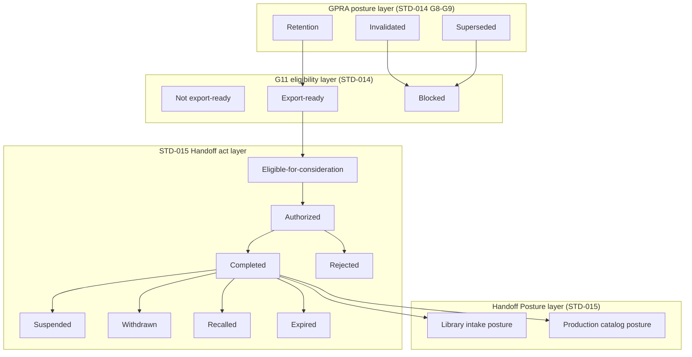

# F.I. Forgot Design Library — Volume 06

# Governed Handoff Standard

## Document Control

| Field | Value |
|-------|-------|
| **Standard ID** | `FI-DSN-STD-015` |
| **Disposition** | Design Standard (`STD`) |
| **Primary Classification** | `CLS-CPR` — Creative Production Realization |
| **Secondary Classification** | None |
| **Primary Volume** | 06 — Creative Production |
| **Architectural domain** | Domain 3 — Review, Approval, and Handoff Authority (Layer B CP-04; Review and Approval owned by `FI-DSN-STD-014`) |
| **Document** | `05-governed-handoff-standard.md` |
| **Status** | Architecture Draft |
| **Version** | 0.1 Draft |
| **Date** | August 3, 2026 |
| **Freeze date** | — |
| **Branch** | `frontend-rebuild` |
| **Owner** | F.I. Forgot |
| **Approval status** | Not approved |
| **Binding status** | Not binding |
| **Register posture** | `Architecture Draft` (`FI-DSN-REG-001`; synchronized Sprint V06-D42.15; informative posture synchronized Sprint V06-D42.16; Tranche 2 closure recorded Sprint V06-D42.21; Tranche 3 charter drafted Sprint V06-D43.1; Tranche 3 charter §24.12 corrected Sprint V06-D43.3; Tranche 3 charter accepted Sprint V06-D43.5; Tranche 3 charter committed Sprint V06-D43.6; committed charter posture synchronized Sprint V06-D43.7A; HOF-G6 normative drafting increment authorized Sprint V06-D43.9; HOF-G6-U1 normative draft Sprint V06-D43.11; HOF-G6-U1 Disposition A acceptance recorded Sprint V06-D43.13; HOF-G6-U1 committed Sprint V06-D43.14; HOF-G6-U1 post-commit Verification PASS recorded Sprint V06-D43.16; HOF-G6-U2 normative drafting authorized Sprint V06-D44.1; HOF-G6-U2 normative draft Sprint V06-D44.2; HOF-G6-U2 constitutional review Sprint V06-D44.3; HOF-G6-U2 bounded correction Sprint V06-D44.4; HOF-G6-U2 post-correction re-review Sprint V06-D44.5; HOF-G6-U2 Disposition A acceptance recorded Sprint V06-D44.6; HOF-G6-U2 committed Sprint V06-D44.7; HOF-G6-U2 post-commit Verification PASS recorded Sprint V06-D44.9) |
| **Queue posture** | EO 21 — **In progress** per Sprint V06-D32.4 governing question adoption (`FI-DSN-QUE-001`; synchronized Sprint V06-D42.15; HOF-G6-U2 drafting authorized Sprint V06-D44.1; HOF-G6-U2 normative draft Sprint V06-D44.2; HOF-G6-U2 bounded correction Sprint V06-D44.4; HOF-G6-U2 post-correction re-review Sprint V06-D44.5; HOF-G6-U2 Disposition A acceptance recorded Sprint V06-D44.6; HOF-G6-U2 committed Sprint V06-D44.7; HOF-G6-U2 post-commit Verification PASS recorded Sprint V06-D44.9) |
| **Sprint** | V06-D44.9 |
| **Governing authority** | `FI-DSN-GOV-001` — Design Standards Governance (Frozen Governance Standard, Version 1.0, July 22, 2026) |
| **Parent architecture** | `playbook/design/volume-06-creative-production/01-creative-production-architecture.md` — Creative Production Architecture (Frozen Volume Governance, Version 1.0, July 29, 2026) |
| **Volume roadmap** | `FI-DSN-VOL-001` — Design Volume Roadmap (Frozen Design Volume Roadmap, Version 1.0, July 23, 2026) |
| **Classification reference** | `FI-DSN-CLS-001` — Design Classification Strategy (Version 1.1 Frozen, July 29, 2026) |
| **Classification expansion reference** | `FI-DSN-CLS-002` — Classification Expansion Decision (Version 1.0 Frozen) |
| **Metadata reference** | `FI-DSN-GOV-002` — Design Library Metadata Standard (Frozen Governance Standard, Version 1.0, July 22, 2026) |
| **Template reference** | `FI-DSN-TPL-001` — Design Standard Template (Frozen Governance Template, Version 1.0, July 22, 2026) |
| **Identifier reference** | `FI-DSN-ID-001` — Design Identifier System (Frozen Identifier System, Version 1.0, July 22, 2026) |
| **Register reference** | `FI-DSN-REG-001` — Design Planning Register (Frozen Planning Register, Version 1.0, July 22, 2026) |
| **Queue reference** | `FI-DSN-QUE-001` — Design Drafting Queue (Frozen Design Drafting Queue, Version 1.0, July 23, 2026) |
| **Epistemic reference** | `FI-DSN-GOV-003` — Evidence vs Company Judgment Governance (Frozen Governance Standard, Version 1.0, July 23, 2026) |
| **Brain authority reference** | `FI-DSN-GOV-004` — Brain Authority Boundary (Frozen Governance Standard, Version 1.0, July 23, 2026) |
| **Upstream Volume 06 standards** | `FI-DSN-STD-012` — Production Intent and Program Governance Standard (Frozen, Version 1.0, July 29, 2026); `FI-DSN-STD-013` — Artifact Realization Governance Standard (Frozen, Version 1.0, July 29, 2026); `FI-DSN-STD-014` — Production Readiness Review and Approval Standard (Architecture Draft, Version 0.1 Draft; constitutionally complete through `FI-DSN-STD-014-R95`; G11 constitutionally closed; not approved; not frozen; not binding) |
| **Upstream philosophy** | `FI-DSN-PRN-001` — Visual Philosophy Standard (Frozen Design Principle, Version 1.0, July 24, 2026) |
| **Upstream Volume 02 standards** | `FI-DSN-STD-001` — Brand Expression Standard; `FI-DSN-STD-002` — Typography Standard; `FI-DSN-STD-003` — Composition Standard (Frozen, Version 1.0) |
| **Upstream Volume 03 standards** | `FI-DSN-STD-004` — Card Architecture Standard; `FI-DSN-STD-005` — Surface Spatial Allocation Standard; `FI-DSN-STD-006` — Envelope and Exterior Presentation Standard (Frozen, Version 1.0) |
| **Upstream Volume 04 standards** | `FI-DSN-STD-007` — Brain Visual Selection Standard; `FI-DSN-STD-008` — Occasion and Emotional Context Standard; `FI-DSN-STD-009` — Personalization Policy Standard (Frozen, Version 1.0) |
| **Manufacturing reference** | Applicable frozen `FI-MFG-*` standards per Volume 01 — Compliance Boundary context only; Handoff does not govern manufacturing execution |
| **Cross-volume intake alignment** | `FI-DSN-STD-010` — Collection Membership and Eligibility Standard (Frozen, Version 1.0); `FI-DSN-STD-011` — Collection Lifecycle and Consistency Standard (Frozen, Version 1.0); `playbook/design/volume-05-signature-collections/01-signature-collections-architecture.md` (Version 1.1 Draft, Under revision; Version 1.0 Frozen baseline July 27, 2026 remains binding) — alignment references only; not upstream constitutional owners |
| **Supporting facts** | None — company judgment standard |
| **Vendor questions** | None |

**Standard statement:** F.I. Forgot maintains **one authoritative Governed Handoff** standard that governs Decision-stage Handoff authorization, Handoff Posture declaration, consumer class binding, Handoff act lifecycle, recall and posture-transition interaction, Handoff evidence consumption, and auditable transition rules at the Volume 06 terminus — without governing Production Readiness Review and Approval, permanent collection membership admission, manufacturing execution, operational downstream intake procedures, or product implementation.

**Source basis:** Company judgment per `FI-DSN-GOV-003`. Applicable frozen `FI-MFG-*` obligations are consumed only as upstream Compliance Boundary context established before Handoff consideration. This architecture draft is not derived from product implementation, vendor facts, Brain runtime behavior, or engineering workflow design.

**Architecture posture:** Version 0.1 Architecture Draft — **accepted at draft posture** (Sprint V06-D33.7). Constitutional architecture kickoff (Sprints V06-D33.2–V06-D33.3) and continuation (Sprints V06-D33.4–V06-D33.5; corrective Sprints V06-D33.5A, V06-D33.6A). Governing question adopted (Sprints V06-D32.1–V06-D32.4; commit `87fd093`). Architecture body **complete** — Sections 1–19 authored. Independent architecture review **completed** (Sprint V06-D33.6); blocking correction **accepted** (Sprint V06-D33.6A). Section 20 requirement planning **completed** — planning framework authored (Sprint V06-D36.1); independent planning review **passed** (Sprint V06-D36.4; Disposition A); V06-D36.3 corrective **accepted**; Section 20 requirement plan **adopted** (Sprint V06-D36.5). Normative requirement drafting **authorized** for Tranche 1 (Sprint V06-D37.1). Tranche 1 normative requirements **`FI-DSN-STD-015-R01`–`R24`** **drafted** (Sprint V06-D37.1; Section 21); **committed** (Sprint V06-D37.3; commit `eeea1ce`); post-commit verified (Sprint V06-D37.4). REG/QUE Tranche 1 committed posture synchronization **committed** (Sprint V06-D37.6; commit `229f611`). All five Section 20 planning decisions **`PD-STD-015-001` through `PD-STD-015-005`** **resolved** (Sections 20.5.3–20.5.7; HGA, HCCM, HPPM, HRTCM, HERCM). Planning resolutions **committed** (Sprints V06-D38.4, V06-D38.6, V06-D39.1; commits `fc77ca7`, `b0e46d2`, `3af5ba5`). All five governed open questions **`OQ-STD-014-008`, `OQ-STD-014-009`, `OQ-STD-014-010`, `OQ-V06-007`, and `OQ-STD-015-001`** **closed** (Sprints V06-D38.2–V06-D39.0A). **Section 20 planning constitutionally complete** (Sprint V06-D39.2 synchronization). Tranche 2 normative requirements **`FI-DSN-STD-015-R24` (amended) and `R25`–`R69`** **drafted** and **committed** (Sprints V06-D40.2–V06-D41.7). Tranche 2 independent constitutional review **completed**; **Disposition A — Accept** **recorded** (Sprints V06-D42.11–V06-D42.13A). Tranche 2 post-commit verification **completed**; **Verification PASS** **accepted** (Sprints V06-D42.13B–V06-D42.15). Constitutional interpretation **recorded** (Sprints V06-D42.9–V06-D42.10). **Next assignable identifier `R70`.** Tranche 2 normative drafting **complete**; Tranche 2 **constitutionally closed** (Closure Decision A — Accept; Sprint V06-D42.20; recorded Sprint V06-D42.21). Tranche 2 constitutional closure **completed**. Tranche 3 authorization charter **accepted** and **committed** (Sprint V06-D43.6; commit `6ca8e66bd9f0166ee0519fe837a35ba0c45b6f91`; basis Sprints V06-D43.1, V06-D43.3, V06-D43.4, V06-D43.5). HOF-G6 normative drafting **authorized in principle** (Sprint V06-D43.9; Structure B — four-unit subdivision; Planning Sufficient). HOF-G6-U1 shared operative foundation **`FI-DSN-STD-015-R70`–`R83`** **drafted** (Sprint V06-D43.11); independently constitutionally **reviewed** (Sprint V06-D43.12); **Disposition A — Accept** **recorded** (Sprint V06-D43.13); **committed** (Sprint V06-D43.14; commit `3720c6531da3e704af93e03b3b19b72c7d7c9973`); post-commit verification **completed**; **Verification PASS** **accepted** (Sprint V06-D43.15); no committed discrepancy identified; UTF-8 BOM subject prefix and `Co-authored-by: Cursor` trailer disclosed as nonblocking metadata; informative posture synchronized (Sprint V06-D43.16). HOF-G6-U2 suspension operative mechanics **authorized for normative drafting** (Sprint V06-D44.1; §24.16). HOF-G6-U2 requirements **`FI-DSN-STD-015-R84` through `R97`** **drafted** (Sprint V06-D44.2; bounded corrections Sprint V06-D44.4); independently constitutionally **reviewed** (Sprint V06-D44.3); **Disposition B — Accept subject to bounded corrections** **recorded** (Sprint V06-D44.3); bounded corrections **applied** (Sprint V06-D44.4); independently constitutionally **re-reviewed** (Sprint V06-D44.5); **Disposition A — Accept** **recorded** (Sprint V06-D44.6; basis Sprint V06-D44.5 Decision A); **committed** (Sprint V06-D44.7; commit `7a7d77088c58aa19ec452f81a2c8d8aca5b78c7f`); post-commit verification **completed**; **Verification PASS** **accepted** (Sprint V06-D44.8); committed body matches accepted draft; no normative discrepancy identified; informative posture synchronized (Sprint V06-D44.9). U2 lifecycle **complete** through post-commit verification. Operative normative drafting **performed** for HOF-G6-U2 only. **Next assignable identifier `R98`** — **undrafted**. HOF-G6-U3 and U4, HERCM re-entry, HOF-G8 completion, and HOF-G9 completion normative drafting **not authorized**. **Next governed phase:** separately governed authorization of HOF-G6-U3. Tranche 3 normative drafting limited to authorized HOF-G6 increment structure only. Product Sprint 004 **not authorized**. This document does not claim approval, freeze, binding authority, or effective status.

---

## 1. Accepted Governing Question

The governing question was accepted through independent constitutional review in Sprint V06-D32.3 and adopted in Sprint V06-D32.4. It is **locked** for subsequent STD-015 drafting unless a separately authorized amendment sprint changes it.

> What governance determines whether a Governed Production-Ready Artifact may receive and retain governed Handoff posture toward constitutionally authorized downstream consumer classes at design time, while preserving separate authority over Production Readiness Review and Approval, permanent collection membership, manufacturing execution, and operational downstream intake procedures?

**Governing-question lock:** Subsequent architecture refinement and normative drafting must remain reconcilable with this question.

---

## 2. Constitutional Purpose

This standard exists to answer one constitutional problem at Volume 06 Layer B CP-04:

**How governed Handoff posture is authorized, declared, retained, lost, recalled, or suspended at design time for a Governed Production-Ready Artifact toward constitutionally authorized downstream consumer classes — without absorbing Production Readiness Review and Approval, Governed Handoff preparation export mechanics, permanent collection membership, manufacturing execution, or operational downstream intake procedures.**

Volume 06 architecture assigns Governed Handoff and Handoff Posture to Domain 3. Layer B planning splits Domain 3 into two standards: `FI-DSN-STD-014` owns **Review and Approval** through approved production-ready posture and G11 Handoff preparation exports; this standard owns **Governed Handoff** operative authority from the Domain 3 terminus through auditable Handoff posture toward downstream consumer classes.

Volume 06 ends at Governed Handoff posture. Volume 05 begins at permanent collection belonging consideration. Manufacturing Execution begins at fulfillable instance use.

This architecture draft translates the accepted governing question into constitutional structure for later normative drafting. It does not replace frozen Volume 06 Creative Production Architecture, frozen `FI-DSN-STD-012`, frozen `FI-DSN-STD-013`, frozen upstream Volumes 01–04 standards, frozen `FI-DSN-GOV-004`, or the operative normative body of `FI-DSN-STD-014`.

---

## 3. Scope and Positive Authority

### 3.1 Principal subject

This standard governs **Governed Handoff** — the constitutional Decision-stage structure for:

- **Handoff authorization** — governed acts that may permit forward Handoff under this standard (principal subject deferred in detail to future Handoff Authorization Architecture — `OQ-STD-014-008`)
- **Handoff Posture declaration** — declarative intake posture toward bound consumer contexts under HPPM partition architecture (resolved — `PD-STD-015-003`; Section 20.5.5)
- **Consumer class catalog and binding** — constitutional cataloging and binding of downstream consumer classes to Handoff context (resolved — `PD-STD-015-002`; Section 20.5.4)
- **Handoff act lifecycle** — operative states and transitions at the STD-015 act layer distinct from G11 eligibility export and GPRA posture lifecycle
- **Recall, withdrawal, and posture-transition interaction** — operative mechanics when GPRA posture or Handoff authority changes (**closed** at planning layer — `PD-STD-015-004` / HRTCM; Section 20.5.6)
- **Handoff evidence consumption** — operative requirements for evidence packages and validity exports at the Handoff boundary, building on G11 reference architecture without redefining source records
- **Auditable transition rules** — constitutional rules governing transition from Volume 06 Handoff posture to downstream consideration boundaries

### 3.2 Positive authority summary

| Authority domain | Architectural ownership |
|------------------|-------------------------|
| Handoff authorization act architecture | Governed acts permitting forward Handoff — principal STD-015 subject |
| Handoff Posture declaration | Declarative posture per GPRA and target consumer class |
| Consumer class catalog and binding | Constitutional consumer taxonomy and context binding |
| Handoff act lifecycle | Operative HSLM act-layer states — distinct from G11 eligibility layer |
| Recall and withdrawal mechanics | Operative transition when GPRA or Handoff authority changes |
| Handoff evidence at authorization boundary | Operative consumption of HEPM reference classes and HVEM exports |
| Authoritative Handoff per context | Which Handoff posture is authoritative per obligation and consumer class |
| Historical Handoff record preservation | Additive audit of Handoff acts and posture transitions |

### 3.3 Architectural principles (provisional)

| ID | Principle | Rule |
|----|-----------|------|
| **HOF-P1** | **GPRA is not Handoff** | GPRA grant and approved production-ready posture are necessary upstream inputs only; they do not declare Handoff Posture or perform Handoff authorization (`FI-DSN-STD-014` PRR-P4 reciprocal) |
| **HOF-P2** | **Eligibility is not authorization** | G11 Handoff eligibility exports describe whether Handoff may be considered; eligibility facts do not authorize Handoff acts (HEIM) |
| **HOF-P3** | **Handoff is not membership** | Handoff Posture does not grant permanent collection membership (Volume 06 AX-2, P3) |
| **HOF-P4** | **Handoff is not manufacturing execution** | Governed Handoff governs constitutional transition and boundary control only; it does not authorize manufacture, production execution, or fulfillment (HMEX) |
| **HOF-P5** | **Handoff is not operational intake** | Handoff Posture enables downstream consideration; it does not perform Volume 05 intake procedures or engineering handoff APIs |
| **HOF-P6** | **Brain does not authorize Handoff** | Brain outputs at the Handoff boundary remain advisory and nonbinding; Brain does not authorize, execute, recall, or terminate Handoff (HBIM; `FI-DSN-GOV-004`) |
| **HOF-P7** | **Historical Handoff is preserved** | Prior Handoff authorization and posture records remain additive historical fact when GPRA posture later changes (HPAM extension) |
| **HOF-P8** | **Upstream law is consumed, not rewritten** | STD-014 GPRA outputs, G11 export contracts, and upstream Compliance Boundaries are consumed; STD-015 does not re-perform Review, Approval, or G11 preparation |
| **HOF-P9** | **Handoff policy is not runtime selection** | Handoff authorization is distinct from Brain Visual Selection Decision and customer Selection (`FI-DSN-GOV-004`) |
| **HOF-P10** | **Handoff lifecycle is peer-distinct** | Handoff act lifecycle is distinct from artifact lifecycle, GPRA posture lifecycle, Review lifecycle, and G11 eligibility-layer export states (HSLM two-layer split) |

### 3.4 Open questions — architectural placement

The following governed open questions were **framed** at the architecture layer (Sections 1–19). All five are **closed** at the Section 20 planning layer (Sections 20.5.3–20.5.7).

| Open question | Future architecture section | Principal STD-015 subject |
|---------------|----------------------------|---------------------------|
| `OQ-STD-014-008` | Handoff Authorization Architecture | What constitutionally authorized authority class may perform Governed Handoff authorization acts? — **Closed** (Sprint V06-D38.2; `PD-STD-015-001`; Section 20.5.3) |
| `OQ-STD-014-009` | Consumer Class and Binding Architecture | How are downstream consumer classes constitutionally cataloged and bound to Handoff context? — **Closed** (Sprint V06-D38.3; `PD-STD-015-002`; Section 20.5.4) |
| `OQ-STD-014-010` | Recall, Withdrawal, and Posture Transition Architecture | When GPRA posture becomes **Invalidated** or **Superseded**, is forward Handoff recall automatic, separately authorized, or notification-only? — **Closed** (Sprint V06-D38.9A; `PD-STD-015-004`; Section 20.5.6) |
| `OQ-V06-007` | Handoff Posture Declaration Architecture | Should Handoff Posture always split into library intake and production catalog classes, or may a single handoff serve both when rules are identical? — **Closed** (Sprint V06-D38.5; `PD-STD-015-003`; Section 20.5.5) |
| `OQ-STD-015-001` | Handoff Act Lifecycle / Re-entry Architecture | May a GPRA re-enter the Handoff act path after **Rejected**, **Suspended**, **Withdrawn**, **Recalled**, or other relevant act-layer states — and if so, under what upstream posture, eligibility, and authorization conditions? — **Closed** (Sprint V06-D39.0A; `PD-STD-015-005`; Section 20.5.7) |

---

## 4. Explicit Exclusions

This standard does **not** own:

| Subject | Authoritative owner |
|---------|---------------------|
| Declared Production Intent, Production Program, Production Obligation establishment | `FI-DSN-STD-012` |
| Exploration-Entry Authorization, waivers, and Domain 1 posture | `FI-DSN-STD-012` |
| Exploration Posture operation, Realization commitment, RVA existence | `FI-DSN-STD-013` |
| RVA version lineage, iteration, method-neutral realization paths | `FI-DSN-STD-013` |
| Realization Traceability Package creation | `FI-DSN-STD-013` |
| Review-Entry Readiness creation | `FI-DSN-STD-013` |
| Production-readiness Review, Review Determination, Approval, GPRA grant | `FI-DSN-STD-014` |
| Invalidated and Superseded posture establishment | `FI-DSN-STD-014` G8–G9 |
| Governed Handoff preparation, eligibility-layer export states, G11 output contract | `FI-DSN-STD-014` G11 |
| Permanent collection membership admission and eligibility rules | `FI-DSN-STD-010` / Volume 05 |
| Collection lifecycle, publication, maintenance, and retirement | `FI-DSN-STD-011` / Volume 05 |
| Operational downstream intake procedures and membership workflows | Volume 05 / engineering |
| Contextual selection and authorized alternatives | `FI-DSN-STD-007` |
| Occasion and emotional context semantics | `FI-DSN-STD-008` |
| Personalization policy | `FI-DSN-STD-009` |
| Visual permission and identity eligibility | Volume 02 |
| Surface structure and spatial allocation | Volume 03 |
| Metadata field semantics and provenance schema | `FI-DSN-GOV-002` |
| Manufacturing Validation mechanics and Fulfillment Execution | Volume 01 operational layer / engineering |
| Brain runtime recommendation, ranking, and customer Selection | `FI-DSN-GOV-004` / product implementation |
| Product UI, DAM workflows, APIs, databases, prompts, models, queues | Engineering specifications |
| Product Sprint 004 authorization or implementation scope | Not authorized |

---

## 5. Constitutional Entry Boundary

STD-015 authority begins only when upstream Domain 3 outputs satisfy minimum Handoff entry conditions per `FI-DSN-STD-014` Section 13 and G11 export contract.

### 5.1 Minimum upstream inputs

| Input | Source | Consumption |
|-------|--------|-------------|
| **Governed Production-Ready Artifact (GPRA)** | `FI-DSN-STD-014` G6 | Hard entry gate — Handoff does not commence on non-approved artifacts |
| **Approval evidence and Review Determination reference** | `FI-DSN-STD-014` G5–G6 | Constitutional fact — consumed, not recreated |
| **Current GPRA posture** | `FI-DSN-STD-014` G8–G9 | **Retention**, **Invalidated**, or **Superseded** — consumed; STD-015 does not establish GPRA posture |
| **Production Obligation attribution** | `FI-DSN-STD-012` / `FI-DSN-STD-013` / `FI-DSN-STD-014` | Scope binding for Handoff context |
| **Authoritative GPRA identity per obligation and consumer context** | `FI-DSN-STD-014` G9 PSIM consumption | Succession context — consumed, not re-performed |
| **Handoff eligibility export** | `FI-DSN-STD-014` G11 HEIM | Factual eligibility for Handoff consideration — not authorization |
| **Handoff evidence package references** | `FI-DSN-STD-014` G11 HEPM | Mandatory reference classes — consumed and extended at operative layer only |
| **Validity export posture** | `FI-DSN-STD-014` G11 HVEM | Current posture fact for consumer context — source records remain authoritative |
| **Consumer context boundary keys** | `FI-DSN-STD-014` G11 HCBM | Boundary keys into downstream domains — catalog and binding **resolved** (`PD-STD-015-002`; Section 20.5.4) |
| **G11 eligibility-layer condition** | `FI-DSN-STD-014` G11 HSLM | Not export-ready / Export-ready / Blocked — G11 layer only; distinct from Handoff act states |

### 5.2 Entry boundary rules (architectural)

- GPRA grant is a **necessary** upstream condition for Handoff consideration. GPRA grant is **not** Handoff authorization (HOF-P1; HEIM).
- G11 export-ready eligibility is a **necessary factual input** for Handoff consideration where governing law requires it. Export-ready eligibility is **not** Handoff authorization (HOF-P2).
- **Invalidated** or **Superseded** GPRA posture removes forward Handoff eligibility on the affected GPRA in the superseded context (`FI-DSN-STD-014` G8 `R60`; G9 `R71`). STD-015 consumes those posture effects; STD-015 does not perform invalidation or supersession acts.
- STD-015 does not invent operational intake procedures, queue mechanics, notification systems, or engineering APIs for Handoff entry.
- STD-015 does not reopen G11 constitutional closure or redefine G11 normative requirements.

### 5.3 Upstream G11 planning models consumed at entry (reference only)

The following G11 planning models from `FI-DSN-STD-014` Section 20.23 establish consumption boundaries at entry. Operative STD-015 architecture extends where noted; recall and re-entry mechanics adopted at Section 20 planning layer (Sections 20.5.6–20.5.7).

| Model | Designation | Entry-boundary role |
|-------|-------------|---------------------|
| HCPM | Handoff Constitutional Purpose Model | Purpose boundary — Handoff is not Approval, Review, or downstream execution |
| HAAM | Handoff Authority Architecture Model | Prohibition map — Handoff authorization class deferred (`OQ-STD-014-008`) |
| HEIM | Handoff Eligibility Interaction Model | Eligibility facts versus authorization acts |
| HEPM | Handoff Evidence Package Model | Mandatory reference classes at consideration boundary |
| HVEM | Handoff Validity Export Model | Posture export consumption; stale-detection context |
| HCBM | Handoff Consumer Boundary Model | Consumer category boundary keys consumed; operative catalog **resolved** (`PD-STD-015-002`; Section 20.5.4) |
| HSLM | Handoff State and Lifecycle Model | Two-layer split — G11 eligibility layer versus STD-015 act layer |
| HRWM | Handoff Recall and Withdrawal Model | Constitutional eligibility effects consumed — recall trigger catalog adopted at planning layer (`PD-STD-015-004` / HRTCM; Section 20.5.6) |
| HBIM | Handoff Brain Interaction Model | Brain advisory boundary at Handoff preparation and consideration |
| HMEX | Handoff Manufacturing Exclusion Model | Manufacturing and production execution exclusion |
| HPAM | Handoff Preservation and Auditability Model | G11 preparation preservation — extended to Handoff acts in later architecture |

### 5.4 Downstream exit boundary (architectural framing only)

Handoff Posture declares constitutional readiness for downstream **consideration** by authorized consumer classes. Downstream domains own operative behavior within their boundaries:

| Downstream domain | STD-015 relationship |
|-------------------|----------------------|
| Volume 05 permanent collection membership | GPRA presentation and Handoff Posture are prerequisites for intake **consideration** only — not admission |
| Production catalog consumers | Handoff Posture authorizes constitutional boundary crossing — not catalog implementation |
| Manufacturing / fulfillment / publication / distribution | Consumer boundary keys per HCBM — execution excluded (HMEX) |

Detailed downstream exit architecture is established in Section 13. Volume 05 intake alignment references (`FI-DSN-STD-010`, `FI-DSN-STD-011`) inform boundary framing only; they are not upstream constitutional owners of Handoff authority.

---

## 6. Handoff Authorization Architecture

Handoff authorization is the governed Decision-stage act that may permit forward Handoff under this standard. It is constitutionally distinct from GPRA grant, G11 eligibility export, Handoff Posture declaration, and downstream intake execution (HOF-P1; HOF-P2; HEIM; HAAM).

### 6.1 Authorization as a governed act

| Concept | Architectural meaning | Distinguished from |
|---------|----------------------|-------------------|
| **Handoff authorization act** | A recorded Decision-stage act attributable to a constitutionally authorized authority class that permits forward Handoff consideration to proceed under governing law | GPRA grant; G11 export-ready eligibility; Brain recommendation; downstream intake admission |
| **Handoff authorization withholding** | A recorded Decision-stage act or documented ground that prevents forward Handoff authorization on eligible inputs | Review Determination fail; Approval withholding; G11 blocked export |
| **Handoff authorization scope** | The binding of authorization to a specific GPRA, Production Obligation scope, and consumer context | Bare artifact identity; program-wide blanket authorization |

Handoff authorization is **instance-level** and **context-bound**. It applies to a defined GPRA under a defined Production Obligation scope toward a defined consumer context. It is not a program-wide policy label and not a downstream operational grant.

### 6.2 Authority classes explicitly excluded from Handoff authorization

HAAM (`FI-DSN-STD-014` Section 20.23.2) establishes that the following upstream authority domains do **not** perform Handoff authorization acts. This architecture preserves those prohibitions without redefining upstream owners.

| Authority domain | Relationship to Handoff authorization |
|------------------|--------------------------------------|
| **MAGAC (G6 Approval)** | Grants GPRA — necessary upstream input only |
| **DDAC / DSRA (G7)** | Governs Review downstream disposition and rework return — does not authorize Handoff |
| **G8 invalidation authority** | Establishes **Invalidated** posture — removes forward eligibility; does not perform Handoff recall mechanics |
| **G9 SSAC** | Establishes **Superseded** posture — removes forward reliance; does not perform Handoff recall mechanics |
| **G10 Brain** | Advisory eligibility signals and reevaluation requests only — does not authorize Handoff |
| **G11 export contract** | Exports eligibility facts — does not authorize Handoff |
| **Downstream consumer domains** | May consume Handoff Posture — do not retroactively authorize Handoff |

### 6.3 Handoff authorization authority — `OQ-STD-014-008` (closed)

**Question:** What constitutionally authorized authority class may perform Governed Handoff authorization acts?

**Resolution status:** **Closed** (Sprint V06-D38.2). `PD-STD-015-001` **resolved** at Section 20.5.3.

**Adopted planning architecture:** One constitutional **Handoff Governance Authority (HGA)** performs all operative STD-015 Handoff acts through a mandatory **act-type attribution matrix**. Peer-distinct decision classes (§14.2) are preserved by separate act attribution and separate **HOEM** operative record expectations — not by multiple constitutional authority owners.

**Planning model consumed:** HAAM — prohibition map inherited; operative authority class catalog **adopted at planning layer** in Section 20.5.3. Normative catalog integration drafts in HOF-G2 and HOF-G9 (Tranche 2 — separately authorized).

**Remaining architecture refinement dimensions (not blocking HOF-G2 planning):**

| Dimension | Architectural role | Resolution status |
|-----------|-------------------|-------------------|
| Delegation and substitution | Whether HGA may delegate act performance to another attribution path | **Open** — normative refinement |
| Multi-party authorization | Whether any Handoff act requires single or multiple attributed acts | **Open** — normative refinement |
| System versus human attribution | How governed system recording relates to human accountability at the Handoff boundary | **Open** — normative refinement |

### 6.4 Authorization boundary rules (architectural)

- Handoff authorization acts are recorded as additive historical constitutional fact (HOF-P7; HPAM extension).
- Withholding Handoff authorization does not invalidate GPRA, does not revoke Approval, and does not perform downstream intake rejection.
- Brain outputs may inform Handoff authorization consideration but do not substitute for a Handoff authorization act (HOF-P6; HBIM).
- Handoff authorization does not grant permanent collection membership, manufacturing execution authority, or operational intake admission (HOF-P3; HOF-P4; HOF-P5).

---

## 7. Consumer Class and Binding Architecture

Consumer classes identify the downstream constitutional domain toward which Handoff Posture is declared. Consumer binding attaches Handoff context to a specific GPRA, Production Obligation scope, and consumer class identity.

### 7.1 Consumer class versus consumer context

| Term | Architectural meaning | Owner layer |
|------|----------------------|-------------|
| **Consumer class** | A constitutionally cataloged category of downstream use with distinct governing downstream rules | STD-015 operative catalog — **resolved** (`PD-STD-015-002`; Section 20.5.4) |
| **Consumer context** | The bound instance of a consumer class for a specific Handoff act — obligation scope plus class identity plus boundary key | STD-015 binding architecture |
| **Consumer context boundary key** | HCBM abstract category key exported from G11 — identifies boundary **into** a domain, not internal consumer behavior | G11 export; consumed by STD-015 |

Consumer class architecture governs **what categories exist** and **how they are constitutionally distinguished**. Consumer binding architecture governs **how a GPRA is attached** to one or more consumer contexts for Handoff consideration.

### 7.2 HCBM boundary categories (consumed, not redefined)

G11 HCBM (`FI-DSN-STD-014` Section 20.23.6) establishes abstract consumer-category boundary keys at the preparation layer:

| HCBM boundary category | Constitutional boundary role |
|------------------------|------------------------------|
| **Manufacturing** | Design-time feasibility consumption boundary into manufacture planning |
| **Production** | Operational production intake |
| **Catalog** | Production catalog or library catalog intake distinction |
| **Fulfillment** | Post-production fulfillment intake |
| **Publication** | Publication or release intake |
| **Distribution** | Distribution channel intake |
| **Archival systems** | Long-term constitutional record consumption |

STD-015 consumes HCBM keys as upstream boundary vocabulary. STD-015 does not redefine G11 boundary key export mechanics. Operative consumer class **catalog** and **binding** architecture is **resolved** at Section 20.5.4 (`PD-STD-015-002`). Handoff Posture **partition** architecture is **resolved** at Section 20.5.5 (`PD-STD-015-003`).

### 7.3 Volume 06 Handoff Posture classes (upstream reference)

Frozen Volume 06 architecture (Section 12.2) defines two Handoff Posture consumer classes at the volume layer:

| Volume 06 class | Constitutional meaning |
|-----------------|------------------------|
| **Library intake posture** | GPRA presented for Volume 05 permanent membership consideration |
| **Production catalog posture** | GPRA authorized for production artwork library intake under engineering specification |

Volume 06 provides that Handoff Posture classes are not merged when governing downstream rules differ. HCBM-to-catalog mapping, Volume 06 **posture-class affinity**, and **mandatory posture partition** are **resolved** at Sections 20.5.4–20.5.5 (`PD-STD-015-002`, `PD-STD-015-003`).

### 7.4 Consumer class and binding — `OQ-STD-014-009` (closed)

**Question:** How are downstream consumer classes constitutionally cataloged and bound to Handoff context?

**Resolution status:** **Closed** (Sprint V06-D38.3). `PD-STD-015-002` **resolved** at Section 20.5.4.

**Adopted planning architecture:** **HCCM** — Handoff Consumer Class Model: a **closed operative catalog** of six constitutional consumer classes with mandatory **HCBM boundary-key mapping**, **bound consumer context** identity rules, and **multi-binding** cardinality — without prescribing implementation. Posture partition is **resolved** at Section 20.5.5 (`PD-STD-015-003`).

**Planning model consumed:** HCBM (`FI-DSN-STD-014` Section 20.23.6; `FI-DSN-STD-014-R89`) — boundary keys consumed; catalog and binding owned by STD-015 at planning layer Section 20.5.4.

### 7.5 Consumer binding boundary rules (architectural)

- Consumer binding identifies downstream **consideration** targets; it does not execute downstream intake procedures (HOF-P5).
- Consumer binding does not grant collection membership, manufacturing authority, or fulfillment authorization (HOF-P3; HOF-P4).
- G9 PSIM authoritative GPRA succession constrains which GPRA may be bound in a superseded context — binding consumes PSIM facts; STD-015 does not establish supersession.
- Consumer class catalog and binding resolution is **complete** at planning layer (`PD-STD-015-002`; Section 20.5.4); G11 remains limited to boundary key export.

---

## 8. Handoff Posture Declaration Architecture

Handoff Posture is the declarative constitutional output of Governed Handoff — the governed statement that a GPRA holds intake posture toward a defined consumer class at the Volume 06 terminus.

### 8.1 Handoff Posture as declarative output

| Concept | Architectural meaning | Distinguished from |
|---------|----------------------|-------------------|
| **Handoff Posture** | Declarative constitutional state that a GPRA is offered toward a defined consumer class under governing law | GPRA Retention posture; G11 export-ready eligibility; downstream membership admission |
| **Handoff Posture declaration act** | The governed act that establishes or updates Handoff Posture for a bound consumer context | Handoff authorization act — related but architecturally distinct |
| **Authoritative Handoff Posture** | For a given Production Obligation and consumer class, the Handoff Posture that governs forward downstream reliance | Superseded Handoff Posture in the same context when replaced |

Volume 06 lifecycle table assigns Governed Handoff the output **Handoff Posture** with cardinality **1 per GPRA per target consumer class**. HPPM operationalizes this as **1 authoritative Handoff Posture per HCCM bound consumer context** (Section 20.5.5).

### 8.2 Authorization versus declaration (architectural split)

Handoff architecture treats **authorization** and **posture declaration** as related but peer-distinct constitutional acts:

| Act type | Architectural role |
|----------|-------------------|
| **Handoff authorization** | Permits forward Handoff under governing law for a defined context |
| **Handoff Posture declaration** | Declares the constitutional intake posture held toward a consumer class |

A complete Handoff architecture must reconcile whether authorization and declaration are always co-occurring acts, sequential acts, or independently recordable acts. That reconciliation is deferred to architecture refinement and normative drafting — not resolved here.

### 8.3 Open question framing — `OQ-V06-007` (closed)

**Question:** Should Handoff Posture always split into library intake and production catalog classes, or may a single handoff serve both when rules are identical?

**Resolution status:** **Closed** (Sprint V06-D38.5). `PD-STD-015-003` **resolved** at Section 20.5.5.

**Adopted planning architecture:** **HPPM** — Handoff Posture Partition Model: **catalog-driven mandatory posture partition** — authoritative Handoff Posture is **one per HCCM bound consumer context**; unified posture declaration across `CC-01` and `CC-02` posture-class affinities is **constitutionally prohibited**; unified-when-identical posture (Model B) is **rejected**.

**Candidate models (disposition):**

| Model | Description | Disposition |
|-------|-------------|-------------|
| **A — Always split** | Separate Handoff Posture declarations per posture-class affinity context | **Adopted** for `CC-01` / `CC-02` via HPPM |
| **B — Split by default, unified when identical** | Single declaration when governing rules provably identical | **Rejected** at planning layer |
| **C — Catalog-driven split** | Partition follows HCCM bound consumer context and posture-class affinity | **Adopted** as operative HPPM architecture |

Architecture Sections 1–19 do not adopt operative posture partition mechanics. Operative architecture is **resolved** at Section 20.5.5.

### 8.4 Handoff Posture boundary rules (architectural)

- Handoff Posture declaration does not grant permanent collection membership (HOF-P3).
- Handoff Posture declaration does not execute Volume 05 intake procedures or production catalog admission (HOF-P5).
- Handoff Posture is forward-reliance posture at the Volume 06 boundary — downstream domains consume it; STD-015 does not govern downstream acceptance or rejection of intake objects.
- Loss of GPRA forward-active posture (**Invalidated** or **Superseded**) affects whether Handoff Posture may be declared or retained — operative recall interaction deferred to Section 10.

---

## 9. Handoff Act Lifecycle Architecture

Handoff act lifecycle governs operative states and transitions at the STD-015 act layer. It is peer-distinct from G11 eligibility-layer export states, GPRA posture lifecycle, and artifact lifecycle (HOF-P10; HSLM).

### 9.1 Two-layer lifecycle model (architectural)

| Layer | Owner | Permitted vocabulary (planning) | Relationship to Handoff acts |
|-------|-------|------------------------------|------------------------------|
| **G11 eligibility layer** | `FI-DSN-STD-014` G11 | Not export-ready; Export-ready; Blocked | Upstream factual gate — consumed at entry |
| **STD-015 Handoff act layer** | This standard | Eligible-for-consideration; Authorized; Completed; Rejected; Suspended; Withdrawn; Recalled; Expired | Operative lifecycle — normative establishment deferred |

G11 eligibility-layer conditions describe whether Handoff **may be considered**. STD-015 act-layer states describe what happened in Handoff **authorization and posture governance** after consideration begins.

### 9.2 Baseline act-layer states (architecture vocabulary)

The following states constitute the **baseline HSLM act-layer vocabulary** adopted from `FI-DSN-STD-014` Section 20.23.7 planning architecture and **normatively adopted** at the operative act layer by `FI-DSN-STD-015-R48` (HOF-G5 baseline). Operative transition mechanics for suspension, withdrawal, recall, and HERCM re-entry remain separately authorized in Tranche 3.

| State (baseline) | Architectural meaning at act layer |
|---------------------|-----------------------------------|
| **Eligible-for-consideration** | Minimum upstream inputs and G11 eligibility export satisfy entry boundary; Handoff act path may be evaluated |
| **Authorized** | A Handoff authorization act has been recorded for the defined context |
| **Completed** | Handoff Posture has been declared and Handoff obligations for the act are satisfied at the Volume 06 boundary |
| **Rejected** | Handoff authorization or posture declaration has been withheld or denied on documented constitutional grounds |
| **Suspended** | Forward reliance on an otherwise authorized Handoff is temporarily paused without erasing historical act record |
| **Withdrawn** | A prior Handoff authorization or posture is actively retracted at the Handoff layer — distinct from GPRA Invalidated posture |
| **Recalled** | Forward Handoff authority ceases for downstream use while preserving historical Handoff records |
| **Expired** | Handoff authorization or posture loses forward effect by governed time or validity boundary without necessarily implying GPRA posture change |

### 9.3 Provisional transition map (architectural)

```
[G11 Export-ready] + [GPRA Retention] + [Entry inputs satisfied]
        ↓
[Eligible-for-consideration]
        ↓ Handoff authorization act (authority class — OQ-008)
[Authorized]
        ↓ Handoff Posture declaration
[Completed]  |  [Rejected]
        ↓ suspension / withdrawal / recall / expiry paths
[Suspended] | [Withdrawn] | [Recalled] | [Expired]
```

**Re-entry paths** after Rejected, Suspended, Withdrawn, or Recalled are **not architecturally resolved** in Sections 1–19 of this draft. **Planning-layer synchronization:** re-entry architecture **resolved** at Section 20.5.7 (HERCM; `PD-STD-015-005`; `OQ-STD-015-001` **closed**). Normative transition rules remain separately authorized.

### 9.4 Act lifecycle boundary rules (architectural)

- Act-layer states do not substitute for GPRA **Retention**, **Invalidated**, or **Superseded** posture — those remain STD-014 G8–G9 authority.
- Act-layer **Blocked** eligibility remains a G11 export condition, not an STD-015 operative act state.
- Transition rules are architectural framing only; operative transition requirements are deferred to normative drafting.
- Brain advisory signals do not trigger act-layer state transitions as constitutional acts (HOF-P6).

---

## 10. Recall, Withdrawal, and Posture Transition Architecture

Recall and posture-transition architecture governs how changes to GPRA posture or Handoff authority affect forward Handoff reliance while preserving historical Handoff records (HRWM; HOF-P7).

### 10.1 Constitutional effects consumed from upstream (HRWM)

G11 HRWM (`FI-DSN-STD-014` Section 20.23.8) establishes constitutional **eligibility effects** that STD-015 consumes without re-performing upstream acts:

| Upstream event | Effect on forward Handoff eligibility | Historical Handoff records | Operative recall mechanics |
|----------------|--------------------------------------|---------------------------|---------------------------|
| **GPRA Invalidated** | Forward Handoff eligibility **lost** on affected GPRA | Prior Handoff records **preserved** as historical fact | Recall trigger catalog adopted at planning layer — `PD-STD-015-004` / HRTCM (Section 20.5.6) |
| **GPRA Superseded** | Forward reliance on predecessor **lost** in superseded context | Prior Handoff records **preserved** | Successor GPRA governs forward export only when independently eligible — recall mechanics **deferred** |
| **Governed withdrawal** | Not a Layer B GPRA posture | Additive withdrawal history | Withdrawal act authority deferred to STD-015 — mechanics **open** |
| **Operational recall** | Operational domain action — not Layer B posture | Notification and audit trail additive | **Excluded** — HMEX; not STD-015 Layer B authority |

STD-015 owns operative mechanics for how Handoff act-layer states respond to upstream posture changes. STD-015 does not establish **Invalidated** or **Superseded** GPRA posture.

### 10.2 Recall versus withdrawal versus suspension (architectural framing)

| Concept | Architectural layer | Principal question |
|---------|--------------------|--------------------|
| **Recall** | Handoff act layer | Forward Handoff authority ceases for downstream use; historical record preserved |
| **Withdrawal** | Handoff act layer | Active retraction of Handoff authorization or posture by governed Handoff authority — distinct from GPRA posture loss |
| **Suspension** | Handoff act layer | Temporary pause of forward reliance without erasing authorization history |
| **Invalidation** | GPRA posture layer (G8) | Upstream posture establishment — consumed, not performed by STD-015 |
| **Supersession** | GPRA posture layer (G9) | Upstream posture establishment — consumed, not performed by STD-015 |

Architecture must preserve this layer separation. Collapsing GPRA posture transitions into Handoff recall acts — or treating Handoff recall as automatic upon Invalidated posture without governed resolution — would violate HAAM and HRWM planning boundaries.

### 10.3 Open question framing — `OQ-STD-014-010`

**Question:** When GPRA posture becomes **Invalidated** or **Superseded**, is forward Handoff recall automatic, separately authorized, or notification-only?

**Architectural framing (unresolved):** This question governs operative mechanics at the intersection of G8/G9 posture effects and Handoff act-layer **Recalled** state. Architecture must eventually select among (or combine) the following **candidate models** without precommitting in this draft:

| Model | Description | Architectural consequence |
|-------|-------------|--------------------------|
| **A — Automatic recall** | Invalidated or Superseded posture automatically transitions affected Handoff act layer to Recalled without a separate Handoff authorization act | Simplest downstream reliance rule; may reduce audit attribution granularity |
| **B — Separately authorized recall** | A constitutionally authorized Handoff authority class must perform a distinct recall act when posture changes | Preserves act attribution; higher governance overhead |
| **C — Notification-only** | Upstream posture change is exported; downstream consumers responsible for ceasing reliance; Handoff act layer records notification fact only | Preserves STD-015 boundary minimalism; shifts reliance risk downstream |
| **D — Hybrid by event type** | Invalidation and supersession trigger different recall mechanics | Most expressive; requires event-type architecture not yet defined |

**HRWM planning constraint:** Regardless of model selected, prior Handoff records remain **preserved as historical fact** (HOF-P7). Recall mechanics govern **forward reliance only** — not historical erasure.

**Resolution status:** Architecture Sections 1–19 preserve candidate Models A–D framing without selection. **Planning-layer synchronization:** `OQ-STD-014-010` **closed** (Sprint V06-D38.9A); `PD-STD-015-004` **resolved** — HRTCM separately authorized HGA recall act architecture (Section 20.5.6).

### 10.4 Posture transition interaction rules (architectural)

- Supersession of a GPRA does not automatically transfer Handoff Posture to a successor GPRA — successor eligibility and authorization require independent satisfaction of entry boundary conditions.
- Invalidation of a GPRA removes forward Handoff eligibility on the affected GPRA; operative Handoff recall trigger catalog adopted at planning layer (`PD-STD-015-004` / HRTCM; Section 20.5.6).
- Withdrawal at the Handoff act layer is architecturally distinct from governed withdrawal referenced in HRWM and from GPRA posture transitions — operative withdrawal authority deferred to normative drafting alongside `OQ-STD-014-008`.
- Operational recall, notification delivery, and consumer-side revocation procedures remain excluded from STD-015 (HMEX; HOF-P4; HOF-P5).
- All recall, withdrawal, and posture-transition records are additive historical fact — no overwrite of Approval, GPRA grant, Review Determination, or G11 preparation records (HPAM).

---

## 11. Evidence and Validity Consumption Architecture

Evidence and validity consumption architecture governs how STD-015 consumes upstream G11 evidence reference architecture and validity exports at the Handoff authorization boundary — and how operative Handoff evidence extends that consumption without redefining source records or inventing implementation schemas.

### 11.1 Four-model evidence relationship (architectural)

G11 establishes preparation-layer evidence and validity export architecture. STD-015 consumes and extends that architecture at the operative Handoff act layer through four peer-related models:

| Model | Layer | Architectural role | Authoritative owner |
|-------|-------|-------------------|---------------------|
| **HEPM** — Handoff Evidence Package Model | G11 preparation / reference | Mandatory **reference classes** linking authoritative source constitutional records required for Handoff consideration | `FI-DSN-STD-014` G11 |
| **HVEM** — Handoff Validity Export Model | G11 preparation / export | Current posture and eligibility **facts** exported for consumer context without rewriting source history | `FI-DSN-STD-014` G11 |
| **HOEM** — Handoff Operative Evidence Model | STD-015 act layer | Operative **Handoff evidence** recorded at authorization, posture declaration, completion, recall, and withdrawal acts — additive to HEPM references, not a substitute for source records | This standard |
| **Advisory evidence** — Brain and analytical inputs | Advisory / nonbinding | Eligibility analysis, gap detection, stale-export signals, and routing suggestions — consumed for consideration only | `FI-DSN-GOV-004`; G10 BRPAM; HBIM |

**Architectural relationship:** HEPM defines what upstream constitutional records **must be referencable** for Handoff consideration. HVEM defines what current validity **facts** may be exported from those sources. HOEM defines what operative Handoff act records **may be added** when STD-015 performs authorization, posture declaration, and lifecycle acts. Advisory evidence **may inform** consideration but does not constitute HEPM reference satisfaction, HVEM validity facts, HOEM operative records, or Handoff authorization (HOF-P6; HBIM).

### 11.2 Reference classes versus operative Handoff evidence

Architecture preserves a strict distinction between evidence **reference classes** and operative Handoff **evidence acts**:

| Evidence category | What it is | What it is not |
|-------------------|-----------|----------------|
| **HEPM reference class** | Read-only pointer to an authoritative source constitutional record (artifact identity, Review Determination, Approval, GPRA, posture, lineage, consumer boundary key, etc.) | Operative Handoff authorization; Handoff Posture; downstream intake admission |
| **HVEM validity export** | Evaluation-point snapshot of current GPRA posture, authoritative GPRA identity, and derived eligibility facts for a defined consumer context | A new constitutional posture; a substitute for source G8/G9 records |
| **HOEM operative record** | Additive record of a Handoff act and its constitutional basis at the STD-015 layer (authorization attribution, posture declaration, completion fact, recall or withdrawal fact) | A rewrite, merge, or replacement of HEPM source records |
| **Advisory evidence** | Nonbinding analytical input (Brain recommendation history, inconsistency signals, stale-export advisories) | Mandatory reference class satisfaction; authorization substitute |

HEPM reference classes remain **authoritative at their source domains**. STD-015 consumes references; STD-015 does not recreate Review Determination, Approval, GPRA grant, or G11 preparation records (HOF-P8; HPAM).

HOEM operative records document **what STD-015 did** at the Handoff boundary. They do not elevate advisory inputs to constitutional fact and do not collapse reference bundles into execution instructions.

### 11.3 Eligibility versus authorization in evidence consumption

Evidence consumption architecture reinforces HEIM separation (HOF-P2):

| Evidence posture | Layer | Consumption rule (architectural) |
|------------------|-------|-------------------------------|
| **G11 export-ready eligibility** | G11 eligibility layer | Factual input that Handoff **may be considered** — not evidence of Handoff authorization |
| **HVEM forward eligibility flag** | G11 export / derived fact | Informational export for downstream convenience — not Handoff authorization |
| **HEPM package completeness** | G11 reference architecture | Mandatory reference availability for consideration — not authorization |
| **HOEM authorization record** | STD-015 act layer | Evidence that a Handoff authorization act occurred — distinct from eligibility export |
| **HOEM posture declaration record** | STD-015 act layer | Evidence that Handoff Posture was declared — distinct from both eligibility and authorization where architecture treats them as peer acts |

Architecture must prevent treating export-ready eligibility, complete HEPM reference bundles, or advisory gap-clearance signals as substitutes for governed Handoff authorization acts (`OQ-STD-014-008` governs authorization class catalog — not resolved here).

### 11.4 Stale, invalidated, and superseded evidence protection

HVEM establishes stale-validity detection context: exports carry evaluation-point identity sufficient for downstream systems to detect superseded snapshots without rewriting source history. STD-015 evidence consumption architecture extends that protection at the operative boundary:

| Upstream condition | Effect on evidence consumption (architectural) |
|--------------------|-----------------------------------------------|
| **GPRA Retention** | HEPM references and HVEM exports remain consumable for forward Handoff consideration when other entry conditions are satisfied |
| **GPRA Invalidated** | Forward Handoff eligibility is lost on the affected GPRA; invalidated posture **must not silently support** new Handoff authorization or posture declaration — stale HVEM exports and prior eligibility snapshots cannot substitute for current posture fact |
| **GPRA Superseded** | Forward reliance on predecessor GPRA in the superseded context is lost; successor GPRA governs forward export only when independently eligible — predecessor HEPM/HVEM snapshots **must not silently support** forward Handoff on superseded authority |
| **G11 Blocked eligibility** | Export consideration is constitutionally blocked; blocked state **must not be overridden** by operative Handoff acts without upstream posture correction |
| **Advisory stale-export signal** | Brain or analytical detection of stale validity — advisory only; does not perform recall or authorization (HBIM) |

Architecture requires that Handoff authorization and posture declaration consume **current** HVEM posture facts and HEPM reference integrity at act time. Operative Handoff evidence recorded under HOEM must bind to the evaluation-point identity of the validity export consumed — preventing silent reliance on pre-invalidation or pre-supersession evidence packages.

Recall and withdrawal interaction with stale evidence remains governed by Section 10 and HRTCM planning resolution (Section 20.5.6) — operative stale-evidence rules deferred to HOF-G6 normative drafting.

### 11.5 Evidence consumption boundary rules (architectural)

- STD-015 consumes HEPM mandatory reference classes and HVEM validity exports; STD-015 does not redefine G11 reference class architecture or G11 export contract.
- HOEM operative evidence is additive at the STD-015 act layer; HOEM does not merge, rewrite, or supersede upstream source records (HPAM extension).
- Advisory evidence — including Brain recommendation history under G10 BRPAM and HBIM-permitted analysis — remains nonbinding at the Handoff authorization boundary (HOF-P6).
- Evidence packages — whether HEPM reference bundles or HOEM operative records — are constitutional fact carriers, not manufacturing instructions, fulfillment authorizations, or downstream intake procedures (HMEX; HOF-P4; HOF-P5).
- Implementation storage format, media, APIs, queues, databases, and UI for evidence consumption remain **deferred** — this architecture defines consumption relationships only, not schemas.

---

## 12. Design-Time and Manufacturing Boundary

Design-time and manufacturing boundary architecture preserves HMEX and HOF-P4 by distinguishing Governed Handoff from every manufacturing-adjacent execution domain. Volume 06 governs design-time constitutional transition; it does not govern operational production.

### 12.1 HMEX and four-concept separation (consumed)

Volume 06 Creative Production Architecture Section 13 and G11 HMEX establish four constitutionally distinct manufacturing-related concepts. STD-015 consumes that separation without redefining it:

| Concept | Constitutional owner | Relationship to Governed Handoff |
|---------|---------------------|----------------------------------|
| **Design-Time Feasibility** | Volume 06 — Review dimension (`FI-DSN-STD-014` G4) | Upstream Review input consumed before GPRA exists; not re-evaluated at Handoff |
| **Governed Production-Ready (GPRA)** | Volume 06 — Approval output (`FI-DSN-STD-014` G6) | Necessary upstream entry gate for Handoff; not Handoff Posture |
| **Manufacturing Validation** | Engineering / operational — Volume 01 bounded | Downstream pre-fulfillment check; may block fulfillment even when Handoff is complete |
| **Fulfillment Execution** | Volume 01 operational layer | Instance-level manufacture and shipment; excluded from STD-015 |

HMEX (`FI-DSN-STD-014` Section 20.23.10) prohibits G11 and STD-015 from absorbing manufacturing instructions, validation execution, production execution, or fulfillment authority. STD-015 inherits that exclusion at the operative Handoff layer (HOF-P4).

### 12.2 Governed Handoff versus execution domains (architectural)

Architecture distinguishes Governed Handoff from each execution-adjacent domain that HCBM boundary keys may point toward:

| Domain | What Governed Handoff supplies | What Governed Handoff does not supply |
|--------|----------------------------------|--------------------------------------|
| **Manufacturing instructions** | Design-time feasibility consumption boundary via HCBM manufacturing key; GPRA as upstream constitutional fact | Tool paths, vendor instructions, production recipes, or shop-floor directives |
| **Manufacturing validation** | Evidence that Design-Time Feasibility was satisfied at Approval; HEPM references to Review dimensions | Operational validation procedures, instance-level producibility checks, or validation pass/fail acts |
| **Production execution** | Handoff Posture toward production catalog consumer class where authorized | Production run authorization, batch scheduling, or catalog implementation behavior |
| **Fulfillment execution** | Export boundary key into fulfillment context only | Order execution, shipment, or instance-level fulfillment acts |
| **Publication** | Export boundary key into publication context only | Release execution, channel publication, or marketing distribution acts |
| **Distribution** | Export boundary key into distribution context only | Channel operations, logistics, or delivery mechanics |

HCBM governs the boundary **into** these domains. STD-015 governs constitutional Handoff posture **at** the Volume 06 terminus. Execution authority within each domain remains with engineering, Volume 01 operational policy, or downstream standards — not STD-015.

### 12.3 Design-time governance preservation

Governed Handoff is a **design-time** Decision-stage authority. Architecture preserves that temporal and authority boundary:

- Handoff authorization and Handoff Posture declaration occur at the Volume 06 Layer B CP-04 terminus — after GPRA grant, not at fulfillment time.
- Handoff evidence (HEPM references, HVEM exports, HOEM operative records) documents constitutional readiness for downstream **consideration** — not operational proof of manufacture.
- Manufacturing capability change follows Research Library and `FI-DSN-GOV-003` propagation before Design policy change; affected GPRAs may move to **Invalidated** posture under STD-014 G8 — STD-015 consumes that posture effect; STD-015 does not perform invalidation.
- Brain outputs at the Handoff boundary remain advisory design-time inputs — not manufacturing execution commands (HOF-P6; HBIM).

### 12.4 Evidence packages are not execution instructions

Architecture explicitly prevents evidence packages from becoming execution instructions:

| Artifact type | Permitted constitutional role | Prohibited misread |
|---------------|------------------------------|-------------------|
| **HEPM reference bundle** | Links to authoritative Review, Approval, GPRA, posture, and lineage records | Manufacturing work order, validation checklist, or fulfillment authorization |
| **HVEM validity export** | Current posture and eligibility facts for defined consumer context | Operational go/no-go for production run or shipment |
| **HOEM operative record** | Additive Handoff act and posture declaration history | Downstream system trigger to begin manufacture, publish, or distribute |
| **Handoff Posture declaration** | Declarative intake posture toward a consumer class at Volume 06 boundary | Permanent collection membership, catalog admission, or fulfillment clearance |

Completion of Handoff act-layer **Completed** state means Handoff obligations are satisfied at the Volume 06 boundary — not that manufacturing validation passed, production executed, or fulfillment occurred (HOF-P4).

---

## 13. Downstream Exit Boundary

Downstream exit boundary architecture defines where Volume 06 authority ends and which downstream authorities begin — without defining operational procedures within those domains.

### 13.1 Volume 06 terminus

Volume 06 Creative Production Architecture Section 9.2 establishes the handoff principle:

> Volume 06 ends at Governed Handoff posture. Volume 05 begins at permanent collection belonging consideration. Manufacturing Execution begins at fulfillable instance use.

STD-015 is the operative standard at that terminus. Its principal outputs are Handoff authorization facts, Handoff Posture declarations, operative evidence records (HOEM), and auditable transition rules at the boundary — not downstream domain behavior.

| Volume 06 output at terminus | Architectural meaning | Downstream consumption |
|-----------------------------|----------------------|------------------------|
| **Handoff authorization** | Governed act permitting forward Handoff under this standard | Downstream domains may require Handoff authorization as intake prerequisite — acceptance remains their authority |
| **Handoff Posture** | Declarative intake posture toward a defined consumer class | Volume 05 or production catalog may consider GPRA for intake — admission remains separate |
| **HEPM / HVEM exports** | Reference and validity facts at boundary | Downstream systems may consume exports — must not rewrite source constitutional records |
| **HOEM operative records** | Additive Handoff act history | Audit and traceability — not intake workflow specification |

Beyond this terminus, Volume 06 standards — including STD-015 — do not govern downstream acceptance, rejection, membership, execution, or operational intake mechanics.

### 13.2 Volume 05 permanent collection membership authority

Permanent collection membership admission is constitutionally owned by Volume 05 and `FI-DSN-STD-010` — not STD-015 (HOF-P3):

| Concern | Authoritative owner | STD-015 relationship |
|---------|---------------------|------------------------|
| **Membership eligibility rules** | `FI-DSN-STD-010` | Handoff Posture may be an intake prerequisite — STD-015 does not define eligibility rules |
| **Membership admission acts** | Volume 05 / `FI-DSN-STD-010` | STD-015 does not perform admission |
| **Collection lifecycle, publication, retirement** | `FI-DSN-STD-011` / Volume 05 | Excluded from STD-015 |
| **Library intake posture** | Handoff Posture consumer class — Volume 06 Section 12.2 | STD-015 declares posture; Volume 05 owns belonging consideration |

Handoff Posture toward the library intake consumer class enables **consideration** for permanent collection membership. It does not grant membership, publish an artifact to a collection, or establish collection consistency obligations.

### 13.3 Operational intake authority outside STD-015

Operational downstream intake procedures — workflows, queues, APIs, notification systems, engineering handoff interfaces — are outside STD-015 principal authority (HOF-P5):

| Intake domain | Constitutional boundary key (HCBM) | Procedure owner |
|---------------|-----------------------------------|-----------------|
| **Volume 05 library intake** | Catalog / archival boundary categories | Volume 05 standards and implementation |
| **Production catalog intake** | Production / catalog boundary categories | Engineering specifications |
| **Manufacturing planning intake** | Manufacturing boundary category | Engineering / Volume 01 |
| **Fulfillment, publication, distribution intake** | Respective HCBM categories | Operational domains per Volume 01 and engineering |

STD-015 exports boundary keys and Handoff Posture facts. STD-015 does not define how downstream systems receive, queue, validate, accept, or reject intake objects. Consumer class catalog and binding are **resolved** at planning layer (`PD-STD-015-002`; Section 20.5.4).

### 13.4 Production catalog and consumer boundaries

Architecture preserves production catalog and other consumer boundaries without defining operational procedures:

| Consumer boundary | What STD-015 governs | What STD-015 does not govern |
|-------------------|---------------------|------------------------------|
| **Production catalog posture** | Handoff Posture declaration toward production catalog consumer class | Catalog schema, storage, versioning, or admission rules |
| **Library intake posture** | Handoff Posture declaration toward library intake consumer class | Collection entity creation, slot assignment, or publication |
| **HCBM seven-category model** | Consumption of boundary keys exported from G11 | Internal behavior within each downstream domain |
| **Volume 06 two-class model** | Baseline Handoff Posture class framing | HCCM posture-class affinity and HPPM mandatory partition — **resolved** (Sections 20.5.4–20.5.5) |

### 13.5 Non-implication rules (architectural)

Architecture prevents automatic downstream consequences from Handoff completion:

| Handoff act-layer outcome | What it does **not** automatically imply |
|---------------------------|------------------------------------------|
| **Completed** Handoff act state | Downstream consumer **acceptance** of intake object |
| **Handoff Posture declared** | Permanent collection **membership** granted |
| **Handoff authorization recorded** | Manufacturing validation passed or production **execution** authorized |
| **HVEM export-ready eligibility** | Fulfillment, publication, or distribution **execution** cleared |
| **Recalled** or **Withdrawn** Handoff | Automatic downstream revocation or consumer notification — excluded (HRTCM; HOF-P5; HMEX) |

Downstream domains retain independent authority to accept, reject, defer, or require additional evidence for intake — regardless of Handoff posture at the Volume 06 boundary.

---

## 14. Authority and Decision Separation

Authority and decision separation architecture provides a constitutional map of which domain owns each Handoff-related decision — comparable to `FI-DSN-STD-014` Section 14 — without resolving the Handoff authorization class catalog.

### 14.1 Authority separation table

| Concern | Authoritative owner | STD-015 relationship |
|---------|---------------------|------------------------|
| Brain Visual Selection / runtime recommendation | `FI-DSN-STD-007`; `FI-DSN-GOV-004` | Advisory input at Handoff boundary only; does not authorize Handoff (HOF-P6; HBIM) |
| Contextual selection and authorized alternatives | `FI-DSN-STD-007` | Not a Handoff decision input with binding authority |
| Personalization policy | `FI-DSN-STD-009` | Review constraint consumed upstream; not Handoff authority |
| Production Intent, Program, Obligation | `FI-DSN-STD-012` | Scope binding for Handoff context — consumed, not established |
| RVA existence, lineage, traceability | `FI-DSN-STD-013` | Upstream fact — consumed at entry |
| Review activity and Review Determination | **`FI-DSN-STD-014`** | Owns when principal — STD-015 consumes outcomes |
| Approval and GPRA grant | **`FI-DSN-STD-014`** | Owns when principal — necessary Handoff prerequisite |
| **Invalidated** and **Superseded** GPRA posture | **`FI-DSN-STD-014`** G8–G9 | STD-015 consumes posture effects; does not establish posture |
| G11 Handoff preparation and eligibility export | **`FI-DSN-STD-014`** G11 | STD-015 consumes exports; does not re-perform preparation |
| **Handoff eligibility** (export-ready / blocked) | G11 eligibility layer — `FI-DSN-STD-014` G11 HEIM / HSLM | Factual gate — not Handoff authorization (HOF-P2) |
| **Handoff authorization** | **`FI-DSN-STD-015`** | Principal STD-015 subject — authority class catalog deferred (`OQ-STD-014-008`) |
| **Handoff Posture declaration** | **`FI-DSN-STD-015`** — HPPM (Section 20.5.5) | Principal STD-015 subject — catalog-driven mandatory partition **resolved** at planning layer (`PD-STD-015-003`) |
| **Handoff act completion** | **`FI-DSN-STD-015`** | Operative act-layer terminal state at Volume 06 boundary |
| **Handoff recall, withdrawal, suspension** | **`FI-DSN-STD-015`** | Operative act-layer mechanics — HRTCM adopted at planning layer (Section 20.5.6) |
| **Downstream acceptance** | Volume 05 / engineering / operational domains | Excluded — Handoff does not perform acceptance |
| **Permanent collection membership** | Volume 05 / `FI-DSN-STD-010` | Handoff Posture is prerequisite only — not membership (HOF-P3) |
| **Manufacturing execution** | Volume 01 / engineering | Excluded (HMEX; HOF-P4) |
| **Operational intake procedures** | Volume 05 / engineering | Excluded (HOF-P5) |
| **Consumer class catalog** | **`FI-DSN-STD-015`** — HCCM (Section 20.5.4) | HCBM boundary keys consumed from G11; catalog **resolved** at planning layer (`PD-STD-015-002`) |

**Permanent rule (Volume 06 §16.5):** Volume 06 standards legislate production-readiness and Handoff Decision policy. Each Handoff act applies that policy to one GPRA instance in a defined consumer context. Neither Handoff authorization nor Handoff Posture declaration is Brain recommendation, customer Selection, GPRA grant, or downstream membership admission.

### 14.2 Peer-distinct decision classes (architectural)

Architecture treats the following as **peer-distinct** constitutional decision classes that must not be collapsed:

| Decision class | Layer | Distinguished from |
|----------------|-------|-------------------|
| **Handoff eligibility** | G11 export / HEIM | Handoff authorization; GPRA grant |
| **Handoff authorization** | STD-015 act layer | Eligibility export; Handoff Posture declaration; downstream acceptance |
| **Handoff Posture declaration** | STD-015 posture layer | GPRA Retention posture; membership admission |
| **Handoff act completion** | STD-015 act layer | Downstream intake execution; manufacturing validation |
| **Handoff recall** | STD-015 act layer | GPRA Invalidated posture establishment; operational recall |
| **Handoff withdrawal** | STD-015 act layer | Governed withdrawal in HRWM planning vocabulary; GPRA posture loss |
| **Handoff suspension** | STD-015 act layer | G11 Blocked eligibility; downstream deferral |
| **Downstream acceptance** | Volume 05 / engineering | Handoff completion; Handoff Posture |
| **Permanent collection membership** | Volume 05 | Handoff Posture toward library intake class |
| **Manufacturing validation and execution** | Volume 01 / engineering | Handoff Posture toward production catalog class; HMEX |

### 14.3 GOV-004 Brain boundary preservation

`FI-DSN-GOV-004` establishes that Brain recommendation, ranking, and customer Selection are not constitutional Decision acts in governed domains. At the Handoff boundary, architecture preserves:

- Brain **may** analyze Handoff eligibility inputs, identify HEPM gaps, flag stale HVEM exports, and recommend routing — per HBIM.
- Brain **does not** authorize Handoff, declare Handoff Posture, complete Handoff acts, recall Handoff, or terminate downstream reliance.
- Brain advisory outputs **do not** satisfy HEPM mandatory reference classes or substitute for HOEM operative authorization records.
- Handoff policy is not runtime selection (HOF-P9).

### 14.4 STD-014 Review and Approval authority preservation

STD-014 retains exclusive principal authority over Review, Review Determination, Approval, GPRA grant, Invalidated and Superseded posture, and G11 Handoff preparation. STD-015:

- Consumes GPRA, posture, eligibility export, HEPM references, and HVEM validity facts at entry.
- Does not reopen Review dimensions, re-perform Approval, or establish GPRA posture.
- Does not modify G11 constitutional closure or G11 normative requirements.
- Extends HPAM preservation to Handoff act records without overwriting upstream preparation history.

### 14.5 Volume 05 and manufacturing ownership preservation

Volume 05 owns permanent collection belonging, membership, lifecycle, and publication governance. Volume 01 and engineering own manufacturing validation and fulfillment execution. STD-015:

- Declares Handoff Posture toward consumer classes that **point into** those domains via HCBM keys.
- Does not perform membership admission, collection lifecycle acts, manufacturing validation, or fulfillment.
- Does not define production catalog implementation, engineering APIs, or operational intake workflows.

### 14.6 Authority class resolution — `OQ-STD-014-008` (closed)

**Question:** What constitutionally authorized authority class may perform Governed Handoff authorization acts?

**Architectural status:** Section 6 frames Handoff Authorization Architecture. Section 14 maps Handoff authorization to STD-015 principal ownership. The **authority class catalog** is **resolved at planning layer** by `PD-STD-015-001` (Sprint V06-D38.2; Section 20.5.3): one **Handoff Governance Authority (HGA)** with mandatory act-type attribution matrix. `OQ-STD-014-008` is **closed**. Operative normative catalog requirements remain for separately authorized HOF-G2 and HOF-G9 drafting.

---

## 15. Lifecycle and State Model

Lifecycle and state model architecture integrates four peer-distinct posture and lifecycle layers that govern Handoff — describing candidate states, ownership, and relationships without establishing normative transition rules.

### 15.1 Four-layer integration model

| Layer | Owner | Candidate state vocabulary (provisional) | Governs |
|-------|-------|------------------------------------------|---------|
| **G11 eligibility layer** | `FI-DSN-STD-014` G11 — HSLM | Not export-ready; Export-ready; Blocked | Whether Handoff **may be considered** for export |
| **GPRA posture layer** | `FI-DSN-STD-014` G8–G9 | Retention; Invalidated; Superseded | Whether GPRA remains forward-active for production-readiness and Handoff eligibility |
| **STD-015 Handoff act layer** | This standard — HSLM act extension | Eligible-for-consideration; Authorized; Completed; Rejected; Suspended; Withdrawn; Recalled; Expired | What Handoff **acts occurred** at the Volume 06 boundary |
| **Handoff Posture layer** | This standard — Volume 06 §12.2; HPPM (Section 20.5.5) | Library intake posture; Production catalog posture — **mandatory partition** per bound context | Declarative **intake posture** held toward a bound consumer context |

Each layer is **peer-distinct** (HOF-P10). No layer's states substitute for another's. G11 Export-ready does not mean Handoff Authorized. GPRA Retention does not mean Handoff Posture declared. Handoff Completed does not mean downstream acceptance or membership.

### 15.2 Layer ownership summary

| Lifecycle event or state | Establishing authority | Consuming authority |
|--------------------------|----------------------|---------------------|
| G11 eligibility-layer transition | G11 export contract — `FI-DSN-STD-014` | STD-015 at entry boundary |
| GPRA posture transition (Invalidated / Superseded) | `FI-DSN-STD-014` G8–G9 | STD-015 — HRWM effects; recall mechanics open |
| Handoff authorization act | STD-015 — authority class deferred (`OQ-STD-014-008`) | Downstream intake prerequisites |
| Handoff Posture declaration | STD-015 — HPPM (Section 20.5.5) | Volume 05 / production catalog consideration per bound context |
| Handoff act completion | STD-015 | Volume 06 terminus — not downstream execution |
| Handoff recall / withdrawal / suspension | STD-015 — HRTCM at planning layer (Section 20.5.6) | Forward reliance only — historical records preserved |
| Downstream acceptance / membership | Volume 05 / engineering | Independent of Handoff act layer |

### 15.3 Integrated lifecycle flow (architectural)



This diagram is **architectural framing only**. It does not establish normative transition rules, mandatory sequencing between authorization and posture declaration, or operative recall paths. Arrow relationships illustrate **candidate** layer interactions for normative refinement.

### 15.4 Candidate state relationships (architectural)

| State or posture | Upstream prerequisites (architectural) | Downstream effects (architectural) |
|------------------|--------------------------------------|-----------------------------------|
| **Export-ready** (G11) | GPRA Retention; HEPM references available; no Blocked condition | Handoff act path may be evaluated — not authorized |
| **Eligible-for-consideration** (act) | Export-ready + entry inputs satisfied | Authorization act may be evaluated — `OQ-STD-014-008` |
| **Authorized** (act) | Handoff authorization act recorded | Posture declaration may be evaluated |
| **Completed** (act) | Handoff Posture declared; Handoff obligations satisfied at terminus | Downstream consideration may begin — acceptance not implied |
| **Library intake posture** | Completed act toward `CC-01` bound context — HPPM partition (Section 20.5.5) | Volume 05 belonging consideration may begin — membership not implied |
| **Production catalog posture** | Completed act toward `CC-02` bound context — HPPM partition (Section 20.5.5) | Production catalog consideration may begin — execution not implied |
| **Invalidated** (GPRA) | G8 act — STD-014 | Forward Handoff eligibility lost; recall trigger catalog — HRTCM (Section 20.5.6) |
| **Superseded** (GPRA) | G9 act — STD-014 | Predecessor forward reliance lost; successor requires independent eligibility |
| **Recalled** (act) | HRTCM trigger catalog — Section 20.5.6 | Forward Handoff reliance ceases; historical records preserved |
| **Blocked** (G11) | Posture block or missing eligibility facts | Handoff act path blocked until upstream correction |

### 15.5 Re-entry mechanics

Section 9.3 establishes that re-entry paths after **Rejected**, **Suspended**, **Withdrawn**, or **Recalled** act-layer states are **not architecturally resolved** in Sections 1–19. **Planning-layer synchronization:** re-entry architecture **resolved** at Section 20.5.7 (HERCM; `PD-STD-015-005`; `OQ-STD-015-001` **closed**):

- A GPRA **may** re-enter the Handoff act path under HERCM catalog categories REC-01 through REC-05 only — via separately authorized HGA re-entry or resumption acts per bound consumer context.
- Full re-entry categories require new Handoff authorization after **Eligible-for-consideration**; post-Suspension resumption (REC-02) may restore forward reliance on existing authorization without new authorization act.
- Successor GPRA under G9 requires **independent** eligibility and Handoff entry — not predecessor-context HERCM re-entry.
- Re-entry architecture preserves HPAM additive discipline — prior act records are not erased or rewritten.

Normative transition rules for re-entry are deferred to separately authorized HOF-G5 normative drafting.

### 15.6 Open question preservation — `OQ-STD-014-010`

**Question:** When GPRA posture becomes **Invalidated** or **Superseded**, is forward Handoff recall automatic, separately authorized, or notification-only?

**Architectural status:** Section 10 frames candidate Models A–D for Sections 1–19 architecture framing. **Planning-layer synchronization:** `OQ-STD-014-010` **closed** (Sprint V06-D38.9A); HRTCM adopts **separately authorized HGA recall act** as sole operative STD-015 recall mechanism (Section 20.5.6). Automatic and notification-only models **rejected** at planning layer.

### 15.7 Lifecycle boundary rules (architectural)

- Four layers remain peer-distinct; collapsing G11 eligibility into Handoff authorization, or Handoff Posture into GPRA Retention, or Handoff completion into downstream acceptance violates HOF-P1, HOF-P2, HOF-P3, and HOF-P10.
- GPRA posture lifecycle is owned by STD-014; Handoff act lifecycle is owned by STD-015; Handoff Posture declaration is owned by STD-015; downstream lifecycle is owned by respective downstream standards.
- All Handoff act and posture records are additive historical fact (HOF-P7; HPAM).
- Normative transition rules, act sequencing requirements, and operative recall triggers are **not established** in this architecture draft — deferred to normative drafting after open question resolution.

---

## 16. Requirement Group Plan

Provisional architectural requirement groups for future normative planning and drafting. **HOF-G1 through HOF-G10 are architectural planning labels only.** No `FI-DSN-STD-015-R##` identifiers, requirement text, or operative normative language are drafted in this sprint. Group count, ordering, merge, or split may change during separately authorized requirement planning.

### 16.1 Architectural domain mapping

The following ten accepted architectural domains (D1–D10) frame STD-015 constitutional structure. Each domain maps to one provisional planning group.

| Domain | Architectural subject | Primary architecture sections |
|--------|----------------------|------------------------------|
| **D1** | Upstream Entry | §5 |
| **D2** | Handoff Authorization | §6 |
| **D3** | Consumer Class and Binding | §7 |
| **D4** | Handoff Posture Declaration | §8 |
| **D5** | Handoff Act Lifecycle | §9 |
| **D6** | Recall and Posture Transition | §10 |
| **D7** | Evidence and Validity | §11 |
| **D8** | Downstream Exit | §13 |
| **D9** | Authority Separation | §14 |
| **D10** | Preservation and Audit | §§6–15 (HPAM extension); cross-cutting |

### 16.2 Provisional group plan

| Group | Domain | Constitutional subject | Expected authority | Key exclusions | Upstream dependencies | Downstream implications | Open questions |
|-------|--------|------------------------|-------------------|----------------|----------------------|-------------------------|----------------|
| **HOF-G1** | D1 | Upstream entry boundary; minimum G11 export consumption; GPRA and posture prerequisites | Entry gate; consumption of STD-014 G11 outputs | Review, Approval, GPRA grant; G11 preparation performance | `FI-DSN-STD-014` G11; G8–G9; §13 outputs; `FI-DSN-STD-012`/`013` scope binding | Gates HOF-G2–G8 | None at entry architecture |
| **HOF-G2** | D2 | Handoff authorization act architecture; eligibility versus authorization separation at authorization boundary | Governed Handoff authorization acts | GPRA grant; G11 eligibility export as authorization; downstream acceptance | HOF-G1; HEIM; HAAM prohibitions | Gates HOF-G4–G6 | `OQ-STD-014-008` |
| **HOF-G3** | D3 | Consumer class catalog; HCBM key binding; Volume 06 two-class reconciliation | Consumer taxonomy and context binding | Downstream internal consumer behavior; operational intake procedures | HOF-G1; HCBM export; Volume 06 §12.2 | Feeds HOF-G4, HOF-G8 | `OQ-STD-014-009` — **Closed** (Section 20.5.4) |
| **HOF-G4** | D4 | Handoff Posture declaration; authorization versus declaration relationship; authoritative Handoff Posture per context | Declarative intake posture toward consumer classes | GPRA posture; membership admission; catalog implementation | HOF-G2; HOF-G3; Volume 06 §12.2 | Feeds HOF-G5, HOF-G8 | `OQ-V06-007` — **Closed** (Section 20.5.5) |
| **HOF-G5** | D5 | Handoff act-layer lifecycle; provisional state vocabulary; transition architecture framing | Operative HSLM act-layer states and transitions | G11 eligibility-layer states; GPRA posture lifecycle; artifact lifecycle | HOF-G1; HOF-G2; HSLM two-layer split | Feeds HOF-G6; HERCM re-entry at planning layer | `OQ-STD-015-001` — **Closed** (Section 20.5.7) |
| **HOF-G6** | D6 | Recall, withdrawal, suspension; GPRA posture transition interaction; forward reliance cessation | Operative recall and posture-transition mechanics | GPRA Invalidated/Superseded establishment; operational recall; HMEX domains | HOF-G5; HRWM; G8 `R60`; G9 `R71` | Affects forward Handoff reliance | `OQ-STD-014-010` — **Closed** (Section 20.5.6) |
| **HOF-G7** | D7 | HEPM reference consumption; HVEM validity consumption; HOEM operative evidence; advisory evidence boundary; stale-evidence protection | Evidence and validity at authorization boundary | Source record rewrite; implementation schemas; advisory as authorization | HOF-G1; HEPM; HVEM; HBIM; G10 BRPAM | Cross-cuts HOF-G2, G4–G6 | None — stale mechanics framed; recall interaction via G6 |
| **HOF-G8** | D8 | Volume 06 terminus; downstream exit; non-implication rules; Volume 05 and production catalog boundaries | Auditable transition rules at Volume 06 boundary | Membership admission; operational intake; manufacturing execution | HOF-G4; HOF-G5; Volume 06 §9.2 | Enables downstream domain consumption | `OQ-STD-014-009` — **Closed** (Section 20.5.4) |
| **HOF-G9** | D9 | Authority and decision separation; GOV-004 Brain boundary; STD-014 authority preservation; peer-distinct decision classes | Constitutional authority map | Absorbing STD-014 Review/Approval; Brain Handoff authority | GOV-004; §14 architecture; HAAM | Cross-cuts all groups | `OQ-STD-014-008` (authority catalog) |
| **HOF-G10** | D10 | Historical Handoff preservation; additive audit; HPAM extension; no overwrite of upstream records | Preservation and auditability of Handoff acts and posture history | Erasure of Approval, GPRA, G11 preparation, or prior Handoff records | HPAM; PRR-P9 extension; HOF-P7 | Cross-cuts all groups | None |

### 16.3 Provisional dependency graph (architectural)

```
HOF-G1 (Upstream Entry)
    ├── HOF-G7 (Evidence and Validity) — cross-cuts G2–G6
    ├── HOF-G2 (Handoff Authorization)
    │       ├── HOF-G4 (Handoff Posture Declaration) ← HOF-G3 (Consumer Class)
    │       └── HOF-G5 (Handoff Act Lifecycle)
    │               └── HOF-G6 (Recall and Posture Transition)
    ├── HOF-G8 (Downstream Exit) ← HOF-G4, HOF-G5
    └── HOF-G9 (Authority Separation) — cross-cuts all
HOF-G10 (Preservation and Audit) — cross-cuts all
```

**Planning note:** HOF-G9 and HOF-G10 are cross-cutting architectural groups. Future governed requirement planning may distribute their themes into domain groups, retain them as standalone groups, or add a constitutional-inheritance framing group — group count and ordering are **not locked** by this architecture draft.

### 16.4 Traceability expectations (provisional)

| Traceability axis | Architectural expectation for future planning |
|-------------------|----------------------------------------------|
| **Upstream standard** | Each HOF-G group traces to consumed outputs of STD-012, STD-013, and STD-014 G11 — not to re-performed acts |
| **Governing question** | Each group reconciles to the accepted governing question (§1) |
| **Architectural principles** | HOF-P1–P10 provide cross-group constraint vocabulary |
| **Open questions** | Groups with open questions (G2, G3, G4, G5, G6, G8) defer operative normative establishment until resolution or explicit planning deferral |
| **Volume 06 architecture** | D1–D10 domains trace to frozen Volume 06 Creative Production Architecture Handoff and manufacturing boundary sections |
| **Downstream standards** | HOF-G8 traces consumption boundaries to Volume 05 and engineering — without absorbing downstream authority |

### 16.5 Group boundary rules (architectural)

- HOF-G groups are **provisional planning labels** — not committed normative requirement groups until separately authorized requirement planning adopts them.
- No HOF-G group absorbs STD-014 Review, Approval, GPRA grant, G11 preparation, STD-012 intent/program, STD-013 realization, Volume 05 membership, or manufacturing execution.
- HOF-G2 (authorization) and HOF-G4 (posture declaration) remain peer-distinct groups even if future planning merges operative drafting tranches.
- HOF-G7 (evidence) cross-cuts authorization and lifecycle groups without collapsing HEPM reference classes into HOEM operative records.
- Group boundaries may be refined, merged, or split during governed requirement planning without reopening Sections 1–15 architecture substance unless a separately authorized architecture amendment sprint directs otherwise.

---

## 17. Open Questions

The following governed open questions were framed at the architecture layer (Sections 1–19). All five are **closed** at the Section 20 planning layer (Sections 20.5.3–20.5.7). Implementation decisions (APIs, UI, storage, queues, workflows) are **not** architecture questions and are excluded from this table.

| ID | Question | Status | Principal architecture section | Expected resolution owner / gate | Notes |
|----|----------|--------|------------------------------|----------------------------------|-------|
| `OQ-STD-014-008` | What constitutionally authorized authority class may perform Governed Handoff authorization acts? | **Closed** (Sprint V06-D38.2) | §6; §14.6 | `PD-STD-015-001` / Section 20.5.3 (HGA) | Authority class catalog adopted at planning layer |
| `OQ-STD-014-009` | How are downstream consumer classes constitutionally cataloged and bound to Handoff context? | **Closed** (Sprint V06-D38.3) | §7; §13.4; Section 20.5.4 | HCCM closed catalog and binding architecture adopted | — |
| `OQ-STD-014-010` | When GPRA posture becomes **Invalidated** or **Superseded**, is forward Handoff recall automatic, separately authorized, or notification-only? | **Closed** (Sprint V06-D38.9A) | §10; §15.6 | `PD-STD-015-004` / Section 20.5.6 (HRTCM) | Separately authorized HGA recall act adopted |
| `OQ-V06-007` | Should Handoff Posture always split into library intake and production catalog classes, or may a single handoff serve both when rules are identical? | **Closed** (Sprint V06-D38.5) | §8; §15.1; Section 20.5.5 | HPPM catalog-driven mandatory partition adopted | — |
| `OQ-STD-015-001` | Handoff act-layer re-entry mechanics — May a GPRA re-enter the Handoff act path after **Rejected**, **Suspended**, **Withdrawn**, **Recalled**, or other relevant act-layer states — and if so, under what upstream posture, eligibility, and authorization conditions? | **Closed** (Sprint V06-D39.0A) | §9.3; §15.5 | `PD-STD-015-005` / Section 20.5.7 (HERCM) | HERCM closed re-entry catalog adopted |

### 17.1 Governed open-question registration — `OQ-STD-015-001`

Sprint V06-D35.2 accepted the constitutional recommendation to assign a governed identifier to the former unnumbered Handoff act-layer re-entry architecture question. Sprint V06-D35.3 **registered** `OQ-STD-015-001`. No remaining unnumbered architecture questions.

| Registration field | Value |
|--------------------|-------|
| **Identifier** | `OQ-STD-015-001` |
| **Question** | Handoff act-layer re-entry mechanics — May a GPRA re-enter the Handoff act path after **Rejected**, **Suspended**, **Withdrawn**, **Recalled**, or other relevant act-layer states — and if so, under what upstream posture, eligibility, and authorization conditions? |
| **Lifecycle** | **Closed** (Sprint V06-D39.0A) |
| **Principal owner** | `FI-DSN-STD-015` |
| **Resolution gate** | Section 20 planning decision — **complete** |
| **Principal architecture sections** | §9.3; §15.5 |
| **Registration sprint** | V06-D35.3 |
| **Mechanics resolution** | **Resolved** — HERCM adopted (Section 20.5.7; Sprint V06-D39.0A) |

**Open-question lock:** All five governed open questions are **closed** at the Section 20 planning layer (Sections 20.5.3–20.5.7). Architecture Sections 1–19 preserve original framing; operative catalog, posture, recall, and re-entry architecture is adopted at planning layer only. Normative requirement drafting on closed subjects requires separately authorized tranche charters.

---

## 18. Deferrals

The following subjects are **explicitly deferred** from this architecture draft. Deferred subjects are not absent from constitutional scope — they are assigned to authoritative owners or future governed gates.

| # | Deferred subject | Authoritative home / resolution gate |
|---|------------------|-------------------------------------|
| 1 | **Normative requirement drafting** | Separately authorized requirement planning and drafting sprints — not authorized by V06-D33.5 |
| 2 | **Final Handoff authority class catalog** | `OQ-STD-014-008`; HOF-G2; STD-015 requirement planning |
| 3 | **Final consumer class catalog** | `OQ-STD-014-009` **closed**; HCCM adopted (Section 20.5.4); HOF-G3 |
| 4 | **Split versus unified Handoff Posture decision** | `OQ-V06-007` **closed**; HPPM adopted (Section 20.5.5); HOF-G4 |
| 5 | **Recall mechanics** (automatic, separately authorized, notification-only, or hybrid) | **Resolved** — HRTCM (Section 20.5.6; `PD-STD-015-004`; `OQ-STD-014-010` **closed**) |
| 6 | **Re-entry mechanics** after act-layer terminal or pause states | **Resolved** — HERCM (Section 20.5.7; `PD-STD-015-005`; `OQ-STD-015-001` **closed**) |
| 7 | **Implementation schemas, APIs, queues, storage, UI, and operational workflows** | Engineering specifications; `FI-DSN-GOV-002` for metadata semantics |
| 8 | **Manufacturing execution** — instructions, validation, production runs, fulfillment | Volume 01 operational layer / engineering; HMEX; HOF-P4 |
| 9 | **Permanent collection membership and operational intake** | `FI-DSN-STD-010`; `FI-DSN-STD-011`; Volume 05; HOF-P3; HOF-P5 |
| 10 | **Product Sprint 004** | Not authorized; no product implementation scope in this standard |
| 11 | **Publication, fulfillment, distribution, and downstream execution** | Respective operational domains per HCBM boundary keys; excluded from STD-015 (§12; §13) |

**Additional inherited deferrals** (not principal STD-015 subjects but bounded by architecture):

| Deferred subject | Authoritative home |
|------------------|-------------------|
| Production Readiness Review, Approval, GPRA grant, Invalidated/Superseded posture | `FI-DSN-STD-014` |
| G11 Handoff preparation and eligibility export performance | `FI-DSN-STD-014` G11 |
| Declared Production Intent, Production Program, Production Obligation | `FI-DSN-STD-012` |
| RVA existence, realization, Review-Entry Readiness creation | `FI-DSN-STD-013` |
| Brain runtime recommendation, ranking, customer Selection | `FI-DSN-GOV-004` / product implementation |
| Contextual selection and personalization policy | `FI-DSN-STD-007`; `FI-DSN-STD-009` |
| `FI-MFG-*` operational policy restatement | Volume 01 frozen manufacturing standards |

---

## 19. Architecture Validation

Architecture Validation is governance-level validation of the Version 0.1 Architecture Draft. Its checklist and disposition controls were applied during independent architecture review (Sprint V06-D33.6; blocking correction accepted Sprint V06-D33.6A; architecture accepted Sprint V06-D33.7). The same controls continue to govern later separately authorized requirement planning and normative requirement drafting gates. Independent architecture review is **completed and accepted** — not a future gate. It is not implementation testing, product validation, or normative compliance review.

### 19.1 Validation checklist

| # | Check | Pass criterion | Architecture evidence |
|---|-------|----------------|----------------------|
| 1 | **Governing question fidelity** | Accepted governing question (§1) is embedded exactly; structural answer path through Sections 2–15 is identifiable | §1 lock; §2 purpose; HOF-P1–P10 |
| 2 | **STD-012 upstream compatibility** | Production Intent, Program, and Obligation establishment not absorbed; scope binding consumed only | §4 exclusions; §5.1; HOF-P8 |
| 3 | **STD-013 upstream compatibility** | Realization, RVA lineage, Review-Entry Readiness creation not absorbed | §4 exclusions; §5.1 |
| 4 | **STD-014 upstream compatibility** | Review, Approval, GPRA grant, Invalidated/Superseded posture, G11 preparation not absorbed; G11 outputs consumed | §4 exclusions; §5; §14.4; HOF-P1; HOF-P8 |
| 5 | **G11 closure preservation** | G11 constitutional closure not reopened; G11 normative requirements not redefined; export contract consumed as-is | §5.2–5.3; §11; §14.4 |
| 6 | **GOV-004 Brain boundary preservation** | Brain does not authorize, declare, recall, or terminate Handoff; advisory inputs remain nonbinding | §14.3; HOF-P6; HBIM |
| 7 | **Volume 05 boundary preservation** | Handoff is not membership; Volume 05 owns belonging consideration and admission | §13.2; HOF-P3; §14.1 |
| 8 | **Manufacturing exclusion** | Governed Handoff distinguished from manufacturing instructions, validation, execution, fulfillment, publication, distribution | §12; HMEX; HOF-P4 |
| 9 | **Eligibility versus authorization separation** | G11 export-ready eligibility and HVEM flags do not substitute for Handoff authorization acts | §11.3; HOF-P2; HEIM |
| 10 | **Handoff act versus Handoff Posture separation** | Authorization, posture declaration, and completion remain peer-distinct decision classes | §8.2; §14.2; §15.1 |
| 11 | **Evidence reference versus operative evidence separation** | HEPM reference classes, HVEM exports, HOEM operative records, and advisory evidence remain architecturally distinct | §11.1–11.2 |
| 12 | **Lifecycle ownership** | Four-layer model (G11 eligibility, GPRA posture, STD-015 act, Handoff Posture) with distinct owners preserved | §9; §15 |
| 13 | **Open question preservation** | All five governed OQs **closed** at planning layer (Sections 20.5.3–20.5.7); architecture Sections 1–19 framing preserved | §17; §17.1 |
| 14 | **No architecture precommitment beyond authorized scope** | Authority catalog, consumer catalog, posture model, recall mechanic, and re-entry architecture adopted at Section 20 planning layer only — not in Sections 1–19 operative text | §§6–8, 10, 15; §17–18; §20.5 |
| 15 | **No normative language** | No operative `SHALL` requirements; no `FI-DSN-STD-015-R##` identifiers; no normative body (Section 20+) | Entire document; §16 boundary statement |
| 16 | **No implementation authority** | No APIs, schemas, queues, storage, UI, workflows, or operational procedures prescribed | §4; §11.5; §18 row 7 |
| 17 | **No Product Sprint authority** | Product Sprint 004 not authorized; no product implementation scope claimed | Document Control; §4; §18 row 10 |
| 18 | **Traceability readiness** | Provisional HOF-G1–G10 group plan maps D1–D10 domains with dependencies and traceability expectations for future planning | §16 |

### 19.2 Validation disposition (architectural)

| Validation area | Disposition |
|-----------------|-------------|
| Architecture body completeness | **Complete** — Sections 1–19 authored (Sprints V06-D33.2–V06-D33.5; corrective Sprints V06-D33.5A, V06-D33.6A) |
| Independent architecture review | **Completed** — Sprint V06-D33.6; blocking correction **completed and accepted** (Sprint V06-D33.6A) |
| Architecture acceptance | **Accepted** at Version 0.1 Architecture Draft posture — Sprint V06-D33.7 |
| Requirement planning | **Complete** — Section 20 planning constitutionally complete (Sprints V06-D36.5, V06-D39.2) |
| Normative requirement drafting | Tranche 1 **committed**; Tranche 2 **committed**, post-commit **verified** (Sprints V06-D42.13B–V06-D42.15), and **constitutionally closed** (Closure Decision A — Accept; Sprint V06-D42.20; recorded Sprint V06-D42.21); Tranche 2 independent review **accepted** (Disposition A; Sprint V06-D42.11); Tranche 3 HOF-G6-U1 (**`R70`–`R83`**) **committed** and post-commit **verified** (Sprint V06-D43.15); HOF-G6-U2 (**`R84`–`R97`**) **committed** (Sprint V06-D44.7; commit `7a7d77088c58aa19ec452f81a2c8d8aca5b78c7f`); post-commit **verified** (Sprint V06-D44.8; **Verification PASS** **accepted**); informative posture synchronized (Sprint V06-D44.9); U2 lifecycle **complete** through post-commit verification; HOF-G6-U3 through U4 **not authorized** |
| Open questions | **All closed** — five governed OQs closed at planning layer (§17) |
| Register / queue synchronization | **Completed** — Sprint V06-D33.7 (`FI-DSN-REG-001`; `FI-DSN-QUE-001`) |
| Version posture | **0.1 Architecture Draft** — accepted at draft posture; not approved; not frozen; not binding |

### 19.3 Precommitment prohibition confirmation

This architecture draft **does not** (Sections 1–19 framing preserved):

- Authorize normative requirement drafting beyond committed Tranche 1, Tranche 2/3 authorization, Product Sprint 004, or implementation design

**Resolved at planning layer (Sprint V06-D38.2):** Handoff authority class catalog (`OQ-STD-014-008` closed; `PD-STD-015-001` resolved — Section 20.5.3).

**Resolved at planning layer (Sprint V06-D38.3):** Consumer class catalog and binding (`OQ-STD-014-009` closed; `PD-STD-015-002` resolved — Section 20.5.4).

**Resolved at planning layer (Sprint V06-D38.5):** Handoff Posture partition architecture (`OQ-V06-007` closed; `PD-STD-015-003` resolved — Section 20.5.5).

**Resolved at planning layer (Sprint V06-D38.9A):** Recall trigger catalog (`OQ-STD-014-010` closed; `PD-STD-015-004` resolved — HRTCM; Section 20.5.6).

**Resolved at planning layer (Sprint V06-D39.0A):** Act-layer re-entry catalog (`OQ-STD-015-001` closed; `PD-STD-015-005` resolved — HERCM; Section 20.5.7).

Architecture validation confirms independent architecture review **completed** (Sprint V06-D33.6), blocking correction **accepted** (Sprint V06-D33.6A), architecture **accepted** at Version 0.1 Architecture Draft posture (Sprint V06-D33.7), and validation disposition **synchronized** (Sprint V06-D33.7A). Section 20 requirement planning **completed** (Sprints V06-D36.4–V06-D39.2). Tranche 1 normative requirements **committed** and post-commit verified (Sprints V06-D37.3–V06-D37.4). Tranche 2 normative requirements **committed** and post-commit verified (Sprints V06-D42.13B–V06-D42.15). Tranche 2 **constitutionally closed** (Closure Decision A — Accept; Sprint V06-D42.20; recorded Sprint V06-D42.21). Tranche 3 authorization charter **accepted** and **committed** (Sprint V06-D43.6; commit `6ca8e66bd9f0166ee0519fe837a35ba0c45b6f91`; basis Sprints V06-D43.1, V06-D43.3, V06-D43.4, V06-D43.5). HOF-G6 normative drafting **authorized in principle** (Sprint V06-D43.9; §24.15). HOF-G6-U1 (**`R70`–`R83`**) **committed** (Sprint V06-D43.14; commit `3720c6531da3e704af93e03b3b19b72c7d7c9973`) and post-commit **verified** (Sprint V06-D43.15; **Verification PASS** **accepted**). HOF-G6-U2 (**`R84`–`R97`**) **committed** (Sprint V06-D44.7; commit `7a7d77088c58aa19ec452f81a2c8d8aca5b78c7f`); post-commit **verified** (Sprint V06-D44.8; **Verification PASS** **accepted**); informative posture synchronized (Sprint V06-D44.9); U2 lifecycle **complete** through post-commit verification. **Next assignable identifier `R98`** — **undrafted**. **Next governed phase:** separately governed authorization of HOF-G6-U3.

---

## 20. Requirement Planning

**Planning posture:** Sprint V06-D36.1 — Section 20 normative requirement planning framework **authored**. Sprint V06-D36.2 — independent constitutional review **completed**; **conditional** findings identified (Sprint V06-D36.3 corrective). Sprint V06-D36.3 — Section 20 constitutional corrective **applied** and **accepted**. Sprint V06-D36.4 — independent planning re-review **completed**; Disposition **A — Accept**. Sprint V06-D36.5 — Section 20 requirement plan **adopted**; normative requirement planning **completed**. Architecture Sections 1–19 **accepted** at Version 0.1 Architecture Draft posture (Sprint V06-D33.7). Tranche 1 normative requirement drafting **authorized** (Sprint V06-D37.1); Tranche 1 requirements **`FI-DSN-STD-015-R01`–`R24`** **drafted** in Section 21; **committed** (Sprint V06-D37.3). All five planning decisions **`PD-STD-015-001` through `PD-STD-015-005`** **resolved** (Sections 20.5.3–20.5.7). All five governed open questions **closed** (Sprints V06-D38.2–V06-D39.0A). **Section 20 planning constitutionally complete** (Sprint V06-D39.2). Tranche 2 normative requirements **`FI-DSN-STD-015-R24` (amended) and `R25`–`R69`** **drafted** and **committed** (Sprints V06-D40.2–V06-D41.7); post-commit verification **completed** and **passed** (Sprints V06-D42.13B–V06-D42.15); independent constitutional review **accepted** (Disposition A; Sprints V06-D42.11–V06-D42.13A). Tranche 2 normative drafting **complete**; Tranche 2 **constitutionally closed** (Closure Decision A — Accept; Sprint V06-D42.20; recorded Sprint V06-D42.21). Tranche 2 constitutional closure **completed**. Tranche 3 authorization charter **accepted** and **committed** (Sprint V06-D43.6; commit `6ca8e66bd9f0166ee0519fe837a35ba0c45b6f91`; basis Sprints V06-D43.1, V06-D43.3, V06-D43.4, V06-D43.5). HOF-G6 normative drafting **authorized in principle** (Sprint V06-D43.9; Structure B — four-unit subdivision; Planning Sufficient). HOF-G6-U1 **`FI-DSN-STD-015-R70`–`R83`** **committed** (Sprint V06-D43.14; commit `3720c6531da3e704af93e03b3b19b72c7d7c9973`) and post-commit **verified** (Sprint V06-D43.15). HOF-G6-U2 **`FI-DSN-STD-015-R84`–`R97`** **committed** (Sprint V06-D44.7; commit `7a7d77088c58aa19ec452f81a2c8d8aca5b78c7f`); post-commit **verified** (Sprint V06-D44.8; **Verification PASS** **accepted**); informative posture synchronized (Sprint V06-D44.9); U2 lifecycle **complete** through post-commit verification. Operative normative drafting **performed** for HOF-G6-U2 only. **Next assignable identifier `R98`** — **undrafted**. **Next governed phase:** separately governed authorization of HOF-G6-U3. Section 20 assigns no new `FI-DSN-STD-015-R##` identifiers beyond committed Tranche 1, Tranche 2, HOF-G6-U1, and HOF-G6-U2 requirements and drafts no new operative normative language outside separately authorized Tranche 3 scope in this sprint.

This section establishes the adopted planning framework. All planning decisions `PD-STD-015-001` through `PD-STD-015-005` are **resolved** at Sections 20.5.3 through 20.5.7 respectively. **Section 20 planning is constitutionally complete.** Operative requirement text belongs in Section 21+ after separately authorized normative drafting gates.

### 20.1 Requirement planning methodology

STD-015 requirement planning follows the `FI-DSN-STD-014` Section 20 precedent adapted to Handoff operative authority at Layer B CP-04.

| Phase | Activity | Output | Authorization gate |
|-------|----------|--------|-------------------|
| **P0 — Architecture** | Constitutional structure Sections 1–19 | Version 0.1 Architecture Draft | Architecture acceptance (complete — V06-D33.7) |
| **P1 — Planning** | Section 20 group plan, traceability, tranches, PD register | Requirement plan (this section) | Independent planning review; plan adoption (complete — V06-D36.4 review; V06-D36.5 adoption) |
| **P2 — Planning decisions** | Resolve `PD-STD-015-*`; close or defer governed OQs | Planning decision sections within Section 20 | Per-decision governed sprint before dependent group drafting |
| **P3 — Normative drafting** | Author `FI-DSN-STD-015-R##` by tranche | Partial or full Requirement Draft (Section 21+) | Separately authorized per tranche after prerequisites met |
| **P4 — Review and commit** | Independent constitutional review per tranche | Committed partial drafts | Governed commit sprint per tranche |
| **P5 — Freeze readiness** | Full-body review | Version 1.0 freeze disposition | Separate freeze gate — not authorized |

**Planning rules:**

1. Architecture Sections 1–15 are **consumed**, not reopened, unless a separately authorized architecture amendment sprint directs otherwise.
2. G11 planning models from `FI-DSN-STD-014` Section 20.23 (HCPM, HAAM, HEIM, HEPM, HVEM, HCBM, HSLM, HRWM, HBIM, HMEX, HPAM) are **consumed** at the preparation and prohibition layers; STD-015 extends only at the operative Handoff act layer (HOEM; HOF-P8).
3. Each requirement group drafts only after its blocking `PD-STD-015-*` resolutions are **adopted** or its governing OQ is explicitly **deferred** with documented planning rationale.
4. Cross-cutting groups HOF-G9 and HOF-G10 draft in coordination with domain groups to prevent duplicate obligations and authority-map drift.
5. Implementation schemas, APIs, queues, storage, UI, workflows, and Product Sprint 004 scope remain **excluded** from all planning phases.

**HOF-P mapping role:** HOF-P1–P10 are constitutional planning constraints. They are **not** automatically converted to one-requirement-per-principle. Each planned requirement must cite applicable HOF-P principles in traceability metadata at drafting time.

### 20.2 Final requirement group plan

The accepted architecture groups **HOF-G1 through HOF-G10** are **adopted** as the final planning group structure without merge, split, rename, or reordering. Provisional architecture labels (§16) become planning group identifiers. Domain mapping D1–D10 is preserved.

#### HOF-G1 — Constitutional inheritance and upstream entry

| Field | Planning content |
|-------|------------------|
| **Constitutional subject** | Governing-question lock; HOF-P1–P10 inheritance; upstream entry boundary; G11 export consumption; GPRA and posture prerequisites; STD-012/013/014 scope binding |
| **Positive authority** | Entry gate; minimum upstream input consumption; eligibility-for-consideration boundary |
| **Explicit exclusions** | Review, Approval, GPRA grant; G11 preparation performance; Handoff authorization; downstream acceptance |
| **Upstream dependencies** | `FI-DSN-STD-014` G11 (`R83`–`R95`); G8–G9 posture exports; frozen STD-012; frozen STD-013; Volume 06 §9.2 |
| **Downstream implications** | Gates HOF-G2–G8 |
| **Open questions** | None blocking Tranche 1 planning |
| **Likely requirement themes** | Governing-question reconciliation; constitutional inheritance; entry prerequisites; G11 consumption boundary; exclusion matrix |
| **Collision risks** | Absorbing STD-014 Review/Approval; treating export-ready as authorization |
| **Drafting prerequisites** | Section 20 plan adoption; architecture committed |
| **Review gate** | Upstream non-reopening review before Tranche 1 commit |

#### HOF-G2 — Handoff authorization

| Field | Planning content |
|-------|------------------|
| **Constitutional subject** | Governed Handoff authorization acts; eligibility versus authorization separation; HAAM prohibition preservation |
| **Positive authority** | Handoff authorization act architecture; authorization record requirements |
| **Explicit exclusions** | GPRA grant; G11 eligibility export as authorization; downstream intake acceptance |
| **Upstream dependencies** | HOF-G1; HEIM; HAAM (`FI-DSN-STD-014` Section 20.23.2) |
| **Downstream implications** | Gates HOF-G4 and HOF-G5; feeds HOF-G6 through the HOF-G5 lifecycle architecture. HOF-G3 remains a peer dependency for HOF-G4 |
| **Open questions** | `OQ-STD-014-008` — **Closed** (Sprint V06-D38.2); authority catalog resolved at planning layer (Section 20.5.3) |
| **Likely requirement themes** | Authorization act distinct from eligibility; authorization record; prohibition reinforcement; HGA and act-type matrix consumption |
| **Collision risks** | Collapsing authorization into posture declaration; diverging from adopted HGA act-type matrix |
| **Drafting prerequisites** | **`PD-STD-015-001` resolved** — **complete** (Sprint V06-D38.2) |
| **Review gate** | HAAM and GOV-004 boundary review before Tranche 2 commit |

#### HOF-G3 — Consumer class and binding

| Field | Planning content |
|-------|------------------|
| **Constitutional subject** | Consumer class catalog; HCBM key binding; Volume 06 two-class reconciliation |
| **Positive authority** | Consumer taxonomy; context binding rules |
| **Explicit exclusions** | Downstream internal consumer behavior; operational intake procedures; membership admission |
| **Upstream dependencies** | HOF-G1; HCBM (`FI-DSN-STD-014` Section 20.23.6); Volume 06 §12.2 |
| **Downstream implications** | Feeds HOF-G4, HOF-G8 |
| **Open questions** | `OQ-STD-014-009` — **Closed** (Sprint V06-D38.3); consumer catalog and binding resolved at planning layer (Section 20.5.4) |
| **Likely requirement themes** | HCCM catalog consumption; bound consumer context identity; HCBM key binding; multi-binding cardinality; authoritative Handoff per context |
| **Collision risks** | Absorbing Volume 05 intake; defining downstream queue behavior |
| **Drafting prerequisites** | **`PD-STD-015-002` resolved** — **complete** (Sprint V06-D38.3) |
| **Review gate** | Volume 05 boundary review before Tranche 2 commit |

#### HOF-G4 — Handoff Posture declaration

| Field | Planning content |
|-------|------------------|
| **Constitutional subject** | Handoff Posture declaration; authorization versus declaration separation; authoritative posture per consumer context |
| **Positive authority** | Declarative intake posture toward bound consumer contexts under HPPM |
| **Explicit exclusions** | GPRA posture; membership admission; catalog implementation mechanics |
| **Upstream dependencies** | HOF-G2; HOF-G3; Volume 06 §12.2; HPPM (Section 20.5.5) |
| **Downstream implications** | Feeds HOF-G5, HOF-G8 |
| **Open questions** | `OQ-V06-007` — **Closed** (Sprint V06-D38.5); HPPM partition resolved at planning layer (Section 20.5.5) |
| **Likely requirement themes** | Posture declaration act; authorization≠posture; HPPM mandatory partition; cardinality per bound context |
| **Collision risks** | Treating Handoff Posture as GPRA Retention; merging posture across `CC-##` bound contexts |
| **Drafting prerequisites** | **`PD-STD-015-003` resolved** — **complete** (Sprint V06-D38.5); HOF-G2 and HOF-G3 drafted or planned |
| **Review gate** | Handoff Posture versus membership separation review before Tranche 2 commit |

#### HOF-G5 — Handoff act lifecycle

| Field | Planning content |
|-------|------------------|
| **Constitutional subject** | Operative HSLM act-layer states and transitions; provisional state vocabulary adoption; two-layer lifecycle split |
| **Positive authority** | Act-layer state vocabulary; forward transition rules; completion boundary |
| **Explicit exclusions** | G11 eligibility-layer states; GPRA posture lifecycle; artifact lifecycle; re-entry operative rules — HERCM adopted at planning layer (Section 20.5.7) |
| **Upstream dependencies** | HOF-G1; HOF-G2; HOF-G4; HSLM (`FI-DSN-STD-014` Section 20.23.7) |
| **Downstream implications** | Feeds HOF-G6; HERCM re-entry themes at planning layer |
| **Open questions** | `OQ-STD-015-001` — **Closed** (Sprint V06-D39.0A; Section 20.5.7) |
| **Likely requirement themes** | State vocabulary; eligible→authorized→completed path; suspension/withdrawal/expiry framing; HERCM re-entry catalog consumption |
| **Collision risks** | Collapsing act layer into G11 export states; drafting re-entry before HERCM adoption |
| **Drafting prerequisites** | HOF-G2 drafted or planned; baseline lifecycle **may** draft in Tranche 2; HERCM re-entry operative rules in Tranche 3 — **`PD-STD-015-005` resolved** — **complete** (Section 20.5.7) |
| **Review gate** | HSLM two-layer split review before Tranche 2/3 commit |

#### HOF-G6 — Recall and posture transition

| Field | Planning content |
|-------|------------------|
| **Constitutional subject** | Recall, withdrawal, suspension; GPRA Invalidated/Superseded interaction; forward reliance cessation |
| **Positive authority** | Operative recall and posture-transition mechanics at act layer |
| **Explicit exclusions** | GPRA Invalidated/Superseded establishment; operational recall; HMEX domains |
| **Upstream dependencies** | HOF-G5; HOF-G7 (HOEM operative evidence framework); HRWM (`FI-DSN-STD-014` Section 20.23.8); G8 `R60`; G9 `R71` |
| **Downstream implications** | Affects forward Handoff reliance; interacts with HOF-G7 stale-evidence rules |
| **Open questions** | `OQ-STD-014-010` — **Closed** (Sprint V06-D38.9A; Section 20.5.6) |
| **Likely requirement themes** | Recall act; withdrawal act; suspension act; HRWM constitutional effects consumption; HOEM operative recall, withdrawal, and suspension evidence records (framework owned by HOF-G7; consumed by HOF-G6; no implementation schema); HRTCM trigger catalog consumption |
| **Collision risks** | Automatic recall on Invalidated without HRTCM discipline; erasing historical records |
| **Drafting prerequisites** | **`PD-STD-015-004` resolved** — **complete** (Section 20.5.6); HOF-G5 baseline drafted or planned |
| **Review gate** | HRWM and G8/G9 non-reopening review before Tranche 3 commit |

#### HOF-G7 — Evidence and validity

| Field | Planning content |
|-------|------------------|
| **Constitutional subject** | HEPM reference consumption; HVEM validity consumption; HOEM operative evidence; advisory evidence boundary; stale-evidence protection |
| **Positive authority** | Evidence sufficiency at authorization boundary; operative Handoff evidence records |
| **Explicit exclusions** | Source record rewrite; implementation schemas; advisory as authorization |
| **Upstream dependencies** | HOF-G1; HEPM; HVEM; HBIM; G10 BRPAM |
| **Downstream implications** | Cross-cuts HOF-G2, G4–G6 |
| **Open questions** | None blocking Tranche 1 — recall stale-evidence interaction via HOF-G6 |
| **Likely requirement themes** | HEPM reference satisfaction; HVEM fact consumption; HOEM operative record classes; advisory boundary; stale-evidence prohibition |
| **Collision risks** | Collapsing reference classes into operative records; treating Brain output as authorization evidence |
| **Drafting prerequisites** | Section 20 plan adoption |
| **Review gate** | Four-model evidence separation review before Tranche 1 commit |

#### HOF-G8 — Downstream exit

| Field | Planning content |
|-------|------------------|
| **Constitutional subject** | Volume 06 terminus; downstream exit; non-implication rules; Volume 05 and production catalog boundaries |
| **Positive authority** | Auditable transition rules at Volume 06 boundary; exit fact exports |
| **Explicit exclusions** | Membership admission; operational intake; manufacturing execution |
| **Upstream dependencies** | HOF-G4; HOF-G5; Volume 06 §9.2; HCBM |
| **Downstream implications** | Enables downstream domain consumption without absorbing downstream authority |
| **Open questions** | `OQ-STD-014-009` — **Closed** (Sprint V06-D38.3); catalog detail resolved at planning layer (Section 20.5.4) |
| **Likely requirement themes** | Completed≠acceptance; posture export boundaries; manufacturing boundary; HCBM reconciliation detail per HCCM |
| **Collision risks** | Defining Volume 05 intake procedures; implying membership from exit |
| **Drafting prerequisites** | HOF-G4 and HOF-G5 baseline planned; **`PD-STD-015-002` resolved** — **complete** (Sprint V06-D38.3) |
| **Review gate** | Volume 05 and HMEX boundary review before Tranche 2/3 commit |

#### HOF-G9 — Authority separation (cross-cutting)

| Field | Planning content |
|-------|------------------|
| **Constitutional subject** | Authority and decision separation; GOV-004 Brain boundary; STD-014 authority preservation; peer-distinct decision classes |
| **Positive authority** | Constitutional authority map; prohibition reinforcement |
| **Explicit exclusions** | Absorbing STD-014 Review/Approval; Brain Handoff authority |
| **Upstream dependencies** | GOV-004; §14 architecture; HAAM |
| **Downstream implications** | Cross-cuts all groups |
| **Open questions** | `OQ-STD-014-008` (authority catalog) — **Closed** (Sprint V06-D38.2; Section 20.5.3) |
| **Likely requirement themes** | Decision-class separation; Brain prohibition map; HAAM inherited prohibitions; authority catalog integration after PD resolution |
| **Collision risks** | Duplicating HOF-G2 authorization body; restating full G6 MAGAC catalog |
| **Drafting prerequisites** | Tranche 1 prohibitions **may** draft without catalog; full catalog requires **`PD-STD-015-001` resolved** — **complete** (Sprint V06-D38.2) |
| **Review gate** | GOV-004 non-duplication review at each tranche commit |

#### HOF-G10 — Preservation and audit (cross-cutting)

| Field | Planning content |
|-------|------------------|
| **Constitutional subject** | HPAM extension; historical Handoff preservation; additive audit; no overwrite of upstream records |
| **Positive authority** | Preservation packages; audit fact obligations; recall historical retention |
| **Explicit exclusions** | Erasure of Approval, GPRA, G11 preparation, or prior Handoff records |
| **Upstream dependencies** | HPAM (`FI-DSN-STD-014` Section 20.23.11); HOF-P7 |
| **Downstream implications** | Cross-cuts all groups; constrains HOF-G6 recall and HOF-G5 re-entry |
| **Open questions** | None blocking Tranche 1 |
| **Likely requirement themes** | Additive history; no overwrite; audit trail; HPAM extension at operative layer |
| **Collision risks** | Silent erasure on recall or re-entry; rewriting upstream constitutional records |
| **Drafting prerequisites** | Section 20 plan adoption |
| **Review gate** | HPAM and PRR-P9 alignment review before Tranche 1 commit |

### 20.3 Requirement traceability framework

Each future `FI-DSN-STD-015-R##` requirement must carry traceability to the following layers at drafting time. Section 20 establishes the framework; identifiers are assigned only during normative drafting.

| Traceability layer | Source | Planning obligation |
|--------------------|--------|---------------------|
| **Governing question** | §1 locked question | Every requirement reconciles to governing question or documented sub-question |
| **HOF principles** | HOF-P1–P10 (§3) | At least one principle cited per requirement; cross-cutting requirements may cite multiple |
| **Architecture sections** | §§4–15 | Primary section plus supporting sections recorded in group metadata |
| **Planning group** | HOF-G1–G10 (§20.2) | Group assignment fixed at drafting authorization; changes require planning review |
| **Upstream standards** | STD-012, STD-013, STD-014; Vol 06; GOV-004 | Consumption versus extension distinguished; defects route upstream |
| **G11 models** | HAAM, HEIM, HEPM, HVEM, HCBM, HSLM, HRWM, HBIM, HMEX, HPAM | Model consumption cited; HOEM cited where operative evidence applies |
| **Open-question resolutions** | `PD-STD-015-*` | Blocked requirements cite resolution ID; unresolved OQs prohibit operative establishment |
| **Evidence model** | HOEM (§11); HEPM/HVEM consumption | Evidence sufficiency and advisory-boundary rules traced |
| **Lifecycle model** | HSLM consumption (§9) | Act-layer states only; upstream states referenced as facts |
| **Authority model** | HAAM map (§14); GOV-004 | Authority class, decision class, or prohibition traced |
| **Exclusions** | §4; §12; §13; §18 | Requirements crossing exclusion boundary cite exclusion row |
| **Planning decision** | `PD-STD-015-*` | Operative language must match adopted PD resolution exactly |

**Traceability artifact:** Section 21+ requirement tables must include group, principle, architecture section, upstream consumption, and PD reference columns at freeze readiness.

### 20.4 Dependency ordering

#### 20.4.1 Group dependency graph

```
HOF-G1 (Upstream Entry)
    ├── HOF-G7 (Evidence) — cross-cuts G2–G6
    ├── HOF-G2 (Authorization) ← PD-STD-015-001
    │       ├── HOF-G4 (Posture) ← HOF-G3; PD-STD-015-003 — **resolved** (Section 20.5.5)
    │       └── HOF-G5 (Lifecycle) ← G2, G4 foundations; PD-STD-015-005 — **resolved** (Section 20.5.7)
    │               └── HOF-G6 (Recall) ← PD-STD-015-004 — **resolved** (Section 20.5.6)
    ├── HOF-G3 (Consumer Class) ← PD-STD-015-002
    ├── HOF-G8 (Downstream Exit) ← G4, G5; PD-STD-015-002 (catalog detail)
    └── HOF-G9 (Authority) — cross-cuts all; PD-STD-015-001 (catalog subset)
HOF-G10 (Preservation) — cross-cuts all
```

#### 20.4.2 Planning decision dependency order

| Order | Planning decision | Governing OQ | Unblocks |
|-------|-------------------|--------------|----------|
| 1 | `PD-STD-015-001` | `OQ-STD-014-008` | HOF-G2 operative catalog; HOF-G9 catalog integration — **resolved** (Section 20.5.3) |
| 2 | `PD-STD-015-002` | `OQ-STD-014-009` | HOF-G3; HOF-G8 catalog detail — **resolved** (Section 20.5.4) |
| 3 | `PD-STD-015-003` | `OQ-V06-007` | HOF-G4 — **resolved** (Section 20.5.5) |
| 4 | `PD-STD-015-004` | `OQ-STD-014-010` | HOF-G6 — **resolved** (Section 20.5.6) |
| 5 | `PD-STD-015-005` | `OQ-STD-015-001` | HOF-G5 re-entry operative themes — **resolved** (Section 20.5.7) |

All five planning decisions are **resolved**. Decisions 2 and 3 are **planning-interrelated** (consumer class and posture model) and resolved in paired sprints. Decision 5 is **independent** of 1–4 for baseline lifecycle drafting.

#### 20.4.3 Drafting authorization order

1. Section 20 plan adoption — **complete** (Sprint V06-D36.5)
2. `PD-STD-015-*` resolution per dependency order — **complete** (all five resolved; Sections 20.5.3–20.5.7)
3. Tranche normative drafting authorization per Section 20.6
4. Independent tranche review and commit
5. Full-body freeze review (future gate)

### 20.5 Planning decision framework

#### 20.5.1 Open question resolution map

| Open question | Target group | Status | Required planning decision | Latest permissible resolution | Resolution gate |
|---------------|--------------|--------|---------------------------|------------------------------|-----------------|
| `OQ-STD-014-008` | HOF-G2; HOF-G9 | **Closed** | `PD-STD-015-001` | Pre-HOF-G2 operative drafting | **Resolved** — Sprint V06-D38.2 (Section 20.5.3) |
| `OQ-STD-014-009` | HOF-G3; HOF-G8 | **Closed** | `PD-STD-015-002` | Pre-HOF-G3 operative drafting | **Resolved** — Sprint V06-D38.3 (Section 20.5.4) |
| `OQ-V06-007` | HOF-G4 | **Closed** | `PD-STD-015-003` | Pre-HOF-G4 operative drafting | **Resolved** — Sprint V06-D38.5 (Section 20.5.5) |
| `OQ-STD-014-010` | HOF-G6 | **Closed** | `PD-STD-015-004` | Pre-HOF-G6 operative drafting | **Resolved** — Sprint V06-D38.9A (Section 20.5.6) |
| `OQ-STD-015-001` | HOF-G5 | **Closed** | `PD-STD-015-005` | Pre-HOF-G5 re-entry operative drafting | **Resolved** — Sprint V06-D39.0A (Section 20.5.7) |

All five governed open questions are **closed** at the Section 20 planning layer. `OQ-STD-014-008` was **closed** in Sprint V06-D38.2 (`PD-STD-015-001`). `OQ-STD-014-009` was **closed** in Sprint V06-D38.3 (`PD-STD-015-002`). `OQ-V06-007` was **closed** in Sprint V06-D38.5 (`PD-STD-015-003`). `OQ-STD-014-010` was **closed** in Sprint V06-D38.9A (`PD-STD-015-004`). `OQ-STD-015-001` was **closed** in Sprint V06-D39.0A (`PD-STD-015-005`).

#### 20.5.2 Planning decision register

| ID | Question | Governing source | Target group | Required resolution stage | Status | Consequence if unresolved |
|----|----------|----------------|--------------|-------------------------|--------|---------------------------|
| `PD-STD-015-001` | What constitutionally authorized authority class may perform Governed Handoff authorization, posture declaration, recall, and withdrawal acts? | `OQ-STD-014-008`; HAAM (STD-014 Section 20.23.2); §6; §14.6 | HOF-G2; HOF-G9 | Pre-HOF-G2 operative drafting (Tranche 2) | **Resolved** (Sprint V06-D38.2; Section 20.5.3) | HOF-G2 operative catalog and HOF-G9 catalog integration **unblocked at planning layer**; normative drafting remains separately authorized |
| `PD-STD-015-002` | How are downstream consumer classes constitutionally cataloged and bound to Handoff context? | `OQ-STD-014-009`; HCBM (STD-014 Section 20.23.6); §7; §13.4 | HOF-G3; HOF-G8 | Pre-HOF-G3 operative drafting (Tranche 2) | **Resolved** (Sprint V06-D38.3; Section 20.5.4) | HOF-G3 operative catalog and HOF-G8 catalog-detail themes **unblocked at planning layer**; normative drafting remains separately authorized |
| `PD-STD-015-003` | Should Handoff Posture split into library intake and production catalog classes, or may a unified posture serve both when rules are identical? | `OQ-V06-007`; Volume 06 §12.2; §8 | HOF-G4 | Pre-HOF-G4 operative drafting (Tranche 2) | **Resolved** (Sprint V06-D38.5; Section 20.5.5) | HOF-G4 operative posture partition drafting **unblocked at planning layer**; normative drafting remains separately authorized |
| `PD-STD-015-004` | When GPRA posture becomes **Invalidated** or **Superseded**, is forward Handoff recall automatic, separately authorized, or notification-only? | `OQ-STD-014-010`; HRWM (STD-014 Section 20.23.8); §10; §15.6 | HOF-G6 | Pre-HOF-G6 operative drafting (Tranche 3) | **Resolved** (Sprint V06-D38.9A; Section 20.5.6) | HOF-G6 operative recall trigger mechanics **unblocked at planning layer**; normative drafting remains separately authorized |
| `PD-STD-015-005` | May a GPRA re-enter the Handoff act path after act-layer terminal or pause states — and if so, under what conditions — or is re-entry deferred from Version 1.0? | `OQ-STD-015-001`; §9.3; §15.5; HPAM | HOF-G5 | Pre-HOF-G5 re-entry operative drafting (Tranche 3) | **Resolved** (Sprint V06-D39.0A; Section 20.5.7) | HOF-G5 HERCM re-entry operative themes **unblocked at planning layer**; normative drafting remains separately authorized |

**Register rule:** `PD-STD-015-*` identifiers are **registered** for planning traceability. All five planning decisions are **resolved** at Sections 20.5.3 through 20.5.7. **Section 20 planning is constitutionally complete.**

#### 20.5.3 PD-STD-015-001 resolution — Handoff Governance Authority and act-type attribution matrix

**Planning decision:** `PD-STD-015-001` — **Resolved** (Sprint V06-D38.2).

**Governing open question closed:** `OQ-STD-014-008` — **Closed** (Sprint V06-D38.2).

**Model designation:** Unified **Handoff Governance Authority** with mandatory **act-type attribution matrix** (constitutional discovery Model D; Sprint V06-D38.1 advisory recommendation — **adopted** in this resolution).

##### 20.5.3.1 Decision

F.I. Forgot adopts **one** constitutional Handoff authority class — **Handoff Governance Authority (HGA)** — as the sole constitutionally authorized owner of operative STD-015 Handoff acts at the Volume 06 Layer B CP-04 boundary.

HGA performs all operative Handoff acts listed in Section 20.5.3.6 through a **mandatory act-type attribution matrix**. Each act type remains a **peer-distinct constitutional decision class** (§14.2). Co-performing or sequencing multiple act types does **not** collapse decision classes when each act receives separate attribution and a separate **HOEM** operative record expectation.

No organizational role chart, job title, committee roster, runtime system, API, schema, UI, workflow engine, or implementation storage is established by this resolution.

##### 20.5.3.2 Constitutional rationale

1. **HAAM alignment** — STD-014 G11 (`FI-DSN-STD-014-R86`) defers Handoff authorization class definition to STD-015 while prohibiting upstream promotion. HGA is a **new** STD-015 authority class — not MAGAC, DDAC, DSRA, G8, G9, G10, G11 export, or downstream consumer authority.
2. **Peer-distinct decision preservation** — Section 14.2 and Tranche 1 requirement `FI-DSN-STD-015-R24` require non-collapse of Handoff eligibility, authorization, posture declaration, completion, recall, withdrawal, and suspension. A unified **owner** with mandatory separate **act attribution** satisfies this without unnecessary authority fragmentation.
3. **Evidence architecture fit** — HOF-G7 assigns operative **HOEM** records to authorization, posture, completion, recall, and withdrawal acts. One accountable authority domain with act-type-specific HOEM expectations aligns planning with committed evidence framework.
4. **Minimum ambiguity** — One constitutional answer to "who may perform Handoff acts" reduces governance dead zones while the matrix preserves audit granularity.
5. **Sibling PD preservation** — This resolution names **who** may act; it does not resolve **when** recall triggers (`PD-STD-015-004`) or **whether** re-entry is permitted (`PD-STD-015-005`). Consumer class catalog and binding are **`PD-STD-015-002`** — **resolved** at Section 20.5.4. Posture partition is **`PD-STD-015-003`** — **resolved** at Section 20.5.5.

##### 20.5.3.3 Governing-question traceability

The accepted governing question requires governance that determines whether a GPRA may **receive and retain** governed Handoff posture toward authorized consumer classes **while preserving separate authority** over PRR&A, membership, manufacturing, and operational intake.

HGA owns **receive and retain** mechanics at the STD-015 act layer only. HGA does not absorb PRR&A (HOF-P1; HOF-P8), membership (HOF-P3), manufacturing (HOF-P4), or operational intake (HOF-P5). Eligibility remains upstream (HOF-P2; HEIM).

##### 20.5.3.4 HAAM compatibility

| HAAM prohibition | HGA resolution compatibility |
|------------------|------------------------------|
| MAGAC / Approval does not authorize Handoff | **Preserved** — HGA is not an Approval authority class |
| DDAC / DSRA does not authorize Handoff | **Preserved** |
| G8 invalidation does not perform Handoff recall mechanics | **Preserved** — recall **acts** are HGA; recall **triggers** **resolved** at Section 20.5.6 (HRTCM) |
| G9 supersession does not perform Handoff recall mechanics | **Preserved** |
| G10 Brain does not authorize Handoff | **Preserved** |
| G11 export does not authorize Handoff | **Preserved** |
| Downstream consumers do not retroactively authorize Handoff | **Preserved** |

##### 20.5.3.5 HBIM and GOV-004 compatibility

Brain remains advisory at the Handoff boundary (HOF-P6; `FI-DSN-GOV-004`; G11 `FI-DSN-STD-014-R92`). HGA is not Brain. Brain outputs may inform HGA consideration but do not satisfy act attribution or **HOEM** operative record requirements. Handoff policy is not runtime selection (HOF-P9).

##### 20.5.3.6 HOF principle compatibility

| Principle | Compatibility |
|-----------|---------------|
| HOF-P1 GPRA is not Handoff | HGA does not grant GPRA |
| HOF-P2 Eligibility is not authorization | Matrix separates authorization act from eligibility consumption |
| HOF-P3 Handoff is not membership | Posture declaration act does not admit membership |
| HOF-P4 Handoff is not manufacturing execution | Completion act does not authorize manufacture |
| HOF-P5 Handoff is not operational intake | No intake procedure ownership |
| HOF-P6 Brain does not authorize Handoff | HGA exclusive operative actor; Brain excluded |
| HOF-P7 Historical Handoff is preserved | Additive act records required per matrix |
| HOF-P8 Upstream law consumed | HGA consumes; does not rewrite STD-014 records |
| HOF-P9 Handoff policy is not runtime selection | HGA distinct from Selection |
| HOF-P10 Lifecycle peer-distinct | Act-layer states distinct from G11 and GPRA layers |

##### 20.5.3.7 STD-014 compatibility

STD-014 retains exclusive principal authority over Review, Approval, GPRA grant, Invalidated and Superseded posture, and G11 Handoff preparation (`FI-DSN-STD-015-R23`). HGA consumes upstream outputs at entry and performs operative Handoff acts only. G11 HAAM deferral to STD-015 is **satisfied** at planning layer by HGA adoption.

##### 20.5.3.8 Authority ownership

| Authority subject | Constitutional owner | Planning resolution status |
|-------------------|---------------------|---------------------------|
| Handoff eligibility export facts | `FI-DSN-STD-014` G11 — HEIM / HSLM eligibility layer | Unchanged — consumed |
| Handoff authorization acts | **HGA** | **Resolved** |
| Handoff Posture declaration acts | **HGA** | **Resolved** |
| Handoff act completion acts | **HGA** | **Resolved** |
| Handoff suspension acts | **HGA** | **Resolved** |
| Handoff withdrawal acts | **HGA** | **Resolved** |
| Handoff recall acts | **HGA** | **Resolved** — performer identified; triggers **resolved** at Section 20.5.6 (HRTCM) |
| Recall trigger mechanics on Invalidated / Superseded | **HRTCM** — Section 20.5.6 | **Resolved** |
| Consumer class catalog | **HCCM** — Section 20.5.4 | **Resolved** |
| Posture split versus unified model | **HPPM** — Section 20.5.5 | **Resolved** |
| Act-layer re-entry | **HERCM** — Section 20.5.7 | **Resolved** |

##### 20.5.3.9 Decision-class mapping

| Peer-distinct decision class (§14.2) | Mapped operative act type | HGA relationship |
|--------------------------------------|---------------------------|------------------|
| Handoff eligibility | — (G11 layer — not HGA) | Consumed only |
| Handoff authorization | **Authorization** | HGA performs |
| Handoff Posture declaration | **Posture declaration** | HGA performs |
| Handoff act completion | **Completion** | HGA performs |
| Handoff recall | **Recall** | HGA performs — triggers separate PD |
| Handoff withdrawal | **Withdrawal** | HGA performs |
| Handoff suspension | **Suspension** | HGA performs |
| Downstream acceptance | — | Excluded — not HGA |
| Permanent collection membership | — | Excluded — Volume 05 |
| Manufacturing validation and execution | — | Excluded — HMEX |

##### 20.5.3.10 HOEM attribution strategy

Operative Handoff evidence at the act layer follows **HOEM** (HOF-G7). For each matrix act type, normative drafting (separately authorized) SHALL require:

1. **Separate act attribution** to HGA for that act type — not merged with other act types in a single undifferentiated operative record.
2. **Separate HOEM operative record expectation** per act type — additive to **HEPM** references and **HVEM** exports; not a substitute for upstream source records.
3. **Context binding** — each HOEM record binds to GPRA identity, Production Obligation scope, and consumer context per governing law (consumer catalog detail deferred to `PD-STD-015-002`).
4. **Advisory boundary** — Brain-influenced inputs may appear in consideration evidence but do not constitute act attribution.

##### 20.5.3.11 Historical preservation implications

All HGA-attributed acts are **additive historical constitutional fact** (HOF-P7; HPAM extension per HOF-G10). Resolution of `PD-STD-015-001` does not authorize erasure, merge, or rewrite of prior Handoff records, upstream Approval or GPRA records, or G11 preparation history when later acts occur.

##### 20.5.3.12 Audit implications

The act-type matrix requires auditable reconstruction of **which** Handoff act types occurred, **in what constitutional context**, and **under HGA attribution** — without prescribing archival media, retention duration, notification payloads, or engineering storage. Operative recall, withdrawal, and suspension audit detail remains principally assigned to HOF-G6 normative drafting; this resolution establishes performer and act-type accountability only.

##### 20.5.3.13 Explicit exclusions

This resolution does **not**:

| Excluded subject | Governing placeholder |
|------------------|---------------------|
| Recall trigger mechanics on GPRA Invalidated or Superseded | `PD-STD-015-004` / `OQ-STD-014-010` |
| Consumer class catalog and binding taxonomy | `PD-STD-015-002` / `OQ-STD-014-009` |
| Handoff Posture partition architecture | **Resolved** — Section 20.5.5 (`PD-STD-015-003`; `OQ-V06-007` **closed**) |
| Act-layer re-entry after Rejected, Suspended, Withdrawn, or Recalled | `PD-STD-015-005` / `OQ-STD-015-001` |
| Organizational implementation | — |
| Runtime, API, schema, UI, workflow, or storage design | — |
| Normative `FI-DSN-STD-015-R##` requirement text | Separately authorized tranche drafting |
| Tranche 2 or Tranche 3 drafting authorization | Separate governed sprint |

##### 20.5.3.14 Mandatory act-type attribution matrix

| Operative act type | Constitutional owner | Required separate attribution | HOEM record expectation |
|--------------------|---------------------|------------------------------|-------------------------|
| **Authorization** | **HGA** | Distinct **Handoff authorization act** attribution — not eligibility export, GPRA grant, Brain recommendation, or downstream acceptance | **HOEM authorization operative record** — additive; binds authorization to GPRA, obligation scope, and consumer context |
| **Posture declaration** | **HGA** | Distinct **Handoff Posture declaration act** attribution — not authorization act, GPRA Retention posture, or membership admission | **HOEM posture declaration operative record** — additive; binds declarative posture to consumer context |
| **Completion** | **HGA** | Distinct **Handoff act completion** attribution — not posture declaration alone, downstream acceptance, or manufacturing clearance | **HOEM completion operative record** — additive; records Volume 06 boundary completion for governed context |
| **Suspension** | **HGA** | Distinct **Handoff suspension act** attribution — not G11 Blocked eligibility, GPRA posture loss, or downstream deferral | **HOEM suspension operative record** — additive; records temporary forward-reliance pause without erasing prior authorization history |
| **Withdrawal** | **HGA** | Distinct **Handoff withdrawal act** attribution — not GPRA Invalidated posture, recall act, or operational consumer revocation | **HOEM withdrawal operative record** — additive; records active Handoff-layer retraction |
| **Recall** | **HGA** | Distinct **Handoff recall act** attribution — not G8/G9 posture establishment, withdrawal act, or operational recall procedure | **HOEM recall operative record** — additive; records forward Handoff authority cessation while preserving historical fact |

**Matrix rule:** Performing multiple act types in a governed sequence requires **separate attribution and separate HOEM operative record expectations** per row — never a single collapsed operative record that merges authorization, posture declaration, completion, suspension, withdrawal, or recall into one undifferentiated Handoff act.

##### 20.5.3.15 Downstream planning effects

| Group | Effect |
|-------|--------|
| **HOF-G2** | Operative authorization catalog drafting **unblocked at planning layer** — normative drafting separately authorized |
| **HOF-G9** | Authority catalog integration **unblocked at planning layer** — normative drafting separately authorized |
| **HOF-G4, G5, G6** | Unaffected by this resolution except recall **performer** identified; recall triggers, posture model, and lifecycle transitions remain blocked by sibling PDs |

**Advancement note:** `PD-STD-015-001` resolution is necessary but **not sufficient** for Tranche 2 normative drafting authorization. `PD-STD-015-002` and `PD-STD-015-003` **resolved** (Sections 20.5.4–20.5.5). Tranche 2 normative drafting remains **unauthorized**.

#### 20.5.4 PD-STD-015-002 resolution — Handoff Consumer Class Model (HCCM)

**Planning decision:** `PD-STD-015-002` — **Resolved** (Sprint V06-D38.3).

**Governing open question closed:** `OQ-STD-014-009` — **Closed** (Sprint V06-D38.3).

**Model designation:** **HCCM** — Handoff Consumer Class Model: closed operative **consumer class catalog**, mandatory **HCBM boundary-key mapping**, **bound consumer context** identity rules, and **multi-binding cardinality** architecture.

##### 20.5.4.1 Decision

F.I. Forgot adopts a **closed catalog** of **six constitutional consumer classes** (`CC-01` through `CC-06`) as the definitive operative taxonomy for Handoff binding at the STD-015 Layer B CP-04 boundary.

Each catalog entry:

1. Identifies a constitutionally distinct downstream **consideration** domain with distinct governing downstream rules.
2. Maps to one or more **HCBM** boundary keys consumed from G11 export (`FI-DSN-STD-014-R89`) without absorbing downstream internal behavior.
3. Declares **Volume 06 Handoff Posture class affinity** where applicable — posture **declaration** partition **resolved** at Section 20.5.5 (`PD-STD-015-003`).
4. Remains reconcilable with **HGA** act attribution and **HOEM** context binding per `PD-STD-015-001` (Section 20.5.3).

**Bound consumer context** identity is constitutionally defined as the tuple:

**GPRA identity + Production Obligation scope + consumer class catalog entry (`CC-##`) + consumed HCBM boundary key set**

No organizational structure, runtime routing target, API, schema, storage medium, UI, queue, or downstream implementation identifier is established by this resolution.

##### 20.5.4.2 Constitutional rationale

1. **HCBM consumption** — G11 exports abstract boundary keys only (`FI-DSN-STD-014-R89`). STD-015 owns operative **catalog** and **binding** at the Handoff act layer without redefining G11 export mechanics (HOF-P8).
2. **Volume 06 reconciliation** — Frozen Volume 06 §12.2 two-class Handoff Posture model is preserved as **posture-class affinity** on catalog entries `CC-01` and `CC-02`. HCBM seven-category vocabulary is reconciled through explicit catalog mapping. Posture **declaration** partition is **resolved** at Section 20.5.5 (`PD-STD-015-003`).
3. **Governing-question fidelity** — The governing question requires Handoff posture toward **constitutionally authorized downstream consumer classes**. HCCM defines those classes and binding without absorbing membership (HOF-P3), manufacturing execution (HOF-P4), or operational intake (HOF-P5).
4. **HGA preservation** — Consumer binding identifies **consideration targets** for HGA-authorized acts; binding does not substitute for authorization, posture declaration, or downstream acceptance.
5. **Closed catalog discipline** — Six entries provide complete design-time coverage of HCBM domains without open-ended extensibility rules that would defer constitutional clarity to implementation.

##### 20.5.4.3 Governing-question traceability

The governing question authorizes Handoff posture toward **constitutionally authorized downstream consumer classes**. HCCM is the planning-layer answer to **which classes exist** and **how a GPRA is bound** to them at design time. HCCM does not determine downstream acceptance, membership admission, manufacturing validation, or intake execution.

##### 20.5.4.4 HCBM compatibility

HCCM **consumes** HCBM boundary keys from G11. HCCM does **not** modify `FI-DSN-STD-014-R89`, redefine HCBM categories, or assign execution authority within downstream domains. The **Catalog** HCBM key is **disambiguated** by consumer class selection (`CC-01` versus `CC-02`) — not by HCBM alone.

##### 20.5.4.5 HGA and PD-STD-015-001 compatibility

All Handoff acts performed under HGA (Section 20.5.3) apply to a **bound consumer context** as defined by HCCM. Authorization, posture declaration, completion, suspension, withdrawal, and recall acts each retain separate HGA attribution and separate **HOEM** record expectations **per bound context**. Consumer binding does not collapse act types or decision classes.

##### 20.5.4.6 HOF principle compatibility

| Principle | Compatibility |
|-----------|---------------|
| HOF-P2 Eligibility is not authorization | Binding identifies consideration target only |
| HOF-P3 Handoff is not membership | `CC-01` enables consideration — not admission |
| HOF-P4 Handoff is not manufacturing execution | `CC-03` is feasibility consumption boundary only (HMEX) |
| HOF-P5 Handoff is not operational intake | Binding does not execute intake procedures |
| HOF-P8 Upstream law consumed | HCBM keys consumed; G11 not rewritten |
| HOF-P10 Lifecycle peer-distinct | Consumer class binding distinct from eligibility and GPRA posture layers |

##### 20.5.4.7 Operative consumer class catalog

| Catalog ID | Constitutional consumer class | HCBM boundary key(s) | Volume 06 posture-class affinity | Constitutional downstream consideration domain |
|------------|------------------------------|------------------------|----------------------------------|-----------------------------------------------|
| **CC-01** | **Permanent collection intake consumer class** | **Catalog**; **Archival systems** | **Library intake posture** | Volume 05 permanent collection **membership consideration** — not admission |
| **CC-02** | **Production artwork catalog intake consumer class** | **Production**; **Catalog** | **Production catalog posture** | Engineering production artwork catalog **consideration** — not catalog implementation |
| **CC-03** | **Manufacturing feasibility consumption consumer class** | **Manufacturing** | None (feasibility boundary only) | Design-time manufacturing feasibility **consumption** — not manufacture or production execution (HMEX) |
| **CC-04** | **Fulfillment intake consumer class** | **Fulfillment** | None | Post-production fulfillment domain **consideration** — not fulfillment execution |
| **CC-05** | **Publication intake consumer class** | **Publication** | None | Publication or release domain **consideration** — not publication execution |
| **CC-06** | **Distribution intake consumer class** | **Distribution** | None | Distribution channel domain **consideration** — not distribution execution |

**Catalog rule:** The six entries are **closed** at Version 0.1 planning resolution. New consumer classes require a separately governed planning amendment — not implementation discovery.

**HCBM mapping rule:** Every HCBM boundary key exported for a Handoff context **must** map to exactly one catalog entry primary domain. Where G11 exports multiple keys, the operative bound context records the **consumed key set** disambiguated by selected `CC-##` entry.

##### 20.5.4.8 Binding architecture

| Binding rule | Constitutional requirement |
|--------------|---------------------------|
| **Context identity** | A bound consumer context is identified by GPRA identity, Production Obligation scope, `CC-##` catalog entry, and consumed HCBM boundary key set |
| **Multi-binding cardinality** | One GPRA **may** bind to **multiple** catalog entries simultaneously when each binding serves a **distinct governed purpose** |
| **Single-purpose constraint** | Each binding SHALL serve one catalog entry per distinct governed purpose — bindings are not merged across `CC-##` identities |
| **Authoritative Handoff per context** | For each bound consumer context, at most one **authoritative** forward Handoff posture chain applies at a time; superseded posture in the same context remains historical fact (HOF-P7; HPAM) |
| **PSIM consumption** | G9 authoritative GPRA succession facts constrain which GPRA may be bound in a superseded context — binding consumes PSIM; STD-015 does not establish supersession |
| **Eligibility gate** | Binding is permitted only where G11 eligibility export and entry boundary conditions are satisfied (HOF-G1; HEIM) — binding is not eligibility and not authorization |

##### 20.5.4.9 HOEM and audit implications

Each bound consumer context provides the **constitutional scope** for HGA act attribution and **HOEM** operative records (Section 20.5.3.10). Normative drafting (separately authorized) SHALL require that operative Handoff act records reference the bound consumer context identity tuple. HCCM does not prescribe record format, storage, or retrieval mechanics.

##### 20.5.4.10 Explicit exclusions

This resolution does **not**:

| Excluded subject | Governing placeholder |
|------------------|----------------------|
| Handoff Posture split versus unified declaration | **Resolved** — Section 20.5.5 (`PD-STD-015-003`; `OQ-V06-007` **closed**) |
| Recall trigger mechanics | `PD-STD-015-004` / `OQ-STD-014-010` |
| Act-layer re-entry | `PD-STD-015-005` / `OQ-STD-015-001` |
| Downstream internal consumer behavior | Volume 05 / engineering / operational domains |
| Operational intake procedures | HOF-P5 |
| Manufacturing or fulfillment execution | HMEX; HOF-P4 |
| Organizational implementation | — |
| Runtime, API, schema, UI, or storage design | — |
| Normative `FI-DSN-STD-015-R##` text | Separately authorized tranche drafting |
| Tranche 2 drafting authorization | Separate governed sprint |

##### 20.5.4.11 Downstream planning effects

| Group | Effect |
|-------|--------|
| **HOF-G3** | Operative consumer catalog and binding drafting **unblocked at planning layer** — normative drafting separately authorized |
| **HOF-G8** | Catalog-detail and exit-boundary themes **unblocked at planning layer** — normative drafting separately authorized |
| **HOF-G4** | Operative posture declaration and partition drafting **unblocked at planning layer** — normative drafting separately authorized |
| **HOF-G2** | Unaffected — may consume HCCM for authorization scope binding |

**Advancement note:** `PD-STD-015-002` resolution is necessary but **not sufficient** for Tranche 2 normative drafting authorization. `PD-STD-015-003` **resolved** (Section 20.5.5). Tranche 2 normative drafting remains **unauthorized**.

#### 20.5.5 PD-STD-015-003 resolution — Handoff Posture Partition Model (HPPM)

**Planning decision:** `PD-STD-015-003` — **Resolved** (Sprint V06-D38.5).

**Governing open question closed:** `OQ-V06-007` — **Closed** (Sprint V06-D38.5).

**Model designation:** **HPPM** — Handoff Posture Partition Model: **catalog-driven mandatory posture partition** where authoritative Handoff Posture is **one per HCCM bound consumer context**, with **constitutional prohibition** on unified posture declaration spanning distinct posture-class affinity entries.

##### 20.5.5.1 Decision

F.I. Forgot adopts **catalog-driven mandatory posture partition** (constitutional discovery Model C; Volume 06 §12.2 default preserved and operationalized through HCCM):

1. **Partition rule** — Each **bound consumer context** (Section 20.5.4.8) carries at most one **authoritative** Handoff Posture chain at a time. This extends HCCM **authoritative Handoff per context** to operative **posture declaration** scope.
2. **Posture-class affinity partition** — When `CC-01` (library intake posture) and `CC-02` (production catalog posture) are both bound to the same GPRA, each bound context **requires** a **separate** HGA **posture declaration** act and a separate authoritative posture chain. A **unified** posture declaration act or authoritative posture chain spanning both contexts is **constitutionally prohibited**.
3. **Unified-when-identical rejection** — A single posture declaration **may not** serve both library intake and production catalog posture-class affinities regardless of apparent downstream rule similarity. Rule-equivalence architecture (Model B) is **not adopted**.
4. **General catalog partition** — Posture declaration **may not** merge across distinct `CC-##` bound contexts. `CC-03` through `CC-06` each receive independent authoritative posture chains when bound.
5. **Authorization≠posture preserved** — HPPM governs **posture declaration** scope and authoritative posture identity only. Handoff **authorization** remains a separate HGA act type (Section 20.5.3). Authorization act cardinality relative to bound contexts is not collapsed by this resolution; each act type retains separate HOEM record expectations.
6. **No posture without binding** — Posture declaration applies only where a valid HCCM bound consumer context exists.

No organizational structure, runtime routing target, API, schema, storage medium, UI, queue, rule-equivalence proof mechanism, or downstream implementation identifier is established by this resolution.

##### 20.5.5.2 Constitutional rationale

1. **Volume 06 §12.2 fidelity** — Frozen Volume 06 requires that Handoff Posture classes **must not be merged** when governing downstream rules differ. `CC-01` and `CC-02` carry structurally distinct downstream rule domains; HPPM enforces partition regardless of operational similarity claims.
2. **HCCM operationalization** — HCCM already defines bound consumer context identity and multi-binding cardinality. HPPM makes posture declaration **follow binding** — one authoritative posture per bound context — reconciling Volume 06 "1 per GPRA per target consumer class" with the six-class HCBM catalog.
3. **HGA peer-distinct preservation** — Posture declaration remains a separate HGA act type from authorization, completion, suspension, withdrawal, and recall (Section 20.5.3). Partition rules apply to posture scope only and do not collapse decision classes.
4. **Model B rejection** — "Unified when identical" would require a constitutional rule-equivalence architecture not authorized at this planning layer and would undermine Volume 06 default partition discipline.
5. **Implementation neutrality** — HPPM defines **which contexts** receive independent posture chains, not **how** downstream systems consume posture facts.

##### 20.5.5.3 Governing-question traceability

The governing question authorizes Handoff posture toward constitutionally authorized downstream consumer classes. HPPM answers **how posture declaration is scoped** when multiple consumer classes — especially library intake and production catalog — are in play. HPPM does not determine downstream acceptance, membership admission, or catalog implementation.

##### 20.5.5.4 HCCM compatibility

HPPM **consumes** HCCM bound consumer context identity without modifying the closed `CC-01`–`CC-06` catalog. Posture-class affinity on `CC-01` and `CC-02` is the operative partition trigger for the Volume 06 two-class model. Catalog HCBM key disambiguation (`CC-01` versus `CC-02`) remains as resolved in Section 20.5.4.

##### 20.5.5.5 HGA and PD-STD-015-001 compatibility

HGA performs posture declaration acts under HPPM partition rules. Each posture declaration act **must** attribute to exactly one bound consumer context. Posture partition does not authorize HGA to merge authorization, completion, recall, withdrawal, or suspension acts across contexts.

##### 20.5.5.6 Candidate model disposition

| Model | Description | Disposition |
|-------|-------------|-------------|
| **A — Always split** | Separate Handoff Posture declarations per posture-class affinity context | **Adopted** for `CC-01` / `CC-02` through HPPM |
| **B — Split by default, unified when identical** | Single declaration when governing rules provably identical | **Rejected** |
| **C — Catalog-driven split** | Partition follows HCCM bound consumer context | **Adopted** as operative HPPM architecture |

##### 20.5.5.7 Posture declaration partition rules

| Partition rule | Constitutional requirement |
|----------------|---------------------------|
| **Context scope** | Posture declaration scope is exactly one HCCM bound consumer context |
| **Authoritative cardinality** | At most one authoritative forward Handoff Posture chain per bound context (extends HCCM §20.5.4.8) |
| **CC-01 / CC-02 prohibition** | Unified posture declaration or merged authoritative posture across `CC-01` and `CC-02` is **prohibited** |
| **Cross-CC prohibition** | Unified posture declaration or merged authoritative posture across any distinct `CC-##` entries is **prohibited** |
| **Multi-bound GPRA** | A GPRA with multiple bindings **must** maintain independent authoritative posture chains per bound context |
| **Affinity without binding** | Posture-class affinity does not create posture without a corresponding bound consumer context |

##### 20.5.5.8 HOEM and audit implications

Each posture declaration act under HPPM **must** reference the bound consumer context identity tuple (Section 20.5.4). Normative drafting (separately authorized) SHALL require separate HOEM operative records per posture declaration act per bound context. HPPM does not prescribe record format, storage, or retrieval mechanics.

##### 20.5.5.9 Explicit exclusions

This resolution does **not**:

| Excluded subject | Governing placeholder |
|------------------|----------------------|
| Recall trigger mechanics | `PD-STD-015-004` / `OQ-STD-014-010` |
| Act-layer re-entry | `PD-STD-015-005` / `OQ-STD-015-001` |
| Authorization versus declaration co-occurrence or sequencing | HOF-G4 operative drafting — separately authorized |
| Downstream acceptance or intake execution | HOF-P5 |
| Membership admission | HOF-P3 |
| Manufacturing or fulfillment execution | HMEX; HOF-P4 |
| Organizational implementation | — |
| Runtime, API, schema, UI, or storage design | — |
| Normative `FI-DSN-STD-015-R##` text | Separately authorized tranche drafting |
| Tranche 2 drafting authorization | Separate governed sprint |

##### 20.5.5.10 Downstream planning effects

| Group | Effect |
|-------|--------|
| **HOF-G4** | Operative posture declaration and partition drafting **unblocked at planning layer** — normative drafting separately authorized |
| **HOF-G5** | Baseline lifecycle drafting may consume HPPM posture scope — HERCM re-entry operative themes **unblocked at planning layer** (Section 20.5.7) |
| **HOF-G8** | Exit-boundary themes may reference partitioned posture facts — normative drafting separately authorized |
| **HOF-G2, G3** | Unaffected — may consume HPPM for authorization and binding scope |

**Advancement note:** `PD-STD-015-001`, `PD-STD-015-002`, and `PD-STD-015-003` are **resolved** at planning layer. Tranche 2 **planning prerequisites** for catalog and posture groups are **complete**. Tranche 2 normative drafting remains **unauthorized** until separately governed authorization.

#### 20.5.6 PD-STD-015-004 resolution — Handoff Recall Trigger Catalog Model (HRTCM)

**Planning decision:** `PD-STD-015-004` — **Resolved** (Sprint V06-D38.9A).

**Governing open question closed:** `OQ-STD-014-010` — **Closed** (Sprint V06-D38.9A).

**Model designation:** **HRTCM** — Handoff Recall Trigger Catalog Model: **closed categorized trigger catalog** with **mandatory separately authorized HGA recall act** — upstream constitutional events create eligibility and consideration gates only; they **never** automatically perform recall acts.

##### 20.5.6.1 Decision

F.I. Forgot adopts **closed categorized trigger catalog with separately authorized recall act architecture** (constitutional discovery Model B with Model D event-type categorization at planning layer only):

1. **No automatic recall** — Model A **rejected**. GPRA **Invalidated** or **Superseded** posture establishment, G11 **Blocked** eligibility export, downstream rejection, manufacturing infeasibility, publication or distribution removal, fulfillment removal, and operational product recall **do not** automatically transition the Handoff act layer to **Recalled** and **do not** substitute for an HGA recall act.
2. **No notification-only recall** — Model C **rejected** as sole operative architecture. HVEM validity export and downstream consumer awareness may inform reliance decisions but **do not** constitute STD-015 operative recall or forward reliance cessation at the act layer.
3. **Separately authorized HGA recall act** — Model B **adopted** as operative architecture. Ceasing forward Handoff reliance at the STD-015 act layer for a bound consumer context **requires** a distinct HGA **recall** act with mandatory act-type attribution and separate **HOEM** operative record expectation (Section 20.5.3).
4. **Closed trigger catalog** — Recall consideration is constitutionally bounded to trigger categories RTC-01 through RTC-04 in Section 20.5.6.6 only. Categories are planning architecture — not implementation routing logic, automation rules, or notification pipelines.
5. **Eligibility≠recall preserved** — HRWM constitutional eligibility effects are **consumed** upstream facts. Loss of forward Handoff eligibility **authorizes consideration** of recall under applicable trigger categories; it **does not** perform recall.
6. **Context-scoped recall** — Each HGA recall act **must** attribute to exactly **one** HCCM bound consumer context (Section 20.5.4) and **must** target the authoritative HPPM posture chain for that context (Section 20.5.5). Multi-bound GPRA configurations require **independent** recall act consideration per affected bound context.
7. **Peer-distinct act preservation** — Recall remains peer-distinct from authorization, posture declaration, completion, **suspension**, and **withdrawal** (Section 20.5.6.7).

No organizational structure, runtime system, API, schema, storage medium, UI, queue, notification service, automated recall executor, or downstream revocation procedure is established by this resolution.

##### 20.5.6.2 Constitutional rationale

1. **HAAM and HRWM fidelity** — STD-014 G8/G9 establish GPRA posture; G11 HRWM exports eligibility effects. STD-015 owns recall **acts** only. Automatic recall would collapse upstream posture establishment into HGA act attribution and violate HAAM prohibitions preserved in Section 20.5.3.4.
2. **HGA act-type matrix completion** — PD-STD-015-001 identified HGA as recall performer; HRTCM completes **when recall may be considered** without prescribing **how** recall is executed in implementation.
3. **Audit attribution** — Separately authorized recall acts preserve HOEM operative records per bound context per act — supporting HOF-P7 historical preservation and peer-distinct lifecycle discipline (HOF-P10).
4. **Event-type expressiveness without Model D overreach** — Invalidation and supersession receive distinct trigger categories with different constitutional scope; both require separate HGA recall acts. Model D hybrid influence is limited to **catalog categorization** — not divergent automatic mechanics.
5. **Implementation neutrality** — HRTCM defines trigger categories, consideration gates, act distinctness, and context scope — not runtime behavior.

##### 20.5.6.3 Governing-question traceability

`OQ-STD-014-010` asked whether forward Handoff recall on GPRA **Invalidated** or **Superseded** is automatic, separately authorized, or notification-only. HRTCM answers: **separately authorized HGA recall act** is the sole operative STD-015 mechanism. Automatic and notification-only models are **rejected**. Upstream posture transitions remain **eligibility and consideration** facts until HGA performs recall.

##### 20.5.6.4 HGA, HCCM, and HPPM compatibility

| Prior resolution | HRTCM consumption |
|------------------|-------------------|
| **HGA (PD-001)** | Recall acts performed only by HGA with mandatory act-type attribution |
| **HCCM (PD-002)** | Recall scope is exactly one bound consumer context per act |
| **HPPM (PD-003)** | Recall targets the authoritative posture chain for the attributed bound context; no cross-context merged recall |

HRTCM does not modify the HGA act matrix, HCCM catalog, or HPPM partition rules.

##### 20.5.6.5 Candidate model disposition

| Model | Description | Disposition |
|-------|-------------|-------------|
| **A — Automatic recall** | Invalidated/Superseded automatically transitions act layer to Recalled | **Rejected** |
| **B — Separately authorized recall** | Distinct HGA recall act required | **Adopted** as operative HRTCM architecture |
| **C — Notification-only** | Downstream consumers responsible; act layer records notification only | **Rejected** as sole operative architecture |
| **D — Hybrid by event type** | Event-type-specific recall mechanics | **Partially adopted** — event-type **trigger categories** only; recall act always separately authorized |

##### 20.5.6.6 Closed constitutional trigger catalog

| Trigger ID | Category | Constitutional authorizing condition | Recall consideration scope |
|------------|----------|-------------------------------------|---------------------------|
| **RTC-01** | Upstream GPRA **Invalidation** | G8 **Invalidated** posture established on the governed GPRA per `FI-DSN-STD-014` | HGA **may consider** recall act per **affected** HCCM bound consumer context where forward Handoff reliance on the invalidated GPRA remains constitutionally attributable; HRWM forward eligibility **lost** — consumed, not performed by recall |
| **RTC-02** | Upstream GPRA **Supersession** — superseded context | G9 **Superseded** posture established in superseded GPRA context per `FI-DSN-STD-014` | HGA **may consider** recall act for bindings attributed to the **superseded** GPRA context only; successor GPRA forward eligibility requires independent satisfaction — supersession **does not** auto-transfer Handoff Posture |
| **RTC-03** | HRWM eligibility loss without RTC-01/02 | Forward Handoff eligibility **lost** on a bound consumer context per HRWM constitutional effects where RTC-01 and RTC-02 do not apply — eligibility fact consumed from upstream export | HGA **may consider** recall act for the specific bound context where eligibility loss and authoritative posture chain coexist |
| **RTC-04** | Authoritative posture chain governance cessation | Governing constitutional records establish that an authoritative HPPM posture chain for a bound context **must not** continue forward reliance — without substituting for suspension, withdrawal, or upstream Invalidated/Superseded when those are the operative facts | HGA **may consider** recall act per affected bound context — **narrow** governance trigger distinct from **withdrawal** (HGA-initiated retraction) and **suspension** (temporary pause) |

**Catalog rule:** Triggers outside RTC-01 through RTC-04 **do not** authorize Handoff recall consideration at the STD-015 planning layer. Downstream rejection, operational intake blockage, manufacturing infeasibility, publication control, fulfillment control, distribution control, and operational product recall remain **excluded** (HOF-P4; HOF-P5; HMEX).

##### 20.5.6.7 Recall versus neighboring acts and postures

| Neighbor | Layer | HRTCM distinction |
|----------|-------|-------------------|
| **Authorization** | Handoff act layer — HGA | Authorization **permits** forward Handoff under governing conditions; recall **terminates** forward reliance for the attributed bound context |
| **Posture declaration** | Handoff act layer — HGA | Posture declaration **declares** intake posture toward a bound context; recall **ceases** forward reliance on that authoritative posture chain without erasing declaration history |
| **Completion** | Handoff act layer — HGA | Completion records successful act-layer closure; recall **terminates** forward reliance without substituting for completion fact |
| **Suspension** | Handoff act layer — HGA | Suspension **pauses** forward reliance temporarily without terminating forward posture at act layer; recall **terminates** forward reliance for the attributed bound context (re-entry **resolved** at Section 20.5.7 — HERCM) |
| **Withdrawal** | Handoff act layer — HGA | Withdrawal is **HGA-initiated retraction** of authorization or posture without requiring RTC catalog upstream posture loss; recall is **responsive cessation** under RTC catalog conditions |
| **GPRA Invalidation** | GPRA posture — G8 | Establishes posture upstream; RTC-01 **consumes** Invalidated fact; **does not** perform recall |
| **GPRA Supersession** | GPRA posture — G9 | Establishes posture upstream; RTC-02 **consumes** Superseded fact; **does not** perform recall |
| **G11 Blocked** | G11 eligibility export | Eligibility-layer state only; **not** recall act |
| **Downstream rejection / nonacceptance** | Operational downstream | HOF-P5 excluded; **not** HGA recall trigger |
| **Manufacturing infeasibility** | HMEX | Excluded from STD-015 recall catalog |
| **Publication removal** | Operational downstream | Excluded — not Layer B recall |
| **Fulfillment removal** | Operational downstream | Excluded — not Layer B recall |
| **Distribution removal** | Operational downstream | Excluded — not Layer B recall |
| **Operational product recall** | HMEX | Excluded — distinct from Handoff act-layer recall |

##### 20.5.6.8 Bound consumer context and posture-chain treatment

1. **One recall act — one bound context** — Recall act scope is exactly one HCCM bound consumer context identity tuple (Section 20.5.4.8).
2. **One authoritative chain per act** — Each recall act addresses at most one authoritative HPPM posture chain for the attributed context.
3. **Multi-bound GPRA** — When multiple `CC-##` bindings exist, recall consideration and any performed recall acts **must** be evaluated **per bound context**; merged cross-context recall is **prohibited**.
4. **Invalidation breadth** — RTC-01 may affect **all** bound contexts attributing to the invalidated GPRA; each context still requires **separate** HGA recall act if recall is performed.

##### 20.5.6.9 Evidence and governed-relationship requirements for recall consideration

Before HGA recall consideration for a bound context, the following constitutional relationships **must** be satisfiable at the planning layer — without prescribing record format, storage, retrieval, or workflow mechanics:

| Requirement | Constitutional relationship |
|-------------|---------------------------|
| **Context identity** | Valid HCCM bound consumer context attributed to the recall scope |
| **Trigger category match** | Applicable RTC-01 through RTC-04 condition identified — not inferred solely from downstream operational events |
| **Posture chain target** | Authoritative HPPM posture chain for the bound context identified |
| **HEPM reference availability** | Governing upstream constitutional records supporting the trigger category (GPRA posture records for RTC-01/02; eligibility and posture references for RTC-03/04) are **consumable** at consideration boundary |
| **HVEM validity posture** | Current validity export facts for the bound context, where HVEM applies, are **consumable** — advisory stale signals (HBIM) **do not** alone satisfy trigger category match |

HRTCM does not prescribe notification content, consumer acknowledgment, or automated eligibility listeners.

##### 20.5.6.10 Explicit exclusions

This resolution does **not**:

| Excluded subject | Governing placeholder |
|------------------|----------------------|
| Act-layer re-entry after recall | `PD-STD-015-005` / `OQ-STD-015-001` |
| Withdrawal operative mechanics | HOF-G6 operative drafting — separately authorized |
| Suspension operative mechanics | HOF-G6 operative drafting — separately authorized |
| Notification delivery, consumer revocation, operational recall execution | HMEX; HOF-P5 — excluded |
| Normative `FI-DSN-STD-015-R##` text | Separately authorized tranche drafting |
| Tranche 2 or Tranche 3 drafting authorization | Separate governed sprint |

##### 20.5.6.11 Downstream planning effects

| Group | Effect |
|-------|--------|
| **HOF-G6** | Operative recall trigger and recall act drafting **unblocked at planning layer** — withdrawal and suspension operative mechanics remain in HOF-G6 scope; normative drafting separately authorized |
| **HOF-G5** | Baseline lifecycle may reference recall as terminal forward reliance path — HERCM re-entry operative themes **unblocked at planning layer** (Section 20.5.7) |
| **HOF-G7** | HOEM recall operative record themes may cite HRTCM trigger attribution — normative drafting separately authorized |
| **HOF-G10** | Preservation themes may cite recall history — unchanged |

**Advancement note:** `PD-STD-015-004` is **resolved** at planning layer. Tranche 3 **planning prerequisite** for recall trigger mechanics is **complete**. Tranche 3 normative drafting remains **unauthorized** until Tranche 2 committed and separately governed Tranche 3 authorization. Tranche 2 normative drafting remains **unauthorized**.

#### 20.5.7 PD-STD-015-005 resolution — Handoff Act Re-entry Catalog Model (HERCM)

**Planning decision:** `PD-STD-015-005` — **Resolved** (Sprint V06-D39.0A).

**Governing open question closed:** `OQ-STD-015-001` — **Closed** (Sprint V06-D39.0A).

**Model designation:** **HERCM** — Handoff Act Re-entry Catalog Model: **closed categorized re-entry catalog** with **mandatory separately authorized HGA re-entry or resumption acts** — prior act-layer terminal or pause states create eligibility and consideration gates only; they **never** automatically restore forward Handoff reliance and **never** resurrect or rewrite prior operative act records.

##### 20.5.7.1 Decision

F.I. Forgot adopts **closed categorized re-entry catalog with separately authorized re-entry act architecture** (constitutional discovery Model B with Model D state-class categorization at planning layer only):

1. **No automatic re-entry** — Model A **rejected**. Upstream G11 export restoration, GPRA posture correction, downstream acceptance reversal, operational retry success, or elapsed time after **Rejected**, **Suspended**, **Withdrawn**, **Recalled**, or **Expired** act-layer states **do not** automatically return a GPRA to **Eligible-for-consideration**, **Authorized**, or forward-reliance posture and **do not** substitute for an HGA re-entry or resumption act.
2. **No re-entry prohibition** — Model C **rejected** as sole operative architecture. Version 1.0 **does not** exclude all act-layer re-entry; conditional re-entry under HERCM is constitutionally permitted at planning layer.
3. **Separately authorized HGA re-entry or resumption act** — Model B **adopted** as operative architecture. Restoring or re-establishing forward Handoff act-path consideration after a qualifying prior act-layer state for a bound consumer context **requires** a distinct HGA act with mandatory act-type attribution and separate **HOEM** operative record expectation (Section 20.5.3). Re-entry acts **do not** merge with authorization, posture declaration, completion, suspension, withdrawal, or recall in a single undifferentiated operative record.
4. **Closed re-entry catalog** — Re-entry consideration is constitutionally bounded to re-entry categories REC-01 through REC-05 in Section 20.5.7.6 only. Categories are planning architecture — not implementation routing logic, automation rules, workflow sequencing, or notification pipelines.
5. **Resumption versus full re-entry** — **Post-Suspension resumption** (REC-02) restores forward reliance on **existing** authorization and authoritative HPPM posture chain when suspension grounds are constitutionally cleared — without requiring a new authorization act. All other catalog categories require progression through **Eligible-for-consideration** and **new Handoff authorization consideration** before forward posture reliance may resume.
6. **Eligibility≠re-entry preserved** — G11 export-ready eligibility and HRWM constitutional eligibility facts are **consumed** upstream inputs. Satisfied eligibility **authorizes consideration** of re-entry under applicable catalog categories; it **does not** perform re-entry.
7. **Context-scoped re-entry** — Each HGA re-entry or resumption act **must** attribute to exactly **one** HCCM bound consumer context (Section 20.5.4) and **must** address the authoritative HPPM posture chain for that context (Section 20.5.5). Multi-bound GPRA configurations require **independent** re-entry or resumption act consideration per affected bound context.
8. **Historical preservation** — Re-entry and resumption acts are **additive** constitutional fact. Prior **Rejected**, **Suspended**, **Withdrawn**, **Recalled**, **Expired**, authorization, posture declaration, completion, suspension, withdrawal, and recall records **must not** be erased, merged, or rewritten when re-entry occurs (HOF-P7; HPAM).
9. **Peer-distinct act preservation** — Re-entry and resumption remain peer-distinct from authorization, posture declaration, completion, suspension, withdrawal, recall, downstream acceptance, downstream reprocessing, and operational retry (Section 20.5.7.7).

No organizational structure, runtime system, API, schema, storage medium, UI, queue, notification service, automated re-entry executor, or downstream reprocessing procedure is established by this resolution.

##### 20.5.7.2 Constitutional rationale

1. **HOF-P7 and HPAM fidelity** — Act-layer history is additive constitutional fact. Automatic re-entry would silently collapse terminal or pause states into restored forward reliance without auditable HGA attribution. HERCM preserves historical Handoff records while permitting governed return paths.
2. **HGA act-type matrix completion** — PD-STD-015-001 established HGA as performer for operative Handoff acts; HERCM completes **when re-entry may be considered** and **what class of re-entry act applies** without prescribing implementation execution order.
3. **HRTCM symmetry** — Recall terminates forward reliance under RTC catalog conditions; HERCM governs return paths after qualifying act-layer states. Neither model substitutes for the other; REC-04 consumes post-recall context without bypassing recall history.
4. **Suspension discipline** — Post-suspension resumption is constitutionally narrower than full re-entry — preserving the distinction between temporary pause and terminal cessation paths without conflating suspension with withdrawal or recall.
5. **Implementation neutrality** — HERCM defines re-entry categories, consideration gates, act distinctness, and context scope — not runtime behavior, storage, or operational retry mechanics.

##### 20.5.7.3 Governing-question traceability

`OQ-STD-015-001` asked whether a GPRA may re-enter the Handoff act path after **Rejected**, **Suspended**, **Withdrawn**, **Recalled**, or other relevant act-layer states — and if so, under what upstream posture, eligibility, and authorization conditions.

HERCM answers:

| Question element | HERCM resolution |
|------------------|------------------|
| **May re-entry occur?** | **Yes** — under REC-01 through REC-05 catalog conditions only; not automatic; not prohibited at Version 1.0 planning layer |
| **Upstream posture** | G11 export-ready and entry inputs **must** be satisfied for full re-entry categories; HPPM authoritative posture chain **must** be identified per bound context; GPRA **Invalidated** or **Superseded** posture blocks predecessor-context re-entry unless successor-independent eligibility path applies (REC exclusions) |
| **Eligibility conditions** | HRWM and G11 eligibility facts **consumed** — eligibility restoration **authorizes consideration** only |
| **Authorization conditions** | Full re-entry categories (REC-01, REC-03, REC-04, REC-05) require **new Handoff authorization act** after **Eligible-for-consideration**; REC-02 resumption requires cleared suspension grounds on **existing** authorization without new authorization act |

`OQ-STD-015-001` is **closed** at planning layer by this resolution.

##### 20.5.7.4 HGA, HCCM, HPPM, and HRTCM compatibility

| Prior resolution | HERCM consumption |
|------------------|-------------------|
| **HGA (PD-001)** | Re-entry and resumption acts performed only by HGA with mandatory act-type attribution |
| **HCCM (PD-002)** | Re-entry scope is exactly one bound consumer context per act |
| **HPPM (PD-003)** | Re-entry addresses the authoritative posture chain for the attributed bound context; no cross-context merged re-entry |
| **HRTCM (PD-004)** | Post-recall re-entry (REC-04) **consumes** recall act history; recall **does not** perform re-entry; RTC catalog **does not** authorize re-entry |

HERCM does not modify the HGA act matrix, HCCM catalog, HPPM partition rules, or HRTCM trigger catalog.

##### 20.5.7.5 Candidate model disposition

| Model | Description | Disposition |
|-------|-------------|-------------|
| **A — Automatic re-entry** | Upstream correction automatically restores act-layer forward reliance | **Rejected** |
| **B — Separately authorized re-entry** | Distinct HGA re-entry or resumption act required per catalog category | **Adopted** as operative HERCM architecture |
| **C — Re-entry prohibited** | No act-layer re-entry permitted in Version 1.0 | **Rejected** as sole operative architecture |
| **D — Hybrid by prior state** | State-class-specific re-entry mechanics with shared act requirement | **Partially adopted** — state-class **re-entry categories** only; re-entry or resumption act always separately authorized |

##### 20.5.7.6 Closed constitutional re-entry catalog

| Re-entry ID | Category | Qualifying prior act-layer state | Constitutional authorizing condition | Re-entry consideration scope |
|-------------|----------|----------------------------------|-------------------------------------|-------------------------------|
| **REC-01** | Post-**Rejected** reconsideration | Act-layer **Rejected** recorded for the attributed bound context | G11 export-ready eligibility and entry inputs **satisfied anew** for the governed GPRA; rejection grounds constitutionally addressable without erasing rejection history | HGA **may consider** re-entry act returning path to **Eligible-for-consideration** — **new authorization act required** before forward posture reliance |
| **REC-02** | Post-**Suspended** resumption | Act-layer **Suspended** recorded for the attributed bound context | Suspension grounds constitutionally **cleared**; existing authorization and authoritative HPPM posture chain remain governing records — suspension **does not** substitute for withdrawal or recall | HGA **may consider** **resumption** act restoring forward reliance on **existing** authorization and posture chain — **no new authorization act required** when resumption conditions met |
| **REC-03** | Post-**Withdrawn** re-entry | Act-layer **Withdrawn** recorded for the attributed bound context | G11 export-ready eligibility and entry inputs **satisfied anew**; withdrawal history preserved — withdrawal **does not** substitute for GPRA Invalidated posture | HGA **may consider** re-entry act returning path to **Eligible-for-consideration** — **new authorization act required**; prior withdrawn authorization **not** resurrected |
| **REC-04** | Post-**Recalled** re-entry | Act-layer **Recalled** recorded for the attributed bound context per HRTCM | G11 export-ready eligibility and entry inputs **satisfied anew**; recall act history preserved per RTC attribution — recall **does not** perform re-entry | HGA **may consider** re-entry act per affected bound context — **new authorization act and new posture declaration path required**; prior recalled posture chain **not** resurrected |
| **REC-05** | Post-**Expired** renewal | Act-layer **Expired** recorded for the attributed bound context | Governing validity or time boundary constitutionally **addressed** upstream; G11 export-ready eligibility and entry inputs **satisfied anew** | HGA **may consider** re-entry act returning path to **Eligible-for-consideration** — **new authorization act required**; expiry record preserved |

**Catalog rule:** Re-entry consideration outside REC-01 through REC-05 **does not** authorize Handoff act-path restoration at the STD-015 planning layer. **Completed** act-layer state, GPRA **Superseded** successor-independent paths, downstream acceptance, downstream reprocessing, operational retry, manufacturing clearance, and operational intake reversal remain **excluded** (HOF-P4; HOF-P5; HMEX).

##### 20.5.7.7 Re-entry versus neighboring acts and postures

| Neighbor | Layer | HERCM distinction |
|----------|-------|-------------------|
| **Authorization** | Handoff act layer — HGA | Authorization **permits** forward Handoff under governing conditions; re-entry **restores consideration path** toward authorization — re-entry **is not** authorization and **does not** substitute for authorization act |
| **Posture declaration** | Handoff act layer — HGA | Posture declaration **declares** intake posture toward a bound context; full re-entry categories require **new** posture declaration path after new authorization — re-entry **does not** resurrect prior posture declaration |
| **Completion** | Handoff act layer — HGA | Completion records successful act-layer closure; **Completed** state is **not** a HERCM qualifying prior state — successor GPRA paths are independent of predecessor re-entry |
| **Suspension** | Handoff act layer — HGA | Suspension **pauses** forward reliance; REC-02 **resumption** restores reliance on existing authorization — resumption **is not** full re-entry and **is not** new authorization |
| **Withdrawal** | Handoff act layer — HGA | Withdrawal **retracts** authorization or posture; REC-03 re-entry requires new authorization path — withdrawal history preserved |
| **Recall** | Handoff act layer — HGA | Recall **terminates** forward reliance per HRTCM; REC-04 re-entry **follows** recall — recall **does not** perform re-entry |
| **GPRA Supersession** | GPRA posture — G9 | Successor GPRA requires **independent** eligibility and Handoff entry — **not** predecessor-context HERCM re-entry |
| **GPRA Invalidation** | GPRA posture — G8 | Invalidated GPRA **blocks** HERCM re-entry for invalidated context — upstream posture correction required before any new GPRA Handoff consideration |
| **Downstream acceptance** | Operational downstream | HOF-P5 excluded; acceptance **does not** authorize or perform act-layer re-entry |
| **Downstream reprocessing** | Operational downstream | Operational re-intake or reprocessing **does not** substitute for HGA re-entry act |
| **Operational retry** | Operational / runtime | Retry, resubmit, or queue replay mechanisms **excluded** — not HERCM re-entry |

##### 20.5.7.8 Bound consumer context and posture-chain treatment

1. **One re-entry or resumption act — one bound context** — Re-entry act scope is exactly one HCCM bound consumer context identity tuple (Section 20.5.4.8).
2. **One authoritative chain per act** — Each re-entry or resumption act addresses at most one authoritative HPPM posture chain for the attributed context.
3. **Independent multi-bound consideration** — GPRA configurations with multiple bound consumer contexts require **separate** HERCM consideration per context — no cross-context merged re-entry act.
4. **Resumption chain fidelity** — REC-02 resumption **must** target the same authoritative posture chain that was suspended — not a substitute chain or cross-context posture.

##### 20.5.7.9 Evidence and HOEM attribution expectations (planning only)

Normative HOEM operative record requirements for re-entry and resumption acts are **deferred** to separately authorized HOF-G5 normative drafting. At planning layer, HERCM establishes:

1. **Separate act attribution** — Re-entry and resumption require distinct HGA act-type attribution from authorization, posture declaration, completion, suspension, withdrawal, and recall.
2. **Additive HOEM expectation** — Each re-entry or resumption act produces an additive operative record binding to GPRA identity, obligation scope, bound consumer context, qualifying prior act-layer state, and applicable REC category.
3. **No resurrection semantics** — HOEM records **must not** represent re-entry as rewrite or deletion of prior act records.

##### 20.5.7.10 Explicit exclusions

This resolution does **not**:

| Excluded subject | Governing placeholder |
|------------------|---------------------|
| Operative transition sequencing between REC categories and authorization acts | HOF-G5 normative drafting — separately authorized |
| HOEM record field vocabulary for re-entry acts | HOF-G7 normative drafting — separately authorized |
| G9 successor GPRA independent Handoff entry procedural detail | STD-014 G9 / HEIM — upstream; not HERCM re-entry |
| Downstream acceptance, reprocessing, or operational retry as re-entry substitutes | HOF-P5; HMEX — excluded |
| Organizational implementation | — |
| Runtime, API, schema, UI, workflow, storage, or notification design | — |
| Normative `FI-DSN-STD-015-R##` text | Separately authorized tranche drafting |
| Tranche 2 or Tranche 3 drafting authorization | Separate governed sprint |

##### 20.5.7.11 Downstream planning effects

| Group | Effect |
|-------|--------|
| **HOF-G5** | Operative re-entry and resumption catalog drafting **unblocked at planning layer** — baseline lifecycle may reference HERCM categories; normative transition rules separately authorized |
| **HOF-G6** | Withdrawal, suspension, and recall operative mechanics remain in HOF-G6 scope — HERCM REC-02/03/04 **consumes** those act outcomes without duplicating their operative rules |
| **HOF-G7** | HOEM re-entry operative record themes may cite HERCM category attribution — normative drafting separately authorized |
| **HOF-G10** | Preservation themes may cite re-entry history — unchanged; HPAM additive discipline preserved |

**Advancement note:** `PD-STD-015-005` is **resolved** at planning layer. `OQ-STD-015-001` is **closed** at planning layer. Tranche 3 **planning prerequisite** for re-entry operative mechanics is **complete**. Tranche 3 normative drafting remains **unauthorized** until Tranche 2 committed and separately governed Tranche 3 authorization. Tranche 2 normative drafting remains **unauthorized**.

### 20.6 Planned drafting tranches

| Tranche | Groups | Purpose | Prerequisite decisions | Open questions at drafting | Expected output | Review gate |
|---------|--------|---------|------------------------|------------------------------|-----------------|-------------|
| **1 — Foundations** | HOF-G1; HOF-G7; HOF-G10; HOF-G9 (prohibitions only) | Constitutional inheritance; entry; evidence; preservation; authority prohibitions | Section 20 plan adoption | None blocking | Partial Requirement Draft — Tranche 1 only | Independent constitutional review; upstream non-reopening |
| **2 — Catalog and posture** | HOF-G2; HOF-G3; HOF-G4; HOF-G5 (baseline lifecycle); HOF-G8 (partial); HOF-G9 (catalog integration) | Authorization; consumer catalog; posture; forward lifecycle; exit boundaries | Tranche 1 committed; **`PD-STD-015-001`, `PD-STD-015-002`, `PD-STD-015-003` resolved** | None after PD resolution | Partial Requirement Draft — Tranche 2 only | HAAM; Volume 05; posture≠membership review |
| **3 — Recall, re-entry, completion** | HOF-G6; HOF-G5 (HERCM re-entry); HOF-G8 (completion); HOF-G9 (completion) | Recall mechanics; HERCM re-entry; exit completeness | Tranche 2 committed; **`PD-STD-015-004` resolved**; **`PD-STD-015-005` resolved** | None after PD resolution | Partial Requirement Draft — Tranche 3; full body for freeze review | HRWM; HPAM preservation; no historical erasure |

**Tranche 2 internal drafting sequence (mandatory):**

1. **HOF-G2** and **HOF-G3** may proceed as **peer work** after `PD-STD-015-001` and `PD-STD-015-002` are respectively resolved — neither group is a drafting prerequisite for the other.
2. **HOF-G4** follows the accepted outputs of HOF-G2 and HOF-G3; `PD-STD-015-003` resolution **complete** at planning layer (Section 20.5.5).
3. **HOF-G5** baseline lifecycle follows applicable HOF-G2 authorization and HOF-G4 posture foundations — baseline drafting **must not** precede HOF-G4 posture declaration architecture.
4. **HOF-G8** partial drafting follows required HOF-G4 posture and HOF-G5 baseline boundary outputs; catalog-detail themes **complete** at planning layer (`PD-STD-015-002`; Section 20.5.4).
5. **HOF-G9** catalog and authority integration follows applicable HOF-G2 through HOF-G4 decisions and requires `PD-STD-015-001` resolution.

This sequence establishes planning order only. It does not authorize normative drafting.

**Cross-cutting handling:** HOF-G9 prohibition themes draft in Tranche 1; catalog integration drafts in Tranche 2 after `PD-STD-015-001`. HOF-G10 preservation themes draft in Tranche 1 and are **revalidated** against HOF-G6 recall and HOF-G5 re-entry in Tranche 3.

**Advancement prohibition:** Tranche 2 normative drafting is **unauthorized** until Tranche 1 review passed and committed. Tranche 3 is **unauthorized** until Tranche 2 review passed and committed. Full-body freeze review is **unauthorized** until all three tranches accepted.

### 20.7 Quality control framework

| Control | STD-015 application |
|---------|---------------------|
| **Atomicity** | One constitutional obligation per requirement; split authorization, posture, and lifecycle where combined |
| **Testability** | Each planned requirement maps to verifiable constitutional fact: record, state, authority class, or prohibition |
| **Authority clarity** | Named actor or inherited HAAM class; no implied Brain or downstream authority |
| **Lifecycle clarity** | Act-layer states only; G11/GPRA states referenced as upstream facts |
| **Non-implication rules** | Completed≠acceptance; authorization≠posture; eligibility≠authorization — enforced in HOF-G8 and cross-checks |
| **Historical preservation** | HOF-G10 constraints apply to all groups; recall and re-entry must preserve audit trail |
| **Evidence sufficiency** | HOF-G7: advisory evidence cannot satisfy authorization |
| **Open-question closure fidelity** | Operative catalog, posture, recall, and re-entry language must match adopted `PD-STD-015-*` exactly |
| **No implementation leakage** | No UI, API, schema, or workflow implementation |
| **Upstream non-reopening** | STD-014 G11 models consumed as-is; defects route upstream |
| **Cross-group deduplication** | HOF-G9/G10 reviewed each tranche to prevent duplicate obligations |
| **Version 1.0 scope discipline** | Deferred items explicitly marked in requirement metadata; not silently omitted |

**Per-tranche checklist (mandatory at review):**

1. No `FI-DSN-STD-014` Review, Approval, or GPRA grant redefinition
2. No G11 preparation performance requirements
3. No Volume 05 membership or intake procedure requirements
4. No manufacturing execution requirements
5. No Brain authorization of Handoff
6. No operative establishment on unresolved OQ subjects
7. No duplicate HOF-G9 prohibitions across domain groups
8. HPAM preservation satisfied for recall and any re-entry themes

### 20.8 Deferred requirement policy

| Deferral class | Policy | Planning artifact |
|----------------|--------|-------------------|
| **Governed OQ — Closed** | All five governed OQs **closed** at planning layer (Sections 20.5.3–20.5.7) | Section 20.5.1 map |
| **HERCM re-entry** | `PD-STD-015-005` **resolved** — HERCM adopted (Section 20.5.7); baseline HOF-G5 lifecycle **may** draft in Tranche 2; HERCM operative themes in Tranche 3 | Section 20.5.7 |
| **Architecture deferrals (§18)** | Remain outside STD-015 normative scope; referenced as exclusions only | §18 deferral table |
| **Implementation deferrals** | Engineering specifications; GOV-002 schemas — permanently excluded | §18 row 7 |
| **Product Sprint 004** | Not authorized; no product implementation requirements | §18 row 10 |
| **Partial group deferral** | HOF-G8 catalog detail; HOF-G9 catalog integration; HOF-G5 HERCM re-entry operative themes — draft non-blocked themes in earlier tranche; blocked themes explicit in requirement metadata | Tranche plan Section 20.6 |

**Version 1.0 deferral option for re-entry:** Not applicable — `PD-STD-015-005` **resolved** with HERCM conditional re-entry permitted (Section 20.5.7). Version 1.0 exclusion was **rejected** as sole operative architecture.

### 20.9 Architecture-to-requirement mapping

| Architecture section | Domain | Planning group | Primary requirement themes |
|---------------------|--------|----------------|---------------------------|
| §1 Governing question | Cross-cutting | HOF-G1 | Governing-question lock; reconciliation |
| §2 Constitutional purpose | Cross-cutting | HOF-G1 | Principal-subject placement |
| §3 HOF-P1–P10 | Cross-cutting | All groups | Principle citation per requirement |
| §4 Exclusions | Cross-cutting | HOF-G1; HOF-G8 | Exclusion matrix; boundary reinforcement |
| §5 Upstream entry | D1 | HOF-G1 | Entry boundary; G11 consumption |
| §6 Handoff authorization | D2 | HOF-G2; HOF-G9 | Authorization acts; authority map |
| §7 Consumer class | D3 | HOF-G3 | Catalog; HCBM binding |
| §8 Handoff Posture | D4 | HOF-G4 | Declaration; posture model |
| §9 Act lifecycle | D5 | HOF-G5 | States; transitions; re-entry |
| §10 Recall and transition | D6 | HOF-G6 | Recall; withdrawal; suspension |
| §11 Evidence | D7 | HOF-G7 | HEPM; HVEM; HOEM; advisory boundary |
| §12 Manufacturing boundary | D1/D8 cross-cut | HOF-G1; HOF-G8 | HMEX exclusion; design-time boundary |
| §13 Downstream exit | D8 | HOF-G8 | Terminus; non-implication |
| §14 Authority separation | D9 | HOF-G9 | HAAM; GOV-004; decision classes |
| §15 Lifecycle integration | D5/D6 cross-cut | HOF-G5; HOF-G6 | Integrated flow; candidate states |
| §16 Group plan | Planning | §20.2 | Group adoption — not normative text |
| §17–§18 Open questions and deferrals | Planning | §20.5 | PD resolution; deferral policy |
| HPAM extension | D10 | HOF-G10 | Preservation; audit |

**G11 model mapping:**

| G11 model | STD-014 owner | STD-015 planning group | Extension rule |
|-----------|---------------|------------------------|----------------|
| HCPM | G11 | HOF-G1 | Purpose consumption only |
| HAAM | G11 | HOF-G2; HOF-G9 | Prohibition map consumed; catalog extends at G2 |
| HEIM | G11 | HOF-G1; HOF-G2 | Eligibility≠authorization |
| HEPM | G11 | HOF-G7 | Reference class consumption |
| HVEM | G11 | HOF-G7 | Validity fact consumption |
| HCBM | G11 | HOF-G3; HOF-G8 | Boundary keys consumed; catalog at G3 |
| HSLM | G11 | HOF-G5 | Two-layer split; act states at G5 |
| HRWM | G11 | HOF-G6 | Eligibility effects consumed; mechanics at G6 |
| HBIM | G11 | HOF-G7; HOF-G9 | Advisory boundary |
| HMEX | G11 | HOF-G1; HOF-G8 | Manufacturing exclusion |
| HPAM | G11 | HOF-G10 | Preservation extension |
| HOEM | STD-015 | HOF-G7; HOF-G6 | Framework owned by HOF-G7; operative recall, withdrawal, and suspension evidence records consumed by HOF-G6 |

### 20.10 Requirement count planning ranges (nonbinding)

Precedent: `FI-DSN-STD-012` — 42 requirements; `FI-DSN-STD-013` — 51 requirements; `FI-DSN-STD-014` — 95 requirements. STD-015 scope is narrower than STD-014 (Handoff operative layer only). All five Section 20 planning decisions are **resolved**.

**Count methodology:** Group and tranche ranges below are **gross planning estimates before cross-group deduplication**. They represent the upper-bound obligation surface if every group drafted without coordination. They are **not** unique final requirement identifiers. Expected overlap — especially HOF-G9 prohibitions with HOF-G1/G2 boundaries, HOF-G10 preservation with HOF-G6 recall history, and HOF-G7 HOEM framework with HOF-G2/G4/G6 operative record consumption — is removed through the **deduplication adjustment** below to yield the **unique final requirement** total.

#### 20.10.1 Gross group planning ranges

| Group | Gross range | Rationale |
|-------|-------------|-----------|
| HOF-G1 | 6–8 | Constitutional inheritance; entry boundary; G11 consumption |
| HOF-G2 | 7–9 | Authorization acts; eligibility separation; authority catalog after PD-001 |
| HOF-G3 | 6–8 | Consumer catalog; HCBM binding |
| HOF-G4 | 6–8 | Posture declaration; split/unified model after PD-003 |
| HOF-G5 | 6–10 | Baseline state vocabulary and transitions (5–7); re-entry subset or explicit deferral row (1–3) |
| HOF-G6 | 7–9 | Recall; withdrawal; suspension; HRWM interaction; HOEM operative records |
| HOF-G7 | 8–10 | Four-model evidence; HOEM framework; stale-evidence |
| HOF-G8 | 6–8 | Exit boundaries; non-implication rules; catalog detail after PD-002 |
| HOF-G9 | 5–7 | Prohibitions (Tranche 1 subset); authority map and catalog integration |
| HOF-G10 | 5–7 | HPAM extension; preservation; audit |
| **Gross group subtotal** | **62–84** | Sum of group minimums **62**; sum of group maximums **84** |

#### 20.10.2 Gross tranche planning ranges

Tranche ranges count obligations attributed to each tranche before cross-tranche deduplication. Split groups (HOF-G5, HOF-G8, HOF-G9) use tranche-specific subsets that sum to the gross group ranges in §20.10.1.

| Tranche | Groups (gross attribution) | Gross range | Arithmetic basis |
|---------|---------------------------|-------------|----------------|
| **1 — Foundations** | HOF-G1; HOF-G7; HOF-G10; HOF-G9 (prohibitions only) | **21–28** | G1 (6–8) + G7 (8–10) + G10 (5–7) + G9 prohibitions (2–3) |
| **2 — Catalog and posture** | HOF-G2; HOF-G3; HOF-G4; HOF-G5 baseline; HOF-G8 partial; HOF-G9 catalog integration | **30–41** | G2 (7–9) + G3 (6–8) + G4 (6–8) + G5 baseline (5–7) + G8 partial (3–5) + G9 catalog (3–4) |
| **3 — Recall, re-entry, completion** | HOF-G6; HOF-G5 HERCM re-entry; HOF-G8 completion; HOF-G9 completion | **12–18** | G6 (7–9) + G5 HERCM re-entry (1–3) + G8 completion (3–4) + G9 completion (1–2) |
| **Gross tranche subtotal** | — | **63–87** | Sum of tranche minimums **63**; sum of tranche maximums **87**; split-group overlap with §20.10.1 explains +0 to +3 gross maximum delta |

#### 20.10.3 Cross-group deduplication adjustment

| Overlap class | Estimated duplicate obligations removed |
|---------------|----------------------------------------|
| HOF-G9 prohibitions versus HOF-G1/G2 boundary themes | 2–4 |
| HOF-G10 preservation versus HOF-G6 recall historical retention | 1–3 |
| HOF-G7 HOEM framework versus HOF-G2/G4/G6 operative record consumption | 2–5 |
| **Total deduplication adjustment** | **4–12** |

#### 20.10.4 Unique final requirement total

| Metric | Range | Central estimate |
|--------|-------|------------------|
| Gross group subtotal | 62–84 | — |
| Less deduplication adjustment | −4 to −12 | — |
| **Unique final requirements** | **58–72** | **~63** |

#### 20.10.5 Incremental unique tranche totals (after deduplication)

| Tranche | Incremental unique range | Reconciliation check |
|---------|-------------------------|----------------------|
| **1 — Foundations** | 20–25 | Subset of unique final total |
| **2 — Catalog and posture** | 27–34 | Follows Tranche 1 commit |
| **3 — Recall, re-entry, completion** | 11–13 | Follows Tranche 2 commit |
| **Incremental unique sum** | **58–72** | Matches §20.10.4 unique final total |

Counts are planning estimates only. They do not assign requirement identifiers.

### 20.11 Normative drafting posture

Sprint V06-D36.5 adopted the Section 20 requirement plan and completed normative requirement planning at the planning-framework layer. Sprint V06-D37.1 **authorized** Tranche 1 normative drafting only. All five `PD-STD-015-*` planning decisions are **resolved** (Sections 20.5.3–20.5.7). **Section 20 planning is constitutionally complete** (Sprint V06-D39.2).

**Tranche 1 — authorized, drafted, and committed:**

| Group | Scope | Requirement range | Status |
|-------|-------|-------------------|--------|
| HOF-G1 | Constitutional inheritance and upstream entry | `FI-DSN-STD-015-R01`–`R07` | **Committed** — Section 21.1 (Sprint V06-D37.3) |
| HOF-G7 | Evidence and validity consumption | `FI-DSN-STD-015-R08`–`R15` | **Committed** — Section 21.2 (Sprint V06-D37.3) |
| HOF-G10 | Preservation and audit | `FI-DSN-STD-015-R16`–`R21` | **Committed** — Section 21.3 (Sprint V06-D37.3) |
| HOF-G9 (partial) | Authority prohibitions only | `FI-DSN-STD-015-R22`–`R24` | **Committed** — Section 21.4 (Sprint V06-D37.3) |

Tranche 1 drafting **does not**:

- Draft HOF-G2, HOF-G3, HOF-G4, HOF-G5, HOF-G6, or HOF-G8
- Draft HOF-G9 authority catalog integration (planning prerequisite **complete** — `PD-STD-015-001` resolved)
- Authorize Product Sprint 004
- Authorize Tranches 2–3 normative drafting

**Tranche 2 — authorized, drafted, committed, reviewed, and post-commit verified:**

Sprint V06-D40.0 **authorized** Tranche 2 normative drafting (Section 22). Tranche 2 normative requirements **`FI-DSN-STD-015-R24` (amended) and `R25`–`R69`** **drafted** (Sprints V06-D40.2–V06-D41.7; Section 23) and **committed**. Independent constitutional review **completed**; **Disposition A — Accept** **recorded** (Sprints V06-D42.11–V06-D42.13A). Post-commit verification **completed**; **Verification PASS** **accepted** (Sprints V06-D42.13B–V06-D42.15). Constitutional interpretation **recorded** (Sprints V06-D42.9–V06-D42.10). **Next assignable identifier `R70`.** Tranche 2 normative drafting **complete**; Tranche 2 **constitutionally closed** (Closure Decision A — Accept; Sprint V06-D42.20; recorded Sprint V06-D42.21).

| Group | Scope | Requirement range | Status |
|-------|-------|-------------------|--------|
| HOF-G2 | Handoff authorization act architecture; HGA operative catalog | `FI-DSN-STD-015-R25`–`R32` | **Committed** — Section 23.1 (Sprints V06-D40.2–V06-D40.3) |
| HOF-G3 | Consumer class catalog; HCCM operative binding | `FI-DSN-STD-015-R33`–`R39` | **Committed** — Section 23.2 (Sprints V06-D40.2–V06-D40.3) |
| HOF-G4 | Handoff Posture declaration; HPPM operative partition | `FI-DSN-STD-015-R40`–`R47` | **Committed** — Section 23.3 (Sprints V06-D40.4–V06-D40.5) |
| HOF-G5 (baseline) | HSLM act-layer baseline lifecycle; eligible→authorized→completed path | `FI-DSN-STD-015-R48`–`R57` | **Committed** — Section 23.5 (Sprints V06-D40.8–V06-D40.9) |
| HOF-G8 (partial) | Volume 06 exit boundaries; catalog detail; non-implication rules | `FI-DSN-STD-015-R58`–`R65` | **Committed** — Section 23.6 (Sprints V06-D41.2–V06-D41.3) |
| HOF-G9 (catalog integration) | HGA authority catalog integration; authority map completion | `FI-DSN-STD-015-R66`–`R69` | **Committed** — Section 23.8 (Sprints V06-D41.6–V06-D41.7) |
| HOF-G9 (prohibitions) | Authority prohibitions | `FI-DSN-STD-015-R22`–`R24` | **Committed** — Section 21.4; `R24` **amended** (Sprint V06-D40.1) |

Tranche 2 drafting **does not**:

- Draft HOF-G6 (recall mechanics — **deferred** to Tranche 3)
- Complete HOF-G5 HERCM re-entry operative themes (**deferred** to Tranche 3)
- Complete HOF-G8 downstream exit themes (**deferred** to Tranche 3)
- Complete HOF-G9 authority catalog integration beyond Tranche 2 scope (**deferred** to Tranche 3)
- Authorize Product Sprint 004
- Authorize Tranche 3 normative drafting
- Constitutionally close Tranche 2

**Tranche 3 — not authorized:**

| Tranche | Groups | Prerequisite |
|---------|--------|--------------|
| **3 — Recall, re-entry, completion** | HOF-G6; HOF-G5 HERCM re-entry; HOF-G8 completion; HOF-G9 completion | Tranche 2 **committed**, post-commit **verified**, and **constitutionally closed** (Closure Decision A — Accept; Sprint V06-D42.20; recorded Sprint V06-D42.21); `PD-STD-015-004`, `PD-STD-015-005` **resolved** — planning prerequisites **complete** |

**Next governed gates (sequenced):**

1. Tranche 2 constitutional closure review and decision — **completed** (Closure Decision A — Accept; Sprint V06-D42.20; recorded Sprint V06-D42.21)
2. Tranche 3 authorization charter — **accepted** and **committed** (Sprint V06-D43.6; commit `6ca8e66bd9f0166ee0519fe837a35ba0c45b6f91`; basis Sprints V06-D43.1, V06-D43.3, V06-D43.4, V06-D43.5) — **complete**
3. Separately governed authorization of first Tranche 3 normative drafting increment — **complete** (Sprint V06-D43.9; HOF-G6; Structure B — four-unit subdivision; Planning Sufficient)
4. First HOF-G6 normative drafting sprint — **next governed phase** — **HOF-G6-U1** (shared operative foundation); operative requirements **not drafted**; `R70` **undrafted**
5. Subsequent HOF-G6 normative drafting units — **not authorized** until separately governed (HOF-G6-U2 suspension; HOF-G6-U3 withdrawal; HOF-G6-U4 recall and HRTCM consumption)
6. HERCM re-entry, HOF-G8 completion, and HOF-G9 completion normative drafting — **not authorized**
7. Independent tranche review and commit per subsequent tranche
8. Full-body freeze review (future gate — not authorized)

---

## 21. Normative Requirements — Tranche 1 (Foundations)

**Drafting posture:** Sprint V06-D37.1 — first authorized normative requirement tranche for `FI-DSN-STD-015`. Tranche 1 establishes constitutional inheritance and upstream entry (HOF-G1), evidence and validity consumption (HOF-G7), preservation and audit (HOF-G10), and authority prohibitions only (HOF-G9 partial). Requirements **`FI-DSN-STD-015-R01` through `FI-DSN-STD-015-R24`** are continuous with no gaps, no reserved unused identifiers, and no duplicates. Tranche 1 drafting **does not** resolve any open question or `PD-STD-015-*` placeholder. Tranches 2–3 remain **unauthorized**. This partial draft does not claim approval, freeze, binding authority, or effective status.

**Constitutional purpose:** Establish the foundational normative boundary for Governed Handoff at Volume 06 Layer B CP-04 — upstream consumption, evidence architecture, historical preservation, and authority prohibitions — without drafting Handoff authorization acts, consumer catalog, Handoff Posture declaration, act lifecycle, recall mechanics, or downstream exit operative requirements.

**Undrafted groups:** HOF-G2, HOF-G3, HOF-G4, HOF-G5, HOF-G6, HOF-G8 — **not drafted**. HOF-G9 authority catalog integration — **not drafted** (`PD-STD-015-001` **resolved** at planning layer — Section 20.5.3; normative drafting separately authorized).

---

### 21.1 Constitutional Inheritance and Upstream Entry Boundary (HOF-G1)

This section establishes the constitutional identity, governing-question lock, upstream entry boundary, and exclusion posture of Governed Handoff at Domain 3 Layer B CP-04. It does not define Handoff authorization acts (HOF-G2), consumer class catalog (HOF-G3), Handoff Posture declaration (HOF-G4), Handoff act lifecycle (HOF-G5), recall and posture-transition mechanics (HOF-G6), operative evidence record classes beyond framework (HOF-G7 partial), downstream exit (HOF-G8), or authority catalog integration (HOF-G9 partial beyond prohibitions).

#### 21.1.1 Inherited authority

| Inherited source | What HOF-G1 consumes for Governed Handoff placement |
|------------------|-----------------------------------------------------|
| **Volume 06 Creative Production Architecture** | Domain 3 Handoff assignment; P1–P11; AX-1, AX-2; Stage Governance Matrix; Volume 06 terminus at Governed Handoff |
| **Accepted governing question (Section 1)** | Locked constitutional problem for subsequent drafting |
| **`FI-DSN-STD-012`** | Production Obligation attribution; Production Program posture; bound Compliance Boundaries — consumed for Handoff scope without governing Intent, Program, or Obligation establishment |
| **`FI-DSN-STD-013`** | RVA existence; Realization Traceability Package; RVA Version Lineage — consumed without creating Review-Entry Readiness or reinterpreting Domain 2 |
| **`FI-DSN-STD-014` G5–G11** | Review Determination; Approval; GPRA grant; GPRA posture; G11 Handoff preparation exports (`FI-DSN-STD-014-R83`–`R95`) — consumed as read-only constitutional inputs without re-performing those acts |
| **`FI-DSN-GOV-004`** | Decision-stage versus runtime distinction; Brain non-authority at governed boundaries |
| **Volumes 02–04 and applicable frozen `FI-MFG-*`** | Compliance Boundary inputs — consumed, not restated |
| **HCPM, HEIM, HMEX (G11)** | Constitutional purpose; eligibility≠authorization; manufacturing exclusion — consumed at entry boundary |

#### 21.1.2 Initial normative requirements — Tranche 1 (HOF-G1)

| Req ID | Requirement | Source |
|--------|-------------|--------|
| `FI-DSN-STD-015-R01` | This standard SHALL NOT contradict frozen Volume 06 Creative Production Architecture P1–P11, the accepted governing question in Section 1, HOF-P1–P10, or the validated Governed Handoff architecture for Domain 3 Layer B CP-04 — including principal-subject placement, constitutional distinctions, and authority boundaries expressed in this standard. | Company judgment |
| `FI-DSN-STD-015-R02` | Governed Handoff SHALL remain reconcilable with frozen `FI-DSN-PRN-001`, `FI-DSN-STD-001` through `FI-DSN-STD-009`, `FI-DSN-STD-012`, and `FI-DSN-STD-013` without weakening, replacing, or silently overriding upstream visual permission, surface structure, contextual policy, personalization policy, Production Intent and Program governance, or artifact Realization governance. | Company judgment |
| `FI-DSN-STD-015-R03` | Governed Handoff SHALL consume applicable frozen `FI-MFG-*` obligations only as Compliance Boundary context within Handoff governance. This standard SHALL NOT restate manufacturing operational policy, Manufacturing Validation execution, or Fulfillment Execution. | Company judgment |
| `FI-DSN-STD-015-R04` | This standard SHALL govern Decision-stage Domain 3 Governed Handoff policy only. It SHALL NOT author or prescribe as normative requirements: metadata field schemas, DAM workflows, APIs, databases, queue jobs, prompt templates, ranking models, image-generation configuration, product UI behavior, Brain algorithms, scoring systems, checklists, tool configuration, vendor assumptions, or engineering implementation architectures. | Company judgment |
| `FI-DSN-STD-015-R05` | Governed Handoff SHALL govern Decision-stage Domain 3 decisions whose principal subject is one of the following: **Handoff authorization**; **Handoff Posture declaration**; **Handoff act lifecycle** at the STD-015 act layer; **Handoff recall, withdrawal, and suspension** at the operative act layer; **Handoff evidence consumption** at the authorization boundary; or **auditable transition rules** at the Volume 06 terminus toward constitutionally authorized downstream consumer classes. This standard SHALL preserve the permanent constitutional distinctions: GPRA grant is not Handoff authorization (HOF-P1); G11 eligibility export is not Handoff authorization (HOF-P2); Handoff Posture is not permanent collection membership (HOF-P3); Handoff is not manufacturing execution (HOF-P4); Handoff is not operational downstream intake (HOF-P5); Brain does not authorize Handoff (HOF-P6); Handoff policy is not runtime selection (HOF-P9); and Handoff act lifecycle is peer-distinct from artifact lifecycle, GPRA posture lifecycle, Review lifecycle, and G11 eligibility-layer export states (HOF-P10). | Company judgment |
| `FI-DSN-STD-015-R06` | Governed Handoff SHALL defer authority for the following subjects to their authoritative owners when those subjects are principal: Declared Production Intent, Production Program structure, Production Obligation establishment, Compliance Boundary binding, exploration-entry authorization, and governed waiver posture (`FI-DSN-STD-012`); Exploration Posture operation, Realization commitment, RVA existence, RVA state and version discipline, iteration within realization, method-neutral realization paths, Review-Entry Readiness creation, and realization provenance handoff (`FI-DSN-STD-013`); production-readiness Review, Review Determination, Approval, GPRA grant, Invalidated and Superseded posture establishment, and Governed Handoff preparation (`FI-DSN-STD-014`); contextual selection and authorized alternatives (`FI-DSN-STD-007`); occasion and emotional context semantics (`FI-DSN-STD-008`); personalization policy (`FI-DSN-STD-009`); collection admission and permanent membership (`FI-DSN-STD-010`, `FI-DSN-STD-011`); visual permission and identity eligibility (Volume 02); surface structure, spatial allocation, and exterior presentation (Volume 03); metadata field semantics and provenance schema ownership (`FI-DSN-GOV-002`); Brain approval, GPRA grant, and runtime recommendation (`FI-DSN-GOV-004`); manufacturing operational policy (`FI-MFG-*`); and engineering implementation. | Company judgment |
| `FI-DSN-STD-015-R07` | Governed Handoff consideration SHALL commence only when upstream Domain 3 outputs satisfy minimum Handoff entry conditions per Section 5, including a governed **GPRA** grant, consumed **Approval** and **Review Determination** references, current **GPRA** posture, applicable **Production Obligation** attribution, G11 **Handoff eligibility** export where governing law requires it, G11 **Handoff evidence package** references, G11 **validity export** posture, and applicable **consumer context boundary keys** per `FI-DSN-STD-014` G11 (`FI-DSN-STD-014-R83`–`R95`). **GPRA** grant SHALL remain a necessary upstream entry condition only and SHALL NOT constitute Handoff authorization (HOF-P1; HEIM). G11 export-ready eligibility SHALL remain a necessary factual input only where governing law requires it and SHALL NOT constitute Handoff authorization (HOF-P2). Governed Handoff SHALL consume **Invalidated** or **Superseded** **GPRA** posture effects from `FI-DSN-STD-014` G8 (`FI-DSN-STD-014-R60`) and G9 (`FI-DSN-STD-014-R71`) without performing invalidation or supersession acts. Governed Handoff SHALL NOT reopen G11 constitutional closure, redefine G11 normative requirements, or perform G11 Handoff preparation. | Company judgment |

#### 21.1.3 HOF-G1 drafting traceability

| Req ID | Planning group | Primary theme | Upstream authority |
|--------|----------------|---------------|-------------------|
| `FI-DSN-STD-015-R01` | HOF-G1 | Constitutional inheritance; governing-question lock | Volume 06 architecture; §1; HOF-P1–P10 |
| `FI-DSN-STD-015-R02` | HOF-G1 | Upstream Compliance Boundary consumption | Volumes 02–04; `FI-DSN-STD-012`; `FI-DSN-STD-013` |
| `FI-DSN-STD-015-R03` | HOF-G1 | Manufacturing boundary at Handoff governance layer | HMEX; Volume 06 P5; applicable `FI-MFG-*` |
| `FI-DSN-STD-015-R04` | HOF-G1 | Implementation independence | §4; §18 |
| `FI-DSN-STD-015-R05` | HOF-G1 | Principal-subject placement; permanent Handoff distinctions | HOF-P1–P6, P9–P10; Volume 06 AX-1, AX-2 |
| `FI-DSN-STD-015-R06` | HOF-G1 | Deferral matrix | §4; Volume 06 deferral matrix; STD-012; STD-013; STD-014 |
| `FI-DSN-STD-015-R07` | HOF-G1 | Entry boundary; G11 consumption; GPRA and eligibility separation | §5; G11 `R83`–`R95`; HEIM; G8 `R60`; G9 `R71` |

#### 21.1.4 HOF-G1 boundary statement

**Governed Handoff entry** is the Decision-stage constitutional gate that determines whether a **GPRA** and applicable G11 exports may be consumed for Handoff consideration under governing law. Entry consumes upstream Domain 3 posture, eligibility facts, evidence references, and validity exports; it does not grant **GPRA**, perform G11 preparation, authorize Handoff, or declare Handoff Posture. Handoff authorization, posture declaration, and act lifecycle are assigned to later groups.

**Undrafted groups:** HOF-G2–HOF-G6, HOF-G8 — **not drafted**. HOF-G9 authority catalog integration — **not drafted**.

---

### 21.2 Evidence and Validity Consumption (HOF-G7)

This section establishes normative requirements for HEPM reference consumption, HVEM validity consumption, HOEM operative evidence framework, advisory evidence boundary, and stale-evidence protection at the Handoff authorization boundary. It does not define operative Handoff authorization record requirements (HOF-G2), Handoff Posture declaration evidence (HOF-G4), recall or withdrawal operative evidence mechanics (HOF-G6), or implementation schemas for evidence storage.

#### 21.2.1 Inherited authority

| Inherited source | What HOF-G7 consumes for evidence architecture |
|------------------|--------------------------------------------------|
| **Section 11 architecture** | Four-model evidence relationship; reference versus operative distinction; eligibility versus authorization in evidence; stale-evidence protection |
| **`FI-DSN-STD-014` G11 HEPM** | Mandatory reference classes (`FI-DSN-STD-014-R87`) — consumed without redefinition |
| **`FI-DSN-STD-014` G11 HVEM** | Validity export and evaluation-point identity (`FI-DSN-STD-014-R88`) — consumed without redefinition |
| **`FI-DSN-STD-014` G11 HEIM** | Eligibility versus authorization separation (`FI-DSN-STD-014-R85`) |
| **`FI-DSN-STD-014` G10 BRPAM** | Brain recommendation history — advisory input only (`FI-DSN-STD-014-R78`) |
| **`FI-DSN-STD-014` G11 HBIM** | Handoff-context Brain interaction boundary (`FI-DSN-STD-014-R92`) |
| **HOF-G1 requirements (`FI-DSN-STD-015-R01`–`R07`)** | Entry boundary; upstream consumption posture |

#### 21.2.2 Initial normative requirements — Tranche 1 (HOF-G7)

| Req ID | Requirement | Source |
|--------|-------------|--------|
| `FI-DSN-STD-015-R08` | Governed Handoff evidence consumption SHALL preserve four constitutionally distinct evidence models at the Handoff boundary: **HEPM** reference classes linking authoritative source constitutional records; **HVEM** validity exports carrying current posture and eligibility facts for a defined evaluation point; **HOEM** operative Handoff evidence records additive at the STD-015 act layer; and **advisory evidence** comprising nonbinding Brain and analytical inputs. Each model SHALL remain peer-distinct. No model SHALL substitute for another. | Company judgment |
| `FI-DSN-STD-015-R09` | Governed Handoff SHALL consume mandatory **HEPM** reference classes from `FI-DSN-STD-014` G11 (`FI-DSN-STD-014-R87`) as read-only references to authoritative source constitutional records. Each **HEPM** element SHALL remain a governed pointer to its source domain record. Governed Handoff SHALL NOT rewrite, merge, replace, or supersede source **Review Determination**, **Approval**, **GPRA** grant, posture transition, DDAC disposition, DSRA authorization, invalidation act, supersession act, G11 Handoff preparation record, or attributed human act records. | Company judgment |
| `FI-DSN-STD-015-R10` | Governed Handoff SHALL consume **HVEM** validity exports from `FI-DSN-STD-014` G11 (`FI-DSN-STD-014-R88`) as read-only constitutional facts derived from authoritative Domain 3 source records for a defined **GPRA**, **Production Obligation** scope, and consumer context boundary key. **HVEM** consumption SHALL include evaluation-point identity sufficient to detect stale export snapshots against later authoritative posture without rewriting source history. **HVEM** consumption SHALL NOT constitute a new authoritative validity act, **Invalidated** or **Superseded** posture establishment, Handoff authorization, or substitution for source G8 or G9 records. | Company judgment |
| `FI-DSN-STD-015-R11` | **HOEM** SHALL govern operative Handoff evidence records that MAY be added at the STD-015 act layer when separately authorized Handoff acts occur. **HOEM** records SHALL document what Governed Handoff did at the Handoff boundary and SHALL remain additive to **HEPM** references. **HOEM** SHALL NOT elevate advisory inputs to constitutional fact, collapse reference bundles into execution instructions, or substitute for **HEPM** source-record satisfaction. Operative **HOEM** record classes for authorization, posture declaration, completion, recall, and withdrawal acts remain principally assigned to later groups; this requirement establishes the **HOEM** framework only. | Company judgment |
| `FI-DSN-STD-015-R12` | Advisory evidence — including Brain recommendation history under G10 **BRPAM** (`FI-DSN-STD-014-R78`) and Handoff-context Brain analysis permitted by G11 **HBIM** (`FI-DSN-STD-014-R92`) — SHALL remain nonbinding at the Handoff authorization boundary. Advisory evidence SHALL NOT satisfy **HEPM** mandatory reference classes, constitute **HVEM** validity facts, constitute **HOEM** operative authorization records, or substitute for a governed Handoff authorization act (HOF-P6; HBIM). | Company judgment |
| `FI-DSN-STD-015-R13` | Governed Handoff SHALL treat G11 export-ready eligibility (`FI-DSN-STD-014-R85`, `FI-DSN-STD-014-R90`), complete **HEPM** reference availability, and advisory gap-clearance signals as factual inputs to Handoff consideration only. None of these inputs SHALL constitute evidence of Handoff authorization or Handoff Posture declaration (HOF-P2; HEIM). | Company judgment |
| `FI-DSN-STD-015-R14` | Governed Handoff SHALL consume current **HVEM** posture facts and **HEPM** reference integrity at act time when Handoff consideration or operative acts occur. Upon **Invalidated** **GPRA** posture, forward Handoff eligibility on the affected **GPRA** SHALL be treated as lost and stale **HVEM** exports or prior eligibility snapshots SHALL NOT silently support new Handoff consideration without current authoritative posture fact (`FI-DSN-STD-014-R60`). Upon **Superseded** **GPRA** posture, predecessor **GPRA** forward reliance in the superseded context SHALL be treated as lost; successor **GPRA** SHALL govern forward consideration only when independently eligible; predecessor **HEPM** and **HVEM** snapshots SHALL NOT silently support forward Handoff on superseded authority (`FI-DSN-STD-014-R71`). G11 **Blocked** eligibility-layer conditions SHALL NOT be overridden by operative Handoff acts without upstream posture correction. Advisory stale-export signals SHALL remain advisory only and SHALL NOT perform recall or authorization. | Company judgment |
| `FI-DSN-STD-015-R15` | Governed Handoff SHALL NOT define database schemas, APIs, payload formats, queue mechanics, file formats, storage media, UI presentation rules, or implementation structures for **HEPM** reference consumption, **HVEM** validity consumption, **HOEM** operative records, or advisory evidence at the Handoff boundary. | Company judgment |

#### 21.2.3 HOF-G7 drafting traceability

| Req ID | Planning group | Primary theme | Upstream authority |
|--------|----------------|---------------|-------------------|
| `FI-DSN-STD-015-R08` | HOF-G7 | Four-model evidence separation | §11.1; HEPM; HVEM; HOEM; HBIM |
| `FI-DSN-STD-015-R09` | HOF-G7 | HEPM reference consumption; source-record preservation | G11 `R87`; HOF-P8 |
| `FI-DSN-STD-015-R10` | HOF-G7 | HVEM validity fact consumption; evaluation-point identity | G11 `R88`; G8 `R60`; G9 `R69`, `R71` |
| `FI-DSN-STD-015-R11` | HOF-G7 | HOEM operative evidence framework; additive act-layer records | §11.2; HOEM planning |
| `FI-DSN-STD-015-R12` | HOF-G7 | Advisory evidence boundary; Brain non-authority | G10 `R78`; G11 `R92`; HOF-P6; GOV-004 |
| `FI-DSN-STD-015-R13` | HOF-G7 | Eligibility versus authorization in evidence consumption | HEIM; G11 `R85`, `R90`; HOF-P2 |
| `FI-DSN-STD-015-R14` | HOF-G7 | Stale, invalidated, and superseded evidence protection | §11.4; G8 `R60`; G9 `R71`; G11 `R90`, `R91` |
| `FI-DSN-STD-015-R15` | HOF-G7 | Implementation deferral for evidence consumption | §11.5; G11 `R87`, `R88` |

#### 21.2.4 HOF-G7 boundary statement

HOF-G7 Tranche 1 requirements establish four-model evidence separation, **HEPM** and **HVEM** consumption, **HOEM** operative evidence framework, advisory boundary, eligibility versus authorization in evidence, stale-evidence protection, and implementation deferral only. Operative **HOEM** record requirements for authorization, posture declaration, completion, recall, and withdrawal acts remain assigned to HOF-G2, HOF-G4, HOF-G5, and HOF-G6.

**Undrafted groups:** HOF-G2–HOF-G6, HOF-G8 — **not drafted**.

---

### 21.3 Preservation and Audit (HOF-G10)

This section establishes normative requirements for historical Handoff preservation, additive audit, HPAM extension at the operative layer, and prohibition on overwriting upstream constitutional records. It does not define recall operative mechanics (HOF-G6), re-entry preservation rules (HOF-G5), or implementation archival systems.

#### 21.3.1 Inherited authority

| Inherited source | What HOF-G10 consumes for preservation architecture |
|--------------------|-----------------------------------------------------|
| **`FI-DSN-STD-014` G11 HPAM** | Handoff preparation preservation and auditability (`FI-DSN-STD-014-R94`) — extended to operative Handoff acts |
| **HOF-P7** | Historical Handoff is preserved |
| **HOF-P8** | Upstream law is consumed, not rewritten |
| **`FI-DSN-STD-014` PRR-P9** | Historical constitutional fact preservation — consumed by extension |
| **HOF-G1 requirements (`FI-DSN-STD-015-R01`–`R07`)** | Entry boundary; upstream non-reopening |
| **HOF-G7 requirements (`FI-DSN-STD-015-R08`–`R15`)** | HOEM additive framework; source-record preservation |

#### 21.3.2 Initial normative requirements — Tranche 1 (HOF-G10)

| Req ID | Requirement | Source |
|--------|-------------|--------|
| `FI-DSN-STD-015-R16` | Governed Handoff SHALL preserve prior Handoff authorization, Handoff Posture, and Handoff act records as additive historical constitutional fact when later **GPRA** posture, eligibility export, or Handoff authority changes (HOF-P7; HPAM extension). Historical Handoff records SHALL remain available as historical fact and SHALL NOT be silently erased, merged into replacement records, or rewritten to reflect only current posture. | Company judgment |
| `FI-DSN-STD-015-R17` | Governed Handoff SHALL NOT overwrite, merge into, substitute for, or supersede authoritative upstream **Review Determination**, **Approval**, **GPRA** grant, **Invalidated** or **Superseded** posture act, DDAC disposition, DSRA authorization, G11 Handoff preparation record, G11 evidence package source reference, or G11 validity export source record (HOF-P8; HPAM). | Company judgment |
| `FI-DSN-STD-015-R18` | Governed Handoff SHALL extend **HPAM** from G11 Handoff preparation preservation (`FI-DSN-STD-014-R94`) to operative Handoff act records at the STD-015 layer. **HPAM** extension SHALL require that Handoff consideration and operative Handoff acts remain auditable through additive constitutional records without collapsing preparation history and operative history into a single rewritten record. | Company judgment |
| `FI-DSN-STD-015-R19` | When **GPRA** posture transitions to **Invalidated** or **Superseded**, historical **Approval**, **GPRA** grant, G11 Handoff preparation, and any prior Handoff records associated with the affected **GPRA** SHALL remain preserved as historical fact (`FI-DSN-STD-014-R60`, `FI-DSN-STD-014-R71`; PRR-P9). Loss of forward Handoff eligibility or reliance SHALL NOT authorize erasure of those historical records. | Company judgment |
| `FI-DSN-STD-015-R20` | Governed Handoff SHALL maintain an auditable constitutional record of Handoff consideration events and operative Handoff acts sufficient to reconstruct what constitutional facts were known, consumed, or recorded at the Handoff boundary without prescribing archival media, retention duration mechanics, notification payloads, or engineering storage implementation. Operative recall, withdrawal, and suspension audit record requirements remain principally assigned to HOF-G6; this requirement establishes the preservation and audit framework only. | Company judgment |
| `FI-DSN-STD-015-R21` | Governed Handoff SHALL NOT treat evidence packages — whether **HEPM** reference bundles, **HVEM** exports, or **HOEM** operative records — as authorization to erase, redact, or replace upstream constitutional history. Evidence consumption and preservation obligations SHALL remain distinct from downstream operational remediation, consumer deletion, or fulfillment recall procedures excluded from this standard (HMEX; HOF-P4; HOF-P5). | Company judgment |

#### 21.3.3 HOF-G10 drafting traceability

| Req ID | Planning group | Primary theme | Upstream authority |
|--------|----------------|---------------|-------------------|
| `FI-DSN-STD-015-R16` | HOF-G10 | Additive Handoff history; no silent erasure | HOF-P7; HPAM |
| `FI-DSN-STD-015-R17` | HOF-G10 | No overwrite of upstream constitutional records | HOF-P8; G11 `R87`, `R94`; PRR-P9 |
| `FI-DSN-STD-015-R18` | HOF-G10 | HPAM extension to operative Handoff layer | G11 `R94`; §11.2 |
| `FI-DSN-STD-015-R19` | HOF-G10 | Preservation on GPRA posture change | G8 `R60`; G9 `R71`; PRR-P9 |
| `FI-DSN-STD-015-R20` | HOF-G10 | Auditable constitutional record framework | HPAM; HOF-P7 |
| `FI-DSN-STD-015-R21` | HOF-G10 | Evidence packages are not erasure triggers; HMEX exclusion | HMEX; HOF-P4; HOF-P5; G11 `R91` |

#### 21.3.4 HOF-G10 boundary statement

HOF-G10 Tranche 1 requirements establish additive history, upstream non-overwrite, **HPAM** extension, posture-change preservation, auditable record framework, and evidence-package erasure prohibition only. Operative recall, withdrawal, suspension, and re-entry preservation mechanics remain assigned to HOF-G5 and HOF-G6.

**Undrafted groups:** HOF-G2–HOF-G6, HOF-G8 — **not drafted**.

---

### 21.4 Authority Prohibitions (HOF-G9 Partial)

This section establishes Tranche 1 authority prohibition requirements only. It reinforces GOV-004 Brain boundary, STD-014 Review and Approval authority preservation, HAAM inherited prohibitions, and peer-distinct decision classes. It does **not** establish the Handoff authorization class catalog or authority map integration — those remain for separately authorized HOF-G9 Tranche 2 drafting after `PD-STD-015-001` resolution (Section 20.5.3).

#### 21.4.1 Inherited authority

| Inherited source | What HOF-G9 prohibitions consume |
|------------------|----------------------------------|
| **`FI-DSN-GOV-004`** | Brain non-authority at governed Decision boundaries |
| **`FI-DSN-STD-014` G11 HAAM** | Handoff authority prohibition map (`FI-DSN-STD-014-R86`) |
| **`FI-DSN-STD-014` G10** | Domain 3 Brain advisory boundary (`FI-DSN-STD-014-R73`–`R82`) |
| **`FI-DSN-STD-014` G11 HBIM** | Handoff-context Brain interaction boundary (`FI-DSN-STD-014-R92`) |
| **Section 14 architecture** | Authority separation table; peer-distinct decision classes |
| **HOF-G1 requirements (`FI-DSN-STD-015-R01`–`R07`)** | Deferral matrix; principal-subject placement |

#### 21.4.2 Initial normative requirements — Tranche 1 (HOF-G9 prohibitions only)

| Req ID | Requirement | Source |
|--------|-------------|--------|
| `FI-DSN-STD-015-R22` | At the Governed Handoff boundary, Brain SHALL function only as a governed consumer of constitutional inputs, evaluator of consumed evidence and posture, recommender of advisory treatment, and routing participant proposing governed attention toward responsible actors per `FI-DSN-GOV-004` and G11 **HBIM** (`FI-DSN-STD-014-R92`). Brain SHALL NOT authorize Handoff, declare Handoff Posture, complete Handoff acts, recall Handoff, withdraw Handoff, suspend Handoff, or terminate downstream reliance at the Handoff boundary (HOF-P6; HOF-P9). | Company judgment |
| `FI-DSN-STD-015-R23` | Governed Handoff SHALL NOT absorb, reopen, substitute for, or re-perform production-readiness **Review**, recorded **Review Determination**, **Approval** act or withholding act, explicit governed **GPRA** grant, **Invalidated** or **Superseded** posture establishment, DDAC downstream disposition, DSRA rework authorization, or G11 Handoff preparation (`FI-DSN-STD-014-R83`–`R95`). `FI-DSN-STD-014` retains exclusive principal authority over those subjects when principal (HOF-P8). | Company judgment |
| `FI-DSN-STD-015-R24` | Governed Handoff SHALL preserve HAAM prohibitions inherited from `FI-DSN-STD-014` G11 (`FI-DSN-STD-014-R86`) and SHALL NOT assign Handoff authorization authority to MAGAC participants or **Approval** authority classes, DDAC downstream disposition authority, DSRA rework authorization authority, G8 invalidation authority classes, G9 SSAC supersession authority classes, G10 Brain at Domain 3, G11 export contract, or downstream consumer domains. Governed Handoff SHALL preserve peer-distinct constitutional decision classes including **Handoff eligibility**, **Handoff authorization**, **Handoff Posture declaration**, **Handoff act completion**, **Handoff recall**, **Handoff withdrawal**, **Handoff suspension**, **downstream acceptance**, **permanent collection membership**, and **manufacturing validation and execution** without collapsing one class into another. **Handoff Governance Authority (HGA)** is the Handoff authorization authority class adopted at `PD-STD-015-001` resolution (Section 20.5.3). Governed Handoff SHALL recognize and consume HGA at the operative act layer and SHALL NOT invent, establish, or name any additional Handoff authorization class. Operative HGA Handoff authorization act requirements are specified at Section 23.1. | Company judgment |

#### 21.4.3 HOF-G9 partial drafting traceability

| Req ID | Planning group | Primary theme | Upstream authority |
|--------|----------------|---------------|-------------------|
| `FI-DSN-STD-015-R22` | HOF-G9 | Brain Handoff authority prohibition; GOV-004 preservation | GOV-004; G11 `R92`; G10 `R73`–`R82`; HOF-P6, P9 |
| `FI-DSN-STD-015-R23` | HOF-G9 | STD-014 Review and Approval non-absorption | G11 `R83`; §14.4; HOF-P8 |
| `FI-DSN-STD-015-R24` | HOF-G9 | HAAM inherited prohibitions; peer-distinct decision classes; HGA adoption acknowledgment | G11 `R86`; HAAM; §14.1–§14.2; `PD-STD-015-001`; §20.5.3 |

#### 21.4.4 HOF-G9 partial boundary statement

HOF-G9 Tranche 1 requirements establish Brain prohibition, STD-014 authority preservation, HAAM inherited prohibitions, peer-distinct decision class preservation, and HGA adoption acknowledgment (`R24` amended Sprint V06-D40.1). HOF-G9 authority catalog integration remains **not drafted** — planning **unblocked** by `PD-STD-015-001` resolution (Section 20.5.3); normative drafting separately authorized.

**Undrafted groups (Tranche 1 boundary):** HOF-G2–HOF-G6, HOF-G8 — **not drafted** at Tranche 1 commit. HOF-G9 catalog integration — **not drafted** at Tranche 1 commit. HOF-G2 and HOF-G3 operative requirements — drafted in Section 23 (Sprint V06-D40.1).

---

### 21.5 Tranche 1 boundary statement

Tranche 1 normative requirements (`FI-DSN-STD-015-R01`–`R24`) establish constitutional inheritance and upstream entry (HOF-G1), evidence and validity consumption framework (HOF-G7), preservation and audit framework (HOF-G10), and authority prohibitions (HOF-G9 partial) only.

| Tranche | Groups drafted | Requirement range | Status |
|---------|----------------|-------------------|--------|
| **1 — Foundations** | HOF-G1; HOF-G7; HOF-G10; HOF-G9 (prohibitions only) | `FI-DSN-STD-015-R01`–`R24` | **Committed** — Sprint V06-D37.3 |
| **2 — Catalog and posture** | HOF-G2; HOF-G3; HOF-G4; HOF-G5 baseline; HOF-G8 partial; HOF-G9 catalog integration | `FI-DSN-STD-015-R24` (amended); `R25`–`R69` | **Committed** — Sprints V06-D40.2–V06-D41.7; post-commit verified (Sprints V06-D42.13B–V06-D42.15); independent review **accepted** (Disposition A; Sprint V06-D42.11); **constitutionally closed** (Closure Decision A — Accept; Sprint V06-D42.20; recorded Sprint V06-D42.21) |
| **3 — Recall, re-entry, completion** | HOF-G6 (U1 committed; U2 committed) | `FI-DSN-STD-015-R70`–`R83` (HOF-G6-U1); `R84`–`R97` (HOF-G6-U2) | HOF-G6-U1 **committed** and post-commit **verified** (Sprints V06-D43.14–V06-D43.16); HOF-G6-U2 suspension operative mechanics **`R84`–`R97`** **committed** (Sprint V06-D44.7; commit `7a7d77088c58aa19ec452f81a2c8d8aca5b78c7f`); post-commit **verified** (Sprints V06-D44.8–V06-D44.9; **Verification PASS** **accepted**); U2 lifecycle **complete** through post-commit verification; HOF-G6-U3, U4, HERCM, HOF-G8 completion, and HOF-G9 completion normative drafting **not authorized**; **`R98`** next assignable — **undrafted** |

**Planning decisions preserved:** All `PD-STD-015-001` through `PD-STD-015-005` **resolved** (Sections 20.5.3–20.5.7). **Section 20 planning constitutionally complete.**

**Open questions preserved:** All five governed OQs **closed** at planning layer (Sprints V06-D38.2–V06-D39.0A).

Tranche 1 **committed** (Sprint V06-D37.3; commit `eeea1ce`). Tranche 2 normative requirements **committed** (Sprints V06-D40.2–V06-D41.7; Section 23); post-commit verification **passed** (Sprints V06-D42.13B–V06-D42.15); independent constitutional review **accepted** (Disposition A; Sprints V06-D42.11–V06-D42.13A). Tranche 2 normative drafting **complete**; Tranche 2 **constitutionally closed** (Closure Decision A — Accept; Sprint V06-D42.20; recorded Sprint V06-D42.21). Tranche 2 constitutional closure **completed**. Tranche 3 authorization charter **accepted** and **committed** (Sprint V06-D43.6; commit `6ca8e66bd9f0166ee0519fe837a35ba0c45b6f91`; basis Sprints V06-D43.1, V06-D43.3, V06-D43.4, V06-D43.5). HOF-G6 normative drafting **authorized in principle** (Sprint V06-D43.9; Structure B — four-unit subdivision). HOF-G6-U1 **`FI-DSN-STD-015-R70`–`R83`** **committed** (Sprint V06-D43.14; commit `3720c6531da3e704af93e03b3b19b72c7d7c9973`); post-commit verification **completed**; **Verification PASS** **accepted** (Sprint V06-D43.15). U1 lifecycle **complete** through post-commit verification. HOF-G6-U2 suspension operative mechanics **`FI-DSN-STD-015-R84`–`R97`** **committed** (Sprint V06-D44.7; commit `7a7d77088c58aa19ec452f81a2c8d8aca5b78c7f`); post-commit verification **completed**; **Verification PASS** **accepted** (Sprint V06-D44.8); informative posture synchronized (Sprint V06-D44.9); U2 lifecycle **complete** through post-commit verification. **Next assignable identifier `R98`** — **undrafted**. HOF-G6-U3 and U4, HERCM re-entry, HOF-G8 completion, and HOF-G9 completion normative drafting remain **not authorized**. **Next governed phase:** separately governed authorization of HOF-G6-U3. `FI-DSN-STD-015` remains **Architecture Draft** — not approved, not frozen, and not binding. EO 20 and EO 21 remain **In progress**.

---

## 22. Tranche 2 Normative Drafting Authorization and Charter

**Charter posture:** Sprint V06-D40.0 — governed Tranche 2 normative drafting **authorization** and drafting charter only. This section **does not** draft normative requirements, assign `FI-DSN-STD-015-R25` or later identifiers, amend `FI-DSN-STD-015-R24`, or authorize Tranche 3 normative drafting. Tranche 2 operative requirement drafting remains **not begun** until a separately governed drafting sprint.

### 22.1 Tranche identifier and purpose

| Field | Value |
|-------|-------|
| **Tranche** | **2 — Catalog and posture** |
| **Authorization sprint** | V06-D40.0 |
| **Purpose** | Authorize operative normative drafting for Handoff authorization acts (HOF-G2), consumer class catalog and binding (HOF-G3), Handoff Posture declaration (HOF-G4), baseline act-layer lifecycle (HOF-G5 partial), partial downstream exit and catalog-detail themes (HOF-G8 partial), and HGA authority catalog integration (HOF-G9 partial beyond committed prohibitions) — consuming committed planning architecture HGA, HCCM, and HPPM without drafting recall, HERCM re-entry, or Tranche 3 completion themes |

### 22.2 Authorized HOF groups

| Group | Authorization | Scope boundary |
|-------|---------------|----------------|
| **HOF-G2** | **Fully authorized** | HGA operative Handoff authorization act architecture; eligibility versus authorization separation at authorization boundary; mandatory act-type attribution consumption |
| **HOF-G3** | **Fully authorized** | HCCM closed consumer class catalog; HCBM boundary-key binding; bound consumer context identity; multi-binding cardinality |
| **HOF-G4** | **Fully authorized** | HPPM catalog-driven mandatory posture partition; Handoff Posture declaration; authorization versus declaration relationship |
| **HOF-G5 (baseline)** | **Partially authorized** | HSLM act-layer baseline state vocabulary; eligible→authorized→completed path framing; suspension, withdrawal, and expiry posture at baseline layer only |
| **HOF-G8 (partial)** | **Partially authorized** | Volume 06 terminus exit boundaries; HCCM catalog-detail consumption; non-implication rules toward Volume 05 and production catalog boundaries |
| **HOF-G9 (catalog integration)** | **Partially authorized** | HGA authority catalog integration and constitutional authority map completion — **excluding** committed Tranche 1 prohibitions (`R22`–`R24` operative text other than authorized `R24` amendment per §22.8) |

**Deferred from Tranche 2 (Tranche 3 only):** HOF-G6; HOF-G5 HERCM re-entry operative themes; HOF-G8 completion themes; HOF-G9 completion themes.

### 22.3 Planning decisions consumed

| Planning decision | Model | Section | Tranche 2 consumption |
|-------------------|-------|---------|----------------------|
| `PD-STD-015-001` | HGA | 20.5.3 | HOF-G2 operative authorization; HOF-G9 catalog integration |
| `PD-STD-015-002` | HCCM | 20.5.4 | HOF-G3 operative catalog and binding; HOF-G8 partial catalog detail |
| `PD-STD-015-003` | HPPM | 20.5.5 | HOF-G4 operative posture declaration and partition |
| `PD-STD-015-004` | HRTCM | 20.5.6 | **Not consumed** in Tranche 2 — Tranche 3 only |
| `PD-STD-015-005` | HERCM | 20.5.7 | **Not consumed** in Tranche 2 — Tranche 3 only (baseline HOF-G5 **may** reference HERCM categories without operative re-entry rules) |

All five governed open questions remain **closed** at planning layer. Tranche 2 drafting **must not** reopen, create, or re-resolve any governed open question.

### 22.4 Existing requirements depended upon

Tranche 2 drafting **must** remain reconcilable with committed Tranche 1 requirements:

| Requirement range | Group | Dependency role |
|-------------------|-------|-----------------|
| `FI-DSN-STD-015-R01`–`R07` | HOF-G1 | Constitutional inheritance; entry boundary; upstream consumption |
| `FI-DSN-STD-015-R08`–`R15` | HOF-G7 | Evidence and validity consumption framework |
| `FI-DSN-STD-015-R16`–`R21` | HOF-G10 | Preservation and audit framework |
| `FI-DSN-STD-015-R22`–`R24` | HOF-G9 (partial) | Authority prohibitions; peer-distinct decision classes — `R24` subject to authorized amendment per §22.8 |

Tranche 2 **must not** weaken, contradict, or silently override Tranche 1 operative boundaries except through the expressly authorized `R24` amendment in §22.8.

### 22.5 Authorized normative subjects

Tranche 2 drafting **may** establish operative normative requirements for:

1. **HGA authorization acts** — performer, act-type attribution, eligibility versus authorization separation at authorization boundary
2. **HCCM consumer class catalog and binding** — closed catalog classes, HCBM key mapping, bound consumer context identity, multi-binding rules
3. **HPPM posture declaration** — catalog-driven mandatory partition; declarative intake posture per bound context
4. **HSLM baseline act-layer lifecycle** — provisional state vocabulary; eligible→authorized→completed path; baseline suspension, withdrawal, and expiry framing **without** HERCM operative re-entry transitions
5. **Partial downstream exit** — Volume 06 terminus rules; catalog-detail and non-implication boundaries consumable before Tranche 3 completion
6. **HGA authority catalog integration** — normative completion of authority map themes deferred from Tranche 1 `R24`
7. **HOEM operative record themes** at authorization, posture declaration, and baseline lifecycle boundaries — framework consumption from `R11` only; recall and re-entry HOEM mechanics remain Tranche 3

### 22.6 Prohibited normative subjects

Tranche 2 drafting **must not**:

| Prohibited subject | Governing boundary |
|--------------------|-------------------|
| HOF-G6 recall, withdrawal, and suspension operative mechanics | HRTCM — Tranche 3 (`PD-STD-015-004`) |
| HERCM re-entry and resumption operative transitions | HERCM — Tranche 3 (`PD-STD-015-005`) |
| HOF-G8 completion and full exit-completeness operative themes | Tranche 3 |
| HOF-G9 completion themes beyond catalog integration | Tranche 3 |
| GPRA grant, Review, Approval, G11 preparation performance | STD-014 principal authority |
| Downstream operational intake, acceptance, or manufacturing execution | HOF-P4; HOF-P5; HMEX |
| Implementation schemas, APIs, storage, queues, UI, workflows, or organizational roles | §4; §18; implementation neutrality |
| New Handoff authorization class invention beyond HGA | HAAM; `R24` core prohibitions preserved |
| Product Sprint 004 | Not authorized |
| Tranche 3 normative drafting | §22.12 |

### 22.7 Requirement identifier boundary

| Boundary | Rule |
|----------|------|
| **Committed range** | `FI-DSN-STD-015-R01` through `R24` — Tranche 1 complete |
| **Next assignable identifier** | `FI-DSN-STD-015-R25` onward — **only** after authorized `R24` amendment completed as first controlled drafting act |
| **Assignment rule** | Continuous assignment with no gaps, no reserved unused identifiers, and no duplicates within Tranche 2 |
| **Gross planning estimate** | 27–34 incremental unique requirements after deduplication (§20.10.5) — estimate only; not identifier assignment |
| **R25+ prohibition in this sprint** | This charter **does not** assign any `R25` or later identifier |

### 22.8 R24 amendment posture

**Decision:** `FI-DSN-STD-015-R24` amendment **is required** and **may occur as the first controlled act within the separately authorized Tranche 2 normative drafting sprint** — **not** in this charter sprint.

**Constitutional rationale:** `R24` contains operative deferral language stating that `OQ-STD-014-008` remains **open** and `PD-STD-015-001` remains **Placeholder — unresolved**. Both statements are factually inconsistent with committed planning architecture (`PD-STD-015-001` **resolved**; HGA adopted; `OQ-STD-014-008` **closed**). Because this language appears in operative `SHALL` requirement text, it is **not** metadata-only residue. Tranche 2 drafting of HGA authority catalog requirements (`HOF-G2`, `HOF-G9 catalog integration`) would directly contradict unchanged `R24` deferral language.

**Permitted amendment purpose (drafting sprint only):**

1. Remove false Tranche 1 deferral tail (`OQ-STD-014-008` open; `PD-STD-015-001` unresolved)
2. Acknowledge HGA adoption at planning layer and authorize operative HGA catalog drafting in Tranche 2
3. Preserve without weakening: HAAM inherited prohibitions; peer-distinct decision class preservation; **SHALL NOT invent, establish, or name a Handoff authorization class** except as normative adoption of committed HGA — not creation of a new class

**Amendment prohibitions:** The `R24` amendment **must not** introduce recall, re-entry, consumer catalog, posture partition, or Tranche 3 operative mechanics; **must not** delete or weaken peer-distinct decision class obligations; **must not** authorize Tranche 3.

**This sprint:** `R24` text is **unchanged**. Amendment authority is **declared** only.

### 22.9 Tranche 3 exclusion boundary

| Tranche 3 group or theme | Exclusion rule |
|--------------------------|----------------|
| HOF-G6 | Recall, withdrawal, suspension operative mechanics — **prohibited** in Tranche 2 |
| HOF-G5 HERCM re-entry | Operative re-entry and resumption transitions — **prohibited** in Tranche 2 |
| HOF-G8 completion | Exit completeness operative themes — **prohibited** in Tranche 2 |
| HOF-G9 completion | Authority completion beyond catalog integration — **prohibited** in Tranche 2 |
| `PD-STD-015-004` / HRTCM | Operative consumption — **prohibited** in Tranche 2 |
| `PD-STD-015-005` / HERCM | Operative consumption — **prohibited** in Tranche 2 |

Tranche 3 planning prerequisites are **complete**. Tranche 3 normative drafting remains **not authorized** until Tranche 2 is committed and a separately governed Tranche 3 authorization sprint occurs.

### 22.10 Drafting sequence

Tranche 2 normative drafting **must** follow this sequence when separately authorized to begin:

| Step | Act | Authorized output |
|------|-----|-------------------|
| **0** | Controlled `R24` amendment | Amended `FI-DSN-STD-015-R24` only — first drafting act |
| **1** | HOF-G2 drafting | HGA operative authorization requirements (`R25+`) |
| **2** | HOF-G3 drafting | HCCM operative catalog and binding requirements |
| **3** | HOF-G4 drafting | HPPM operative posture declaration requirements — **after** G2 and G3 dependencies satisfied |
| **4** | HOF-G5 baseline drafting | Baseline act-layer lifecycle requirements — **without** HERCM operative re-entry |
| **5** | HOF-G8 partial drafting | Partial exit and catalog-detail requirements |
| **6** | HOF-G9 catalog integration drafting | HGA authority catalog integration requirements — **after** G2 drafting |

Steps 1–2 **may** proceed in either order after Step 0. Steps 3–6 **must** respect group dependencies in §20.6.

### 22.11 Review and acceptance gates

| Gate | Requirement |
|------|-------------|
| **Drafting authorization** | This charter (V06-D40.0) — **complete** |
| **Drafting sprint** | Separately governed — **not begun** |
| **Independent constitutional review** | Required before Tranche 2 commit |
| **Review disposition** | Disposition **A — Accept** required for commit admission |
| **Corrective sprint** | Required if material boundary defects, HOF-G6/G5 HERCM leakage, or unauthorized `R24` expansion detected |
| **Governed commit** | Single governed commit of Tranche 2 partial draft — separate sprint |
| **Post-commit verification** | Independent verification sprint required after commit |
| **REG/QUE synchronization** | Required after Tranche 2 commit — separate sprint |

### 22.12 Commit and synchronization expectations

This charter sprint **does not** commit. Expected downstream sequence:

1. Tranche 2 normative drafting sprint (draft only)
2. Independent Tranche 2 review
3. Governed Tranche 2 commit
4. Post-commit verification
5. REG/QUE Tranche 2 committed posture synchronization
6. Tranche 3 authorization charter (separately governed — **not authorized**)

### 22.13 Stop conditions

Tranche 2 drafting **must stop** and return to governed corrective if:

1. `R24` amendment exceeds §22.8 permitted purpose
2. Any `R25+` requirement is drafted before authorized `R24` amendment
3. HOF-G6, HERCM re-entry, HOF-G8 completion, or HOF-G9 completion themes appear in Tranche 2 draft
4. Any planning decision is reinterpreted beyond committed Sections 20.5.3–20.5.7
5. Any governed open question is reopened or created
6. Implementation guidance (API, schema, UI, storage, queue, workflow, organizational role) is introduced
7. Tranche 3 drafting is attempted without separate authorization

### 22.14 Implementation neutrality requirements

Tranche 2 normative drafting **must** preserve implementation neutrality:

- Requirements **must** govern constitutional Decision-stage Handoff policy only
- Requirements **must not** prescribe metadata field schemas, DAM workflows, APIs, databases, queue jobs, UI behavior, storage media, notification payloads, or engineering implementation architectures
- Planning models (HGA, HCCM, HPPM) **must** be consumed as constitutional architecture — not translated into implementation routing logic

### 22.15 Charter issuance boundary

This section establishes Tranche 2 **authorization and drafting charter only**. It **does not**:

- Draft any `FI-DSN-STD-015-R##` operative requirement text
- Assign `FI-DSN-STD-015-R25` or later identifiers
- Amend `FI-DSN-STD-015-R01` through `R24`
- Authorize Tranche 3 normative drafting
- Authorize Product Sprint 004
- Claim approval, freeze, binding authority, or effective status for Tranche 2 requirements

### 22.16 Present Tranche 2 posture (informative)

**Present posture (Sprint V06-D42.21 closure recording):** Tranche 2 normative requirements **`FI-DSN-STD-015-R24` (amended) and `R25`–`R69`** are **drafted**, **committed** (Sprints V06-D40.2–V06-D41.7; Section 23), independently constitutionally **reviewed** and **accepted** (Disposition A — Accept; Sprints V06-D42.11–V06-D42.13A), and post-commit **verified** (Verification PASS; Sprints V06-D42.13B–V06-D42.15). Constitutional interpretation is **recorded** (Sprints V06-D42.9–V06-D42.10). **Next assignable identifier `R70`.** Tranche 2 normative drafting is **complete**. Tranche 2 is **constitutionally closed** (Closure Decision A — Accept; Sprint V06-D42.20; recorded Sprint V06-D42.21). Tranche 2 constitutional closure **completed**. Closure does **not** authorize Tranche 3. **Next governed phase:** Tranche 3 authorization charter. Tranche 3 normative drafting remains **not authorized**. HOF-G6, HERCM re-entry operative themes, HOF-G8 completion, and HOF-G9 completion remain **deferred** to Tranche 3. `FI-DSN-STD-015` remains **Architecture Draft** — not approved, not frozen, and not binding. EO 20 and EO 21 remain **In progress**. Product Sprint 004 remains **not authorized**.

Sections 22.1–22.15 above record the **charter issuance posture** at Sprint V06-D40.0 and are preserved as historical issuance facts.

---

## 23. Normative Requirements — Tranche 2 (Catalog and Posture)

**Drafting posture (historical — Sprint V06-D40.1):** Sprint V06-D40.1 — first authorized Tranche 2 normative drafting sprint for `FI-DSN-STD-015`. This sprint performed the controlled `FI-DSN-STD-015-R24` amendment required by Section 22.8 and drafted operative requirements for HOF-G2 (HGA Handoff authorization acts) and HOF-G3 (HCCM consumer catalog and binding) only. Requirements **`FI-DSN-STD-015-R25` through `FI-DSN-STD-015-R39`** are continuous with no gaps, no reserved unused identifiers, and no duplicates. HOF-G4, HOF-G5 baseline, HOF-G8 partial, HOF-G9 catalog integration, and all Tranche 3 groups remained **not drafted** at that sprint. This partial draft does not claim approval, freeze, binding authority, or effective status.

**Present Tranche 2 posture (informative — Sprint V06-D42.21 closure recording):** Tranche 2 normative requirements **`FI-DSN-STD-015-R24` (amended) and `R25`–`R69`** are **drafted** and **committed** (Sprints V06-D40.2–V06-D41.7). Independent constitutional review **completed**; **Disposition A — Accept** **recorded** (Sprints V06-D42.11–V06-D42.13A). Post-commit verification **completed**; **Verification PASS** **accepted** (Sprints V06-D42.13B–V06-D42.15). Constitutional interpretation **recorded** (Sprints V06-D42.9–V06-D42.10). **Next assignable identifier `R70`.** Tranche 2 normative drafting **complete**; Tranche 2 **constitutionally closed** (Closure Decision A — Accept; Sprint V06-D42.20; recorded Sprint V06-D42.21). Tranche 2 constitutional closure **completed**. Closure does **not** authorize Tranche 3. **Next governed phase:** Tranche 3 authorization charter. Tranche 3 normative drafting **not authorized**. HOF-G6, HERCM re-entry operative themes, HOF-G8 completion, and HOF-G9 completion remain **deferred** to Tranche 3. `FI-DSN-STD-015` remains **Architecture Draft** — not approved, not frozen, and not binding. EO 20 and EO 21 remain **In progress**.

**Constitutional purpose:** Establish operative Handoff authorization act architecture under HGA and operative consumer class catalog and binding architecture under HCCM — without drafting Handoff Posture declaration (HOF-G4), baseline act-layer lifecycle (HOF-G5), recall mechanics (HOF-G6), partial exit completion (HOF-G8), HGA authority catalog integration completion (HOF-G9), or Tranche 3 themes.

**Amendment performed:** `FI-DSN-STD-015-R24` amended (Sprint V06-D40.1) per Section 22.8 — obsolete Tranche 1 deferral tail removed; HGA adoption acknowledged; HAAM prohibitions and peer-distinct decision classes preserved.

---

### 23.1 Handoff Authorization Acts (HOF-G2)

This section establishes operative normative requirements for HGA Handoff authorization acts at the STD-015 Layer B CP-04 boundary. It consumes `PD-STD-015-001` (Section 20.5.3), HCCM bound consumer context identity (Section 23.2), and committed Tranche 1 boundaries (`FI-DSN-STD-015-R07`, `R11`–`R13`, `R22`–`R24`). It does not define Handoff Posture declaration (HOF-G4), Handoff act completion (HOF-G5), recall, withdrawal, or suspension mechanics (HOF-G6), or HGA authority catalog integration beyond authorization (HOF-G9).

#### 23.1.1 Inherited authority

| Inherited source | What HOF-G2 consumes for authorization architecture |
|------------------|------------------------------------------------------|
| **Section 20.5.3 (HGA)** | Sole operative Handoff act owner; mandatory act-type attribution matrix; authorization act row |
| **Section 20.5.4 (HCCM)** | Bound consumer context identity for authorization scope |
| **`FI-DSN-STD-014` G11 HEIM** | Eligibility versus authorization separation (`FI-DSN-STD-014-R85`) |
| **`FI-DSN-STD-014` G11 HAAM** | Handoff authority prohibition map (`FI-DSN-STD-014-R86`) — consumed via `R24` |
| **HOF-G1 requirements (`FI-DSN-STD-015-R01`–`R07`)** | Entry boundary; GPRA and eligibility separation |
| **HOF-G7 requirements (`FI-DSN-STD-015-R08`–`R15`)** | HOEM framework; advisory boundary; eligibility in evidence |
| **HOF-G9 prohibitions (`FI-DSN-STD-015-R22`–`R24`)** | Brain prohibition; upstream non-absorption; HAAM and HGA adoption |

#### 23.1.2 Initial normative requirements — Tranche 2 (HOF-G2)

| Req ID | Requirement | Source |
|--------|-------------|--------|
| `FI-DSN-STD-015-R25` | Operative **Handoff authorization acts** at the Governed Handoff boundary SHALL be performed only under **Handoff Governance Authority (HGA)** attribution as the sole constitutionally authorized owner of Handoff authorization at the STD-015 act layer (`PD-STD-015-001`; Section 20.5.3). No other authority class SHALL perform Handoff authorization acts at this boundary. | Company judgment |
| `FI-DSN-STD-015-R26` | A **Handoff authorization act** SHALL remain a peer-distinct constitutional decision class separate from **Handoff eligibility** export, **GPRA** grant, **Handoff Posture declaration**, **Handoff act completion**, **Handoff recall**, **Handoff withdrawal**, **Handoff suspension**, **downstream acceptance**, **permanent collection membership**, and **manufacturing validation and execution** (§14.2; HOF-P1; HOF-P2; HEIM). Performing or recording a Handoff authorization act SHALL NOT collapse any other peer-distinct decision class into authorization. | Company judgment |
| `FI-DSN-STD-015-R27` | Governed Handoff SHALL NOT treat **GPRA** grant, G11 Handoff eligibility export, **HVEM** validity facts, **HEPM** reference completeness, advisory evidence, Brain recommendation, downstream acceptance signal, or operational intake event as a **Handoff authorization act** or as a substitute for distinct HGA **Handoff authorization act** attribution (HOF-P1; HOF-P2; HOF-P6; `FI-DSN-STD-015-R12`, `R13`). | Company judgment |
| `FI-DSN-STD-015-R28` | Each **Handoff authorization act** SHALL bind to exactly one **HCCM** bound consumer context identity comprising **GPRA** identity, **Production Obligation** scope, consumer class catalog entry (`CC-01` through `CC-06`), and consumed **HCBM** boundary key set (Section 20.5.4.8; Section 23.2). A single **Handoff authorization act** SHALL NOT span multiple bound consumer contexts in one undifferentiated authorization attribution. | Company judgment |
| `FI-DSN-STD-015-R29` | Each performed **Handoff authorization act** SHALL receive distinct HGA **Handoff authorization act** attribution separate from any other HGA act type and SHALL produce an additive **HOEM authorization operative record** binding authorization to the applicable **GPRA** identity, **Production Obligation** scope, and bound consumer context (Section 20.5.3.14; `FI-DSN-STD-015-R11`). The **HOEM authorization operative record** SHALL NOT merge authorization attribution with posture declaration, completion, suspension, withdrawal, or recall attribution in a single undifferentiated operative record. | Company judgment |
| `FI-DSN-STD-015-R30` | Governed Handoff SHALL NOT authorize Handoff through implicit grant, automatic inheritance, inferred eligibility satisfaction, default system state, implementation-discovered authority pathway, or configuration-driven authorization absent an attributable HGA **Handoff authorization act** (HOF-P9). | Company judgment |
| `FI-DSN-STD-015-R31` | **Handoff authorization acts** SHALL be prerequisite-gated only where a valid **HCCM** bound consumer context exists and minimum Handoff entry conditions are satisfied (`FI-DSN-STD-015-R07`; HEIM). Authorization SHALL NOT bypass entry boundary conditions, **Invalidated** or **Superseded** **GPRA** posture effects consumed from upstream law, or G11 **Blocked** eligibility-layer conditions. | Company judgment |
| `FI-DSN-STD-015-R32` | **Handoff authorization acts** SHALL NOT be performed by Brain, downstream consumer domains, MAGAC participants, **Approval** authority classes, DDAC downstream disposition authority, DSRA rework authorization authority, G8 invalidation authority classes, G9 SSAC supersession authority classes, G11 export contract, or any authority class other than HGA at the Handoff boundary (`FI-DSN-STD-015-R22`; HAAM; Section 20.5.3.4). | Company judgment |

#### 23.1.3 HOF-G2 drafting traceability

| Req ID | Planning group | Primary theme | Controlling planning decision |
|--------|----------------|---------------|------------------------------|
| `FI-DSN-STD-015-R25` | HOF-G2 | HGA sole owner of operative authorization acts | `PD-STD-015-001` |
| `FI-DSN-STD-015-R26` | HOF-G2 | Authorization peer-distinct decision class | `PD-STD-015-001`; §14.2 |
| `FI-DSN-STD-015-R27` | HOF-G2 | No substitute inputs for authorization act | `PD-STD-015-001`; HEIM |
| `FI-DSN-STD-015-R28` | HOF-G2 | Authorization bound to HCCM consumer context | `PD-STD-015-001`; `PD-STD-015-002` |
| `FI-DSN-STD-015-R29` | HOF-G2 | Distinct attribution and HOEM authorization record | `PD-STD-015-001`; §20.5.3.14 |
| `FI-DSN-STD-015-R30` | HOF-G2 | Prohibition on implicit or implementation-created authorization | `PD-STD-015-001`; HOF-P9 |
| `FI-DSN-STD-015-R31` | HOF-G2 | Prerequisite-gated authorization; upstream posture preservation | `PD-STD-015-001`; HOF-G1 `R07` |
| `FI-DSN-STD-015-R32` | HOF-G2 | HAAM-prohibited performers; upstream authority preservation | `PD-STD-015-001`; HAAM; `R22`, `R24` |

#### 23.1.4 HOF-G2 boundary statement

HOF-G2 Tranche 2 requirements establish HGA operative **Handoff authorization act** architecture only — sole owner, peer-distinct class, bound consumer context scope, distinct HOEM authorization record, prerequisite gating, and prohibited implicit or non-HGA performers. Handoff Posture declaration, act completion, suspension, withdrawal, and recall operative mechanics remain assigned to HOF-G4, HOF-G5, and HOF-G6 respectively.

**Undrafted groups:** HOF-G4–HOF-G6, HOF-G8 — **not drafted**. HOF-G9 catalog integration — **not drafted**.

---

### 23.2 Consumer Class Catalog and Binding (HOF-G3)

This section establishes operative normative requirements for the HCCM closed consumer class catalog, mandatory **HCBM** boundary-key mapping, bound consumer context identity, and multi-binding cardinality at the STD-015 Layer B CP-04 boundary. It consumes `PD-STD-015-002` (Section 20.5.4) and interoperates with HGA authorization scope (Section 23.1). It does not define Handoff Posture declaration operative mechanics (HOF-G4), downstream exit completion (HOF-G8), or operational intake procedures (HOF-P5).

#### 23.2.1 Inherited authority

| Inherited source | What HOF-G3 consumes for catalog and binding architecture |
|------------------|----------------------------------------------------------|
| **Section 20.5.4 (HCCM)** | Closed `CC-01`–`CC-06` catalog; HCBM mapping; binding rules; context identity tuple |
| **`FI-DSN-STD-014` G11 HCBM** | Boundary key export (`FI-DSN-STD-014-R89`) — consumed without redefinition |
| **`FI-DSN-STD-014` G11 HEIM** | Eligibility versus binding separation |
| **Section 20.5.5 (HPPM)** | One authoritative forward posture chain per bound context — consumed for binding posture identity only; operative posture declaration deferred to HOF-G4 |
| **HOF-G1 requirements (`FI-DSN-STD-015-R01`–`R07`)** | Entry boundary; eligibility gate |
| **HOF-G2 requirements (`FI-DSN-STD-015-R25`–`R32`)** | Authorization scope consumption of bound context |

#### 23.2.2 Initial normative requirements — Tranche 2 (HOF-G3)

| Req ID | Requirement | Source |
|--------|-------------|--------|
| `FI-DSN-STD-015-R33` | Governed Handoff SHALL adopt the closed **HCCM** consumer class catalog comprising exactly **CC-01** through **CC-06** with the constitutional consumer classes, **HCBM** boundary key mappings, Volume 06 posture-class affinities, and downstream consideration domains specified at Section 20.5.4.7 (`PD-STD-015-002`). No consumer class beyond this closed catalog SHALL be recognized at the STD-015 Handoff boundary without a separately governed constitutional planning amendment. | Company judgment |
| `FI-DSN-STD-015-R34` | Each operative **HCCM** consumer class binding SHALL record the consumed **HCBM** boundary key set from G11 export (`FI-DSN-STD-014-R89`) mapped to the selected `CC-##` catalog entry per Section 20.5.4.7. **HCBM** boundary keys alone SHALL NOT determine consumer class identity where the **Catalog** key requires **CC-01** versus **CC-02** disambiguation. | Company judgment |
| `FI-DSN-STD-015-R35` | A **bound consumer context** SHALL be constitutionally identified by the tuple: **GPRA** identity, **Production Obligation** scope, consumer class catalog entry (`CC-##`), and consumed **HCBM** boundary key set (Section 20.5.4.8). No binding SHALL omit any element of this tuple. | Company judgment |
| `FI-DSN-STD-015-R36` | One **GPRA** MAY bind simultaneously to multiple `CC-##` catalog entries only when each binding serves a **distinct governed purpose** (Section 20.5.4.8). Each binding SHALL retain a single `CC-##` identity per distinct governed purpose and SHALL NOT merge bindings across distinct consumer class identities. For each **bound consumer context**, at most one **authoritative** forward Handoff posture chain MAY apply at a time; superseded posture in the same context SHALL remain historical fact only (HOF-P7; HPAM). Operative posture declaration mechanics remain assigned to HOF-G4. | Company judgment |
| `FI-DSN-STD-015-R37` | **CC-01** (permanent collection intake consumer class) and **CC-02** (production artwork catalog intake consumer class) SHALL remain constitutionally distinct consumer classes notwithstanding shared **Catalog** **HCBM** boundary key affinity. Selection of **CC-01** versus **CC-02** SHALL determine **library intake posture-class affinity** versus **production catalog posture-class affinity** respectively and SHALL NOT be inferred from **HCBM** key consumption alone. | Company judgment |
| `FI-DSN-STD-015-R38` | **HCCM** consumer class binding SHALL identify the constitutional consideration target for HGA Handoff acts and SHALL NOT constitute **Handoff authorization**, **Handoff Posture declaration**, **Handoff act completion**, **downstream acceptance**, permanent collection membership admission, or operational intake (HOF-P3; HOF-P5; `PD-STD-015-001`; `PD-STD-015-002`). | Company judgment |
| `FI-DSN-STD-015-R39` | Governed Handoff SHALL NOT recognize implementation-discovered, runtime-invented, ad hoc, or unnamed downstream consumer classes, routing targets, or intake channels as constitutional consumer classes at the Handoff boundary. Consumer class binding SHALL be permitted only where G11 eligibility export and Handoff entry boundary conditions are satisfied (`FI-DSN-STD-015-R07`; HEIM). Binding SHALL NOT substitute for eligibility satisfaction, Handoff authorization, or downstream acceptance. | Company judgment |

#### 23.2.3 HOF-G3 drafting traceability

| Req ID | Planning group | Primary theme | Controlling planning decision |
|--------|----------------|---------------|------------------------------|
| `FI-DSN-STD-015-R33` | HOF-G3 | Closed `CC-01`–`CC-06` catalog | `PD-STD-015-002` |
| `FI-DSN-STD-015-R34` | HOF-G3 | Mandatory HCBM boundary-key mapping | `PD-STD-015-002`; G11 `R89` |
| `FI-DSN-STD-015-R35` | HOF-G3 | Bound consumer context identity tuple | `PD-STD-015-002`; §20.5.4.8 |
| `FI-DSN-STD-015-R36` | HOF-G3 | Multi-binding cardinality; authoritative posture chain per context | `PD-STD-015-002`; HPPM (consumed) |
| `FI-DSN-STD-015-R37` | HOF-G3 | `CC-01` / `CC-02` Catalog key disambiguation | `PD-STD-015-002`; Volume 06 §12.2 |
| `FI-DSN-STD-015-R38` | HOF-G3 | Binding versus authorization and intake separation | `PD-STD-015-002`; `PD-STD-015-001` |
| `FI-DSN-STD-015-R39` | HOF-G3 | Closed catalog discipline; eligibility-gated binding | `PD-STD-015-002`; HEIM |

#### 23.2.4 HOF-G3 boundary statement

HOF-G3 Tranche 2 requirements establish the closed HCCM consumer class catalog, mandatory **HCBM** mapping, bound consumer context identity, multi-binding cardinality, `CC-01`/`CC-02` disambiguation, binding-versus-authorization separation, and closed-catalog discipline only. Handoff Posture declaration operative mechanics remain assigned to HOF-G4. Downstream exit completion and catalog-detail operative themes remain assigned to HOF-G8.

**Undrafted groups:** HOF-G4–HOF-G6, HOF-G8 — **not drafted**. HOF-G9 catalog integration — **not drafted**.

---

### 23.3 Handoff Posture Declaration (HOF-G4)

This section establishes operative normative requirements for HPPM Handoff Posture declaration acts at the STD-015 Layer B CP-04 boundary. It consumes `PD-STD-015-003` (Section 20.5.5), HGA act-type attribution (Section 20.5.3), HCCM bound consumer context identity (Section 23.2), and HGA authorization separation (Section 23.1). It does not define Handoff act completion (HOF-G5), recall, withdrawal, or suspension mechanics (HOF-G6), downstream exit completion (HOF-G8), or HERCM re-entry operative transitions.

#### 23.3.1 Inherited authority

| Inherited source | What HOF-G4 consumes for posture declaration architecture |
|------------------|----------------------------------------------------------|
| **Section 20.5.3 (HGA)** | Sole operative Handoff Posture declaration act owner; mandatory act-type attribution matrix; posture declaration act row |
| **Section 20.5.4 (HCCM)** | Bound consumer context identity; mandatory binding for posture scope |
| **Section 20.5.5 (HPPM)** | Catalog-driven mandatory posture partition; one authoritative posture chain per bound context; cross-context merge prohibition |
| **`FI-DSN-STD-014` G11 HEIM** | Eligibility versus posture declaration separation |
| **`FI-DSN-STD-014` G11 HAAM** | Handoff authority prohibition map — consumed via `R24` |
| **HOF-G1 requirements (`FI-DSN-STD-015-R01`–`R07`)** | Entry boundary; upstream posture consumption |
| **HOF-G2 requirements (`FI-DSN-STD-015-R25`–`R32`)** | Authorization versus declaration separation; HGA authorization act architecture |
| **HOF-G3 requirements (`FI-DSN-STD-015-R33`–`R39`)** | Bound consumer context identity; authoritative posture chain cardinality per context |
| **HOF-G7 requirements (`FI-DSN-STD-015-R08`–`R15`)** | HOEM framework; additive operative record discipline |
| **HOF-G9 prohibitions (`FI-DSN-STD-015-R22`–`R24`)** | Brain prohibition; upstream non-absorption; HAAM and HGA adoption |

#### 23.3.2 Initial normative requirements — Tranche 2 (HOF-G4)

| Req ID | Requirement | Source |
|--------|-------------|--------|
| `FI-DSN-STD-015-R40` | Operative **Handoff Posture declaration acts** at the Governed Handoff boundary SHALL be performed only under **Handoff Governance Authority (HGA)** attribution as the sole constitutionally authorized owner of Handoff Posture declaration at the STD-015 act layer (`PD-STD-015-001`; `PD-STD-015-003`; Section 20.5.3). No other authority class SHALL perform Handoff Posture declaration acts at this boundary. | Company judgment |
| `FI-DSN-STD-015-R41` | A **Handoff Posture declaration act** SHALL remain a peer-distinct constitutional decision class separate from **Handoff eligibility** export, **GPRA** grant and **GPRA** Retention posture, **Handoff authorization**, **Handoff act completion**, **Handoff recall**, **Handoff withdrawal**, **Handoff suspension**, **downstream acceptance**, **permanent collection membership**, and **manufacturing validation and execution** (§14.2; HOF-P1; HOF-P3; HOF-P4; HOF-P5). Performing or recording a Handoff Posture declaration act SHALL NOT collapse any other peer-distinct decision class into posture declaration. | Company judgment |
| `FI-DSN-STD-015-R42` | Governed Handoff SHALL NOT treat **GPRA** Retention posture, **GPRA** grant, G11 Handoff eligibility export, **Handoff authorization act**, **HVEM** validity facts, **HEPM** reference completeness, advisory evidence, Brain recommendation, downstream acceptance signal, operational intake event, or permanent collection membership admission as a **Handoff Posture declaration act** or as a substitute for distinct HGA **Handoff Posture declaration act** attribution (HOF-P1; HOF-P2; HOF-P3; HOF-P5; `FI-DSN-STD-015-R12`, `R13`, `R26`–`R27`). | Company judgment |
| `FI-DSN-STD-015-R43` | Each **Handoff Posture declaration act** SHALL bind to exactly one **HCCM** bound consumer context identity comprising **GPRA** identity, **Production Obligation** scope, consumer class catalog entry (`CC-01` through `CC-06`), and consumed **HCBM** boundary key set (Section 20.5.4.8; Section 23.2). A single **Handoff Posture declaration act** SHALL NOT span multiple bound consumer contexts in one undifferentiated posture declaration attribution. **Handoff Posture declaration acts** SHALL NOT be performed absent a valid **HCCM** bound consumer context (`PD-STD-015-002`; `PD-STD-015-003`; Section 20.5.5.1). | Company judgment |
| `FI-DSN-STD-015-R44` | **Handoff Posture declaration acts** SHALL remain constitutionally separate from **Handoff authorization acts**. Performing or recording a Handoff Posture declaration act SHALL NOT substitute for, satisfy, or merge with a **Handoff authorization act**, and performing or recording a Handoff authorization act SHALL NOT substitute for a **Handoff Posture declaration act** (`PD-STD-015-001`; `PD-STD-015-003`; Section 20.5.5.5; `FI-DSN-STD-015-R26`). | Company judgment |
| `FI-DSN-STD-015-R45` | Each performed **Handoff Posture declaration act** SHALL receive distinct HGA **Handoff Posture declaration act** attribution separate from any other HGA act type and SHALL produce an additive **HOEM posture declaration operative record** binding declarative posture to the applicable **GPRA** identity, **Production Obligation** scope, and bound consumer context (Section 20.5.3.14; Section 20.5.5.8; `FI-DSN-STD-015-R11`). The **HOEM posture declaration operative record** SHALL NOT merge posture declaration attribution with authorization, completion, suspension, withdrawal, or recall attribution in a single undifferentiated operative record. | Company judgment |
| `FI-DSN-STD-015-R46` | For each **HCCM** bound consumer context, Governed Handoff SHALL maintain at most one **authoritative** forward Handoff Posture chain at a time under HPPM catalog-driven mandatory posture partition (`PD-STD-015-003`; Section 20.5.5). A **Handoff Posture declaration act** or authoritative Handoff Posture chain SHALL NOT merge, unify, or span across distinct `CC-##` bound consumer contexts, including a unified posture declaration across **CC-01** and **CC-02** (Section 20.5.5.7; `FI-DSN-STD-015-R36`). | Company judgment |
| `FI-DSN-STD-015-R47` | Governed Handoff SHALL NOT declare Handoff Posture through implicit declaration, automatic inference from authorization or eligibility, default system state, implementation-discovered posture pathway, or configuration-driven posture absent an attributable HGA **Handoff Posture declaration act** (`PD-STD-015-003`; HOF-P9). **Handoff Posture declaration acts** SHALL be performed only where minimum Handoff entry boundary conditions are satisfied (`FI-DSN-STD-015-R07`; HEIM). **Handoff Posture declaration acts** SHALL NOT be performed by Brain, downstream consumer domains, MAGAC participants, **Approval** authority classes, DDAC downstream disposition authority, DSRA rework authorization authority, G8 invalidation authority classes, G9 SSAC supersession authority classes, G11 export contract, or any authority class other than HGA at the Handoff boundary (`FI-DSN-STD-015-R22`; HAAM; Section 20.5.3.4). | Company judgment |

#### 23.3.3 HOF-G4 drafting traceability

| Req ID | Planning group | Primary theme | Controlling planning decision |
|--------|----------------|---------------|------------------------------|
| `FI-DSN-STD-015-R40` | HOF-G4 | HGA sole owner of operative posture declaration acts | `PD-STD-015-001`; `PD-STD-015-003` |
| `FI-DSN-STD-015-R41` | HOF-G4 | Posture declaration peer-distinct decision class | `PD-STD-015-003`; §14.2 |
| `FI-DSN-STD-015-R42` | HOF-G4 | No substitute inputs for posture declaration act | `PD-STD-015-003`; HEIM; HOF-P3 |
| `FI-DSN-STD-015-R43` | HOF-G4 | Posture declaration bound to HCCM consumer context | `PD-STD-015-002`; `PD-STD-015-003` |
| `FI-DSN-STD-015-R44` | HOF-G4 | Authorization versus declaration separation | `PD-STD-015-001`; `PD-STD-015-003` |
| `FI-DSN-STD-015-R45` | HOF-G4 | Distinct attribution and HOEM posture declaration record | `PD-STD-015-001`; §20.5.5.8 |
| `FI-DSN-STD-015-R46` | HOF-G4 | HPPM authoritative cardinality and cross-context partition | `PD-STD-015-003`; §20.5.5.7 |
| `FI-DSN-STD-015-R47` | HOF-G4 | Prohibition on implicit posture; prerequisite gating; prohibited performers | `PD-STD-015-003`; HOF-P9; HAAM |

#### 23.3.4 HOF-G4 boundary statement

HOF-G4 Tranche 2 requirements establish HGA operative **Handoff Posture declaration act** architecture only — sole owner, peer-distinct class, bound consumer context scope, authorization versus declaration separation, distinct HOEM posture declaration record, HPPM authoritative cardinality and partition discipline, prerequisite gating, and prohibited implicit or non-HGA performers. Handoff act completion, suspension, withdrawal, and recall operative mechanics remain assigned to HOF-G5 and HOF-G6 respectively. Downstream exit completion remains assigned to HOF-G8.

**Undrafted groups:** HOF-G5–HOF-G6, HOF-G8 — **not drafted**. HOF-G9 catalog integration — **not drafted**.

---

### 23.5 Handoff Act Lifecycle Baseline (HOF-G5)

This section establishes operative normative requirements for HSLM baseline Handoff act-layer lifecycle architecture at the STD-015 Layer B CP-04 boundary. It consumes HSLM two-layer lifecycle split (`FI-DSN-STD-014` G11 Section 20.23.7), HGA act-type attribution (Section 20.5.3), HCCM bound consumer context identity (Section 23.2), HPPM authoritative posture chain cardinality (Section 23.3), and HGA authorization and posture declaration separation (Sections 23.1–23.3). It does not define HERCM re-entry or resumption operative transitions, HRTCM recall trigger mechanics, HOF-G6 operative recall, withdrawal, or suspension mechanics, downstream exit completion (HOF-G8), or authority catalog integration completion (HOF-G9).

#### 23.5.1 Inherited authority

| Inherited source | What HOF-G5 baseline consumes for lifecycle architecture |
|------------------|----------------------------------------------------------|
| **Section 20.5.3 (HGA)** | Sole operative Handoff act-layer performer; mandatory act-type attribution matrix |
| **`FI-DSN-STD-014` G11 HSLM** | Two-layer lifecycle split; provisional act-layer state vocabulary — consumed without redefinition of G11 eligibility-layer states |
| **Section 20.5.4 (HCCM)** | Bound consumer context identity for lifecycle scope |
| **Section 20.5.5 (HPPM)** | One authoritative forward posture chain per bound context |
| **Section 20.5.7 (HERCM)** | Re-entry categories acknowledged as planning architecture only — operative re-entry transitions **not drafted** in Tranche 2 |
| **HOF-G1 requirements (`FI-DSN-STD-015-R01`–`R07`)** | Entry boundary; upstream posture consumption |
| **HOF-G2 requirements (`FI-DSN-STD-015-R25`–`R32`)** | Authorization act architecture |
| **HOF-G3 requirements (`FI-DSN-STD-015-R33`–`R39`)** | Bound consumer context identity |
| **HOF-G4 requirements (`FI-DSN-STD-015-R40`–`R47`)** | Posture declaration architecture |
| **HOF-G7 requirements (`FI-DSN-STD-015-R08`–`R15`)** | HOEM framework; additive operative record discipline |
| **HOF-G10 requirements (`FI-DSN-STD-015-R16`–`R21`)** | HPAM preservation; historical record non-erasure |

#### 23.5.2 Initial normative requirements — Tranche 2 (HOF-G5 baseline)

| Req ID | Requirement | Source |
|--------|-------------|--------|
| `FI-DSN-STD-015-R48` | Governed Handoff SHALL adopt the constitutional baseline Handoff act-layer lifecycle states **Eligible-for-consideration**, **Authorized**, **Completed**, **Rejected**, **Suspended**, **Withdrawn**, **Recalled**, and **Expired** as operative HSLM vocabulary at the STD-015 act layer (`FI-DSN-STD-014` G11 HSLM; Section 9.2). No additional baseline act-layer lifecycle state SHALL be recognized at the Handoff boundary without a separately governed constitutional planning amendment. | Company judgment |
| `FI-DSN-STD-015-R49` | Handoff act-layer baseline lifecycle states SHALL remain peer-distinct from G11 eligibility-layer export conditions, **GPRA** Retention, **Invalidated**, and **Superseded** posture, artifact lifecycle, **Handoff authorization acts**, **Handoff Posture declaration acts**, HERCM re-entry and resumption acts, **downstream acceptance**, operational intake, operational retry, manufacturing validation and execution, publication control, fulfillment control, and distribution control (HOF-P10; HSLM; HOF-P4; HOF-P5). Recording or inferring a baseline act-layer lifecycle state SHALL NOT collapse any other peer-distinct decision class into lifecycle posture. | Company judgment |
| `FI-DSN-STD-015-R50` | Baseline Handoff act-layer lifecycle evaluation and state attribution SHALL apply to exactly one **HCCM** bound consumer context identity and one authoritative HPPM forward Handoff Posture chain at a time (`FI-DSN-STD-015-R36`, `R46`). A single baseline lifecycle state attribution SHALL NOT span multiple bound consumer contexts or merged authoritative posture chains in one undifferentiated lifecycle evaluation. | Company judgment |
| `FI-DSN-STD-015-R51` | **Eligible-for-consideration** SHALL denote that minimum Handoff entry boundary conditions and G11 Handoff eligibility export are satisfied for evaluation of Handoff acts in the attributed bound consumer context — and SHALL NOT constitute **Handoff authorization**, **Handoff Posture declaration**, or **Completed** posture. **Authorized** SHALL denote that a distinct HGA **Handoff authorization act** has been recorded for the attributed bound consumer context — and SHALL NOT substitute for **Handoff Posture declaration** or **Completed** posture. **Completed** SHALL denote that Handoff Posture has been declared and Handoff obligations for the act path are satisfied at the Volume 06 boundary for the attributed bound consumer context — and SHALL NOT constitute downstream acceptance, permanent collection membership, or manufacturing clearance. **Rejected** SHALL denote that Handoff authorization or Handoff Posture declaration has been constitutionally withheld or denied on documented Handoff grounds at the act layer — and SHALL NOT constitute downstream rejection, operational intake denial, or eligibility-layer **Blocked** condition alone. | Company judgment |
| `FI-DSN-STD-015-R52` | **Suspended** SHALL denote temporary cessation of forward reliance on an otherwise recorded Handoff authorization and authoritative HPPM posture chain for the attributed bound consumer context without erasing, overwriting, or rewriting prior authorization, posture declaration, or lifecycle operative records. **Suspended** SHALL remain peer-distinct from **Withdrawn**, **Recalled**, **Expired**, **Rejected**, and HERCM resumption or re-entry acts. Operative suspension act mechanics and HERCM REC-02 resumption transitions remain assigned to HOF-G6 and Tranche 3 HERCM operative drafting respectively. | Company judgment |
| `FI-DSN-STD-015-R53` | **Withdrawn** SHALL denote active cessation of forward Handoff reliance initiated through a peer-distinct HGA withdrawal act at the Handoff act layer for the attributed bound consumer context while preserving prior authorization, posture declaration, and lifecycle operative records as historical fact only. **Withdrawn** SHALL remain peer-distinct from **GPRA** **Invalidated** or **Superseded** posture establishment, **Recalled**, **Expired**, downstream acceptance reversal, and operational intake reversal. Operative withdrawal act mechanics remain assigned to HOF-G6. | Company judgment |
| `FI-DSN-STD-015-R54` | **Expired** SHALL denote loss of forward Handoff authorization or posture effect by a governed validity or time boundary at the Handoff act layer for the attributed bound consumer context without automatically constituting **Recalled**, **Withdrawn**, HERCM re-entry consideration, downstream acceptance change, or operational retry. Expiry record preservation and validity-boundary satisfaction remain additive historical facts only (`FI-DSN-STD-015-R16`–`R21`). | Company judgment |
| `FI-DSN-STD-015-R55` | **Recalled** SHALL denote that forward Handoff authority and forward reliance on the authoritative HPPM posture chain have ceased for the attributed bound consumer context while preserving all prior Handoff authorization, posture declaration, and lifecycle operative records as historical fact only (HOF-P7; HPAM). **Recalled** SHALL NOT erase, overwrite, or rewrite prior operative records. HRTCM recall trigger mechanics and operative recall act performance remain assigned to HOF-G6 and Tranche 3 — not consumed in this baseline sprint. | Company judgment |
| `FI-DSN-STD-015-R56` | Each baseline Handoff act-layer lifecycle state change attributable to HGA at the Handoff boundary SHALL receive distinct HGA act-type attribution appropriate to the lifecycle class recorded and SHALL produce an additive **HOEM** operative lifecycle record binding the state change to the applicable **GPRA** identity, **Production Obligation** scope, bound consumer context, and authoritative HPPM posture chain (`FI-DSN-STD-015-R11`; `FI-DSN-STD-015-R45`). **HOEM** operative lifecycle records SHALL NOT merge lifecycle state attribution with authorization, posture declaration, recall, withdrawal, suspension, or re-entry attribution in a single undifferentiated operative record and SHALL NOT represent lifecycle history as rewrite or deletion of prior operative records. | Company judgment |
| `FI-DSN-STD-015-R57` | Governed Handoff SHALL NOT establish, promote, infer, or recognize baseline act-layer lifecycle states through implicit transition, automatic inheritance, default system state, implementation-discovered lifecycle pathway, configuration-driven lifecycle promotion, downstream acceptance signal, operational retry, or eligibility-layer condition alone absent attributable HGA lifecycle-class act attribution where such attribution is constitutionally required (HOF-P9). G11 eligibility-layer export conditions alone SHALL NOT perform, satisfy, or substitute for baseline act-layer lifecycle state attribution. | Company judgment |

#### 23.5.3 HOF-G5 baseline drafting traceability

| Req ID | Planning group | Primary theme | Controlling planning decision |
|--------|----------------|---------------|------------------------------|
| `FI-DSN-STD-015-R48` | HOF-G5 (baseline) | HSLM baseline act-layer state vocabulary adoption | HSLM; Section 9.2 |
| `FI-DSN-STD-015-R49` | HOF-G5 (baseline) | Lifecycle peer-distinct decision-class separation | HSLM; HOF-P10 |
| `FI-DSN-STD-015-R50` | HOF-G5 (baseline) | One lifecycle path per bound context and posture chain | `PD-STD-015-002`; `PD-STD-015-003` |
| `FI-DSN-STD-015-R51` | HOF-G5 (baseline) | Eligible, Authorized, Completed, Rejected constitutional meanings | HSLM; `PD-STD-015-001` |
| `FI-DSN-STD-015-R52` | HOF-G5 (baseline) | Suspension temporary reliance pause boundary | HSLM; Section 9.2 |
| `FI-DSN-STD-015-R53` | HOF-G5 (baseline) | Withdrawal peer-distinct cessation boundary | HSLM; `PD-STD-015-001` |
| `FI-DSN-STD-015-R54` | HOF-G5 (baseline) | Expiration validity boundary without auto-transition | HSLM; Section 9.2 |
| `FI-DSN-STD-015-R55` | HOF-G5 (baseline) | Recalled baseline forward-reliance cessation meaning | HSLM; HOF-P7 |
| `FI-DSN-STD-015-R56` | HOF-G5 (baseline) | HGA attribution and additive HOEM lifecycle records | `PD-STD-015-001`; HOF-G7 `R11` |
| `FI-DSN-STD-015-R57` | HOF-G5 (baseline) | Prohibition on implicit or non-HGA lifecycle promotion | HOF-P9; HEIM |

#### 23.5.4 HOF-G5 baseline boundary statement

HOF-G5 Tranche 2 baseline requirements establish HSLM operative act-layer lifecycle state vocabulary, peer-distinct class boundaries, bound-context and authoritative posture-chain scope, constitutional meanings for **Eligible-for-consideration**, **Authorized**, **Completed**, **Rejected**, **Suspended**, **Withdrawn**, **Expired**, and **Recalled**, additive HOEM lifecycle record discipline, and prohibited implicit lifecycle promotion only. HERCM re-entry and resumption operative transitions, HRTCM recall trigger mechanics, and HOF-G6 operative recall, withdrawal, and suspension act mechanics remain assigned to Tranche 3. Downstream exit completion remains assigned to HOF-G8.

**Undrafted groups:** HOF-G6 — **not drafted**. HOF-G9 catalog integration — **not drafted**. HOF-G8 completion — **not drafted** (Tranche 3). HERCM re-entry operative themes — **not drafted** (Tranche 3).

---

### 23.6 Downstream Exit Partial (HOF-G8)

This section establishes operative normative requirements for partial downstream exit boundary architecture at the STD-015 Layer B CP-04 Volume 06 terminus. It consumes `PD-STD-015-002` (Section 20.5.4) HCCM catalog-detail and downstream consideration domain mapping, HPPM authoritative posture chain cardinality (Section 23.3), HSLM baseline **Completed** lifecycle meaning (Section 23.5), and Volume 06 downstream exit architecture (Section 13). It does not define downstream exit-completeness operative themes (HOF-G8 completion), downstream acceptance logic, operational intake mechanics, HOF-G6 recall, withdrawal, or suspension operative mechanics, HERCM re-entry operative transitions, or authority catalog integration completion (HOF-G9).

#### 23.6.1 Inherited authority

| Inherited source | What HOF-G8 partial consumes for downstream exit architecture |
|------------------|--------------------------------------------------------------|
| **Section 13** | Volume 06 terminus; non-implication rules; Volume 05 and production catalog boundaries |
| **Section 20.5.4 (HCCM)** | Closed `CC-01`–`CC-06` catalog; HCBM mapping; bound consumer context identity; downstream consideration domain per catalog entry |
| **Section 20.5.5 (HPPM)** | One authoritative forward posture chain per bound context — consumed for exit scope |
| **HOF-G3 requirements (`FI-DSN-STD-015-R33`–`R39`)** | Consumer class catalog; HCBM binding; `CC-01`/`CC-02` disambiguation; bound context identity |
| **HOF-G4 requirements (`FI-DSN-STD-015-R40`–`R47`)** | Handoff Posture declaration architecture; posture versus authorization separation |
| **HOF-G5 baseline requirements (`FI-DSN-STD-015-R48`–`R57`)** | Baseline lifecycle meanings; **Completed** constitutional boundary; peer-distinct class separation |
| **HOF-G7 requirements (`FI-DSN-STD-015-R08`–`R15`)** | HOEM framework; additive operative record discipline |
| **HOF-G10 requirements (`FI-DSN-STD-015-R16`–`R21`)** | HPAM preservation; historical record non-erasure |

#### 23.6.2 Initial normative requirements — Tranche 2 (HOF-G8 partial)

| Req ID | Requirement | Source |
|--------|-------------|--------|
| `FI-DSN-STD-015-R58` | Governed Handoff SHALL establish the constitutional **downstream exit boundary** at the Volume 06 Layer B CP-04 terminus (Section 13.1; Volume 06 §9.2) as the operative limit of STD-015 principal authority. Beyond this terminus, downstream consumer domains SHALL retain independent authority over acceptance, admission, validation, execution, and operational intake — and STD-015 SHALL NOT absorb downstream domain authority (HOF-P3; HOF-P4; HOF-P5). | Company judgment |
| `FI-DSN-STD-015-R59` | **Downstream exit** from Governed Handoff SHALL denote constitutionally bounded export of Handoff authorization facts, Handoff Posture facts, **HEPM**/**HVEM** boundary exports, and auditable transition rules toward the constitutional downstream consideration domain mapped to the attributed **HCCM** bound consumer context (Section 13.1) — and SHALL NOT constitute **downstream acceptance**, permanent collection **membership admission**, manufacturing validation or execution, or operational intake completion (`FI-DSN-STD-015-R51`; §13.5; HOF-P3; HOF-P5). | Company judgment |
| `FI-DSN-STD-015-R60` | **Completed** baseline act-layer lifecycle state (`FI-DSN-STD-015-R51`) SHALL enable constitutionally bounded downstream exit consideration toward the downstream consideration domain mapped to the attributed **HCCM** bound consumer context — and SHALL NOT constitute downstream intake performance, **downstream acceptance**, or operative downstream exit-completeness satisfaction. Operative downstream exit-completeness themes remain assigned to HOF-G8 completion and Tranche 3. | Company judgment |
| `FI-DSN-STD-015-R61` | Each operative **downstream exit** SHALL be attributable to exactly one **HCCM** bound consumer context and SHALL route exit facts only toward the constitutional downstream consideration domain specified for the bound consumer class catalog entry (`CC-01` through `CC-06`) at Section 20.5.4.7 (`PD-STD-015-002`). **CC-01** (permanent collection intake) and **CC-02** (production artwork catalog intake) downstream exit SHALL remain peer-distinct notwithstanding shared **Catalog** **HCBM** boundary key affinity (`FI-DSN-STD-015-R37`). **CC-03** downstream exit SHALL remain design-time manufacturing feasibility consumption only (HMEX; HOF-P4). **CC-04**, **CC-05**, and **CC-06** downstream exit SHALL remain post-production consideration boundaries excluding fulfillment, publication, and distribution execution respectively. | Company judgment |
| `FI-DSN-STD-015-R62` | Each downstream exit SHALL preserve consistency between the **HCCM** bound consumer context identity tuple (**GPRA** identity, **Production Obligation** scope, `CC-##` catalog entry, and consumed **HCBM** boundary key set), the **HCBM** boundary key mapping for the selected `CC-##` entry (Section 20.5.4.7), and the constitutional downstream consideration domain receiving the Handoff exit (`PD-STD-015-002`; `FI-DSN-STD-015-R34`, `R35`). Governed Handoff SHALL NOT route downstream exit toward a downstream consideration domain, consumer class, or intake channel not authorized by the applicable bound consumer context catalog entry and consumed **HCBM** boundary key set. A single downstream exit attribution SHALL NOT span multiple bound consumer contexts (`FI-DSN-STD-015-R36`, `R50`). | Company judgment |
| `FI-DSN-STD-015-R63` | Downstream exit SHALL remain peer-distinct from **Handoff authorization acts**, **Handoff Posture declaration acts**, baseline act-layer lifecycle state attribution, **Handoff recall**, **Handoff withdrawal**, **Handoff suspension**, HERCM re-entry and resumption acts, **GPRA** Retention and **Invalidated** or **Superseded** posture, **downstream acceptance**, permanent collection membership admission, manufacturing validation and execution, and operational intake (`FI-DSN-STD-015-R41`, `R49`, `R51`; HOF-P1; HOF-P3; HOF-P4; HOF-P5). Recording or performing downstream exit SHALL NOT collapse any other peer-distinct decision class into exit attribution. Operative recall, withdrawal, and suspension act mechanics remain assigned to HOF-G6; HERCM re-entry operative transitions remain assigned to Tranche 3. | Company judgment |
| `FI-DSN-STD-015-R64` | Each constitutionally attributable downstream exit at the Volume 06 boundary SHALL produce additive **HOEM** operative exit-boundary evidence linkage binding the exit attribution to the applicable **GPRA** identity, **Production Obligation** scope, bound consumer context identity, authoritative HPPM posture chain, and constitutional downstream consideration domain (`FI-DSN-STD-015-R11`; `FI-DSN-STD-015-R56`). **HOEM** operative exit-boundary records SHALL NOT prescribe downstream intake workflow, acceptance logic, routing implementation, storage mechanics, or notification mechanics. | Company judgment |
| `FI-DSN-STD-015-R65` | Governed Handoff SHALL NOT establish, perform, infer, or recognize downstream exit through implicit transition, automatic inheritance, default system state, implementation-discovered exit pathway, configuration-driven exit promotion, **Completed** lifecycle state alone, downstream acceptance signal, operational intake event, or eligibility-layer condition absent constitutionally attributable exit-boundary linkage at the Volume 06 terminus (HOF-P9; `FI-DSN-STD-015-R57`). G11 eligibility-layer export conditions alone SHALL NOT perform, satisfy, or substitute for downstream exit attribution. | Company judgment |

#### 23.6.3 HOF-G8 partial drafting traceability

| Req ID | Planning group | Primary theme | Controlling planning decision |
|--------|----------------|---------------|------------------------------|
| `FI-DSN-STD-015-R58` | HOF-G8 (partial) | Volume 06 terminus constitutional exit boundary | §13.1; HOF-P3; HOF-P4; HOF-P5 |
| `FI-DSN-STD-015-R59` | HOF-G8 (partial) | Downstream exit versus acceptance and intake separation | `PD-STD-015-002`; §13.5; `R51` |
| `FI-DSN-STD-015-R60` | HOF-G8 (partial) | Completed versus downstream intake; completion deferred | HSLM; `R51`; Tranche 3 boundary |
| `FI-DSN-STD-015-R61` | HOF-G8 (partial) | Consumer-class-specific exit catalog detail | `PD-STD-015-002`; §20.5.4.7; `R37` |
| `FI-DSN-STD-015-R62` | HOF-G8 (partial) | Context-HCBM-domain consistency; unauthorized routing prohibition | `PD-STD-015-002`; `R34`, `R35`, `R36`, `R50` |
| `FI-DSN-STD-015-R63` | HOF-G8 (partial) | Exit peer-distinct from authorization, posture, lifecycle, recall, intake | `R41`, `R49`, `R51`; HOF-P1; HOF-P3–P5 |
| `FI-DSN-STD-015-R64` | HOF-G8 (partial) | Additive HOEM exit-boundary evidence linkage | `PD-STD-015-001`; `R11`; `R56` |
| `FI-DSN-STD-015-R65` | HOF-G8 (partial) | Prohibition on implicit or automatic downstream exit | HOF-P9; `R57`; HEIM |

#### 23.6.4 HOF-G8 partial boundary statement

HOF-G8 Tranche 2 partial requirements establish the Volume 06 constitutional downstream exit boundary, downstream exit versus acceptance and intake separation, **Completed** versus downstream intake boundary with exit-completeness deferral, consumer-class-specific exit catalog detail for `CC-01` through `CC-06`, bound-context and **HCBM** routing consistency, peer-distinct exit separation from authorization, posture, lifecycle, recall, withdrawal, suspension, and downstream operational domains, additive **HOEM** exit-boundary evidence linkage, and prohibited implicit or automatic downstream exit only. Downstream exit-completeness operative themes remain assigned to HOF-G8 completion and Tranche 3. Downstream acceptance logic, operational intake mechanics, HOF-G6 operative recall, withdrawal, and suspension mechanics, and HERCM re-entry operative transitions remain assigned to Tranche 3. HOF-G9 authority catalog integration remains **not drafted**.

**Undrafted groups:** HOF-G6 — **not drafted**. HOF-G8 completion — **not drafted** (Tranche 3). HERCM re-entry operative themes — **not drafted** (Tranche 3). HOF-G9 catalog integration — **drafted** — Sprint V06-D41.6 (Section 23.8).

---

### 23.8 Authority Catalog Integration (HOF-G9)

This section establishes operative normative requirements for HGA authority catalog integration at the STD-015 Layer B CP-04 act layer. It consumes `PD-STD-015-001` (Section 20.5.3) mandatory act-type attribution matrix, HCCM bound consumer context scope (Section 23.2), HPPM authoritative posture chain cardinality (Section 23.3), committed HOF-G9 prohibitions (Section 21.4), and operative act architectures in Sections 23.1–23.6. It does not define HOF-G9 completion operative themes, HOF-G6 recall, withdrawal, or suspension act mechanics, HERCM re-entry operative transitions, or HOF-G8 completion themes.

#### 23.8.1 Inherited authority

| Inherited source | What HOF-G9 catalog integration consumes for authority catalog architecture |
|------------------|----------------------------------------------------------------------------|
| **Section 20.5.3 (HGA)** | Sole operative Handoff authority class; mandatory act-type attribution matrix |
| **Section 20.5.4 (HCCM)** | Bound consumer context identity as constitutional scope for HGA act attribution |
| **Section 20.5.5 (HPPM)** | Authoritative forward Handoff Posture chain per bound context |
| **HOF-G9 prohibitions (`FI-DSN-STD-015-R22`–`R24`)** | Brain prohibition; upstream non-absorption; HAAM inherited prohibitions; HGA adoption; peer-distinct decision classes |
| **HOF-G2 requirements (`FI-DSN-STD-015-R25`–`R32`)** | Operative Handoff authorization act architecture |
| **HOF-G3 requirements (`FI-DSN-STD-015-R33`–`R39`)** | Bound consumer context identity |
| **HOF-G4 requirements (`FI-DSN-STD-015-R40`–`R47`)** | Handoff Posture declaration act architecture |
| **HOF-G5 baseline requirements (`FI-DSN-STD-015-R48`–`R57`)** | Baseline lifecycle act-layer architecture |
| **HOF-G7 requirements (`FI-DSN-STD-015-R08`–`R15`)** | HOEM framework; additive operative record discipline |
| **HOF-G8 partial requirements (`FI-DSN-STD-015-R58`–`R65`)** | Downstream exit boundary architecture |

#### 23.8.2 Initial normative requirements — Tranche 2 (HOF-G9 catalog integration)

| Req ID | Requirement | Source |
|--------|-------------|--------|
| `FI-DSN-STD-015-R66` | Governed Handoff SHALL integrate **Handoff Governance Authority (HGA)** into the operative STD-015 authority catalog as the sole constitutional authority class at the Layer B CP-04 act layer and SHALL adopt the mandatory act-type attribution matrix comprising **authorization**, **posture declaration**, **completion**, **suspension**, **withdrawal**, and **recall** from Section 20.5.3.14 (`PD-STD-015-001`; `FI-DSN-STD-015-R24`). No additional Handoff authority class SHALL be recognized at this boundary without separately governed constitutional planning amendment. | Company judgment |
| `FI-DSN-STD-015-R67` | Each operative Handoff act type in the Section 20.5.3.14 matrix SHALL be performed only under distinct **HGA** act-type attribution as constitutional owner and SHALL produce a separate **HOEM** operative record expectation appropriate to that act type (`FI-DSN-STD-015-R11`; `FI-DSN-STD-015-R29`, `R45`, `R56`). Governed Handoff SHALL NOT collapse **authorization**, **posture declaration**, **completion**, **suspension**, **withdrawal**, or **recall** into one undifferentiated **HGA** act or merged operative record class. | Company judgment |
| `FI-DSN-STD-015-R68` | Each **HGA** operative act recorded in the authority catalog SHALL bind to exactly one **HCCM** bound consumer context identity (`FI-DSN-STD-015-R28`, `R43`, `R50`) and, where posture-relevant, SHALL reference the applicable authoritative HPPM forward Handoff Posture chain for that bound context (`PD-STD-015-003`; `FI-DSN-STD-015-R46`) without merging act-type attribution or spanning multiple bound consumer contexts. | Company judgment |
| `FI-DSN-STD-015-R69` | Governed Handoff SHALL NOT assign operative Handoff act performance to **GPRA** grant authority, MAGAC participants, **Approval** authority classes, DDAC downstream disposition authority, DSRA rework authorization authority, G8 invalidation authority classes, G9 SSAC supersession authority classes, Brain, G11 export contract, downstream consumer domains, implementation actors, or implementation-created, inferred, delegated, or ad hoc Handoff authority classes (`FI-DSN-STD-015-R22`–`R24`; HAAM; `FI-DSN-STD-015-R32`, `R47`). Operative suspension, withdrawal, and recall act mechanics remain assigned to HOF-G6; HOF-G9 completion operative themes remain assigned to Tranche 3. | Company judgment |

#### 23.8.3 HOF-G9 catalog integration drafting traceability

| Req ID | Planning group | Primary theme | Controlling planning decision |
|--------|----------------|---------------|------------------------------|
| `FI-DSN-STD-015-R66` | HOF-G9 (catalog integration) | HGA sole authority class; act-type matrix adoption | `PD-STD-015-001`; §20.5.3.14; `R24` |
| `FI-DSN-STD-015-R67` | HOF-G9 (catalog integration) | Distinct HGA act-type attribution; separate HOEM per act type | `PD-STD-015-001`; §20.5.3.14; `R11` |
| `FI-DSN-STD-015-R68` | HOF-G9 (catalog integration) | HCCM scope and HPPM posture-chain binding for cataloged acts | `PD-STD-015-001`; `PD-STD-015-002`; `PD-STD-015-003` |
| `FI-DSN-STD-015-R69` | HOF-G9 (catalog integration) | Prohibited performers; no ad hoc authority; Tranche 3 deferrals | `PD-STD-015-001`; `R22`–`R24`; HAAM |

#### 23.8.4 HOF-G9 catalog integration boundary statement

HOF-G9 Tranche 2 catalog integration requirements establish operative **HGA** authority catalog integration, mandatory act-type matrix adoption, distinct act-type attribution and **HOEM** record expectations, **HCCM** bound-context and HPPM authoritative posture-chain scope, and prohibited non-HGA performers and ad hoc authority classes only — building upon committed prohibitions `FI-DSN-STD-015-R22` through `R24` without amending them. HOF-G9 completion operative themes remain assigned to Tranche 3. Operative suspension, withdrawal, and recall act mechanics remain assigned to HOF-G6. HERCM re-entry operative transitions and HOF-G8 completion remain assigned to Tranche 3.

**Undrafted groups:** HOF-G6 — **not drafted**. HOF-G8 completion — **not drafted** (Tranche 3). HERCM re-entry operative themes — **not drafted** (Tranche 3). HOF-G9 completion — **not drafted** (Tranche 3).

---

### 23.7 Tranche 2 boundary statement

Tranche 2 requirements (`FI-DSN-STD-015-R24` amended; `R25`–`R69`) plus committed prohibitions (`FI-DSN-STD-015-R22`–`R24`) establish HGA operative Handoff authorization acts (HOF-G2), HCCM consumer catalog and binding (HOF-G3), HPPM Handoff Posture declaration (HOF-G4), HSLM baseline Handoff act-layer lifecycle (HOF-G5 baseline), partial downstream exit boundary architecture (HOF-G8 partial), and HGA authority catalog integration (HOF-G9 catalog integration) only.

| Tranche 2 group | Requirement range | Status |
|-----------------|-------------------|--------|
| **HOF-G2** | `FI-DSN-STD-015-R25`–`R32` | **Committed** — Sprints V06-D40.2–V06-D40.3 |
| **HOF-G3** | `FI-DSN-STD-015-R33`–`R39` | **Committed** — Sprints V06-D40.2–V06-D40.3 |
| **HOF-G4** | `FI-DSN-STD-015-R40`–`R47` | **Committed** — Sprints V06-D40.4–V06-D40.5 |
| **HOF-G5 (baseline)** | `FI-DSN-STD-015-R48`–`R57` | **Committed** — Sprints V06-D40.8–V06-D40.9 |
| **HOF-G8 (partial)** | `FI-DSN-STD-015-R58`–`R65` | **Committed** — Sprints V06-D41.2–V06-D41.3 |
| **HOF-G9 (catalog integration)** | `FI-DSN-STD-015-R66`–`R69` | **Committed** — Sprints V06-D41.6–V06-D41.7 |
| **`R24` amendment** | `FI-DSN-STD-015-R24` | **Amended** — Sprint V06-D40.1 |

**Identifier continuity:** `FI-DSN-STD-015-R01` through `R83` — continuous with no gaps, no reserved unused identifiers, and no duplicates. **Next assignable identifier `R84`.**

**Tranche 2 verification posture:** Independent constitutional review **completed**; **Disposition A — Accept** **recorded** (Sprints V06-D42.11–V06-D42.13A). Post-commit verification **completed**; **Verification PASS** **accepted** (Sprints V06-D42.13B–V06-D42.15). Constitutional interpretation **recorded** (Sprints V06-D42.9–V06-D42.10). Tranche 2 normative drafting **complete**; Tranche 2 **constitutionally closed** (Closure Decision A — Accept; Sprint V06-D42.20; recorded Sprint V06-D42.21). Tranche 2 constitutional closure **completed**. Closure does **not** authorize Tranche 3 normative drafting.

**Historical Tranche 3 charter posture (informative — Sprint V06-D43.9):** Tranche 3 authorization charter **accepted** and **committed** (Sprint V06-D43.6; commit `6ca8e66bd9f0166ee0519fe837a35ba0c45b6f91`). HOF-G6 normative drafting **authorized in principle** (Structure B — four-unit subdivision; Planning Sufficient; §24.15). First authorized drafting unit **HOF-G6-U1** — shared operative foundation. Operative normative drafting **not performed**. HERCM re-entry, HOF-G8 completion, and HOF-G9 completion remain **not authorized** for normative drafting. **Next governed phase:** first HOF-G6 normative drafting sprint (**HOF-G6-U1**). **Next assignable identifier `R70`** — undrafted. `FI-DSN-STD-015` remains **Architecture Draft** — not approved, not frozen, and not binding. EO 20 and EO 21 remain **In progress**. Product Sprint 004 remains **not authorized**.

**Tranche 3 HOF-G6-U1 verification posture (informative — Sprint V06-D43.16):** HOF-G6-U1 shared operative foundation **`FI-DSN-STD-015-R70` through `R83`** — **drafted** (Sprint V06-D43.11); independently constitutionally **reviewed** (Sprint V06-D43.12); **Disposition A — Accept** **recorded** (Sprint V06-D43.13); **committed** (Sprint V06-D43.14; commit `3720c6531da3e704af93e03b3b19b72c7d7c9973`); post-commit verification **completed**; **Verification PASS** **accepted** (Sprint V06-D43.15); committed body matches accepted draft; no normative discrepancy identified; UTF-8 BOM subject prefix and `Co-authored-by: Cursor` trailer disclosed as nonblocking metadata. U1 lifecycle **complete** through post-commit verification. **Next assignable identifier `R84`** — **undrafted**. HOF-G6-U2 through U4, HERCM re-entry, HOF-G8 completion, and HOF-G9 completion normative drafting remain **not authorized**. **Next governed phase:** separately governed authorization of HOF-G6-U2. `FI-DSN-STD-015` remains **Architecture Draft** — not approved, not frozen, and not binding. EO 20 and EO 21 remain **In progress**. Product Sprint 004 remains **not authorized**.

**HOF-G6-U2 authorization posture (informative — Sprint V06-D44.1):** HOF-G6-U1 lifecycle **complete** through post-commit verification. HOF-G6-U2 suspension operative mechanics — temporary forward reliance pause per `R52` — **authorized for normative drafting** (Planning Sufficient; Structure B §24.15; dependency **HOF-G6-U1** satisfied). Operative normative drafting **not performed** at authorization. No requirement identifiers assigned at authorization. **Next assignable identifier `R84`** — **undrafted** at authorization. HOF-G6-U3 withdrawal operative mechanics, HOF-G6-U4 recall and HRTCM operative mechanics, HERCM re-entry, HOF-G8 completion, and HOF-G9 completion normative drafting remain **not authorized**. **Next governed phase:** first HOF-G6-U2 normative drafting sprint (**HOF-G6-U2**). `FI-DSN-STD-015` remains **Architecture Draft** — not approved, not frozen, and not binding. EO 20 and EO 21 remain **In progress**. Product Sprint 004 remains **not authorized**.

**HOF-G6-U2 drafting posture (informative — Sprint V06-D44.2):** HOF-G6-U2 suspension operative mechanics **`FI-DSN-STD-015-R84` through `R96`** — **drafted in working tree** at initial drafting; **not** independently reviewed at drafting. Superseded by bounded correction (Sprint V06-D44.4).

**HOF-G6-U2 corrected drafting posture (informative — Sprint V06-D44.4):** HOF-G6-U2 suspension operative mechanics **`FI-DSN-STD-015-R84` through `R97`** — **drafted in working tree**; bounded corrections **applied** (Sprint V06-D44.4); independently constitutionally **reviewed** (Sprint V06-D44.3); **Disposition B — Accept subject to bounded corrections** **recorded**; **not** re-reviewed post-correction at correction time; **not** accepted at correction time; **not** committed; **not** approved; **not** frozen; **not** binding. Superseded by post-correction re-review and acceptance recording (Sprints V06-D44.5–V06-D44.6).

**HOF-G6-U2 post-correction re-review posture (informative — Sprint V06-D44.5):** HOF-G6-U2 suspension operative mechanics **`FI-DSN-STD-015-R84` through `R97`** — independently constitutionally **re-reviewed** (Sprint V06-D44.5); **Decision A — Accept corrected draft**; acceptance **not** recorded at re-review time; draft **not** committed. **Next governed phase:** governed acceptance recording (**HOF-G6-U2**). `FI-DSN-STD-015` remains **Architecture Draft** — not approved, not frozen, and not binding. EO 20 and EO 21 remain **In progress**. Product Sprint 004 remains **not authorized**.

**Historical posture (Sprint V06-D44.6 HOF-G6-U2 acceptance recording):** HOF-G6-U2 suspension operative mechanics **`FI-DSN-STD-015-R84` through `R97`** — **drafted in working tree**; bounded corrections **applied** (Sprint V06-D44.4); independently constitutionally **reviewed** (Sprint V06-D44.3); **Disposition B — Accept subject to bounded corrections** **recorded**; independently constitutionally **re-reviewed** (Sprint V06-D44.5); **Disposition A — Accept** **recorded** (Sprint V06-D44.6; basis Sprint V06-D44.5 Decision A); U2 corrected draft **accepted** as draft content; U2 draft **not** committed; post-commit verification **not yet performed**; **not** approved; **not** frozen; **not** binding. **Next assignable identifier `R98`.** HOF-G6-U3 withdrawal operative mechanics, HOF-G6-U4 recall and HRTCM operative mechanics, HERCM re-entry, HOF-G8 completion, and HOF-G9 completion normative drafting remain **not authorized**. **Next governed phase at acceptance time:** governed commitment of HOF-G6-U2. `FI-DSN-STD-015` remains **Architecture Draft** — not approved, not frozen, and not binding. EO 20 and EO 21 remain **In progress**. Product Sprint 004 remains **not authorized**.

**Tranche 3 HOF-G6-U2 verification posture (informative — Sprint V06-D44.9):** HOF-G6-U2 suspension operative mechanics **`FI-DSN-STD-015-R84` through `R97`** — **drafted** (Sprint V06-D44.2; bounded corrections Sprint V06-D44.4); independently constitutionally **reviewed** (Sprint V06-D44.3); **Disposition B — Accept subject to bounded corrections** **recorded**; bounded corrections **applied** (Sprint V06-D44.4); independently constitutionally **re-reviewed** (Sprint V06-D44.5); **Disposition A — Accept** **recorded** (Sprint V06-D44.6; basis Sprint V06-D44.5 Decision A); **committed** (Sprint V06-D44.7; commit `7a7d77088c58aa19ec452f81a2c8d8aca5b78c7f`); post-commit verification **completed**; **Verification PASS** **accepted** (Sprint V06-D44.8); committed body matches accepted draft; no normative discrepancy identified; informative posture synchronized (Sprint V06-D44.9). U2 lifecycle **complete** through post-commit verification. **Next assignable identifier `R98`** — **undrafted**. HOF-G6-U3 withdrawal operative mechanics, HOF-G6-U4 recall and HRTCM operative mechanics, HERCM re-entry, HOF-G8 completion, and HOF-G9 completion normative drafting remain **not authorized**. **Next governed phase:** separately governed authorization of HOF-G6-U3. `FI-DSN-STD-015` remains **Architecture Draft** — not approved, not frozen, and not binding. EO 20 and EO 21 remain **In progress**. Product Sprint 004 remains **not authorized**.

---

## 24. Tranche 3 Normative Drafting Authorization and Charter

**Charter posture:** Sprint V06-D43.1 — governed Tranche 3 normative drafting **authorization charter drafted only**. This section **does not** draft normative requirements, assign `FI-DSN-STD-015-R70` or later identifiers, amend `FI-DSN-STD-015-R01` through `R69`, authorize Tranche 3 normative drafting, or authorize Product Sprint 004. Tranche 3 operative requirement drafting remains **not begun** and **not authorized** until this charter is independently reviewed, accepted, committed, and a separately governed normative drafting sprint is authorized.

### 24.1 Tranche identifier and purpose

| Field | Value |
|-------|-------|
| **Tranche** | **3 — Recall, re-entry, and completion** |
| **Authorization sprint** | V06-D43.1 (charter drafting only) |
| **Purpose** | Authorize operative normative drafting for recall, withdrawal, and suspension mechanics (HOF-G6); HERCM re-entry and resumption operative transitions (HOF-G5 HERCM themes); downstream exit-completeness (HOF-G8 completion); and authority-map completion beyond committed catalog integration (HOF-G9 completion) — consuming committed planning architecture HRTCM and HERCM and completing the deferred Tranche 2 partial scopes without reopening Tranche 1 or Tranche 2 committed bodies |

### 24.2 Entry prerequisites

Tranche 3 normative drafting **may** be authorized only when all of the following are true:

| Prerequisite | Status at charter drafting |
|--------------|---------------------------|
| Tranche 1 normative requirements **committed** | **Satisfied** — `FI-DSN-STD-015-R01`–`R24` (Sprint V06-D37.3) |
| Tranche 2 normative requirements **committed** and post-commit **verified** | **Satisfied** — `FI-DSN-STD-015-R24` (amended) and `R25`–`R69` (Sprints V06-D40.2–V06-D41.7; verification Sprints V06-D42.13B–V06-D42.15) |
| Tranche 2 **constitutionally closed** | **Satisfied** — Closure Decision A — Accept (Sprint V06-D42.20; recorded Sprint V06-D42.21) |
| Planning decisions **`PD-STD-015-001` through `PD-STD-015-005`** **resolved** | **Satisfied** — Sections 20.5.3–20.5.7 |
| All five governed open questions **closed** at planning layer | **Satisfied** — Sprints V06-D38.2–V06-D39.0A |
| **Next assignable identifier** | **`R70`** — continuous after `R69`; no gaps |
| Independent charter review **passed** | **Satisfied** — Charter Review Decision A — Accept (Sprint V06-D43.4; recorded Sprint V06-D43.5) |
| Charter **accepted** | **Satisfied** — Sprint V06-D43.5 |
| Charter **committed** | **Satisfied** — Sprint V06-D43.6; commit `6ca8e66bd9f0166ee0519fe837a35ba0c45b6f91` |
| Unresolved planning question blocking authorized scope | **None identified** — all `PD-STD-015-*` resolved; charter scope is **unblocked at planning layer** |

**Blocking rule:** If any prerequisite in this table becomes unsatisfied before normative drafting authorization, charter acceptance **must not** proceed until governed corrective resolves the defect.

### 24.3 Authorized subjects and scope boundaries

| Subject | Authorization (upon charter acceptance and separate drafting authorization) | Scope boundary |
|---------|-------------------------------------------------------------------------------|----------------|
| **HOF-G6** | **Fully authorized** | Operative **recall**, **withdrawal**, and **suspension** act mechanics at the Handoff act layer; HRTCM trigger catalog consumption (RTC-01 through RTC-04); HRWM constitutional effects consumption; GPRA **Invalidated** and **Superseded** posture interaction without establishing those postures; forward reliance cessation; per-bound-context act attribution; HOEM operative recall, withdrawal, and suspension evidence linkage (framework from `R11`; no implementation schema) |
| **HERCM re-entry** (HOF-G5 operative themes) | **Fully authorized** | Operative re-entry and resumption transitions for REC-01 through REC-05 (Section 20.5.7.6); eligibility-versus-re-entry separation; post-suspension **resumption** (REC-02) versus full re-entry categories; historical preservation on re-entry (HOF-P7; HPAM); HOEM re-entry operative record themes (framework consumption from `R11`) — **without** redrafting baseline lifecycle state vocabulary in `R48`–`R57` |
| **HOF-G8 completion** | **Partially authorized — completion only** | Operative **downstream exit-completeness** themes deferred from `R60` and partial exit architecture in `R58`–`R65`; constitutionally attributable exit-completeness satisfaction at the Volume 06 terminus — **without** redrafting committed partial exit boundary, catalog-detail routing, or non-implication rules |
| **HOF-G9 completion** | **Partially authorized — completion only** | Authority-map and decision-class completion themes deferred from `R66`–`R69`; integration of **re-entry** and **resumption** act types into the operative HGA act-type catalog after HERCM operative drafting; GOV-004 and HAAM reinforcement — **without** reopening committed HGA sole-authority-class adoption or prohibited-performer map in `R66`–`R69` |

**Deferred-subject rule:** Each authorized subject addresses only the Tranche 2 deferral tail explicitly recorded in committed requirements and planning architecture. No subject **may** expand into Tranche 1 foundations, Tranche 2 catalog and posture bodies, or STD-014 principal authority.

### 24.4 Planning decisions consumed

| Planning decision | Model | Section | Tranche 3 consumption |
|-------------------|-------|---------|----------------------|
| `PD-STD-015-001` | HGA | 20.5.3 | HOF-G6 act performer; HERCM re-entry and resumption performer; HOF-G9 completion act-type catalog integration |
| `PD-STD-015-002` | HCCM | 20.5.4 | Per-bound-context recall, withdrawal, suspension, re-entry, and exit-completeness scope |
| `PD-STD-015-003` | HPPM | 20.5.5 | Authoritative posture chain targeting for recall, resumption, re-entry, and exit-completeness |
| `PD-STD-015-004` | HRTCM | 20.5.6 | **Primary consumption** — HOF-G6 operative recall trigger and recall act architecture |
| `PD-STD-015-005` | HERCM | 20.5.7 | **Primary consumption** — HERCM operative re-entry and resumption architecture |

All five governed open questions remain **closed** at planning layer. Tranche 3 drafting **must not** reopen, create, or re-resolve any governed open question.

### 24.5 Existing requirements depended upon

Tranche 3 drafting **must** remain reconcilable with committed Tranche 1 and Tranche 2 requirements:

| Requirement range | Group | Dependency role |
|-------------------|-------|-----------------|
| `FI-DSN-STD-015-R01`–`R07` | HOF-G1 | Constitutional inheritance; entry boundary |
| `FI-DSN-STD-015-R08`–`R15` | HOF-G7 | Evidence and HOEM operative framework |
| `FI-DSN-STD-015-R16`–`R21` | HOF-G10 | Preservation and audit; no historical erasure |
| `FI-DSN-STD-015-R22`–`R24` | HOF-G9 (partial) | Authority prohibitions; peer-distinct classes |
| `FI-DSN-STD-015-R25`–`R39` | HOF-G2; HOF-G3 | HGA authorization; HCCM catalog and binding |
| `FI-DSN-STD-015-R40`–`R47` | HOF-G4 | HPPM posture declaration |
| `FI-DSN-STD-015-R48`–`R57` | HOF-G5 (baseline) | Baseline lifecycle vocabulary and deferral tails to Tranche 3 (`R52`–`R55`) |
| `FI-DSN-STD-015-R58`–`R65` | HOF-G8 (partial) | Partial exit boundary; `R60` exit-completeness deferral |
| `FI-DSN-STD-015-R66`–`R69` | HOF-G9 (catalog integration) | HGA catalog adoption; `R69` completion deferral |

Tranche 3 **must not** weaken, contradict, or silently override committed operative boundaries except through separately authorized controlled amendment of a specific requirement — **not authorized** in this charter sprint.

### 24.6 Explicit exclusions

Tranche 3 drafting **must not**:

| Prohibited subject | Governing boundary |
|--------------------|-------------------|
| Reopening or rewriting `R01`–`R69` except separately authorized controlled amendment | Tranche 1 and Tranche 2 committed bodies |
| Changing adopted planning decisions `PD-STD-015-001`–`005` | Sections 20.5.3–20.5.7 |
| Inventing new Handoff authority classes beyond committed HGA | HAAM; `R24`; `R66` |
| Absorbing HGA, HCCM, HPPM, HRTCM, or HERCM into one undifferentiated authority | Peer-distinct decision classes (`R49`, `R63`, `R67`) |
| GPRA grant, Review, Approval, G11 preparation, G8 invalidation, G9 supersession performance | STD-014 principal authority |
| Downstream operational intake, acceptance, manufacturing execution, publication, fulfillment, distribution | HOF-P4; HOF-P5; HMEX |
| Implementation schemas, APIs, databases, queues, UI, workflows, storage, notifications, organizational roles | §4; §18; implementation neutrality |
| Freezing, approving, or binding `FI-DSN-STD-015` | Architecture Draft posture preserved |
| Completing EO 20 or EO 21 | Remain **In progress** |
| Product Sprint 004 | Not authorized |
| Any subject outside the four authorized deferred subjects | §24.3 only |

### 24.7 Dependency and sequencing plan

Committed dependency graph (Section 20.4.1) places **HOF-G6** downstream of **HOF-G5 baseline** and **PD-STD-015-004**, and places **HERCM re-entry** downstream of qualifying prior act-layer states defined by HOF-G6 operative mechanics and baseline lifecycle meanings in `R48`–`R57`. **HOF-G8 completion** depends on committed partial exit architecture (`R58`–`R65`) and baseline **Completed** meaning (`R51`, `R60`). **HOF-G9 completion** depends on committed catalog integration (`R66`–`R69`) and **requires** HERCM operative act-type definitions before re-entry and resumption act types may be integrated into the authority catalog.

**Derived drafting sequence** (mandatory when separately authorized to begin):

| Step | Act | Authorized output | Dependency basis |
|------|-----|-------------------|------------------|
| **1** | HOF-G6 operative drafting | Recall, withdrawal, and suspension act requirements; HRTCM consumption; HOEM linkage | `PD-STD-015-004`; `R52`–`R55` deferral tails; §20.5.6 |
| **2** | HERCM re-entry operative drafting | REC-01 through REC-05 operative transition requirements; resumption versus re-entry separation | `PD-STD-015-005`; §20.5.7; Step 1 act outcomes |
| **3a** | HOF-G8 completion drafting | Operative downstream exit-completeness requirements | `R60` deferral; `R58`–`R65` partial boundary — **may** proceed after Step 1 |
| **3b** | HOF-G9 completion drafting | Authority-map completion; re-entry and resumption act-type catalog integration | `R69` deferral; Step 2 HERCM act definitions — **must** follow Step 2 |

Steps **3a** and **3b** **may** proceed in either order **only if** Step 3b does not precede Step 2. Step 1 **must** precede Step 2. No step **may** merge HOF-G6, HERCM, HOF-G8 completion, and HOF-G9 completion into a single undifferentiated drafting sprint without separately governed increment authorization.

**Subgroup split authority:** Each step **may** be further split into separately governed drafting increments (for example HOF-G6 recall versus withdrawal versus suspension sub-increments) when scope, review boundary, or constitutional risk requires — provided identifier continuity and sequencing rules are preserved.

### 24.8 Requirement identifier boundary

| Boundary | Rule |
|----------|------|
| **Committed range** | `FI-DSN-STD-015-R01` through `R69` — Tranches 1 and 2 complete; Tranche 2 **constitutionally closed** |
| **Next assignable identifier** | **`FI-DSN-STD-015-R70`** onward — **only** after charter acceptance and separately authorized Tranche 3 normative drafting |
| **Assignment rule** | Continuous assignment with no gaps, no reserved unused identifiers, and no duplicates within Tranche 3 |
| **Provisional group ranges** | HOF-G6 — provisional band beginning `R70` (estimate only); HERCM — provisional continuation; HOF-G8 completion — provisional continuation; HOF-G9 completion — provisional continuation — **not identifier assignment** |
| **Gross planning estimate** | Section 20.6 Tranche 3 row — partial Requirement Draft for full-body freeze readiness; incremental count **not fixed** at charter layer |
| **R70+ prohibition in this sprint** | This charter **does not** assign any `R70` or later identifier and **does not** draft any operative requirement text |

### 24.9 Stop conditions

Tranche 3 drafting **must stop** and return to governed corrective if:

1. A new planning decision or governed open question is required
2. An authority conflict emerges between HOF-G6, HERCM, HOF-G8 completion, or HOF-G9 completion and committed Tranche 1 or Tranche 2 text
3. Committed Tranche 2 text (`R01`–`R69`) would require amendment to proceed — amendment **not authorized** without separate governed sprint
4. A deferred subject depends on semantics undefined at the planning layer
5. Scope expands beyond the four authorized deferred subjects in §24.3
6. A requirement would implicitly authorize implementation engineering, orchestrator work, or Product Sprint 004
7. Identifier continuity cannot be preserved
8. HRTCM or HERCM planning models are reinterpreted beyond Sections 20.5.6–20.5.7
9. Historical Handoff records would be erased, merged, or rewritten on recall, withdrawal, suspension, or re-entry (HOF-P7; HPAM; `R16`–`R21`)
10. Tranche 3 normative drafting is attempted before charter acceptance and commit

### 24.10 Review, commitment, and closure gates

| Gate | Requirement | Status (living) |
|------|-------------|-----------------|
| **1 — Charter drafting** | V06-D43.1 | **Complete** (this section) |
| **2 — Independent charter review** | Constitutional review of charter scope, sequencing, and exclusions | **Complete** — Charter Review Decision A — Accept (Sprint V06-D43.4; recorded Sprint V06-D43.5) |
| **3 — Charter acceptance** | Disposition **A — Accept** or governed corrective | **Complete** — Sprint V06-D43.5 |
| **4 — Governed charter commit** | Single governed commit of Section 24 charter text — separate sprint | **Complete** — Sprint V06-D43.6; commit `6ca8e66bd9f0166ee0519fe837a35ba0c45b6f91` |
| **5 — Separately authorized normative drafting increments** | Per §24.7 sequence; draft only | **Not authorized** |
| **6 — Independent review of completed Tranche 3 normative body** | Required before Tranche 3 commit admission | **Not begun** |
| **7 — Disposition decision** | Disposition **A — Accept** required for commit admission | **Not begun** |
| **8 — Governed normative commitment** | Single or sequenced governed commit(s) of Tranche 3 partial draft | **Not authorized** |
| **9 — Post-commit verification** | Independent verification sprint after commit | **Not begun** |
| **10 — Informative posture synchronization** | STD-015 living posture sync — separate sprint | **Not begun** |
| **11 — REG and QUE synchronization** | Committed posture sync — separate sprint | **Not begun** |
| **12 — Constitutional closure review and decision** | Tranche 3 constitutional closure — separate sprint | **Not begun** |

**Distinction — completion boundaries:**

| Event | Meaning |
|-------|---------|
| **Tranche 3 drafting completion** | All authorized subjects in §24.3 drafted, reviewed, and committed as operative requirements |
| **Tranche 3 constitutional closure** | Governed closure decision that Tranche 3 lifecycle acts are complete — **distinct from** drafting completion |
| **STD-015 full-body completion** | All three tranches committed — **not** freeze or approval |
| **STD-015 freeze and approval** | Future full-body freeze review gate (Section 20.4.3) — **not authorized** |

### 24.11 Implementation neutrality requirements

Tranche 3 normative drafting **must** preserve implementation neutrality per §22.14:

- Requirements **must** govern constitutional Decision-stage Handoff policy only
- Requirements **must not** prescribe metadata field schemas, DAM workflows, APIs, databases, queue jobs, UI behavior, storage media, notification payloads, or engineering implementation architectures
- HRTCM and HERCM **must** be consumed as constitutional architecture — not translated into implementation routing logic, automation rules, or operational retry mechanics

### 24.12 Commit and synchronization expectations

This charter sprint **does not** commit. Expected downstream sequence following V06-D43.1 charter drafting completion:

1. Independent Tranche 3 charter review
2. Charter acceptance — Disposition **A — Accept** or governed corrective
3. Governed Tranche 3 charter commit
4. Separately authorized Tranche 3 normative drafting increment(s) per §24.7
5. Independent review of completed Tranche 3 normative body
6. Disposition decision — Disposition **A — Accept** required for commit admission
7. Governed Tranche 3 normative commit
8. Post-commit verification
9. Informative posture synchronization
10. REG and QUE Tranche 3 committed posture synchronization
11. Tranche 3 constitutional closure review and decision

### 24.13 Charter issuance boundary

This section establishes Tranche 3 **authorization charter drafting only**. It **does not**:

- Draft any `FI-DSN-STD-015-R##` operative requirement text
- Assign `FI-DSN-STD-015-R70` or later identifiers
- Amend `FI-DSN-STD-015-R01` through `R69`
- Authorize Tranche 3 normative drafting
- Authorize Product Sprint 004
- Claim approval, freeze, binding authority, or effective status for Tranche 3 or the full STD-015 body

### 24.14 Present Tranche 3 charter posture (informative)

**Historical posture (Sprint V06-D43.5 charter acceptance recording):** Tranche 3 authorization charter **drafted** (Section 24; Sprint V06-D43.1). Charter §24.12 lifecycle sequence **corrected** (Sprint V06-D43.3; basis Charter Review Decision B — Sprint V06-D43.2). Charter independently reviewed (Sprint V06-D43.4); Charter Review Decision A — Accept **recorded** (Sprint V06-D43.5); charter **accepted**; charter **not** committed. Tranche 3 normative drafting remains **not authorized**. **Next assignable identifier `R70`.** Tranche 2 remains **constitutionally closed**. All five planning decisions **`PD-STD-015-001` through `PD-STD-015-005`** remain **resolved**. All five governed open questions remain **closed** at planning layer. **Next governed phase:** governed charter commit. `FI-DSN-STD-015` remains **Architecture Draft** — not approved, not frozen, and not binding. EO 20 and EO 21 remain **In progress**. Product Sprint 004 remains **not authorized**.

**Historical posture (Sprint V06-D43.7A committed charter posture synchronization):** Tranche 3 authorization charter **accepted** and **committed** (Sprint V06-D43.6; commit `6ca8e66bd9f0166ee0519fe837a35ba0c45b6f91`; basis Sprints V06-D43.1, V06-D43.3, V06-D43.4, V06-D43.5). Gate 4 — governed charter commitment — **complete**. Tranche 3 normative drafting remains **not authorized**. **Next governed phase:** separately governed authorization of the first Tranche 3 normative drafting increment — first eligible subject **HOF-G6** (§24.7 Step 1). **Next assignable identifier `R70`** — undrafted. Tranche 2 remains **constitutionally closed**. All five planning decisions **`PD-STD-015-001` through `PD-STD-015-005`** remain **resolved**. All five governed open questions remain **closed** at planning layer. `FI-DSN-STD-015` remains **Architecture Draft** — not approved, not frozen, and not binding. EO 20 and EO 21 remain **In progress**. Product Sprint 004 remains **not authorized**.

**Historical posture (Sprint V06-D43.9 HOF-G6 normative drafting increment authorization):** HOF-G6 normative drafting **authorized in principle** (Planning Sufficient; Structure B — four-unit subdivision per §24.15). First authorized drafting unit **HOF-G6-U1** — shared operative foundation. Operative normative drafting **not performed**. **Next assignable identifier `R70`** — undrafted. HERCM re-entry, HOF-G8 completion, and HOF-G9 completion normative drafting remain **not authorized**. **Next governed phase:** first HOF-G6 normative drafting sprint (**HOF-G6-U1**). Tranche 2 remains **constitutionally closed**. Gate 4 remains **complete**. All five planning decisions **`PD-STD-015-001` through `PD-STD-015-005`** remain **resolved**. All five governed open questions remain **closed** at planning layer. `FI-DSN-STD-015` remains **Architecture Draft** — not approved, not frozen, and not binding. EO 20 and EO 21 remain **In progress**. Product Sprint 004 remains **not authorized**.

**Historical posture (Sprint V06-D43.11 HOF-G6-U1 normative drafting):** HOF-G6-U1 shared operative foundation normative requirements **`FI-DSN-STD-015-R70` through `R83`** — **drafted in working tree only**; **not** independently reviewed; **not** accepted; **not** committed. **Next assignable identifier `R84`.** **Next governed phase:** independent constitutional review of the HOF-G6-U1 draft.

**Historical posture (Sprint V06-D43.13 HOF-G6-U1 acceptance recording):** HOF-G6-U1 shared operative foundation normative requirements **`FI-DSN-STD-015-R70` through `R83`** — **drafted** (Sprint V06-D43.11); independently constitutionally **reviewed** (Sprint V06-D43.12); **Disposition A — Accept** **recorded** (Sprint V06-D43.13); U1 draft **accepted**; U1 draft **not committed**; post-commit verification **not yet performed**. **Next assignable identifier `R84`.** HOF-G6-U2 suspension operative mechanics, HOF-G6-U3 withdrawal operative mechanics, and HOF-G6-U4 recall and HRTCM operative mechanics remain **not authorized** for normative drafting. HERCM re-entry, HOF-G8 completion, and HOF-G9 completion normative drafting remain **not authorized**. **Next governed phase:** governed commitment of HOF-G6-U1. Tranche 2 remains **constitutionally closed**. Gate 4 remains **complete**. All five planning decisions **`PD-STD-015-001` through `PD-STD-015-005`** remain **resolved**. All five governed open questions remain **closed** at planning layer. `FI-DSN-STD-015` remains **Architecture Draft** — not approved, not frozen, and not binding. EO 20 and EO 21 remain **In progress**. Product Sprint 004 remains **not authorized**.

**Historical posture (Sprint V06-D43.16 HOF-G6-U1 post-commit verification recording):** HOF-G6-U1 shared operative foundation normative requirements **`FI-DSN-STD-015-R70` through `R83`** — **drafted** (Sprint V06-D43.11); independently constitutionally **reviewed** (Sprint V06-D43.12); **Disposition A — Accept** **recorded** (Sprint V06-D43.13); **committed** (Sprint V06-D43.14; commit `3720c6531da3e704af93e03b3b19b72c7d7c9973`); post-commit verification **completed**; **Verification PASS** **accepted** (Sprint V06-D43.15); committed body matches accepted draft; no normative discrepancy identified; UTF-8 BOM subject prefix and `Co-authored-by: Cursor` trailer disclosed as nonblocking metadata. U1 lifecycle **complete** through post-commit verification. **Next assignable identifier `R84`** — **undrafted**. HOF-G6-U2 suspension operative mechanics, HOF-G6-U3 withdrawal operative mechanics, and HOF-G6-U4 recall and HRTCM operative mechanics remain **not authorized** for normative drafting. HERCM re-entry, HOF-G8 completion, and HOF-G9 completion normative drafting remain **not authorized**. **Next governed phase:** separately governed authorization of HOF-G6-U2. Tranche 2 remains **constitutionally closed**. Gate 4 remains **complete**. All five planning decisions **`PD-STD-015-001` through `PD-STD-015-005`** remain **resolved**. All five governed open questions remain **closed** at planning layer. `FI-DSN-STD-015` remains **Architecture Draft** — not approved, not frozen, and not binding. EO 20 and EO 21 remain **In progress**. Product Sprint 004 remains **not authorized**.

**Historical posture (Sprint V06-D44.1 HOF-G6-U2 authorization recording):** HOF-G6-U1 lifecycle **complete** through post-commit verification. HOF-G6-U2 suspension operative mechanics **authorized for normative drafting** (Planning Sufficient; Structure B §24.15; dependency **HOF-G6-U1** satisfied). Operative normative drafting **not performed**. No requirement identifiers assigned in this authorization sprint. **Next assignable identifier `R84`** — **undrafted**. HOF-G6-U3 withdrawal operative mechanics and HOF-G6-U4 recall and HRTCM operative mechanics remain **not authorized** for normative drafting. HERCM re-entry, HOF-G8 completion, and HOF-G9 completion normative drafting remain **not authorized**. **Next governed phase:** first HOF-G6-U2 normative drafting sprint (**HOF-G6-U2**). Tranche 2 remains **constitutionally closed**. Gate 4 remains **complete**. All five planning decisions **`PD-STD-015-001` through `PD-STD-015-005`** remain **resolved**. All five governed open questions remain **closed** at planning layer. `FI-DSN-STD-015` remains **Architecture Draft** — not approved, not frozen, and not binding. EO 20 and EO 21 remain **In progress**. Product Sprint 004 remains **not authorized**.

**Historical posture (Sprint V06-D44.2 HOF-G6-U2 normative drafting recording):** HOF-G6-U2 suspension operative mechanics **`FI-DSN-STD-015-R84` through `R96`** — **drafted in working tree**; **not** independently reviewed; **not** accepted; **not** committed; **not** approved; **not** frozen; **not** binding. Operative normative drafting **performed** for HOF-G6-U2 only. **Next assignable identifier `R97`** at drafting. **Next governed phase:** independent constitutional review of the HOF-G6-U2 draft.

**Historical posture (Sprint V06-D44.3 HOF-G6-U2 constitutional review recording):** HOF-G6-U2 suspension operative mechanics **`FI-DSN-STD-015-R84` through `R96`** — independently constitutionally **reviewed**; **Disposition B — Accept subject to bounded corrections** **recorded**; draft **not** accepted; draft **not** committed. Bounded corrections required for R85(b), R85(c) removal, R89 alignment, and R96 atomicity split. **Next governed phase:** bounded correction sprint (**HOF-G6-U2**).

**Historical posture (Sprint V06-D44.4 HOF-G6-U2 bounded correction recording):** HOF-G6-U2 suspension operative mechanics **`FI-DSN-STD-015-R84` through `R97`** — **drafted in working tree**; bounded corrections **applied** (Sprint V06-D44.4); **not** independently re-reviewed at correction time; **not** accepted at correction time; **not** committed at correction time; **not** approved; **not** frozen; **not** binding. **Next assignable identifier `R98`.** HOF-G6-U3 withdrawal operative mechanics and HOF-G6-U4 recall and HRTCM operative mechanics remain **not authorized** for normative drafting. HERCM re-entry, HOF-G8 completion, and HOF-G9 completion normative drafting remain **not authorized**. **Next governed phase at correction time:** independent constitutional re-review of the corrected HOF-G6-U2 draft. Tranche 2 remains **constitutionally closed**. Gate 4 remains **complete**. All five planning decisions **`PD-STD-015-001` through `PD-STD-015-005`** remain **resolved**. All five governed open questions remain **closed** at planning layer. `FI-DSN-STD-015` remains **Architecture Draft** — not approved, not frozen, and not binding. EO 20 and EO 21 remain **In progress**. Product Sprint 004 remains **not authorized**.

**Historical posture (Sprint V06-D44.5 HOF-G6-U2 post-correction re-review recording):** HOF-G6-U2 suspension operative mechanics **`FI-DSN-STD-015-R84` through `R97`** — independently constitutionally **re-reviewed** (Sprint V06-D44.5); **Decision A — Accept corrected draft**; acceptance **not** recorded at re-review time; draft **not** committed. **Next governed phase at re-review time:** governed acceptance recording (**HOF-G6-U2**). Tranche 2 remains **constitutionally closed**. Gate 4 remains **complete**. All five planning decisions **`PD-STD-015-001` through `PD-STD-015-005`** remain **resolved**. All five governed open questions remain **closed** at planning layer. `FI-DSN-STD-015` remains **Architecture Draft** — not approved, not frozen, and not binding. EO 20 and EO 21 remain **In progress**. Product Sprint 004 remains **not authorized**.

**Historical posture (Sprint V06-D44.6 HOF-G6-U2 acceptance recording):** HOF-G6-U2 suspension operative mechanics **`FI-DSN-STD-015-R84` through `R97`** — **drafted in working tree**; bounded corrections **applied** (Sprint V06-D44.4); independently constitutionally **reviewed** (Sprint V06-D44.3); **Disposition B — Accept subject to bounded corrections** **recorded**; independently constitutionally **re-reviewed** (Sprint V06-D44.5); **Disposition A — Accept** **recorded** (Sprint V06-D44.6; basis Sprint V06-D44.5 Decision A); U2 corrected draft **accepted** as draft content; U2 draft **not** committed; post-commit verification **not yet performed**; **not** approved; **not** frozen; **not** binding. **Next assignable identifier `R98`.** HOF-G6-U3 withdrawal operative mechanics and HOF-G6-U4 recall and HRTCM operative mechanics remain **not authorized** for normative drafting. HERCM re-entry, HOF-G8 completion, and HOF-G9 completion normative drafting remain **not authorized**. **Next governed phase at acceptance time:** governed commitment of HOF-G6-U2. Tranche 2 remains **constitutionally closed**. Gate 4 remains **complete**. All five planning decisions **`PD-STD-015-001` through `PD-STD-015-005`** remain **resolved**. All five governed open questions remain **closed** at planning layer. `FI-DSN-STD-015` remains **Architecture Draft** — not approved, not frozen, and not binding. EO 20 and EO 21 remain **In progress**. Product Sprint 004 remains **not authorized**.

**Historical posture (Sprint V06-D44.7 HOF-G6-U2 governed commitment recording):** HOF-G6-U2 suspension operative mechanics **`FI-DSN-STD-015-R84` through `R97`** — **committed** (Sprint V06-D44.7; commit `7a7d77088c58aa19ec452f81a2c8d8aca5b78c7f`; basis Sprints V06-D44.2, V06-D44.4, V06-D44.5, V06-D44.6); post-commit verification **not yet performed** at commitment time; **not** approved; **not** frozen; **not** binding. **Next assignable identifier `R98`.** HOF-G6-U3 withdrawal operative mechanics and HOF-G6-U4 recall and HRTCM operative mechanics remain **not authorized** for normative drafting. HERCM re-entry, HOF-G8 completion, and HOF-G9 completion normative drafting remain **not authorized**. **Next governed phase at commitment time:** post-commit verification of HOF-G6-U2. Tranche 2 remains **constitutionally closed**. Gate 4 remains **complete**. All five planning decisions **`PD-STD-015-001` through `PD-STD-015-005`** remain **resolved**. All five governed open questions remain **closed** at planning layer. `FI-DSN-STD-015` remains **Architecture Draft** — not approved, not frozen, and not binding. EO 20 and EO 21 remain **In progress**. Product Sprint 004 remains **not authorized**.

**Historical posture (Sprint V06-D44.8 HOF-G6-U2 post-commit verification recording):** HOF-G6-U2 suspension operative mechanics **`FI-DSN-STD-015-R84` through `R97`** — **committed** (Sprint V06-D44.7; commit `7a7d77088c58aa19ec452f81a2c8d8aca5b78c7f`); post-commit verification **completed**; **Verification PASS** **accepted** (Sprint V06-D44.8); committed body matches accepted draft; no normative discrepancy identified; informative posture synchronization **pending** at verification time. U2 lifecycle **complete** through post-commit verification. **Next assignable identifier `R98`** — **undrafted**. HOF-G6-U3 withdrawal operative mechanics and HOF-G6-U4 recall and HRTCM operative mechanics remain **not authorized** for normative drafting. HERCM re-entry, HOF-G8 completion, and HOF-G9 completion normative drafting remain **not authorized**. **Next governed phase at verification time:** informative post-commit posture synchronization. Tranche 2 remains **constitutionally closed**. Gate 4 remains **complete**. All five planning decisions **`PD-STD-015-001` through `PD-STD-015-005`** remain **resolved**. All five governed open questions remain **closed** at planning layer. `FI-DSN-STD-015` remains **Architecture Draft** — not approved, not frozen, and not binding. EO 20 and EO 21 remain **In progress**. Product Sprint 004 remains **not authorized**.

**Present posture (Sprint V06-D44.9 HOF-G6-U2 committed posture synchronization):** HOF-G6-U2 suspension operative mechanics **`FI-DSN-STD-015-R84` through `R97`** — **drafted** (Sprint V06-D44.2; bounded corrections Sprint V06-D44.4); independently constitutionally **reviewed** (Sprint V06-D44.3); **Disposition B — Accept subject to bounded corrections** **recorded**; bounded corrections **applied** (Sprint V06-D44.4); independently constitutionally **re-reviewed** (Sprint V06-D44.5); **Disposition A — Accept** **recorded** (Sprint V06-D44.6; basis Sprint V06-D44.5 Decision A); **committed** (Sprint V06-D44.7; commit `7a7d77088c58aa19ec452f81a2c8d8aca5b78c7f`); post-commit verification **completed**; **Verification PASS** **accepted** (Sprint V06-D44.8); committed body matches accepted draft; no normative discrepancy identified; informative posture synchronized (Sprint V06-D44.9). U2 lifecycle **complete** through post-commit verification; **not** approved; **not** frozen; **not** binding. **Next assignable identifier `R98`** — **undrafted**. HOF-G6-U3 withdrawal operative mechanics and HOF-G6-U4 recall and HRTCM operative mechanics remain **not authorized** for normative drafting. HERCM re-entry, HOF-G8 completion, and HOF-G9 completion normative drafting remain **not authorized**. **Next governed phase:** separately governed authorization of HOF-G6-U3. Tranche 2 remains **constitutionally closed**. Gate 4 remains **complete**. All five planning decisions **`PD-STD-015-001` through `PD-STD-015-005`** remain **resolved**. All five governed open questions remain **closed** at planning layer. `FI-DSN-STD-015` remains **Architecture Draft** — not approved, not frozen, and not binding. EO 20 and EO 21 remain **In progress**. Product Sprint 004 remains **not authorized**.

Sections 22.1–22.15 above record the **Tranche 2 charter issuance posture** at Sprint V06-D40.0 and are preserved as historical issuance facts. Section 24 does not alter Tranche 2 charter history.

### 24.15 HOF-G6 normative drafting increment authorization (informative — Sprint V06-D43.9)

**Authorization type:** Nonnormative increment authorization only. This section **does not** draft operative requirements, assign `FI-DSN-STD-015-R70` or later identifiers, or authorize HERCM re-entry, HOF-G8 completion, or HOF-G9 completion normative drafting.

**Planning sufficiency:** **Planning Sufficient** — all five planning decisions **`PD-STD-015-001` through `PD-STD-015-005`** remain **resolved**; all five governed open questions remain **closed**; `PD-STD-015-004` / HRTCM (Section 20.5.6), `R52`–`R55` deferral tails, §24.3 HOF-G6 charter scope, and committed HGA, HCCM, HPPM, HOEM (`R11`), and preservation (`R16`–`R21`) boundaries provide sufficient planning authority for HOF-G6 operative drafting within the authorized subdivision. No new planning decision or governed open question is required.

**Selected structure:** **Structure B** — separately governed HOF-G6 subincrements derived from §24.7 subgroup split authority and peer-distinct act architecture (Sections 20.5.6.7, 20.5.3.14; `R67`).

| Unit | Authorized subject | Dependency | Drafting authorization |
|------|-------------------|------------|------------------------|
| **HOF-G6-U1** | Shared operative foundation — per-bound-context attribution; HOEM linkage (`R11`); historical preservation (`R16`–`R21`); forward reliance cessation semantics; act-layer versus GPRA posture distinction; HGA performer attribution; shared prohibitions (no historical rewrite, no implied re-entry, no automatic retry, no authority absorption) | HOF-G5 baseline (`R48`–`R57`); HGA (`R25`–`R32`); HCCM (`R33`–`R39`); HPPM (`R40`–`R47`); HOEM (`R08`–`R15`, `R11`) | **Authorized for normative drafting** — first drafting sprint |
| **HOF-G6-U2** | Suspension operative mechanics — temporary forward reliance pause per `R52` | **HOF-G6-U1** | **Authorized for normative drafting** — Sprint V06-D44.1 (§24.16) |
| **HOF-G6-U3** | Withdrawal operative mechanics — HGA-initiated retraction per `R53` | **HOF-G6-U1** | **Not authorized** until separately governed |
| **HOF-G6-U4** | Recall operative mechanics — HRTCM RTC-01 through RTC-04 consumption; HRWM constitutional effects consumption; GPRA **Invalidated** and **Superseded** posture interaction without establishing those postures; recall act per `R55` | **HOF-G6-U1**; `PD-STD-015-004`; Section 20.5.6 | **Not authorized** until separately governed |

**Constitutional validity:** Structure B preserves peer-distinct suspension, withdrawal, and recall act boundaries (Section 20.5.6.7; `R52`–`R55`; `R67`), isolates HRTCM-heavy recall consumption in **HOF-G6-U4**, and confines HERCM re-entry (Section 20.5.7; `PD-STD-015-005`) to a separate Tranche 3 subject per §24.7 Step 2. Shared foundation (**HOF-G6-U1**) must precede act-specific units.

**Authorized normative scope (later drafting sprint — HOF-G6-U1 only):** Trigger satisfaction semantics shared across act types; transition precondition framing; authority attribution; per-bound-context specificity; HOEM record creation or linkage obligations; prohibition on historical rewrite; prohibition on implied re-entry; prohibition on automatic retry; prohibition on authority absorption; forward reliance effect framing; distinction between lifecycle state meaning (`R48`–`R57`) and act performance; distinction between withdrawal, suspension, and recall at planning boundary only — operative act mechanics for suspension, withdrawal, and recall remain deferred to **HOF-G6-U2** through **HOF-G6-U4**.

**Explicit exclusions (all HOF-G6 units and later drafting):** Changing `R01`–`R69`; drafting HERCM REC-01 through REC-05; defining re-entry or resumption; completing HOF-G8 or HOF-G9; changing HGA, HCCM, HPPM, or HERCM planning models; establishing GPRA posture; redefining HOEM ownership; implementation schemas, APIs, databases, UI, services, or orchestrator behavior; freezing or approving STD-015; completing EO 20 or EO 21; Product Sprint 004.

**Requirement identifier posture (authorization sprint):** **`R70`** was next assignable identifier — **undrafted** at authorization. No identifier assigned in the authorization sprint. Final HOF-G6 range remains **unassigned** at authorization.

**Requirement identifier posture (Sprint V06-D43.11 U1 drafting — working tree only):** **`FI-DSN-STD-015-R70` through `R83`** drafted for HOF-G6-U1 — **not** reviewed, **not** accepted, **not** committed at drafting.

**Requirement identifier posture (Sprint V06-D43.13 U1 acceptance — historical):** **`FI-DSN-STD-015-R70` through `R83`** — **Disposition A — Accept** **recorded**; U1 draft **accepted**; U1 draft **not committed**; post-commit verification **not yet performed**. **Next assignable identifier `R84`.** HOF-G6-U2 through U4 ranges remain **unassigned**.

**Requirement identifier posture (Sprint V06-D43.16 U1 post-commit verification — historical):** **`FI-DSN-STD-015-R70` through `R83`** — **committed** (Sprint V06-D43.14; commit `3720c6531da3e704af93e03b3b19b72c7d7c9973`); post-commit verification **completed**; **Verification PASS** **accepted** (Sprint V06-D43.15); committed body matches accepted draft; no normative discrepancy identified. **Next assignable identifier `R84`** — **undrafted**. HOF-G6-U2 through U4 ranges remain **unassigned**.

**Requirement identifier posture (Sprint V06-D44.1 U2 authorization — historical):** **`R84`** remained next assignable identifier — **undrafted** at authorization. No identifier assigned in the authorization sprint. HOF-G6-U2 suspension operative range remained **unassigned** at authorization. HOF-G6-U3 and U4 ranges remained **unassigned**.

**Requirement identifier posture (Sprint V06-D44.2 U2 drafting — historical):** **`FI-DSN-STD-015-R84` through `R96`** drafted for HOF-G6-U2 — **not** reviewed, **not** accepted, **not** committed at drafting.

**Requirement identifier posture (Sprint V06-D44.4 U2 bounded correction — historical):** **`FI-DSN-STD-015-R84` through `R97`** drafted for HOF-G6-U2 — bounded corrections **applied**; **not** re-reviewed, **not** accepted, **not** committed at correction time. **Next assignable identifier `R98`.** HOF-G6-U3 and U4 ranges remain **unassigned**.

**Requirement identifier posture (Sprint V06-D44.6 U2 acceptance — historical):** **`FI-DSN-STD-015-R84` through `R97`** drafted for HOF-G6-U2 — bounded corrections **applied** (Sprint V06-D44.4); independently constitutionally **reviewed** (Sprint V06-D44.3); **Disposition B — Accept subject to bounded corrections** **recorded**; independently constitutionally **re-reviewed** (Sprint V06-D44.5); **Disposition A — Accept** **recorded** (Sprint V06-D44.6; basis Sprint V06-D44.5 Decision A); U2 corrected draft **accepted** as draft content; U2 draft **not** committed; post-commit verification **not yet performed**. **Next assignable identifier `R98`.** HOF-G6-U3 and U4 ranges remain **unassigned**.

**Requirement identifier posture (Sprint V06-D44.7 U2 commit — historical):** **`FI-DSN-STD-015-R84` through `R97`** — **committed** (Sprint V06-D44.7; commit `7a7d77088c58aa19ec452f81a2c8d8aca5b78c7f`); post-commit verification **not yet performed** at commitment time. **Next assignable identifier `R98`.** HOF-G6-U3 and U4 ranges remain **unassigned**.

**Requirement identifier posture (Sprint V06-D44.9 U2 post-commit verification — present):** **`FI-DSN-STD-015-R84` through `R97`** — **committed** (Sprint V06-D44.7; commit `7a7d77088c58aa19ec452f81a2c8d8aca5b78c7f`); post-commit verification **completed**; **Verification PASS** **accepted** (Sprint V06-D44.8); committed body matches accepted draft; no normative discrepancy identified. **Next assignable identifier `R98`** — **undrafted**. HOF-G6-U3 and U4 ranges remain **unassigned**.

**Next governed phase:** Separately governed authorization of HOF-G6-U3.

### 24.16 HOF-G6-U2 suspension operative mechanics authorization (informative — Sprint V06-D44.1)

**Authorization type:** Nonnormative unit authorization only. This section **does not** draft operative requirements, assign `FI-DSN-STD-015-R84` or later identifiers, amend `FI-DSN-STD-015-R01` through `R83`, or authorize HOF-G6-U3, HOF-G6-U4, HERCM re-entry, HOF-G8 completion, or HOF-G9 completion normative drafting.

**Planning sufficiency:** **Planning Sufficient** — all five planning decisions **`PD-STD-015-001` through `PD-STD-015-005`** remain **resolved**; all five governed open questions remain **closed**; `R52` suspension deferral tail (Section 20.5.6), committed HOF-G6-U1 shared operative foundation (`R70`–`R83`), and Structure B §24.15 subdivision provide sufficient planning authority for HOF-G6-U2 suspension operative drafting. No new planning decision or governed open question is required.

**Dependency satisfaction:** **HOF-G6-U1** shared operative foundation **`FI-DSN-STD-015-R70` through `R83`** — **committed** and post-commit **verified** (Sprints V06-D43.14–V06-D43.16). U1 lifecycle **complete** through post-commit verification.

**Authorized subject:** HOF-G6-U2 — suspension operative mechanics; temporary forward reliance pause per `R52`; peer-distinct from withdrawal (`R53`) and recall (`R55`).

**Authorized normative scope (later drafting sprint — HOF-G6-U2 only):** Suspension act performance semantics; temporary forward reliance pause mechanics; suspension-specific precondition and effect framing consuming U1 shared foundation; per-bound-context suspension attribution; HOEM linkage for suspension acts; prohibition on collapsing suspension into withdrawal or recall at operative layer.

**Explicit exclusions:** Changing `R01`–`R83`; drafting withdrawal or recall operative mechanics (HOF-G6-U3, HOF-G6-U4); drafting HERCM REC-01 through REC-05; defining re-entry or resumption; completing HOF-G8 or HOF-G9; implementation schemas, APIs, databases, UI, services, or orchestrator behavior; freezing or approving STD-015; completing EO 20 or EO 21; Product Sprint 004.

**Requirement identifier posture:** **`FI-DSN-STD-015-R84` through `R97`** — **committed** (Sprint V06-D44.7; commit `7a7d77088c58aa19ec452f81a2c8d8aca5b78c7f`); post-commit verification **completed**; **Verification PASS** **accepted** (Sprint V06-D44.8); committed body matches accepted draft; no normative discrepancy identified; informative posture synchronized (Sprint V06-D44.9). U2 lifecycle **complete** through post-commit verification. **Next assignable identifier `R98`** — **undrafted**.

**Operative normative drafting:** **Performed** for HOF-G6-U2 only (Sprint V06-D44.2). Bounded corrections **applied** (Sprint V06-D44.4). **Next governed phase:** separately governed authorization of HOF-G6-U3.

---

## 25. Normative Requirements — Tranche 3 (Recall, Re-entry, and Completion)

**Drafting posture:** Sprint V06-D43.11 — HOF-G6-U1 shared operative foundation **drafted**. Independent constitutional review **completed** (Sprint V06-D43.12). **Disposition A — Accept** **recorded** (Sprint V06-D43.13). Requirements **`FI-DSN-STD-015-R70` through `R83`** **committed** (Sprint V06-D43.14; commit `3720c6531da3e704af93e03b3b19b72c7d7c9973`). Post-commit verification **completed**; **Verification PASS** **accepted** (Sprint V06-D43.15). U1 lifecycle **complete** through post-commit verification. Sprint V06-D44.1 — HOF-G6-U2 suspension operative mechanics **authorized for normative drafting** (§24.16). Sprint V06-D44.2 — HOF-G6-U2 suspension operative mechanics **`FI-DSN-STD-015-R84` through `R97`** **committed** (Sprint V06-D44.7; commit `7a7d77088c58aa19ec452f81a2c8d8aca5b78c7f`); post-commit verification **completed**; **Verification PASS** **accepted** (Sprint V06-D44.8); informative posture synchronized (Sprint V06-D44.9); U2 lifecycle **complete** through post-commit verification. **Next assignable identifier `R98`** — **undrafted**. HOF-G6-U3, U4, HERCM re-entry, HOF-G8 completion, and HOF-G9 completion remain **not drafted** and **not authorized**.

### 25.1 Shared Operative Foundation (HOF-G6-U1)

This section establishes operative normative requirements for the shared foundation consumed by HOF-G6 suspension, withdrawal, and recall operative mechanics. It consumes `PD-STD-015-001` (HGA), `PD-STD-015-004` (HRTCM planning boundaries), Section 20.5.6.7 through 20.5.6.9, HCCM bound consumer context identity (Section 23.2), HPPM authoritative posture chain cardinality (Section 23.3), HSLM baseline act-layer lifecycle meanings (Section 23.5), HOEM operative evidence framework (`FI-DSN-STD-015-R11`), preservation and audit architecture (`FI-DSN-STD-015-R16`–`R21`), HGA authority catalog integration (`FI-DSN-STD-015-R66`–`R69`), and HRWM constitutional effects consumption boundaries (Section 10.1; `FI-DSN-STD-014` G11 HRWM). It does not define suspension-specific operative mechanics (HOF-G6-U2), withdrawal-specific operative mechanics (HOF-G6-U3), recall or HRTCM RTC-01 through RTC-04 operative mechanics (HOF-G6-U4), HERCM re-entry or resumption operative transitions, HOF-G8 completion, HOF-G9 completion, implementation schemas, or orchestrator behavior.

#### 25.1.1 Inherited authority

| Inherited source | What HOF-G6-U1 consumes for shared operative foundation |
|------------------|----------------------------------------------------------|
| **Section 20.5.3 (HGA)** | Sole operative Handoff act-layer performer; mandatory act-type attribution matrix |
| **Section 20.5.4 (HCCM)** | Bound consumer context identity; per-context act scope |
| **Section 20.5.5 (HPPM)** | One authoritative forward Handoff Posture chain per bound context |
| **Section 20.5.6 (HRTCM)** | Peer-distinct recall versus suspension and withdrawal planning boundaries (Section 20.5.6.7); per-bound-context recall scope (Section 20.5.6.8); constitutional relationship requirements for recall consideration (Section 20.5.6.9) — consumed as planning architecture only |
| **Section 10.1 (HRWM)** | Constitutional eligibility effects consumed without re-performing upstream acts or rewriting HRWM facts |
| **HOF-G2 requirements (`FI-DSN-STD-015-R25`–`R32`)** | HGA operative authorization act architecture |
| **HOF-G3 requirements (`FI-DSN-STD-015-R33`–`R39`)** | Bound consumer context identity and catalog binding |
| **HOF-G4 requirements (`FI-DSN-STD-015-R40`–`R47`)** | Handoff Posture declaration architecture |
| **HOF-G5 baseline requirements (`FI-DSN-STD-015-R48`–`R57`)** | HSLM baseline act-layer lifecycle state vocabulary and meanings; deferral tails for `R52`–`R55` |
| **HOF-G7 requirements (`FI-DSN-STD-015-R08`–`R15`, `R11`)** | HOEM operative evidence framework; additive record discipline |
| **HOF-G10 requirements (`FI-DSN-STD-015-R16`–`R21`)** | HPAM preservation; historical record non-erasure |
| **HOF-G9 catalog integration requirements (`FI-DSN-STD-015-R66`–`R69`)** | HGA act-type matrix; distinct attribution; bound-context scope |

#### 25.1.2 Initial normative requirements — Tranche 3 (HOF-G6-U1)

| Req ID | Requirement | Source |
|--------|-------------|--------|
| `FI-DSN-STD-015-R70` | Operative **Handoff suspension**, **Handoff withdrawal**, and **Handoff recall** acts at the Governed Handoff act layer SHALL be performed only under distinct **Handoff Governance Authority (HGA)** act-type attribution as the sole constitutionally authorized performer of those acts at the STD-015 Layer B CP-04 boundary (`PD-STD-015-001`; Section 20.5.3.14; `FI-DSN-STD-015-R66`, `R69`). No other authority class SHALL perform suspension, withdrawal, or recall operative acts at this boundary. | Company judgment |
| `FI-DSN-STD-015-R71` | **Handoff suspension**, **Handoff withdrawal**, and **Handoff recall** SHALL remain peer-distinct HGA operative act types and SHALL NOT be merged into one generic lifecycle action, undifferentiated cessation act, or combined operative record class (`FI-DSN-STD-015-R67`; Section 20.5.6.7; `FI-DSN-STD-015-R52`–`R55`). Performing or recording one act type SHALL NOT collapse suspension, withdrawal, or recall into another. | Company judgment |
| `FI-DSN-STD-015-R72` | Each operative **Handoff suspension**, **Handoff withdrawal**, or **Handoff recall** act SHALL apply to exactly one governed Handoff subject comprising one **HCCM** bound consumer context identity and, where posture-relevant, at most one authoritative HPPM forward Handoff Posture chain for that bound context (`PD-STD-015-002`; `PD-STD-015-003`; Section 20.5.6.8; `FI-DSN-STD-015-R50`, `R68`). A single operative act SHALL NOT span multiple bound consumer contexts or merged authoritative posture chains in one undifferentiated act attribution. | Company judgment |
| `FI-DSN-STD-015-R73` | Governed Handoff SHALL NOT silently propagate suspension, withdrawal, or recall operative effects across unrelated **HCCM** bound consumer contexts, unattributed **GPRA** identities, or downstream consideration domains absent a separately attributable operative act for each affected bound context (`FI-DSN-STD-015-R36`, `R62`; Section 20.5.6.8). Multi-bound **GPRA** configurations SHALL require independent operative act consideration and attribution per affected bound consumer context. | Company judgment |
| `FI-DSN-STD-015-R74` | Performing an operative **Handoff suspension**, **Handoff withdrawal**, or **Handoff recall** act SHALL remain constitutionally distinct from recording or inferring a baseline HSLM act-layer lifecycle state of **Suspended**, **Withdrawn**, or **Recalled** (`FI-DSN-STD-015-R48`–`R57`). Baseline lifecycle state attribution SHALL NOT substitute for, satisfy, or self-execute suspension, withdrawal, or recall operative acts; and suspension, withdrawal, or recall operative acts SHALL NOT be treated as automatic lifecycle state promotion absent constitutionally attributable act performance and additive lifecycle record discipline (`FI-DSN-STD-015-R56`, `R57`). | Company judgment |
| `FI-DSN-STD-015-R75` | Before any operative **Handoff suspension**, **Handoff withdrawal**, or **Handoff recall** act may be constitutionally performed, the following shared precondition categories SHALL be satisfied for the attributed bound consumer context: **(a)** a valid governed Handoff target exists comprising attributable prior Handoff authorization, Handoff Posture, and lifecycle operative history appropriate to the act class under consideration; **(b)** an applicable **HCCM** bound consumer context identity is established for the act scope; **(c)** an authorized **HGA** performer is attributable for the specific act type; **(d)** a traceable constitutional basis for the act is identifiable from committed planning and operative authority without substituting advisory evidence, implementation inference, or downstream operational events alone; and **(e)** prior Handoff authorization, posture declaration, lifecycle, and **HOEM** operative records remain preserved and reconstructable at act time (`FI-DSN-STD-015-R16`–`R21`; Section 20.5.6.9). Act-specific trigger satisfaction conditions for suspension, withdrawal, and recall remain assigned to **HOF-G6-U2** through **HOF-G6-U4**. | Company judgment |
| `FI-DSN-STD-015-R76` | Operative **Handoff suspension**, **Handoff withdrawal**, and **Handoff recall** acts SHALL produce shared constitutional effects only within the attributed bound consumer context, including where applicable forward reliance cessation or limitation on the authoritative HPPM posture chain and prior Handoff authorization reliance path (`FI-DSN-STD-015-R52`–`R55`; Section 24.3). Shared effects SHALL remain peer-distinct across act types and SHALL NOT collapse suspension temporary reliance pause, withdrawal HGA-initiated retraction, and recall responsive forward-reliance termination into one undifferentiated effect class. Act-specific effect mechanics remain assigned to **HOF-G6-U2** through **HOF-G6-U4**. | Company judgment |
| `FI-DSN-STD-015-R77` | Operative **Handoff suspension**, **Handoff withdrawal**, and **Handoff recall** acts SHALL record constitutional effects additively and SHALL preserve prior Handoff authorization, Handoff Posture declaration, lifecycle operative records, **HEPM** references, **HVEM** consumption history, and **HOEM** operative records as historical fact (`FI-DSN-STD-015-R16`–`R21`; HOF-P7; HPAM). Such acts SHALL NOT retroactively erase, overwrite, merge into replacement records, or rewrite upstream or prior Handoff constitutional history. Downstream operational remediation, consumer deletion, or fulfillment recall procedures remain excluded (HMEX; HOF-P4; HOF-P5). | Company judgment |
| `FI-DSN-STD-015-R78` | Each constitutionally performed **Handoff suspension**, **Handoff withdrawal**, or **Handoff recall** act SHALL produce an additive **HOEM** operative record or constitutionally equivalent operative evidence linkage binding the act to the applicable **GPRA** identity, **Production Obligation** scope, bound consumer context identity, authoritative HPPM posture chain where posture-relevant, act-type attribution, and traceable constitutional basis (`FI-DSN-STD-015-R11`; `FI-DSN-STD-015-R67`). **HOEM** operative records for suspension, withdrawal, and recall SHALL remain separate per act type and SHALL NOT merge act attribution with authorization, posture declaration, completion, lifecycle state attribution, downstream exit, or re-entry attribution in one undifferentiated operative record. | Company judgment |
| `FI-DSN-STD-015-R79` | Governed Handoff SHALL preserve prior Handoff decisions, evidence consumption posture, operative events, and provenance sufficient to reconstruct what constitutional facts were known, consumed, or recorded at the Handoff boundary when suspension, withdrawal, or recall acts occur or are considered (`FI-DSN-STD-015-R16`–`R21`; `FI-DSN-STD-015-R20`). Historical reliance records and prior operative act history SHALL remain reconstructable notwithstanding forward reliance cessation or limitation produced by later suspension, withdrawal, or recall acts. | Company judgment |
| `FI-DSN-STD-015-R80` | HOF-G6 shared operative foundation SHALL NOT establish **Handoff Governance Authority (HGA)**, create or alter **HCCM** bound consumer contexts, establish HPPM authoritative Handoff Posture, perform HERCM re-entry or resumption acts, establish **GPRA** **Invalidated** or **Superseded** posture, redefine **HOEM** ownership, or rewrite HRWM constitutional facts (`FI-DSN-STD-015-R22`–`R24`, `R32`, `R47`, `R69`; Section 10.1; `FI-DSN-STD-014` G11 HRWM). HOF-G6 mechanics SHALL consume upstream constitutional facts and committed operative architectures without absorbing peer authority domains. | Company judgment |
| `FI-DSN-STD-015-R81` | Operative **Handoff suspension**, **Handoff withdrawal**, or **Handoff recall** acts SHALL NOT by themselves authorize HERCM re-entry, post-suspension resumption, operational retry, restart of prior Handoff processing, restoration of forward Handoff eligibility, or return to **Eligible-for-consideration**, **Authorized**, or forward-reliance posture (`PD-STD-015-005`; Section 20.5.7; `FI-DSN-STD-015-R52`–`R55`). HERCM re-entry and resumption operative transitions remain separately governed and **not drafted** in this increment. | Company judgment |
| `FI-DSN-STD-015-R82` | Governed Handoff SHALL NOT treat suspension, withdrawal, or recall operative performance as automatic retry, default system recovery, implementation-discovered remediation pathway, configuration-driven lifecycle reversal, downstream acceptance reversal, operational intake reversal, or eligibility-layer export restoration absent separately authorized **HGA** re-entry or resumption acts where constitutionally required (`FI-DSN-STD-015-R57`; Section 20.5.7.1; HOF-P9). | Company judgment |
| `FI-DSN-STD-015-R83` | Governed Handoff SHALL NOT authorize historical rewrite of prior Handoff authorization, Handoff Posture, lifecycle operative records, upstream **Review Determination**, **Approval**, **GPRA** grant, G11 Handoff preparation, evidence package source references, or HRWM constitutional eligibility facts through suspension, withdrawal, or recall operative acts or through baseline lifecycle state relabeling alone (`FI-DSN-STD-015-R17`, `R21`; HOF-P8; Section 10.1). | Company judgment |

#### 25.1.3 HOF-G6-U1 drafting traceability

| Req ID | Planning group | Primary theme | Upstream authority |
|--------|----------------|---------------|-------------------|
| `FI-DSN-STD-015-R70` | HOF-G6-U1 | HGA sole performer for suspension, withdrawal, and recall acts | `PD-STD-015-001`; §20.5.3.14; `R66`, `R69` |
| `FI-DSN-STD-015-R71` | HOF-G6-U1 | Peer-distinct suspension, withdrawal, and recall act preservation | `R67`; §20.5.6.7; `R52`–`R55` |
| `FI-DSN-STD-015-R72` | HOF-G6-U1 | One operative act per bound context and posture chain | `PD-STD-015-002`; `PD-STD-015-003`; §20.5.6.8; `R50`, `R68` |
| `FI-DSN-STD-015-R73` | HOF-G6-U1 | No silent cross-context propagation | `R36`, `R62`; §20.5.6.8 |
| `FI-DSN-STD-015-R74` | HOF-G6-U1 | Act performance versus lifecycle state distinction | `R48`–`R57`; `R56`, `R57` |
| `FI-DSN-STD-015-R75` | HOF-G6-U1 | Shared precondition categories; act-specific triggers deferred | `R16`–`R21`; §20.5.6.9; §24.15 |
| `FI-DSN-STD-015-R76` | HOF-G6-U1 | Shared forward-reliance effect framing; distinct act effects preserved | `R52`–`R55`; §24.3 |
| `FI-DSN-STD-015-R77` | HOF-G6-U1 | Additive recording; no retroactive erasure | `R16`–`R21`; HOF-P7; HPAM |
| `FI-DSN-STD-015-R78` | HOF-G6-U1 | Additive HOEM operative record per act type | `R11`; `R67` |
| `FI-DSN-STD-015-R79` | HOF-G6-U1 | Historical preservation and reconstructability | `R16`–`R21`; `R20` |
| `FI-DSN-STD-015-R80` | HOF-G6-U1 | Peer-authority boundary consumption; no authority absorption | `R22`–`R24`, `R32`, `R47`, `R69`; §10.1; HRWM |
| `FI-DSN-STD-015-R81` | HOF-G6-U1 | No implied re-entry, resumption, or eligibility restoration | `PD-STD-015-005`; §20.5.7; `R52`–`R55` |
| `FI-DSN-STD-015-R82` | HOF-G6-U1 | Prohibition on automatic retry and operational substitution | `R57`; §20.5.7.1; HOF-P9 |
| `FI-DSN-STD-015-R83` | HOF-G6-U1 | Prohibition on historical rewrite | `R17`, `R21`; HOF-P8; §10.1 |

#### 25.1.4 HOF-G6-U1 boundary statement

HOF-G6-U1 Tranche 3 requirements establish shared operative foundation for HGA-performed suspension, withdrawal, and recall acts only — peer-distinct act preservation, per-bound-context and authoritative posture-chain scope, prohibition on silent cross-context propagation, act performance versus baseline lifecycle state distinction, shared precondition categories, shared forward-reliance effect framing without collapsing distinct act effects, additive constitutional recording and **HOEM** linkage, historical preservation and reconstructability, peer-authority boundary consumption, prohibition on implied re-entry or resumption, prohibition on automatic retry, and prohibition on historical rewrite. Suspension-specific operative mechanics remain assigned to **HOF-G6-U2**. Withdrawal-specific operative mechanics remain assigned to **HOF-G6-U3**. Recall and HRTCM RTC-01 through RTC-04 operative mechanics remain assigned to **HOF-G6-U4**. HERCM re-entry operative transitions, HOF-G8 completion, and HOF-G9 completion remain assigned to separately authorized Tranche 3 subjects.

**Undrafted HOF-G6 units:** HOF-G6-U2 — **`FI-DSN-STD-015-R84` through `R97`** **committed** (Sprint V06-D44.7; commit `7a7d77088c58aa19ec452f81a2c8d8aca5b78c7f`); post-commit verification **completed**; **Verification PASS** **accepted** (Sprint V06-D44.8); U2 lifecycle **complete** through post-commit verification. HOF-G6-U3 — **not drafted**; **not authorized**. HOF-G6-U4 — **not drafted**; **not authorized**. HERCM re-entry operative themes — **not drafted**; **not authorized**. HOF-G8 completion — **not drafted**; **not authorized**. HOF-G9 completion — **not drafted**; **not authorized**.

**Drafting posture:** `FI-DSN-STD-015-R70` through `R83` — **committed** (Sprint V06-D43.14; commit `3720c6531da3e704af93e03b3b19b72c7d7c9973`); post-commit verification **completed**; **Verification PASS** **accepted** (Sprint V06-D43.15). U1 lifecycle **complete** through post-commit verification. HOF-G6-U2 — **`FI-DSN-STD-015-R84` through `R97`** **committed** (Sprint V06-D44.7; commit `7a7d77088c58aa19ec452f81a2c8d8aca5b78c7f`); post-commit verification **completed**; **Verification PASS** **accepted** (Sprint V06-D44.8); informative posture synchronized (Sprint V06-D44.9); U2 lifecycle **complete** through post-commit verification. **Next assignable identifier `R98`** — **undrafted**. HOF-G6-U3 and U4 remain **not authorized** for normative drafting.

### 25.2 Suspension Operative Mechanics (HOF-G6-U2)

This section establishes operative normative requirements for **Handoff suspension** act performance only. It consumes the committed HOF-G6-U1 shared operative foundation (`FI-DSN-STD-015-R70`–`R83`), HSLM baseline **Suspended** meaning (`FI-DSN-STD-015-R52`), peer-distinct suspension versus withdrawal and recall planning boundaries (Section 20.5.6.7; `FI-DSN-STD-015-R53`, `R55`), HGA suspension act-type attribution (`FI-DSN-STD-015-R66`–`R69`), HCCM bound consumer context identity (Section 23.2), HPPM authoritative posture chain cardinality (Section 23.3), HOEM operative evidence framework (`FI-DSN-STD-015-R11`), and preservation architecture (`FI-DSN-STD-015-R16`–`R21`). It does not define withdrawal-specific operative mechanics (HOF-G6-U3), recall or HRTCM RTC-01 through RTC-04 operative mechanics (HOF-G6-U4), HERCM re-entry or resumption operative transitions, HOF-G8 completion, HOF-G9 completion, implementation schemas, or orchestrator behavior.

#### 25.2.1 Inherited authority

| Inherited source | What HOF-G6-U2 consumes for suspension operative mechanics |
|------------------|----------------------------------------------------------|
| **HOF-G6-U1 requirements (`FI-DSN-STD-015-R70`–`R83`)** | HGA sole performer; peer-distinct act preservation; per-bound-context scope; shared precondition categories; shared forward-reliance effect framing; additive recording and **HOEM** linkage; historical preservation; prohibition on implied re-entry, automatic retry, and historical rewrite |
| **HOF-G5 baseline (`FI-DSN-STD-015-R52`)** | **Suspended** temporary forward reliance pause meaning; peer-distinct from **Withdrawn**, **Recalled**, **Expired**, **Rejected**, and HERCM resumption |
| **Section 20.5.6.7 (HRTCM)** | Suspension temporary pause versus recall responsive termination and withdrawal HGA-initiated retraction — planning boundary only |
| **HOF-G2 requirements (`FI-DSN-STD-015-R25`–`R32`, `R66`–`R69`)** | HGA operative authorization act architecture; suspension act-type attribution |
| **HOF-G3 requirements (`FI-DSN-STD-015-R33`–`R39`)** | Bound consumer context identity for suspension target identification |
| **HOF-G4 requirements (`FI-DSN-STD-015-R40`–`R47`)** | Authoritative HPPM forward Handoff Posture chain for suspension scope |
| **HOF-G7 requirements (`FI-DSN-STD-015-R08`–`R15`, `R11`)** | **HOEM** operative evidence framework for suspension acts |
| **HOF-G10 requirements (`FI-DSN-STD-015-R16`–`R21`)** | HPAM preservation; historical record non-erasure |

#### 25.2.2 Initial normative requirements — Tranche 3 (HOF-G6-U2)

| Req ID | Requirement | Source |
|--------|-------------|--------|
| `FI-DSN-STD-015-R84` | Operative **Handoff suspension** SHALL be performed only as a distinct **Handoff Governance Authority (HGA)** **Handoff suspension** act type at the Governed Handoff act layer (`FI-DSN-STD-015-R70`, `R71`, `R66`, `R69`; `PD-STD-015-001`). No operative **Handoff suspension** effect SHALL be attributed to authorization, posture declaration, completion, baseline lifecycle state recording, downstream operational events, or advisory evidence alone. | Company judgment |
| `FI-DSN-STD-015-R85` | Before operative **Handoff suspension** may be constitutionally performed for an attributed bound consumer context, suspension-specific trigger satisfaction SHALL be satisfied in addition to the shared precondition categories in `FI-DSN-STD-015-R75`: **(a)** a valid governed Handoff target exists with attributable prior Handoff authorization and, where posture-relevant, an authoritative HPPM forward Handoff Posture chain for which forward reliance remains constitutionally attributable at suspension consideration time; and **(b)** a constitutional basis identifiable from committed planning and operative authority under `FI-DSN-STD-015-R75` **(d)** that warrants temporary forward-reliance pause under `FI-DSN-STD-015-R52` is attributable to the suspension act — without substituting advisory evidence, implementation inference, or downstream operational events alone, and without substituting HRTCM RTC-01 through RTC-04 recall trigger catalog conditions as the sole operative basis (`FI-DSN-STD-015-R52`; Section 20.5.6.7; `R75`). | Company judgment |
| `FI-DSN-STD-015-R86` | Operative **Handoff suspension** SHALL NOT be initiated or performed where forward Handoff reliance for the attributed bound consumer context has already ceased through a constitutionally attributable operative **Handoff withdrawal** or **Handoff recall** act, or through governed **Expired** or **Rejected** act-layer conditions applicable to that same bound context and authoritative posture chain (`FI-DSN-STD-015-R52`–`R55`; `R75`). | Company judgment |
| `FI-DSN-STD-015-R87` | Operative **Handoff suspension** SHALL NOT be initiated or performed solely on the basis of HRTCM recall trigger catalog conditions RTC-01 through RTC-04, GPRA **Invalidated** or **Superseded** posture establishment alone, HRWM constitutional eligibility loss alone, or G11 **Blocked** eligibility export alone (`PD-STD-015-004`; Section 20.5.6.6–20.5.6.7; `FI-DSN-STD-015-R53`, `R55`). Recall-responsive forward-reliance termination and HRTCM trigger consumption remain assigned to **HOF-G6-U4**. | Company judgment |
| `FI-DSN-STD-015-R88` | Each operative **Handoff suspension** act SHALL identify exactly one governed Handoff suspension target comprising one **HCCM** bound consumer context identity and, where posture-relevant, at most one authoritative HPPM forward Handoff Posture chain for that bound context (`FI-DSN-STD-015-R72`, `R50`, `R68`; `PD-STD-015-002`; `PD-STD-015-003`). A single operative **Handoff suspension** act SHALL NOT span multiple bound consumer contexts or merged authoritative posture chains. | Company judgment |
| `FI-DSN-STD-015-R89` | Each constitutionally performed operative **Handoff suspension** act SHALL record the same constitutional basis identifiable from committed planning and operative authority under `FI-DSN-STD-015-R75` **(d)** that warrants temporary forward-reliance pause under `FI-DSN-STD-015-R52` and that satisfies suspension-specific trigger satisfaction in `R85`, including sufficient operative provenance to reconstruct why suspension was constitutionally considered at act time (`FI-DSN-STD-015-R78`, `R79`). Suspension basis recording SHALL NOT rely solely on advisory evidence, G11 **Blocked** eligibility export alone, downstream rejection or nonacceptance, manufacturing infeasibility, publication control, fulfillment control, distribution control, or operational product recall (`FI-DSN-STD-015-R16`–`R21`; Section 20.5.6.7; HOF-P4; HOF-P5; HMEX). | Company judgment |
| `FI-DSN-STD-015-R90` | Operative **Handoff suspension** forward-reliance pause effect SHALL apply from the constitutionally attributable time of **Handoff suspension** act performance for the attributed bound consumer context and authoritative posture chain where posture-relevant (`FI-DSN-STD-015-R76`, `R52`). **Handoff suspension** SHALL NOT be applied retroactively to rewrite, erase, or substitute prior Handoff authorization, Handoff Posture declaration, lifecycle operative records, or **HOEM** operative history (`FI-DSN-STD-015-R77`, `R83`). | Company judgment |
| `FI-DSN-STD-015-R91` | A constitutionally performed operative **Handoff suspension** act SHALL produce temporary cessation or limitation of forward reliance on the attributed prior Handoff authorization and authoritative HPPM posture chain for the bound consumer context without terminating forward Handoff posture at the act layer and without erasing, overwriting, or rewriting prior authorization, posture declaration, or lifecycle operative records (`FI-DSN-STD-015-R52`, `R76`, `R77`). Suspension operative effect SHALL remain peer-distinct from operative **Handoff withdrawal** HGA-initiated retraction and operative **Handoff recall** responsive forward-reliance termination (`FI-DSN-STD-015-R53`, `R55`; Section 20.5.6.7). | Company judgment |
| `FI-DSN-STD-015-R92` | Operative **Handoff suspension** SHALL affect only the attributed bound consumer context and authoritative HPPM posture chain identified in the suspension act and SHALL preserve unaffected **HCCM** bound consumer contexts, unrelated authoritative posture chains, and prior Handoff authorization, posture declaration, lifecycle operative records, **HEPM** references, **HVEM** consumption history, and **HOEM** operative records as historical fact (`FI-DSN-STD-015-R73`, `R77`, `R79`; `R16`–`R21`). Suspension SHALL NOT silently propagate suspension operative effects across unrelated bound consumer contexts absent a separately attributable operative **Handoff suspension** act for each affected context. | Company judgment |
| `FI-DSN-STD-015-R93` | Each constitutionally performed operative **Handoff suspension** act SHALL produce an additive **HOEM** operative record or constitutionally equivalent operative evidence linkage binding the suspension act to the applicable **GPRA** identity, **Production Obligation** scope, bound consumer context identity, authoritative HPPM posture chain where posture-relevant, **Handoff suspension** act-type attribution, traceable suspension constitutional basis, and constitutionally attributable effective time (`FI-DSN-STD-015-R78`, `R11`). Suspension **HOEM** operative records SHALL remain separate from authorization, posture declaration, completion, withdrawal, recall, lifecycle state attribution, downstream exit, or re-entry attribution in one undifferentiated operative record. | Company judgment |
| `FI-DSN-STD-015-R94` | Recording or inferring a baseline HSLM act-layer lifecycle state of **Suspended** SHALL remain constitutionally distinct from performing an operative **Handoff suspension** act (`FI-DSN-STD-015-R74`, `R52`, `R56`, `R57`). Baseline **Suspended** lifecycle state attribution SHALL NOT substitute for, satisfy, or self-execute operative **Handoff suspension**; and operative **Handoff suspension** SHALL NOT be treated as automatic **Suspended** lifecycle state promotion absent constitutionally attributable suspension act performance and additive lifecycle record discipline. | Company judgment |
| `FI-DSN-STD-015-R95` | Each additional operative **Handoff suspension** act affecting the same bound consumer context and authoritative posture chain where posture-relevant SHALL remain separately attributable with its own traceable constitutional basis, effective time, and additive **HOEM** operative record (`FI-DSN-STD-015-R78`, `R79`). Governed Handoff SHALL preserve sufficient operative history to deterministically reconstruct the sequence, overlap, and continuing posture of suspension acts without merging distinct suspension grounds into one undifferentiated operative attribution. | Company judgment |
| `FI-DSN-STD-015-R96` | An operative **Handoff suspension** attempt or consideration that does not satisfy `FI-DSN-STD-015-R75` shared precondition categories, suspension-specific trigger satisfaction in `R85`, **Handoff suspension** act-type attribution in `R84`, or suspension target identification in `R88` SHALL NOT constitute a constitutionally valid **Handoff suspension** act and SHALL NOT produce suspension forward-reliance pause effect. Governed Handoff SHALL nevertheless preserve evidence of the attempted or considered suspension act sufficient to reconstruct what constitutional facts were known, consumed, or recorded at the Handoff boundary pursuant to `FI-DSN-STD-015-R79`; such preserved evidence SHALL NOT by itself constitute a valid **HOEM** operative suspension act record under `R93` unless the suspension was constitutionally performed. | Company judgment |
| `FI-DSN-STD-015-R97` | Operative **Handoff suspension** SHALL NOT be performed as or substituted for operative **Handoff withdrawal** or **Handoff recall**; SHALL NOT authorize HERCM re-entry, post-suspension resumption, or restoration of forward Handoff eligibility (`PD-STD-015-005`; Section 20.5.7; `FI-DSN-STD-015-R81`); and SHALL NOT substitute GPRA **Invalidated** or **Superseded** posture establishment, HRTCM recall trigger satisfaction, or baseline lifecycle relabeling alone for suspension act performance (`FI-DSN-STD-015-R71`, `R87`). | Company judgment |

#### 25.2.3 HOF-G6-U2 drafting traceability

| Req ID | Planning group | Primary theme | Upstream authority |
|--------|----------------|---------------|-------------------|
| `FI-DSN-STD-015-R84` | HOF-G6-U2 | HGA suspension act-type attribution only | `R70`, `R71`, `R66`, `R69`; `PD-STD-015-001` |
| `FI-DSN-STD-015-R85` | HOF-G6-U2 | Suspension-specific trigger satisfaction | `R52`; `R75(d)`; §20.5.6.7 |
| `FI-DSN-STD-015-R86` | HOF-G6-U2 | Prohibition when forward reliance already ceased | `R52`–`R55`; `R75` |
| `FI-DSN-STD-015-R87` | HOF-G6-U2 | No HRTCM RTC catalog or recall-posture substitution | `PD-STD-015-004`; §20.5.6.6–20.5.6.7; `R53`, `R55` |
| `FI-DSN-STD-015-R88` | HOF-G6-U2 | One suspension act per bound context and posture chain | `R72`, `R50`, `R68`; `PD-STD-015-002`; `PD-STD-015-003` |
| `FI-DSN-STD-015-R89` | HOF-G6-U2 | R75(d)-anchored suspension basis recording and provenance | `R75(d)`; `R52`; `R85`; `R78`, `R79`; §20.5.6.7; HOF-P4; HOF-P5 |
| `FI-DSN-STD-015-R90` | HOF-G6-U2 | Forward-effective timing; no retroactive rewrite | `R76`, `R52`, `R77`, `R83` |
| `FI-DSN-STD-015-R91` | HOF-G6-U2 | Temporary forward-reliance pause effect | `R52`, `R76`, `R77`; `R53`, `R55`; §20.5.6.7 |
| `FI-DSN-STD-015-R92` | HOF-G6-U2 | Bounded scope; preservation of unaffected authority | `R73`, `R77`, `R79`; `R16`–`R21` |
| `FI-DSN-STD-015-R93` | HOF-G6-U2 | Additive HOEM suspension operative record | `R78`, `R11` |
| `FI-DSN-STD-015-R94` | HOF-G6-U2 | Suspension act versus **Suspended** lifecycle state distinction | `R74`, `R52`, `R56`, `R57` |
| `FI-DSN-STD-015-R95` | HOF-G6-U2 | Repeated and overlapping suspension attribution | `R78`, `R79` |
| `FI-DSN-STD-015-R96` | HOF-G6-U2 | Invalid suspension attempts; R79 evidence preservation | `R75`, `R84`, `R85`, `R88`, `R79`, `R93` |
| `FI-DSN-STD-015-R97` | HOF-G6-U2 | Cross-act substitution and HERCM boundary prohibitions | `R71`, `R81`, `R87`; `PD-STD-015-005`; §20.5.7 |

#### 25.2.4 HOF-G6-U2 boundary statement

HOF-G6-U2 Tranche 3 requirements establish suspension operative mechanics only — HGA **Handoff suspension** act-type attribution, R75(d)-anchored suspension-specific trigger satisfaction, prohibition on suspension when forward reliance has already ceased, prohibition on HRTCM RTC catalog and recall-posture substitution, per-bound-context suspension target identification, R75(d)-anchored suspension constitutional basis recording and provenance, forward-effective timing without retroactive rewrite, temporary forward-reliance pause effect peer-distinct from withdrawal and recall, bounded scope with preservation of unaffected authority and historical records, additive **HOEM** suspension operative records, act performance versus baseline **Suspended** lifecycle state distinction, separately attributable repeated and overlapping suspension acts, invalid-attempt handling with R79 evidence preservation, and cross-act substitution prohibitions without authorizing HERCM re-entry or resumption. Withdrawal-specific operative mechanics remain assigned to **HOF-G6-U3**. Recall and HRTCM RTC-01 through RTC-04 operative mechanics remain assigned to **HOF-G6-U4**. HERCM re-entry operative transitions, HOF-G8 completion, and HOF-G9 completion remain assigned to separately authorized Tranche 3 subjects.

**Drafting posture:** `FI-DSN-STD-015-R84` through `R97` — **committed** (Sprint V06-D44.7; commit `7a7d77088c58aa19ec452f81a2c8d8aca5b78c7f`); post-commit verification **completed**; **Verification PASS** **accepted** (Sprint V06-D44.8); informative posture synchronized (Sprint V06-D44.9); U2 lifecycle **complete** through post-commit verification. **Next assignable identifier `R98`** — **undrafted**. HOF-G6-U3 and U4 remain **not authorized** for normative drafting.

