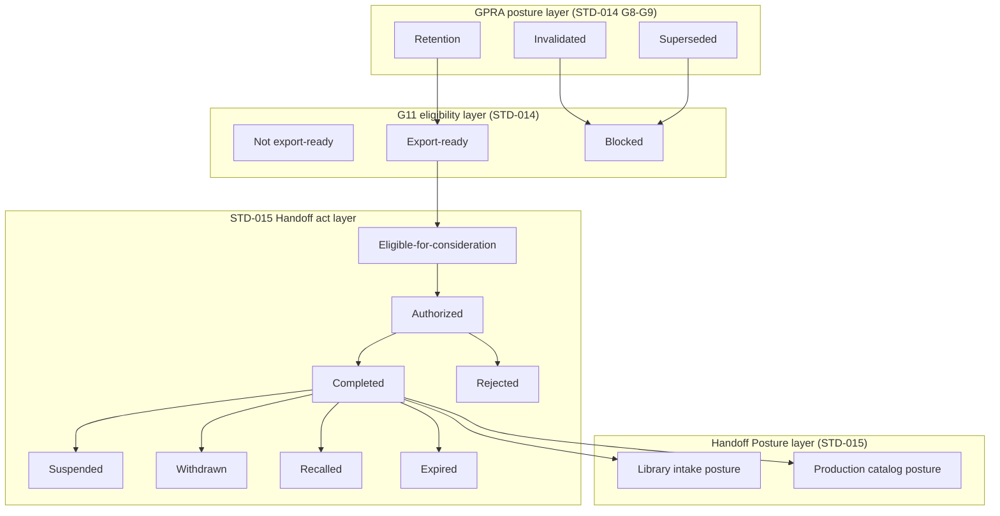

# F.I. Forgot Design Library — Volume 06

# Governed Handoff Standard

## Document Control

| Field | Value |
|-------|-------|
| **Standard ID** | `FI-DSN-STD-015` |
| **Disposition** | Design Standard (`STD`) |
| **Primary Classification** | `CLS-CPR` — Creative Production Realization |
| **Secondary Classification** | None |
| **Primary Volume** | 06 — Creative Production |
| **Architectural domain** | Domain 3 — Review, Approval, and Handoff Authority (Layer B CP-04; Review and Approval owned by `FI-DSN-STD-014`) |
| **Document** | `05-governed-handoff-standard.md` |
| **Status** | Architecture Draft |
| **Version** | 0.1 Draft |
| **Date** | August 3, 2026 |
| **Freeze date** | — |
| **Branch** | `frontend-rebuild` |
| **Owner** | F.I. Forgot |
| **Approval status** | Not approved |
| **Binding status** | Not binding |
| **Register posture** | `Architecture Draft` (`FI-DSN-REG-001`; synchronized Sprint V06-D33.7) |
| **Queue posture** | EO 21 — **In progress** per Sprint V06-D32.4 governing question adoption (`FI-DSN-QUE-001`; synchronized Sprint V06-D33.7) |
| **Sprint** | V06-D33.7B |
| **Governing authority** | `FI-DSN-GOV-001` — Design Standards Governance (Frozen Governance Standard, Version 1.0, July 22, 2026) |
| **Parent architecture** | `playbook/design/volume-06-creative-production/01-creative-production-architecture.md` — Creative Production Architecture (Frozen Volume Governance, Version 1.0, July 29, 2026) |
| **Volume roadmap** | `FI-DSN-VOL-001` — Design Volume Roadmap (Frozen Design Volume Roadmap, Version 1.0, July 23, 2026) |
| **Classification reference** | `FI-DSN-CLS-001` — Design Classification Strategy (Version 1.1 Frozen, July 29, 2026) |
| **Classification expansion reference** | `FI-DSN-CLS-002` — Classification Expansion Decision (Version 1.0 Frozen) |
| **Metadata reference** | `FI-DSN-GOV-002` — Design Library Metadata Standard (Frozen Governance Standard, Version 1.0, July 22, 2026) |
| **Template reference** | `FI-DSN-TPL-001` — Design Standard Template (Frozen Governance Template, Version 1.0, July 22, 2026) |
| **Identifier reference** | `FI-DSN-ID-001` — Design Identifier System (Frozen Identifier System, Version 1.0, July 22, 2026) |
| **Register reference** | `FI-DSN-REG-001` — Design Planning Register (Frozen Planning Register, Version 1.0, July 22, 2026) |
| **Queue reference** | `FI-DSN-QUE-001` — Design Drafting Queue (Frozen Design Drafting Queue, Version 1.0, July 23, 2026) |
| **Epistemic reference** | `FI-DSN-GOV-003` — Evidence vs Company Judgment Governance (Frozen Governance Standard, Version 1.0, July 23, 2026) |
| **Brain authority reference** | `FI-DSN-GOV-004` — Brain Authority Boundary (Frozen Governance Standard, Version 1.0, July 23, 2026) |
| **Upstream Volume 06 standards** | `FI-DSN-STD-012` — Production Intent and Program Governance Standard (Frozen, Version 1.0, July 29, 2026); `FI-DSN-STD-013` — Artifact Realization Governance Standard (Frozen, Version 1.0, July 29, 2026); `FI-DSN-STD-014` — Production Readiness Review and Approval Standard (Architecture Draft, Version 0.1 Draft; constitutionally complete through `FI-DSN-STD-014-R95`; G11 constitutionally closed; not approved; not frozen; not binding) |
| **Upstream philosophy** | `FI-DSN-PRN-001` — Visual Philosophy Standard (Frozen Design Principle, Version 1.0, July 24, 2026) |
| **Upstream Volume 02 standards** | `FI-DSN-STD-001` — Brand Expression Standard; `FI-DSN-STD-002` — Typography Standard; `FI-DSN-STD-003` — Composition Standard (Frozen, Version 1.0) |
| **Upstream Volume 03 standards** | `FI-DSN-STD-004` — Card Architecture Standard; `FI-DSN-STD-005` — Surface Spatial Allocation Standard; `FI-DSN-STD-006` — Envelope and Exterior Presentation Standard (Frozen, Version 1.0) |
| **Upstream Volume 04 standards** | `FI-DSN-STD-007` — Brain Visual Selection Standard; `FI-DSN-STD-008` — Occasion and Emotional Context Standard; `FI-DSN-STD-009` — Personalization Policy Standard (Frozen, Version 1.0) |
| **Manufacturing reference** | Applicable frozen `FI-MFG-*` standards per Volume 01 — Compliance Boundary context only; Handoff does not govern manufacturing execution |
| **Cross-volume intake alignment** | `FI-DSN-STD-010` — Collection Membership and Eligibility Standard (Frozen, Version 1.0); `FI-DSN-STD-011` — Collection Lifecycle and Consistency Standard (Frozen, Version 1.0); `playbook/design/volume-05-signature-collections/01-signature-collections-architecture.md` (Version 1.1 Draft, Under revision; Version 1.0 Frozen baseline July 27, 2026 remains binding) — alignment references only; not upstream constitutional owners |
| **Supporting facts** | None — company judgment standard |
| **Vendor questions** | None |

**Standard statement:** F.I. Forgot maintains **one authoritative Governed Handoff** standard that governs Decision-stage Handoff authorization, Handoff Posture declaration, consumer class binding, Handoff act lifecycle, recall and posture-transition interaction, Handoff evidence consumption, and auditable transition rules at the Volume 06 terminus — without governing Production Readiness Review and Approval, permanent collection membership admission, manufacturing execution, operational downstream intake procedures, or product implementation.

**Source basis:** Company judgment per `FI-DSN-GOV-003`. Applicable frozen `FI-MFG-*` obligations are consumed only as upstream Compliance Boundary context established before Handoff consideration. This architecture draft is not derived from product implementation, vendor facts, Brain runtime behavior, or engineering workflow design.

**Architecture posture:** Version 0.1 Architecture Draft — **accepted at draft posture** (Sprint V06-D33.7). Constitutional architecture kickoff (Sprints V06-D33.2–V06-D33.3) and continuation (Sprints V06-D33.4–V06-D33.5; corrective Sprints V06-D33.5A, V06-D33.6A). Governing question adopted (Sprints V06-D32.1–V06-D32.4; commit `87fd093`). Architecture body **complete** — Sections 1–19 authored. Independent architecture review **completed** (Sprint V06-D33.6); blocking correction **accepted** (Sprint V06-D33.6A). Requirement planning **not performed** — **not yet authorized**. Normative requirement drafting **not authorized**. Open questions `OQ-STD-014-008`, `OQ-STD-014-009`, `OQ-STD-014-010`, and `OQ-V06-007` remain **open**. Handoff act-layer re-entry mechanics remain an **unnumbered architecture question** — governed identifier assignment deferred to a separately authorized planning sprint. REG/QUE synchronization **completed** (Sprint V06-D33.7). Product Sprint 004 **not authorized**. This document does not claim approval, freeze, binding authority, or effective status.

---

## 1. Accepted Governing Question

The governing question was accepted through independent constitutional review in Sprint V06-D32.3 and adopted in Sprint V06-D32.4. It is **locked** for subsequent STD-015 drafting unless a separately authorized amendment sprint changes it.

> What governance determines whether a Governed Production-Ready Artifact may receive and retain governed Handoff posture toward constitutionally authorized downstream consumer classes at design time, while preserving separate authority over Production Readiness Review and Approval, permanent collection membership, manufacturing execution, and operational downstream intake procedures?

**Governing-question lock:** Subsequent architecture refinement and normative drafting must remain reconcilable with this question.

---

## 2. Constitutional Purpose

This standard exists to answer one constitutional problem at Volume 06 Layer B CP-04:

**How governed Handoff posture is authorized, declared, retained, lost, recalled, or suspended at design time for a Governed Production-Ready Artifact toward constitutionally authorized downstream consumer classes — without absorbing Production Readiness Review and Approval, Governed Handoff preparation export mechanics, permanent collection membership, manufacturing execution, or operational downstream intake procedures.**

Volume 06 architecture assigns Governed Handoff and Handoff Posture to Domain 3. Layer B planning splits Domain 3 into two standards: `FI-DSN-STD-014` owns **Review and Approval** through approved production-ready posture and G11 Handoff preparation exports; this standard owns **Governed Handoff** operative authority from the Domain 3 terminus through auditable Handoff posture toward downstream consumer classes.

Volume 06 ends at Governed Handoff posture. Volume 05 begins at permanent collection belonging consideration. Manufacturing Execution begins at fulfillable instance use.

This architecture draft translates the accepted governing question into constitutional structure for later normative drafting. It does not replace frozen Volume 06 Creative Production Architecture, frozen `FI-DSN-STD-012`, frozen `FI-DSN-STD-013`, frozen upstream Volumes 01–04 standards, frozen `FI-DSN-GOV-004`, or the operative normative body of `FI-DSN-STD-014`.

---

## 3. Scope and Positive Authority

### 3.1 Principal subject

This standard governs **Governed Handoff** — the constitutional Decision-stage structure for:

- **Handoff authorization** — governed acts that may permit forward Handoff under this standard (principal subject deferred in detail to future Handoff Authorization Architecture — `OQ-STD-014-008`)
- **Handoff Posture declaration** — declarative intake posture toward Volume 05 and/or production catalog consumer classes (split versus unified architecture deferred — `OQ-V06-007`)
- **Consumer class catalog and binding** — constitutional cataloging and binding of downstream consumer classes to Handoff context (deferred — `OQ-STD-014-009`)
- **Handoff act lifecycle** — operative states and transitions at the STD-015 act layer distinct from G11 eligibility export and GPRA posture lifecycle
- **Recall, withdrawal, and posture-transition interaction** — operative mechanics when GPRA posture or Handoff authority changes (deferred — `OQ-STD-014-010`)
- **Handoff evidence consumption** — operative requirements for evidence packages and validity exports at the Handoff boundary, building on G11 reference architecture without redefining source records
- **Auditable transition rules** — constitutional rules governing transition from Volume 06 Handoff posture to downstream consideration boundaries

### 3.2 Positive authority summary

| Authority domain | Architectural ownership |
|------------------|-------------------------|
| Handoff authorization act architecture | Governed acts permitting forward Handoff — principal STD-015 subject |
| Handoff Posture declaration | Declarative posture per GPRA and target consumer class |
| Consumer class catalog and binding | Constitutional consumer taxonomy and context binding |
| Handoff act lifecycle | Operative HSLM act-layer states — distinct from G11 eligibility layer |
| Recall and withdrawal mechanics | Operative transition when GPRA or Handoff authority changes |
| Handoff evidence at authorization boundary | Operative consumption of HEPM reference classes and HVEM exports |
| Authoritative Handoff per context | Which Handoff posture is authoritative per obligation and consumer class |
| Historical Handoff record preservation | Additive audit of Handoff acts and posture transitions |

### 3.3 Architectural principles (provisional)

| ID | Principle | Rule |
|----|-----------|------|
| **HOF-P1** | **GPRA is not Handoff** | GPRA grant and approved production-ready posture are necessary upstream inputs only; they do not declare Handoff Posture or perform Handoff authorization (`FI-DSN-STD-014` PRR-P4 reciprocal) |
| **HOF-P2** | **Eligibility is not authorization** | G11 Handoff eligibility exports describe whether Handoff may be considered; eligibility facts do not authorize Handoff acts (HEIM) |
| **HOF-P3** | **Handoff is not membership** | Handoff Posture does not grant permanent collection membership (Volume 06 AX-2, P3) |
| **HOF-P4** | **Handoff is not manufacturing execution** | Governed Handoff governs constitutional transition and boundary control only; it does not authorize manufacture, production execution, or fulfillment (HMEX) |
| **HOF-P5** | **Handoff is not operational intake** | Handoff Posture enables downstream consideration; it does not perform Volume 05 intake procedures or engineering handoff APIs |
| **HOF-P6** | **Brain does not authorize Handoff** | Brain outputs at the Handoff boundary remain advisory and nonbinding; Brain does not authorize, execute, recall, or terminate Handoff (HBIM; `FI-DSN-GOV-004`) |
| **HOF-P7** | **Historical Handoff is preserved** | Prior Handoff authorization and posture records remain additive historical fact when GPRA posture later changes (HPAM extension) |
| **HOF-P8** | **Upstream law is consumed, not rewritten** | STD-014 GPRA outputs, G11 export contracts, and upstream Compliance Boundaries are consumed; STD-015 does not re-perform Review, Approval, or G11 preparation |
| **HOF-P9** | **Handoff policy is not runtime selection** | Handoff authorization is distinct from Brain Visual Selection Decision and customer Selection (`FI-DSN-GOV-004`) |
| **HOF-P10** | **Handoff lifecycle is peer-distinct** | Handoff act lifecycle is distinct from artifact lifecycle, GPRA posture lifecycle, Review lifecycle, and G11 eligibility-layer export states (HSLM two-layer split) |

### 3.4 Open questions — architectural placement (unresolved)

The following open questions are **framed** for future architecture sections. They are **not resolved** in this kickoff draft.

| Open question | Future architecture section | Principal STD-015 subject |
|---------------|----------------------------|---------------------------|
| `OQ-STD-014-008` | Handoff Authorization Architecture | What constitutionally authorized authority class may perform Governed Handoff authorization acts? |
| `OQ-STD-014-009` | Consumer Class and Binding Architecture | How are downstream consumer classes constitutionally cataloged and bound to Handoff context? |
| `OQ-STD-014-010` | Recall, Withdrawal, and Posture Transition Architecture | When GPRA posture becomes **Invalidated** or **Superseded**, is forward Handoff recall automatic, separately authorized, or notification-only? |
| `OQ-V06-007` | Handoff Posture Declaration Architecture | Should Handoff Posture always split into library intake and production catalog classes, or may a single handoff serve both when rules are identical? |

---

## 4. Explicit Exclusions

This standard does **not** own:

| Subject | Authoritative owner |
|---------|---------------------|
| Declared Production Intent, Production Program, Production Obligation establishment | `FI-DSN-STD-012` |
| Exploration-Entry Authorization, waivers, and Domain 1 posture | `FI-DSN-STD-012` |
| Exploration Posture operation, Realization commitment, RVA existence | `FI-DSN-STD-013` |
| RVA version lineage, iteration, method-neutral realization paths | `FI-DSN-STD-013` |
| Realization Traceability Package creation | `FI-DSN-STD-013` |
| Review-Entry Readiness creation | `FI-DSN-STD-013` |
| Production-readiness Review, Review Determination, Approval, GPRA grant | `FI-DSN-STD-014` |
| Invalidated and Superseded posture establishment | `FI-DSN-STD-014` G8–G9 |
| Governed Handoff preparation, eligibility-layer export states, G11 output contract | `FI-DSN-STD-014` G11 |
| Permanent collection membership admission and eligibility rules | `FI-DSN-STD-010` / Volume 05 |
| Collection lifecycle, publication, maintenance, and retirement | `FI-DSN-STD-011` / Volume 05 |
| Operational downstream intake procedures and membership workflows | Volume 05 / engineering |
| Contextual selection and authorized alternatives | `FI-DSN-STD-007` |
| Occasion and emotional context semantics | `FI-DSN-STD-008` |
| Personalization policy | `FI-DSN-STD-009` |
| Visual permission and identity eligibility | Volume 02 |
| Surface structure and spatial allocation | Volume 03 |
| Metadata field semantics and provenance schema | `FI-DSN-GOV-002` |
| Manufacturing Validation mechanics and Fulfillment Execution | Volume 01 operational layer / engineering |
| Brain runtime recommendation, ranking, and customer Selection | `FI-DSN-GOV-004` / product implementation |
| Product UI, DAM workflows, APIs, databases, prompts, models, queues | Engineering specifications |
| Product Sprint 004 authorization or implementation scope | Not authorized |

---

## 5. Constitutional Entry Boundary

STD-015 authority begins only when upstream Domain 3 outputs satisfy minimum Handoff entry conditions per `FI-DSN-STD-014` Section 13 and G11 export contract.

### 5.1 Minimum upstream inputs

| Input | Source | Consumption |
|-------|--------|-------------|
| **Governed Production-Ready Artifact (GPRA)** | `FI-DSN-STD-014` G6 | Hard entry gate — Handoff does not commence on non-approved artifacts |
| **Approval evidence and Review Determination reference** | `FI-DSN-STD-014` G5–G6 | Constitutional fact — consumed, not recreated |
| **Current GPRA posture** | `FI-DSN-STD-014` G8–G9 | **Retention**, **Invalidated**, or **Superseded** — consumed; STD-015 does not establish GPRA posture |
| **Production Obligation attribution** | `FI-DSN-STD-012` / `FI-DSN-STD-013` / `FI-DSN-STD-014` | Scope binding for Handoff context |
| **Authoritative GPRA identity per obligation and consumer context** | `FI-DSN-STD-014` G9 PSIM consumption | Succession context — consumed, not re-performed |
| **Handoff eligibility export** | `FI-DSN-STD-014` G11 HEIM | Factual eligibility for Handoff consideration — not authorization |
| **Handoff evidence package references** | `FI-DSN-STD-014` G11 HEPM | Mandatory reference classes — consumed and extended at operative layer only |
| **Validity export posture** | `FI-DSN-STD-014` G11 HVEM | Current posture fact for consumer context — source records remain authoritative |
| **Consumer context boundary keys** | `FI-DSN-STD-014` G11 HCBM | Boundary keys into downstream domains — catalog detail deferred (`OQ-STD-014-009`) |
| **G11 eligibility-layer condition** | `FI-DSN-STD-014` G11 HSLM | Not export-ready / Export-ready / Blocked — G11 layer only; distinct from Handoff act states |

### 5.2 Entry boundary rules (architectural)

- GPRA grant is a **necessary** upstream condition for Handoff consideration. GPRA grant is **not** Handoff authorization (HOF-P1; HEIM).
- G11 export-ready eligibility is a **necessary factual input** for Handoff consideration where governing law requires it. Export-ready eligibility is **not** Handoff authorization (HOF-P2).
- **Invalidated** or **Superseded** GPRA posture removes forward Handoff eligibility on the affected GPRA in the superseded context (`FI-DSN-STD-014` G8 `R60`; G9 `R71`). STD-015 consumes those posture effects; STD-015 does not perform invalidation or supersession acts.
- STD-015 does not invent operational intake procedures, queue mechanics, notification systems, or engineering APIs for Handoff entry.
- STD-015 does not reopen G11 constitutional closure or redefine G11 normative requirements.

### 5.3 Upstream G11 planning models consumed at entry (reference only)

The following G11 planning models from `FI-DSN-STD-014` Section 20.23 establish consumption boundaries at entry. Operative STD-015 architecture extends where noted; principal open questions remain unresolved.

| Model | Designation | Entry-boundary role |
|-------|-------------|---------------------|
| HCPM | Handoff Constitutional Purpose Model | Purpose boundary — Handoff is not Approval, Review, or downstream execution |
| HAAM | Handoff Authority Architecture Model | Prohibition map — Handoff authorization class deferred (`OQ-STD-014-008`) |
| HEIM | Handoff Eligibility Interaction Model | Eligibility facts versus authorization acts |
| HEPM | Handoff Evidence Package Model | Mandatory reference classes at consideration boundary |
| HVEM | Handoff Validity Export Model | Posture export consumption; stale-detection context |
| HCBM | Handoff Consumer Boundary Model | Consumer category boundary keys — catalog deferred (`OQ-STD-014-009`) |
| HSLM | Handoff State and Lifecycle Model | Two-layer split — G11 eligibility layer versus STD-015 act layer |
| HRWM | Handoff Recall and Withdrawal Model | Constitutional eligibility effects — recall mechanics deferred (`OQ-STD-014-010`) |
| HBIM | Handoff Brain Interaction Model | Brain advisory boundary at Handoff preparation and consideration |
| HMEX | Handoff Manufacturing Exclusion Model | Manufacturing and production execution exclusion |
| HPAM | Handoff Preservation and Auditability Model | G11 preparation preservation — extended to Handoff acts in later architecture |

### 5.4 Downstream exit boundary (architectural framing only)

Handoff Posture declares constitutional readiness for downstream **consideration** by authorized consumer classes. Downstream domains own operative behavior within their boundaries:

| Downstream domain | STD-015 relationship |
|-------------------|----------------------|
| Volume 05 permanent collection membership | GPRA presentation and Handoff Posture are prerequisites for intake **consideration** only — not admission |
| Production catalog consumers | Handoff Posture authorizes constitutional boundary crossing — not catalog implementation |
| Manufacturing / fulfillment / publication / distribution | Consumer boundary keys per HCBM — execution excluded (HMEX) |

Detailed downstream exit architecture is established in Section 13. Volume 05 intake alignment references (`FI-DSN-STD-010`, `FI-DSN-STD-011`) inform boundary framing only; they are not upstream constitutional owners of Handoff authority.

---

## 6. Handoff Authorization Architecture

Handoff authorization is the governed Decision-stage act that may permit forward Handoff under this standard. It is constitutionally distinct from GPRA grant, G11 eligibility export, Handoff Posture declaration, and downstream intake execution (HOF-P1; HOF-P2; HEIM; HAAM).

### 6.1 Authorization as a governed act

| Concept | Architectural meaning | Distinguished from |
|---------|----------------------|-------------------|
| **Handoff authorization act** | A recorded Decision-stage act attributable to a constitutionally authorized authority class that permits forward Handoff consideration to proceed under governing law | GPRA grant; G11 export-ready eligibility; Brain recommendation; downstream intake admission |
| **Handoff authorization withholding** | A recorded Decision-stage act or documented ground that prevents forward Handoff authorization on eligible inputs | Review Determination fail; Approval withholding; G11 blocked export |
| **Handoff authorization scope** | The binding of authorization to a specific GPRA, Production Obligation scope, and consumer context | Bare artifact identity; program-wide blanket authorization |

Handoff authorization is **instance-level** and **context-bound**. It applies to a defined GPRA under a defined Production Obligation scope toward a defined consumer context. It is not a program-wide policy label and not a downstream operational grant.

### 6.2 Authority classes explicitly excluded from Handoff authorization

HAAM (`FI-DSN-STD-014` Section 20.23.2) establishes that the following upstream authority domains do **not** perform Handoff authorization acts. This architecture preserves those prohibitions without redefining upstream owners.

| Authority domain | Relationship to Handoff authorization |
|------------------|--------------------------------------|
| **MAGAC (G6 Approval)** | Grants GPRA — necessary upstream input only |
| **DDAC / DSRA (G7)** | Governs Review downstream disposition and rework return — does not authorize Handoff |
| **G8 invalidation authority** | Establishes **Invalidated** posture — removes forward eligibility; does not perform Handoff recall mechanics |
| **G9 SSAC** | Establishes **Superseded** posture — removes forward reliance; does not perform Handoff recall mechanics |
| **G10 Brain** | Advisory eligibility signals and reevaluation requests only — does not authorize Handoff |
| **G11 export contract** | Exports eligibility facts — does not authorize Handoff |
| **Downstream consumer domains** | May consume Handoff Posture — do not retroactively authorize Handoff |

### 6.3 Open question framing — `OQ-STD-014-008`

**Question:** What constitutionally authorized authority class may perform Governed Handoff authorization acts?

**Architectural framing (unresolved):** This section establishes that Handoff authorization requires a **constitutionally authorized authority class catalog** owned principally by this standard. The catalog must:

- Identify at least one authority class capable of performing Handoff authorization acts at design time
- Preserve HAAM prohibitions — no upstream authority class may be silently promoted to Handoff authorization by catalog definition
- Distinguish authorization act attribution from evidence preparation, eligibility export, or downstream intake execution
- Remain reconcilable with attributed human act requirements where governing law requires human accountability
- Not conflate Handoff authorization with Brain advisory routing or automated eligibility scoring

**Candidate architecture dimensions (not selected):**

| Dimension | Architectural role | Resolution status |
|-----------|-------------------|-------------------|
| Authority class taxonomy | Named classes permitted to authorize, withhold, recall, or suspend Handoff | **Open** — `OQ-STD-014-008` |
| Delegation and substitution | Whether one authority class may delegate Handoff authorization to another | **Open** — architecture refinement |
| Multi-party authorization | Whether Handoff authorization requires single or multiple attributed acts | **Open** — architecture refinement |
| System versus human attribution | How governed system acts relate to human authority classes at the Handoff boundary | **Open** — architecture refinement |

**Planning model consumed:** HAAM — prohibition map inherited; operative authority class catalog deferred to normative drafting under separate governed resolution of `OQ-STD-014-008`.

### 6.4 Authorization boundary rules (architectural)

- Handoff authorization acts are recorded as additive historical constitutional fact (HOF-P7; HPAM extension).
- Withholding Handoff authorization does not invalidate GPRA, does not revoke Approval, and does not perform downstream intake rejection.
- Brain outputs may inform Handoff authorization consideration but do not substitute for a Handoff authorization act (HOF-P6; HBIM).
- Handoff authorization does not grant permanent collection membership, manufacturing execution authority, or operational intake admission (HOF-P3; HOF-P4; HOF-P5).

---

## 7. Consumer Class and Binding Architecture

Consumer classes identify the downstream constitutional domain toward which Handoff Posture is declared. Consumer binding attaches Handoff context to a specific GPRA, Production Obligation scope, and consumer class identity.

### 7.1 Consumer class versus consumer context

| Term | Architectural meaning | Owner layer |
|------|----------------------|-------------|
| **Consumer class** | A constitutionally cataloged category of downstream use with distinct governing downstream rules | STD-015 catalog architecture — detail deferred (`OQ-STD-014-009`) |
| **Consumer context** | The bound instance of a consumer class for a specific Handoff act — obligation scope plus class identity plus boundary key | STD-015 binding architecture |
| **Consumer context boundary key** | HCBM abstract category key exported from G11 — identifies boundary **into** a domain, not internal consumer behavior | G11 export; consumed by STD-015 |

Consumer class architecture governs **what categories exist** and **how they are constitutionally distinguished**. Consumer binding architecture governs **how a GPRA is attached** to one or more consumer contexts for Handoff consideration.

### 7.2 HCBM boundary categories (consumed, not redefined)

G11 HCBM (`FI-DSN-STD-014` Section 20.23.6) establishes abstract consumer-category boundary keys at the preparation layer:

| HCBM boundary category | Constitutional boundary role |
|------------------------|------------------------------|
| **Manufacturing** | Design-time feasibility consumption boundary into manufacture planning |
| **Production** | Operational production intake |
| **Catalog** | Production catalog or library catalog intake distinction |
| **Fulfillment** | Post-production fulfillment intake |
| **Publication** | Publication or release intake |
| **Distribution** | Distribution channel intake |
| **Archival systems** | Long-term constitutional record consumption |

STD-015 consumes HCBM keys as upstream boundary vocabulary. STD-015 does not redefine G11 boundary key export mechanics. Operative consumer class **catalog** architecture — including how HCBM categories relate to Volume 06 Handoff Posture classes — remains deferred.

### 7.3 Volume 06 Handoff Posture classes (upstream reference)

Frozen Volume 06 architecture (Section 12.2) defines two Handoff Posture consumer classes at the volume layer:

| Volume 06 class | Constitutional meaning |
|-----------------|------------------------|
| **Library intake posture** | GPRA presented for Volume 05 permanent membership consideration |
| **Production catalog posture** | GPRA authorized for production artwork library intake under engineering specification |

Volume 06 provides that Handoff Posture classes are not merged when governing downstream rules differ. The relationship between these two volume-layer classes and the seven HCBM boundary categories is an architectural reconciliation subject — not resolved in this draft.

### 7.4 Open question framing — `OQ-STD-014-009`

**Question:** How are downstream consumer classes constitutionally cataloged and bound to Handoff context?

**Architectural framing (unresolved):** Operative consumer class architecture must define:

- The canonical catalog of consumer classes available for Handoff binding at design time
- How each catalog entry maps to HCBM boundary keys without absorbing downstream internal behavior
- How consumer class identity combines with Production Obligation scope and GPRA identity to form a bound Handoff context
- Whether multiple consumer classes may be simultaneously bound to one GPRA for distinct governed purposes
- How authoritative Handoff per context is identified when multiple bindings exist

**Candidate architecture dimensions (not selected):**

| Dimension | Architectural role | Resolution status |
|-----------|-------------------|-------------------|
| Catalog taxonomy | Definitive list or extensibility rules for consumer classes | **Open** — `OQ-STD-014-009` |
| HCBM reconciliation | Mapping between seven HCBM keys and Volume 06 two-class model | **Open** — architecture refinement |
| Binding cardinality | One-to-one, one-to-many, or many-to-one GPRA-to-consumer bindings | **Open** — architecture refinement |
| Context key structure | Minimum identity fields for a bound consumer context | **Open** — architecture refinement |

### 7.5 Consumer binding boundary rules (architectural)

- Consumer binding identifies downstream **consideration** targets; it does not execute downstream intake procedures (HOF-P5).
- Consumer binding does not grant collection membership, manufacturing authority, or fulfillment authorization (HOF-P3; HOF-P4).
- G9 PSIM authoritative GPRA succession constrains which GPRA may be bound in a superseded context — binding consumes PSIM facts; STD-015 does not establish supersession.
- Consumer class catalog resolution is a principal STD-015 architectural obligation; G11 remains limited to boundary key export.

---

## 8. Handoff Posture Declaration Architecture

Handoff Posture is the declarative constitutional output of Governed Handoff — the governed statement that a GPRA holds intake posture toward a defined consumer class at the Volume 06 terminus.

### 8.1 Handoff Posture as declarative output

| Concept | Architectural meaning | Distinguished from |
|---------|----------------------|-------------------|
| **Handoff Posture** | Declarative constitutional state that a GPRA is offered toward a defined consumer class under governing law | GPRA Retention posture; G11 export-ready eligibility; downstream membership admission |
| **Handoff Posture declaration act** | The governed act that establishes or updates Handoff Posture for a bound consumer context | Handoff authorization act — related but architecturally distinct |
| **Authoritative Handoff Posture** | For a given Production Obligation and consumer class, the Handoff Posture that governs forward downstream reliance | Superseded Handoff Posture in the same context when replaced |

Volume 06 lifecycle table assigns Governed Handoff the output **Handoff Posture** with cardinality **1 per GPRA per target consumer class**. This architecture adopts that cardinality as the baseline framing subject to `OQ-V06-007` refinement.

### 8.2 Authorization versus declaration (architectural split)

Handoff architecture treats **authorization** and **posture declaration** as related but peer-distinct constitutional acts:

| Act type | Architectural role |
|----------|-------------------|
| **Handoff authorization** | Permits forward Handoff under governing law for a defined context |
| **Handoff Posture declaration** | Declares the constitutional intake posture held toward a consumer class |

A complete Handoff architecture must reconcile whether authorization and declaration are always co-occurring acts, sequential acts, or independently recordable acts. That reconciliation is deferred to architecture refinement and normative drafting — not resolved here.

### 8.3 Open question framing — `OQ-V06-007`

**Question:** Should Handoff Posture always split into library intake and production catalog classes, or may a single handoff serve both when rules are identical?

**Architectural framing (unresolved):** Volume 06 Section 12.2 establishes two Handoff Posture consumer classes and a default rule: classes are not merged when downstream rules differ. `OQ-V06-007` asks whether a **unified Handoff Posture** may serve both classes when governing rules are identical.

**Candidate models (not selected):**

| Model | Description | Architectural consequence |
|-------|-------------|--------------------------|
| **A — Always split** | Every GPRA receives separate Handoff Posture declarations per class | Maximum downstream rule independence; higher act cardinality |
| **B — Split by default, unified when identical** | Single declaration permitted only when governing rules are provably identical under catalog architecture | Requires rule-equivalence architecture — not yet defined |
| **C — Catalog-driven split** | Split determined by consumer class catalog entries, not volume-layer class count alone | Reconciles HCBM seven-category model with two-class volume model — detail deferred |

**Volume 06 default posture:** Split by default when downstream rules may diverge. This architecture does not adopt Model A, B, or C. `OQ-V06-007` remains **open**.

### 8.4 Handoff Posture boundary rules (architectural)

- Handoff Posture declaration does not grant permanent collection membership (HOF-P3).
- Handoff Posture declaration does not execute Volume 05 intake procedures or production catalog admission (HOF-P5).
- Handoff Posture is forward-reliance posture at the Volume 06 boundary — downstream domains consume it; STD-015 does not govern downstream acceptance or rejection of intake objects.
- Loss of GPRA forward-active posture (**Invalidated** or **Superseded**) affects whether Handoff Posture may be declared or retained — operative recall interaction deferred to Section 10.

---

## 9. Handoff Act Lifecycle Architecture

Handoff act lifecycle governs operative states and transitions at the STD-015 act layer. It is peer-distinct from G11 eligibility-layer export states, GPRA posture lifecycle, and artifact lifecycle (HOF-P10; HSLM).

### 9.1 Two-layer lifecycle model (architectural)

| Layer | Owner | Permitted vocabulary (planning) | Relationship to Handoff acts |
|-------|-------|------------------------------|------------------------------|
| **G11 eligibility layer** | `FI-DSN-STD-014` G11 | Not export-ready; Export-ready; Blocked | Upstream factual gate — consumed at entry |
| **STD-015 Handoff act layer** | This standard | Eligible-for-consideration; Authorized; Completed; Rejected; Suspended; Withdrawn; Recalled; Expired | Operative lifecycle — normative establishment deferred |

G11 eligibility-layer conditions describe whether Handoff **may be considered**. STD-015 act-layer states describe what happened in Handoff **authorization and posture governance** after consideration begins.

### 9.2 Provisional act-layer states (planning vocabulary)

The following states are **provisional architecture vocabulary** from HSLM (`FI-DSN-STD-014` Section 20.23.7). They are not final constitutional states until normative drafting and review.

| State (provisional) | Architectural meaning at act layer |
|---------------------|-----------------------------------|
| **Eligible-for-consideration** | Minimum upstream inputs and G11 eligibility export satisfy entry boundary; Handoff act path may be evaluated |
| **Authorized** | A Handoff authorization act has been recorded for the defined context |
| **Completed** | Handoff Posture has been declared and Handoff obligations for the act are satisfied at the Volume 06 boundary |
| **Rejected** | Handoff authorization or posture declaration has been withheld or denied on documented constitutional grounds |
| **Suspended** | Forward reliance on an otherwise authorized Handoff is temporarily paused without erasing historical act record |
| **Withdrawn** | A prior Handoff authorization or posture is actively retracted at the Handoff layer — distinct from GPRA Invalidated posture |
| **Recalled** | Forward Handoff authority ceases for downstream use while preserving historical Handoff records |
| **Expired** | Handoff authorization or posture loses forward effect by governed time or validity boundary without necessarily implying GPRA posture change |

### 9.3 Provisional transition map (architectural)

```
[G11 Export-ready] + [GPRA Retention] + [Entry inputs satisfied]
        ↓
[Eligible-for-consideration]
        ↓ Handoff authorization act (authority class — OQ-008)
[Authorized]
        ↓ Handoff Posture declaration
[Completed]  |  [Rejected]
        ↓ suspension / withdrawal / recall / expiry paths
[Suspended] | [Withdrawn] | [Recalled] | [Expired]
```

**Re-entry paths** after Rejected, Suspended, Withdrawn, or Recalled are **not architecturally resolved** in this draft. Future architecture or normative drafting must address whether and how a GPRA may re-enter the Handoff act path without violating upstream posture constraints.

### 9.4 Act lifecycle boundary rules (architectural)

- Act-layer states do not substitute for GPRA **Retention**, **Invalidated**, or **Superseded** posture — those remain STD-014 G8–G9 authority.
- Act-layer **Blocked** eligibility remains a G11 export condition, not an STD-015 operative act state.
- Transition rules are architectural framing only; operative transition requirements are deferred to normative drafting.
- Brain advisory signals do not trigger act-layer state transitions as constitutional acts (HOF-P6).

---

## 10. Recall, Withdrawal, and Posture Transition Architecture

Recall and posture-transition architecture governs how changes to GPRA posture or Handoff authority affect forward Handoff reliance while preserving historical Handoff records (HRWM; HOF-P7).

### 10.1 Constitutional effects consumed from upstream (HRWM)

G11 HRWM (`FI-DSN-STD-014` Section 20.23.8) establishes constitutional **eligibility effects** that STD-015 consumes without re-performing upstream acts:

| Upstream event | Effect on forward Handoff eligibility | Historical Handoff records | Operative recall mechanics |
|----------------|--------------------------------------|---------------------------|---------------------------|
| **GPRA Invalidated** | Forward Handoff eligibility **lost** on affected GPRA | Prior Handoff records **preserved** as historical fact | **Deferred** — `OQ-STD-014-010` |
| **GPRA Superseded** | Forward reliance on predecessor **lost** in superseded context | Prior Handoff records **preserved** | Successor GPRA governs forward export only when independently eligible — recall mechanics **deferred** |
| **Governed withdrawal** | Not a Layer B GPRA posture | Additive withdrawal history | Withdrawal act authority deferred to STD-015 — mechanics **open** |
| **Operational recall** | Operational domain action — not Layer B posture | Notification and audit trail additive | **Excluded** — HMEX; not STD-015 Layer B authority |

STD-015 owns operative mechanics for how Handoff act-layer states respond to upstream posture changes. STD-015 does not establish **Invalidated** or **Superseded** GPRA posture.

### 10.2 Recall versus withdrawal versus suspension (architectural framing)

| Concept | Architectural layer | Principal question |
|---------|--------------------|--------------------|
| **Recall** | Handoff act layer | Forward Handoff authority ceases for downstream use; historical record preserved |
| **Withdrawal** | Handoff act layer | Active retraction of Handoff authorization or posture by governed Handoff authority — distinct from GPRA posture loss |
| **Suspension** | Handoff act layer | Temporary pause of forward reliance without erasing authorization history |
| **Invalidation** | GPRA posture layer (G8) | Upstream posture establishment — consumed, not performed by STD-015 |
| **Supersession** | GPRA posture layer (G9) | Upstream posture establishment — consumed, not performed by STD-015 |

Architecture must preserve this layer separation. Collapsing GPRA posture transitions into Handoff recall acts — or treating Handoff recall as automatic upon Invalidated posture without governed resolution — would violate HAAM and HRWM planning boundaries.

### 10.3 Open question framing — `OQ-STD-014-010`

**Question:** When GPRA posture becomes **Invalidated** or **Superseded**, is forward Handoff recall automatic, separately authorized, or notification-only?

**Architectural framing (unresolved):** This question governs operative mechanics at the intersection of G8/G9 posture effects and Handoff act-layer **Recalled** state. Architecture must eventually select among (or combine) the following **candidate models** without precommitting in this draft:

| Model | Description | Architectural consequence |
|-------|-------------|--------------------------|
| **A — Automatic recall** | Invalidated or Superseded posture automatically transitions affected Handoff act layer to Recalled without a separate Handoff authorization act | Simplest downstream reliance rule; may reduce audit attribution granularity |
| **B — Separately authorized recall** | A constitutionally authorized Handoff authority class must perform a distinct recall act when posture changes | Preserves act attribution; higher governance overhead |
| **C — Notification-only** | Upstream posture change is exported; downstream consumers responsible for ceasing reliance; Handoff act layer records notification fact only | Preserves STD-015 boundary minimalism; shifts reliance risk downstream |
| **D — Hybrid by event type** | Invalidation and supersession trigger different recall mechanics | Most expressive; requires event-type architecture not yet defined |

**HRWM planning constraint:** Regardless of model selected, prior Handoff records remain **preserved as historical fact** (HOF-P7). Recall mechanics govern **forward reliance only** — not historical erasure.

**Resolution status:** `OQ-STD-014-010` remains **open**. No model is adopted in this architecture draft.

### 10.4 Posture transition interaction rules (architectural)

- Supersession of a GPRA does not automatically transfer Handoff Posture to a successor GPRA — successor eligibility and authorization require independent satisfaction of entry boundary conditions.
- Invalidation of a GPRA removes forward Handoff eligibility on the affected GPRA; operative Handoff recall path remains unresolved (`OQ-STD-014-010`).
- Withdrawal at the Handoff act layer is architecturally distinct from governed withdrawal referenced in HRWM and from GPRA posture transitions — operative withdrawal authority deferred to normative drafting alongside `OQ-STD-014-008`.
- Operational recall, notification delivery, and consumer-side revocation procedures remain excluded from STD-015 (HMEX; HOF-P4; HOF-P5).
- All recall, withdrawal, and posture-transition records are additive historical fact — no overwrite of Approval, GPRA grant, Review Determination, or G11 preparation records (HPAM).

---

## 11. Evidence and Validity Consumption Architecture

Evidence and validity consumption architecture governs how STD-015 consumes upstream G11 evidence reference architecture and validity exports at the Handoff authorization boundary — and how operative Handoff evidence extends that consumption without redefining source records or inventing implementation schemas.

### 11.1 Four-model evidence relationship (architectural)

G11 establishes preparation-layer evidence and validity export architecture. STD-015 consumes and extends that architecture at the operative Handoff act layer through four peer-related models:

| Model | Layer | Architectural role | Authoritative owner |
|-------|-------|-------------------|---------------------|
| **HEPM** — Handoff Evidence Package Model | G11 preparation / reference | Mandatory **reference classes** linking authoritative source constitutional records required for Handoff consideration | `FI-DSN-STD-014` G11 |
| **HVEM** — Handoff Validity Export Model | G11 preparation / export | Current posture and eligibility **facts** exported for consumer context without rewriting source history | `FI-DSN-STD-014` G11 |
| **HOEM** — Handoff Operative Evidence Model | STD-015 act layer | Operative **Handoff evidence** recorded at authorization, posture declaration, completion, recall, and withdrawal acts — additive to HEPM references, not a substitute for source records | This standard |
| **Advisory evidence** — Brain and analytical inputs | Advisory / nonbinding | Eligibility analysis, gap detection, stale-export signals, and routing suggestions — consumed for consideration only | `FI-DSN-GOV-004`; G10 BRPAM; HBIM |

**Architectural relationship:** HEPM defines what upstream constitutional records **must be referencable** for Handoff consideration. HVEM defines what current validity **facts** may be exported from those sources. HOEM defines what operative Handoff act records **may be added** when STD-015 performs authorization, posture declaration, and lifecycle acts. Advisory evidence **may inform** consideration but does not constitute HEPM reference satisfaction, HVEM validity facts, HOEM operative records, or Handoff authorization (HOF-P6; HBIM).

### 11.2 Reference classes versus operative Handoff evidence

Architecture preserves a strict distinction between evidence **reference classes** and operative Handoff **evidence acts**:

| Evidence category | What it is | What it is not |
|-------------------|-----------|----------------|
| **HEPM reference class** | Read-only pointer to an authoritative source constitutional record (artifact identity, Review Determination, Approval, GPRA, posture, lineage, consumer boundary key, etc.) | Operative Handoff authorization; Handoff Posture; downstream intake admission |
| **HVEM validity export** | Evaluation-point snapshot of current GPRA posture, authoritative GPRA identity, and derived eligibility facts for a defined consumer context | A new constitutional posture; a substitute for source G8/G9 records |
| **HOEM operative record** | Additive record of a Handoff act and its constitutional basis at the STD-015 layer (authorization attribution, posture declaration, completion fact, recall or withdrawal fact) | A rewrite, merge, or replacement of HEPM source records |
| **Advisory evidence** | Nonbinding analytical input (Brain recommendation history, inconsistency signals, stale-export advisories) | Mandatory reference class satisfaction; authorization substitute |

HEPM reference classes remain **authoritative at their source domains**. STD-015 consumes references; STD-015 does not recreate Review Determination, Approval, GPRA grant, or G11 preparation records (HOF-P8; HPAM).

HOEM operative records document **what STD-015 did** at the Handoff boundary. They do not elevate advisory inputs to constitutional fact and do not collapse reference bundles into execution instructions.

### 11.3 Eligibility versus authorization in evidence consumption

Evidence consumption architecture reinforces HEIM separation (HOF-P2):

| Evidence posture | Layer | Consumption rule (architectural) |
|------------------|-------|-------------------------------|
| **G11 export-ready eligibility** | G11 eligibility layer | Factual input that Handoff **may be considered** — not evidence of Handoff authorization |
| **HVEM forward eligibility flag** | G11 export / derived fact | Informational export for downstream convenience — not Handoff authorization |
| **HEPM package completeness** | G11 reference architecture | Mandatory reference availability for consideration — not authorization |
| **HOEM authorization record** | STD-015 act layer | Evidence that a Handoff authorization act occurred — distinct from eligibility export |
| **HOEM posture declaration record** | STD-015 act layer | Evidence that Handoff Posture was declared — distinct from both eligibility and authorization where architecture treats them as peer acts |

Architecture must prevent treating export-ready eligibility, complete HEPM reference bundles, or advisory gap-clearance signals as substitutes for governed Handoff authorization acts (`OQ-STD-014-008` governs authorization class catalog — not resolved here).

### 11.4 Stale, invalidated, and superseded evidence protection

HVEM establishes stale-validity detection context: exports carry evaluation-point identity sufficient for downstream systems to detect superseded snapshots without rewriting source history. STD-015 evidence consumption architecture extends that protection at the operative boundary:

| Upstream condition | Effect on evidence consumption (architectural) |
|--------------------|-----------------------------------------------|
| **GPRA Retention** | HEPM references and HVEM exports remain consumable for forward Handoff consideration when other entry conditions are satisfied |
| **GPRA Invalidated** | Forward Handoff eligibility is lost on the affected GPRA; invalidated posture **must not silently support** new Handoff authorization or posture declaration — stale HVEM exports and prior eligibility snapshots cannot substitute for current posture fact |
| **GPRA Superseded** | Forward reliance on predecessor GPRA in the superseded context is lost; successor GPRA governs forward export only when independently eligible — predecessor HEPM/HVEM snapshots **must not silently support** forward Handoff on superseded authority |
| **G11 Blocked eligibility** | Export consideration is constitutionally blocked; blocked state **must not be overridden** by operative Handoff acts without upstream posture correction |
| **Advisory stale-export signal** | Brain or analytical detection of stale validity — advisory only; does not perform recall or authorization (HBIM) |

Architecture requires that Handoff authorization and posture declaration consume **current** HVEM posture facts and HEPM reference integrity at act time. Operative Handoff evidence recorded under HOEM must bind to the evaluation-point identity of the validity export consumed — preventing silent reliance on pre-invalidation or pre-supersession evidence packages.

Recall and withdrawal interaction with stale evidence remains governed by Section 10 and `OQ-STD-014-010` — not resolved in this section.

### 11.5 Evidence consumption boundary rules (architectural)

- STD-015 consumes HEPM mandatory reference classes and HVEM validity exports; STD-015 does not redefine G11 reference class architecture or G11 export contract.
- HOEM operative evidence is additive at the STD-015 act layer; HOEM does not merge, rewrite, or supersede upstream source records (HPAM extension).
- Advisory evidence — including Brain recommendation history under G10 BRPAM and HBIM-permitted analysis — remains nonbinding at the Handoff authorization boundary (HOF-P6).
- Evidence packages — whether HEPM reference bundles or HOEM operative records — are constitutional fact carriers, not manufacturing instructions, fulfillment authorizations, or downstream intake procedures (HMEX; HOF-P4; HOF-P5).
- Implementation storage format, media, APIs, queues, databases, and UI for evidence consumption remain **deferred** — this architecture defines consumption relationships only, not schemas.

---

## 12. Design-Time and Manufacturing Boundary

Design-time and manufacturing boundary architecture preserves HMEX and HOF-P4 by distinguishing Governed Handoff from every manufacturing-adjacent execution domain. Volume 06 governs design-time constitutional transition; it does not govern operational production.

### 12.1 HMEX and four-concept separation (consumed)

Volume 06 Creative Production Architecture Section 13 and G11 HMEX establish four constitutionally distinct manufacturing-related concepts. STD-015 consumes that separation without redefining it:

| Concept | Constitutional owner | Relationship to Governed Handoff |
|---------|---------------------|----------------------------------|
| **Design-Time Feasibility** | Volume 06 — Review dimension (`FI-DSN-STD-014` G4) | Upstream Review input consumed before GPRA exists; not re-evaluated at Handoff |
| **Governed Production-Ready (GPRA)** | Volume 06 — Approval output (`FI-DSN-STD-014` G6) | Necessary upstream entry gate for Handoff; not Handoff Posture |
| **Manufacturing Validation** | Engineering / operational — Volume 01 bounded | Downstream pre-fulfillment check; may block fulfillment even when Handoff is complete |
| **Fulfillment Execution** | Volume 01 operational layer | Instance-level manufacture and shipment; excluded from STD-015 |

HMEX (`FI-DSN-STD-014` Section 20.23.10) prohibits G11 and STD-015 from absorbing manufacturing instructions, validation execution, production execution, or fulfillment authority. STD-015 inherits that exclusion at the operative Handoff layer (HOF-P4).

### 12.2 Governed Handoff versus execution domains (architectural)

Architecture distinguishes Governed Handoff from each execution-adjacent domain that HCBM boundary keys may point toward:

| Domain | What Governed Handoff supplies | What Governed Handoff does not supply |
|--------|----------------------------------|--------------------------------------|
| **Manufacturing instructions** | Design-time feasibility consumption boundary via HCBM manufacturing key; GPRA as upstream constitutional fact | Tool paths, vendor instructions, production recipes, or shop-floor directives |
| **Manufacturing validation** | Evidence that Design-Time Feasibility was satisfied at Approval; HEPM references to Review dimensions | Operational validation procedures, instance-level producibility checks, or validation pass/fail acts |
| **Production execution** | Handoff Posture toward production catalog consumer class where authorized | Production run authorization, batch scheduling, or catalog implementation behavior |
| **Fulfillment execution** | Export boundary key into fulfillment context only | Order execution, shipment, or instance-level fulfillment acts |
| **Publication** | Export boundary key into publication context only | Release execution, channel publication, or marketing distribution acts |
| **Distribution** | Export boundary key into distribution context only | Channel operations, logistics, or delivery mechanics |

HCBM governs the boundary **into** these domains. STD-015 governs constitutional Handoff posture **at** the Volume 06 terminus. Execution authority within each domain remains with engineering, Volume 01 operational policy, or downstream standards — not STD-015.

### 12.3 Design-time governance preservation

Governed Handoff is a **design-time** Decision-stage authority. Architecture preserves that temporal and authority boundary:

- Handoff authorization and Handoff Posture declaration occur at the Volume 06 Layer B CP-04 terminus — after GPRA grant, not at fulfillment time.
- Handoff evidence (HEPM references, HVEM exports, HOEM operative records) documents constitutional readiness for downstream **consideration** — not operational proof of manufacture.
- Manufacturing capability change follows Research Library and `FI-DSN-GOV-003` propagation before Design policy change; affected GPRAs may move to **Invalidated** posture under STD-014 G8 — STD-015 consumes that posture effect; STD-015 does not perform invalidation.
- Brain outputs at the Handoff boundary remain advisory design-time inputs — not manufacturing execution commands (HOF-P6; HBIM).

### 12.4 Evidence packages are not execution instructions

Architecture explicitly prevents evidence packages from becoming execution instructions:

| Artifact type | Permitted constitutional role | Prohibited misread |
|---------------|------------------------------|-------------------|
| **HEPM reference bundle** | Links to authoritative Review, Approval, GPRA, posture, and lineage records | Manufacturing work order, validation checklist, or fulfillment authorization |
| **HVEM validity export** | Current posture and eligibility facts for defined consumer context | Operational go/no-go for production run or shipment |
| **HOEM operative record** | Additive Handoff act and posture declaration history | Downstream system trigger to begin manufacture, publish, or distribute |
| **Handoff Posture declaration** | Declarative intake posture toward a consumer class at Volume 06 boundary | Permanent collection membership, catalog admission, or fulfillment clearance |

Completion of Handoff act-layer **Completed** state means Handoff obligations are satisfied at the Volume 06 boundary — not that manufacturing validation passed, production executed, or fulfillment occurred (HOF-P4).

---

## 13. Downstream Exit Boundary

Downstream exit boundary architecture defines where Volume 06 authority ends and which downstream authorities begin — without defining operational procedures within those domains.

### 13.1 Volume 06 terminus

Volume 06 Creative Production Architecture Section 9.2 establishes the handoff principle:

> Volume 06 ends at Governed Handoff posture. Volume 05 begins at permanent collection belonging consideration. Manufacturing Execution begins at fulfillable instance use.

STD-015 is the operative standard at that terminus. Its principal outputs are Handoff authorization facts, Handoff Posture declarations, operative evidence records (HOEM), and auditable transition rules at the boundary — not downstream domain behavior.

| Volume 06 output at terminus | Architectural meaning | Downstream consumption |
|-----------------------------|----------------------|------------------------|
| **Handoff authorization** | Governed act permitting forward Handoff under this standard | Downstream domains may require Handoff authorization as intake prerequisite — acceptance remains their authority |
| **Handoff Posture** | Declarative intake posture toward a defined consumer class | Volume 05 or production catalog may consider GPRA for intake — admission remains separate |
| **HEPM / HVEM exports** | Reference and validity facts at boundary | Downstream systems may consume exports — must not rewrite source constitutional records |
| **HOEM operative records** | Additive Handoff act history | Audit and traceability — not intake workflow specification |

Beyond this terminus, Volume 06 standards — including STD-015 — do not govern downstream acceptance, rejection, membership, execution, or operational intake mechanics.

### 13.2 Volume 05 permanent collection membership authority

Permanent collection membership admission is constitutionally owned by Volume 05 and `FI-DSN-STD-010` — not STD-015 (HOF-P3):

| Concern | Authoritative owner | STD-015 relationship |
|---------|---------------------|------------------------|
| **Membership eligibility rules** | `FI-DSN-STD-010` | Handoff Posture may be an intake prerequisite — STD-015 does not define eligibility rules |
| **Membership admission acts** | Volume 05 / `FI-DSN-STD-010` | STD-015 does not perform admission |
| **Collection lifecycle, publication, retirement** | `FI-DSN-STD-011` / Volume 05 | Excluded from STD-015 |
| **Library intake posture** | Handoff Posture consumer class — Volume 06 Section 12.2 | STD-015 declares posture; Volume 05 owns belonging consideration |

Handoff Posture toward the library intake consumer class enables **consideration** for permanent collection membership. It does not grant membership, publish an artifact to a collection, or establish collection consistency obligations.

### 13.3 Operational intake authority outside STD-015

Operational downstream intake procedures — workflows, queues, APIs, notification systems, engineering handoff interfaces — are outside STD-015 principal authority (HOF-P5):

| Intake domain | Constitutional boundary key (HCBM) | Procedure owner |
|---------------|-----------------------------------|-----------------|
| **Volume 05 library intake** | Catalog / archival boundary categories | Volume 05 standards and implementation |
| **Production catalog intake** | Production / catalog boundary categories | Engineering specifications |
| **Manufacturing planning intake** | Manufacturing boundary category | Engineering / Volume 01 |
| **Fulfillment, publication, distribution intake** | Respective HCBM categories | Operational domains per Volume 01 and engineering |

STD-015 exports boundary keys and Handoff Posture facts. STD-015 does not define how downstream systems receive, queue, validate, accept, or reject intake objects. Consumer class catalog detail remains deferred (`OQ-STD-014-009`).

### 13.4 Production catalog and consumer boundaries

Architecture preserves production catalog and other consumer boundaries without defining operational procedures:

| Consumer boundary | What STD-015 governs | What STD-015 does not govern |
|-------------------|---------------------|------------------------------|
| **Production catalog posture** | Handoff Posture declaration toward production catalog consumer class | Catalog schema, storage, versioning, or admission rules |
| **Library intake posture** | Handoff Posture declaration toward library intake consumer class | Collection entity creation, slot assignment, or publication |
| **HCBM seven-category model** | Consumption of boundary keys exported from G11 | Internal behavior within each downstream domain |
| **Volume 06 two-class model** | Baseline Handoff Posture class framing | Reconciliation with HCBM — deferred (`OQ-STD-014-009`; `OQ-V06-007`) |

### 13.5 Non-implication rules (architectural)

Architecture prevents automatic downstream consequences from Handoff completion:

| Handoff act-layer outcome | What it does **not** automatically imply |
|---------------------------|------------------------------------------|
| **Completed** Handoff act state | Downstream consumer **acceptance** of intake object |
| **Handoff Posture declared** | Permanent collection **membership** granted |
| **Handoff authorization recorded** | Manufacturing validation passed or production **execution** authorized |
| **HVEM export-ready eligibility** | Fulfillment, publication, or distribution **execution** cleared |
| **Recalled** or **Withdrawn** Handoff | Automatic downstream revocation or consumer notification — mechanics deferred (`OQ-STD-014-010`; HMEX) |

Downstream domains retain independent authority to accept, reject, defer, or require additional evidence for intake — regardless of Handoff posture at the Volume 06 boundary.

---

## 14. Authority and Decision Separation

Authority and decision separation architecture provides a constitutional map of which domain owns each Handoff-related decision — comparable to `FI-DSN-STD-014` Section 14 — without resolving the Handoff authorization class catalog.

### 14.1 Authority separation table

| Concern | Authoritative owner | STD-015 relationship |
|---------|---------------------|------------------------|
| Brain Visual Selection / runtime recommendation | `FI-DSN-STD-007`; `FI-DSN-GOV-004` | Advisory input at Handoff boundary only; does not authorize Handoff (HOF-P6; HBIM) |
| Contextual selection and authorized alternatives | `FI-DSN-STD-007` | Not a Handoff decision input with binding authority |
| Personalization policy | `FI-DSN-STD-009` | Review constraint consumed upstream; not Handoff authority |
| Production Intent, Program, Obligation | `FI-DSN-STD-012` | Scope binding for Handoff context — consumed, not established |
| RVA existence, lineage, traceability | `FI-DSN-STD-013` | Upstream fact — consumed at entry |
| Review activity and Review Determination | **`FI-DSN-STD-014`** | Owns when principal — STD-015 consumes outcomes |
| Approval and GPRA grant | **`FI-DSN-STD-014`** | Owns when principal — necessary Handoff prerequisite |
| **Invalidated** and **Superseded** GPRA posture | **`FI-DSN-STD-014`** G8–G9 | STD-015 consumes posture effects; does not establish posture |
| G11 Handoff preparation and eligibility export | **`FI-DSN-STD-014`** G11 | STD-015 consumes exports; does not re-perform preparation |
| **Handoff eligibility** (export-ready / blocked) | G11 eligibility layer — `FI-DSN-STD-014` G11 HEIM / HSLM | Factual gate — not Handoff authorization (HOF-P2) |
| **Handoff authorization** | **`FI-DSN-STD-015`** | Principal STD-015 subject — authority class catalog deferred (`OQ-STD-014-008`) |
| **Handoff Posture declaration** | **`FI-DSN-STD-015`** | Principal STD-015 subject — split versus unified model deferred (`OQ-V06-007`) |
| **Handoff act completion** | **`FI-DSN-STD-015`** | Operative act-layer terminal state at Volume 06 boundary |
| **Handoff recall, withdrawal, suspension** | **`FI-DSN-STD-015`** | Operative act-layer mechanics — recall path deferred (`OQ-STD-014-010`) |
| **Downstream acceptance** | Volume 05 / engineering / operational domains | Excluded — Handoff does not perform acceptance |
| **Permanent collection membership** | Volume 05 / `FI-DSN-STD-010` | Handoff Posture is prerequisite only — not membership (HOF-P3) |
| **Manufacturing execution** | Volume 01 / engineering | Excluded (HMEX; HOF-P4) |
| **Operational intake procedures** | Volume 05 / engineering | Excluded (HOF-P5) |
| **Consumer class catalog** | Deferred — `OQ-STD-014-009` | HCBM boundary keys consumed; catalog not established |

**Permanent rule (Volume 06 §16.5):** Volume 06 standards legislate production-readiness and Handoff Decision policy. Each Handoff act applies that policy to one GPRA instance in a defined consumer context. Neither Handoff authorization nor Handoff Posture declaration is Brain recommendation, customer Selection, GPRA grant, or downstream membership admission.

### 14.2 Peer-distinct decision classes (architectural)

Architecture treats the following as **peer-distinct** constitutional decision classes that must not be collapsed:

| Decision class | Layer | Distinguished from |
|----------------|-------|-------------------|
| **Handoff eligibility** | G11 export / HEIM | Handoff authorization; GPRA grant |
| **Handoff authorization** | STD-015 act layer | Eligibility export; Handoff Posture declaration; downstream acceptance |
| **Handoff Posture declaration** | STD-015 posture layer | GPRA Retention posture; membership admission |
| **Handoff act completion** | STD-015 act layer | Downstream intake execution; manufacturing validation |
| **Handoff recall** | STD-015 act layer | GPRA Invalidated posture establishment; operational recall |
| **Handoff withdrawal** | STD-015 act layer | Governed withdrawal in HRWM planning vocabulary; GPRA posture loss |
| **Handoff suspension** | STD-015 act layer | G11 Blocked eligibility; downstream deferral |
| **Downstream acceptance** | Volume 05 / engineering | Handoff completion; Handoff Posture |
| **Permanent collection membership** | Volume 05 | Handoff Posture toward library intake class |
| **Manufacturing validation and execution** | Volume 01 / engineering | Handoff Posture toward production catalog class; HMEX |

### 14.3 GOV-004 Brain boundary preservation

`FI-DSN-GOV-004` establishes that Brain recommendation, ranking, and customer Selection are not constitutional Decision acts in governed domains. At the Handoff boundary, architecture preserves:

- Brain **may** analyze Handoff eligibility inputs, identify HEPM gaps, flag stale HVEM exports, and recommend routing — per HBIM.
- Brain **does not** authorize Handoff, declare Handoff Posture, complete Handoff acts, recall Handoff, or terminate downstream reliance.
- Brain advisory outputs **do not** satisfy HEPM mandatory reference classes or substitute for HOEM operative authorization records.
- Handoff policy is not runtime selection (HOF-P9).

### 14.4 STD-014 Review and Approval authority preservation

STD-014 retains exclusive principal authority over Review, Review Determination, Approval, GPRA grant, Invalidated and Superseded posture, and G11 Handoff preparation. STD-015:

- Consumes GPRA, posture, eligibility export, HEPM references, and HVEM validity facts at entry.
- Does not reopen Review dimensions, re-perform Approval, or establish GPRA posture.
- Does not modify G11 constitutional closure or G11 normative requirements.
- Extends HPAM preservation to Handoff act records without overwriting upstream preparation history.

### 14.5 Volume 05 and manufacturing ownership preservation

Volume 05 owns permanent collection belonging, membership, lifecycle, and publication governance. Volume 01 and engineering own manufacturing validation and fulfillment execution. STD-015:

- Declares Handoff Posture toward consumer classes that **point into** those domains via HCBM keys.
- Does not perform membership admission, collection lifecycle acts, manufacturing validation, or fulfillment.
- Does not define production catalog implementation, engineering APIs, or operational intake workflows.

### 14.6 Open question preservation — `OQ-STD-014-008`

**Question:** What constitutionally authorized authority class may perform Governed Handoff authorization acts?

**Architectural status:** Section 6 frames Handoff Authorization Architecture. Section 14 maps Handoff authorization to STD-015 principal ownership. The **authority class catalog** — which roles, bodies, or attribution models may perform Handoff authorization, posture declaration, recall, and withdrawal acts — remains **unresolved**. No authority catalog is adopted in this architecture draft. `OQ-STD-014-008` remains **open**.

---

## 15. Lifecycle and State Model

Lifecycle and state model architecture integrates four peer-distinct posture and lifecycle layers that govern Handoff — describing candidate states, ownership, and relationships without establishing normative transition rules.

### 15.1 Four-layer integration model

| Layer | Owner | Candidate state vocabulary (provisional) | Governs |
|-------|-------|------------------------------------------|---------|
| **G11 eligibility layer** | `FI-DSN-STD-014` G11 — HSLM | Not export-ready; Export-ready; Blocked | Whether Handoff **may be considered** for export |
| **GPRA posture layer** | `FI-DSN-STD-014` G8–G9 | Retention; Invalidated; Superseded | Whether GPRA remains forward-active for production-readiness and Handoff eligibility |
| **STD-015 Handoff act layer** | This standard — HSLM act extension | Eligible-for-consideration; Authorized; Completed; Rejected; Suspended; Withdrawn; Recalled; Expired | What Handoff **acts occurred** at the Volume 06 boundary |
| **Handoff Posture layer** | This standard — Volume 06 §12.2 | Library intake posture; Production catalog posture (split versus unified deferred — `OQ-V06-007`) | Declarative **intake posture** held toward a consumer class |

Each layer is **peer-distinct** (HOF-P10). No layer's states substitute for another's. G11 Export-ready does not mean Handoff Authorized. GPRA Retention does not mean Handoff Posture declared. Handoff Completed does not mean downstream acceptance or membership.

### 15.2 Layer ownership summary

| Lifecycle event or state | Establishing authority | Consuming authority |
|--------------------------|----------------------|---------------------|
| G11 eligibility-layer transition | G11 export contract — `FI-DSN-STD-014` | STD-015 at entry boundary |
| GPRA posture transition (Invalidated / Superseded) | `FI-DSN-STD-014` G8–G9 | STD-015 — HRWM effects; recall mechanics open |
| Handoff authorization act | STD-015 — authority class deferred (`OQ-STD-014-008`) | Downstream intake prerequisites |
| Handoff Posture declaration | STD-015 — model deferred (`OQ-V06-007`) | Volume 05 / production catalog consideration |
| Handoff act completion | STD-015 | Volume 06 terminus — not downstream execution |
| Handoff recall / withdrawal / suspension | STD-015 — mechanics deferred (`OQ-STD-014-010`) | Forward reliance only — historical records preserved |
| Downstream acceptance / membership | Volume 05 / engineering | Independent of Handoff act layer |

### 15.3 Integrated lifecycle flow (architectural)



This diagram is **architectural framing only**. It does not establish normative transition rules, mandatory sequencing between authorization and posture declaration, or operative recall paths. Arrow relationships illustrate **candidate** layer interactions for normative refinement.

### 15.4 Candidate state relationships (architectural)

| State or posture | Upstream prerequisites (architectural) | Downstream effects (architectural) |
|------------------|--------------------------------------|-----------------------------------|
| **Export-ready** (G11) | GPRA Retention; HEPM references available; no Blocked condition | Handoff act path may be evaluated — not authorized |
| **Eligible-for-consideration** (act) | Export-ready + entry inputs satisfied | Authorization act may be evaluated — `OQ-STD-014-008` |
| **Authorized** (act) | Handoff authorization act recorded | Posture declaration may be evaluated |
| **Completed** (act) | Handoff Posture declared; Handoff obligations satisfied at terminus | Downstream consideration may begin — acceptance not implied |
| **Library intake posture** | Completed act toward library intake class — model per `OQ-V06-007` | Volume 05 belonging consideration may begin — membership not implied |
| **Production catalog posture** | Completed act toward production catalog class — model per `OQ-V06-007` | Production catalog consideration may begin — execution not implied |
| **Invalidated** (GPRA) | G8 act — STD-014 | Forward Handoff eligibility lost; recall path open — `OQ-STD-014-010` |
| **Superseded** (GPRA) | G9 act — STD-014 | Predecessor forward reliance lost; successor requires independent eligibility |
| **Recalled** (act) | Deferred trigger mechanics — `OQ-STD-014-010` | Forward Handoff reliance ceases; historical records preserved |
| **Blocked** (G11) | Posture block or missing eligibility facts | Handoff act path blocked until upstream correction |

### 15.5 Re-entry mechanics (unresolved)

Section 9.3 establishes that re-entry paths after **Rejected**, **Suspended**, **Withdrawn**, or **Recalled** act-layer states are **not architecturally resolved**. This section preserves that deferral:

- Whether a GPRA may return to **Eligible-for-consideration** after act-layer terminal or pause states remains open.
- Whether re-entry requires new Handoff authorization, new G11 export, or upstream posture correction remains open.
- Whether successor GPRA under G9 PSIM automatically reopens Handoff act path for the successor — independent of predecessor Handoff history — remains an architectural refinement subject.
- Re-entry architecture must not violate HPAM preservation or silently erase prior Handoff act history.

Normative transition rules for re-entry are deferred to future architecture refinement and normative drafting.

### 15.6 Open question preservation — `OQ-STD-014-010`

**Question:** When GPRA posture becomes **Invalidated** or **Superseded**, is forward Handoff recall automatic, separately authorized, or notification-only?

**Architectural status:** Section 10 frames candidate Models A–D. This lifecycle integration preserves all models as **unresolved**. The integrated flow diagram shows **Invalidated** and **Superseded** affecting G11 **Blocked** and act-layer recall as a **candidate** relationship — not an adopted transition rule. `OQ-STD-014-010` remains **open**. No automatic, separately authorized, or notification-only recall mechanic is selected.

### 15.7 Lifecycle boundary rules (architectural)

- Four layers remain peer-distinct; collapsing G11 eligibility into Handoff authorization, or Handoff Posture into GPRA Retention, or Handoff completion into downstream acceptance violates HOF-P1, HOF-P2, HOF-P3, and HOF-P10.
- GPRA posture lifecycle is owned by STD-014; Handoff act lifecycle is owned by STD-015; Handoff Posture declaration is owned by STD-015; downstream lifecycle is owned by respective downstream standards.
- All Handoff act and posture records are additive historical fact (HOF-P7; HPAM).
- Normative transition rules, act sequencing requirements, and operative recall triggers are **not established** in this architecture draft — deferred to normative drafting after open question resolution.

---

## 16. Requirement Group Plan

Provisional architectural requirement groups for future normative planning and drafting. **HOF-G1 through HOF-G10 are architectural planning labels only.** No `FI-DSN-STD-015-R##` identifiers, requirement text, or operative normative language are drafted in this sprint. Group count, ordering, merge, or split may change during separately authorized requirement planning.

### 16.1 Architectural domain mapping

The following ten accepted architectural domains (D1–D10) frame STD-015 constitutional structure. Each domain maps to one provisional planning group.

| Domain | Architectural subject | Primary architecture sections |
|--------|----------------------|------------------------------|
| **D1** | Upstream Entry | §5 |
| **D2** | Handoff Authorization | §6 |
| **D3** | Consumer Class and Binding | §7 |
| **D4** | Handoff Posture Declaration | §8 |
| **D5** | Handoff Act Lifecycle | §9 |
| **D6** | Recall and Posture Transition | §10 |
| **D7** | Evidence and Validity | §11 |
| **D8** | Downstream Exit | §13 |
| **D9** | Authority Separation | §14 |
| **D10** | Preservation and Audit | §§6–15 (HPAM extension); cross-cutting |

### 16.2 Provisional group plan

| Group | Domain | Constitutional subject | Expected authority | Key exclusions | Upstream dependencies | Downstream implications | Open questions |
|-------|--------|------------------------|-------------------|----------------|----------------------|-------------------------|----------------|
| **HOF-G1** | D1 | Upstream entry boundary; minimum G11 export consumption; GPRA and posture prerequisites | Entry gate; consumption of STD-014 G11 outputs | Review, Approval, GPRA grant; G11 preparation performance | `FI-DSN-STD-014` G11; G8–G9; §13 outputs; `FI-DSN-STD-012`/`013` scope binding | Gates HOF-G2–G8 | None at entry architecture |
| **HOF-G2** | D2 | Handoff authorization act architecture; eligibility versus authorization separation at authorization boundary | Governed Handoff authorization acts | GPRA grant; G11 eligibility export as authorization; downstream acceptance | HOF-G1; HEIM; HAAM prohibitions | Gates HOF-G4–G6 | `OQ-STD-014-008` |
| **HOF-G3** | D3 | Consumer class catalog; HCBM key binding; Volume 06 two-class reconciliation | Consumer taxonomy and context binding | Downstream internal consumer behavior; operational intake procedures | HOF-G1; HCBM export; Volume 06 §12.2 | Feeds HOF-G4, HOF-G8 | `OQ-STD-014-009` |
| **HOF-G4** | D4 | Handoff Posture declaration; authorization versus declaration relationship; authoritative Handoff Posture per context | Declarative intake posture toward consumer classes | GPRA posture; membership admission; catalog implementation | HOF-G2; HOF-G3; Volume 06 §12.2 | Feeds HOF-G5, HOF-G8 | `OQ-V06-007` |
| **HOF-G5** | D5 | Handoff act-layer lifecycle; provisional state vocabulary; transition architecture framing | Operative HSLM act-layer states and transitions | G11 eligibility-layer states; GPRA posture lifecycle; artifact lifecycle | HOF-G1; HOF-G2; HSLM two-layer split | Feeds HOF-G6; re-entry deferred | Unnumbered architecture question — re-entry mechanics (§17.1) |
| **HOF-G6** | D6 | Recall, withdrawal, suspension; GPRA posture transition interaction; forward reliance cessation | Operative recall and posture-transition mechanics | GPRA Invalidated/Superseded establishment; operational recall; HMEX domains | HOF-G5; HRWM; G8 `R60`; G9 `R71` | Affects forward Handoff reliance | `OQ-STD-014-010` |
| **HOF-G7** | D7 | HEPM reference consumption; HVEM validity consumption; HOEM operative evidence; advisory evidence boundary; stale-evidence protection | Evidence and validity at authorization boundary | Source record rewrite; implementation schemas; advisory as authorization | HOF-G1; HEPM; HVEM; HBIM; G10 BRPAM | Cross-cuts HOF-G2, G4–G6 | None — stale mechanics framed; recall interaction via G6 |
| **HOF-G8** | D8 | Volume 06 terminus; downstream exit; non-implication rules; Volume 05 and production catalog boundaries | Auditable transition rules at Volume 06 boundary | Membership admission; operational intake; manufacturing execution | HOF-G4; HOF-G5; Volume 06 §9.2 | Enables downstream domain consumption | `OQ-STD-014-009` (catalog detail) |
| **HOF-G9** | D9 | Authority and decision separation; GOV-004 Brain boundary; STD-014 authority preservation; peer-distinct decision classes | Constitutional authority map | Absorbing STD-014 Review/Approval; Brain Handoff authority | GOV-004; §14 architecture; HAAM | Cross-cuts all groups | `OQ-STD-014-008` (authority catalog) |
| **HOF-G10** | D10 | Historical Handoff preservation; additive audit; HPAM extension; no overwrite of upstream records | Preservation and auditability of Handoff acts and posture history | Erasure of Approval, GPRA, G11 preparation, or prior Handoff records | HPAM; PRR-P9 extension; HOF-P7 | Cross-cuts all groups | None |

### 16.3 Provisional dependency graph (architectural)

```
HOF-G1 (Upstream Entry)
    ├── HOF-G7 (Evidence and Validity) — cross-cuts G2–G6
    ├── HOF-G2 (Handoff Authorization)
    │       ├── HOF-G4 (Handoff Posture Declaration) ← HOF-G3 (Consumer Class)
    │       └── HOF-G5 (Handoff Act Lifecycle)
    │               └── HOF-G6 (Recall and Posture Transition)
    ├── HOF-G8 (Downstream Exit) ← HOF-G4, HOF-G5
    └── HOF-G9 (Authority Separation) — cross-cuts all
HOF-G10 (Preservation and Audit) — cross-cuts all
```

**Planning note:** HOF-G9 and HOF-G10 are cross-cutting architectural groups. Future governed requirement planning may distribute their themes into domain groups, retain them as standalone groups, or add a constitutional-inheritance framing group — group count and ordering are **not locked** by this architecture draft.

### 16.4 Traceability expectations (provisional)

| Traceability axis | Architectural expectation for future planning |
|-------------------|----------------------------------------------|
| **Upstream standard** | Each HOF-G group traces to consumed outputs of STD-012, STD-013, and STD-014 G11 — not to re-performed acts |
| **Governing question** | Each group reconciles to the accepted governing question (§1) |
| **Architectural principles** | HOF-P1–P10 provide cross-group constraint vocabulary |
| **Open questions** | Groups with open questions (G2, G3, G4, G5, G6, G8) defer operative normative establishment until resolution or explicit planning deferral |
| **Volume 06 architecture** | D1–D10 domains trace to frozen Volume 06 Creative Production Architecture Handoff and manufacturing boundary sections |
| **Downstream standards** | HOF-G8 traces consumption boundaries to Volume 05 and engineering — without absorbing downstream authority |

### 16.5 Group boundary rules (architectural)

- HOF-G groups are **provisional planning labels** — not committed normative requirement groups until separately authorized requirement planning adopts them.
- No HOF-G group absorbs STD-014 Review, Approval, GPRA grant, G11 preparation, STD-012 intent/program, STD-013 realization, Volume 05 membership, or manufacturing execution.
- HOF-G2 (authorization) and HOF-G4 (posture declaration) remain peer-distinct groups even if future planning merges operative drafting tranches.
- HOF-G7 (evidence) cross-cuts authorization and lifecycle groups without collapsing HEPM reference classes into HOEM operative records.
- Group boundaries may be refined, merged, or split during governed requirement planning without reopening Sections 1–15 architecture substance unless a separately authorized architecture amendment sprint directs otherwise.

---

## 17. Open Questions

The following questions remain **open** at the architecture layer. None are resolved, closed, or precommitted in this draft. Implementation decisions (APIs, UI, storage, queues, workflows) are **not** architecture questions and are excluded from this table.

| ID | Question | Status | Principal architecture section | Expected resolution owner / gate | Notes |
|----|----------|--------|------------------------------|----------------------------------|-------|
| `OQ-STD-014-008` | What constitutionally authorized authority class may perform Governed Handoff authorization acts? | **Open** | §6; §14.6 | STD-015 requirement planning or separately authorized architecture amendment | Originated in STD-014 G11 HAAM deferral; authority class catalog not adopted |
| `OQ-STD-014-009` | How are downstream consumer classes constitutionally cataloged and bound to Handoff context? | **Open** | §7; §13.4 | STD-015 requirement planning; HCBM reconciliation with Volume 06 two-class model | Catalog taxonomy and HCBM mapping deferred |
| `OQ-STD-014-010` | When GPRA posture becomes **Invalidated** or **Superseded**, is forward Handoff recall automatic, separately authorized, or notification-only? | **Open** | §10; §15.6 | STD-015 requirement planning; Models A–D framed, none adopted | HRWM constitutional effects consumed; operative recall mechanics deferred |
| `OQ-V06-007` | Should Handoff Posture always split into library intake and production catalog classes, or may a single handoff serve both when rules are identical? | **Open** | §8; §15.1 | STD-015 requirement planning; Volume 06 §12.2 default noted | Models A–C framed, none adopted |

### 17.1 Unnumbered architecture questions (candidate — no governed identifier assigned)

The following architectural issues remain **unresolved** but have **no governed open-question identifier** assigned in this draft. Governed identifier assignment and resolution are deferred to a separately authorized planning sprint. Requirement planning does not automatically resolve these issues, and no candidate model is selected.

| Candidate question (unnumbered) | Status | Principal architecture section | Expected resolution gate | Notes |
|--------------------------------|--------|------------------------------|--------------------------|-------|
| **Handoff act-layer re-entry mechanics** — May a GPRA re-enter the Handoff act path after **Rejected**, **Suspended**, **Withdrawn**, **Recalled**, or other relevant act-layer states — and if so, under what upstream posture, eligibility, and authorization conditions? | **Unresolved** — no governed OQ identifier | §9.3; §15.5 | Separately authorized planning sprint for governed identifier assignment; then STD-015 requirement planning | Re-entry mechanics architecturally deferred; HPAM preservation constraint applies; no re-entry model adopted |

**Open-question lock:** Architecture Sections 1–19 frame the four governed open questions in §17 and the unnumbered candidate question in §17.1 without selecting among candidate models, catalogs, or mechanics. Normative requirement drafting must not proceed on closed subjects until governing questions are resolved or explicitly deferred with documented rationale during separately authorized requirement planning.

---

## 18. Deferrals

The following subjects are **explicitly deferred** from this architecture draft. Deferred subjects are not absent from constitutional scope — they are assigned to authoritative owners or future governed gates.

| # | Deferred subject | Authoritative home / resolution gate |
|---|------------------|-------------------------------------|
| 1 | **Normative requirement drafting** | Separately authorized requirement planning and drafting sprints — not authorized by V06-D33.5 |
| 2 | **Final Handoff authority class catalog** | `OQ-STD-014-008`; HOF-G2; STD-015 requirement planning |
| 3 | **Final consumer class catalog** | `OQ-STD-014-009`; HOF-G3; STD-015 requirement planning |
| 4 | **Split versus unified Handoff Posture decision** | `OQ-V06-007`; HOF-G4; STD-015 requirement planning |
| 5 | **Recall mechanics** (automatic, separately authorized, notification-only, or hybrid) | `OQ-STD-014-010`; HOF-G6; STD-015 requirement planning |
| 6 | **Re-entry mechanics** after act-layer terminal or pause states | HOF-G5; §17.1 unnumbered architecture question; separately authorized planning sprint for governed identifier assignment |
| 7 | **Implementation schemas, APIs, queues, storage, UI, and operational workflows** | Engineering specifications; `FI-DSN-GOV-002` for metadata semantics |
| 8 | **Manufacturing execution** — instructions, validation, production runs, fulfillment | Volume 01 operational layer / engineering; HMEX; HOF-P4 |
| 9 | **Permanent collection membership and operational intake** | `FI-DSN-STD-010`; `FI-DSN-STD-011`; Volume 05; HOF-P3; HOF-P5 |
| 10 | **Product Sprint 004** | Not authorized; no product implementation scope in this standard |
| 11 | **Publication, fulfillment, distribution, and downstream execution** | Respective operational domains per HCBM boundary keys; excluded from STD-015 (§12; §13) |

**Additional inherited deferrals** (not principal STD-015 subjects but bounded by architecture):

| Deferred subject | Authoritative home |
|------------------|-------------------|
| Production Readiness Review, Approval, GPRA grant, Invalidated/Superseded posture | `FI-DSN-STD-014` |
| G11 Handoff preparation and eligibility export performance | `FI-DSN-STD-014` G11 |
| Declared Production Intent, Production Program, Production Obligation | `FI-DSN-STD-012` |
| RVA existence, realization, Review-Entry Readiness creation | `FI-DSN-STD-013` |
| Brain runtime recommendation, ranking, customer Selection | `FI-DSN-GOV-004` / product implementation |
| Contextual selection and personalization policy | `FI-DSN-STD-007`; `FI-DSN-STD-009` |
| `FI-MFG-*` operational policy restatement | Volume 01 frozen manufacturing standards |

---

## 19. Architecture Validation

Architecture Validation is governance-level validation of the Version 0.1 Architecture Draft. Its checklist and disposition controls were applied during independent architecture review (Sprint V06-D33.6; blocking correction accepted Sprint V06-D33.6A; architecture accepted Sprint V06-D33.7). The same controls continue to govern later separately authorized requirement planning and normative requirement drafting gates. Independent architecture review is **completed and accepted** — not a future gate. It is not implementation testing, product validation, or normative compliance review.

### 19.1 Validation checklist

| # | Check | Pass criterion | Architecture evidence |
|---|-------|----------------|----------------------|
| 1 | **Governing question fidelity** | Accepted governing question (§1) is embedded exactly; structural answer path through Sections 2–15 is identifiable | §1 lock; §2 purpose; HOF-P1–P10 |
| 2 | **STD-012 upstream compatibility** | Production Intent, Program, and Obligation establishment not absorbed; scope binding consumed only | §4 exclusions; §5.1; HOF-P8 |
| 3 | **STD-013 upstream compatibility** | Realization, RVA lineage, Review-Entry Readiness creation not absorbed | §4 exclusions; §5.1 |
| 4 | **STD-014 upstream compatibility** | Review, Approval, GPRA grant, Invalidated/Superseded posture, G11 preparation not absorbed; G11 outputs consumed | §4 exclusions; §5; §14.4; HOF-P1; HOF-P8 |
| 5 | **G11 closure preservation** | G11 constitutional closure not reopened; G11 normative requirements not redefined; export contract consumed as-is | §5.2–5.3; §11; §14.4 |
| 6 | **GOV-004 Brain boundary preservation** | Brain does not authorize, declare, recall, or terminate Handoff; advisory inputs remain nonbinding | §14.3; HOF-P6; HBIM |
| 7 | **Volume 05 boundary preservation** | Handoff is not membership; Volume 05 owns belonging consideration and admission | §13.2; HOF-P3; §14.1 |
| 8 | **Manufacturing exclusion** | Governed Handoff distinguished from manufacturing instructions, validation, execution, fulfillment, publication, distribution | §12; HMEX; HOF-P4 |
| 9 | **Eligibility versus authorization separation** | G11 export-ready eligibility and HVEM flags do not substitute for Handoff authorization acts | §11.3; HOF-P2; HEIM |
| 10 | **Handoff act versus Handoff Posture separation** | Authorization, posture declaration, and completion remain peer-distinct decision classes | §8.2; §14.2; §15.1 |
| 11 | **Evidence reference versus operative evidence separation** | HEPM reference classes, HVEM exports, HOEM operative records, and advisory evidence remain architecturally distinct | §11.1–11.2 |
| 12 | **Lifecycle ownership** | Four-layer model (G11 eligibility, GPRA posture, STD-015 act, Handoff Posture) with distinct owners preserved | §9; §15 |
| 13 | **Open question preservation** | `OQ-STD-014-008`, `OQ-STD-014-009`, `OQ-STD-014-010`, and `OQ-V06-007` remain open; re-entry mechanics remain unresolved as an unnumbered architecture question (§17.1); no catalog or mechanic adopted | §17; §17.1 |
| 14 | **No architecture precommitment beyond authorized scope** | No authority catalog, consumer catalog, posture model, recall mechanic, or re-entry rule selected | §§6–8, 10, 15; §17–18 |
| 15 | **No normative language** | No operative `SHALL` requirements; no `FI-DSN-STD-015-R##` identifiers; no normative body (Section 20+) | Entire document; §16 boundary statement |
| 16 | **No implementation authority** | No APIs, schemas, queues, storage, UI, workflows, or operational procedures prescribed | §4; §11.5; §18 row 7 |
| 17 | **No Product Sprint authority** | Product Sprint 004 not authorized; no product implementation scope claimed | Document Control; §4; §18 row 10 |
| 18 | **Traceability readiness** | Provisional HOF-G1–G10 group plan maps D1–D10 domains with dependencies and traceability expectations for future planning | §16 |

### 19.2 Validation disposition (architectural)

| Validation area | Disposition |
|-----------------|-------------|
| Architecture body completeness | **Complete** — Sections 1–19 authored (Sprints V06-D33.2–V06-D33.5; corrective Sprints V06-D33.5A, V06-D33.6A) |
| Independent architecture review | **Completed** — Sprint V06-D33.6; blocking correction **completed and accepted** (Sprint V06-D33.6A) |
| Architecture acceptance | **Accepted** at Version 0.1 Architecture Draft posture — Sprint V06-D33.7 |
| Requirement planning | **Not performed** — **not yet authorized** |
| Normative requirement drafting | **Not authorized** |
| Open questions | **Four open** — §17; one unnumbered architecture question — §17.1; none resolved |
| Register / queue synchronization | **Completed** — Sprint V06-D33.7 (`FI-DSN-REG-001`; `FI-DSN-QUE-001`) |
| Version posture | **0.1 Architecture Draft** — accepted at draft posture; not approved; not frozen; not binding |

### 19.3 Precommitment prohibition confirmation

This architecture draft **does not**:

- Adopt a final Handoff authority class catalog (`OQ-STD-014-008`)
- Adopt a final consumer class catalog (`OQ-STD-014-009`)
- Select split, unified, or catalog-driven Handoff Posture model (`OQ-V06-007`)
- Select automatic, separately authorized, notification-only, or hybrid recall mechanics (`OQ-STD-014-010`)
- Select re-entry mechanics after act-layer terminal or pause states (unnumbered architecture question — §17.1; no governed identifier assigned; no model selected)
- Authorize normative requirement drafting, requirement planning, Product Sprint 004, or implementation design

Architecture validation confirms independent architecture review **completed** (Sprint V06-D33.6), blocking correction **accepted** (Sprint V06-D33.6A), architecture **accepted** at Version 0.1 Architecture Draft posture (Sprint V06-D33.7), and validation disposition **synchronized** (Sprint V06-D33.7A). The **next governed gate** is controlled commit of the accepted STD-015 architecture together with accepted REG and QUE synchronization. Requirement planning remains a **later separately authorized gate**; normative requirement drafting remains **not authorized**.
